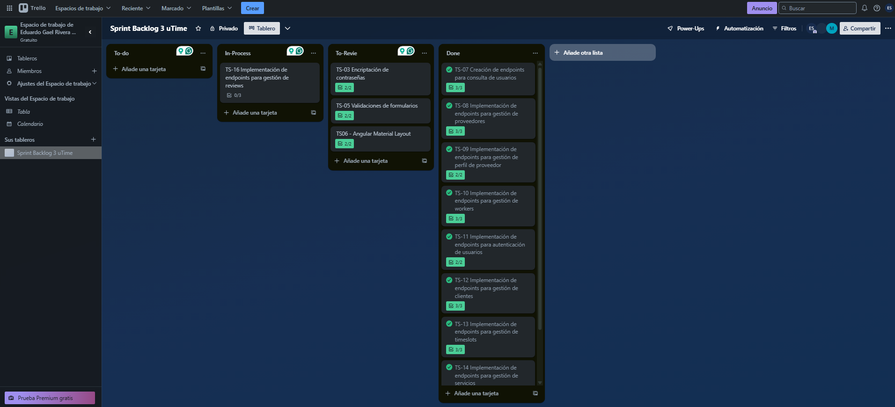
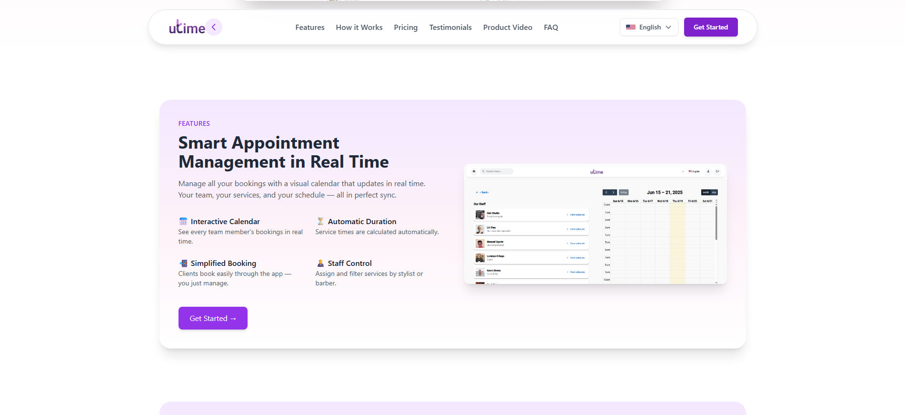
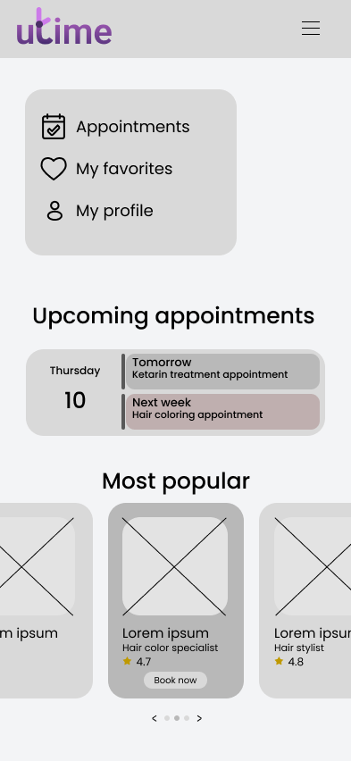
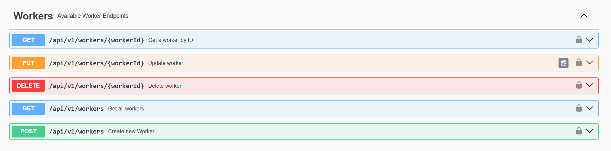
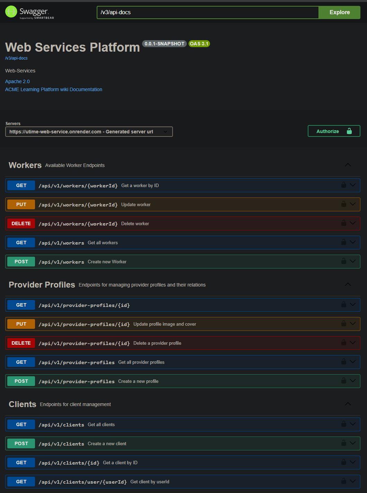
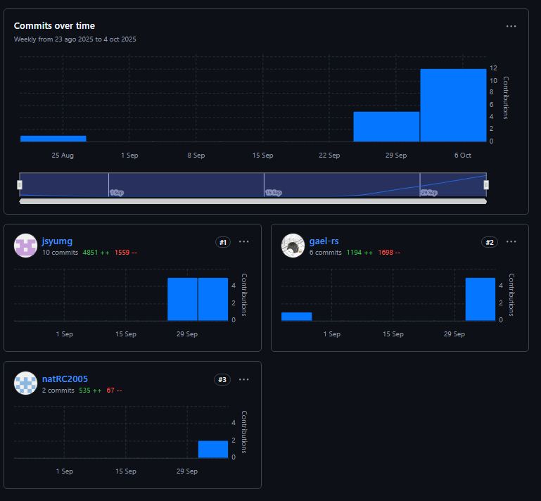
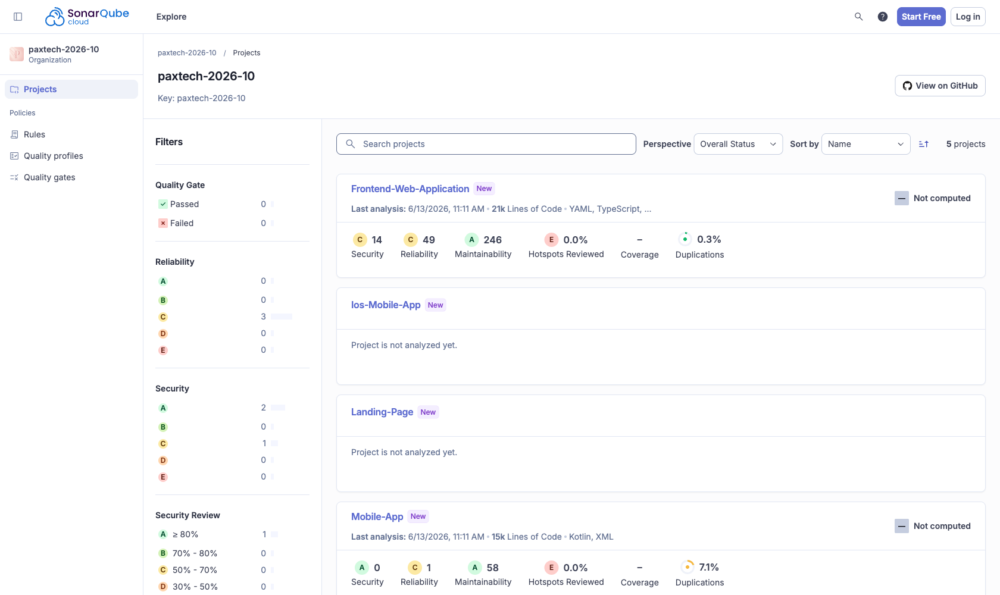
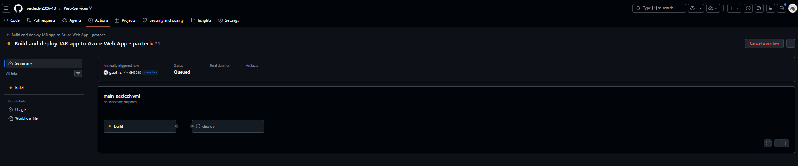
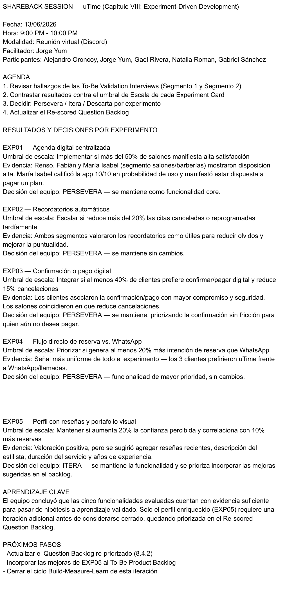

<div style="text-align: center;">
  
</div>

<h2 style="text-align: center;"> Universidad Peruana de Ciencias Aplicadas </h2>

<h4 style="text-align: center"> Ingeniería de Software </h4>

<h4 style="text-align: center"> Periodo: 202610 </h4>

<h4 style="text-align: center"> [CÓDIGO-CURSO] | [NOMBRE-CURSO] </h4>

<h4 style="text-align: center"> NRC: [NRC] </h4>

<h4 style="text-align: center"> Sección: [SECCIÓN] </h4>

<h4 style="text-align: center"> Docente: [DOCENTE] </h4>

<h3 style="text-align: center;"> Informe del Trabajo Final </h3>

<h4 style="text-align: center"> Startup: [STARTUP] </h4>

<h4 style="text-align: center"> Producto: [PRODUCTO] </h4>

<h4 style="text-align: center">Integrantes:</h4>

<div style="text-align:center; margin-top: 10px; font-size: 90%; line-height: 1.6;">
   <table style="margin-left: auto; margin-right: auto;">
      <tr>
         <th>Código</th>
         <th>Apellidos y Nombres</th>
      </tr>
      <tr>
         <td>[CÓDIGO 1]</td>
         <td>[APELLIDOS Y NOMBRES 1]</td>
      </tr>
      <tr>
         <td>[CÓDIGO 2]</td>
         <td>[APELLIDOS Y NOMBRES 2]</td>
      </tr>
      <tr>
         <td>[CÓDIGO 3]</td>
         <td>[APELLIDOS Y NOMBRES 3]</td>
      </tr>
      <tr>
         <td>[CÓDIGO 4]</td>
         <td>[APELLIDOS Y NOMBRES 4]</td>
      </tr>
      <tr>
         <td>[CÓDIGO 5]</td>
         <td>[APELLIDOS Y NOMBRES 5]</td>
      </tr>
   </table>
</div>

<br>

<h5 style="text-align: center; font-style: italic;"> Abril 2026 </h5>

<hr class="page-break">

# Registro de Versiones del Informe

| Version | Fecha | Autor | Descripción de modificación |
|---------|-------|-------|-----------------------------|
|         |       |       |                             |

<hr class="page-break">

# Project Report Collaboration Insights

En esta sección se presenta un resumen de las actividades de colaboración realizadas para la elaboración del informe del proyecto.

Se utilizó **GitHub** como plataforma de control de versiones y colaboración en equipo. Se incluye el enlace para acceder al repositorio del reporte del proyecto. [Ver en GitHub]([URL-REPOSITORIO])

Los integrantes del equipo y sus nombres de usuario en GitHub son los siguientes:

| Integrantes                  | Nombre en GitHub   |
|------------------------------|--------------------|
| [APELLIDOS Y NOMBRES 1]      | `[github-user-1]`  |
| [APELLIDOS Y NOMBRES 2]      | `[github-user-2]`  |
| [APELLIDOS Y NOMBRES 3]      | `[github-user-3]`  |
| [APELLIDOS Y NOMBRES 4]      | `[github-user-4]`  |
| [APELLIDOS Y NOMBRES 5]      | `[github-user-5]`  |

Se usó el flujo de trabajo **GitFlow**, que incluye las siguientes ramas principales:

- **main:** Rama principal que contiene la versión estable y consolidada del documento.
- **develop:** Rama de integración utilizada para fusionar los cambios realizados en las ramas de características.
- **feature/feature-name:** Ramas de características utilizadas para desarrollar secciones específicas del informe, como `feature/chapter-1`, `feature/chapter-2`, etc.
- **release/vX.X.X:** Rama creada para preparar versiones candidatas al reporte final, siguiendo *Semantic Versioning 2.0.0*. En esta rama se realizan ajustes finales como correcciones menores y revisiones antes de integrarla a `main`.
- **hotfix/fix-name:** Rama utilizada para aplicar correcciones críticas directamente sobre `main`, asegurando la estabilidad de la versión publicada.

## TB1

**Tareas**

Para el desarrollo del TB1, cada participante del equipo realizó las siguientes tareas:

| Integrantes                | Tarea asignada |
|----------------------------|----------------|
| [APELLIDOS Y NOMBRES 1]    |                |
| [APELLIDOS Y NOMBRES 2]    |                |
| [APELLIDOS Y NOMBRES 3]    |                |
| [APELLIDOS Y NOMBRES 4]    |                |
| [APELLIDOS Y NOMBRES 5]    |                |

**GitHub Collaboration Insights**

En GitHub se presenta un timeline de las principales ramas creadas por cada integrante del equipo, así como los procesos de merge realizados. Todas las ramas fueron gestionadas siguiendo el flujo de trabajo **GitFlow**.

<div style="text-align: center; margin-top: 1rem; margin-bottom: 1rem;">

Gráfico de red (*network graph*) de ramas en el repositorio de GitHub.


</div>

<div style="text-align: center; margin-top: 1rem; margin-bottom: 1rem;">

Análisis de líneas de código añadidas por contribuyente.


</div>

<div style="text-align: center; margin-top: 1rem; margin-bottom: 1rem;">

Análisis de cantidad de commits realizados por semana.


</div>

## TP

**Tareas**

| Integrantes                | Tarea asignada |
|----------------------------|----------------|
| [APELLIDOS Y NOMBRES 1]    |                |
| [APELLIDOS Y NOMBRES 2]    |                |
| [APELLIDOS Y NOMBRES 3]    |                |
| [APELLIDOS Y NOMBRES 4]    |                |
| [APELLIDOS Y NOMBRES 5]    |                |

**GitHub Collaboration Insights**

<div style="text-align: center; margin-top: 1rem; margin-bottom: 1rem;">


</div>

<div style="text-align: center; margin-top: 1rem; margin-bottom: 1rem;">


</div>

<div style="text-align: center; margin-top: 1rem; margin-bottom: 1rem;">


</div>

## TB2

**Tareas**

| Integrantes                | Tarea asignada |
|----------------------------|----------------|
| [APELLIDOS Y NOMBRES 1]    |                |
| [APELLIDOS Y NOMBRES 2]    |                |
| [APELLIDOS Y NOMBRES 3]    |                |
| [APELLIDOS Y NOMBRES 4]    |                |
| [APELLIDOS Y NOMBRES 5]    |                |

**GitHub Collaboration Insights**

<div style="text-align: center; margin-top: 1rem; margin-bottom: 1rem;">


</div>

<div style="text-align: center; margin-top: 1rem; margin-bottom: 1rem;">


</div>

<div style="text-align: center; margin-top: 1rem; margin-bottom: 1rem;">


</div>

## TF

**Tareas**

| Integrantes                | Tarea asignada |
|----------------------------|----------------|
| [APELLIDOS Y NOMBRES 1]    |                |
| [APELLIDOS Y NOMBRES 2]    |                |
| [APELLIDOS Y NOMBRES 3]    |                |
| [APELLIDOS Y NOMBRES 4]    |                |
| [APELLIDOS Y NOMBRES 5]    |                |

**GitHub Collaboration Insights**

<div style="text-align: center; margin-top: 1rem; margin-bottom: 1rem;">


</div>

<div style="text-align: center; margin-top: 1rem; margin-bottom: 1rem;">


</div>

<div style="text-align: center; margin-top: 1rem; margin-bottom: 1rem;">


</div>

<hr class="page-break">

# Contenido

- [Student Outcome](#student-outcome)

- **Part I: As-Is Software Project**
   - [Capítulo I: Introducción](#capítulo-i-introducción)
      - [1.1. Startup Profile](#11-startup-profile)
         - [1.1.1. Descripción de la Startup](#111-descripción-de-la-startup)
         - [1.1.2. Perfiles de integrantes del equipo](#112-perfiles-de-integrantes-del-equipo)
      - [1.2. Solution Profile](#12-solution-profile)
         - [1.2.1. Antecedentes y problemática](#121-antecedentes-y-problemática)
         - [1.2.2. Lean UX Process](#122-lean-ux-process)
            - [1.2.2.1. Lean UX Problem Statements](#1221-lean-ux-problem-statements)
            - [1.2.2.2. Lean UX Assumptions](#1222-lean-ux-assumptions)
            - [1.2.2.3. Lean UX Hypothesis Statements](#1223-lean-ux-hypothesis-statements)
            - [1.2.2.4. Lean UX Canvas](#1224-lean-ux-canvas)
      - [1.3. Segmentos objetivo](#13-segmentos-objetivo)

   - [Capítulo II: Requirements Elicitation & Analysis](#capítulo-ii-requirements-elicitation--analysis)
      - [2.1. Competidores](#21-competidores)
         - [2.1.1. Análisis competitivo](#211-análisis-competitivo)
         - [2.1.2. Estrategias y tácticas frente a competidores](#212-estrategias-y-tácticas-frente-a-competidores)
      - [2.2. Entrevistas](#22-entrevistas)
         - [2.2.1. Diseño de entrevistas](#221-diseño-de-entrevistas)
         - [2.2.2. Registro de entrevistas](#222-registro-de-entrevistas)
         - [2.2.3. Análisis de entrevistas](#223-análisis-de-entrevistas)
      - [2.3. Needfinding](#23-needfinding)
         - [2.3.1. User Personas](#231-user-personas)
         - [2.3.2. User Task Matrix](#232-user-task-matrix)
         - [2.3.3. User Journey Mapping](#233-user-journey-mapping)
         - [2.3.4. Empathy Mapping](#234-empathy-mapping)
         - [2.3.5. As-is Scenario Mapping](#235-as-is-scenario-mapping)
      - [2.4. Ubiquitous Language](#24-ubiquitous-language)

   - [Capítulo III: Requirements Specification](#capítulo-iii-requirements-specification)
      - [3.1. To-Be Scenario Mapping](#31-to-be-scenario-mapping)
      - [3.2. User Stories](#32-user-stories)
      - [3.3. Product Backlog](#33-product-backlog)
      - [3.4. Impact Mapping](#34-impact-mapping)

   - [Capítulo IV: Product Design](#capítulo-iv-product-design)
      - [4.1. Style Guidelines](#41-style-guidelines)
         - [4.1.1. General Style Guidelines](#411-general-style-guidelines)
         - [4.1.2. Web Style Guidelines](#412-web-style-guidelines)
         - [4.1.3. Mobile Style Guidelines](#413-mobile-style-guidelines)
            - [4.1.3.1. iOS Mobile Style Guidelines](#4131-ios-mobile-style-guidelines)
            - [4.1.3.2. Android Mobile Style Guidelines](#4132-android-mobile-style-guidelines)
      - [4.2. Information Architecture](#42-information-architecture)
         - [4.2.1. Organization Systems](#421-organization-systems)
         - [4.2.2. Labeling Systems](#422-labeling-systems)
         - [4.2.3. SEO Tags and Meta Tags](#423-seo-tags-and-meta-tags)
         - [4.2.4. Searching Systems](#424-searching-systems)
         - [4.2.5. Navigation Systems](#425-navigation-systems)
      - [4.3. Landing Page UI Design](#43-landing-page-ui-design)
         - [4.3.1. Landing Page Wireframe](#431-landing-page-wireframe)
         - [4.3.2. Landing Page Mock-up](#432-landing-page-mock-up)
      - [4.4. Mobile Applications UX/UI Design](#44-mobile-applications-uxui-design)
         - [4.4.1. Mobile Applications Wireframes](#441-mobile-applications-wireframes)
         - [4.4.2. Mobile Applications Wireflow Diagrams](#442-mobile-applications-wireflow-diagrams)
         - [4.4.3. Mobile Applications Mock-ups](#443-mobile-applications-mock-ups)
         - [4.4.4. Mobile Applications User Flow Diagrams](#444-mobile-applications-user-flow-diagrams)
      - [4.5. Mobile Applications Prototyping](#45-mobile-applications-prototyping)
         - [4.5.1. Android Mobile Applications Prototyping](#451-android-mobile-applications-prototyping)
         - [4.5.2. iOS Mobile Applications Prototyping](#452-ios-mobile-applications-prototyping)
      - [4.6. Web Applications UX/UI Design](#46-web-applications-uxui-design)
         - [4.6.1. Web Applications Wireframes](#461-web-applications-wireframes)
         - [4.6.2. Web Applications Wireflow Diagrams](#462-web-applications-wireflow-diagrams)
         - [4.6.3. Web Applications Mock-ups](#463-web-applications-mock-ups)
         - [4.6.4. Web Applications User Flow Diagrams](#464-web-applications-user-flow-diagrams)
      - [4.7. Web Applications Prototyping](#47-web-applications-prototyping)
      - [4.8. Domain-Driven Software Architecture](#48-domain-driven-software-architecture)
         - [4.8.1. Software Architecture Context Diagram](#481-software-architecture-context-diagram)
         - [4.8.2. Software Architecture Container Diagrams](#482-software-architecture-container-diagrams)
         - [4.8.3. Software Architecture Components Diagrams](#483-software-architecture-components-diagrams)
      - [4.9. Software Object-Oriented Design](#49-software-object-oriented-design)
         - [4.9.1. Class Diagrams](#491-class-diagrams)
         - [4.9.2. Class Dictionary](#492-class-dictionary)
      - [4.10. Database Design](#410-database-design)
         - [4.10.1. Relational/Non-Relational Database Diagram](#4101-relationalnon-relational-database-diagram)

   - [Capítulo V: Product Implementation](#capítulo-v-product-implementation)
      - [5.1. Software Configuration Management](#51-software-configuration-management)
         - [5.1.1. Software Development Environment Configuration](#511-software-development-environment-configuration)
         - [5.1.2. Source Code Management](#512-source-code-management)
         - [5.1.3. Source Code Style Guide & Conventions](#513-source-code-style-guide--conventions)
         - [5.1.4. Software Deployment Configuration](#514-software-deployment-configuration)
      - [5.2. Product Implementation & Deployment](#52-product-implementation--deployment)
         - [5.2.1. Sprint Backlogs](#521-sprint-backlogs)
         - [5.2.2. Implemented Landing Page Evidence](#522-implemented-landing-page-evidence)
         - [5.2.3. Implemented Frontend-Web Application Evidence](#523-implemented-frontend-web-application-evidence)
         - [5.2.4. Acuerdo de Servicio - SaaS](#524-acuerdo-de-servicio---saas)
         - [5.2.5. Implemented Native-Mobile Application Evidence](#525-implemented-native-mobile-application-evidence)
         - [5.2.6. Implemented RESTful API and/or Serverless Backend Evidence](#526-implemented-restful-api-andor-serverless-backend-evidence)
         - [5.2.7. RESTful API documentation](#527-restful-api-documentation)
         - [5.2.8. Team Collaboration Insights](#528-team-collaboration-insights)
      - [5.3. Video About-the-Product](#53-video-about-the-product)

- **Part II: Verification, Validation & Pipeline**
   - [Capítulo VI: Product Verification & Validation](#capítulo-vi-product-verification--validation)
      - [6.1. Testing Suites & Validation](#61-testing-suites--validation)
         - [6.1.1. Core Entities Unit Tests](#611-core-entities-unit-tests)
         - [6.1.2. Core Integration Tests](#612-core-integration-tests)
         - [6.1.3. Core Behavior-Driven Development](#613-core-behavior-driven-development)
         - [6.1.4. Core System Tests](#614-core-system-tests)
      - [6.2. Static testing & Verification](#62-static-testing--verification)
         - [6.2.1. Static Code Analysis](#621-static-code-analysis)
            - [6.2.1.1. Coding standard & Code conventions](#6211-coding-standard--code-conventions)
            - [6.2.1.2. Code Quality & Code Security](#6212-code-quality--code-security)
         - [6.2.2. Reviews](#622-reviews)
      - [6.3. Validation Interviews](#63-validation-interviews)
         - [6.3.1. Diseño de Entrevistas](#631-diseño-de-entrevistas)
         - [6.3.2. Registro de Entrevistas](#632-registro-de-entrevistas)
         - [6.3.3. Evaluaciones según heurísticas](#633-evaluaciones-según-heurísticas)
      - [6.4. Auditoría de Experiencias de Usuario](#64-auditoría-de-experiencias-de-usuario)
         - [6.4.1. Auditoría realizada](#641-auditoría-realizada)
            - [6.4.1.1. Información del grupo auditado](#6411-información-del-grupo-auditado)
            - [6.4.1.2. Cronograma de auditoría realizada](#6412-cronograma-de-auditoría-realizada)
            - [6.4.1.3. Contenido de auditoría realizada](#6413-contenido-de-auditoría-realizada)
         - [6.4.2. Auditoría recibida](#642-auditoría-recibida)
            - [6.4.2.1. Información del grupo auditor](#6421-información-del-grupo-auditor)
            - [6.4.2.2. Cronograma de auditoría recibida](#6422-cronograma-de-auditoría-recibida)
            - [6.4.2.3. Contenido de auditoría recibida](#6423-contenido-de-auditoría-recibida)
            - [6.4.2.4. Resumen de modificaciones para subsanar hallazgos](#6424-resumen-de-modificaciones-para-subsanar-hallazgos)

   - [Capítulo VII: DevOps Practices](#capítulo-vii-devops-practices)
      - [7.1. Continuous Integration](#71-continuous-integration)
         - [7.1.1. Tools and Practices](#711-tools-and-practices)
         - [7.1.2. Build & Test Suite Pipeline Components](#712-build--test-suite-pipeline-components)
      - [7.2. Continuous Delivery](#72-continuous-delivery)
         - [7.2.1. Tools and Practices](#721-tools-and-practices)
         - [7.2.2. Stages Deployment Pipeline Components](#722-stages-deployment-pipeline-components)
      - [7.3. Continuous Deployment](#73-continuous-deployment)
         - [7.3.1. Tools and Practices](#731-tools-and-practices)
         - [7.3.2. Production Deployment Pipeline Components](#732-production-deployment-pipeline-components)
      - [7.4. Continuous Monitoring](#74-continuous-monitoring)
         - [7.4.1. Tools and Practices](#741-tools-and-practices)
         - [7.4.2. Monitoring Pipeline Components](#742-monitoring-pipeline-components)
         - [7.4.3. Alerting Pipeline Components](#743-alerting-pipeline-components)
         - [7.4.4. Notification Pipeline Components](#744-notification-pipeline-components)

- **Part III: Experiment-Driven Lifecycle**
   - [Capítulo VIII: Experiment-Driven Development](#capítulo-viii-experiment-driven-development)
      - [8.1. Experiment Planning](#81-experiment-planning)
         - [8.1.1. As-Is Summary](#811-as-is-summary)
         - [8.1.2. Raw Material: Assumptions, Knowledge Gaps, Ideas, Claims](#812-raw-material-assumptions-knowledge-gaps-ideas-claims)
         - [8.1.3. Experiment-Ready Questions](#813-experiment-ready-questions)
         - [8.1.4. Question Backlog](#814-question-backlog)
         - [8.1.5. Experiment Cards](#815-experiment-cards)
      - [8.2. Experiment Design](#82-experiment-design)
         - [8.2.1. Hypotheses](#821-hypotheses)
         - [8.2.2. Domain Business Metrics](#822-domain-business-metrics)
         - [8.2.3. Measures](#823-measures)
         - [8.2.4. Conditions](#824-conditions)
         - [8.2.5. Scale Calculations and Decisions](#825-scale-calculations-and-decisions)
         - [8.2.6. Methods Selection](#826-methods-selection)
         - [8.2.7. Data Analytics: Goals, KPIs and Metrics Selection](#827-data-analytics-goals-kpis-and-metrics-selection)
         - [8.2.8. Web and Mobile Tracking Plan](#828-web-and-mobile-tracking-plan)
      - [8.3. Experimentation](#83-experimentation)
         - [8.3.1. To-Be User Stories](#831-to-be-user-stories)
         - [8.3.2. To-Be Product Backlog](#832-to-be-product-backlog)
         - [8.3.3. Pipeline-supported, Experiment-Driven To-Be Software Platform Lifecycle](#833-pipeline-supported-experiment-driven-to-be-software-platform-lifecycle)
            - [8.3.3.1. To-Be Sprint Backlogs](#8331-to-be-sprint-backlogs)
            - [8.3.3.2. Implemented To-Be Landing Page Evidence](#8332-implemented-to-be-landing-page-evidence)
            - [8.3.3.3. Implemented To-Be Frontend-Web Application Evidence](#8333-implemented-to-be-frontend-web-application-evidence)
            - [8.3.3.4. Implemented To-Be Native-Mobile Application Evidence](#8334-implemented-to-be-native-mobile-application-evidence)
            - [8.3.3.5. Implemented To-Be RESTful API and/or Serverless Backend Evidence](#8335-implemented-to-be-restful-api-andor-serverless-backend-evidence)
            - [8.3.3.6. Team Collaboration Insights](#8336-team-collaboration-insights)
         - [8.3.4. To-Be Validation Interviews](#834-to-be-validation-interviews)
            - [8.3.4.1. Diseño de Entrevistas](#8341-diseño-de-entrevistas)
            - [8.3.4.2. Registro de Entrevistas](#8342-registro-de-entrevistas)
      - [8.4. Experiment Aftermath & Analysis](#84-experiment-aftermath--analysis)
         - [8.4.1. Analysis and Interpretation of Results](#841-analysis-and-interpretation-of-results)
         - [8.4.2. Re-scored and Re-prioritized Question Backlog](#842-re-scored-and-re-prioritized-question-backlog)
      - [8.5. Continuous Learning](#85-continuous-learning)
         - [8.5.1. Shareback Session Artifacts: Learning Workflow](#851-shareback-session-artifacts-learning-workflow)
      - [8.6. To-Be Software Platform Pre-launch](#86-to-be-software-platform-pre-launch)
         - [8.6.1. About-the-Product Intro Video](#861-about-the-product-intro-video)

- [Conclusiones](#conclusiones)
   - [Conclusiones y recomendaciones](#conclusiones-y-recomendaciones)
- [Video App Validation](#video-app-validation)
- [Video About-the-Team](#video-about-the-team)
- [Bibliografía](#bibliografía)
- [Anexos](#anexos)

<hr class="page-break">

# Student Outcome

<table>
  <thead>
    <tr>
      <th>Criterio específico</th>
      <th>Acciones realizadas</th>
      <th>Conclusiones</th>
    </tr>
  </thead>
  <tbody>
    <tr>
      <td rowspan="5"><strong>[Criterio 1 — por definir]</strong></td>
      <td><strong>[APELLIDOS Y NOMBRES 1]</strong><br><b>TB1:</b> [Contenido pendiente]<br><b>TP:</b> [Contenido pendiente]<br><b>TB2:</b> [Contenido pendiente]<br><b>TF:</b> [Contenido pendiente]</td>
      <td rowspan="5"><b>TB1:</b> [Contenido pendiente]<br><b>TP:</b> [Contenido pendiente]<br><b>TB2:</b> [Contenido pendiente]<br><b>TF:</b> [Contenido pendiente]</td>
    </tr>
    <tr>
      <td><strong>[APELLIDOS Y NOMBRES 2]</strong><br><b>TB1:</b> [Contenido pendiente]<br><b>TP:</b> [Contenido pendiente]<br><b>TB2:</b> [Contenido pendiente]<br><b>TF:</b> [Contenido pendiente]</td>
    </tr>
    <tr>
      <td><strong>[APELLIDOS Y NOMBRES 3]</strong><br><b>TB1:</b> [Contenido pendiente]<br><b>TP:</b> [Contenido pendiente]<br><b>TB2:</b> [Contenido pendiente]<br><b>TF:</b> [Contenido pendiente]</td>
    </tr>
    <tr>
      <td><strong>[APELLIDOS Y NOMBRES 4]</strong><br><b>TB1:</b> [Contenido pendiente]<br><b>TP:</b> [Contenido pendiente]<br><b>TB2:</b> [Contenido pendiente]<br><b>TF:</b> [Contenido pendiente]</td>
    </tr>
    <tr>
      <td><strong>[APELLIDOS Y NOMBRES 5]</strong><br><b>TB1:</b> [Contenido pendiente]<br><b>TP:</b> [Contenido pendiente]<br><b>TB2:</b> [Contenido pendiente]<br><b>TF:</b> [Contenido pendiente]</td>
    </tr>
    <tr>
      <td rowspan="5"><strong>[Criterio 2 — por definir]</strong></td>
      <td><strong>[APELLIDOS Y NOMBRES 1]</strong><br><b>TB1:</b> [Contenido pendiente]<br><b>TP:</b> [Contenido pendiente]<br><b>TB2:</b> [Contenido pendiente]<br><b>TF:</b> [Contenido pendiente]</td>
      <td rowspan="5"><b>TB1:</b> [Contenido pendiente]<br><b>TP:</b> [Contenido pendiente]<br><b>TB2:</b> [Contenido pendiente]<br><b>TF:</b> [Contenido pendiente]</td>
    </tr>
    <tr>
      <td><strong>[APELLIDOS Y NOMBRES 2]</strong><br><b>TB1:</b> [Contenido pendiente]<br><b>TP:</b> [Contenido pendiente]<br><b>TB2:</b> [Contenido pendiente]<br><b>TF:</b> [Contenido pendiente]</td>
    </tr>
    <tr>
      <td><strong>[APELLIDOS Y NOMBRES 3]</strong><br><b>TB1:</b> [Contenido pendiente]<br><b>TP:</b> [Contenido pendiente]<br><b>TB2:</b> [Contenido pendiente]<br><b>TF:</b> [Contenido pendiente]</td>
    </tr>
    <tr>
      <td><strong>[APELLIDOS Y NOMBRES 4]</strong><br><b>TB1:</b> [Contenido pendiente]<br><b>TP:</b> [Contenido pendiente]<br><b>TB2:</b> [Contenido pendiente]<br><b>TF:</b> [Contenido pendiente]</td>
    </tr>
    <tr>
      <td><strong>[APELLIDOS Y NOMBRES 5]</strong><br><b>TB1:</b> [Contenido pendiente]<br><b>TP:</b> [Contenido pendiente]<br><b>TB2:</b> [Contenido pendiente]<br><b>TF:</b> [Contenido pendiente]</td>
    </tr>
  </tbody>
</table>

<hr class="page-break">

# Part I: As-Is Software Project

<hr class="page-break">

# Capítulo I: Introducción

[Contenido pendiente]

## 1.1. Startup Profile

[Contenido pendiente]

### 1.1.1. Descripción de la Startup

[Contenido pendiente — incluir: nombre del startup, misión, visión, valores, propuesta de valor, lema/slogan y logotipo.]

### 1.1.2. Perfiles de integrantes del equipo

| Foto | Nombre | Código | Carrera | Descripción de habilidades y conocimientos |
|------|--------|--------|---------|--------------------------------------------|
|  | [APELLIDOS Y NOMBRES 1] | [CÓDIGO 1] | [CARRERA] | [Contenido pendiente] |
|  | [APELLIDOS Y NOMBRES 2] | [CÓDIGO 2] | [CARRERA] | [Contenido pendiente] |
|  | [APELLIDOS Y NOMBRES 3] | [CÓDIGO 3] | [CARRERA] | [Contenido pendiente] |
|  | [APELLIDOS Y NOMBRES 4] | [CÓDIGO 4] | [CARRERA] | [Contenido pendiente] |
|  | [APELLIDOS Y NOMBRES 5] | [CÓDIGO 5] | [CARRERA] | [Contenido pendiente] |

## 1.2. Solution Profile

[Contenido pendiente]

### 1.2.1. Antecedentes y problemática

[Contenido pendiente — aplicar framework de las 5W + 2H.]

#### What (¿Qué?)

[Contenido pendiente]

#### When (¿Cuándo?)

[Contenido pendiente]

#### Where (¿Dónde?)

[Contenido pendiente]

#### Who (¿Quién?)

[Contenido pendiente]

#### Why (¿Por qué?)

[Contenido pendiente]

#### How (¿Cómo?)

[Contenido pendiente]

#### How much (¿Cuánto?)

[Contenido pendiente]

### 1.2.2. Lean UX Process

[Contenido pendiente]

#### 1.2.2.1. Lean UX Problem Statements

[Contenido pendiente]

#### 1.2.2.2. Lean UX Assumptions

##### Business Assumptions

[Contenido pendiente]

##### User Assumptions

[Contenido pendiente]

#### 1.2.2.3. Lean UX Hypothesis Statements

[Contenido pendiente]

#### 1.2.2.4. Lean UX Canvas

<div style="text-align: center; margin-top: 1rem; margin-bottom: 1rem;">

Lean UX Canvas del producto [PRODUCTO].


</div>

## 1.3. Segmentos objetivo

[Contenido pendiente — describir cada segmento objetivo con perfil demográfico, psicográfico y conductual.]

**Segmento 1: [Nombre del segmento]**

[Contenido pendiente]

**Segmento 2: [Nombre del segmento]**

[Contenido pendiente]

<hr class="page-break">

# Capítulo II: Requirements Elicitation & Analysis

[Contenido pendiente]

## 2.1. Competidores

[Contenido pendiente — identificar competidores directos e indirectos.]

### 2.1.1. Análisis competitivo

<table>
  <tr>
    <th colspan="6">Competitive Analysis Landscape</th>
  </tr>
  <tr>
    <td colspan="2" align="center"><b>¿Por qué llevar a cabo este análisis?</b></td>
    <td colspan="4">[Pregunta estratégica — qué buscamos aprender del mercado]</td>
  </tr>
  <tr>
    <th colspan="2">Nombre</th>
    <th>[PRODUCTO]</th>
    <th>[Competidor 1]</th>
    <th>[Competidor 2]</th>
    <th>[Competidor 3]</th>
  </tr>
  <tr>
    <td colspan="2" align="center"><b>Logo</b></td>
    <td align="center"></td>
    <td align="center"></td>
    <td align="center"></td>
    <td align="center"></td>
  </tr>
  <tr>
    <td rowspan="2"><b>Perfil</b></td>
    <td><b>Overview</b></td>
    <td>[Contenido pendiente]</td>
    <td>[Contenido pendiente]</td>
    <td>[Contenido pendiente]</td>
    <td>[Contenido pendiente]</td>
  </tr>
  <tr>
    <td><b>Ventaja competitiva</b></td>
    <td>[Contenido pendiente]</td>
    <td>[Contenido pendiente]</td>
    <td>[Contenido pendiente]</td>
    <td>[Contenido pendiente]</td>
  </tr>
  <tr>
    <td rowspan="2"><b>Perfil de Marketing</b></td>
    <td><b>Mercado objetivo</b></td>
    <td>[Contenido pendiente]</td>
    <td>[Contenido pendiente]</td>
    <td>[Contenido pendiente]</td>
    <td>[Contenido pendiente]</td>
  </tr>
  <tr>
    <td><b>Estrategias de marketing</b></td>
    <td>[Contenido pendiente]</td>
    <td>[Contenido pendiente]</td>
    <td>[Contenido pendiente]</td>
    <td>[Contenido pendiente]</td>
  </tr>
  <tr>
    <td rowspan="3"><b>Perfil de Producto</b></td>
    <td><b>Productos & Servicios</b></td>
    <td>[Contenido pendiente]</td>
    <td>[Contenido pendiente]</td>
    <td>[Contenido pendiente]</td>
    <td>[Contenido pendiente]</td>
  </tr>
  <tr>
    <td><b>Precios & Costos</b></td>
    <td>[Contenido pendiente]</td>
    <td>[Contenido pendiente]</td>
    <td>[Contenido pendiente]</td>
    <td>[Contenido pendiente]</td>
  </tr>
  <tr>
    <td><b>Canales de distribución</b></td>
    <td>[Contenido pendiente]</td>
    <td>[Contenido pendiente]</td>
    <td>[Contenido pendiente]</td>
    <td>[Contenido pendiente]</td>
  </tr>
  <tr>
    <td rowspan="4"><b>Análisis SWOT</b></td>
    <td><b>Fortalezas</b></td>
    <td>[Contenido pendiente]</td>
    <td>[Contenido pendiente]</td>
    <td>[Contenido pendiente]</td>
    <td>[Contenido pendiente]</td>
  </tr>
  <tr>
    <td><b>Debilidades</b></td>
    <td>[Contenido pendiente]</td>
    <td>[Contenido pendiente]</td>
    <td>[Contenido pendiente]</td>
    <td>[Contenido pendiente]</td>
  </tr>
  <tr>
    <td><b>Oportunidades</b></td>
    <td>[Contenido pendiente]</td>
    <td>[Contenido pendiente]</td>
    <td>[Contenido pendiente]</td>
    <td>[Contenido pendiente]</td>
  </tr>
  <tr>
    <td><b>Amenazas</b></td>
    <td>[Contenido pendiente]</td>
    <td>[Contenido pendiente]</td>
    <td>[Contenido pendiente]</td>
    <td>[Contenido pendiente]</td>
  </tr>
</table>

### 2.1.2. Estrategias y tácticas frente a competidores

[Contenido pendiente — listar estrategias derivadas del análisis anterior.]

## 2.2. Entrevistas

[Contenido pendiente]

### 2.2.1. Diseño de entrevistas

**Preguntas para [Segmento 1]:**

1. [Pregunta 1]
2. [Pregunta 2]
3. [Pregunta 3]

**Preguntas para [Segmento 2]:**

1. [Pregunta 1]
2. [Pregunta 2]
3. [Pregunta 3]

### 2.2.2. Registro de entrevistas

**Segmento 1 — Entrevista 1**

| Campo | Detalle |
|-------|---------|
| Nombre | [Nombre del entrevistado] |
| Edad | [Edad] |
| Ocupación | [Ocupación] |
| Distrito / Ciudad | [Ubicación] |
| Fecha de entrevista | [Fecha] |
| Duración | [Duración] |
| Entrevistador | [APELLIDOS Y NOMBRES] |
| URL del video | [URL] |
| Resumen | [Contenido pendiente] |

**Segmento 1 — Entrevista 2**

| Campo | Detalle |
|-------|---------|
| Nombre | [Nombre del entrevistado] |
| Edad | [Edad] |
| Ocupación | [Ocupación] |
| Distrito / Ciudad | [Ubicación] |
| Fecha de entrevista | [Fecha] |
| Duración | [Duración] |
| Entrevistador | [APELLIDOS Y NOMBRES] |
| URL del video | [URL] |
| Resumen | [Contenido pendiente] |

**Segmento 2 — Entrevista 1**

| Campo | Detalle |
|-------|---------|
| Nombre | [Nombre del entrevistado] |
| Edad | [Edad] |
| Ocupación | [Ocupación] |
| Distrito / Ciudad | [Ubicación] |
| Fecha de entrevista | [Fecha] |
| Duración | [Duración] |
| Entrevistador | [APELLIDOS Y NOMBRES] |
| URL del video | [URL] |
| Resumen | [Contenido pendiente] |

### 2.2.3. Análisis de entrevistas

**Hallazgos — Segmento 1**

[Contenido pendiente]

**Hallazgos — Segmento 2**

[Contenido pendiente]

## 2.3. Needfinding

[Contenido pendiente]

### 2.3.1. User Personas

<div style="text-align: center; margin-top: 1rem; margin-bottom: 1rem;">

User Persona — [Segmento 1]


</div>

<div style="text-align: center; margin-top: 1rem; margin-bottom: 1rem;">

User Persona — [Segmento 2]


</div>

### 2.3.2. User Task Matrix

| Tarea | [Persona 1] — Frecuencia | [Persona 1] — Importancia | [Persona 2] — Frecuencia | [Persona 2] — Importancia |
|-------|--------------------------|---------------------------|--------------------------|---------------------------|
|       |                          |                           |                          |                           |

### 2.3.3. User Journey Mapping

<div style="text-align: center; margin-top: 1rem; margin-bottom: 1rem;">

Journey Map — [Persona 1]


</div>

<div style="text-align: center; margin-top: 1rem; margin-bottom: 1rem;">

Journey Map — [Persona 2]


</div>

### 2.3.4. Empathy Mapping

<div style="text-align: center; margin-top: 1rem; margin-bottom: 1rem;">

Empathy Map — [Persona 1]


</div>

<div style="text-align: center; margin-top: 1rem; margin-bottom: 1rem;">

Empathy Map — [Persona 2]


</div>

### 2.3.5. As-is Scenario Mapping

<div style="text-align: center; margin-top: 1rem; margin-bottom: 1rem;">

As-is Scenario — [Persona 1]


</div>

<div style="text-align: center; margin-top: 1rem; margin-bottom: 1rem;">

As-is Scenario — [Persona 2]


</div>

## 2.4. Ubiquitous Language

| Término | Definición |
|---------|-----------|
|         |            |

<hr class="page-break">

# Capítulo III: Requirements Specification

[Contenido pendiente]

## 3.1. To-Be Scenario Mapping

<div style="text-align: center; margin-top: 1rem; margin-bottom: 1rem;">

To-Be Scenario — [Persona 1]


</div>

<div style="text-align: center; margin-top: 1rem; margin-bottom: 1rem;">

To-Be Scenario — [Persona 2]


</div>

## 3.2. User Stories

<table>
  <thead>
    <tr>
      <th>Epic / Story ID</th>
      <th>Título</th>
      <th>Descripción</th>
      <th>Criterios de aceptación</th>
      <th>Relacionado con (Epic ID)</th>
    </tr>
  </thead>
  <tbody>
    <tr>
      <td>EP01</td>
      <td>[Título de épica]</td>
      <td>[Descripción]</td>
      <td>[Criterios]</td>
      <td>—</td>
    </tr>
    <tr>
      <td>US01</td>
      <td>[Título de user story]</td>
      <td>Como [rol], quiero [acción] para [beneficio].</td>
      <td><b>Scenario 1:</b> [Contenido pendiente]<br><b>Scenario 2:</b> [Contenido pendiente]</td>
      <td>EP01</td>
    </tr>
  </tbody>
</table>

## 3.3. Product Backlog

<table>
  <thead>
    <tr>
      <th># Orden</th>
      <th>User Story Id</th>
      <th>Título</th>
      <th>Descripción</th>
      <th>Story Points (1 / 2 / 3 / 5 / 8)</th>
    </tr>
  </thead>
  <tbody>
    <tr>
      <td>1</td>
      <td>US01</td>
      <td>[Título]</td>
      <td>[Descripción]</td>
      <td></td>
    </tr>
  </tbody>
</table>

<div style="text-align: center; margin-top: 1rem; margin-bottom: 1rem;">

Product Backlog en Jira/Pivotal Tracker.



</div>

## 3.4. Impact Mapping

<div style="text-align: center; margin-top: 1rem; margin-bottom: 1rem;">

Impact Map del producto [PRODUCTO].


</div>

<hr class="page-break">

# Capítulo IV: Product Design

[Contenido pendiente]

## 4.1. Style Guidelines

[Contenido pendiente]

### 4.1.1. General Style Guidelines

**Branding**

[Contenido pendiente — incluir marca, slogan, logos.]

**Typography**

[Contenido pendiente — fuentes y jerarquía tipográfica.]

**Colors**

[Contenido pendiente — paleta primaria, secundaria y semántica.]

**Spacing**

[Contenido pendiente — sistema de espaciado / grid base.]

### 4.1.2. Web Style Guidelines

[Contenido pendiente — reglas específicas para web (breakpoints, componentes).]

### 4.1.3. Mobile Style Guidelines

[Contenido pendiente]

#### 4.1.3.1. iOS Mobile Style Guidelines

[Contenido pendiente — lineamientos de Human Interface Guidelines aplicados.]

#### 4.1.3.2. Android Mobile Style Guidelines

[Contenido pendiente — lineamientos de Material Design aplicados.]

## 4.2. Information Architecture

[Contenido pendiente]

### 4.2.1. Organization Systems

[Contenido pendiente]

### 4.2.2. Labeling Systems

[Contenido pendiente]

### 4.2.3. SEO Tags and Meta Tags

[Contenido pendiente — metadatos, Open Graph, keywords.]

### 4.2.4. Searching Systems

[Contenido pendiente]

### 4.2.5. Navigation Systems

[Contenido pendiente]

## 4.3. Landing Page UI Design

### 4.3.1. Landing Page Wireframe

<div style="text-align: center; margin-top: 1rem; margin-bottom: 1rem;">

Wireframe de la Landing Page.


</div>

### 4.3.2. Landing Page Mock-up

<div style="text-align: center; margin-top: 1rem; margin-bottom: 1rem;">

Mock-up de la Landing Page.


</div>

## 4.4. Mobile Applications UX/UI Design

### 4.4.1. Mobile Applications Wireframes

<div style="text-align: center; margin-top: 1rem; margin-bottom: 1rem;">

Wireframes Mobile — [Rol 1]


</div>

<div style="text-align: center; margin-top: 1rem; margin-bottom: 1rem;">

Wireframes Mobile — [Rol 2]


</div>

### 4.4.2. Mobile Applications Wireflow Diagrams

<div style="text-align: center; margin-top: 1rem; margin-bottom: 1rem;">

Wireflow Mobile — [Rol 1]


</div>

### 4.4.3. Mobile Applications Mock-ups

<div style="text-align: center; margin-top: 1rem; margin-bottom: 1rem;">

Mock-up Mobile — [Rol 1]


</div>

### 4.4.4. Mobile Applications User Flow Diagrams

<div style="text-align: center; margin-top: 1rem; margin-bottom: 1rem;">

User Flow Mobile — [Rol 1]


</div>

## 4.5. Mobile Applications Prototyping

### 4.5.1. Android Mobile Applications Prototyping

<div style="text-align: center; margin-top: 1rem; margin-bottom: 1rem;">

Prototipo Android — [PRODUCTO]


[Ver prototipo interactivo en Figma]([URL-FIGMA-ANDROID])

</div>

### 4.5.2. iOS Mobile Applications Prototyping

<div style="text-align: center; margin-top: 1rem; margin-bottom: 1rem;">

Prototipo iOS — [PRODUCTO]


[Ver prototipo interactivo en Figma]([URL-FIGMA-IOS])

</div>

## 4.6. Web Applications UX/UI Design

### 4.6.1. Web Applications Wireframes

<div style="text-align: center; margin-top: 1rem; margin-bottom: 1rem;">

Wireframes Web — [Rol 1]


</div>

### 4.6.2. Web Applications Wireflow Diagrams

<div style="text-align: center; margin-top: 1rem; margin-bottom: 1rem;">

Wireflow Web — [Rol 1]


</div>

### 4.6.3. Web Applications Mock-ups

<div style="text-align: center; margin-top: 1rem; margin-bottom: 1rem;">

Mock-up Web — [Rol 1]


</div>

### 4.6.4. Web Applications User Flow Diagrams

<div style="text-align: center; margin-top: 1rem; margin-bottom: 1rem;">

User Flow Web — [Rol 1]


</div>

## 4.7. Web Applications Prototyping

<div style="text-align: center; margin-top: 1rem; margin-bottom: 1rem;">

Prototipo Web — [PRODUCTO]


[Ver prototipo interactivo en Figma]([URL-FIGMA-WEB])

</div>

## 4.8. Domain-Driven Software Architecture

[Contenido pendiente]

### 4.8.1. Software Architecture Context Diagram

<div style="text-align: center; margin-top: 1rem; margin-bottom: 1rem;">

Diagrama de Contexto (C4 — Nivel 1).


</div>

### 4.8.2. Software Architecture Container Diagrams

<div style="text-align: center; margin-top: 1rem; margin-bottom: 1rem;">

Diagrama de Contenedores (C4 — Nivel 2).


</div>

### 4.8.3. Software Architecture Components Diagrams

<div style="text-align: center; margin-top: 1rem; margin-bottom: 1rem;">

Diagrama de Componentes (C4 — Nivel 3) — Bounded Context [X].


</div>

## 4.9. Software Object-Oriented Design

### 4.9.1. Class Diagrams

<div style="text-align: center; margin-top: 1rem; margin-bottom: 1rem;">

Diagrama de Clases del dominio.


</div>

### 4.9.2. Class Dictionary

| Clase | Atributos | Métodos | Descripción |
|-------|-----------|---------|-------------|
|       |           |         |             |

## 4.10. Database Design

### 4.10.1. Relational/Non-Relational Database Diagram

<div style="text-align: center; margin-top: 1rem; margin-bottom: 1rem;">

Modelo de base de datos.


</div>

<hr class="page-break">

# Capítulo V: Product Implementation

[Contenido pendiente]

## 5.1. Software Configuration Management

### 5.1.1. Software Development Environment Configuration

**Project Management:** [herramienta — Jira / Pivotal Tracker]  
**Requirements Management:** [herramienta]  
**Product UX/UI Design:** [herramienta — Figma / Lucidchart]  
**Software Development:**
- Web Frontend: [stack tecnológico]
- Mobile: [stack tecnológico]
- Backend / API: [stack tecnológico]
- Base de datos: [motor]

**Software Deployment:** [plataforma — AWS / Azure / Vercel / Netlify]  
**Software Documentation:** [herramienta — Swagger / Postman / Redoc]

### 5.1.2. Source Code Management

Se utiliza **GitHub** con flujo de trabajo **GitFlow**. Convenciones de ramas:

- `main`
- `develop`
- `feature/<feature-name>`
- `release/vX.X.X`
- `hotfix/<fix-name>`

**Convenciones de commits (Conventional Commits):**

```
<tipo>(<alcance>): <resumen ≤ 72 caracteres>
```

Tipos: `feat`, `fix`, `docs`, `style`, `refactor`, `test`, `chore`.

### 5.1.3. Source Code Style Guide & Conventions

[Contenido pendiente — estilos por tecnología.]

- **HTML:** [Guía referenciada]
- **CSS:** [Guía referenciada]
- **JavaScript / TypeScript:** [Guía referenciada]
- **[Framework frontend]:** [Guía referenciada]
- **[Framework backend]:** [Guía referenciada]
- **Gherkin:** [Convenciones]

### 5.1.4. Software Deployment Configuration

[Contenido pendiente — describir pipeline, ambientes, variables.]

## 5.2. Product Implementation & Deployment

### 5.2.1. Sprint Backlogs

#### Sprint #1

**Sprint Planning Background**

| Campo | Detalle |
|-------|---------|
| Date | [Fecha] |
| Time | [Hora] |
| Location | [Ubicación / modalidad] |
| Prepared By | [APELLIDOS Y NOMBRES] |
| Attendees | [Lista de asistentes] |
| Sprint N°1 Review Summary | [Contenido pendiente] |
| Sprint N°1 Retrospective Summary | [Contenido pendiente] |
| Sprint Goal & User Stories | [Contenido pendiente] |
| Sprint N°1 Velocity | [Story Points] |
| Sum of Story Points | [Total] |

**Sprint Backlog #1**

<table>
  <thead>
    <tr>
      <th colspan="8">Sprint # 1</th>
    </tr>
    <tr>
      <th colspan="2">User Story</th>
      <th colspan="6">Work-Item / Task</th>
    </tr>
    <tr>
      <th>Id</th>
      <th>Título</th>
      <th>Id</th>
      <th>Título</th>
      <th>Descripción</th>
      <th>Estimación (hrs)</th>
      <th>Asignado a</th>
      <th>Estado (To-do / In-Process / To-Review / Done)</th>
    </tr>
  </thead>
  <tbody>
    <tr>
      <td>US01</td>
      <td>[Título]</td>
      <td>T001</td>
      <td>[Título tarea]</td>
      <td>[Descripción]</td>
      <td></td>
      <td></td>
      <td></td>
    </tr>
  </tbody>
</table>

**Development Evidence for Sprint Review**

| Repository | Branch | Commit Id | Commit Message | Commit Message Body | Committed on (Date) |
|------------|--------|-----------|----------------|---------------------|---------------------|
|            |        |           |                |                     |                     |

**Testing Suite Evidence for Sprint Review**

| Repository | Branch | Commit Id | Commit Message | Committed on (Date) |
|------------|--------|-----------|----------------|---------------------|
|            |        |           |                |                     |

**Execution Evidence for Sprint Review**

[Contenido pendiente — capturas y descripción de funcionalidades entregadas.]

**Services Documentation Evidence for Sprint Review**

| Endpoint | HTTP Method | Description | Request Body | Response |
|----------|-------------|-------------|--------------|----------|
|          |             |             |              |          |

**Software Deployment Evidence for Sprint Review**

[Contenido pendiente — URLs de ambientes, capturas de deployment.]

**Team Collaboration Insights during Sprint**

[Contenido pendiente — métricas de GitHub, capturas.]

### 5.2.2. Implemented Landing Page Evidence

<div style="text-align: center; margin-top: 1rem; margin-bottom: 1rem;">

Landing Page desplegada — [PRODUCTO]


[URL de la Landing Page desplegada]([URL-LANDING])

</div>

### 5.2.3. Implemented Frontend-Web Application Evidence

<div style="text-align: center; margin-top: 1rem; margin-bottom: 1rem;">

Aplicación Web desplegada — [PRODUCTO]



[URL de la aplicación web desplegada]([URL-FRONTEND])

</div>

### 5.2.4. Acuerdo de Servicio - SaaS

**Acuerdo de Nivel de Servicio (SLA) entre [STARTUP] y el Cliente**

Este documento establece los términos del Acuerdo de Servicio (SaaS Agreement) entre **[STARTUP]** (en adelante, "el Proveedor") y el Cliente suscriptor del servicio **[PRODUCTO]**.

**1. Objeto del acuerdo**

[Contenido pendiente]

**2. Disponibilidad del servicio**

[Contenido pendiente — uptime target, horarios de mantenimiento]

**3. Soporte técnico**

[Contenido pendiente — canales, tiempos de respuesta]

**4. Seguridad y privacidad de datos**

[Contenido pendiente]

**5. Planes y precios**

[Contenido pendiente]

**6. Condiciones de cancelación y reembolso**

[Contenido pendiente]

**7. Vigencia**

[Contenido pendiente]

### 5.2.5. Implemented Native-Mobile Application Evidence

<div style="text-align: center; margin-top: 1rem; margin-bottom: 1rem;">

Aplicación Mobile — [PRODUCTO]



</div>

### 5.2.6. Implemented RESTful API and/or Serverless Backend Evidence

<div style="text-align: center; margin-top: 1rem; margin-bottom: 1rem;">

Backend desplegado — [PRODUCTO]



[URL del backend desplegado]([URL-BACKEND])

</div>

### 5.2.7. RESTful API documentation

<div style="text-align: center; margin-top: 1rem; margin-bottom: 1rem;">

Documentación OpenAPI / Swagger.



[Ver documentación de la API]([URL-SWAGGER])

</div>

### 5.2.8. Team Collaboration Insights

<div style="text-align: center; margin-top: 1rem; margin-bottom: 1rem;">

Actividad de commits del equipo.



</div>

## 5.3. Video About-the-Product

[URL del video About-the-Product]([URL-VIDEO-PRODUCTO])

<hr class="page-break">

# Part II: Verification, Validation & Pipeline

<hr class="page-break">

# Capítulo VI: Product Verification & Validation

[Contenido pendiente]

## 6.1. Testing Suites & Validation

### 6.1.1. Core Entities Unit Tests

**Framework:** [JUnit / Jest / PyTest / etc.]

```
// Ejemplo de test unitario
// [Contenido pendiente]
```

| Test ID | Entidad | Método probado | Resultado esperado | Estado |
|---------|---------|----------------|--------------------|--------|
|         |         |                |                    |        |

### 6.1.2. Core Integration Tests

**Framework:** [herramienta]

```
// Ejemplo de test de integración
// [Contenido pendiente]
```

| Test ID | Componentes integrados | Escenario | Resultado esperado | Estado |
|---------|------------------------|-----------|--------------------|--------|
|         |                        |           |                    |        |

### 6.1.3. Core Behavior-Driven Development

**Framework:** [Cucumber / SpecFlow / Behave]

```gherkin
Feature: [Nombre de la feature]

  Scenario: [Nombre del escenario]
    Given [precondición]
    When [acción]
    Then [resultado esperado]
```

### 6.1.4. Core System Tests

**Framework:** [Selenium / Cypress / Playwright]

| Test ID | Flujo de usuario | Navegador / Dispositivo | Resultado esperado | Estado |
|---------|------------------|-------------------------|--------------------|--------|
|         |                  |                         |                    |        |

## 6.2. Static testing & Verification

### 6.2.1. Static Code Analysis

#### 6.2.1.1. Coding standard & Code conventions

[Contenido pendiente — linters / formatters configurados: ESLint, Prettier, Checkstyle, etc.]

<div style="text-align: center; margin-top: 1rem; margin-bottom: 1rem;">

Resultados del linter.


</div>

#### 6.2.1.2. Code Quality & Code Security

[Contenido pendiente — SonarQube / SonarCloud / Snyk / CodeQL.]

<div style="text-align: center; margin-top: 1rem; margin-bottom: 1rem;">

Reporte de calidad y seguridad.



</div>

### 6.2.2. Reviews

| PR / Commit | Revisor | Fecha | Comentarios | Estado |
|-------------|---------|-------|-------------|--------|
|             |         |       |             |        |

## 6.3. Validation Interviews

### 6.3.1. Diseño de Entrevistas

**Preguntas para validación — [Segmento 1]:**

1. [Pregunta 1]
2. [Pregunta 2]
3. [Pregunta 3]

**Preguntas para validación — [Segmento 2]:**

1. [Pregunta 1]
2. [Pregunta 2]
3. [Pregunta 3]

### 6.3.2. Registro de Entrevistas

**Segmento 1 — Entrevista 1**

| Campo | Detalle |
|-------|---------|
| Nombre | [Nombre del entrevistado] |
| Edad | [Edad] |
| Ocupación | [Ocupación] |
| Fecha | [Fecha] |
| Duración | [Duración] |
| Entrevistador | [APELLIDOS Y NOMBRES] |
| URL del video | [URL] |
| Resumen | [Contenido pendiente] |

### 6.3.3. Evaluaciones según heurísticas

| # | Heurística de Nielsen | Hallazgo | Severidad (0-4) | Recomendación |
|---|-----------------------|----------|-----------------|---------------|
| 1 | Visibilidad del estado del sistema |          |                 |               |
| 2 | Correspondencia sistema-mundo real |          |                 |               |
| 3 | Control y libertad del usuario |              |                 |               |
| 4 | Consistencia y estándares |                   |                 |               |
| 5 | Prevención de errores |                       |                 |               |
| 6 | Reconocer antes que recordar |                |                 |               |
| 7 | Flexibilidad y eficiencia de uso |            |                 |               |
| 8 | Diseño estético y minimalista |               |                 |               |
| 9 | Ayudar a reconocer y recuperarse de errores | |                 |               |
| 10 | Ayuda y documentación |                      |                 |               |

## 6.4. Auditoría de Experiencias de Usuario

### 6.4.1. Auditoría realizada

#### 6.4.1.1. Información del grupo auditado

| Campo | Detalle |
|-------|---------|
| Nombre del grupo / Startup | [Grupo auditado] |
| Producto | [Producto auditado] |
| Integrantes | [Lista] |
| Repositorio | [URL] |

#### 6.4.1.2. Cronograma de auditoría realizada

| Fecha | Actividad | Responsable | Observaciones |
|-------|-----------|-------------|---------------|
|       |           |             |               |

#### 6.4.1.3. Contenido de auditoría realizada

[Contenido pendiente — hallazgos, evidencias, recomendaciones.]

<div style="text-align: center; margin-top: 1rem; margin-bottom: 1rem;">

Evidencias de la auditoría realizada.


</div>

### 6.4.2. Auditoría recibida

#### 6.4.2.1. Información del grupo auditor

| Campo | Detalle |
|-------|---------|
| Nombre del grupo / Startup | [Grupo auditor] |
| Integrantes | [Lista] |
| Contacto | [URL / correo] |

#### 6.4.2.2. Cronograma de auditoría recibida

| Fecha | Actividad | Responsable | Observaciones |
|-------|-----------|-------------|---------------|
|       |           |             |               |

#### 6.4.2.3. Contenido de auditoría recibida

[Contenido pendiente — hallazgos reportados por el auditor.]

<div style="text-align: center; margin-top: 1rem; margin-bottom: 1rem;">

Evidencias de la auditoría recibida.


</div>

#### 6.4.2.4. Resumen de modificaciones para subsanar hallazgos

| # | Hallazgo | Severidad | Acción correctiva | Responsable | Estado |
|---|----------|-----------|-------------------|-------------|--------|
|   |          |           |                   |             |        |

<hr class="page-break">

# Capítulo VII: DevOps Practices

[Contenido pendiente]

## 7.1. Continuous Integration

### 7.1.1. Tools and Practices

[Contenido pendiente — herramientas: GitHub Actions / GitLab CI / Jenkins. Prácticas: trunk-based, PR reviews, pre-commit hooks.]

### 7.1.2. Build & Test Suite Pipeline Components

<div style="text-align: center; margin-top: 1rem; margin-bottom: 1rem;">

Pipeline de CI — Build & Test.



</div>

```yaml
# Ejemplo de workflow — [GitHub Actions]
# [Contenido pendiente]
```

## 7.2. Continuous Delivery

### 7.2.1. Tools and Practices

[Contenido pendiente — entrega continua a staging, artifact registry.]

### 7.2.2. Stages Deployment Pipeline Components

<div style="text-align: center; margin-top: 1rem; margin-bottom: 1rem;">

Pipeline de CD — Staging.


</div>

## 7.3. Continuous Deployment

### 7.3.1. Tools and Practices

[Contenido pendiente — despliegue automático a producción, estrategias blue/green, canary, feature flags.]

### 7.3.2. Production Deployment Pipeline Components

<div style="text-align: center; margin-top: 1rem; margin-bottom: 1rem;">

Pipeline de Deployment a Producción.


</div>

## 7.4. Continuous Monitoring

### 7.4.1. Tools and Practices

[Contenido pendiente — Grafana / Datadog / New Relic / Sentry.]

### 7.4.2. Monitoring Pipeline Components

<div style="text-align: center; margin-top: 1rem; margin-bottom: 1rem;">

Dashboard de monitoreo.


</div>

### 7.4.3. Alerting Pipeline Components

| Alerta | Condición | Canal | Severidad |
|--------|-----------|-------|-----------|
|        |           |       |           |

### 7.4.4. Notification Pipeline Components

[Contenido pendiente — integración con Slack / correo / PagerDuty.]

<hr class="page-break">

# Part III: Experiment-Driven Lifecycle

<hr class="page-break">

# Capítulo VIII: Experiment-Driven Development

[Contenido pendiente]

## 8.1. Experiment Planning

### 8.1.1. As-Is Summary

[Contenido pendiente — síntesis del estado actual del producto antes de experimentar.]

### 8.1.2. Raw Material: Assumptions, Knowledge Gaps, Ideas, Claims

| Tipo (Assumption / Gap / Idea / Claim) | Enunciado | Fuente | Riesgo |
|----------------------------------------|-----------|--------|--------|
|                                        |           |        |        |

### 8.1.3. Experiment-Ready Questions

| ID | Pregunta | Origen (Assumption / Gap / Idea) | Prioridad |
|----|----------|----------------------------------|-----------|
| Q01 |          |                                  |           |

### 8.1.4. Question Backlog

| # Orden | Question ID | Pregunta | Score | Estado |
|---------|-------------|----------|-------|--------|
| 1       | Q01         |          |       |        |

### 8.1.5. Experiment Cards

**Experiment Card — EXP01**

| Campo | Detalle |
|-------|---------|
| ID | EXP01 |
| Título | [Título del experimento] |
| Hypothesis | Creemos que [acción] producirá [resultado] en [segmento]. |
| Method | [Tipo: A/B test, Fake door, Smoke test, Concierge, etc.] |
| Conditions | [Variables controladas / independientes] |
| Duration | [Duración planificada] |
| Success Criteria | [Métricas mínimas para validar] |
| Data to collect | [Métricas / KPIs] |
| Results | [Contenido pendiente — completar tras ejecutar] |

## 8.2. Experiment Design

### 8.2.1. Hypotheses

| ID | Hipótesis | Variable independiente | Variable dependiente | Método | KPI |
|----|-----------|------------------------|----------------------|--------|-----|
| H01 |           |                        |                      |        |     |

### 8.2.2. Domain Business Metrics

| Métrica | Definición | Fórmula | Objetivo |
|---------|-----------|---------|----------|
|         |           |         |          |

### 8.2.3. Measures

| Medida | Tipo (cuantitativa / cualitativa) | Instrumento |
|--------|------------------------------------|-------------|
|        |                                    |             |

### 8.2.4. Conditions

[Contenido pendiente — condiciones controladas, tamaño muestral, segmentación de cohortes.]

### 8.2.5. Scale Calculations and Decisions

[Contenido pendiente — cálculo de significancia estadística, tamaño de muestra.]

### 8.2.6. Methods Selection

[Contenido pendiente — justificación del método elegido por cada experimento.]

### 8.2.7. Data Analytics: Goals, KPIs and Metrics Selection

| Goal | KPI | Métrica | Fuente de datos |
|------|-----|---------|-----------------|
|      |     |         |                 |

### 8.2.8. Web and Mobile Tracking Plan

| Evento | Trigger | Propiedades | Plataforma (Web / iOS / Android) | Herramienta |
|--------|---------|-------------|----------------------------------|-------------|
|        |         |             |                                  |             |

## 8.3. Experimentation

### 8.3.1. To-Be User Stories

<table>
  <thead>
    <tr>
      <th>Epic / Story ID</th>
      <th>Título</th>
      <th>Descripción</th>
      <th>Criterios de aceptación</th>
      <th>Relacionado con (Epic ID)</th>
    </tr>
  </thead>
  <tbody>
    <tr>
      <td></td><td></td><td></td><td></td><td></td>
    </tr>
  </tbody>
</table>

### 8.3.2. To-Be Product Backlog

<table>
  <thead>
    <tr>
      <th># Orden</th>
      <th>User Story Id</th>
      <th>Título</th>
      <th>Descripción</th>
      <th>Story Points (1 / 2 / 3 / 5 / 8)</th>
    </tr>
  </thead>
  <tbody>
    <tr>
      <td></td><td></td><td></td><td></td><td></td>
    </tr>
  </tbody>
</table>

### 8.3.3. Pipeline-supported, Experiment-Driven To-Be Software Platform Lifecycle

#### 8.3.3.1. To-Be Sprint Backlogs

**Sprint #[N] (To-Be)**

**Sprint Planning Background**

| Campo | Detalle |
|-------|---------|
| Date | [Fecha] |
| Time | [Hora] |
| Location | [Ubicación / modalidad] |
| Prepared By | [APELLIDOS Y NOMBRES] |
| Attendees | [Lista] |
| Sprint Review Summary | [Contenido pendiente] |
| Sprint Retrospective Summary | [Contenido pendiente] |
| Sprint Goal & User Stories | [Contenido pendiente] |
| Sprint Velocity | [Story Points] |
| Sum of Story Points | [Total] |

**Sprint Backlog**

<table>
  <thead>
    <tr>
      <th>User Story Id</th>
      <th>Título</th>
      <th>Work-Item Id</th>
      <th>Título</th>
      <th>Descripción</th>
      <th>Estimación (hrs)</th>
      <th>Asignado a</th>
      <th>Estado</th>
    </tr>
  </thead>
  <tbody>
    <tr>
      <td></td><td></td><td></td><td></td><td></td><td></td><td></td><td></td>
    </tr>
  </tbody>
</table>

#### 8.3.3.2. Implemented To-Be Landing Page Evidence

<div style="text-align: center; margin-top: 1rem; margin-bottom: 1rem;">

Landing Page To-Be desplegada.


</div>

#### 8.3.3.3. Implemented To-Be Frontend-Web Application Evidence

<div style="text-align: center; margin-top: 1rem; margin-bottom: 1rem;">

Frontend Web To-Be desplegado.


</div>

#### 8.3.3.4. Implemented To-Be Native-Mobile Application Evidence

<div style="text-align: center; margin-top: 1rem; margin-bottom: 1rem;">

Aplicación Mobile To-Be.


</div>

#### 8.3.3.5. Implemented To-Be RESTful API and/or Serverless Backend Evidence

<div style="text-align: center; margin-top: 1rem; margin-bottom: 1rem;">

Backend To-Be desplegado.


</div>

#### 8.3.3.6. Team Collaboration Insights

<div style="text-align: center; margin-top: 1rem; margin-bottom: 1rem;">

Actividad de colaboración durante la fase experimental.


</div>

### 8.3.4. To-Be Validation Interviews

#### 8.3.4.1. Diseño de Entrevistas

**Preguntas para validación To-Be — [Segmento 1]:**

1. [Pregunta 1]
2. [Pregunta 2]

#### 8.3.4.2. Registro de Entrevistas

**Segmento 1 — Entrevista 1**

| Campo | Detalle |
|-------|---------|
| Nombre | [Nombre del entrevistado] |
| Edad | [Edad] |
| Ocupación | [Ocupación] |
| Fecha | [Fecha] |
| Entrevistador | [APELLIDOS Y NOMBRES] |
| URL del video | [URL] |
| Resumen | [Contenido pendiente] |

## 8.4. Experiment Aftermath & Analysis

### 8.4.1. Analysis and Interpretation of Results

**Experimento EXP01**

| Aspecto | Resultado |
|---------|-----------|
| Hipótesis | [H01] |
| Método | [Método] |
| Muestra | [Tamaño] |
| Resultado cuantitativo | [Dato] |
| Resultado cualitativo | [Insight] |
| Conclusión | [Contenido pendiente — validada / refutada / parcial] |

### 8.4.2. Re-scored and Re-prioritized Question Backlog

| # Orden | Question ID | Pregunta | Score inicial | Score final | Justificación |
|---------|-------------|----------|---------------|-------------|---------------|
| 1       | Q01         |          |               |             |               |

## 8.5. Continuous Learning

### 8.5.1. Shareback Session Artifacts: Learning Workflow

[Contenido pendiente — relato del workflow de aprendizaje compartido al equipo / stakeholders.]

<div style="text-align: center; margin-top: 1rem; margin-bottom: 1rem;">

Artefactos de la sesión de shareback.



</div>

## 8.6. To-Be Software Platform Pre-launch

### 8.6.1. About-the-Product Intro Video

[URL del video intro del producto To-Be]([URL-VIDEO-INTRO])

<hr class="page-break">

# Conclusiones

## Conclusiones y recomendaciones

[Contenido pendiente — conclusiones generales y recomendaciones.]

<hr class="page-break">

# Video App Validation

[URL del video de validación de la aplicación]([URL-VIDEO-VALIDATION])

<hr class="page-break">

# Video About-the-Team

[URL del video About-the-Team]([URL-VIDEO-TEAM])

<hr class="page-break">

# Bibliografía

[Contenido pendiente — referencias en formato APA 7.]

- [Autor, A. (Año). *Título*. Editorial / URL.]

<hr class="page-break">

# Anexos

**Anexo A — [Título del anexo]**

[Contenido pendiente]

**Anexo B — [Título del anexo]**

[Contenido pendiente]
