<div style="text-align: center;">
  
</div>

<h2 style="text-align: center;"> Universidad Peruana de Ciencias Aplicadas </h2>

<h4 style="text-align: center"> Ingeniería de Software </h4>

<h4 style="text-align: center"> Periodo: 202610 </h4>

<h4 style="text-align: center"> 1ASI0732 | Diseño de Experimentos de Ingeniería de Software </h4>

<h4 style="text-align: center"> NRC: 10253 </h4>

<h4 style="text-align: center"> Docente: Juan Carlos Tinoco Licas </h4>

<h3 style="text-align: center;"> Informe del Trabajo Final </h3>

<h4 style="text-align: center"> Startup: PaxTech </h4>

<h4 style="text-align: center"> Producto: uTime </h4>

<h4 style="text-align: center">Integrantes:</h4>

<div style="text-align:center; margin-top: 10px; font-size: 90%; line-height: 1.6;">
   <table style="margin-left: auto; margin-right: auto;">
      <tr>
         <th>U202210838</th>
         <th>Yum Gonzales, Jorge Suin</th>
      </tr>
      <tr>
         <td>U202312222</td>
         <td>Rivera Sosa, Eduardo Gael</td>
      </tr>
      <tr>
         <td>U202310148</td>
         <td>Roman Cruz, Natalia Bertha</td>
      </tr>
      <tr>
         <td>U202310609</td>
         <td>Sanchez Gonzales, Gabriel</td>
      </tr>
      <tr>
         <td>U202313397</td>
         <td>Oroncoy Almeyda, Alejandro Daniel</td>
      </tr>
   </table>
</div>

<br>

<h5 style="text-align: center; font-style: italic;"> Abril 2026 </h5>

<hr class="page-break">

# Registro de Versiones del Informe

| Version | Fecha | Autor | Descripción de modificación |
|---------|-------|-------|-----------------------------|
| 1.0     | 26/04/2026 | Roman, Sanchez, Rivera, Oroncoy, Yum  | Capítulos I, II, III, IV y V |

<hr class="page-break">

# Project Report Collaboration Insights

En esta sección se presenta un resumen de las actividades de colaboración realizadas para la elaboración del informe del proyecto.

Se utilizó **GitHub** como plataforma de control de versiones y colaboración en equipo. Se incluye el enlace para acceder al repositorio del reporte del proyecto. [Ver en GitHub](https://github.com/paxtech-2026-10/utime-project-report)

Los integrantes del equipo y sus nombres de usuario en GitHub son los siguientes:

| Integrantes                  | Nombre en GitHub   |
|------------------------------|--------------------|
| Yum Gonzales, Jorge Suin    | `jsyumg`  |
| Rivera Sosa, Eduardo Gael     | `gael-rs`  |
| Roman Cruz, Natalia Bertha      | `natRC2005`  |
| Sanchez Gonzales, Gabriel      | `yigabriel`  |
| Oroncoy Almeyda, Alejandro Daniel      | `alejooroncoy`  |

Se usó el flujo de trabajo **GitFlow**, que incluye las siguientes ramas principales:

- **main:** Rama principal que contiene la versión estable y consolidada del documento.
- **develop:** Rama de integración utilizada para fusionar los cambios realizados en las ramas de características.
- **feature/feature-name:** Ramas de características utilizadas para desarrollar secciones específicas del informe, como `feature/chapter-1`, `feature/chapter-2`, etc.
- **release/vX.X.X:** Rama creada para preparar versiones candidatas al reporte final, siguiendo *Semantic Versioning 2.0.0*. En esta rama se realizan ajustes finales como correcciones menores y revisiones antes de integrarla a `main`.
- **hotfix/fix-name:** Rama utilizada para aplicar correcciones críticas directamente sobre `main`, asegurando la estabilidad de la versión publicada.

## AV1

**Tareas**

Para el desarrollo del TB1, cada participante del equipo realizó las siguientes tareas:

| Integrantes                | Tarea asignada |
|----------------------------|----------------|
| Jorge Suin Yum Gonzales    | To-Be Scenario Mapping, User Stories, Product Backlog y Impact Mapping |
| Eduardo Gael Rivera Sosa   |   Startup profile, Solution Profile, Segmento Objetivo, Entrevistas.             |
| [APELLIDOS Y NOMBRES 3]    |                |
| [APELLIDOS Y NOMBRES 4]    |                |
| [APELLIDOS Y NOMBRES 5]    |                |

**GitHub Collaboration Insights**

En GitHub se presenta un timeline de las principales ramas creadas por cada integrante del equipo, así como los procesos de merge realizados. Todas las ramas fueron gestionadas siguiendo el flujo de trabajo **GitFlow**.

<div style="text-align: center; margin-top: 1rem; margin-bottom: 1rem;">

Gráfico de red (*network graph*) de ramas en el repositorio de GitHub.


</div>

<div style="text-align: center; margin-top: 1rem; margin-bottom: 1rem;">

Análisis de líneas de código añadidas por contribuyente.


</div>

<div style="text-align: center; margin-top: 1rem; margin-bottom: 1rem;">

Análisis de cantidad de commits realizados por semana.


</div>

# Contenido

- [Registro de Versiones del Informe](#registro-de-versiones-del-informe)
- [Project Report Collaboration Insights](#project-report-collaboration-insights)
- [Contenido](#contenido)
- [Student Outcome](#student-outcome)
- [Part I: As-Is Software Project](#part-i-as-is-software-project)
- [Capítulo I: Introducción](#capítulo-i-introducción)
  - [1.1. Startup Profile](#11-startup-profile)
    - [1.1.1. Descripción de la Startup](#111-descripción-de-la-startup)
    - [1.1.2. Perfiles de integrantes del equipo](#112-perfiles-de-integrantes-del-equipo)
  - [1.2. Solution Profile](#12-solution-profile)
    - [1.2.1. Antecedentes y problemática](#121-antecedentes-y-problemática)
      - [What (¿Qué?)](#what-qué)
      - [When (¿Cuándo?)](#when-cuándo)
      - [Where (¿Dónde?)](#where-dónde)
      - [Who (¿Quién?)](#who-quién)
      - [Why (¿Por qué?)](#why-por-qué)
      - [How (¿Cómo?)](#how-cómo)
      - [How much (¿Cuánto?)](#how-much-cuánto)
    - [1.2.2. Lean UX Process](#122-lean-ux-process)
      - [1.2.2.1. Lean UX Problem Statements](#1221-lean-ux-problem-statements)
      - [1.2.2.2. Lean UX Assumptions](#1222-lean-ux-assumptions)
        - [Business Assumptions](#business-assumptions)
        - [User Assumptions](#user-assumptions)
      - [1.2.2.3. Lean UX Hypothesis Statements](#1223-lean-ux-hypothesis-statements)
      - [1.2.2.4. Lean UX Canvas](#1224-lean-ux-canvas)
  - [1.3. Segmentos objetivo](#13-segmentos-objetivo)
- [Capítulo II: Requirements Elicitation \& Analysis](#capítulo-ii-requirements-elicitation--analysis)
  - [2.1. Competidores](#21-competidores)
    - [2.1.1. Análisis competitivo](#211-análisis-competitivo)
    - [2.1.2. Estrategias y tácticas frente a competidores](#212-estrategias-y-tácticas-frente-a-competidores)
      - [Afrontando las fortalezas de nuestros competidores:](#afrontando-las-fortalezas-de-nuestros-competidores)
      - [Comprendemos que nuestras fortalezas son:](#comprendemos-que-nuestras-fortalezas-son)
      - [Estrategias](#estrategias)
      - [Tácticas](#tácticas)
      - [Afrontando las debilidades de nuestros competidores:](#afrontando-las-debilidades-de-nuestros-competidores)
      - [Comprendemos que nuestras debilidades son:](#comprendemos-que-nuestras-debilidades-son)
      - [Estrategias](#estrategias-1)
      - [Tácticas](#tácticas-1)
      - [Afrontando las oportunidades de nuestros competidores:](#afrontando-las-oportunidades-de-nuestros-competidores)
      - [Comprendemos que nuestras oportunidades son:](#comprendemos-que-nuestras-oportunidades-son)
      - [Estrategias](#estrategias-2)
      - [Tácticas](#tácticas-2)
      - [Afrontando las amenazas de nuestros competidores:](#afrontando-las-amenazas-de-nuestros-competidores)
      - [Comprendemos que nuestras amenazas son:](#comprendemos-que-nuestras-amenazas-son)
      - [Estrategias](#estrategias-3)
      - [Tácticas](#tácticas-3)
  - [2.2. Entrevistas](#22-entrevistas)
    - [2.2.1. Diseño de entrevistas](#221-diseño-de-entrevistas)
    - [2.2.2. Registro de entrevistas](#222-registro-de-entrevistas)
    - [Segmento Objetivo 1 (Salones de Belleza y Barberías)](#segmento-objetivo-1-salones-de-belleza-y-barberías)
        - [Datos del Entrevistado #1](#datos-del-entrevistado-1)
        - [Datos del Entrevistado #2](#datos-del-entrevistado-2)
    - [Segmento Objetivo 2 (Clientes de servicios de belleza)](#segmento-objetivo-2-clientes-de-servicios-de-belleza)
      - [Datos del Entrevistado #1](#datos-del-entrevistado-1-1)
      - [Datos del Entrevistado #2](#datos-del-entrevistado-2-1)
    - [2.2.3. Análisis de entrevistas](#223-análisis-de-entrevistas)
  - [2.3. Needfinding](#23-needfinding)
    - [2.3.1. User Personas](#231-user-personas)
    - [2.3.2. User Task Matrix](#232-user-task-matrix)
    - [2.3.3. User Journey Mapping](#233-user-journey-mapping)
    - [2.3.4. Empathy Mapping](#234-empathy-mapping)
    - [2.3.5. As-is Scenario Mapping](#235-as-is-scenario-mapping)
  - [2.4. Ubiquitous Language](#24-ubiquitous-language)
- [Capítulo III: Requirements Specification](#capítulo-iii-requirements-specification)
  - [3.1. To-Be Scenario Mapping](#31-to-be-scenario-mapping)
  - [3.2. User Stories](#32-user-stories)
    - [3.2.1 User Stories](#321-user-stories)
    - [3.2.2 Technical Stories](#322-technical-stories)
    - [3.2.3 Spike Stories](#323-spike-stories)
  - [3.3. Product Backlog](#33-product-backlog)
  - [3.4. Impact Mapping](#34-impact-mapping)
- [Capítulo IV: Product Design](#capítulo-iv-product-design)
  - [4.1. Style Guidelines](#41-style-guidelines)
    - [4.1.1. General Style Guidelines](#411-general-style-guidelines)
    - [4.1.2. Web Style Guidelines](#412-web-style-guidelines)
    - [4.1.3. Mobile Style Guidelines](#413-mobile-style-guidelines)
      - [4.1.3.1. iOS Mobile Style Guidelines](#4131-ios-mobile-style-guidelines)
      - [4.1.3.2. Android Mobile Style Guidelines](#4132-android-mobile-style-guidelines)
  - [4.2. Information Architecture](#42-information-architecture)
    - [4.2.1. Organization Systems](#421-organization-systems)
    - [4.2.2. Labeling Systems](#422-labeling-systems)
    - [4.2.3. SEO Tags and Meta Tags](#423-seo-tags-and-meta-tags)
    - [4.2.4. Searching Systems](#424-searching-systems)
    - [4.2.5. Navigation Systems](#425-navigation-systems)
  - [4.3. Landing Page UI Design](#43-landing-page-ui-design)
    - [4.3.1. Landing Page Wireframe](#431-landing-page-wireframe)
    - [4.3.2. Landing Page Mock-up](#432-landing-page-mock-up)
  - [4.4. Mobile Applications UX/UI Design](#44-mobile-applications-uxui-design)
    - [4.4.1. Mobile Applications Wireframes](#441-mobile-applications-wireframes)
    - [4.4.2. Mobile Applications Wireflow Diagrams](#442-mobile-applications-wireflow-diagrams)
    - [4.4.3. Mobile Applications Mock-ups](#443-mobile-applications-mock-ups)
    - [4.4.4. Mobile Applications User Flow Diagrams](#444-mobile-applications-user-flow-diagrams)
  - [4.5. Mobile Applications Prototyping](#45-mobile-applications-prototyping)
    - [4.5.1. Android Mobile Applications Prototyping](#451-android-mobile-applications-prototyping)
    - [4.5.2. iOS Mobile Applications Prototyping](#452-ios-mobile-applications-prototyping)
  - [4.6. Web Applications UX/UI Design](#46-web-applications-uxui-design)
    - [4.6.1. Web Applications Wireframes](#461-web-applications-wireframes)
    - [4.6.2. Web Applications Wireflow Diagrams](#462-web-applications-wireflow-diagrams)
    - [4.6.3. Web Applications Mock-ups](#463-web-applications-mock-ups)
    - [4.6.4. Web Applications User Flow Diagrams](#464-web-applications-user-flow-diagrams)
  - [4.7. Web Applications Prototyping](#47-web-applications-prototyping)
  - [4.8. Domain-Driven Software Architecture](#48-domain-driven-software-architecture)
    - [4.8.1. Software Architecture Context Diagram](#481-software-architecture-context-diagram)
    - [4.8.2. Software Architecture Container Diagrams](#482-software-architecture-container-diagrams)
    - [4.8.3. Software Architecture Components Diagrams](#483-software-architecture-components-diagrams)
  - [4.9. Software Object-Oriented Design](#49-software-object-oriented-design)
    - [4.9.1. Class Diagrams](#491-class-diagrams)
    - [4.9.2. Class Dictionary](#492-class-dictionary)
  - [4.10. Database Design](#410-database-design)
    - [4.10.1. Relational/Non-Relational Database Diagram](#4101-relationalnon-relational-database-diagram)
- [Capítulo V: Product Implementation](#capítulo-v-product-implementation)
  - [5.1. Software Configuration Management](#51-software-configuration-management)
    - [5.1.1. Software Development Environment Configuration](#511-software-development-environment-configuration)
    - [5.1.2. Source Code Management](#512-source-code-management)
    - [5.1.3. Source Code Style Guide \& Conventions](#513-source-code-style-guide--conventions)
    - [5.1.4. Software Deployment Configuration](#514-software-deployment-configuration)
  - [5.2. Product Implementation \& Deployment](#52-product-implementation--deployment)
    - [5.2.1. Sprint Backlogs](#521-sprint-backlogs)
      - [Sprint #1](#sprint-1)
    - [5.2.2. Implemented Landing Page Evidence](#522-implemented-landing-page-evidence)
    - [5.2.3. Implemented Frontend-Web Application Evidence](#523-implemented-frontend-web-application-evidence)
    - [5.2.4. Acuerdo de Servicio - SaaS](#524-acuerdo-de-servicio---saas)
    - [5.2.5. Implemented Native-Mobile Application Evidence](#525-implemented-native-mobile-application-evidence)
    - [5.2.6. Implemented RESTful API and/or Serverless Backend Evidence](#526-implemented-restful-api-andor-serverless-backend-evidence)
    - [5.2.7. RESTful API documentation](#527-restful-api-documentation)
    - [5.2.8. Team Collaboration Insights](#528-team-collaboration-insights)
  - [5.3. Video About-the-Product](#53-video-about-the-product)
- [Part II: Verification, Validation \& Pipeline](#part-ii-verification-validation--pipeline)
- [Capítulo VI: Product Verification \& Validation](#capítulo-vi-product-verification--validation)
  - [6.1. Testing Suites \& Validation](#61-testing-suites--validation)
    - [6.1.1. Core Entities Unit Tests](#611-core-entities-unit-tests)
    - [6.1.2. Core Integration Tests](#612-core-integration-tests)
    - [6.1.3. Core Behavior-Driven Development](#613-core-behavior-driven-development)
    - [6.1.4. Core System Tests](#614-core-system-tests)
  - [6.2. Static testing \& Verification](#62-static-testing--verification)
    - [6.2.1. Static Code Analysis](#621-static-code-analysis)
      - [6.2.1.1. Coding standard \& Code conventions](#6211-coding-standard--code-conventions)
      - [6.2.1.2. Code Quality \& Code Security](#6212-code-quality--code-security)
    - [6.2.2. Reviews](#622-reviews)
  - [6.3. Validation Interviews](#63-validation-interviews)
    - [6.3.1. Diseño de Entrevistas](#631-diseño-de-entrevistas)
    - [6.3.2. Registro de Entrevistas](#632-registro-de-entrevistas)
    - [6.3.3. Evaluaciones según heurísticas](#633-evaluaciones-según-heurísticas)
  - [6.4. Auditoría de Experiencias de Usuario](#64-auditoría-de-experiencias-de-usuario)
    - [6.4.1. Auditoría realizada](#641-auditoría-realizada)
      - [6.4.1.1. Información del grupo auditado](#6411-información-del-grupo-auditado)
      - [6.4.1.2. Cronograma de auditoría realizada](#6412-cronograma-de-auditoría-realizada)
      - [6.4.1.3. Contenido de auditoría realizada](#6413-contenido-de-auditoría-realizada)
    - [6.4.2. Auditoría recibida](#642-auditoría-recibida)
      - [6.4.2.1. Información del grupo auditor](#6421-información-del-grupo-auditor)
      - [6.4.2.2. Cronograma de auditoría recibida](#6422-cronograma-de-auditoría-recibida)
      - [6.4.2.3. Contenido de auditoría recibida](#6423-contenido-de-auditoría-recibida)
      - [6.4.2.4. Resumen de modificaciones para subsanar hallazgos](#6424-resumen-de-modificaciones-para-subsanar-hallazgos)
- [Capítulo VII: DevOps Practices](#capítulo-vii-devops-practices)
  - [7.1. Continuous Integration](#71-continuous-integration)
    - [7.1.1. Tools and Practices](#711-tools-and-practices)
    - [7.1.2. Build \& Test Suite Pipeline Components](#712-build--test-suite-pipeline-components)
  - [7.2. Continuous Delivery](#72-continuous-delivery)
    - [7.2.1. Tools and Practices](#721-tools-and-practices)
    - [7.2.2. Stages Deployment Pipeline Components](#722-stages-deployment-pipeline-components)
  - [7.3. Continuous Deployment](#73-continuous-deployment)
    - [7.3.1. Tools and Practices](#731-tools-and-practices)
    - [7.3.2. Production Deployment Pipeline Components](#732-production-deployment-pipeline-components)
  - [7.4. Continuous Monitoring](#74-continuous-monitoring)
    - [7.4.1. Tools and Practices](#741-tools-and-practices)
    - [7.4.2. Monitoring Pipeline Components](#742-monitoring-pipeline-components)
    - [7.4.3. Alerting Pipeline Components](#743-alerting-pipeline-components)
    - [7.4.4. Notification Pipeline Components](#744-notification-pipeline-components)
- [Part III: Experiment-Driven Lifecycle](#part-iii-experiment-driven-lifecycle)
- [Capítulo VIII: Experiment-Driven Development](#capítulo-viii-experiment-driven-development)
  - [8.1. Experiment Planning](#81-experiment-planning)
    - [8.1.1. As-Is Summary](#811-as-is-summary)
    - [8.1.2. Raw Material: Assumptions, Knowledge Gaps, Ideas, Claims](#812-raw-material-assumptions-knowledge-gaps-ideas-claims)
    - [8.1.3. Experiment-Ready Questions](#813-experiment-ready-questions)
    - [8.1.4. Question Backlog](#814-question-backlog)
    - [8.1.5. Experiment Cards](#815-experiment-cards)
  - [8.2. Experiment Design](#82-experiment-design)
    - [8.2.1. Hypotheses](#821-hypotheses)
    - [8.2.2. Domain Business Metrics](#822-domain-business-metrics)
    - [8.2.3. Measures](#823-measures)
    - [8.2.4. Conditions](#824-conditions)
    - [8.2.5. Scale Calculations and Decisions](#825-scale-calculations-and-decisions)
    - [8.2.6. Methods Selection](#826-methods-selection)
    - [8.2.7. Data Analytics: Goals, KPIs and Metrics Selection](#827-data-analytics-goals-kpis-and-metrics-selection)
    - [8.2.8. Web and Mobile Tracking Plan](#828-web-and-mobile-tracking-plan)
  - [8.3. Experimentation](#83-experimentation)
    - [8.3.1. To-Be User Stories](#831-to-be-user-stories)
    - [8.3.2. To-Be Product Backlog](#832-to-be-product-backlog)
    - [8.3.3. Pipeline-supported, Experiment-Driven To-Be Software Platform Lifecycle](#833-pipeline-supported-experiment-driven-to-be-software-platform-lifecycle)
      - [8.3.3.1. To-Be Sprint Backlogs](#8331-to-be-sprint-backlogs)
      - [8.3.3.2. Implemented To-Be Landing Page Evidence](#8332-implemented-to-be-landing-page-evidence)
      - [8.3.3.3. Implemented To-Be Frontend-Web Application Evidence](#8333-implemented-to-be-frontend-web-application-evidence)
      - [8.3.3.4. Implemented To-Be Native-Mobile Application Evidence](#8334-implemented-to-be-native-mobile-application-evidence)
      - [8.3.3.5. Implemented To-Be RESTful API and/or Serverless Backend Evidence](#8335-implemented-to-be-restful-api-andor-serverless-backend-evidence)
      - [8.3.3.6. Team Collaboration Insights](#8336-team-collaboration-insights)
    - [8.3.4. To-Be Validation Interviews](#834-to-be-validation-interviews)
      - [8.3.4.1. Diseño de Entrevistas](#8341-diseño-de-entrevistas)
      - [8.3.4.2. Registro de Entrevistas](#8342-registro-de-entrevistas)
  - [8.4. Experiment Aftermath \& Analysis](#84-experiment-aftermath--analysis)
    - [8.4.1. Analysis and Interpretation of Results](#841-analysis-and-interpretation-of-results)
    - [8.4.2. Re-scored and Re-prioritized Question Backlog](#842-re-scored-and-re-prioritized-question-backlog)
  - [8.5. Continuous Learning](#85-continuous-learning)
    - [8.5.1. Shareback Session Artifacts: Learning Workflow](#851-shareback-session-artifacts-learning-workflow)
  - [8.6. To-Be Software Platform Pre-launch](#86-to-be-software-platform-pre-launch)
    - [8.6.1. About-the-Product Intro Video](#861-about-the-product-intro-video)
- [Conclusiones](#conclusiones)
  - [Conclusiones y recomendaciones](#conclusiones-y-recomendaciones)
- [Video App Validation](#video-app-validation)
- [Video About-the-Team](#video-about-the-team)
- [Bibliografía](#bibliografía)
- [Anexos](#anexos)

<hr class="page-break">

# Student Outcome

<table>
  <thead>
    <tr>
      <th>Criterio específico</th>
      <th>Acciones realizadas</th>
      <th>Conclusiones</th>
    </tr>
  </thead>
  <tbody>
    <tr>
      <td rowspan="5"><strong>7.c1. Actualiza conceptos y conocimientos necesarios para su desarrollo profesional y en especial para su proyecto en soluciones de ingeniería de software</strong></td>
      <td><strong>Natalia Bertha Roman Cruz</strong><br><b>AV1:</b> Para el desarrolo de primer avance y dado que el equipo continuará con el desarrollo de un proyecto trabajado en cursos anteriores, me dediqué a leer y actualizar el planteamiento del capítulo II. Así, me encargué de realizar el análisis competitivo y de plantear las estrategias y tácticas frente a onsumidores. Asimismo, revisé las entrevistas que realizamos anteriormente y las conclusiones a las que llegamos. Por último, realicé el needfinding, para lo que realicé los cambios neesarios a los user personas, user matrix, user journey maps, empathy maps y as is scenarios. </td>
      <td rowspan="5"><b>AV1:</b> En el AV1, el equipo actualizó y aplicó conceptos vigentes de ingeniería de software orientados a la fase de descubrimiento de producto, logrando <b>identificar el Startup Business Model</b> de uTime mediante el Startup Profile (descripción de PaxTech, misión, visión y perfiles del equipo), el Project/Solution Profile (con antecedentes y problemática estructurados bajo el framework 5W+2H) y el Lean UX Process completo (Problem Statements, Assumptions, Hypothesis Statements y Lean UX Canvas). Asimismo, se sentaron las bases del Needfinding al definir los segmentos objetivo con criterios demográficos, geográficos y psicográficos, y se incorporó la decisión de soportar la solución como aplicación móvil y web complementarias. Estos conocimientos —metodologías Lean UX, segmentación de mercado y formulación de hipótesis con criterios de éxito medibles— quedaron evidenciados en el Capítulo I del informe y constituyen la base sobre la que se construirán los siguientes entregables (Needfinding completo, Product Design e Implementación).</td>
    </tr>
    <tr>
      <td><strong>Jorge Suin Yum Gonzales</strong><br><b>AV1:</b> Durante el desarrollo del AV1, actualicé y apliqué conocimientos relacionados con la especificación y priorización de requisitos de software. Elaboré el To-Be Scenario Mapping para representar el escenario objetivo de interacción entre usuarios y la plataforma, redacté User Stories alineadas a las necesidades identificadas, organicé el Product Backlog para priorizar funcionalidades del producto y desarrollé el Impact Mapping para conectar objetivos, actores, impactos esperados y entregables.</td>
    </tr>
    <tr>
      <td><strong>[APELLIDOS Y NOMBRES 3]</strong><br><b>AV1:</b> [Contenido pendiente]</td>
    </tr>
    <tr>
      <td><strong>Eduardo Gael Rivera Sosa</strong><br><b>AV1:</b> Durante el AV1 actualicé y apliqué conocimientos sobre las primeras etapas del descubrimiento de producto en el Capítulo I del informe. Elaboré la descripción de la startup PaxTech con su misión y visión, redacté los perfiles del equipo y construí el Solution Profile de uTime aplicando el framework 5W+2H para enmarcar antecedentes y problemática sustentados con datos estadísticos del sector de la belleza. Sobre esa base apliqué el proceso Lean UX: redacté el Lean UX Problem Statement, formulé las Lean UX Assumptions (features, business outcomes, user benefits, business assumptions y user assumptions), planteé los Hypothesis Statements con criterios de éxito medibles y consolidé el Lean UX Canvas. Finalmente definí los segmentos objetivo (salones/barberías y clientes finales) con sus aspectos demográficos, geográficos y psicográficos, incorporando la decisión de soportar la solución como aplicación móvil y web complementarias.</td>
    </tr>
    <tr>
      <td><strong>[APELLIDOS Y NOMBRES 5]</strong><br><b>AV1:</b> [Contenido pendiente]</td>
    </tr>
    <tr>
      <td rowspan="5"><strong>7.c2. Reconoce la necesidad del aprendizaje permanente para el desempeño profesional y el desarrollo de proyectos en soluciones de tecnologías de ingeniería de software</strong></td>
      <td><strong>Natalia Bertha Roman Cruz</strong><br><b>AV1:</b> Reconozco que lo más importante para el desarrollo de esta primera parte fue el revisar la información antes planteada de fotma en que podamos actualizar y mejorar lo antes realizado. Así, fue importante nutrirnos de conocimientos con el paso del tiempo para poder presentar una mejor versión. En cuanto a la sección que realicé, noté los ajustes que era necesario aplicar al ya poseer una mayor experiencia tanto para el needfinding como para el reconomiento de funcionalidades a implentar o necesidades a cubrir</td>
      <td rowspan="5"><b>AV1:</b> En el AV1, el equipo reconoció la necesidad del aprendizaje permanente al abordar la identificación del Startup Business Model con técnicas que requirieron estudio activo: el framework 5W+2H para estructurar la problemática, la metodología Lean UX para articular Problem Statements, Assumptions, Hypothesis Statements y Lean UX Canvas, y los criterios de segmentación de mercado para perfilar a salones/barberías y clientes finales. Para sustentar las afirmaciones del Capítulo I se revisaron fuentes académicas y de industria recientes, evidenciando que el descubrimiento de producto y la definición del Startup Profile, Project Profile y Lean UX Process exigen actualización constante en metodologías UX, comportamiento del usuario y tendencias del sector. Adicionalmente, la decisión de soportar la solución en móvil y web obligó a profundizar en consideraciones de experiencia multiplataforma, reforzando que el aprendizaje continuo es indispensable para tomar decisiones de producto fundamentadas y será clave en las próximas fases del proyecto (Needfinding, Product Design e Implementación).</td>
    </tr>
    <tr>
      <td><strong>Jorge Suin Yum Gonzales</strong><br><b>AV1:</b> En esta entrega reconocí la importancia del aprendizaje permanente al trabajar con técnicas como To-Be Scenario Mapping, User Stories, Product Backlog e Impact Mapping. Para completar estos artefactos fue necesario revisar criterios de redacción de historias de usuario, priorización de backlog y relación entre objetivos de negocio e impactos esperados. Este proceso evidenció que el análisis de requisitos requiere actualización constante, retroalimentación del equipo y mejora continua para asegurar que las decisiones del producto respondan a necesidades reales de los usuarios y del negocio.</td>
    </tr>
    <tr>
      <td><strong>[APELLIDOS Y NOMBRES 3]</strong><br><b>AV1:</b> [Contenido pendiente]</td>
    </tr>
    <tr>
      <td><strong>Eduardo Gael Rivera Sosa</strong><br><b>AV1:</b> Reconocí la necesidad del aprendizaje permanente al desarrollar el Capítulo I del informe, ya que tuve que estudiar y aplicar técnicas que no había usado antes: el framework 5W+2H para estructurar la problemática, la metodología Lean UX para articular Problem Statement, Assumptions, Hypothesis Statements y Canvas, y los criterios de segmentación de mercado (demográficos, geográficos y psicográficos). Para sustentar el contenido revisé fuentes académicas y de industria, lo que evidenció que el descubrimiento de producto exige actualización constante en metodologías UX, comportamiento del usuario y tendencias del sector. Asimismo, la decisión de soportar la solución en móvil y web obligó a profundizar en consideraciones de experiencia multiplataforma, reforzando que el aprendizaje continuo es indispensable para tomar decisiones de producto fundamentadas.</td>
    </tr>
    <tr>
      <td><strong>[APELLIDOS Y NOMBRES 5]</strong><br><b>AV1:</b> [Contenido pendiente]</td>
    </tr>
  </tbody>
</table>

<hr class="page-break">

# Part I: As-Is Software Project

<hr class="page-break">

# Capítulo I: Introducción

En este capítulo se presenta la startup PaxTech, su equipo, el perfil de la solución uTime y los segmentos objetivo a los que está dirigida la propuesta. La solución se entrega como una **aplicación móvil** y una **aplicación web** complementarias, de modo que tanto profesionales del sector como sus clientes puedan acceder al servicio desde el dispositivo que prefieran.

## 1.1. Startup Profile

### 1.1.1. Descripción de la Startup

PaxTech es una startup tecnológica fundada por estudiantes de la Universidad Peruana de Ciencias Aplicadas, dedicada al desarrollo de soluciones digitales innovadoras para el sector de la belleza y el bienestar. Nos especializamos en crear herramientas que ayuden a estilistas, barberos, maquilladores y otros profesionales independientes a mejorar la eficiencia de sus servicios y optimizar la experiencia del cliente mediante tecnología accesible y escalable.

Como empresa, buscamos aportar valor al rubro mediante aplicaciones móviles y web modernas que automaticen tareas cotidianas, mejoren la organización y fortalezcan la relación con los clientes. Nuestro portafolio de soluciones incluye productos diseñados específicamente para las necesidades del sector, como la gestión de citas en tiempo real, control de servicios, fidelización de clientes y más.

**Misión:** Desarrollar y ofrecer soluciones tecnológicas de calidad que resuelvan los desafíos operativos del sector de la belleza y el bienestar, potenciando el crecimiento de profesionales independientes, salones de belleza, barberías y otros negocios del sector mediante innovación, automatización y accesibilidad digital.

**Visión:** Consolidarnos como la startup tecnológica de referencia en Latinoamérica para el sector de la belleza, siendo reconocidos por ofrecer productos digitales innovadores que transforman la manera en que se gestionan los servicios, se atiende a los clientes y se impulsa el desarrollo profesional.

### 1.1.2. Perfiles de integrantes del equipo

| Foto | Nombre | Código | Carrera | Descripción de habilidades y conocimientos |
|------|--------|--------|---------|--------------------------------------------|
|  | Jorge Suin Yum Gonzales | U202210838 | Ingeniería de Software | Soy estudiante del 7° ciclo con 20 años. Tengo experiencia con diferentes lenguajes de programación y desarrollo de aplicaciones web en diversos frameworks, tanto en frontend como en backend. Soy una persona responsable y puntual, cualidades que aplico al trabajar de manera colaborativa con los integrantes de nuestro equipo. |
|  | Natalia Bertha Roman Cruz | U202310148 | Ingeniería de Software | Soy estudiante de la carrera de Ingeniería de Software y tengo 19 años. Me considero una persona dedicada y organizada, que se esfuerza por alcanzar sus logros. Dentro de este proyecto, me interesa poder aportar en gran parte en la codificación de las ideas planteadas. Espero que el equipo logre su objetivo y aprendamos lo más posible en el proceso. |
|  |  |  |  |  |
|  | Eduardo Gael Rivera Sosa | U202312222 | Ingeniería de Software | Soy Gael, desarrollador Full Stack con enfoque en IA. Me gusta construir productos que realmente funcionen y aprender rápido lo que sea necesario para lograrlo. Soy proactivo, me adapto bien al trabajo en equipo y disfruto resolver problemas desde la raíz. Cuando algo se puede hacer mejor, lo digo. |
|  |  |  |  |  |

## 1.2. Solution Profile

uTime es una solución integral diseñada para optimizar la gestión de citas en el sector de la belleza mediante una plataforma digital conectada en tiempo real con clientes y profesionales. Esta innovadora herramienta permite a los estilistas gestionar su disponibilidad de manera eficiente, reducir cancelaciones y olvidos, y atraer nuevos clientes sin depender exclusivamente del boca a boca o la comunicación manual, accediendo tanto desde su dispositivo móvil como desde el navegador web.

### 1.2.1. Antecedentes y problemática

Según Lean Construction México, la técnica de las 5W's y 2H's facilita la creación y desarrollo de un plan de acción o estrategia detallada (Alvarez, 2020). A raíz de esto, resultará útil para nuestro contexto dado que nos permitirá entender y analizar a mayor profundidad las necesidades de los usuarios. Por ende, se recopiló información mediante esta técnica, la cual se presentará a continuación.

#### What (¿Qué?)

**¿Cuál es el problema?**

El problema principal es la falta de una herramienta eficiente para gestionar citas en tiempo real para estilistas y otros profesionales de la belleza, ya sea desde un dispositivo móvil o desde el navegador web. La mayoría de ellos aún dependen de WhatsApp, redes sociales o llamadas telefónicas, lo que genera desorden en la agenda, cancelaciones inesperadas y pérdida de tiempo administrativo. Según un informe de Araya et al. (2025), el 70% de las pymes en América Latina maneja el uso de datos y analítica en un nivel básico. Es decir, los profesionales independientes en América Latina prefieren gestionar sus citas manualmente, lo que puede derivar en errores, pérdidas económicas y dificultades para expandir su clientela. Esta dependencia de métodos informales es un síntoma claro de la brecha digital que afecta a los pequeños emprendedores, quienes a menudo carecen de las habilidades o la confianza para adoptar soluciones digitales más complejas (Verhoef et al., 2023).

**¿Cuál es la relación con la persona en cuestión?**

uTime busca resolver este problema proporcionando aplicaciones móviles y web que permitan a los estilistas gestionar su disponibilidad, recibir pagos y fidelizar clientes. Al facilitar la organización y automatizar procesos clave, se mejora la eficiencia operativa y la experiencia del cliente. Según un estudio de Telefónica (2022), las pequeñas empresas que implementan soluciones digitales para la gestión de clientes aumentan su productividad hasta en un 25%.

#### Who (¿Quién?)

**¿Quiénes están involucrados?**

Los principales involucrados son los estilistas y profesionales de la belleza —barberos, maquilladores, manicuristas, etc.— que están en búsqueda de una solución digital (móvil y web) que les permita automatizar y digitalizar la gestión de citas. Asimismo, están los clientes, que son las personas que buscan servicios de belleza y bienestar.

**¿A quiénes le sucede el problema?**

El problema afecta a todos los usuarios involucrados. En América Latina, se estima que más del 60% de los profesionales de este sector son trabajadores autónomos (Expo Belleza Fest, 2016). Por ende, los profesionales independientes del sector de la belleza trabajan sin el respaldo de un sistema de gestión digital, por lo que se ven perjudicados al no poder organizar sus agendas de manera eficaz y simplificada. Esto también afecta a los clientes, ya que la desorganización o la demora para verificar la disponibilidad de los estilistas puede ser un aspecto desalentador. La frustración del cliente surge de la falta de transparencia y conveniencia en los sistemas de reserva tradicionales, factores críticos que la investigación ha identificado como determinantes para la satisfacción (Li et al., 2023).

#### Where (¿Dónde?)

**¿En dónde ocurre el problema?**

El problema ocurre en áreas urbanas del Perú donde estilistas y barberos aún gestionan su tiempo de manera informal —ya sea de forma física, mediante mensajes de texto o en redes sociales— generando desorden y posibles errores debido a la cantidad de entradas.

**¿En dónde nos enfocaremos?**

Nos enfocaremos en zonas urbanas del Perú con alta concentración de estilistas y barberos, especialmente en aquellas ciudades donde existe un acceso razonable a tecnología digital y conectividad, y donde los usuarios potenciales cuentan con los conocimientos básicos y los dispositivos (móviles o computadoras) necesarios para utilizar una aplicación móvil o web. El enfoque en la tecnología digital es clave, ya que puede actuar como un catalizador para reducir la brecha digital y fomentar la inclusión entre los pequeños emprendedores (Sey & Hafkin, 2023).

#### When (¿Cuándo?)

**¿Cuándo sucede el problema?**

Actualmente, esto ocurre cada vez que un cliente de nuestro segmento requiere una cita y la hora y los datos de la misma son guardados de forma manual o informalmente.

**¿Cuándo utiliza el cliente el producto?**

Nuestros segmentos utilizarían el producto al recibir un deseo de cita: en primer lugar, se revisará si el horario solicitado y el estilista que se desea contratar están disponibles. En el caso de que así sea, se registra en el calendario digital.

#### Why (¿Por qué?)

**¿Cuál es la causa del problema?**

Existen varias causas. En primer lugar, las personas que optan por registrar de manera manual o informal las citas que reciben lo hacen debido a la baja alfabetización digital, la confianza en sus métodos actuales o la falta de una opción que encaje con sus necesidades.

El problema también está en la falta de opciones de calendario digital en tiempo real para nuestro segmento. Actualmente, aplicaciones como Google Calendar o Zoho ofrecen un servicio parecido; sin embargo, debido a su complejidad —causada tanto por falta como por exceso de características que no se centran en estilistas y barberos— no resultan opciones atractivas, lo que provoca que el usuario opte por escribir manualmente solamente la información necesaria. Este es un claro caso de desajuste entre la tarea y la tecnología (Task-Technology Fit); las herramientas genéricas no se adaptan a los flujos de trabajo y necesidades específicas de los profesionales de la belleza (Tarafdar et al., 2023).

#### How (¿Cómo?)

**¿En qué condiciones los clientes usan nuestro producto?**

A través de cualquier dispositivo móvil o computadora con conexión a internet y con la tecnología suficiente, nuestras aplicaciones móvil y web proporcionarán de manera simple y concisa las herramientas necesarias para la gestión de las citas de los clientes y la activación de las notificaciones.

#### How much (¿Cuánto?)

**Estadísticas que sustentan la problemática.**

Según Ochoa (2021), en una encuesta realizada en un salón de belleza llamado "Mónica Garcés", el 80% de encuestados argumenta que no recibe una atención adecuada respecto a la reservación de citas a un salón de belleza. Asimismo, el 20% desconoce dicho proceso. Por lo general, se suelen comunicar mediante vía telefónica con la dueña del local, y no se logra llevar un control o manejo adecuado de horarios.

*Figura 1: Eficacia del proceso de agendamiento de turnos.*

<div align="center">
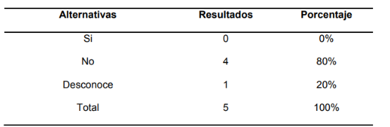
</div>

De acuerdo con los salones de belleza que operan en Tegucigalpa, el 53,3% de las mujeres esperan ser atendidas por orden de llegada en salones de belleza. Sin embargo, en su mayoría, estos servicios no cuentan con una herramienta digital que les permita administrar sus servicios de forma eficiente.

*Figura 2: Reservación de citas.*

<div align="center">
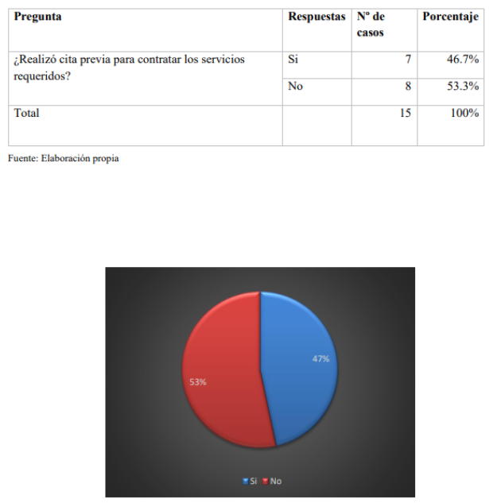
</div>

Según el salón de belleza "Giselle Spa" de La Molina (2021), se realizó una encuesta a 205 clientes respecto a la calidad del servicio que ofrece el salón de belleza, e identificó que el 53,4% admiten que dicha calidad se manifiesta de forma regular, debido al poco interés que se percibe respecto a los cronogramas, la comunicación activa y la organización laboral.

*Figura 3: Análisis descriptivo de la variable calidad de servicio.*

<div align="center">
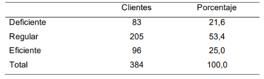
</div>

*Figura 4: Análisis porcentual de la variable calidad de servicio.*

<div align="center">
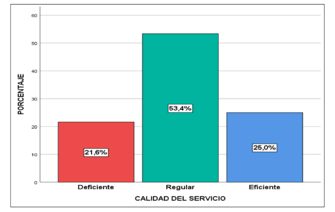
</div>

### 1.2.2. Lean UX Process

El enfoque de Lean UX se basa en la colaboración para crear productos de alta calidad, priorizando la optimización de la experiencia del usuario y la satisfacción del cliente sobre la perfección del diseño. Esta metodología permite obtener mejores resultados al integrar una comprensión profunda de la visión del negocio, lo que brinda flexibilidad en la combinación de ideas y eficiencia en la entrega de soluciones (Lean UX y Lean Startup: potencia experiencia y diseño de producto, 2023).

#### 1.2.2.1. Lean UX Problem Statements

Nuestra solución uTime, conformada por una **aplicación móvil** y una **aplicación web** complementarias, está diseñada para optimizar la gestión de citas en el sector de la belleza, permitiendo a los profesionales independientes y negocios administrar su disponibilidad, atraer nuevos clientes y mejorar la experiencia del usuario a través de la digitalización de sus servicios. Hemos detectado que los profesionales de la belleza enfrentan dificultades para gestionar sus citas de manera eficiente, ya que dependen de llamadas, mensajes de WhatsApp y redes sociales, lo que genera desorden, pérdida de tiempo y cancelaciones de última hora. Además, la falta de una plataforma centralizada limita su crecimiento, ya que dependen principalmente del boca a boca para atraer nuevos clientes. Por otro lado, los clientes que buscan servicios de belleza suelen experimentar frustración al coordinar citas manualmente, ya que muchas veces enfrentan tiempos de espera prolongados, falta de información clara sobre la disponibilidad de los estilistas y dificultad para realizar pagos digitales o acceder a promociones personalizadas. ¿Cómo podemos ofrecer una solución digital integral —móvil y web— que permita a los profesionales de la belleza gestionar su agenda de manera eficiente, atraer nuevos clientes y mejorar la experiencia de reserva para los usuarios finales?

#### 1.2.2.2. Lean UX Assumptions

##### Features

- Gestión de citas en línea (reservas, cancelaciones y reprogramaciones).
- Recordatorios automáticos por notificaciones y mensajes.
- Perfil profesional para estilistas y salones, con portafolio de trabajos.
- Sistema de reseñas y valoraciones.
- Integración con pagos digitales.
- Sistema de promociones y fidelización (descuentos, membresías, paquetes de servicios).
- Agenda inteligente con gestión de horarios y disponibilidad en tiempo real.

##### Business Outcomes

- Aumento en la adopción de las aplicaciones móvil y web por parte de estilistas y salones de belleza. Esperamos que un número creciente de profesionales del sector adopte uTime como su herramienta principal para la gestión de citas y la promoción de sus servicios.
- Mayor retención de clientes gracias a la automatización de citas y promociones personalizadas. uTime incrementará la recurrencia de las reservas de los clientes y la lealtad de estos hacia los profesionales dentro de la plataforma.
- Incremento de ingresos a través de suscripciones premium y comisiones por transacciones. Con el crecimiento de la base de usuarios, uTime espera un aumento en los ingresos recurrentes por planes premium, así como un mayor volumen de transacciones procesadas, fortaleciendo la rentabilidad del negocio.
- Crecimiento de la comunidad activa. A través de alianzas estratégicas con academias de belleza, influencers del sector y marcas de productos cosméticos, construiremos una comunidad sólida y lograremos posicionar a uTime como la solución tecnológica más confiable y utilizada por estilistas y clientes.

##### User Benefits

Para los profesionales de la belleza:

- Ahorro de tiempo al automatizar la gestión de citas.
- Mayor exposición y captación de clientes a través de las aplicaciones móvil y web.
- Reducción de cancelaciones gracias a los recordatorios automáticos.
- Mayor seguridad en los pagos con integración de billeteras digitales o pasarela de pago.
- Crecimiento profesional con la acumulación de reseñas y un perfil atractivo.

Para los clientes:

- Facilidad para encontrar y reservar servicios de belleza sin llamadas o esperas.
- Mayor confianza al ver reseñas y valoraciones antes de reservar.
- Seguridad en pagos digitales y opción de pagar en el momento.
- Acceso a promociones exclusivas y recompensas por lealtad.

##### Business Assumptions

- Creemos que los salones de belleza y barberías necesitan una herramienta digital para gestionar citas y atraer más clientes sin depender de redes sociales o el boca a boca.
- Pensamos que los clientes buscan una manera más confiable y sencilla de encontrar servicios de belleza sin llamar o visitar múltiples lugares.
- Asumimos que la automatización de citas y pagos reducirá la tasa de cancelaciones.
- Estimamos que los estilistas estarían dispuestos a pagar por una suscripción premium si el servicio mejora su visibilidad y rentabilidad.
- Creemos que la seguridad en los pagos es un factor clave para la adopción del producto.
- Pensamos que las alianzas con marcas de belleza y salones ayudarán a escalar el negocio.
- Esperamos que la integración con redes sociales aumente la captación de clientes y la visibilidad de los estilistas.

##### User Assumptions

1. **¿Quién es el usuario?**
   - Los usuarios de uTime son salones de belleza que deseen integrar nuestro producto. Asimismo, aquellos clientes que buscan servicios de peluquería, maquillaje y cuidado personal.

2. **¿Dónde encaja nuestro producto en su trabajo o vida?**
   - uTime se integra en la vida diaria de los usuarios al proporcionarles un medio de gestión de citas, procurando simplificar el proceso y optimizar el manejo de la disponibilidad de los salones de belleza, accesible tanto desde la aplicación móvil como desde el navegador web.

3. **¿Qué problemas tiene nuestro producto y cómo se pueden resolver?**
   - uTime enfrenta desafíos como la baja adopción por falta de confianza en la tecnología, dificultades en la personalización del sistema y preocupaciones sobre la seguridad de los pagos realizados en línea. Para resolver estos problemas, se podrían implementar tutoriales y soporte técnico personalizado, así como pruebas exhaustivas y actualizaciones constantes para corroborar la eficacia del producto. Asimismo, ofrecer opciones de pago flexible y garantía de seguridad en las transacciones. Estas acciones ayudarán a mejorar la experiencia del usuario y a aumentar la confianza en la plataforma.

4. **¿Cuándo y cómo es usado nuestro producto?**
   - uTime es utilizado por los usuarios en diversos momentos del día, dentro de la jornada laboral de los estilistas, dado que en cualquier momento del día los clientes pueden explorar opciones y agendar servicios. Los usuarios podrán acceder a uTime tanto desde la aplicación móvil como desde la aplicación web, permitiendo a los estilistas administrar su negocio en cualquier lugar y a los clientes agendar sus citas cuando deseen.

5. **¿Qué características son importantes?**
   - **Gestión de citas en tiempo real:** Permite a los estilistas administrar sus horarios de manera eficiente, evitando sobrecargas y asegurando disponibilidad precisa para los clientes. La interfaz intuitiva facilita la reserva y modificación de citas en pocos pasos, tanto en móvil como en web.
   - **Sistema de pagos integrados y seguros:** Los clientes pueden pagar sus citas dentro de las aplicaciones con tarjeta de crédito, débito o billeteras digitales, asegurando una óptima experiencia.
   - **Perfiles detallados de estilistas:** Cada salón cuenta con un perfil detallado que muestra la experiencia, especialidad, precios y disponibilidad de los estilistas. Los clientes pueden ver fotos de trabajos anteriores, leer reseñas y comparar opciones antes de reservar.
   - **Reseñas y calificaciones verificadas:** Para promover la confianza entre los usuarios, los clientes solo pueden dejar reseñas después de haber completado una cita. Esto permite garantizar la autenticidad de las opiniones y que los estilistas con buen desempeño destaquen.
   - **Herramientas de marketing digital:** Los estilistas pueden conectar sus perfiles de Instagram y TikTok para mostrar su trabajo y atraer más clientes. También se incluyen opciones para compartir reseñas y promociones en redes sociales directamente desde las aplicaciones.
   - **Notificaciones y recordatorios automáticos:** Los usuarios reciben alertas de sus citas para reducir cancelaciones y olvidos. Además, los estilistas pueden enviar recordatorios personalizados y mensajes promocionales para fidelizar a sus clientes.

6. **¿Cómo debe verse nuestro producto y cómo debe comportarse?**
   - El producto uTime debe cumplir ciertos aspectos de diseño y funcionalidad para convertirse en un proyecto exitoso, de una manera que refleje su enfoque en el sector de la belleza, la optimización del tiempo y la innovación tecnológica. En cuanto a su apariencia, se señala lo siguiente:
     - **Interfaz visualmente atractiva:** uTime debe contar con un diseño limpio y minimalista que facilite la navegación tanto para clientes como para estilistas. La combinación de colores debe transmitir confianza y elegancia, con una paleta que refleje profesionalismo y bienestar.
     - **Diseño adaptable y responsivo:** Debe garantizar una experiencia consistente en cualquier smartphone, tableta o navegador web. La interfaz debe ser clara y optimizada para facilitar la reserva de citas con pocos pasos.
   - En cuanto al comportamiento, uTime debe ser rápido, receptivo y confiable. Debido a esto, debe cumplir con los siguientes requisitos:
     - **Interacción fluida y rápida:** uTime debe ser altamente responsivo, garantizando tiempos de carga mínimos y transiciones suaves entre secciones. Esto evitará disconformidad y frustraciones del cliente, mejorando así su experiencia en la plataforma.
     - **Exploración intuitiva y eficiente:** Los clientes deben poder encontrar estilistas fácilmente mediante filtros avanzados como ubicación, especialidad, precios y reseñas. La interfaz debe permitir búsquedas rápidas y precisas.
     - **Seguridad y confianza en transacciones:** Los pagos dentro de las aplicaciones deben ser seguros y confiables, con múltiples opciones de pago. Además, la política de cancelación y reembolso debe estar clara para evitar inconvenientes.
     - **Sistema de notificaciones inteligentes:** Debe enviar recordatorios automáticos de citas, confirmaciones de pago, mensajes promocionales y alertas sobre cambios en la disponibilidad de los estilistas. Las notificaciones deben ser relevantes y evitar el spam.

#### 1.2.2.3. Lean UX Hypothesis Statements

- Creemos que, al ofrecer una plataforma de gestión de citas fácil de usar y accesible desde cualquier smartphone, tableta o navegador web, los estilistas podrán optimizar la organización de sus agendas y minimizar cancelaciones o sobrecargas de trabajo. Sabremos que hemos tenido éxito cuando al menos el 80% de los estilistas activos utilicen el sistema de reservas en línea regularmente.
- Creemos que, al implementar recordatorios automáticos para clientes y estilistas, reduciremos significativamente la cantidad de citas canceladas o reprogramadas en el último minuto. Sabremos que hemos tenido éxito cuando la tasa de cancelaciones tardías disminuya en al menos un 40% dentro de los primeros tres meses de uso.
- Creemos que, al permitir a los clientes seleccionar su estilista preferido, ver disponibilidad en tiempo real y reservar con facilidad, aumentaremos la satisfacción y fidelización. Sabremos que hemos tenido éxito cuando al menos el 70% de los clientes regresen a agendar una nueva cita dentro de los primeros dos meses después de su primera reserva.
- Creemos que, al integrar un sistema de reseñas y calificaciones para estilistas, se generará confianza en nuevos clientes y aumentará la retención de clientes recurrentes. Sabremos que hemos tenido éxito cuando al menos el 75% de los clientes califiquen su experiencia después de una cita.
- Creemos que, al permitir la personalización de servicios y precios dentro de las aplicaciones, los estilistas podrán ofrecer paquetes más atractivos y competitivos. Sabremos que hemos tenido éxito cuando al menos el 50% de los estilistas utilicen funciones de personalización dentro del primer mes de uso.
- Creemos que, al incluir un módulo de promociones y descuentos, los estilistas podrán aumentar la captación de nuevos clientes y fidelizar a los actuales. Sabremos que hemos tenido éxito cuando el número de reservas aumente en un 30% en comparación con el período previo a la implementación de esta funcionalidad.

#### 1.2.2.4. Lean UX Canvas

<div style="text-align: center; margin-top: 1rem; margin-bottom: 1rem;">

Lean UX Canvas del producto uTime.

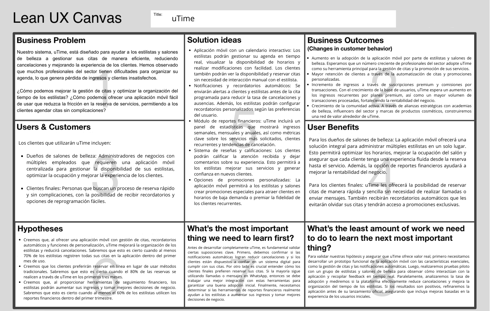

</div>

## 1.3. Segmentos objetivo

Los segmentos objetivos son las personas o entidades a las cuales está destinada nuestra solución. A continuación se describen aquellos que abarca nuestra propuesta.

**Segmento 1: Salones de belleza y barberías**

*Aspectos demográficos:*

- Rango de edad: mayores de 20 años.
- Sexo: masculino y femenino.
- Nivel socioeconómico: clases A y B (alta y media-alta).

*Aspectos geográficos:*

- Nacionalidad: peruana o extranjera.
- Zona geográfica de residencia: urbana.
- Departamento: Lima Metropolitana.

*Aspectos psicográficos:*

- Uso frecuente de medios de comunicación, tales como WhatsApp y llamadas telefónicas, para interactuar con los clientes.
- Un día a día con la agenda apretada por las reservas de los clientes y poca flexibilidad.

**Segmento 2: Clientes de servicios de belleza**

*Aspectos demográficos:*

- Rango de edad: mayores de 18 años.
- Sexo: masculino y femenino.
- Nivel socioeconómico: clases A, B y C (alta, media-alta y media).

*Aspectos geográficos:*

- Nacionalidad: peruana o extranjera.
- Zona geográfica de residencia: urbana.
- Departamento: Lima Metropolitana.

*Aspectos psicográficos:*

- Van frecuentemente a salones de belleza para estar a la moda o presentables para un evento importante.
- Tienden a preferir tratarse con el mismo estilista o barbero debido a experiencias anteriores o por la técnica del especialista.

<hr class="page-break">

# Capítulo II: Requirements Elicitation & Analysis

## 2.1. Competidores

### 2.1.1. Análisis competitivo

El análisis competitivo es una herramienta clave para la toma de decisiones estratégicas, ya que permite identificar oportunidades, amenazas y desarrollar ventajas competitivas sostenibles en el mercado. Su importancia radica en ayudar a las empresas a adaptarse a un entorno dinámico y a tomar decisiones fundamentadas. A continuación, se presenta la aplicación de esta herramienta en el desarrollo del proyecto y el análisis de los competidores:

<table>
  <tr>
    <th colspan="6">Competitive Analysis Landscape</th>
  </tr>
  <tr>
    <td colspan="1" align="center" rowspan="2">¿Por qué llevar a cabo este análisis?</td>
    <td colspan="5" align="center">¿Cómo identificar a nuestros principales competidores?</td>
  </tr>
  <tr>
    <td colspan="5"  align="center">Gracias al análisis de la competencia en el mercado, es posible entender el entorno en el que nuestro producto operará. Esto permite identificar a los competidores directos e indirectos y desarrollar estrategias basadas en la información obtenida sobre su posicionamiento actual.</td>
  </tr>
  <tr>
    <th colspan="2" align="center">Nombre y logo</th>
    <td colspan="1" align="center">
    <p><b>uTime</b></p>
    
    </td>
    <td colspan="1" align="center">
    <p><b>Salon Pro</b></p>
    
    </td>
    <td colspan="1" align="center">
    <p><b>Beauty Salon</b></p>
    
    </td>
    <td colspan="1" align="center">
    <p><b>Calendly</b></p>
    
    </td>
  </tr>
  <tr>
    <th colspan="1" rowspan="2" align="center">Perfil</th>
    <td colspan="1" align="center" >Overview</td>
    <td colspan="1">Plataforma de gestión de citas en tiempo real, altamente personalizable, con marketplace y pagos en línea.</td>
    <td colspan="1">Software para gestión de citas en salones con recordatorios y pagos integrados.</td>
    <td colspan="1">Aplicación móvil para reservas en salones de belleza con sistema de recomendaciones.</td>
    <td colspan="1">Plataforma de programación de reuniones con integración a calendarios digitales.</td>
  </tr>
  <tr>
    <td colspan="1" align="center">Ventaja competitiva ¿Qué valor ofrece a los clientes?</td>
    <td colspan="1">
    <ul>
    <li>Alta personalización en precios, tiempos y servicios.</li>
    <li>Marketplace para generar ingresos adicionales.</li>
    <li>Asesoramiento exclusivo en el plan premium.</li>
    <li>Calendario en tiempo real, optimizado para equipos con múltiples trabajadores.</li>
    </ul>
    </td>
    <td colspan="1">
    <ul>
    <li>Automatización de citas con recordatorios.</li>
    <li>Integración con pagos para facilitar transacciones.</li>
    <li>Interfaz sencilla y amigable para salones de belleza.</li>
    </ul>
    </td>
    <td colspan="1">
    <ul>
    <li>Sistema de recomendaciones basado en preferencias del usuario.</li>
    <li>Experiencia optimizada en móvil.</li>
    <li>Ofertas y promociones exclusivas dentro de la app.</li>
    </ul>
    </td>
    <td colspan="1">
    <ul>
    <li>Integración con herramientas empresariales (Google Calendar, Outlook, Zoom).</li>
    <li>Automatización de programación para equipos y clientes.</li>
    <li>Fácil uso y amplia adopción en el mercado corporativo.</li>
    </ul>
    </td>
  </tr>
  <tr>
    <th colspan="1" align="center" rowspan="2">Perfil de marketing</th>
    <td colspan="1" align="center">Mercado objetivo</td>
    <td colspan="1">
    <ul>
    <li>Peluquerías y barberías.</li>
    <li>Clientes que buscan reservar servicios de belleza.</li>
    </ul>
    </td>
    <td colspan="1">
    <ul>
    <li>Salones de belleza y spas.</li>
    <li>Negocios que quieren digitalizar sus citas.</li>
    </ul>
    </td>
    <td colspan="1">
    <ul>
    <li>Clientes que buscan servicios de belleza.</li>
    <li>Salones de belleza y spas.</li>
    </ul>
    </td>
    <td colspan="1">
    <ul>
    <li>Empresas y freelancers que necesitan agendar reuniones.</li>
    </ul>
    </td>
  </tr>
  <tr>
    <td colspan="1" align="center">Estrategias de marketing</td>
    <td colspan="1">
    <ul>
    <li>Modelo freemium con 10 reservas mensuales gratis.</li>
    <li>Marketplace para generar ingresos extra.</li>
    <li>Publicidad en redes sociales.</li>
    </ul>
    </td>
    <td colspan="1">
    <ul>
    <li>Publicidad dirigida en redes sociales.</li>
    <li>Ofertas promocionales y descuentos.</li>
    <li>Integración con herramientas de gestión empresarial.</li>
    </ul>
    </td>
    <td colspan="1">
    <ul>
    <li>Fuerte presencia en App Store y Google Play.</li>
    <li>Alianzas con salones para promociones.</li>
    </ul>
    </td>
    <td colspan="1">
    <ul>
    <li>SEO y marketing de contenido.</li>
    <li>Integración con múltiples herramientas de productividad.</li>
    </ul>
    </td>
  </tr>
  <tr>
    <th colspan="1" align="center" rowspan="3">Perfil del producto</th>
    <td colspan="1" align="center">Productos & Servicios</td>
    <td colspan="1">
    <ul>
    <li>Gestión de citas en tiempo real.</li>
    <li>Marketplace.</li>
    <li>Pagos en línea.</li>
    <li>Asesoramiento en plan premium.</li>
    </ul>
    </td>
    <td colspan="1">
    <ul>
    <li>Software de gestión para salones.</li>
    <li>Recordatorios automáticos.</li>
    <li>Pagos integrados.</li>
    </ul>
    </td>
    <td colspan="1">
    <ul>
    <li>Aplicación para reservas.</li>
    <li>Sistema de recomendaciones.</li>
    <li>Promociones para usuarios.</li>
    </ul>
    </td>
    <td colspan="1">
    <ul>
    <li>Programación de reuniones.</li>
    <li>Integraciones con calendarios.</li>
    <li>Automatización de agendas.</li>
    </ul>
    </td>
  </tr>
  <tr>
    <td colspan="1" align="center">Precios y Costos</td>
    <td colspan="1">
    <ul>
    <li>Plan gratuito con 10 reservas/mes.</li>
    <li>Plan intermedio con más personalización.</li>
    <li>Plan premium con marketplace ilimitado y asesoramiento.</li>
    </ul>
    </td>
    <td colspan="1">
    <ul>
    <li>Suscripción mensual según el tamaño del negocio.</li>
    </ul>
    </td>
    <td colspan="1">
    <ul>
    <li>Comisiones por reservas.</li>
    <li>Posible suscripción premium.</li>
    </ul>
    </td>
    <td colspan="1">
    <ul>
    <li>Modelo freemium con suscripción mensual.</li>
    <li>Costos según el tamaño del equipo.</li>
    </ul>
    </td>
  </tr>
  <tr>
    <td colspan="1" align="center">Canales de distribución (Web y/o Móvil)</td>
    <td colspan="1">El servicio, de forma momentánea, se brindará en plataforma web</td>
    <td colspan="1">Dispone de plataforma web y aplicación móvil</td>
    <td colspan="1">Solo aplicación móvil</td>
    <td colspan="1">Plataforma web y aplicación móvil</td>
  </tr>
  <tr>
    <th colspan="1" align="center" rowspan="4">Análisis SWOT</th>
    <td colspan="1" align="center">Fortalezas</td>
    <td colspan="1">
    <ul>
    <li>Personalización avanzada.</li>
    <li>Diferenciación con marketplace.</li>
    <li>Modelo accesible y flexible.</li>
    </ul>
    </td>
    <td colspan="1">
    <ul>
    <li>Automatización de citas.</li>
    <li>Fácil de usar.</li>
    </ul>
    </td>
    <td colspan="1">
    <ul>
    <li>Interfaz atractiva.</li>
    <li>Buen enfoque en clientes finales.</li>
    </ul>
    </td>
    <td colspan="1">
    <ul>
    <li>Gran cantidad de integraciones.</li>
    <li>Posicionamiento sólido en el mercado.</li>
    </ul>
    </td>
  </tr>
  <tr>
    <td colspan="1" align="center">Debilidades</td>
    <td colspan="1">
    <ul>
    <li>Necesidad de atraer clientes masivos.</li>
    <li>Puede ser complejo para algunos usuarios.</li>
    </ul>
    </td>
    <td colspan="1">
    <ul>
    <li>Alta competencia.</li>
    <li>Funcionalidades limitadas.</li>
    </ul>
    </td>
    <td colspan="1">
    <li>Dependencia de afiliaciones con salones.</li>
    <li>Competencia con otras apps.</li>
    </td>
    <td colspan="1">
    <ul>
    <li>Costos elevados para algunas funciones.</li>
    </ul>
    </td>
  </tr>
  <tr>
    <td colspan="1" align="center">Oportunidades</td>
    <td colspan="1">
    <ul>
    <li>Expansión en Latinoamérica.</li>
    <li>Alianzas con marcas de belleza.</li>
    <li>Expansión del marketplace.</li>
    </ul>
    </td>
    <td colspan="1">
    <ul>
    <li>Crecimiento del sector digital.</li>
    <li>Mayor uso de pagos en línea.</li>
    </ul>
    </td>
    <td colspan="1">
    <ul>
    <li>Aumento de reservas digitales en belleza.</li>
    <li>Integración con plataformas de bienestar.</li>
    </ul>
    </td>
    <td colspan="1">
    <ul>
    <li>Crecimiento del trabajo remoto.</li>
    <li>Expansión en herramientas digitales.</li>
    </ul>
    </td>
  </tr>
  <tr>
    <td colspan="1" align="center">Amenazas</td>
    <td colspan="1">
    <ul>
    <li>Competencia con plataformas consolidadas.</li>
    <li>Costos de adquisición de clientes.</li>
    </ul>
    </td>
    <td colspan="1">
    <ul>
    <li>Opciones más económicas en el mercado.</li>
    <li>Cambios en tendencias de consumo.</li>
    </ul>
    </td>
    <td colspan="1">
    <ul>
    <li>Nuevos competidores en el sector.</li>
    <li>Alternativas con más funcionalidades.</li>
    </ul>
    </td>
    <td colspan="1">
    <ul>
    <li>Empresas más grandes en el sector.</li>
    <li>Alternativas gratuitas en crecimiento.</li>
    </ul>
    </td>
  </tr>
</table>

### 2.1.2. Estrategias y tácticas frente a competidores

A partir del análisis competitivo previamente realizado, se logró determinar con precisión las principales fortalezas, oportunidades, debilidades y amenazas de los competidores. Esta información es fundamental para diseñar estrategias y tácticas que permitan posicionarse de manera efectiva frente a la competencia, especialmente durante el ingreso del servicio al mercado. A continuación, se presentan las estrategias y tácticas definidas con el objetivo de lograr un lanzamiento exitoso y rentable.

#### Afrontando las fortalezas de nuestros competidores:

- Salon Pro cuenta con una interfaz sencilla y automatización de citas, lo que facilita la experiencia del usuario.
- Beauty Salon posee una fuerte presencia en dispositivos móviles y un sistema de recomendaciones personalizado.
- Calendly domina el mercado con su integración con herramientas empresariales y automatización avanzada.

#### Comprendemos que nuestras fortalezas son:

- Personalización avanzada de precios, tiempos y servicios para cada trabajador.
- Integración de un marketplace para generar ingresos adicionales.
- Asesoramiento premium para ayudar a los negocios a optimizar su uso de la plataforma.
- Plan gratuito accesible con 10 reservas mensuales

Entonces, podemos aplicar las siguientes estrategias y tácticas:

#### Estrategias

- Destacar la personalización de uTime como una ventaja clave en nuestra comunicación y campañas de marketing.
- Enfatizar el valor del marketplace como una fuente de ingresos adicional para las peluquerías.
- Promover el plan de asesoramiento como un servicio exclusivo que nuestros competidores no ofrecen.

#### Tácticas

- Campañas en redes sociales mostrando cómo se personaliza la plataforma para distintos negocios.
- Casos de éxito de pequeñas peluquerías que optimizaron sus citas y ventas con uTime.
- Videos explicativos sobre el uso del calendario por trabajador.

#### Afrontando las debilidades de nuestros competidores:

- Salon Pro tiene funcionalidades limitadas y enfrenta alta competencia.
- Beauty Salon depende de afiliaciones con salones y tiene competencia en el sector.
- Calendly tiene costos elevados para funciones avanzadas.

Requieren configuraciones técnicas complicadas en algunos casos

#### Comprendemos que nuestras debilidades son:

- Necesidad de atraer clientes masivos rápidamente.
- Puede ser complejo para usuarios sin experiencia en plataformas digitales.

Entonces, podemos aplicar las siguientes estrategias y tácticas:

#### Estrategias

- Implementar una estrategia de adquisición de clientes con modelos freemium y pruebas gratuitas.
- Diseñar una interfaz intuitiva con tutoriales y soporte personalizado.

#### Tácticas

- Ofrecer un plan gratuito con funcionalidades limitadas para atraer usuarios y generar confianza en el producto.
- Incluir asesoría personalizada en el plan completo para ayudar a negocios grandes a configurar y personalizar la plataforma según sus necesidades, especialmente si no están familiarizados con herramientas tecnológicas.

#### Afrontando las oportunidades de nuestros competidores:

- Salon Pro y Beauty Salon se benefician del crecimiento del sector digital en el ámbito de la belleza.
- Calendly aprovecha el aumento del trabajo remoto y la digitalización de agendas.

#### Comprendemos que nuestras oportunidades son:

- Expansión del mercado digital en Latinoamérica.
- Alianzas estratégicas con marcas de belleza y distribuidores.

Entonces, podemos aplicar las siguientes estrategias y tácticas:

#### Estrategias

- Expandir la presencia de uTime en mercados emergentes y ofrecer soporte en múltiples idiomas.
- Establecer alianzas con proveedores de productos de belleza y herramientas de gestión empresarial.

#### Tácticas

- Lanzar campañas de publicidad específicas para nuevos mercados.
- Contactar con marcas y distribuidores para ofrecer descuentos exclusivos a usuarios de uTime.
- Desarrollar una función de recomendaciones de productos dentro del marketplace.

#### Afrontando las amenazas de nuestros competidores:

- Existen plataformas consolidadas con una base de clientes establecida.
- La adquisición de clientes puede ser costosa debido a la alta competencia.

#### Comprendemos que nuestras amenazas son:

- Posicionamiento de grandes marcas en el sector.
- Costos de adquisición de usuarios y retención de clientes.

Entonces, podemos aplicar las siguientes estrategias y tácticas:

#### Estrategias

- Diferenciar uTime con características únicas y servicios adicionales.
- Fidelizar clientes con programas de recompensas y beneficios exclusivos.

#### Tácticas

- Implementar un sistema de referidos con descuentos para clientes actuales y nuevos usuarios.
- Crear un programa de fidelización con beneficios progresivos según el tiempo de uso de la plataforma.

## 2.2. Entrevistas

### 2.2.1. Diseño de entrevistas

Preguntas para el segmento objetivo 01: Encargados de peluquerías

- ¿Cuánto tiempo lleva en el rubro de la belleza/barbería y qué lo motivó a dedicarse a este negocio?
- ¿Cómo suelen agendar las citas sus clientes y qué método prefieren ellos? (WhatsApp, llamadas, redes sociales, otros).
- ¿Cuán flexible es su agenda diaria y qué tan difícil es manejar cambios de última hora en las reservas?
- ¿Usan algún sistema o aplicación para gestionar reservas y pagos? Si no, ¿cómo lo hacen actualmente?
- ¿Cuáles son los principales canales de comunicación que usan para confirmar o recordar citas?
- ¿Cuáles son los principales desafíos que enfrenta al gestionar las reservas y la relación con los clientes?
- ¿Con qué frecuencia enfrentan cancelaciones o clientes que no se presentan? ¿Cómo manejan estas situaciones?
- ¿Qué estrategias usan para que los clientes regresen a su negocio y qué tan efectivas han sido?
- ¿Qué tan abiertos están a implementar nuevas herramientas digitales que les ayuden a organizar mejor su negocio?
- ¿Qué mejoras le gustaría implementar en su negocio en el corto y mediano plazo?
- ¿Qué tan importante es para usted tener un control visual de la disponibilidad y ocupación de su equipo de trabajo?
- ¿Cómo maneja las situaciones de insatisfacción de los clientes y qué acciones toma para evitar que se repitan?

Preguntas para el segmento objetivo 02: Cliente de peluquería

- ¿Con qué frecuencia visitas un salón de belleza o barbería y qué servicios sueles solicitar?
- ¿Qué factores consideras más importantes al elegir un salón de belleza o barbería? (Ubicación, precio, reputación, servicio, etc.)
- ¿Sueles atenderte con el mismo estilista/barbero? ¿Por qué?
- ¿Cómo prefieres agendar tus citas? (WhatsApp, llamadas, página web, aplicación, presencialmente).
- ¿Qué tan importante es para ti que te atiendan a la hora exacta de tu cita? ¿Has tenido experiencias negativas con largas esperas?
- Si necesitas cancelar o reprogramar tu cita, ¿qué tan fácil o difícil suele ser el proceso?
- ¿Qué métodos de pago prefieres al momento de pagar por el servicio? (Efectivo, tarjeta, transferencias, apps de pago).
- ¿Cómo te gusta recibir recordatorios de tu cita o promociones? (Mensajes de WhatsApp, correos, redes sociales, llamadas).
- ¿Has utilizado alguna aplicación o plataforma para reservar citas en salones de belleza/barberías? ¿Cómo fue tu experiencia?
- ¿Qué aspecto te gustaría que mejoraran los salones de belleza/barberías para una mejor experiencia como cliente?
- ¿Qué tan importante es para ti que el salón o barbería tenga una presencia activa en redes sociales o en línea?
- ¿Cuánto valoras la opción de poder hacer pagos anticipados o de forma digital para evitar el manejo de efectivo?

### 2.2.2. Registro de entrevistas

### Segmento Objetivo 1 (Salones de Belleza y Barberías)

##### Datos del Entrevistado #1

- **Nombre completo:** Luis Fernando Farfán
- **Segmento Objetivo:** Barbero
- **Edad:** 29 años
- **Distrito:** Chiclayo
- **Inicio de la entrevista:** 0:15 minutos
- **Duración:** 20:43 minutos
- **Screenshot del cuadro de video:** 

- **URL del video (Microsoft Stream):**

`https://upcedupe-my.sharepoint.com/:v:/g/personal/u20211g671_upc_edu_pe/ESFQacfmqZ5Nn2Bv1Xf07vUB0OTOAw-maSZzLjNobLiKMQ`

**Resumen:**
Luis Fernando Farfán es un barbero de Chiclayo que tiene 8 años de experiencia. Utiliza las redes sociales y WhatsApp para ambos el marketing de su negocio y la recepción de citas. Utiliza la agenda Fresha para registrar las citas y gestionar los horarios. Se enfrenta a desafíos como la comunicación sobre información del horario y especialmente se enfrenta a clientes que cancelan al último minuto, llegan tarde o no llegan en absoluto lo cual le causa una perdida de tiempo y clientes posibles. Le resulta de gran importancia saber en qué horarios se encuentran disponibles sus barberos para asignar a los clientes. Se enfoca que sus barberos y el mismo sean empáticos y carismáticos para que los clientes se sientan comodos y vuelvan a la barbería.

##### Datos del Entrevistado #2

- **Nombre completo:** Maria Ysabel Sosa Rodriguez
- **Segmento Objetivo:** Dueña de un Salón de belleza
- **Edad:** 45 años
- **Distrito:** San Juan de Lurigancho
- **Inicio de la entrevista:** 7:53 minutos
- **Duración:** 20:43 minutos
- **Screenshot del cuadro de video:** 

- **URL del video (Microsoft Stream):**

`https://upcedupe-my.sharepoint.com/:v:/g/personal/u20211g671_upc_edu_pe/ESFQacfmqZ5Nn2Bv1Xf07vUB0OTOAw-maSZzLjNobLiKMQ`

**Resumen:**
María Ysabel Sosa Rodríguez, de 45 años, es dueña de un salón de belleza y actualmente enfrenta retos en la gestión de sus citas. Durante la entrevista, expresó su interés en implementar un sistema automatizado para agendar citas, ya que considera que las cancelaciones de último momento resultan frustrantes y afectan su negocio. Además, destacó que los métodos tradicionales como llamadas o mensajes son poco prácticos, ya que demandan tiempo y a menudo generan incomodidad tanto para ella como para sus clientas. María Ysabel ve en la tecnología una oportunidad para optimizar este proceso y mejorar la eficiencia en la atención al cliente.

### Segmento Objetivo 2 (Clientes de servicios de belleza)

#### Datos del Entrevistado #1

- **Nombre completo:** Anedyib Villar Bisso
- **Segmento Objetivo:** Clientes de servicio de belleza
- **Edad:** 20 años
- **Distrito:** San Isidro
- **Screenshot del cuadro de video:** __
- **Inicio de la entrevista:** 12:20 minutos
- **Duración:** 20:43 minutos

- **URL del video (Microsoft Stream):**

`https://upcedupe-my.sharepoint.com/:v:/g/personal/u20211g671_upc_edu_pe/ESFQacfmqZ5Nn2Bv1Xf07vUB0OTOAw-maSZzLjNobLiKMQ`

**Resumen:** En esta entrevista con Anedyib, comentó que visita el salón dos veces al mes (manicure al inicio y recorte de puntas a fin de mes). Valora especialmente el buen trato con su estilista y la facilidad para agendar por WhatsApp, y suele atenderse siempre con la misma persona por la confianza construida. La puntualidad es crítica; relató una mala experiencia que le arruinó planes. Cancelar le resulta fácil, pero reprogramar es complicado por choques de horarios. Prefiere pagos digitales (tarjeta o Yape) y recordatorios tipo calendario. Ha intentado reservar en webs pero no pudo y terminó llamando, algo que le disgustó. Sugiere mejorar la comunicación proactiva desde la reserva hasta la llegada y ofrecer pagos anticipados y digitales.

#### Datos del Entrevistado #2

- **Nombre completo:** Emily Arroyo Gonzales
- **Segmento Objetivo:** Clientes de servicio de belleza
- **Edad:** 20
- **Distrito:** Chorrillos
- **Screenshot del cuadro de video:** __
- **Inicio de la entrevista:** 16:53 minutos
- **Duración:** 20:43 minutos
- **URL del video (Microsoft Stream):**

`https://upcedupe-my.sharepoint.com/:v:/g/personal/u20211g671_upc_edu_pe/ESFQacfmqZ5Nn2Bv1Xf07vUB0OTOAw-maSZzLjNobLiKMQ`

**Resumen:** En esta entrevista con Emily, indicó que acude por corte de cabello, a veces limpieza facial y manicure. Sus criterios clave son ubicación cercana, reputación, comentarios y calidad; está dispuesta a pagar más por un buen servicio. Generalmente se atiende con el mismo estilista porque conoce sus gustos. Prefiere agendar por WhatsApp por mayor comodidad; la puntualidad es muy importante, aunque tolera una breve espera. Cancelar y reprogramar le resulta fácil vía WhatsApp. Paga con Yape o tarjeta y prefiere recordatorios por WhatsApp. Propone mejorar la atención (amabilidad y escuchar lo solicitado). Considera importante la presencia en redes para ver trabajos, opiniones y promociones, y valora los pagos digitales por seguridad, comodidad y ahorro de tiempo.

### 2.2.3. Análisis de entrevistas

**Análisis del Segmento Objetivo 01**

- Características Objetivas:

  - Demografía y Experiencia:
    - Jóvenes emprendedores (24-28 años).
    - Con experiencia en el rubro (3-5 años).
    - Propietarios de salones de belleza en áreas urbanas (Chorrillos, Barranco, Surco).
  - Gestión del Negocio:
    - Agenda de citas gestionada manualmente (cuaderno).
    - Pagos en efectivo, transferencias y QR.
    - Comunicación con clientes vía llamadas y WhatsApp.
    - Sufren de cancelaciones de citas que afectan sus ingresos.
  - Estrategias de Fidelización:
    - Ofrecen promociones y obsequios.
    - Ofrecen promociones para primeras visitas.

- Características Subjetivas:

  - Motivación y Pasión:
    - Pasión por el estilismo desde jóvenes.
    - Deseo de brindar una experiencia de calidad a sus clientes.
    - Búsqueda de la personalización en el servicio al cliente.
  - Desafíos y Necesidades:
    - Dificultad para gestionar citas, especialmente fuera de línea.
    - Problemas con cambios de citas de última hora.
    - Necesidad de optimizar la comunicación con los clientes.
    - Búsqueda de la gestión eficiente de sus negocios.
  - Visión a Futuro:
    - Deseo de aumentar la rentabilidad del negocio.
    - Planes de expansión (apertura de nuevas sucursales).
    - Crear historial de clientes.
    - Desarrollar campañas de fidelización.

- **Análisis del Segmento Objetivo 02**

  - Características Objetivas:

    - Demografía:
      - Jóvenes universitarias de 20 a 60 años.
      - Residentes en áreas urbanas (Cercado de Lima). (50% de las entrevistadas)
    - Comportamiento de Consumo:
      - Visitan salones de belleza aproximadamente una vez al mes. (100% de los entrevistados)
      - Servicios más frecuentes: manicura, corte de cabello, tratamientos capilares, depilación de cejas y mascarillas faciales.
    - Preferencias de Comunicación y Pago:
      - Prefieren agendar citas y recibir recordatorios/promociones vía WhatsApp y redes sociales. (100% de las entrevistadas)
      - Prefieren pagos con transferencias bancarias o aplicaciones de pago, evitando el efectivo. (100% de las entrevistadas)

  - Características Subjetivas:

    - Valores y Prioridades:
      - Priorizan la calidad del servicio y la reputación del salón. (100% de las entrevistadas)
      - La puntualidad es un factor crítico. (100% de las entrevistadas)
      - Confianza en el estilista: prefieren atenderse siempre con el mismo profesional. (100% de las entrevistadas)
      - La comodidad y la buena atención son puntos muy importantes para ellas. (100% de las entrevistadas)
    - Actitudes y Expectativas:
      - Actitud práctica y confiada.
      - Buscan procesos de reprogramación de citas sencillos. (100% de las entrevistadas)
      - Abiertas a utilizar aplicaciones o plataformas de reservas si mejoran la rapidez de respuesta. (50% de las entrevistadas)
    - Necesidades y Deseos:
      - Respuestas rápidas al agendar citas vía WhatsApp.
      - Mejora en la puntualidad y la atención al cliente.
      - Facilitar el uso de herramientas digitales.

<div style="page-break-before: always;"></div>

## 2.3. Needfinding

### 2.3.1. User Personas

**Segmento objetivo #1: Salones de belleza y barberías**

<div align="center">

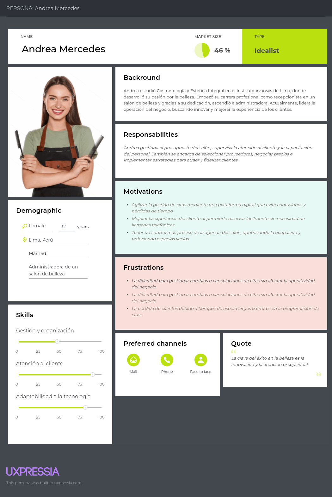

</div>

<div style="page-break-before: always;"></div>

**Segmento objetivo #2: Clientes de servicios de belleza**

<div align="center">

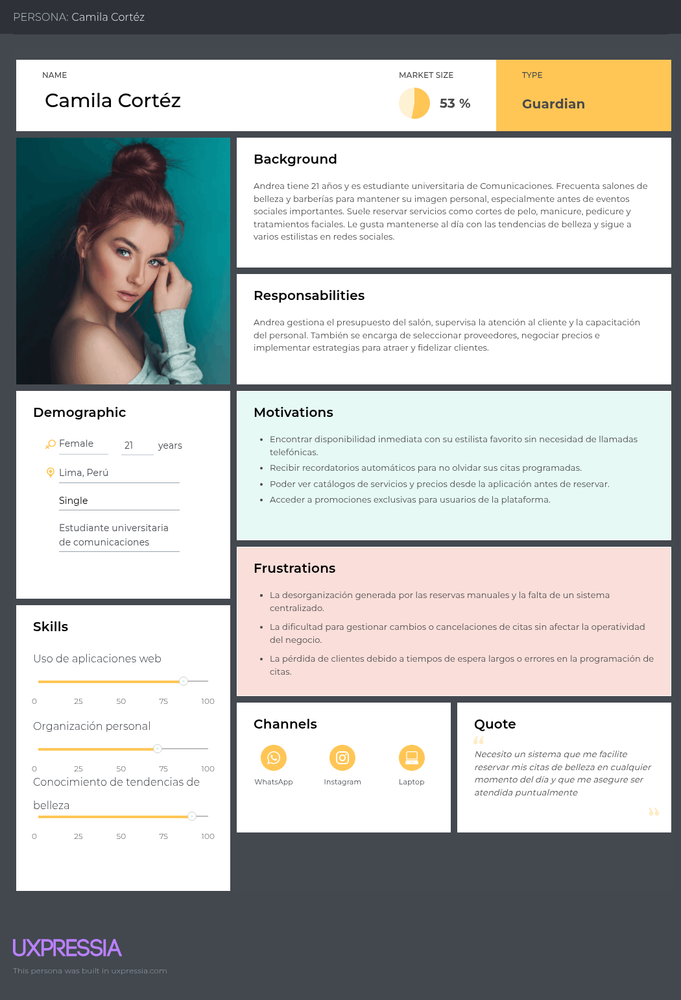

</div>

<div style="page-break-before: always;"></div>

### 2.3.2. User Task Matrix

| \*Tarea\*\*                                     | **Frecuencia (Andrea)** | **Importancia (Andrea)** | **Frecuencia (Camila)** | **Importancia (Camila)** |
| ----------------------------------------------- | ----------------------- | ------------------------ | ----------------------- | ------------------------ |
| Revisar la disponibilidad de la agenda          | Alta                    | Alta                     | Alta                    | Alta                     |
| Agendar citas                                   | Alta                    | Alta                     | Media                   | Alta                     |
| Escoger tratamiento                             | Nunca                   | Baja                     | Alta                    | Alta                     |
| Responder llamadas de los clientes              | Alta                    | Alta                     | Nunca                   | Baja                     |
| Ajustarse al tiempo que dura el tratamiento     | Media                   | Alta                     | Media                   | Media                    |
| Alistar los utensilios de belleza de antemano   | Media                   | Media                    | Baja                    | Baja                     |
| Ajustar agenda en fechas de alta demanda        | Baja                    | Alta                     | Baja                    | Media                    |
| Gestionar cancelaciones                         | Alta                    | Alta                     | Baja                    | Baja                     |
| Revisar cambios en la agenda                    | Alta                    | Alta                     | Alta                    | Alta                     |
| Priorizar citas según fidelidad                 | Media                   | Alta                     | Nunca                   | Baja                     |
| Escoger un estilista en específico para la cita | Media                   | Baja                     | Media                   | Media                    |
| Colocar precio a los tratamientos               | Baja                    | Media                    | Baja                    | Media                    |
| Planificar citas por WhatsApp                   | Alta                    | Alta                     | Alta                    | Alta                     |
| Gestionar horarios de los estilistas            | Alta                    | Alta                     | Nunca                   | Baja                     |
| Recordar a los clientes de sus citas            | Alta                    | Alta                     | Nunca                   | Media                    |
| Llegar temprano al salón                        | Baja                    | Media                    | Alta                    | Alta                     |
| Realizar el pago por el servicio                | Alta                    | Alta                     | Alta                    | Alta                     |
| Pagar por medios electrónicos                   | Baja                    | Baja                     | Alta                    | Alta                     |

<div style="page-break-before: always;"></div>

### 2.3.3. User Journey Mapping

Para el segmento de los salones estilistas o barberos se consideró el momento desde que el cliente se contacta con la recepcionista hasta que el cliente haya terminado su cita y haya salido de salón. En la otra mano, para el segmento de los clientes de los salones se consideró desde que descubren el salón de manera online o por otra persona hasta que haya atendido la cita deseada.

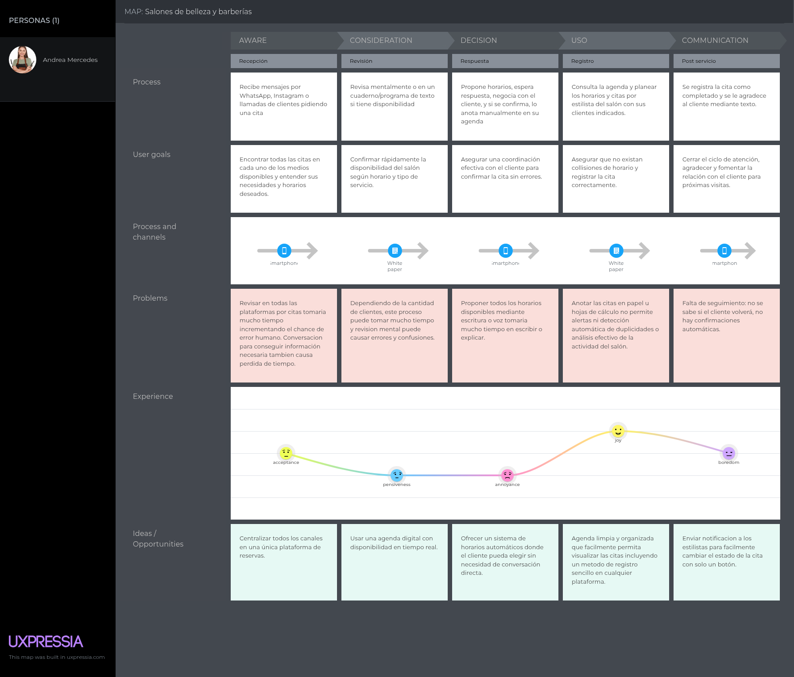

<div style="page-break-before: always;"></div>

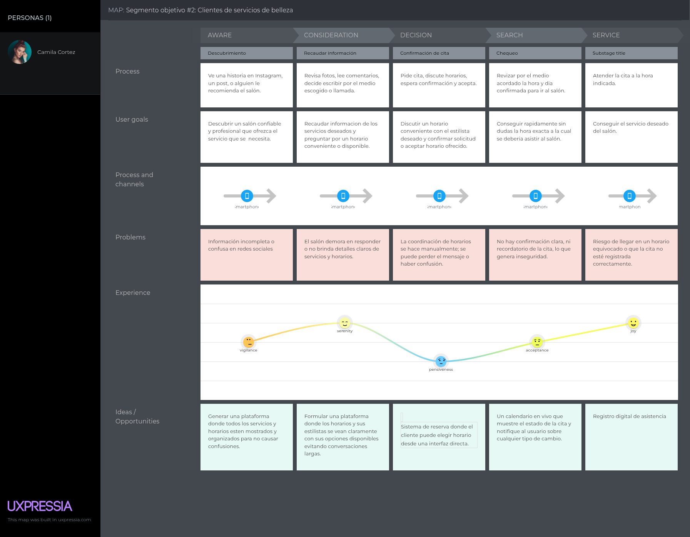

<div style="page-break-before: always;"></div>

</div>

### 2.3.4. Empathy Mapping


**Segmento objetivo #1: Salones de belleza y barberías**

<div align="center">

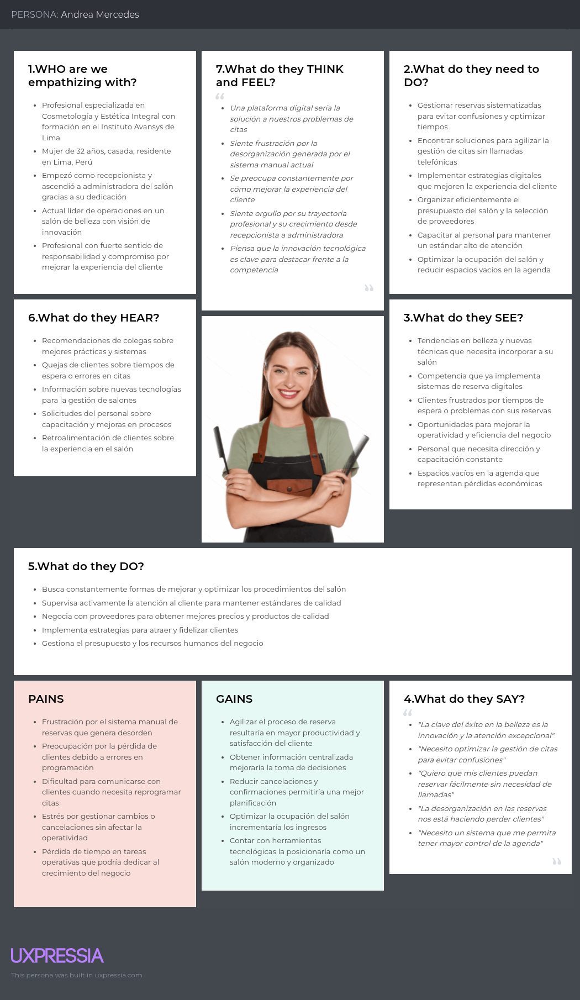

</div>

<div style="page-break-before: always;"></div>

**Segmento objetivo #2: Clientes de servicios de belleza**

<div align="center">

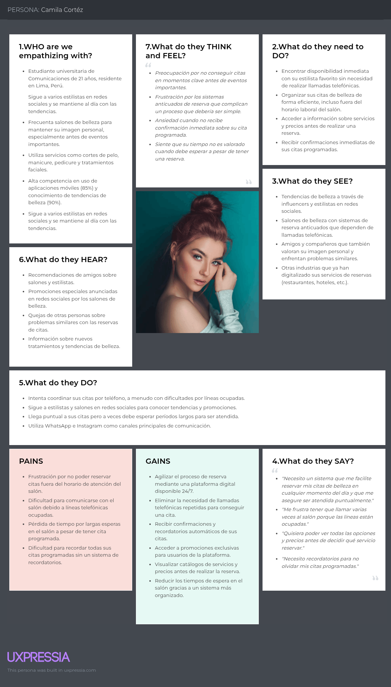

</div>

<div style="page-break-before: always;"></div>

### 2.3.5. As-is Scenario Mapping

Segmento objetivo #1: Salones de belleza y barberías

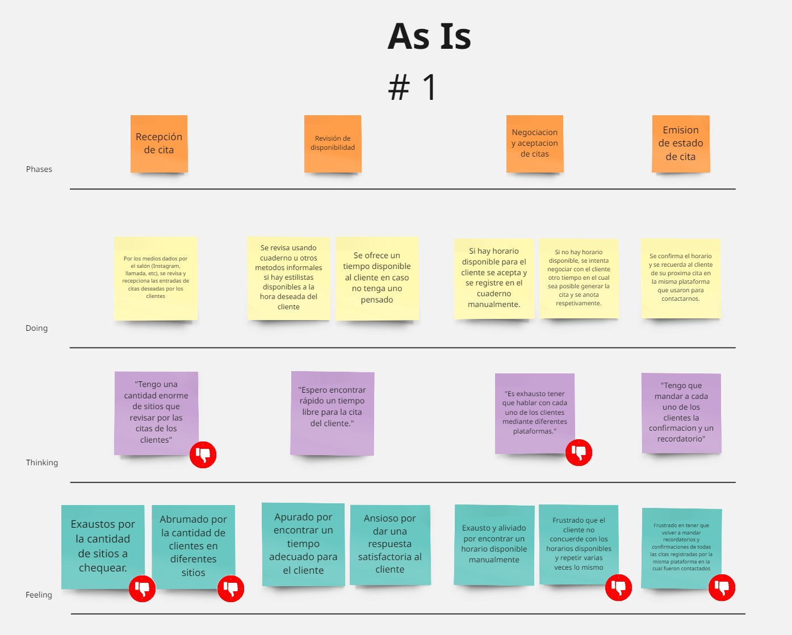

Segmento objetivo #2: Clientes de servicios de belleza

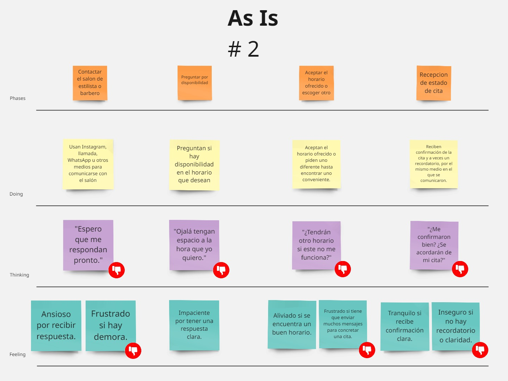

## 2.4. Ubiquitous Language

| **Término del Lenguaje Ubicuo**    | **Clase**                                    | **Bounded Context** | **Definición**                                                                            |
| ---------------------------------- | -------------------------------------------- | ------------------- | ----------------------------------------------------------------------------------------- |
| **Reserva Agendada**               | `Reservations`                               | Reservations        | Una reserva confirmada vinculada a un `ClientId`, `TimeSlotId`, `ServiceId` y `WorkerId`. |
| **Horario Disponible**             | `TimeSlotId`                                 | Reservations        | Identificador de un bloque de tiempo libre, no asignado a ninguna `Reservation`.          |
| **Bloque de Tiempo**               | `TimeSlotId`                                 | Reservations        | Unidad estándar de tiempo usada para agendar reservas.                                    |
| **Cancelación de Reserva**         | `UpdateReservationCommand` (con cancelación) | Reservations        | Acción de actualizar o eliminar una reserva, liberando su `TimeSlotId`.                   |
| **Reprogramación de Reserva**      | `UpdateReservationCommand`                   | Reservations        | Comando para cambiar el `TimeSlotId` de una reserva ya existente.                         |
| **Servicio Seleccionado**          | `ServiceId`                                  | Reservations        | Identificador de servicio incluido en una reserva.                                        |
| **Cambio en la Agenda**            | `UpdateReservationCommand`                   | Reservations        | Cualquier alteración en los datos de una reserva existente.                               |
| **Trabajador**                     | `Workers`                                    | Workers             | Agregado que representa al profesional que realiza un servicio.                           |
| **Especialización del Trabajador** | `WorkerSpecialization`                       | Workers             | Valor que describe la especialidad del trabajador (ej. barbería, uñas).                   |
| **Servicio**                       | `Services`                                   | Services            | Agregado que representa un tratamiento o actividad ofrecida por un `Provider`.            |
| **Duración del Servicio**          | `Duration`                                   | Services            | Valor que indica el tiempo necesario para completar el servicio.                          |
| **Precio del Servicio**            | `Money` (compartido)                         | Services / Shared   | Valor objeto que representa el costo del servicio.                                        |
| **Proveedor**                      | `ProviderId`                                 | Profiles / Services | Identificador del prestador del servicio.                                                 |
| **Cliente**                        | `ClientId`                                   | Profiles            | Identificador del usuario que agenda y recibe el servicio.                                |
| **Reseña**                         | `Reviews`                                    | Reviews             | Agregado que contiene la valoración textual y numérica hecha por un `Client`.             |
| **Puntaje de Reseña**              | `Review.rating`                              | Reviews             | Valor numérico asociado a una reseña de servicio.                                         |

<br>

# Capítulo III: Requirements Specification

## 3.1. To-Be Scenario Mapping

<div style="text-align: center; margin-top: 1rem; margin-bottom: 1rem;">

Segmento objetivo #1: Salones de belleza y barberías

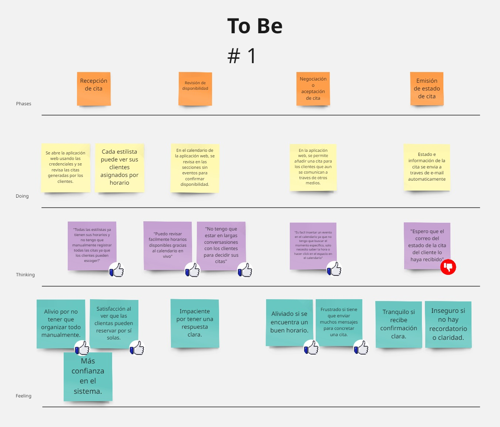

</div>

<div style="text-align: center; margin-top: 1rem; margin-bottom: 1rem;">

Segmento objetivo #2: Clientes de servicios de belleza

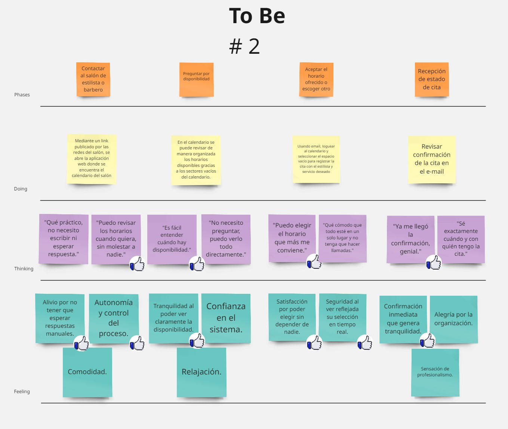

</div>

## 3.2. User Stories

### 3.2.1 User Stories

| **Epic/User Story ID** | **Título** | **Descripción** | **Criterios de Aceptación** | **Epic relacionada** |
|------------------------|------------|-----------------|-----------------------------|----------------------|
| EP01 | **Gestión y visualización de citas** | **Como** cliente, **quiero** poder agendar, modificar y ver mis citas, **para** organizarme mejor y aprovechar los servicios ofrecidos. | No Corresponde | No Corresponde |
| US17 | Selección de salón | **Como** cliente, **quiero** buscar y seleccionar un salón de belleza/barbería, **para** elegir dónde agendar mi cita. | **Escenario 1: Búsqueda de salón disponible<br>Given el cliente desea agendar una cita**<br>**When** realiza la búsqueda de salones<br>**Then** el sistema muestra los disponibles.<br><br>**Escenario 2: Selección exitosa del salón deseado**<br>**Given** el cliente elige un salón<br>**When** realiza la selección<br>**Then** el sistema asocia ese salón a la futura cita. | EP09 |
| US18 | Creación de citas | **Como** cliente, **quiero** poder agendar una cita según disponibilidad, **para** recibir el servicio deseado. | **Escenario 1: Registro correcto de cita nueva**<br>**Given** el cliente desea un servicio<br>**When** agenda una cita<br>**Then** el sistema la registra correctamente.<br><br>**Escenario 2: Verificación de disponibilidad antes de agendar**<br>**Given** el cliente selecciona una hora<br>**When** el sistema valida la disponibilidad<br>**Then** la cita es agendada si está libre. | EP09 |
| US19 | Visualización de citas agendadas | **Como** cliente, **quiero** ver mis citas agendadas, **para** saber cuánto y dónde tengo una reserva. | **Escenario 1: Consulta de citas futuras**<br>**Given** el cliente tiene citas registradas<br>**When** accede a su historial<br>**Then** el sistema muestra las próximas citas.<br><br>**Escenario 2: Revisión de detalles de cita**<br>**Given** una cita está programada<br>**When** el cliente la consulta<br>**Then** el sistema muestra fecha, hora y lugar. | EP09 |
| US20 | Gestión de modificaciones y cancelaciones de citas | **Como** cliente, **quiero** modificar o cancelar citas con anticipación, **para** reorganizar mis tiempos. | **Escenario 1: Modificación de cita antes de la fecha**<br>**Given** el cliente necesita cambiar una cita<br>**When** solicita el cambio<br>**Then** el sistema permite editar la cita.<br><br>**Escenario 2: Cancelación anticipada de una cita**<br>**Given** el cliente desea cancelar<br>**When** solicita la cancelación<br>**Then** el sistema elimina la cita correctamente. | EP09 |
| US21 | Historial de modificaciones de citas | **Como** cliente, **quiero** ver los cambios realizados a mis citas, **para** tener un seguimiento completo de mis actividades. | **Escenario 1: Registro de cambios en una cita**<br>**Given** el cliente modifica una cita<br>**When** el cambio es confirmado<br>**Then** el sistema guarda el cambio en el historial.<br><br>**Escenario 2: Consulta de historial de cambios**<br>**Given** existen modificaciones previas<br>**When** el cliente revisa el historial<br>**Then** el sistema muestra las ediciones realizadas. | EP09 |
| EP02 | **Gestión de negocio** | **Como** dueño/administrador, **quiero** gestionar mis servicios, personal y cuentas, **para** optimizar la operación de mi negocio. | No Corresponde | No Corresponde |
| US22 | Administración de servicios ofrecidos | **Como** dueño/administrador, **quiero** agregar, editar o eliminar servicios, **para** mantener mi catálogo actualizado. | **Escenario 1: Registro de nuevo servicio**<br>**Given** el administrador desea añadir un servicio<br>**When** completa los datos necesarios<br>**Then** el sistema guarda el nuevo servicio.<br><br>**Escenario 2: Eliminación de servicio registrado**<br>**Given** un servicio ya no está disponible<br>**When** el administrador lo elimina<br>**Then** el sistema lo retira del catálogo. | EP10 |
| US23 | Gestión de trabajadores | **Como** dueño/administrador, **quiero** añadir o quitar trabajadores, **para** organizar quién ofrece cada servicio. | **Escenario 1: Asignación de nuevo trabajador**<br>**Given** el administrador incorpora personal<br>**When** añade a un trabajador<br>**Then** el sistema lo registra correctamente.<br><br>**Escenario 2: Eliminación de trabajador inactivo**<br>**Given** un trabajador ya no colabora<br>**When** el administrador lo elimina<br>**Then** el sistema lo retira de la plantilla. | EP10 |
| US24 | Gestión de cuentas bancarias | **Como** dueño/administrador, **quiero** registrar, modificar o eliminar cuentas bancarias, **para** administrar correctamente los pagos recibidos. | **Escenario 1: Registro de cuenta bancaria válida**<br>**Given** el administrador desea registrar una cuenta<br>**When** completa los datos<br>**Then** el sistema guarda la cuenta exitosamente.<br><br>**Escenario 2: Modificación de cuenta existente<br>Given hay una cuenta registrada**<br>**When** el administrador la edita<br>**Then** el sistema actualiza la información. | EP10 |
| EP03 | **Gestión de horarios** | **Como** dueño/administrador, **quiero** gestionar el horario de mis trabajadores, **para** organizar si pueden o no realizar el servicio. | No Corresponde | No Corresponde |
| US09 | Visualización de los horarios | **Como** dueño/administrador, **quiero** visualizar los horarios disponibles , **para** saber cuándo mis trabajadores puede aceptar citas. | **Escenario 1: Visualización correcta de horarios disponibles**<br>**Given** el administrador tiene horarios definidos<br>**When** accede a la consulta de disponibilidad<br>**Then** el sistema muestra los horarios de atención establecidos.<br><br>**Escenario 2: Visualización vacía sin horarios definidos**<br>**Given** no se ha configurado ningún horario<br>**When** el administrador consulta los horarios<br>**Then** el sistema informa que no hay disponibilidad registrada. | EP05 |
| US10 | Configuración de los horarios | **Como** dueño/administrador, **quiero** configurar los horarios de atención de mis trabajadores, **para** definir sus días y horas disponibles. | **Escenario 1: Configuración exitosa de horarios**<br>**Given** el administrador ingresa intervalos válidos<br>**When** define el horario de atención<br>**Then** el sistema registra los nuevos horarios correctamente.<br><br>**Escenario 2: Fallo en la configuración por conflictos de horario**<br>**Given** el administrador ingresa horarios que se superponen o son inválidos<br>**When** intenta configurar la disponibilidad<br>**Then** el sistema impide el registro e informa el conflicto. | EP05 |
| EP04 | **Gestión de subscripciones** | **Como** dueño/administrador, **quiero** conocer y contratar planes de suscripción, **para** acceder a beneficios adicionales de la plataforma. | No Corresponde | No Corresponde |
| US11 | Visualización de beneficios de suscripción | **Como** dueño/administrador, **quiero** ver qué beneficios incluye cada plan, **para** elegir el más adecuado para mí. | **Escenario 1: Consulta exitosa de beneficios**<br>**Given** el administrador tiene una cuenta activa<br>**When** consulta los beneficios de los planes<br>**Then** el sistema muestra los beneficios disponibles en cada plan.<br><br>**Escenario 2: Validación de beneficios según plan**<br>**Given** el administrador accede al sistema<br>**When** verifica un plan específico<br>**Then** el sistema muestra solo los beneficios que corresponden a ese plan. | EP07 |
| US12 | Visualización de precios | **Como** dueño/administrador, **quiero** ver los precios de cada plan, **para** tomar decisiones según mi presupuesto. | **Escenario 1: Visualización de precios de todos los planes**<br>**Given** el administrador desea conocer los planes<br>**When** accede a la información de precios<br>**Then** el sistema muestra los costos de cada plan disponible.<br><br>**Escenario 2: Consulta de precio por plan específico**<br>**Given** el administrador selecciona un plan<br>**When** consulta su precio<br>**Then** el sistema muestra el precio correspondiente a ese plan. | EP07 |
| US13 | Estado y nivel de suscripción | **Como** dueño/administrador, **quiero** ver el estado de mi suscripción actual, **para** saber su está activa y cuándo expira. | **Escenario 1: Verificación de suscripción activa**<br>**Given** el administrador posee una suscripción<br>**When** accede a su estado actual<br>**Then** el sistema muestra si está activa y su nivel.<br><br>**Escenario 2: Visualización de fecha de expiración**<br>**Given** la suscripción del administrador está activa<br>**When** consulta la expiración<br>**Then** el sistema muestra la fecha de vencimiento. | EP07 |
| US14 | Contratación de plan de suscripción | **Como** dueño/administrador, **quiero** contratar un plan, **para** activar sus beneficios en mi cuenta. | **Escenario 1: Activación de plan exitosamente**<br>**Given** el administrador elige un plan<br>**When** realiza la contratación<br>**Then** el sistema activa la suscripción correctamente.<br><br>**Escenario 2: Asociación de beneficios al contratar**<br>**Given** el plan es contratado<br>When se confirma la contratación<br>**Then** el sistema habilita los beneficios del plan. | EP07 |
| EP05 | **Gestión de Pagos y Facturación** | **Como** usuario, **quiero** pagar y recibir facturas de manera clara y segura, **para** tener control sobre mis transacciones. | No Corresponde | No Corresponde |
| US15 | Confirmación de pago | **Como** usuario, **quiero** recibir una confirmación inmediata al completar un pago, **para** asegurarme de que la transacción fue exitosa. | **Escenario 1: Confirmación inmediata tras pago válido**<br>**Given** el usuario realiza un pago<br>**When** completa la transacción<br>**Then** el sistema confirma que fue exitosa.<br><br>.**Escenario 2: Validación del estado del pago**<br>**Given** el usuario ha pagado<br>**When** consulta el estado<br>**Then** el sistema indica que el pago fue procesado correctamente. | EP08 |
| US16 | Renovación automática de suscripción | **Como** dueño/administrador, **quiero** que mi plan se renueve automáticamente, **para** no tener que pagar manualmente cada vez. | **Escenario 1: Renovación automática sin errores**<br>**Given** el administrador tiene renovación automática activa<br>**When** llega la fecha programada<br>**Then** el sistema renueva la suscripción automáticamente.<br><br>**Escenario 2: Confirmación de renovación exitosa**<br>**Given** se ejecuta la renovación automática<br>**When** el sistema la procesa<br>**Then** se confirma al administrador que fue exitosa. | EP08 |
| EP06 | **Registro de usuario** | **Como** nuevo usuario, **quiero** registrarme fácilmente en la plataforma, **para** poder acceder a sus funcionalidades. | No Corresponde | No Corresponde |
| US01 | Registro de un cliente | **Como** cliente, **quiero** registrarme proporcionando mis datos personales, **para** crear una cuenta. | **Escenario 1: Registro exitoso de un cliente**<br>**Given** el cliente proporciona datos personales válidos<br>**When** solicita crear una cuenta<br>**Then** el sistema crea una cuenta y confirma el registro.<br><br>**Escenario 2: Registro fallido por datos incompletos**<br>**Given** el cliente no proporciona todos los datos requeridos<br>**When** intenta registrarse<br>**Then** el sistema impide el registro e informa la omisión. | EP01 |
| US02 | Registro de un salón de belleza/barbería | **Como** dueño/administrador, **quiero** poder registrar mi negocio, **para** gestionar mis servicios en la plataforma. | **Escenario 1: Registro exitoso de un negocio**<br>**Given** el administrador proporciona información válida del negocio<br>**When** solicita registrar su salón o barbería<br>**Then** el sistema almacena los datos y confirma el registro del negocio.<br><br>**Escenario 2: Registro fallido por datos inválidos del negocio**<br>**Given** el administrador ingresa información inválida o incompleta<br>**When** intenta registrar el negocio<br>**Then** el sistema rechaza el registro e informa el problema. | EP01 |
| EP07 | **Inicio de sesión** | **Como** usuario registrado, **quiero** iniciar sesión con mis credenciales, **para** acceder a mi cuenta de forma segura. | No Corresponde | No Corresponde |
| US03 | Inicio de sesión del usuario | **Como** usuario, **quiero** iniciar sesión con mi correo y contraseña, **para** acceder a mi cuenta. | **Escenario 1: Inicio de sesión exitoso**<br>**Given** el usuario tiene una cuenta registrada<br>**When** proporciona credenciales correctas<br>**Then** el sistema permite el acceso a la cuenta.<br><br>**Escenario 2: Fallo en inicio de sesión por credenciales incorrectas**<br>**Given** el usuario proporciona credenciales inválidas<br>**When** intenta iniciar sesión<br>**Then** el sistema rechaza el acceso e informa el error. | EP02 |
| US04 | Recuperación de contraseña | **Como** usuario, **quiero** recuperar el acceso a mi cuenta si olvido la contraseña, **para** poder usar la plataforma nuevamente. | **Escenario 1: Solicitud exitosa de recuperación de contraseña**<br>**Given** el usuario indica su información asociada a la cuenta<br>**When** solicita recuperar su contraseña<br>**Then** el sistema genera instrucciones de recuperación.<br><br>**Escenario 2: Solicitud fallida por información inválida**<br>**Given** el usuario proporciona información no registrada<br>**When** solicita recuperar su contraseña<br>**Then** el sistema informa que no puede completar la solicitud. | EP02 |
| EP08 | **Cierre de sesión y eliminación de la cuenta** | **Como** usuario, **quiero** cerrar sesión o eliminar mi cuenta, **para** tener control sobre mi acceso y privacidad. | No Corresponde | No Corresponde |
| US07 | Cierre de sesión | **Como** usuario, **quiero** poder cerrar sesión de forma segura, **para** proteger mis datos cuando no uso la app. | **Escenario 1: Cierre de sesión exitoso**<br>**Given** el usuario tiene una sesión activa<br>**When** solicita cerrar la sesión<br>**Then** el sistema finaliza la sesión y revoca el acceso.<br><br>**Escenario 2: Cierre de sesión sin sesión activa**<br>**Given** no hay una sesión iniciada<br>**When** el usuario intenta cerrar sesión<br>**Then** el sistema no realiza ninguna acción. | EP04 |
| US08 | Eliminación de cuenta | **Como** usuario, **quiero** eliminar mi cuenta y datos personales, **para** dejar de utilizar la plataforma si así lo deseo. | **Escenario 1: Eliminación exitosa de cuenta**<br>**Given** el usuario está autenticado<br>**When** solicita eliminar su cuenta<br>**Then** el sistema elimina la cuenta y los datos asociados.<br><br>**Escenario 2: Fallo en la eliminación de cuenta por falta de autenticación**<br>**Given** el usuario no está autenticado<br>**When** intenta eliminar su cuenta<br>**Then** el sistema impide la eliminación e informa la necesidad de autenticarse. | EP04 |
| EP09 | **Edición de perfil de usuario** | **Como** usuario, **quiero** editar los datos de mi perfil, **para** mantener mi información actualizada y personalizada según mi rol. | No Corresponde | No Corresponde |
| US05 | Edición del perfil del cliente | **Como** cliente, **quiero** actualizar mi información personal, **para** mantener mis datos actualizados. | **Escenario 1: Edición exitosa del perfil**<br>**Given** el cliente accede a su información personal<br>**When** actualiza sus datos correctamente<br>**Then** el sistema guarda los cambios y confirma la actualización.<br><br>**Escenario 2: Fallo en edición por datos inválidos**<br>**Given** el cliente proporciona datos incorrectos<br>**When** intenta actualizar su perfil<br>**Then** el sistema rechaza la edición e informa el motivo. | EP03 |
| US06 | Personalización del perfil del salón de belleza/barbería | **Como** dueño/administrador, **quiero** poder personalizar el perfil de mi salon de belleza/barbería con información relevante y estética, **para** atraer a más cliente. | **Escenario 1: Personalización exitosa del perfil del negocio**<br>**Given** el administrador accede a la configuración del negocio<br>**When** modifica los datos con información válida<br>**Then** el sistema actualiza el perfil del negocio.<br><br>**Escenario 2: Fallo en personalización por datos inválidos**<br>**Given** el administrador proporciona información no aceptada<br>**When** intenta modificar el perfil del negocio<br>**Then** el sistema impide la actualización e informa el error. | EP03 |
| EP10 | **Gestión de notificaciones** | **Como** usuario, **quiero** recibir notificaciones personalizadas sobre mis citas, pagos y promociones, **para** estar siempre informado. | No Corresponde | No Corresponde |
| US25 | Recepción de notificaciones del estado de la cita | **Como** cliente, **quiero** recibir notificaciones sobre confirmación, cancelación o modificación de citas, **para** estar al tanto de mis reservas. | **Escenario 1: Notificación por confirmación de cita**<br>**Given** el cliente agenda una cita<br>**When** esta es confirmada<br>**Then** el sistema envía una notificación.<br><br>**Escenario 2: Aviso por modificación de cita**<br>**Given** una cita es modificada<br>**When** se actualiza su estado<br>**Then** el cliente recibe una notificación del cambio. | EP11 |
| US26 | Alertas por vencimiento o fallo de pago | **Como** usuario, **quiero** ser alertado si hay un problema con mi pago o si está por vencer mi suscripción, **para** tomar acciones a tiempo. | **Escenario 1: Alerta de vencimiento próximo**<br>**Given** la suscripción está por expirar<br>**When** se acerca la fecha límite<br>**Then** el sistema alerta al usuario<br><br>**Escenario 2: Notificación por fallo en el pago**<br>**Given** un pago no se concreta<br>**When** el sistema detecta el error<br>**Then** se notifica al usuario del problema. | EP11 |
| US27 | Configuración de medios de notificación | **Como** usuario, **quiero** elegir si recibir notificaciones por correo, SMS o dentro de la plataforma, **para** tener un mejor control de mi información. | **Escenario 1: Selección del medio de notificación preferido**<br>**Given** el usuario quiere cambiar el medio de notificación<br>**When** accede a su configuración<br>**Then** el sistema permite elegir entre las opciones disponibles.<br><br>**Escenario 2: Confirmación de medio seleccionado**<br>**Given** el usuario elige un medio<br>**When** guarda los cambios<br>**Then** el sistema respeta la nueva configuración. | EP11 |
| US28 | Recepción de notificaciones sobre promociones y descuentos | **Como** cliente, **quiero** recibir promociones y descuentos que me interesen, **para** aprovechar ofertas relevantes. | **Escenario 1: Envío de promoción activa**<br>**Given** hay una promoción vigente<br>**When** el sistema identifica usuarios interesados<br>**Then** se les envía la promoción correspondiente.<br><br>**Escenario 2: Recepción correcta de promoción configurada**<br>**Given** el cliente acepta recibir promociones<br>**When** se lanza una campaña<br>**Then** recibe la notificación correctamente. | EP11 |
| EP11 | **Landing Page** | **Como** visitante, **quiero** ver una página inicial atractiva con toda la información relevante, **para** decidir si deseo registrarme o contactar. | No Corresponde | No Corresponde |
| US29 | Visualización general de los servicios | **Como** visitante, **quiero** ver una vista general de los servicios ofrecidos, **para** entender qué tipo de atención puedo recibir. | **Escenario 1: Muestra de catálogo de servicios disponibles**<br>**Given** el visitante desea informarse<br>**When** accede al listado de servicios<br>**Then** el sistema muestra todos los servicios activos.<br><br>**Escenario 2: Visualización de detalles de servicio**<br>**Given** el visitante elige un servicio<br>**When** accede a la descripción<br>**Then** el sistema muestra la información detallada. | EP12 |
| US30 | Visualización de beneficios | **Como** visitante, **quiero** ver los beneficios de usar la plataforma, **para** motivarme a registrarme. | **Escenario 1: Despliegue de beneficios por usar la plataforma**<br>**Given** el visitante quiere conocer ventajas<br>**When** accede a la sección correspondiente<br>**Then** el sistema muestra los beneficios disponibles.<br><br>**Escenario 2: Validación de beneficios antes del registro**<br>**Given** el visitante no está registrado<br>**When** consulta los beneficios<br>**Then** el sistema permite visualizar la información sin restricción. | EP12 |
| US31 | Planes y precios | **Como** visitante, **quiero** ver los planes de suscripción y sus precios, **para** saber si se ajustan a mis necesidades. | **Escenario 1: Muestra general de planes y precios**<br>**Given** el visitante desea comparar opciones<br>**When** accede a la sección de planes<br>**Then** el sistema muestra los precios y características.**Escenario 2: Consulta de detalle de un plan específico**<br>**Given** el visitante selecciona un plan<br>**When** solicita más información<br>**Then** el sistema despliega los detalles y precio. | EP12 |
| US32 | Testimonios | **Como** visitante, **quiero** leer testimonios de otros usuarios, **para** ganar confianza en la plataforma. | **Escenario 1: Visualización de testimonios disponibles**<br>**Given** el visitante está explorando la plataforma<br>**When** accede a testimonios<br>**Then** el sistema muestra los comentarios de otros usuarios.<br><br>**Escenario 2: Validación de experiencia positiva por testimonios**<br>**Given** los testimonios están activos<br>**When** el visitante los revisa<br>**Then** puede conocer opiniones reales de otros clientes. | EP12 |
| US33 | Call to action | **Como** visitante, **quiero** encontrar botones de acción claros, **para** empezar a usar la plataforma fácilmente. | **Escenario 1: Visualización de opciones para iniciar uso**<br>**Given** el visitante quiere comenzar<br>**When** encuentra llamados a la acción<br>**Then** el sistema los muestra de manera clara.<br><br>**Escenario 2: Seguimiento del flujo tras clic en llamado**<br>**Given** el visitante acciona un botón<br>**When** se registra la interacción<br>**Then** el sistema lo redirige correctamente. | EP12 |
| US34 | Contacto o soporte | **Como** visitante, **quiero** poder contactarme con el equipo o recibir soporte, **para** resolver dudas antes de registrarme. | **Escenario 1: Acceso a canal de contacto**<br>**Given** el visitante tiene una duda<br>**When** busca ayuda<br>**Then** el sistema le muestra opciones para contactarse.<br><br>**Escenario 2: Confirmación de recepción de mensaje de soporte**<br>**Given** el visitante envía una consulta<br>**When** el sistema la recibe<br>**Then** emite una confirmación automática. | EP12 |
| US35 | Información sobre uTime | **Como** visitante, **quiero** poder acceder una sección que explique quiénes son los creadores, **para** tener confianza en la plataforma y su propósito. | **Escenario 1: Mostrar información sobre la startup**<br>**Given** que soy un visitante en la página principal<br>**When** hago clic en el enlace "About US" us del menú de navegación<br>**Then** se debe mostrar una sección con información sobre Pactech, incluyendo su misión, visión y propósito.<br><br>**Escenario 2: Visualizar los integrantes del equipo**<br>**Given** que estoy en la sección "About Us"<br>**When**visualizo la información de la empresa<br>**Then** debo poder ver a los integrantes de Paxtech. | EP12 |

### 3.2.2 Technical Stories

| **ID** | **Título** | **Descripción** | **Criterios de Aceptación** | **Epic Relacionado** |
|--------|------------|-----------------|-----------------------------|----------------------|
| TS01 | Encriptación de contraseñas | **Como** developer, **quiero** asegurar las contraseñas mediante hashing y salting, **para** proteger los datos de los usuarios. | **Escenario 1: Almacenamiento seguro al registrarse**<br>**Given** un nuevo usuario se registra<br>**When** se guarda su contraseña<br>**Then** la contraseña debe almacenarse en formato hash con salt.<br><br>**Escenario 2: Comparación segura al hacer login**<br>**Given** un usuario registrado intenta iniciar sesión<br>**When** el sistema compara la contraseña ingresada con la almacenada<br>**Then** debe usar el hash y salt para verificar la coincidencia. | EP06 |
| TS02 | Actualización en tiempo real de horarios y citas | **Como** developer, **quiero** que los horarios y las citas se actualicen en tiempo real, **para** que los usuarios vean disponibilidad actualizada. | **Escenario 1: Horario actualizado sin recargar**<br>**Given** un horario es actualizado por el administrador<br>**When** otro usuario está viendo los horarios<br>**Then** los cambios se reflejan automáticamente.<br><br>**Escenario 2: Cita nueva visible en tiempo real**<br>**Given** un cliente agenda una cita<br>**When** la cita es confirmada<br>**Then** el nuevo horario se muestra en tiempo real en el panel del salón. | EP05/EP06 |
| TS03 | Validaciones de formularios en frontend y backend | **Como** developer, **quiero** implementar validaciones robustas en formularios, **para** evitar datos erróneos o maliciosos. | **Escenario 1: Campo requerido vacío**<br>**Given** el usuario deja el campo "correo electrónico" vacío<br>**When** intenta enviar el formulario<br>**Then** el sistema muestra un mensaje de error.<br><br>**Escenario 2: Formato incorrecto en campo de teléfono**<br>**Given** el usuario escribe un teléfono no numérico<br>**When** intenta enviar el formulario<br>**Then** el sistema muestra un mensaje de validación. | Todas |
| TS04 | Diseño responsive y accesible | **Como** developer, **quiero** aplicar diseño responsive y accesibilidad, **para** que el sitio funcione bien en cualquier dispositivo. | **Escenario 1: Visualización en smartphone**<br>**Given** el usuario accede desde un smartphone<br>**When** navega por el sitio<br>**Then** los elementos se ajustan correctamente.<br><br>**Escenario 2: Accesibilidad con lector de pantalla**<br>**Given** un usuario con discapacidad visual accede al sitio<br>**When** usa un lector de pantalla<br>**Then** los elementos clave tienen etiquetas accesibles. | Todas |
| TS05 | Crear endpoint para registro de usuario | **Como** developer, **quiero** crear el endpoint POST /usuarios para registrar clientes y salones de belleza, **para** permitir su incorporación al sistema. | **Escenario 1: Registro exitoso de cliente**<br>**Given** un cliente envía una solicitud POST con datos válidos<br>**When** el endpoint procesa la petición<br>**Then** se registra y devuelve un token de autenticación.<br><br>**Escenario 2: Datos incompletos en el registro**<br>**Given** un usuario envía datos incompletos<br>**When** el backend valida la solicitud<br>**Then** devuelve un error 400 indicando campos faltantes. | EP06 |
| TS06 | Crear endpoint de login con JWT | **Como** developer, **quiero** crear el endpoint POST /login con generación de JWT, **para** autenticar a los usuarios del sistema. | **Escenario 1: Login exitoso**<br>**Given** un usuario envía su correo y contraseña correctos<br>**When** se autentica correctamente<br>**Then** el sistema devuelve un JWT válido.<br><br>**Escenario 2: Login fallido**<br>**Given** un usuario intenta iniciar sesión con datos erróneos<br>**When** el sistema verifica las credenciales<br>**Then** devuelve un error 401. | EP07 |
| TS07 | Crear endpoint para agendar citas | **Como** developer, **quiero** crear el endpoint POST /citas **para** que los usuarios puedan agendar una cita con un salón. | **Escenario 1: Cita agendada correctamente**<br>**Given** un cliente envía una solicitud con fecha y hora disponibles<br>**When** la solicitud es válida<br>**Then** la cita se crea y se confirma.<br><br>**Escenario 2: Horario no disponible**<br>**Given** un cliente intenta agendar en un horario ocupado<br>**When** envía la solicitud<br>**Then** el sistema responde con un error indicando indisponibilidad. | EP06 |
| TS08 | Crear endpoint para gestionar horarios | **Como** developer, **quiero** crear los endpoints GET /horarios y PUT /horarios, **para** visualizar y actualizar los horarios del salón. | **Escenario 1: Visualización de horarios**<br>**Given** el administrador consulta el endpoint GET /horarios<br>**When** hay horarios configurados<br>**Then** el sistema devuelve la lista correctamente.<br><br>**Escenario 2: Actualización de horarios**<br>**Given** el administrador quiere cambiar su horario<br>**When** envía una solicitud PUT con los nuevos datos<br>**Then** el sistema actualiza la información. | EP09 |
| TS09 | Crear endpoint de pagos | **Como** developer, **quiero** crear el endpoint POST /pagos **para** procesar pagos usando la pasarela integrada. | **Escenario 1: Pago procesado exitosamente**<br>**Given** el usuario quiere pagar una suscripción<br>**When** envía datos válidos a POST /pagos<br>**Then** el sistema procesa el pago y registra la transacción.<br><br>**Escenario 2: Pago rechazado**<br>**Given** el usuario envía un método de pago inválido<br>**When** se procesa la solicitud<br>**Then** el sistema devuelve un error con el motivo del fallo. | EP05 |
| TS10 | Crear endpoints para suscripciones | **Como** developer, **quiero** implementar GET /suscripciones, POST /suscripciones, y PUT /suscripciones **para** gestionar los planes de los usuarios. | **Escenario 1: Consultar planes disponibles**<br>**Given** un usuario accede a GET /suscripciones<br>**When** el sistema recibe la solicitud<br>**Then** devuelve una lista de planes y beneficios.<br><br>**Escenario 2: Cambio de plan**<br>**Given** un usuario con plan activo quiere cambiar<br>**When** envía una solicitud PUT con el nuevo plan<br>**Then** el sistema actualiza la suscripción. | EP08 |
| TS11 | Crear endpoint para recibir notificaciones | **Como** developer, **quiero** crear el endpoint POST /notificaciones **para** recibir y registrar eventos que generen alertas al usuario. | **Escenario 1: Notificación por cita creada**<br>**Given** un cliente agenda una cita<br>**When** el evento se genera<br>**Then** el sistema envía una notificación mediante POST /notificaciones.<br><br>**Escenario 2: Notificación por vencimiento de pago**<br>**Given** una suscripción está por vencer<br>**When** se detecta la proximidad de vencimiento<br>**Then** se genera y envía una notificación automática. | EP10 |
| TS12 | Crear endpoints para gestión de proveedores | **Como** developer, **quiero** crear los endpoints GET /providers, GET /providers/{id}, y POST /providers, **para** manejar el registro y consulta de proveedores. | **Escenario 1: Registro de proveedor**<br>**Given** un proveedor envía una solicitud POST con datos válidos<br>**When** se valida la solicitud<br>**Then** se registra y devuelve una confirmación.<br><br>**Escenario 2: Visualización de todos los proveedores**<br>**Given** un usuario consulta el listado<br>**When** accede a GET /providers<br>**Then** recibe una lista completa.<br><br>**Escenario 3: Consulta por ID**<br>**Given** un proveedor registrado<br>**When** accede a GET /providers/{id}<br>**Then** recibe los datos correspondientes. | EP04 |
| TS13 | Crear endpoints para perfil de proveedores | **Como** developer, **quiero** implementar los endpoints GET /providerProfile/{id} y POST /providerProfile, **para** gestionar los perfiles de proveedores. | **Escenario 1: Registro de perfil**<br>**Given** un nuevo proveedor envía una solicitud POST con datos válidos<br>**When** se valida y registra<br>**Then** se crea su perfil.<br><br>**Escenario 2: Visualización de perfil por ID**<br>**Given** un ID válido de proveedor<br>**When** se accede a GET /providerProfile/{id}<br>**Then** se devuelven sus datos. | EP04 |
| TS14 | Crear endpoints para trabajadores | **Como** developer, **quiero** implementar GET /workers, GET /workers/{id} y POST /workers, **para** gestionar los trabajadores del sistema. | **Escenario 1: Registro de trabajador**<br>**Given** un salón registra un nuevo trabajador<br>**When** envía datos válidos<br>**Then** se guarda correctamente.<br><br>**Escenario 2: Listar trabajadores**<br>**Given** un usuario accede al sistema<br>**When** realiza una solicitud GET<br>**Then** recibe todos los trabajadores.<br><br>**Escenario 3: Consultar por ID**<br>**Given** un ID válido<br>**When** accede a GET /workers/{id}<br>**Then** recibe la información del trabajador. | EP04 |
| TS15 | Crear endpoints para clientes | **Como** developer, **quiero** crear los endpoints GET /clients, GET /clients/{id} y POST /clients, **para** gestionar a los clientes del sistema. | **Escenario 1: Registro de cliente**<br>**Given** un cliente nuevo<br>**When** envía una solicitud POST con datos válidos<br>**Then** se registra correctamente.<br><br>**Escenario 2: Listado de clientes**<br>**Given** un administrador accede a GET /clients<br>**When** realiza la solicitud<br>**Then** ve todos los clientes.<br><br>**Escenario 3: Consulta individual**<br>**Given** un ID de cliente<br>**When** accede a GET /clients/{id}<br>**Then** recibe los datos correspondientes. | EP06 |
| TS16 | Implementación de endpoints para gestión de reviews | **Como** developer, **quiero** implementar GET /reviews, GET /reviews/{id} y POST /reviews, **para** gestionar las reseñas de los clientes. | **Escenario 1: Listar todas las reviews**<br>**Given** un usuario accede a GET /reviews<br>**When** hay reseñas registradas<br>**Then** el sistema devuelve la lista completa.<br><br>**Escenario 2: Registrar nueva review**<br>**Given** un cliente envía una reseña válida<br>**When** se realiza POST /reviews<br>**Then** la reseña se almacena correctamente.<br><br>**Escenario 3: Consultar review por ID**<br>**Given** un ID de reseña válido<br>**When** se accede a GET /reviews/{id}<br>**Then** el sistema devuelve los datos de la reseña. | EP11 |
| TS17 | Crear endpoints para servicios ofrecidos | **Como** developer, **quiero** implementar GET /services y POST /services, **para** registrar y consultar los servicios del salón. | **Escenario 1: Registro de nuevo servicio**<br>**Given** un salón desea ofrecer un nuevo servicio<br>**When** envía una solicitud POST válida<br>**Then** el servicio se registra.<br><br>**Escenario 2: Visualizar servicios**<br>**Given** un cliente explora servicios<br>**When** accede a GET /services<br>**Then** se listan todos los servicios registrados. | EP05 |
| TS18 | Crear endpoints para gestión de usuarios | **Como** developer, **quiero** implementar GET /users, GET /users/{id}, **para** consultar la información general de usuarios registrados. | **Escenario 1: Ver todos los usuarios**<br>**Given** un administrador accede a GET /users<br>**When** hay usuarios registrados<br>**Then** se listan correctamente.<br><br>**Escenario 2: Ver usuario por ID**<br>**Given** un ID válido<br>**When** se accede a GET /users/{id}<br>**Then** se muestran los datos del usuario. | EP06 |

### 3.2.3 Spike Stories

Las Spike Stories de uTime son investigaciones técnicas que el equipo realiza antes de implementar integraciones con APIs externas. Estas historias permiten evaluar la viabilidad, riesgos y esfuerzo requerido para integrar servicios como Stripe e ImgBB en la plataforma.

<table>
<thead>
<tr>
<th colspan="2">Spike Story 1: Investigación de Integración de Stripe para Procesamiento de Pagos</th>
</tr>
</thead>
<tbody>
<tr>
<td><b>Historia</b></td>
<td><strong>Como</strong> equipo de desarrollo de uTime, <strong>quiero</strong> investigar y prototipar la integración de Stripe en nuestra aplicación móvil y backend, <strong>para que</strong> podamos entender las implicaciones técnicas, riesgos potenciales y esfuerzo requerido para la implementación completa de pagos en uTime.</td>
</tr>
<tr>
<td><b>Criterio 1</b></td>
<td><strong>Dado que</strong> el equipo necesita entender las capacidades de Stripe para el procesamiento de pagos en aplicaciones móviles, <strong>cuando</strong> el desarrollador revisa la documentación de la API de Stripe (Payments, Checkout, Mobile SDKs), <strong>entonces</strong> se debe documentar en un reporte compartido los productos y flujos de pago más adecuados para uTime.</td>
</tr>
<tr>
<td><b>Criterio 2</b></td>
<td><strong>Dado que</strong> la aplicación móvil necesita procesar pagos de manera segura, <strong>cuando</strong> el desarrollador evalúa la compatibilidad con Stripe Mobile SDKs para Android e iOS, <strong>entonces</strong> se debe documentar los requisitos de integración móvil, incluyendo componentes de UI específicos y lógica de negocio para manejo de tokens.</td>
</tr>
<tr>
<td><b>Criterio 3</b></td>
<td><strong>Dado que</strong> el backend necesita manejar la lógica de pagos y webhooks, <strong>cuando</strong> el desarrollador evalúa la compatibilidad con la librería Stripe para el backend, <strong>entonces</strong> se debe documentar los requisitos de integración backend, incluyendo configuración de endpoints REST y manejo de webhooks.</td>
</tr>
<tr>
<td><b>Criterio 4</b></td>
<td><strong>Dado que</strong> es necesario asegurar el procesamiento seguro de pagos, <strong>cuando</strong> el desarrollador analiza los riesgos de seguridad potenciales, <strong>entonces</strong> el reporte debe incluir un resumen de estos riesgos y las características de mitigación proporcionadas por Stripe.</td>
</tr>
<tr>
<td><b>Criterio 5</b></td>
<td><strong>Dado que</strong> la aplicación debe mantener un buen rendimiento durante el procesamiento de pagos, <strong>cuando</strong> el desarrollador evalúa el impacto de la integración de Stripe en el rendimiento, <strong>entonces</strong> se deben documentar los hallazgos, incluyendo cualquier cuello de botella potencial.</td>
</tr>
</tbody>
</table>

<br>

<table>
<thead>
<tr>
<th colspan="2">Spike Story 2: Investigación de Integración de ImgBB para Gestión de Imágenes</th>
</tr>
</thead>
<tbody>
<tr>
<td><b>Historia</b></td>
<td><strong>Como</strong> equipo de desarrollo de uTime, <strong>quiero</strong> investigar y prototipar la integración de ImgBB en nuestra aplicación móvil y backend, <strong>para que</strong> podamos entender las implicaciones técnicas, limitaciones y esfuerzo requerido para la implementación completa de gestión de imágenes de perfiles y servicios.</td>
</tr>
<tr>
<td><b>Criterio 1</b></td>
<td><strong>Dado que</strong> el equipo necesita entender las capacidades de ImgBB para el almacenamiento y gestión de imágenes, <strong>cuando</strong> el desarrollador revisa la documentación de la API de ImgBB (upload, delete, management), <strong>entonces</strong> se debe documentar en un reporte compartido los endpoints y funcionalidades más adecuados para uTime.</td>
</tr>
<tr>
<td><b>Criterio 2</b></td>
<td><strong>Dado que</strong> la aplicación móvil necesita subir y gestionar imágenes de perfiles y servicios, <strong>cuando</strong> el desarrollador evalúa la compatibilidad con las APIs de ImgBB para Android e iOS, <strong>entonces</strong> se debe documentar los requisitos de integración móvil, incluyendo manejo de archivos de imagen y compresión.</td>
</tr>
<tr>
<td><b>Criterio 3</b></td>
<td><strong>Dado que</strong> el backend necesita procesar y almacenar referencias de imágenes, <strong>cuando</strong> el desarrollador evalúa la integración con ImgBB desde el backend, <strong>entonces</strong> se debe documentar los requisitos de integración backend, incluyendo manejo de URLs de imágenes y validación.</td>
</tr>
<tr>
<td><b>Criterio 4</b></td>
<td><strong>Dado que</strong> es necesario entender las limitaciones del servicio gratuito de ImgBB, <strong>cuando</strong> el desarrollador analiza los límites de almacenamiento, ancho de banda y funcionalidades, <strong>entonces</strong> el reporte debe incluir un análisis de limitaciones y posibles costos de actualización.</td>
</tr>
<tr>
<td><b>Criterio 5</b></td>
<td><strong>Dado que</strong> la gestión de imágenes afecta directamente la experiencia del usuario, <strong>cuando</strong> el desarrollador evalúa el impacto de ImgBB en la velocidad de carga y calidad de imágenes, <strong>entonces</strong> se deben documentar los hallazgos sobre rendimiento y recomendaciones para optimización.</td>
</tr>
</tbody>
</table>

## 3.3. Product Backlog

| **# Orden** | **User Story ID** | **Titulo** | **Descripción** | **Story Points** |
|-------------|-------------------|------------|-----------------|------------------|
| #1 | US29 | Visualización general de los servicios | **Como** visitante, **quiero** ver una vista general de los servicios ofrecidos, **para** entender qué tipo de atención puedo recibir. | 2 |
| #2 | US30 | Visualización de beneficios | **Como** visitante, **quiero** ver los beneficios de usar la plataforma, **para** motivarme a registrarme. | 2 |
| #3 | US31 | Planes y precios | **Como** visitante, **quiero** ver los planes de suscripción y sus precios, **para** saber si se ajustan a mis necesidades. | 2 |
| #4 | US32 | Testimonios | **Como** visitante, **quiero** leer testimonios de otros usuarios, **para** ganar confianza en la plataforma. | 1 |
| #5 | US33 | Call to action | **Como** visitante, **quiero** encontrar botones de acción claros, **para** empezar a usar la plataforma fácilmente. | 1 |
| #6 | US34 | Contacto y Soporte | **Como** visitante, **quiero** poder contactarme con el equipo o recibir soporte, **para** resolver dudas antes de registrarme. | 2 |
| #7 | US35 | Información sobre uTime | **Como** visitante, **quiero** poder acceder una sección que explique quiénes son los creadores, **para** tener confianza en la plataforma y su propósito. | 2 |
| #8 | TS06 | Diseño responsive y accesible | **Como** developer, **quiero** aplicar diseño responsive y accesibilidad, **para** que el sitio funcione bien en cualquier dispositivo. | 3 |
| #9 | TS05 | Validaciones de formularios en frontend y backend | **Como** developer, **quiero** implementar validaciones robustas en formularios, **para** evitar datos erróneos o maliciosos. | 3 |
| #10 | US17 | Selección de salón | **Como** cliente, **quiero** buscar y seleccionar un salón de belleza/barbería, **para** elegir dónde agendar mi cita. | 3 |
| #11 | TS09 | Crear endpoint para agendar citas | **Como** developer, **quiero** crear el endpoint POST /citas **para** que los usuarios puedan agendar una cita con un salón. | 3 |
| #12 | US18 | Creación de citas | **Como** cliente, **quiero** poder agendar una cita según disponibilidad, **para** recibir el servicio deseado. | 5 |
| #13 | TS04 | Actualización en tiempo real de horarios y citas | **Como** developer, **quiero** que los horarios y las citas se actualicen en tiempo real, **para** que los usuarios vean disponibilidad actualizada. | 5 |
| #14 | US19 | Visualización de citas agendadas | **Como** cliente, **quiero** ver mis citas agendadas, **para** saber cuánto y dónde tengo una reserva. | 2 |
| #15 | US20 | Modificación o cancelación de citas | **Como** cliente, **quiero** modificar o cancelar citas con anticipación, **para** reorganizar mis tiempos. | 3 |
| #16 | US21 | Historial de modificaciones de citas | **Como** cliente, **quiero** ver los cambios realizados a mis citas, **para** tener un seguimiento completo de mis actividades. | 3 |
| #17 | US25 | Recepción de notificaciones del estado de la cita | **Como** cliente, **quiero** recibir notificaciones sobre confirmación, cancelación o modificación de citas, **para** estar al tanto de mis reservas. | 2 |
| #18 | TS13 | Crear endpoint para recibir notificaciones | **Como** developer, **quiero** crear el endpoint POST /notificaciones **para** recibir y registrar eventos que generen alertas al usuario. | 3 |
| #19 | US27 | Configuración de medios de notificación | **Como** usuario, **quiero** elegir si recibir notificaciones por correo, SMS o dentro de la plataforma, **para** tener un mejor control de mi información. | 3 |
| #20 | US28 | Notificaciones sobre promociones y descuentos | **Como** cliente, **quiero** recibir promociones y descuentos que me interesen, **para** aprovechar ofertas relevantes. | 2 |
| #21 | TS10 | Crear endpoint para gestionar horarios | **Como** developer, **quiero** crear los endpoints GET /horarios y PUT /horarios, **para** visualizar y actualizar los horarios del salón. | 3 |
| #22 | US22 | Administración de servicios ofrecidos | **Como** dueño/administrador, **quiero** agregar, editar o eliminar servicios, **para** mantener mi catálogo actualizado. | 3 |
| #23 | US23 | Gestión de trabajadores | **Como** dueño/administrador, **quiero** añadir o quitar trabajadores, **para** organizar quién ofrece cada servicio. | 3 |
| #24 | US10 | Configuración de los horarios | **Como** dueño/administrador, **quiero** configurar los horarios de atención de mis trabajadores, **para** definir sus días y horas disponibles. | 3 |
| #25 | US09 | Visualización de los horarios | **Como** dueño/administrador, **quiero** visualizar los horarios disponibles , **para** saber cuándo mis trabajadores puede aceptar citas. | 2 |
| #26 | TS11 | Crear endpoint de pagos | **Como** developer, **quiero** crear el endpoint POST /pagos **para** procesar pagos usando la pasarela integrada. | 3 |
| #27 | TS01 | Integración con pasarela de pagos | **Como** developer, **quiero** integrar la plataforma con pasarelas de pago, **para** gestionar cobros de forma segura. | 5 |
| #28 | US24 | Gestión de cuentas bancarias | **Como** dueño/administrador, **quiero** registrar, modificar o eliminar cuentas bancarias, **para** administrar correctamente los pagos recibidos. | 3 |
| #29 | US14 | Contratación de plan de suscripción | **Como** dueño/administrador, **quiero** contratar un plan, **para** activar sus beneficios en mi cuenta. | 2 |
| #30 | US11 | Visualización de beneficios de suscripción | **Como** dueño/administrador, **quiero** ver qué beneficios incluye cada plan, **para** elegir el más adecuado para mí. | 2 |
| #31 | US12 | Visualización de precios | **Como** dueño/administrador, **quiero** ver los precios de cada plan, **para** tomar decisiones según mi presupuesto. | 2 |
| #32 | US13 | Estado y nivel de suscripción | **Como** dueño/administrador, **quiero** ver el estado de mi suscripción actual, **para** saber su está activa y cuándo expira. | 2 |
| #33 | TS12 | Crear endpoints para suscripciones | **Como** developer, **quiero** implementar GET /suscripciones, POST /suscripciones, y PUT /suscripciones **para** gestionar los planes de los usuarios. | 5 |
| #34 | US15 | Confirmación de pago | **Como** usuario, **quiero** recibir una confirmación inmediata al completar un pago, **para** asegurarme de que la transacción fue exitosa. | 2 |
| #35 | US16 | Renovación automática de suscripción | **Como** dueño/administrador, **quiero** que mi plan se renueve automáticamente, **para** no tener que pagar manualmente cada vez. | 3 |
| #36 | US26 | Alertas por fallo de pago o vencimiento | **Como** usuario, **quiero** ser alertado si hay un problema con mi pago o si está por vencer mi suscripción, **para** tomar acciones a tiempo. | 2 |
| #37 | US06 | Personalización del perfil del salón de belleza/barbería | **Como** dueño/administrador, **quiero** poder personalizar el perfil de mi salon de belleza/barbería con información relevante y estética, **para** atraer a más cliente. | 3 |
| #38 | US05 | Edición del perfil del cliente | **Como** cliente, **quiero** actualizar mi información personal, **para** mantener mis datos actualizados. | 2 |
| #39 | US08 | Eliminación de cuenta | **Como** usuario, **quiero** eliminar mi cuenta y datos personales, **para** dejar de utilizar la plataforma si así lo deseo. | 2 |
| #40 | US07 | Cierre de sesión | **Como** usuario, **quiero** poder cerrar sesión de forma segura, **para** proteger mis datos cuando no uso la app. | 1 |
| #41 | TS07 | Crear endpoint para registro de usuario | **Como** developer, **quiero** crear el endpoint POST /usuarios para registrar clientes y salones de belleza, **para** permitir su incorporación al sistema. | 3 |
| #42 | US01 | Registro de un cliente | **Como** cliente, **quiero** registrarme proporcionando mis datos personales, **para** crear una cuenta. | 3 |
| #43 | US02 | Registro de un salón de belleza/barbería | **Como** dueño/administrador, **quiero** poder registrar mi negocio, **para** gestionar mis servicios en la plataforma. | 3 |
| #44 | TS08 | Crear endpoint de login con JWT | **Como** developer, **quiero** crear el endpoint POST /login con generación de JWT, **para** autenticar a los usuarios del sistema. | 3 |
| #45 | US03 | Inicio de sesión del usuario | **Como** usuario, **quiero** iniciar sesión con mi correo y contraseña, **para** acceder a mi cuenta. | 2 |
| #46 | US04 | Recuperación de contraseña | **Como** usuario, **quiero** recuperar el acceso a mi cuenta si olvido la contraseña, **para** poder usar la plataforma nuevamente. | 3 |
| #47 | TS03 | Encriptación de contraseñas | **Como** developer, **quiero** asegurar las contraseñas mediante hashing y salting, **para** proteger los datos de los usuarios. | 3 |
| #48 | TS02 | Implementación de autenticación con dos pasos (2FA) | **Como** developer, **quiero** añadir autenticación de dos factores, **para** mejorar la seguridad del inicio de sesión de los usuarios. | 5 |
| #49 | TS06 | Diseño adaptable y accesible (Mobile) | **Como** developer, **quiero** aplicar diseño adaptable y accesibilidad, **para** que la app funcione bien en distintos dispositivos y pueda ser usada por todos los usuarios. | 3 |

<div style="text-align: center; margin-top: 1rem; margin-bottom: 1rem;">

Product Backlog en Jira/Pivotal Tracker.


</div>

## 3.4. Impact Mapping

<div style="text-align: center; margin-top: 1rem; margin-bottom: 1rem;">

Impact Mapping - Web


</div>

<div style="text-align: center; margin-top: 1rem; margin-bottom: 1rem;">

Impact Mapping - Mobile


</div>

<hr class="page-break">

# Capítulo IV: Product Design

[Contenido pendiente]

## 4.1. Style Guidelines

[Contenido pendiente]

### 4.1.1. General Style Guidelines

**Branding**

[Contenido pendiente — incluir marca, slogan, logos.]

**Typography**

[Contenido pendiente — fuentes y jerarquía tipográfica.]

**Colors**

[Contenido pendiente — paleta primaria, secundaria y semántica.]

**Spacing**

[Contenido pendiente — sistema de espaciado / grid base.]

### 4.1.2. Web Style Guidelines

[Contenido pendiente — reglas específicas para web (breakpoints, componentes).]

### 4.1.3. Mobile Style Guidelines

[Contenido pendiente]

#### 4.1.3.1. iOS Mobile Style Guidelines

[Contenido pendiente — lineamientos de Human Interface Guidelines aplicados.]

#### 4.1.3.2. Android Mobile Style Guidelines

[Contenido pendiente — lineamientos de Material Design aplicados.]

## 4.2. Information Architecture

[Contenido pendiente]

### 4.2.1. Organization Systems

[Contenido pendiente]

### 4.2.2. Labeling Systems

[Contenido pendiente]

### 4.2.3. SEO Tags and Meta Tags

[Contenido pendiente — metadatos, Open Graph, keywords.]

### 4.2.4. Searching Systems

[Contenido pendiente]

### 4.2.5. Navigation Systems

[Contenido pendiente]

## 4.3. Landing Page UI Design

### 4.3.1. Landing Page Wireframe

<div style="text-align: center; margin-top: 1rem; margin-bottom: 1rem;">

Wireframe de la Landing Page.


</div>

### 4.3.2. Landing Page Mock-up

<div style="text-align: center; margin-top: 1rem; margin-bottom: 1rem;">

Mock-up de la Landing Page.


</div>

## 4.4. Mobile Applications UX/UI Design

### 4.4.1. Mobile Applications Wireframes

<div style="text-align: center; margin-top: 1rem; margin-bottom: 1rem;">

Wireframes Mobile — [Rol 1]


</div>

<div style="text-align: center; margin-top: 1rem; margin-bottom: 1rem;">

Wireframes Mobile — [Rol 2]


</div>

### 4.4.2. Mobile Applications Wireflow Diagrams

<div style="text-align: center; margin-top: 1rem; margin-bottom: 1rem;">

Wireflow Mobile — [Rol 1]


</div>

### 4.4.3. Mobile Applications Mock-ups

<div style="text-align: center; margin-top: 1rem; margin-bottom: 1rem;">

Mock-up Mobile — [Rol 1]


</div>

### 4.4.4. Mobile Applications User Flow Diagrams

<div style="text-align: center; margin-top: 1rem; margin-bottom: 1rem;">

User Flow Mobile — [Rol 1]


</div>

## 4.5. Mobile Applications Prototyping

### 4.5.1. Android Mobile Applications Prototyping

<div style="text-align: center; margin-top: 1rem; margin-bottom: 1rem;">

Prototipo Android — [PRODUCTO]


[Ver prototipo interactivo en Figma]([URL-FIGMA-ANDROID])

</div>

### 4.5.2. iOS Mobile Applications Prototyping

<div style="text-align: center; margin-top: 1rem; margin-bottom: 1rem;">

Prototipo iOS — [PRODUCTO]


[Ver prototipo interactivo en Figma]([URL-FIGMA-IOS])

</div>

## 4.6. Web Applications UX/UI Design

### 4.6.1. Web Applications Wireframes

<div style="text-align: center; margin-top: 1rem; margin-bottom: 1rem;">

Wireframes Web — [Rol 1]


</div>

### 4.6.2. Web Applications Wireflow Diagrams

<div style="text-align: center; margin-top: 1rem; margin-bottom: 1rem;">

Wireflow Web — [Rol 1]


</div>

### 4.6.3. Web Applications Mock-ups

<div style="text-align: center; margin-top: 1rem; margin-bottom: 1rem;">

Mock-up Web — [Rol 1]


</div>

### 4.6.4. Web Applications User Flow Diagrams

<div style="text-align: center; margin-top: 1rem; margin-bottom: 1rem;">

User Flow Web — [Rol 1]


</div>

## 4.7. Web Applications Prototyping

<div style="text-align: center; margin-top: 1rem; margin-bottom: 1rem;">

Prototipo Web — [PRODUCTO]


[Ver prototipo interactivo en Figma]([URL-FIGMA-WEB])

</div>

## 4.8. Domain-Driven Software Architecture

[Contenido pendiente]

### 4.8.1. Software Architecture Context Diagram

<div style="text-align: center; margin-top: 1rem; margin-bottom: 1rem;">

Diagrama de Contexto (C4 — Nivel 1).


</div>

### 4.8.2. Software Architecture Container Diagrams

<div style="text-align: center; margin-top: 1rem; margin-bottom: 1rem;">

Diagrama de Contenedores (C4 — Nivel 2).


</div>

### 4.8.3. Software Architecture Components Diagrams

<div style="text-align: center; margin-top: 1rem; margin-bottom: 1rem;">

Diagrama de Componentes (C4 — Nivel 3) — Bounded Context [X].


</div>

## 4.9. Software Object-Oriented Design

### 4.9.1. Class Diagrams

<div style="text-align: center; margin-top: 1rem; margin-bottom: 1rem;">

Diagrama de Clases del dominio.


</div>

### 4.9.2. Class Dictionary

| Clase | Atributos | Métodos | Descripción |
|-------|-----------|---------|-------------|
|       |           |         |             |

## 4.10. Database Design

### 4.10.1. Relational/Non-Relational Database Diagram

<div style="text-align: center; margin-top: 1rem; margin-bottom: 1rem;">

Modelo de base de datos.


</div>

<hr class="page-break">

# Capítulo V: Product Implementation

[Contenido pendiente]

## 5.1. Software Configuration Management

### 5.1.1. Software Development Environment Configuration

**Project Management:** [herramienta — Jira / Pivotal Tracker]  
**Requirements Management:** [herramienta]  
**Product UX/UI Design:** [herramienta — Figma / Lucidchart]  
**Software Development:**
- Web Frontend: [stack tecnológico]
- Mobile: [stack tecnológico]
- Backend / API: [stack tecnológico]
- Base de datos: [motor]

**Software Deployment:** [plataforma — AWS / Azure / Vercel / Netlify]  
**Software Documentation:** [herramienta — Swagger / Postman / Redoc]

### 5.1.2. Source Code Management

Se utiliza **GitHub** con flujo de trabajo **GitFlow**. Convenciones de ramas:

- `main`
- `develop`
- `feature/<feature-name>`
- `release/vX.X.X`
- `hotfix/<fix-name>`

**Convenciones de commits (Conventional Commits):**

```
<tipo>(<alcance>): <resumen ≤ 72 caracteres>
```

Tipos: `feat`, `fix`, `docs`, `style`, `refactor`, `test`, `chore`.

### 5.1.3. Source Code Style Guide & Conventions

[Contenido pendiente — estilos por tecnología.]

- **HTML:** [Guía referenciada]
- **CSS:** [Guía referenciada]
- **JavaScript / TypeScript:** [Guía referenciada]
- **[Framework frontend]:** [Guía referenciada]
- **[Framework backend]:** [Guía referenciada]
- **Gherkin:** [Convenciones]

### 5.1.4. Software Deployment Configuration

[Contenido pendiente — describir pipeline, ambientes, variables.]

## 5.2. Product Implementation & Deployment

### 5.2.1. Sprint Backlogs

#### Sprint #1

**Sprint Planning Background**

| Campo | Detalle |
|-------|---------|
| Date | [Fecha] |
| Time | [Hora] |
| Location | [Ubicación / modalidad] |
| Prepared By | [APELLIDOS Y NOMBRES] |
| Attendees | [Lista de asistentes] |
| Sprint N°1 Review Summary | [Contenido pendiente] |
| Sprint N°1 Retrospective Summary | [Contenido pendiente] |
| Sprint Goal & User Stories | [Contenido pendiente] |
| Sprint N°1 Velocity | [Story Points] |
| Sum of Story Points | [Total] |

**Sprint Backlog #1**

<table>
  <thead>
    <tr>
      <th colspan="8">Sprint # 1</th>
    </tr>
    <tr>
      <th colspan="2">User Story</th>
      <th colspan="6">Work-Item / Task</th>
    </tr>
    <tr>
      <th>Id</th>
      <th>Título</th>
      <th>Id</th>
      <th>Título</th>
      <th>Descripción</th>
      <th>Estimación (hrs)</th>
      <th>Asignado a</th>
      <th>Estado (To-do / In-Process / To-Review / Done)</th>
    </tr>
  </thead>
  <tbody>
    <tr>
      <td>US01</td>
      <td>[Título]</td>
      <td>T001</td>
      <td>[Título tarea]</td>
      <td>[Descripción]</td>
      <td></td>
      <td></td>
      <td></td>
    </tr>
  </tbody>
</table>

**Development Evidence for Sprint Review**

| Repository | Branch | Commit Id | Commit Message | Commit Message Body | Committed on (Date) |
|------------|--------|-----------|----------------|---------------------|---------------------|
|            |        |           |                |                     |                     |

**Testing Suite Evidence for Sprint Review**

| Repository | Branch | Commit Id | Commit Message | Committed on (Date) |
|------------|--------|-----------|----------------|---------------------|
|            |        |           |                |                     |

**Execution Evidence for Sprint Review**

[Contenido pendiente — capturas y descripción de funcionalidades entregadas.]

**Services Documentation Evidence for Sprint Review**

| Endpoint | HTTP Method | Description | Request Body | Response |
|----------|-------------|-------------|--------------|----------|
|          |             |             |              |          |

**Software Deployment Evidence for Sprint Review**

[Contenido pendiente — URLs de ambientes, capturas de deployment.]

**Team Collaboration Insights during Sprint**

[Contenido pendiente — métricas de GitHub, capturas.]

### 5.2.2. Implemented Landing Page Evidence

<div style="text-align: center; margin-top: 1rem; margin-bottom: 1rem;">

Landing Page desplegada — [PRODUCTO]


[URL de la Landing Page desplegada]([URL-LANDING])

</div>

### 5.2.3. Implemented Frontend-Web Application Evidence

<div style="text-align: center; margin-top: 1rem; margin-bottom: 1rem;">

Aplicación Web desplegada — [PRODUCTO]


[URL de la aplicación web desplegada]([URL-FRONTEND])

</div>

### 5.2.4. Acuerdo de Servicio - SaaS

**Acuerdo de Nivel de Servicio (SLA) entre [STARTUP] y el Cliente**

Este documento establece los términos del Acuerdo de Servicio (SaaS Agreement) entre **[STARTUP]** (en adelante, "el Proveedor") y el Cliente suscriptor del servicio **[PRODUCTO]**.

**1. Objeto del acuerdo**

[Contenido pendiente]

**2. Disponibilidad del servicio**

[Contenido pendiente — uptime target, horarios de mantenimiento]

**3. Soporte técnico**

[Contenido pendiente — canales, tiempos de respuesta]

**4. Seguridad y privacidad de datos**

[Contenido pendiente]

**5. Planes y precios**

[Contenido pendiente]

**6. Condiciones de cancelación y reembolso**

[Contenido pendiente]

**7. Vigencia**

[Contenido pendiente]

### 5.2.5. Implemented Native-Mobile Application Evidence

<div style="text-align: center; margin-top: 1rem; margin-bottom: 1rem;">

Aplicación Mobile — [PRODUCTO]


</div>

### 5.2.6. Implemented RESTful API and/or Serverless Backend Evidence

<div style="text-align: center; margin-top: 1rem; margin-bottom: 1rem;">

Backend desplegado — [PRODUCTO]


[URL del backend desplegado]([URL-BACKEND])

</div>

### 5.2.7. RESTful API documentation

<div style="text-align: center; margin-top: 1rem; margin-bottom: 1rem;">

Documentación OpenAPI / Swagger.


[Ver documentación de la API]([URL-SWAGGER])

</div>

### 5.2.8. Team Collaboration Insights

<div style="text-align: center; margin-top: 1rem; margin-bottom: 1rem;">

Actividad de commits del equipo.


</div>

## 5.3. Video About-the-Product

[URL del video About-the-Product]([URL-VIDEO-PRODUCTO])

<hr class="page-break">

# Part II: Verification, Validation & Pipeline

<hr class="page-break">

# Capítulo VI: Product Verification & Validation

[Contenido pendiente]

## 6.1. Testing Suites & Validation

### 6.1.1. Core Entities Unit Tests

**Framework:** [JUnit / Jest / PyTest / etc.]

```
// Ejemplo de test unitario
// [Contenido pendiente]
```

| Test ID | Entidad | Método probado | Resultado esperado | Estado |
|---------|---------|----------------|--------------------|--------|
|         |         |                |                    |        |

### 6.1.2. Core Integration Tests

**Framework:** [herramienta]

```
// Ejemplo de test de integración
// [Contenido pendiente]
```

| Test ID | Componentes integrados | Escenario | Resultado esperado | Estado |
|---------|------------------------|-----------|--------------------|--------|
|         |                        |           |                    |        |

### 6.1.3. Core Behavior-Driven Development

**Framework:** [Cucumber / SpecFlow / Behave]

```gherkin
Feature: [Nombre de la feature]

  Scenario: [Nombre del escenario]
    Given [precondición]
    When [acción]
    Then [resultado esperado]
```

### 6.1.4. Core System Tests

**Framework:** [Selenium / Cypress / Playwright]

| Test ID | Flujo de usuario | Navegador / Dispositivo | Resultado esperado | Estado |
|---------|------------------|-------------------------|--------------------|--------|
|         |                  |                         |                    |        |

## 6.2. Static testing & Verification

### 6.2.1. Static Code Analysis

#### 6.2.1.1. Coding standard & Code conventions

[Contenido pendiente — linters / formatters configurados: ESLint, Prettier, Checkstyle, etc.]

<div style="text-align: center; margin-top: 1rem; margin-bottom: 1rem;">

Resultados del linter.


</div>

#### 6.2.1.2. Code Quality & Code Security

[Contenido pendiente — SonarQube / SonarCloud / Snyk / CodeQL.]

<div style="text-align: center; margin-top: 1rem; margin-bottom: 1rem;">

Reporte de calidad y seguridad.


</div>

### 6.2.2. Reviews

| PR / Commit | Revisor | Fecha | Comentarios | Estado |
|-------------|---------|-------|-------------|--------|
|             |         |       |             |        |

## 6.3. Validation Interviews

### 6.3.1. Diseño de Entrevistas

**Preguntas para validación — [Segmento 1]:**

1. [Pregunta 1]
2. [Pregunta 2]
3. [Pregunta 3]

**Preguntas para validación — [Segmento 2]:**

1. [Pregunta 1]
2. [Pregunta 2]
3. [Pregunta 3]

### 6.3.2. Registro de Entrevistas

**Segmento 1 — Entrevista 1**

| Campo | Detalle |
|-------|---------|
| Nombre | [Nombre del entrevistado] |
| Edad | [Edad] |
| Ocupación | [Ocupación] |
| Fecha | [Fecha] |
| Duración | [Duración] |
| Entrevistador | [APELLIDOS Y NOMBRES] |
| URL del video | [URL] |
| Resumen | [Contenido pendiente] |

### 6.3.3. Evaluaciones según heurísticas

| # | Heurística de Nielsen | Hallazgo | Severidad (0-4) | Recomendación |
|---|-----------------------|----------|-----------------|---------------|
| 1 | Visibilidad del estado del sistema |          |                 |               |
| 2 | Correspondencia sistema-mundo real |          |                 |               |
| 3 | Control y libertad del usuario |              |                 |               |
| 4 | Consistencia y estándares |                   |                 |               |
| 5 | Prevención de errores |                       |                 |               |
| 6 | Reconocer antes que recordar |                |                 |               |
| 7 | Flexibilidad y eficiencia de uso |            |                 |               |
| 8 | Diseño estético y minimalista |               |                 |               |
| 9 | Ayudar a reconocer y recuperarse de errores | |                 |               |
| 10 | Ayuda y documentación |                      |                 |               |

## 6.4. Auditoría de Experiencias de Usuario

### 6.4.1. Auditoría realizada

#### 6.4.1.1. Información del grupo auditado

| Campo | Detalle |
|-------|---------|
| Nombre del grupo / Startup | [Grupo auditado] |
| Producto | [Producto auditado] |
| Integrantes | [Lista] |
| Repositorio | [URL] |

#### 6.4.1.2. Cronograma de auditoría realizada

| Fecha | Actividad | Responsable | Observaciones |
|-------|-----------|-------------|---------------|
|       |           |             |               |

#### 6.4.1.3. Contenido de auditoría realizada

[Contenido pendiente — hallazgos, evidencias, recomendaciones.]

<div style="text-align: center; margin-top: 1rem; margin-bottom: 1rem;">

Evidencias de la auditoría realizada.


</div>

### 6.4.2. Auditoría recibida

#### 6.4.2.1. Información del grupo auditor

| Campo | Detalle |
|-------|---------|
| Nombre del grupo / Startup | [Grupo auditor] |
| Integrantes | [Lista] |
| Contacto | [URL / correo] |

#### 6.4.2.2. Cronograma de auditoría recibida

| Fecha | Actividad | Responsable | Observaciones |
|-------|-----------|-------------|---------------|
|       |           |             |               |

#### 6.4.2.3. Contenido de auditoría recibida

[Contenido pendiente — hallazgos reportados por el auditor.]

<div style="text-align: center; margin-top: 1rem; margin-bottom: 1rem;">

Evidencias de la auditoría recibida.


</div>

#### 6.4.2.4. Resumen de modificaciones para subsanar hallazgos

| # | Hallazgo | Severidad | Acción correctiva | Responsable | Estado |
|---|----------|-----------|-------------------|-------------|--------|
|   |          |           |                   |             |        |

<hr class="page-break">

# Capítulo VII: DevOps Practices

[Contenido pendiente]

## 7.1. Continuous Integration

### 7.1.1. Tools and Practices

[Contenido pendiente — herramientas: GitHub Actions / GitLab CI / Jenkins. Prácticas: trunk-based, PR reviews, pre-commit hooks.]

### 7.1.2. Build & Test Suite Pipeline Components

<div style="text-align: center; margin-top: 1rem; margin-bottom: 1rem;">

Pipeline de CI — Build & Test.


</div>

```yaml
# Ejemplo de workflow — [GitHub Actions]
# [Contenido pendiente]
```

## 7.2. Continuous Delivery

### 7.2.1. Tools and Practices

[Contenido pendiente — entrega continua a staging, artifact registry.]

### 7.2.2. Stages Deployment Pipeline Components

<div style="text-align: center; margin-top: 1rem; margin-bottom: 1rem;">

Pipeline de CD — Staging.


</div>

## 7.3. Continuous Deployment

### 7.3.1. Tools and Practices

[Contenido pendiente — despliegue automático a producción, estrategias blue/green, canary, feature flags.]

### 7.3.2. Production Deployment Pipeline Components

<div style="text-align: center; margin-top: 1rem; margin-bottom: 1rem;">

Pipeline de Deployment a Producción.


</div>

## 7.4. Continuous Monitoring

### 7.4.1. Tools and Practices

[Contenido pendiente — Grafana / Datadog / New Relic / Sentry.]

### 7.4.2. Monitoring Pipeline Components

<div style="text-align: center; margin-top: 1rem; margin-bottom: 1rem;">

Dashboard de monitoreo.


</div>

### 7.4.3. Alerting Pipeline Components

| Alerta | Condición | Canal | Severidad |
|--------|-----------|-------|-----------|
|        |           |       |           |

### 7.4.4. Notification Pipeline Components

[Contenido pendiente — integración con Slack / correo / PagerDuty.]

<hr class="page-break">

# Part III: Experiment-Driven Lifecycle

<hr class="page-break">

# Capítulo VIII: Experiment-Driven Development

[Contenido pendiente]

## 8.1. Experiment Planning

### 8.1.1. As-Is Summary

[Contenido pendiente — síntesis del estado actual del producto antes de experimentar.]

### 8.1.2. Raw Material: Assumptions, Knowledge Gaps, Ideas, Claims

| Tipo (Assumption / Gap / Idea / Claim) | Enunciado | Fuente | Riesgo |
|----------------------------------------|-----------|--------|--------|
|                                        |           |        |        |

### 8.1.3. Experiment-Ready Questions

| ID | Pregunta | Origen (Assumption / Gap / Idea) | Prioridad |
|----|----------|----------------------------------|-----------|
| Q01 |          |                                  |           |

### 8.1.4. Question Backlog

| # Orden | Question ID | Pregunta | Score | Estado |
|---------|-------------|----------|-------|--------|
| 1       | Q01         |          |       |        |

### 8.1.5. Experiment Cards

**Experiment Card — EXP01**

| Campo | Detalle |
|-------|---------|
| ID | EXP01 |
| Título | [Título del experimento] |
| Hypothesis | Creemos que [acción] producirá [resultado] en [segmento]. |
| Method | [Tipo: A/B test, Fake door, Smoke test, Concierge, etc.] |
| Conditions | [Variables controladas / independientes] |
| Duration | [Duración planificada] |
| Success Criteria | [Métricas mínimas para validar] |
| Data to collect | [Métricas / KPIs] |
| Results | [Contenido pendiente — completar tras ejecutar] |

## 8.2. Experiment Design

### 8.2.1. Hypotheses

| ID | Hipótesis | Variable independiente | Variable dependiente | Método | KPI |
|----|-----------|------------------------|----------------------|--------|-----|
| H01 |           |                        |                      |        |     |

### 8.2.2. Domain Business Metrics

| Métrica | Definición | Fórmula | Objetivo |
|---------|-----------|---------|----------|
|         |           |         |          |

### 8.2.3. Measures

| Medida | Tipo (cuantitativa / cualitativa) | Instrumento |
|--------|------------------------------------|-------------|
|        |                                    |             |

### 8.2.4. Conditions

[Contenido pendiente — condiciones controladas, tamaño muestral, segmentación de cohortes.]

### 8.2.5. Scale Calculations and Decisions

[Contenido pendiente — cálculo de significancia estadística, tamaño de muestra.]

### 8.2.6. Methods Selection

[Contenido pendiente — justificación del método elegido por cada experimento.]

### 8.2.7. Data Analytics: Goals, KPIs and Metrics Selection

| Goal | KPI | Métrica | Fuente de datos |
|------|-----|---------|-----------------|
|      |     |         |                 |

### 8.2.8. Web and Mobile Tracking Plan

| Evento | Trigger | Propiedades | Plataforma (Web / iOS / Android) | Herramienta |
|--------|---------|-------------|----------------------------------|-------------|
|        |         |             |                                  |             |

## 8.3. Experimentation

### 8.3.1. To-Be User Stories

<table>
  <thead>
    <tr>
      <th>Epic / Story ID</th>
      <th>Título</th>
      <th>Descripción</th>
      <th>Criterios de aceptación</th>
      <th>Relacionado con (Epic ID)</th>
    </tr>
  </thead>
  <tbody>
    <tr>
      <td></td><td></td><td></td><td></td><td></td>
    </tr>
  </tbody>
</table>

### 8.3.2. To-Be Product Backlog

<table>
  <thead>
    <tr>
      <th># Orden</th>
      <th>User Story Id</th>
      <th>Título</th>
      <th>Descripción</th>
      <th>Story Points (1 / 2 / 3 / 5 / 8)</th>
    </tr>
  </thead>
  <tbody>
    <tr>
      <td></td><td></td><td></td><td></td><td></td>
    </tr>
  </tbody>
</table>

### 8.3.3. Pipeline-supported, Experiment-Driven To-Be Software Platform Lifecycle

#### 8.3.3.1. To-Be Sprint Backlogs

**Sprint #[N] (To-Be)**

**Sprint Planning Background**

| Campo | Detalle |
|-------|---------|
| Date | [Fecha] |
| Time | [Hora] |
| Location | [Ubicación / modalidad] |
| Prepared By | [APELLIDOS Y NOMBRES] |
| Attendees | [Lista] |
| Sprint Review Summary | [Contenido pendiente] |
| Sprint Retrospective Summary | [Contenido pendiente] |
| Sprint Goal & User Stories | [Contenido pendiente] |
| Sprint Velocity | [Story Points] |
| Sum of Story Points | [Total] |

**Sprint Backlog**

<table>
  <thead>
    <tr>
      <th>User Story Id</th>
      <th>Título</th>
      <th>Work-Item Id</th>
      <th>Título</th>
      <th>Descripción</th>
      <th>Estimación (hrs)</th>
      <th>Asignado a</th>
      <th>Estado</th>
    </tr>
  </thead>
  <tbody>
    <tr>
      <td></td><td></td><td></td><td></td><td></td><td></td><td></td><td></td>
    </tr>
  </tbody>
</table>

#### 8.3.3.2. Implemented To-Be Landing Page Evidence

<div style="text-align: center; margin-top: 1rem; margin-bottom: 1rem;">

Landing Page To-Be desplegada.


</div>

#### 8.3.3.3. Implemented To-Be Frontend-Web Application Evidence

<div style="text-align: center; margin-top: 1rem; margin-bottom: 1rem;">

Frontend Web To-Be desplegado.


</div>

#### 8.3.3.4. Implemented To-Be Native-Mobile Application Evidence

<div style="text-align: center; margin-top: 1rem; margin-bottom: 1rem;">

Aplicación Mobile To-Be.


</div>

#### 8.3.3.5. Implemented To-Be RESTful API and/or Serverless Backend Evidence

<div style="text-align: center; margin-top: 1rem; margin-bottom: 1rem;">

Backend To-Be desplegado.


</div>

#### 8.3.3.6. Team Collaboration Insights

<div style="text-align: center; margin-top: 1rem; margin-bottom: 1rem;">

Actividad de colaboración durante la fase experimental.


</div>

### 8.3.4. To-Be Validation Interviews

#### 8.3.4.1. Diseño de Entrevistas

**Preguntas para validación To-Be — [Segmento 1]:**

1. [Pregunta 1]
2. [Pregunta 2]

#### 8.3.4.2. Registro de Entrevistas

**Segmento 1 — Entrevista 1**

| Campo | Detalle |
|-------|---------|
| Nombre | [Nombre del entrevistado] |
| Edad | [Edad] |
| Ocupación | [Ocupación] |
| Fecha | [Fecha] |
| Entrevistador | [APELLIDOS Y NOMBRES] |
| URL del video | [URL] |
| Resumen | [Contenido pendiente] |

## 8.4. Experiment Aftermath & Analysis

### 8.4.1. Analysis and Interpretation of Results

**Experimento EXP01**

| Aspecto | Resultado |
|---------|-----------|
| Hipótesis | [H01] |
| Método | [Método] |
| Muestra | [Tamaño] |
| Resultado cuantitativo | [Dato] |
| Resultado cualitativo | [Insight] |
| Conclusión | [Contenido pendiente — validada / refutada / parcial] |

### 8.4.2. Re-scored and Re-prioritized Question Backlog

| # Orden | Question ID | Pregunta | Score inicial | Score final | Justificación |
|---------|-------------|----------|---------------|-------------|---------------|
| 1       | Q01         |          |               |             |               |

## 8.5. Continuous Learning

### 8.5.1. Shareback Session Artifacts: Learning Workflow

[Contenido pendiente — relato del workflow de aprendizaje compartido al equipo / stakeholders.]

<div style="text-align: center; margin-top: 1rem; margin-bottom: 1rem;">

Artefactos de la sesión de shareback.


</div>

## 8.6. To-Be Software Platform Pre-launch

### 8.6.1. About-the-Product Intro Video

[URL del video intro del producto To-Be]([URL-VIDEO-INTRO])

<hr class="page-break">

# Conclusiones

## Conclusiones y recomendaciones

A continuación se presentan las conclusiones y recomendaciones derivadas del trabajo realizado durante el AV1, que abarcó los Capítulos I (Startup y Solution Profile), II (Requirements Elicitation & Analysis), III (Requirements Specification) y IV (Product Design) del informe.

### Conclusiones

El AV1 permitió consolidar la base estratégica, de producto y de diseño de uTime, estableciendo un descubrimiento de producto sólido sobre el cual construir las fases de implementación y validación.

- Se identificó con éxito el **Startup Business Model** de PaxTech mediante el Startup Profile (misión, visión y perfiles del equipo) y el Solution Profile de uTime, alineando la propuesta de valor con las necesidades del sector de la belleza.
- La aplicación del framework **5W+2H** permitió enmarcar la problemática del agendamiento manual de citas con datos cuantitativos del sector, evitando supuestos no sustentados.
- El proceso **Lean UX** completo (Problem Statements, Assumptions, Hypothesis Statements y Lean UX Canvas) entregó un marco coherente para guiar las decisiones de producto desde el descubrimiento hasta el diseño.
- La definición de dos segmentos objetivo claramente diferenciados (salones/barberías y clientes finales) permitió perfilar requisitos y experiencias específicas para cada lado del marketplace.
- El **análisis competitivo** del Capítulo II evidenció oportunidades de diferenciación en gestión de citas en tiempo real, perfiles profesionales detallados y reseñas verificadas frente a soluciones genéricas como Google Calendar o redes sociales.
- Las **entrevistas** y la fase de **Needfinding** (User Personas, Empathy Map, As-Is/To-Be Scenario Maps, Journey Maps y User Task Matrix) confirmaron las hipótesis Lean UX y aportaron evidencia cualitativa de los puntos de dolor de profesionales y clientes.
- La definición del **Ubiquitous Language** estableció un vocabulario compartido entre negocio, producto e ingeniería que reducirá ambigüedades en la implementación posterior.
- El **Product Backlog** priorizado, las User Stories con criterios de aceptación, el Impact Mapping y el To-Be Scenario Mapping del Capítulo III entregaron una especificación trazable desde objetivos de negocio hasta entregables técnicos.
- El diseño UX/UI del Capítulo IV (Style Guidelines, Information Architecture, wireframes, mockups y prototipos) cubrió de forma consistente las **dos plataformas objetivo**, aplicación móvil y aplicación web, garantizando una experiencia coherente entre dispositivos.
- La arquitectura **Domain-Driven Design**, junto con el diseño orientado a objetos y el modelo de base de datos, sentaron las bases técnicas necesarias para soportar la solución multiplataforma con escalabilidad y separación clara de bounded contexts.

### Recomendaciones

Para mantener la calidad alcanzada en el AV1 y minimizar riesgos en las entregas posteriores, el equipo recomienda las siguientes acciones para las próximas fases del proyecto.

- Validar empíricamente las **Hypothesis Statements** de Lean UX mediante experimentos cortos durante la implementación, en lugar de asumirlas resueltas con el diseño.
- Ampliar la muestra de **entrevistas** con segmentos adicionales (estilistas independientes sin local, clientes ocasionales) para reducir sesgo y reforzar las personas existentes.
- Mantener la **trazabilidad** Impact Map → User Story → criterio de aceptación → tarea de backlog en una herramienta única para evitar divergencias entre el informe y el desarrollo real.
- Iterar los **prototipos móvil y web** con pruebas de usabilidad reales antes de pasar a implementación, priorizando los flujos críticos de reserva y gestión de agenda.
- Tratar el **Ubiquitous Language** como un glosario vivo: versionarlo en el repositorio y actualizarlo cada vez que aparezca un término nuevo en entrevistas, historias de usuario o código.
- Refinar las **User Stories** con criterios de aceptación en formato Given/When/Then antes de iniciar el sprint de implementación, para habilitar pruebas BDD desde el inicio.
- Consolidar las **Style Guidelines** en un sistema de design tokens compartido entre la app móvil y la app web, evitando divergencias visuales entre ambas plataformas.
- Configurar tempranamente la **integración continua** con linters, pruebas unitarias y validación de convenciones (Conventional Commits y GitFlow definidos en CLAUDE.md) para evitar deuda técnica acumulada.
- Cuidar el **rendimiento en móvil** desde el diseño: limitar el peso de imágenes, planificar carga diferida y considerar conectividad intermitente, dado que muchos profesionales operan en zonas con red inestable.
- Mantener sincronización del equipo mediante revisiones de pares, PRs pequeños y comunicación constante en los hitos del proyecto, asegurando que cada integrante avance según los criterios del Student Outcome (7.c1 y 7.c2).

<hr class="page-break">

# Video App Validation

[URL del video de validación de la aplicación]([URL-VIDEO-VALIDATION])

<hr class="page-break">

# Video About-the-Team

[URL del video About-the-Team]([URL-VIDEO-TEAM])

<hr class="page-break">

# Bibliografía

[Contenido pendiente — referencias en formato APA 7.]

- [Autor, A. (Año). *Título*. Editorial / URL.]

<hr class="page-break">

# Anexos

**Anexo A — [Título del anexo]**

[Contenido pendiente]

**Anexo B — [Título del anexo]**

[Contenido pendiente]
