<div style="text-align: center;">
  
</div>

<h2 style="text-align: center;"> Universidad Peruana de Ciencias Aplicadas </h2>

<h4 style="text-align: center"> Ingeniería de Software </h4>

<h4 style="text-align: center"> Periodo: 202610 </h4>

<h4 style="text-align: center"> 1ASI0732 | Diseño de Experimentos de Ingeniería de Software </h4>

<h4 style="text-align: center"> NRC: 10253 </h4>

<h4 style="text-align: center"> Docente: Juan Carlos Tinoco Licas </h4>

<h3 style="text-align: center;"> Informe del Trabajo Final </h3>

<h4 style="text-align: center"> Startup: PaxTech </h4>

<h4 style="text-align: center"> Producto: uTime </h4>

<h4 style="text-align: center">Integrantes:</h4>

<div style="text-align:center; margin-top: 10px; font-size: 90%; line-height: 1.6;">
   <table style="margin-left: auto; margin-right: auto;">
      <tr>
         <th>U202210838</th>
         <th>Yum Gonzales, Jorge Suin</th>
      </tr>
      <tr>
         <td>U202312222</td>
         <td>Rivera Sosa, Eduardo Gael</td>
      </tr>
      <tr>
         <td>U202310148</td>
         <td>Roman Cruz, Natalia Bertha</td>
      </tr>
      <tr>
         <td>U202310609</td>
         <td>Sánchez Gonzales, Gabriel</td>
      </tr>
      <tr>
         <td>U202313397</td>
         <td>Oroncoy Almeyda, Alejandro Daniel</td>
      </tr>
   </table>
</div>

<br>

<h5 style="text-align: center; font-style: italic;"> Junio 2026 </h5>

<div class="page"></div>

# Registro de Versiones del Informe

| Version | Fecha | Autor | Descripción de modificación |
|---------|-------|-------|-----------------------------|
| 1.0     | 26/04/2026 | Roman, Sánchez, Rivera, Oroncoy, Yum  | Capítulos I, II, III, IV y V |
| 2.0     | 26/04/2026 | Roman, Sánchez, Rivera, Oroncoy, Yum  | Avance de capítulos VI y VII |
| 3.0     | 26/04/2026 | Roman, Sánchez, Rivera, Oroncoy, Yum  | Capítulos VI, VII y VIII |

<div class="page"></div>

# Project Report Collaboration Insights

En esta sección se presenta un resumen de las actividades de colaboración realizadas para la elaboración del informe del proyecto.

Se utilizó **GitHub** como plataforma de control de versiones y colaboración en equipo. Se incluye el enlace para acceder al repositorio del reporte del proyecto. [Ver en GitHub](https://github.com/paxtech-2026-10/utime-project-report)

Los integrantes del equipo y sus nombres de usuario en GitHub son los siguientes:

| Integrantes                  | Nombre en GitHub   |
|------------------------------|--------------------|
| Yum Gonzales, Jorge Suin    | `jsyumg`  |
| Rivera Sosa, Eduardo Gael     | `gael-rs`  |
| Roman Cruz, Natalia Bertha      | `natRC2005`  |
| Sánchez Gonzales, Gabriel      | `yigabriel`  |
| Oroncoy Almeyda, Alejandro Daniel      | `alejooroncoy`  |

Se usó el flujo de trabajo **GitFlow**, que incluye las siguientes ramas principales:

- **main:** Rama principal que contiene la versión estable y consolidada del documento.
- **develop:** Rama de integración utilizada para fusionar los cambios realizados en las ramas de características.
- **feature/feature-name:** Ramas de características utilizadas para desarrollar secciones específicas del informe, como `feature/chapter-1`, `feature/chapter-2`, etc.
- **release/vX.X.X:** Rama creada para preparar versiones candidatas al reporte final, siguiendo *Semantic Versioning 2.0.0*. En esta rama se realizan ajustes finales como correcciones menores y revisiones antes de integrarla a `main`.
- **hotfix/fix-name:** Rama utilizada para aplicar correcciones críticas directamente sobre `main`, asegurando la estabilidad de la versión publicada.

## AV1

**Tareas**

Para el desarrollo del AV1, cada participante del equipo realizó las siguientes tareas:

| Integrantes                | Tarea asignada |
|----------------------------|----------------|
| Jorge Suin Yum Gonzales    | To-Be Scenario Mapping, User Stories, Product Backlog y Impact Mapping |
| Eduardo Gael Rivera Sosa   |   Startup profile, Solution Profile, Segmento Objetivo, Entrevistas.             |
| Gabriel Sánchez Gonzales   | Style Guidelines, Information Architecture, Landing Page UI Design, Mobile Applications UX/UI Design, Mobile Applications Prototyping, Web Applications UX/UI Design,Web Applications Prototyping, Domain-Driven Software Architecture, Software Object-Oriented Design, Database Design               |
| Natalia Bertha Roman Cruz    | Análisis competitivo, estrategias y tácticas frente a competidores, diseño, registro y análisis de entrevistas, user personas, user task matrix, user journey mapping, empathy mapping, as-is scenario mapping y ubiquitous language |
| Alejandro Daniel Oroncoy Almeyda | Capítulo V: Product Implementation — Software Configuration Management (5.1.1–5.1.4), Sprint #1 Backlog, Development y Execution Evidence, Acuerdo de Servicio SaaS (5.2.4), evidencia de Landing Page / Frontend Web / Mobile / Backend / API Documentation (5.2.2–5.2.7), Team Collaboration Insights (5.2.8) y Video About-the-Product (5.3); además, alineación de §4.10.1 (Database Design) a PostgreSQL/Neon. |

**GitHub Collaboration Insights**

En GitHub se presenta un timeline de las principales ramas creadas por cada integrante del equipo, así como los procesos de merge realizados. Todas las ramas fueron gestionadas siguiendo el flujo de trabajo **GitFlow**.

<div style="text-align: center; margin-top: 1rem; margin-bottom: 1rem;">

Gráfico de red (*network graph*) de ramas en el repositorio de GitHub.

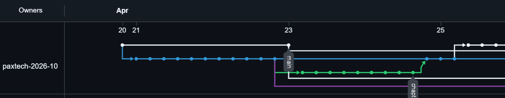

</div>

<div style="text-align: center; margin-top: 1rem; margin-bottom: 1rem;">

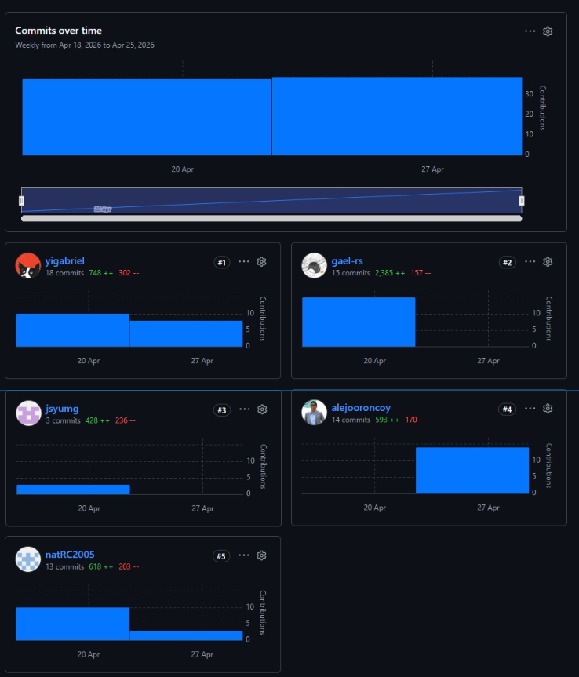


</div>

## TB1
**Tareas**
Para el desarrollo del TB1, cada participante del equipo realizó las siguientes tareas:
| Integrantes                | Tarea asignada |
|----------------------------|----------------|
| Jorge Suin Yum Gonzales    | Capítulo VI: Bounded Context Service - Unit Tests, Integration Tests, BDD y Core System Tests |
| Eduardo Gael Rivera Sosa   | Capítulo VI: Bounded Contexts IAM y Profiles - Unit Tests, Integration Tests y BDD. Capítulo VII: Continuous Integration - Tools and Practices (7.1.1) y Build & Test Suite Pipeline Components (7.1.2) |
| Gabriel Sánchez Gonzales   | Capítulo VI: Bounded Context Reviews - Unit Tests, Integration Tests y BDD. Capítulo VII: Continuous Deployment - Tools and Practices (7.3.1) y Production Deployment Pipeline Components (7.3.2) |
| Natalia Bertha Roman Cruz    | Capítulo VI: Bounded Context Workers - Unit Tests, Integration Tests y BDD. Capítulo VII: Continuous Delivery - Tools and Practices (7.2.1) y Stages Deployment Pipeline Components (7.2.2) |
| Alejandro Daniel Oroncoy Almeyda | Capítulo VI: Bounded Context Reservation - Unit Tests, Integration Tests y BDD |

**GitHub Collaboration Insights**

En GitHub se presenta un timeline de las principales ramas creadas por cada integrante del equipo, así como los procesos de merge realizados. Todas las ramas fueron gestionadas siguiendo el flujo de trabajo **GitFlow**.

## AV2

**Tareas**

Para el desarrollo del AV2, se registran las siguientes tareas asignadas:

| Integrantes                | Tarea asignada |
|----------------------------|----------------|
| Jorge Suin Yum Gonzales    | Capítulo VIII: Experiment-Driven Development — As-Is Summary (8.1.1), Raw Material: Assumptions, Knowledge Gaps, Ideas, Claims (8.1.2), Experiment-Ready Questions (8.1.3), Question Backlog (8.1.4), Hypotheses (8.2.1), Data Analytics: Goals, KPIs and Metrics Selection (8.2.7), To-Be User Stories (8.3.1) y To-Be Product Backlog (8.3.2) |
| Eduardo Gael Rivera Sosa   | Capítulo VI: Validation Interviews — Diseño de Entrevistas (6.3.1) y Registro de Entrevistas (6.3.2); Capítulo VII: Continuous Monitoring — Monitoring Pipeline Components (7.4.2), Alerting Pipeline Components (7.4.3) y Notification Pipeline Components (7.4.4) |
| Gabriel Sánchez Gonzales   | Elaboración de evaluaciones según heuristicas|
| Natalia Bertha Roman Cruz  | Elaboración de las Experiment Cards, Domain Business Metrics, Measures, Conditions, Scale Calculations and Decisions, Methods selection y data analytics |
| Alejandro Daniel Oroncoy Almeyda | Capítulo VI: Static Testing & Verification — Coding Standards & Code Conventions (6.2.1.1), Code Quality & Code Security con SonarCloud (6.2.1.2) y Reviews por Pull Requests (6.2.2) |

**GitHub Collaboration Insights**

En GitHub se presenta un timeline de las principales ramas creadas por cada integrante del equipo, así como los procesos de merge realizados durante el AV2. Todas las ramas fueron gestionadas siguiendo el flujo de trabajo **GitFlow**, manteniendo trazabilidad entre las actualizaciones del Capítulo VIII y los commits realizados en el repositorio del informe.

<div style="text-align: center; margin-top: 1rem; margin-bottom: 1rem;">

Gráfico de red (*network graph*) de ramas en el repositorio de GitHub para el AV2.

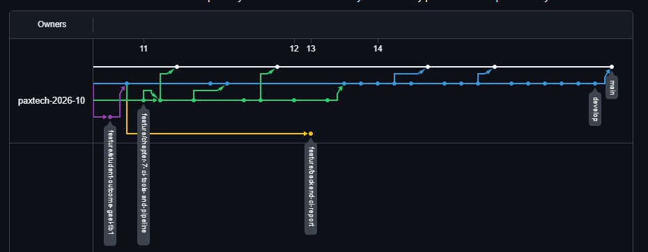

Actividad de commits en el tiempo para el AV2.

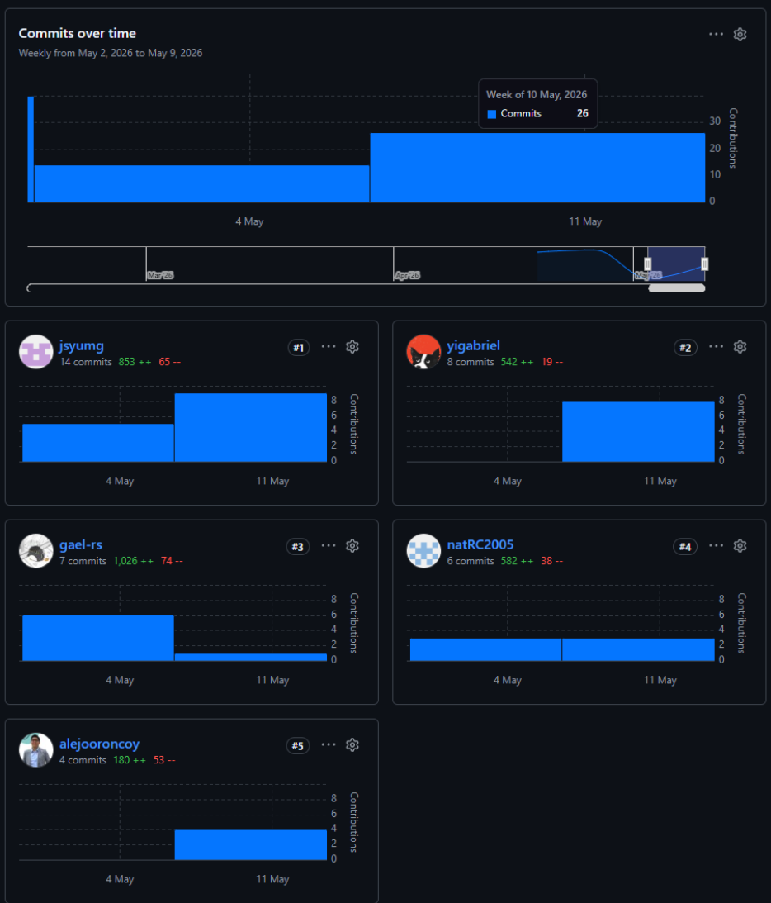

</div>

<div class="page"></div>

# Contenido

- [Registro de Versiones del Informe](#registro-de-versiones-del-informe)
- [Project Report Collaboration Insights](#project-report-collaboration-insights)
  - [AV1](#av1)
  - [TB1](#tb1)
  - [AV2](#av2)
- [Contenido](#contenido)
- [Student Outcome](#student-outcome)
- [Part I: As-Is Software Project](#part-i-as-is-software-project)
- [Capítulo I: Introducción](#capítulo-i-introducción)
  - [1.1. Startup Profile](#11-startup-profile)
    - [1.1.1. Descripción de la Startup](#111-descripción-de-la-startup)
    - [1.1.2. Perfiles de integrantes del equipo](#112-perfiles-de-integrantes-del-equipo)
  - [1.2. Solution Profile](#12-solution-profile)
    - [1.2.1. Antecedentes y problemática](#121-antecedentes-y-problemática)
    - [1.2.2. Lean UX Process](#122-lean-ux-process)
      - [1.2.2.1. Lean UX Problem Statements](#1221-lean-ux-problem-statements)
      - [1.2.2.2. Lean UX Assumptions](#1222-lean-ux-assumptions)
      - [1.2.2.3. Lean UX Hypothesis Statements](#1223-lean-ux-hypothesis-statements)
      - [1.2.2.4. Lean UX Canvas](#1224-lean-ux-canvas)
  - [1.3. Segmentos objetivo](#13-segmentos-objetivo)
- [Capítulo II: Requirements Elicitation \& Analysis](#capítulo-ii-requirements-elicitation--analysis)
  - [2.1. Competidores](#21-competidores)
    - [2.1.1. Análisis competitivo](#211-análisis-competitivo)
    - [2.1.2. Estrategias y tácticas frente a competidores](#212-estrategias-y-tácticas-frente-a-competidores)
  - [2.2. Entrevistas](#22-entrevistas)
    - [2.2.1. Diseño de entrevistas](#221-diseño-de-entrevistas)
    - [2.2.2. Registro de entrevistas](#222-registro-de-entrevistas)
    - [2.2.3. Análisis de entrevistas](#223-análisis-de-entrevistas)
  - [2.3. Needfinding](#23-needfinding)
    - [2.3.1. User Personas](#231-user-personas)
    - [2.3.2. User Task Matrix](#232-user-task-matrix)
    - [2.3.3. User Journey Mapping](#233-user-journey-mapping)
    - [2.3.4. Empathy Mapping](#234-empathy-mapping)
    - [2.3.5. As-is Scenario Mapping](#235-as-is-scenario-mapping)
  - [2.4. Ubiquitous Language](#24-ubiquitous-language)
- [Capítulo III: Requirements Specification](#capítulo-iii-requirements-specification)
  - [3.1. To-Be Scenario Mapping](#31-to-be-scenario-mapping)
  - [3.2. User Stories](#32-user-stories)
    - [3.2.1 User Stories](#321-user-stories)
    - [3.2.2 Technical Stories](#322-technical-stories)
    - [3.2.3 Spike Stories](#323-spike-stories)
  - [3.3. Product Backlog](#33-product-backlog)
  - [3.4. Impact Mapping](#34-impact-mapping)
- [Capítulo IV: Product Design](#capítulo-iv-product-design)
  - [4.1. Style Guidelines](#41-style-guidelines)
    - [4.1.1. General Style Guidelines](#411-general-style-guidelines)
    - [4.1.2. Web Style Guidelines](#412-web-style-guidelines)
    - [4.1.3. Mobile Style Guidelines](#413-mobile-style-guidelines)
      - [4.1.3.1. iOS Mobile Style Guidelines](#4131-ios-mobile-style-guidelines)
      - [4.1.3.2. Android Mobile Style Guidelines](#4132-android-mobile-style-guidelines)
  - [4.2. Information Architecture](#42-information-architecture)
    - [4.2.1. Organization Systems](#421-organization-systems)
    - [4.2.2. Labeling Systems](#422-labeling-systems)
    - [4.2.3. SEO Tags and Meta Tags](#423-seo-tags-and-meta-tags)
    - [4.2.4. Searching Systems](#424-searching-systems)
    - [4.2.5. Navigation Systems](#425-navigation-systems)
  - [4.3. Landing Page UI Design](#43-landing-page-ui-design)
    - [4.3.1. Landing Page Wireframe](#431-landing-page-wireframe)
    - [4.3.2. Landing Page Mock-up](#432-landing-page-mock-up)
  - [4.4. Mobile Applications UX/UI Design](#44-mobile-applications-uxui-design)
    - [4.4.1. Mobile Applications Wireframes](#441-mobile-applications-wireframes)
    - [4.4.2. Mobile Applications Wireflow Diagrams](#442-mobile-applications-wireflow-diagrams)
    - [4.4.3. Mobile Applications Mock-ups](#443-mobile-applications-mock-ups)
    - [4.4.4. Mobile Applications User Flow Diagrams](#444-mobile-applications-user-flow-diagrams)
  - [4.5. Mobile Applications Prototyping](#45-mobile-applications-prototyping)
    - [4.5.1. Android Mobile Applications Prototyping](#451-android-mobile-applications-prototyping)
    - [4.5.2. iOS Mobile Applications Prototyping](#452-ios-mobile-applications-prototyping)
  - [4.6. Web Applications UX/UI Design](#46-web-applications-uxui-design)
    - [4.6.1. Web Applications Wireframes](#461-web-applications-wireframes)
    - [4.6.2. Web Applications Wireflow Diagrams](#462-web-applications-wireflow-diagrams)
    - [4.6.3. Web Applications Mock-ups](#463-web-applications-mock-ups)
    - [4.6.4. Web Applications User Flow Diagrams](#464-web-applications-user-flow-diagrams)
  - [4.7. Web Applications Prototyping](#47-web-applications-prototyping)
  - [4.8. Domain-Driven Software Architecture](#48-domain-driven-software-architecture)
    - [4.8.1. Software Architecture Context Diagram](#481-software-architecture-context-diagram)
    - [4.8.2. Software Architecture Container Diagrams](#482-software-architecture-container-diagrams)
    - [4.8.3. Software Architecture Components Diagrams](#483-software-architecture-components-diagrams)
  - [4.9. Software Object-Oriented Design](#49-software-object-oriented-design)
    - [4.9.1. Class Diagrams](#491-class-diagrams)
    - [4.9.2. Class Dictionary](#492-class-dictionary)
  - [4.10. Database Design](#410-database-design)
    - [4.10.1. Relational/Non-Relational Database Diagram](#4101-relationalnon-relational-database-diagram)
- [Capítulo V: Product Implementation](#capítulo-v-product-implementation)
  - [5.1. Software Configuration Management](#51-software-configuration-management)
    - [5.1.1. Software Development Environment Configuration](#511-software-development-environment-configuration)
    - [5.1.2. Source Code Management](#512-source-code-management)
    - [5.1.3. Source Code Style Guide \& Conventions](#513-source-code-style-guide--conventions)
    - [5.1.4. Software Deployment Configuration](#514-software-deployment-configuration)
  - [5.2. Product Implementation \& Deployment](#52-product-implementation--deployment)
    - [5.2.1. Sprint Backlogs](#521-sprint-backlogs)
    - [5.2.2. Implemented Landing Page Evidence](#522-implemented-landing-page-evidence)
    - [5.2.3. Implemented Frontend-Web Application Evidence](#523-implemented-frontend-web-application-evidence)
    - [5.2.4. Acuerdo de Servicio - SaaS](#524-acuerdo-de-servicio---saas)
    - [5.2.5. Implemented Native-Mobile Application Evidence](#525-implemented-native-mobile-application-evidence)
    - [5.2.6. Implemented RESTful API and/or Serverless Backend Evidence](#526-implemented-restful-api-andor-serverless-backend-evidence)
    - [5.2.7. RESTful API documentation](#527-restful-api-documentation)
    - [5.2.8. Team Collaboration Insights](#528-team-collaboration-insights)
  - [5.3. Video About-the-Product](#53-video-about-the-product)
- [Part II: Verification, Validation \& Pipeline](#part-ii-verification-validation--pipeline)
- [Capítulo VI: Product Verification \& Validation](#capítulo-vi-product-verification--validation)
  - [6.1. Testing Suites \& Validation](#61-testing-suites--validation)
    - [6.1.1. Core Entities Unit Tests](#611-core-entities-unit-tests)
      - [6.1.1.1. Services Bounded Context](#6111-services-bounded-context)
        - [6.1.1.1.1. Backend — Spring Boot](#61111-backend--spring-boot)
        - [6.1.1.1.2. Mobile App — Flutter (iOS Mobile App)](#61112-mobile-app--flutter-ios-mobile-app)
        - [6.1.1.1.3. Mobile App — Android (Kotlin)](#61113-mobile-app--android-kotlin)
        - [6.1.1.1.4. Frontend Web — Angular](#61114-frontend-web--angular)
        - [6.1.1.1.5. Resumen agregado (Services)](#61115-resumen-agregado-services)
      - [6.1.1.2. Workers Bounded Context](#6112-workers-bounded-context)
        - [6.1.1.2.1. Backend — Spring Boot](#61121-backend--spring-boot)
        - [6.1.1.2.2. Mobile App — Flutter (iOS Mobile App)](#61122-mobile-app--flutter-ios-mobile-app)
        - [6.1.1.2.3. Mobile App — Android (Kotlin)](#61123-mobile-app--android-kotlin)
        - [6.1.1.2.4. Frontend Web — Angular](#61124-frontend-web--angular)
        - [6.1.1.2.5. Resumen agregado (Workers)](#61125-resumen-agregado-workers)
      - [6.1.1.3. IAM Bounded Context](#6113-iam-bounded-context)
        - [6.1.1.3.1. Backend — Spring Boot](#61131-backend--spring-boot)
        - [6.1.1.3.2. Mobile App — Flutter (iOS Mobile App)](#61132-mobile-app--flutter-ios-mobile-app)
        - [6.1.1.3.3. Mobile App — Android (Kotlin)](#61133-mobile-app--android-kotlin)
        - [6.1.1.3.4. Frontend Web — Angular](#61134-frontend-web--angular)
        - [6.1.1.3.5. Resumen agregado (IAM)](#61135-resumen-agregado-iam)
      - [6.1.1.4. Profiles Bounded Context](#6114-profiles-bounded-context)
        - [6.1.1.4.1. Backend — Spring Boot](#61141-backend--spring-boot)
        - [6.1.1.4.2. Mobile App — Flutter (iOS Mobile App)](#61142-mobile-app--flutter-ios-mobile-app)
        - [6.1.1.4.3. Mobile App — Android (Kotlin)](#61143-mobile-app--android-kotlin)
        - [6.1.1.4.4. Frontend Web — Angular](#61144-frontend-web--angular)
        - [6.1.1.4.5. Resumen agregado (Profiles)](#61145-resumen-agregado-profiles)
      - [6.1.1.5 Reviews Bounded Context](#6115-reviews-bounded-context)
        - [6.1.1.5.1. Backend - Spring Boot](#61151-backend---spring-boot)
        - [6.1.1.5.3. Frontend Web — Angular](#61153-frontend-web--angular)
        - [6.1.1.5.4. Resumen agregado (Reviews)](#61154-resumen-agregado-reviews)
    - [6.1.2. Core Integration Tests](#612-core-integration-tests)
    - [6.1.3. Core Behavior-Driven Development](#613-core-behavior-driven-development)
      - [6.1.3.1. Services Bounded Context](#6131-services-bounded-context)
      - [6.1.3.2. IAM Bounded Context](#6132-iam-bounded-context)
      - [6.1.3.3. Profiles Bounded Context](#6133-profiles-bounded-context)
      - [6.1.3.4. Workers Bounded Context](#6134-workers-bounded-context)
      - [6.1.3.5. Reviews Bounded Context](#6135-reviews-bounded-context)
      - [6.1.3.6. Reservations Bounded Context](#6136-reservations-bounded-context)
    - [6.1.4. Core System Tests](#614-core-system-tests)
      - [6.1.4.1. Aplicación Web (Playwright)](#6141-aplicación-web-playwright)
      - [6.1.4.2. Aplicación Móvil Flutter (integration\_test)](#6142-aplicación-móvil-flutter-integration_test)
  - [6.2. Static testing \& Verification](#62-static-testing--verification)
    - [6.2.1. Static Code Analysis](#621-static-code-analysis)
      - [6.2.1.1. Coding standard \& Code conventions](#6211-coding-standard--code-conventions)
      - [6.2.1.2. Code Quality \& Code Security](#6212-code-quality--code-security)
    - [6.2.2. Reviews](#622-reviews)
  - [6.3. Validation Interviews](#63-validation-interviews)
    - [6.3.1. Diseño de Entrevistas](#631-diseño-de-entrevistas)
    - [6.3.2. Registro de Entrevistas](#632-registro-de-entrevistas)
    - [6.3.3. Evaluaciones según heurísticas](#633-evaluaciones-según-heurísticas)
  - [6.4. Auditoría de Experiencias de Usuario](#64-auditoría-de-experiencias-de-usuario)
    - [6.4.1. Auditoría realizada](#641-auditoría-realizada)
      - [6.4.1.1. Información del grupo auditado](#6411-información-del-grupo-auditado)
      - [6.4.1.2. Cronograma de auditoría realizada](#6412-cronograma-de-auditoría-realizada)
      - [6.4.1.3. Contenido de auditoría realizada](#6413-contenido-de-auditoría-realizada)
    - [6.4.2. Auditoría recibida](#642-auditoría-recibida)
      - [6.4.2.1. Información del grupo auditor](#6421-información-del-grupo-auditor)
      - [6.4.2.2. Cronograma de auditoría recibida](#6422-cronograma-de-auditoría-recibida)
      - [6.4.2.3. Contenido de auditoría recibida](#6423-contenido-de-auditoría-recibida)
      - [6.4.2.4. Resumen de modificaciones para subsanar hallazgos](#6424-resumen-de-modificaciones-para-subsanar-hallazgos)
- [Capítulo VII: DevOps Practices](#capítulo-vii-devops-practices)
  - [7.1. Continuous Integration](#71-continuous-integration)
    - [7.1.1. Tools and Practices](#711-tools-and-practices)
    - [7.1.2. Build \& Test Suite Pipeline Components](#712-build--test-suite-pipeline-components)
  - [7.2. Continuous Delivery](#72-continuous-delivery)
    - [7.2.1. Tools and Practices](#721-tools-and-practices)
    - [7.2.2. Stages Deployment Pipeline Components](#722-stages-deployment-pipeline-components)
  - [7.3. Continuous Deployment](#73-continuous-deployment)
    - [7.3.1. Tools and Practices](#731-tools-and-practices)
    - [7.3.2. Production Deployment Pipeline Components](#732-production-deployment-pipeline-components)
  - [7.4. Continuous Monitoring](#74-continuous-monitoring)
    - [7.4.1. Tools and Practices](#741-tools-and-practices)
    - [7.4.2. Monitoring Pipeline Components](#742-monitoring-pipeline-components)
    - [7.4.3. Alerting Pipeline Components](#743-alerting-pipeline-components)
    - [7.4.4. Notification Pipeline Components](#744-notification-pipeline-components)
- [Part III: Experiment-Driven Lifecycle](#part-iii-experiment-driven-lifecycle)
- [Capítulo VIII: Experiment-Driven Development](#capítulo-viii-experiment-driven-development)
  - [8.1. Experiment Planning](#81-experiment-planning)
    - [8.1.1. As-Is Summary](#811-as-is-summary)
    - [8.1.2. Raw Material: Assumptions, Knowledge Gaps, Ideas, Claims](#812-raw-material-assumptions-knowledge-gaps-ideas-claims)
    - [8.1.3. Experiment-Ready Questions](#813-experiment-ready-questions)
    - [8.1.4. Question Backlog](#814-question-backlog)
    - [8.1.5. Experiment Cards](#815-experiment-cards)
  - [8.2. Experiment Design](#82-experiment-design)
    - [8.2.1. Hypotheses](#821-hypotheses)
    - [8.2.2. Domain Business Metrics](#822-domain-business-metrics)
    - [8.2.3. Measures](#823-measures)
    - [8.2.4. Conditions](#824-conditions)
    - [8.2.5. Scale Calculations and Decisions](#825-scale-calculations-and-decisions)
    - [8.2.6. Methods Selection](#826-methods-selection)
    - [8.2.7. Data Analytics: Goals, KPIs and Metrics Selection](#827-data-analytics-goals-kpis-and-metrics-selection)
    - [8.2.8. Web and Mobile Tracking Plan](#828-web-and-mobile-tracking-plan)
  - [8.3. Experimentation](#83-experimentation)
    - [8.3.1. To-Be User Stories](#831-to-be-user-stories)
    - [8.3.2. To-Be Product Backlog](#832-to-be-product-backlog)
    - [8.3.3. Pipeline-supported, Experiment-Driven To-Be Software Platform Lifecycle](#833-pipeline-supported-experiment-driven-to-be-software-platform-lifecycle)
      - [8.3.3.1. To-Be Sprint Backlogs](#8331-to-be-sprint-backlogs)
      - [8.3.3.2. Implemented To-Be Landing Page Evidence](#8332-implemented-to-be-landing-page-evidence)
      - [8.3.3.3. Implemented To-Be Frontend-Web Application Evidence](#8333-implemented-to-be-frontend-web-application-evidence)
      - [8.3.3.4. Implemented To-Be Native-Mobile Application Evidence](#8334-implemented-to-be-native-mobile-application-evidence)
      - [8.3.3.5. Implemented To-Be RESTful API and/or Serverless Backend Evidence](#8335-implemented-to-be-restful-api-andor-serverless-backend-evidence)
      - [8.3.3.6. Team Collaboration Insights](#8336-team-collaboration-insights)
    - [8.3.4. To-Be Validation Interviews](#834-to-be-validation-interviews)
      - [8.3.4.1. Diseño de Entrevistas](#8341-diseño-de-entrevistas)
      - [8.3.4.2. Registro de Entrevistas](#8342-registro-de-entrevistas)
  - [8.4. Experiment Aftermath \& Analysis](#84-experiment-aftermath--analysis)
    - [8.4.1. Analysis and Interpretation of Results](#841-analysis-and-interpretation-of-results)
    - [8.4.2. Re-scored and Re-prioritized Question Backlog](#842-re-scored-and-re-prioritized-question-backlog)
  - [8.5. Continuous Learning](#85-continuous-learning)
    - [8.5.1. Shareback Session Artifacts: Learning Workflow](#851-shareback-session-artifacts-learning-workflow)
  - [8.6. To-Be Software Platform Pre-launch](#86-to-be-software-platform-pre-launch)
    - [8.6.1. About-the-Product Intro Video](#861-about-the-product-intro-video)
- [Conclusiones](#conclusiones-1)
- [Video App Validation](#video-app-validation)
- [Video About-the-Team](#video-about-the-team)
- [Bibliografía](#bibliografía)
- [Anexos](#anexos)

<div class="page"></div>

# Student Outcome

<table>
  <thead>
    <tr>
      <th>Criterio específico</th>
      <th>Acciones realizadas</th>
      <th>Conclusiones</th>
    </tr>
  </thead>
  <tbody>
    <tr>
      <td rowspan="5"><strong>4.c.1 Reconoce responsabilidad ética y profesional en situaciones de ingeniería de software</strong></td>
      <td><strong>Natalia Bertha Roman Cruz</strong><br><b>AV1:</b> Para el desarrollo del primer avance, y dado que el equipo continuará con el desarrollo de un proyecto trabajado en cursos anteriores, me dediqué a leer y actualizar el planteamiento del capítulo II. Así, me encargué de realizar el análisis competitivo y de plantear las estrategias y tácticas frente a competidores. Asimismo, revisé las entrevistas que realizamos anteriormente y las conclusiones a las que llegamos. Por último, realicé el needfinding, para lo que apliqué los cambios necesarios a los user personas, user matrix, user journey maps, empathy maps y as-is scenarios. En todos estos pasos, me esforcé por seguir los principios éticos y profesionales de la ingeniería de software acorde con la situación. <br><b>TB1:</b> Para el desarrollo de esta segunda entrega, dedique tiempo a actualizar mi conocimientos sobre el desarrollo de frontend y backend para asegurarme de que el proyecto estuviera cumpliendo con buenas prácticas, así como investigué sobre algunas técnicas y recomendaciones en cuanto al testing para aplicar las pruebas necesarias y más relevantes. Así, noté la importancia de utilizar la información con responsabilidad y solo aplicarla en proyectos o prácticas éticas que vayan acorde con el bienestar del equipo y los usuarios planteados. <br><b>AV2:</b> Para la entrega del segundo avance, estuve a cargo de gran parte de la elaboración del proceso de Expriment-Driven Development, para el cual comencé investigando sobre su aplicación y propósito con el objetivo de lograr que este no solo estuviera correctamente planteado sino que también sirivera para mejorar el producto creado. Así, pude desarrollar y analizar elementos como las experiment cards, scale calculations and decisions, domain business metrics, entre otros.</td>
      <td rowspan="5"><b>AV1:</b> En el AV1, el equipo actualizó y aplicó conceptos vigentes de ingeniería de software orientados a la fase de descubrimiento de producto, logrando <b>identificar el Startup Business Model</b> de uTime mediante el Startup Profile (descripción de PaxTech, misión, visión y perfiles del equipo), el Project/Solution Profile (con antecedentes y problemática estructurados bajo el framework 5W+2H) y el Lean UX Process completo (Problem Statements, Assumptions, Hypothesis Statements y Lean UX Canvas). Asimismo, se sentaron las bases del Needfinding al definir los segmentos objetivo con criterios demográficos, geográficos y psicográficos, y se incorporó la decisión de soportar la solución como aplicación móvil y web complementarias. Estos conocimientos —metodologías Lean UX, segmentación de mercado y formulación de hipótesis con criterios de éxito medibles— quedaron evidenciados en el Capítulo I del informe y constituyen la base sobre la que se construirán los siguientes entregables (Needfinding completo, Product Design e Implementación).<br><b>TB1:</b> En el TB1, el equipo reconoció su responsabilidad ética y profesional al trasladar el producto del diseño a una implementación verificable: se configuró el entorno multi-stack (Angular para web, Flutter y Kotlin nativo para móvil, y Spring Boot con PostgreSQL en Neon para el backend) bajo GitFlow, Conventional Commits y Semantic Versioning, y se construyó una suite de pruebas unitarias, de integración, BDD (Cucumber + Playwright) y system tests por bounded context, además de formalizar el pipeline de CI/CD en GitHub Actions y Azure. Esto evidenció que entregar software confiable y trazable —y no solo funcional— es una obligación profesional con el equipo, el cliente y los usuarios finales.<br><b>AV2:</b> En el AV2, el equipo asumió su responsabilidad ética y profesional al adoptar un enfoque Experiment-Driven Development en el Capítulo VIII, transformando suposiciones y afirmaciones en preguntas y experimentos falsables (EXP01–EXP05) para no presentar como validado aquello que aún debe comprobarse con usuarios reales. Esta responsabilidad se reforzó con las Validation Interviews del Capítulo VI —registradas de forma fiel y sin inducir respuestas—, el análisis estático con SonarCloud que trató los hallazgos de seguridad como deuda a corregir y no a ocultar, y el Continuous Monitoring del Capítulo VII, que vigila la disponibilidad del servicio en producción para proteger a quienes dependen de la plataforma.</td>
    </tr>
    <tr>
      <td><strong>Jorge Suin Yum Gonzales</strong><br><b>AV1:</b> Durante el desarrollo del AV1, actualicé y apliqué conocimientos relacionados con la especificación y priorización de requisitos de software. Elaboré el To-Be Scenario Mapping para representar el escenario objetivo de interacción entre usuarios y la plataforma, redacté User Stories alineadas a las necesidades identificadas, organicé el Product Backlog para priorizar funcionalidades del producto y desarrollé el Impact Mapping para conectar objetivos, actores, impactos esperados y entregables.<br><b>TB1:</b> Durante el TB1 actualicé y apliqué conocimientos de verificación y validación de software en el bounded context Services. Diseñé y documenté pruebas unitarias para backend Spring Boot, Flutter, Android Kotlin y Angular, alcanzando 47 tests en 6 archivos. Además, implementé integration tests con Spring Boot Test, MockMvc y H2 para validar la integración entre controlador, servicios, repositorio y persistencia. También elaboré escenarios BDD para la US22 - Administración de servicios ofrecidos con Gherkin, Cucumber.js y Playwright, y participé en Core System Tests para verificar flujos reales como la creación y eliminación de servicios.<br><b>AV2:</b> Para el AV2 trabajé en el Capítulo VIII aplicando Experiment-Driven Development a uTime. Elaboré el As-Is Summary, organicé assumptions, knowledge gaps, ideas y claims, convertí estos elementos en Experiment-Ready Questions y Question Backlog, y formulé hipótesis, métricas, To-Be User Stories y To-Be Product Backlog. En estas actividades procuré diferenciar evidencia, suposiciones e hipótesis para no presentar como validado aquello que aún debe comprobarse experimentalmente.<br><b>TF:</b> En el TF completé la documentación del ciclo To-Be de la plataforma. Organicé los To-Be Sprint Backlogs para las historias UE01 a UE05, definiendo work-items, responsables, estimaciones y estado de avance. Además, documenté la evidencia de la aplicación móvil nativa y del backend RESTful desplegado en Azure, cuidando que cada captura, endpoint y flujo mostrado se vincule con una funcionalidad experimental concreta. Este trabajo reforzó mi responsabilidad profesional de presentar evidencia verificable y trazable, especialmente en funciones sensibles como reservas, pagos digitales, recordatorios y reseñas, porque influyen directamente en la confianza de clientes y negocios.</td>
    </tr>
    <tr>
      <td><strong>Gabriel Sánchez Gonzales</strong><br><b>AV1:</b> Durante este avance desarrollé múltiples entregables como Style Guidelines (web y mobile), Information Architecture (organization, labeling, navigation y searching systems), diseño UX/UI (wireframes, mockups, prototipos) tanto para web como mobile (iOS y Android), además de artefactos de arquitectura de software como Domain-Driven Design, diagramas de contexto, contenedores y componentes, junto con diseño orientado a objetos y modelado de base de datos.<br><b>TB1:</b> Durante el TB1 reforcé mis conocimientos en verificación y validación de software dentro del bounded context Reviews, enfocándome en asegurar la calidad del sistema mediante pruebas bien estructuradas. Diseñé y documenté pruebas unitarias para el backend en Spring Boot, validando la lógica de negocio y el correcto comportamiento de los servicios, con el objetivo de garantizar consistencia y confiabilidad en las funcionalidades relacionadas al módulo de reseñas. <b>AV2:</b> Durante el AV2 reconocí mi responsabilidad ética y profesional al realizar evaluaciones basadas en heurísticas de usabilidad, identificando oportunidades de mejora para ofrecer una experiencia más accesible, eficiente y centrada en el usuario.</td>
    </tr>
    <tr>
      <td><strong>Eduardo Gael Rivera Sosa</strong><br><b>AV1:</b> Durante el AV1 actualicé y apliqué conocimientos sobre las primeras etapas del descubrimiento de producto en el Capítulo I del informe. Elaboré la descripción de la startup PaxTech con su misión y visión, redacté los perfiles del equipo y construí el Solution Profile de uTime aplicando el framework 5W+2H para enmarcar antecedentes y problemática sustentados con datos estadísticos del sector de la belleza. Sobre esa base apliqué el proceso Lean UX: redacté el Lean UX Problem Statement, formulé las Lean UX Assumptions (features, business outcomes, user benefits, business assumptions y user assumptions), planteé los Hypothesis Statements con criterios de éxito medibles y consolidé el Lean UX Canvas. Finalmente definí los segmentos objetivo (salones/barberías y clientes finales) con sus aspectos demográficos, geográficos y psicográficos, incorporando la decisión de soportar la solución como aplicación móvil y web complementarias.<br><b>TB1:</b> Durante el TB1 actualicé y apliqué conocimientos de verificación y validación de software en los bounded contexts IAM y Profiles, y documenté la integración continua del producto. Diseñé pruebas unitarias para los cuatro stacks (Spring Boot con JUnit 5, Angular con Karma + Jasmine, Android Kotlin con JUnit 4 y Flutter con flutter_test), totalizando 25 tests para IAM y 66 tests para Profiles distribuidos en 21 archivos. Elaboré escenarios BDD con Gherkin, Cucumber.js y Playwright en TypeScript para las US01 (registro de cliente), US03 (inicio de sesión) y US06 (personalización del perfil del salón), reutilizando los helpers de <code>e2e/support</code> ya existentes. Finalmente documenté la sección 7.1 del Capítulo VII describiendo el workflow de GitHub Actions del backend que compila con Maven y despliega a Azure App Service, detallando sus triggers, jobs, steps y prácticas de aislamiento, fail-fast y reproducibilidad.<br><b>AV2:</b> Durante el AV2 asumí mi responsabilidad ética y profesional en dos frentes del informe. En las Validation Interviews del Capítulo VI (6.3.1 y 6.3.2) diseñé una guía de entrevista neutral —con preguntas introductorias y bloques diferenciados por segmento objetivo tras mostrar la Landing Page y la app móvil— y registré la retroalimentación de cada entrevistado de forma fiel, sin inducir respuestas ni omitir las críticas recibidas, para no presentar como validado aquello que los usuarios no respaldaron. En el Continuous Monitoring del Capítulo VII (7.4.2, 7.4.3 y 7.4.4) implementé un pipeline de monitoreo real sobre GitHub Actions —health-check programado con `curl`, alertas ante caída del backend o fallo de despliegue y notificaciones por Gmail SMTP— reconociendo que vigilar la disponibilidad del servicio en producción y avisar oportunamente al equipo es una obligación profesional con los usuarios que dependen de la plataforma.</td>
    </tr>
    <tr>
      <td><strong>Alejandro Daniel Oroncoy Almeyda</strong><br><b>AV1:</b> Durante el AV1 actualicé y apliqué conceptos de ingeniería de software relacionados con la implementación, despliegue y configuración del producto en el Capítulo V. Apliqué Software Configuration Management con el conjunto de herramientas del ciclo de vida (Pivotal Tracker, Discord, Figma, UXPressia, Trello, WebStorm, IntelliJ IDEA, Android Studio, Git, GitKraken, Render, GitHub Pages, Azure y Firebase), formalicé el flujo GitFlow y las convenciones de Conventional Commits, y documenté las guías de estilo por tecnología (HTML, CSS, JavaScript/Bootstrap, TypeScript/Angular, Dart/Flutter, Java/Spring Boot y Gherkin). Estructuré el Sprint #1 con su Sprint Planning Background, matriz LACX, Sprint Backlog (US01, US03, US29–US35, TS06), Development y Execution Evidence, y los Team Collaboration Insights, y articulé el Acuerdo de Servicio SaaS (SLA) entre PaxTech y el Cliente. Asimismo, alineé la decisión de persistencia de §4.10.1 a PostgreSQL desplegado en Neon, conforme al diagrama de despliegue del producto. <br><b>TB1:</b> Durante el TB1 actualicé y apliqué conocimientos de verificación y validación de software en el bounded context <strong>Reservations</strong>. Diseñé y documenté pruebas unitarias y de integración para la lógica de agendamiento, y elaboré escenarios BDD para la <strong>US18 — Creación de citas</strong> con Gherkin, Cucumber.js y Playwright, cubriendo los criterios de aceptación "Registro correcto de cita nueva" y "Verificación de disponibilidad antes de agendar". Reutilicé los helpers de fixtures del proyecto y alineé las pruebas con el system test SYS-04 para reproducir el flujo real end-to-end. Trabajé con responsabilidad profesional, asegurando que cada prueba reflejara el comportamiento verdadero del sistema y no un resultado forzado. <br><b>AV2:</b> Para el AV2 asumí la responsabilidad del aseguramiento de la calidad y la seguridad del código en el Capítulo VI. Documenté las convenciones de codificación por tecnología, formalicé el uso de Conventional Commits y la revisión por pares mediante Pull Requests, e integré <strong>SonarCloud</strong> a la organización de GitHub para medir fiabilidad, mantenibilidad, duplicación y seguridad. Traté los hallazgos de seguridad —como posibles credenciales embebidas y la ausencia de Subresource Integrity— como deuda técnica a corregir y no a ocultar, reconociendo que entregar software confiable es también una obligación ética con los usuarios. </td>
    </tr>
    <tr>
      <td rowspan="5"><strong>4.c.2 Emite juicios informados considerando el impacto de las soluciones de ingeniería de software en contextos globales, económicos, ambientales y sociales</strong></td>
      <td><strong>Natalia Bertha Roman Cruz</strong><br><b>AV1:</b> Reconozco que lo más importante para el desarrollo de esta primera parte fue revisar la información antes planteada, de forma que pudiéramos actualizar y mejorar lo antes realizado. Así, fue importante nutrirnos de conocimientos con el paso del tiempo para poder presentar una mejor versión. En cuanto a la sección que realicé, noté los ajustes que era necesario aplicar al ya poseer una mayor experiencia tanto para el needfinding como para el reconocimiento de funcionalidades a implementar o necesidades a cubrir. De esta manera, pude emitir un juicio informado conforme a lo investigado, lo planteado en el proyecto y el contexto actual dado.<br><b>TB1:</b>Durante el desarrollo de la segunda entrega, me dediqué principalemente a la implementación de las pruebas unitarias, de integración y funcionales en el Bounded Context Workers. Durante el desarrolló me di cuenta de la existencia y uso de ciertas herramientas que podían ayudarme a mejorar la calidad de mis pruebas. Así, concluí que era necesario continuar investigando y aprendiendo para lograr el mejor resultado posible de forma en que pudiera emitir un juicio informado en cuanto a que pruebas debían ser implementadas y porqué ofreciendo una mejor calidad en la solución implementada. <br><b>AV2:</b> Al desarrollar la tercera entrega, me aseguré de informarme antes de realizar el Experiment-Driven Development y debatirlo junto a mis compañeros. Considero que se llegó al resultado esperado, puesto que este nos permite experimentar directamente con nuestro público objetivo tocando los puntos clave y que servirán como impulso para mejorar nuestro producto.</td>
      <td rowspan="5"><b>AV1:</b> En el AV1, el equipo reconoció la necesidad del aprendizaje permanente al abordar la identificación del Startup Business Model con técnicas que requirieron estudio activo: el framework 5W+2H para estructurar la problemática, la metodología Lean UX para articular Problem Statements, Assumptions, Hypothesis Statements y Lean UX Canvas, y los criterios de segmentación de mercado para perfilar a salones/barberías y clientes finales. Para sustentar las afirmaciones del Capítulo I se revisaron fuentes académicas y de industria recientes, evidenciando que el descubrimiento de producto y la definición del Startup Profile, Project Profile y Lean UX Process exigen actualización constante en metodologías UX, comportamiento del usuario y tendencias del sector. Adicionalmente, la decisión de soportar la solución en móvil y web obligó a profundizar en consideraciones de experiencia multiplataforma, reforzando que el aprendizaje continuo es indispensable para tomar decisiones de producto fundamentadas y será clave en las próximas fases del proyecto (Needfinding, Product Design e Implementación).<br><b>TB1:</b> En el TB1, el equipo emitió juicios informados al definir la estrategia de verificación y validación de un producto multiplataforma: seleccionó frameworks de testing apropiados para cada stack (JUnit 5, Karma + Jasmine, JUnit 4 y flutter_test), priorizó los escenarios BDD más críticos por bounded context y decidió la arquitectura del pipeline de CI/CD sobre GitHub Actions y Azure. Estas decisiones, sustentadas en evidencia técnica y no en suposiciones, evidenciaron que el aprendizaje continuo sobre herramientas de calidad y DevOps es indispensable para tomar decisiones proporcionadas al impacto del producto.<br><b>AV2:</b> En el AV2, el equipo emitió juicios informados al priorizar qué hipótesis experimentar y escalar (adopción de agenda digital, recordatorios, pagos digitales, reserva directa y confianza por reseñas), ponderando el impacto económico para los negocios y la experiencia social de los clientes antes de invertir en cada funcionalidad. Asimismo, la validación con usuarios reales, la interpretación de las métricas de SonarCloud y la elección de una observabilidad gratuita y de baja huella operativa (GitHub Actions, Azure App Service y Gmail SMTP) frente a APM externos costosos evidenciaron que el aprendizaje continuo permite tomar decisiones fundamentadas y sostenibles para una startup en fase de validación.</td>
    </tr>
    <tr>
      <td><strong>Jorge Suin Yum Gonzales</strong><br><b>AV1:</b> En esta entrega reconocí la importancia del aprendizaje permanente al trabajar con técnicas como To-Be Scenario Mapping, User Stories, Product Backlog e Impact Mapping. Para completar estos artefactos fue necesario revisar criterios de redacción de historias de usuario, priorización de backlog y relación entre objetivos de negocio e impactos esperados. Este proceso evidenció que el análisis de requisitos requiere actualización constante, retroalimentación del equipo y mejora continua para asegurar que las decisiones del producto respondan a necesidades reales de los usuarios y del negocio.<br><b>TB1:</b> En el TB1 reconocí la necesidad del aprendizaje permanente al profundizar en distintos niveles de testing para un producto multiplataforma. Para completar las pruebas de Services fue necesario aplicar JUnit 5, Mockito, AssertJ, Spring Boot Test, MockMvc, H2, flutter_test, JUnit 4, Karma, Jasmine, Cucumber.js, Gherkin y Playwright. Este trabajo me permitió comprender la importancia de validar unidades, integración entre capas, comportamiento BDD y flujos completos de usuario, además de reforzar la mejora continua a partir de hallazgos como errores de validación del provider y manejo de excepciones.<br><b>AV2:</b> En el AV2 emití juicios informados al transformar los problemas detectados en entrevistas y needfinding en preguntas experimentales medibles. Prioricé experimentos sobre adopción de agenda digital, recordatorios, pagos digitales, reserva directa y confianza mediante perfiles con reseñas, considerando su impacto económico para los negocios, la experiencia social de los clientes y la viabilidad técnica de medir los resultados antes de escalar funcionalidades.<br><b>TF:</b> En el TF emití juicios informados al relacionar los To-Be Sprint Backlogs con el impacto económico y social de las funcionalidades implementadas. Al documentar la evidencia móvil y la API RESTful, evalué qué funcionalidades debían mostrarse como soporte real de las hipótesis: agenda centralizada para reducir desorden operativo, reserva directa para disminuir dependencia de WhatsApp, pagos digitales para aumentar compromiso, recordatorios para reducir cancelaciones y perfiles con reseñas para mejorar la confianza. Estas decisiones consideraron la viabilidad técnica del backend en Azure, la experiencia de ambos segmentos y el impacto en salones pequeños antes de escalar el producto.</td>
    </tr>
    <tr>
      <td><strong>Gabriel Sánchez Gonzales</strong><br><b>AV1:</b> Para poder completar este avance fue necesario investigar y aprender continuamente sobre estándares de diseño (web, iOS, Android), herramientas de prototipado, principios de arquitectura como DDD y estructuración de sistemas, así como buenas prácticas en diseño de bases de datos y experiencia de usuario.<br><b>TB1:</b> Durante el TB1 reforcé mis conocimientos en verificación y validación de software dentro del bounded context Reviews, enfocándome en asegurar la calidad y confiabilidad del sistema mediante pruebas bien estructuradas. Esto permitió emitir soluciones más seguras y consistentes, considerando el impacto que un software estable y correctamente validado tiene en la experiencia de los usuarios y en el correcto funcionamiento de la plataforma dentro de un contexto tecnológico y social. <b>AV2:</b> Durante el AV2 analicé la interfaz mediante evaluaciones heurísticas, consideré el efecto que las decisiones de diseño pueden tener en los usuarios y en la calidad de la solución, proponiendo mejoras orientadas a generar una experiencia más eficiente y accesible.</td>
    </tr>
    <tr>
      <td><strong>Eduardo Gael Rivera Sosa</strong><br><b>AV1:</b> Reconocí la necesidad del aprendizaje permanente al desarrollar el Capítulo I del informe, ya que tuve que estudiar y aplicar técnicas que no había usado antes: el framework 5W+2H para estructurar la problemática, la metodología Lean UX para articular Problem Statement, Assumptions, Hypothesis Statements y Canvas, y los criterios de segmentación de mercado (demográficos, geográficos y psicográficos). Para sustentar el contenido revisé fuentes académicas y de industria, lo que evidenció que el descubrimiento de producto exige actualización constante en metodologías UX, comportamiento del usuario y tendencias del sector. Asimismo, la decisión de soportar la solución en móvil y web obligó a profundizar en consideraciones de experiencia multiplataforma, reforzando que el aprendizaje continuo es indispensable para tomar decisiones de producto fundamentadas.<br><b>TB1:</b> En el TB1 reconocí la necesidad del aprendizaje permanente al cubrir los cuatro stacks del producto en una misma entrega de testing y al documentar el pipeline de CI/CD. Para los unit tests fue necesario aplicar JUnit 5, Karma + Jasmine sobre Angular 19, JUnit 4 sobre Kotlin/Compose y flutter_test, además de patrones DDD aplicados a aggregates (User, Client, Provider, ProviderProfile, Discount, PortfolioImage, Social) y value objects (FullName, CompanyName). Para BDD profundicé en Cucumber.js, Gherkin en español, Playwright y la convención de step definitions reutilizables que ya seguía el bounded context Services. Para CI estudié los triggers de GitHub Actions, la autenticación OIDC contra Azure y el flujo de artifacts entre jobs. Este trabajo evidenció que mantener consistencia entre cuatro stacks distintos exige aprender de forma continua las particularidades de cada herramienta y converger en una misma convención de testing, naming y trazabilidad.<br><b>AV2:</b> En el AV2 emití juicios informados al elegir cómo validar el producto y cómo observarlo en producción. Para las Validation Interviews del Capítulo VI prioricé contrastar la propuesta directamente con dueños de salones y clientes finales, ponderando el impacto económico (disposición a pagar por los planes) y social (confianza y facilidad de uso frente a coordinar por WhatsApp) de las decisiones de producto antes de darlas por buenas. Para el Continuous Monitoring del Capítulo VII evalué alternativas de observabilidad y, en lugar de incorporar un APM externo (Jenkins, Datadog, New Relic o Grafana), decidí apoyarme en GitHub Actions, la observabilidad nativa del Azure App Service y Gmail SMTP, una solución gratuita y sin infraestructura adicional que mantener; este juicio consideró el costo económico para una startup en fase de validación y la menor huella operativa, evidenciando que el aprendizaje continuo sobre herramientas DevOps es indispensable para tomar decisiones fundamentadas y proporcionadas al contexto del proyecto.</td>
    </tr>
    <tr>
      <td><strong>Alejandro Daniel Oroncoy Almeyda</strong><br><b>AV1:</b> Reconocí la necesidad del aprendizaje permanente al construir el Capítulo V partiendo de dos reportes base (UPC-PaxTech/uTime y PaxTech-1807/Final-Report), lo que exigió comparar arquitecturas, decisiones de stack y patrones de despliegue distintos para destilar la solución más coherente con nuestro producto. Investigué y verifiqué el diagrama de despliegue real (Flutter Cliente + Kotlin Negocio sobre Android, Spring Boot en Azure App Service, PostgreSQL en Neon y Stripe para pagos), prácticas de GitFlow y Conventional Commits, configuración de GitHub Pages, automatización con GitHub Actions, distribución de builds con Firebase App Distribution, documentación de APIs con springdoc-openapi y bounded contexts (IAM, Profiles, Reservations, Services, Reviews, Workers). Este proceso evidenció que la implementación de un producto digital exige actualización continua de tecnologías, mejor gestión de la trazabilidad entre artefactos del informe y disciplina para alinear decisiones técnicas entre capítulos. <br><b>TB1:</b> En el TB1 reconocí la importancia del aprendizaje permanente al profundizar en distintos niveles de testing para el bounded context Reservations. Para completar las pruebas fue necesario aplicar frameworks de pruebas unitarias y de integración junto con BDD mediante Gherkin, Cucumber.js y Playwright. Este trabajo me permitió emitir juicios informados sobre qué escenarios validar —el registro de una cita y la verificación de disponibilidad— y comprender la importancia de probar tanto unidades como flujos completos de usuario antes de dar una funcionalidad por terminada. <br><b>AV2:</b> Para el AV2 profundicé en herramientas modernas de análisis estático que no había usado antes: aprendí a interpretar las calificaciones A–E de SonarCloud y métricas como la duplicación de código y los <em>security hotspots</em> para decidir, con criterio, qué corregir primero. Comprendí que una calificación de seguridad baja no es un fracaso sino la señal de que el análisis funciona y revela deuda real, y tomé decisiones fundamentadas en evidencia —no en suposiciones— considerando el impacto que un sistema seguro y mantenible tiene en la confianza de los usuarios. </td>
    </tr>
  </tbody>
</table>

<div class="page"></div>

# Part I: As-Is Software Project

# Capítulo I: Introducción

En este capítulo se presenta la startup PaxTech, su equipo, el perfil de la solución uTime y los segmentos objetivo a los que está dirigida la propuesta. La solución se entrega como una **aplicación móvil** y una **aplicación web** complementarias, de modo que tanto profesionales del sector como sus clientes puedan acceder al servicio desde el dispositivo que prefieran.

## 1.1. Startup Profile

### 1.1.1. Descripción de la Startup

PaxTech es una startup tecnológica fundada por estudiantes de la Universidad Peruana de Ciencias Aplicadas, dedicada al desarrollo de soluciones digitales innovadoras para el sector de la belleza y el bienestar. Nos especializamos en crear herramientas que ayuden a estilistas, barberos, maquilladores y otros profesionales independientes a mejorar la eficiencia de sus servicios y optimizar la experiencia del cliente mediante tecnología accesible y escalable.

Como empresa, buscamos aportar valor al rubro mediante aplicaciones móviles y web modernas que automaticen tareas cotidianas, mejoren la organización y fortalezcan la relación con los clientes. Nuestro portafolio de soluciones incluye productos diseñados específicamente para las necesidades del sector, como la gestión de citas en tiempo real, control de servicios, fidelización de clientes y más.

**Misión:** Desarrollar y ofrecer soluciones tecnológicas de calidad que resuelvan los desafíos operativos del sector de la belleza y el bienestar, potenciando el crecimiento de profesionales independientes, salones de belleza, barberías y otros negocios del sector mediante innovación, automatización y accesibilidad digital.

**Visión:** Consolidarnos como la startup tecnológica de referencia en Latinoamérica para el sector de la belleza, siendo reconocidos por ofrecer productos digitales innovadores que transforman la manera en que se gestionan los servicios, se atiende a los clientes y se impulsa el desarrollo profesional.

### 1.1.2. Perfiles de integrantes del equipo

| Foto | Nombre | Código | Carrera | Descripción de habilidades y conocimientos |
|------|--------|--------|---------|--------------------------------------------|
|  | Jorge Suin Yum Gonzales | U202210838 | Ingeniería de Software | Soy estudiante del 7° ciclo con 20 años. Tengo experiencia con diferentes lenguajes de programación y desarrollo de aplicaciones web en diversos frameworks, tanto en frontend como en backend. Soy una persona responsable y puntual, cualidades que aplico al trabajar de manera colaborativa con los integrantes de nuestro equipo. |
|  | Natalia Bertha Roman Cruz | U202310148 | Ingeniería de Software | Soy estudiante de la carrera de Ingeniería de Software y tengo 19 años. Me considero una persona dedicada y organizada, que se esfuerza por alcanzar sus logros. Dentro de este proyecto, me interesa poder aportar en gran parte en la codificación de las ideas planteadas. Espero que el equipo logre su objetivo y aprendamos lo más posible en el proceso. |
|  | Eduardo Gael Rivera Sosa | U202312222 | Ingeniería de Software | Soy Gael, desarrollador Full Stack con enfoque en IA. Me gusta construir productos que realmente funcionen y aprender rápido lo que sea necesario para lograrlo. Soy proactivo, me adapto bien al trabajo en equipo y disfruto resolver problemas desde la raíz. Cuando algo se puede hacer mejor, lo digo. |
|  | Gabriel Sánchez Gonzales | U202310609 | Ingeniería de Software | Soy estudiante en la Universidad Peruana de Ciencias Aplicadas (UPC) cursando el 7mo ciclo de la carrera de Ingeniería de Software. Soy una persona comprometida con mi desarrollo académico y profesional. Con esa responsabilidad, aspiro a proveer soluciones tecnológicas a aquellos que las requieran para facilitar su área de trabajo. Junto con mi equipo de trabajo tendré la oportunidad de poner mis conocimientos y habilidades en el curso con el fin de disminuir la problemática identificada. |
|  | Alejandro Daniel Oroncoy Almeyda | U202313397 | Ingeniería de Software | Soy estudiante de Ingeniería de Software con interés en el desarrollo full-stack, la integración de servicios cloud y las prácticas de DevOps. Disfruto trabajar con tecnologías como Spring Boot, Angular, Flutter y bases de datos relacionales, así como configurar pipelines de despliegue continuo en plataformas como Azure y GitHub Pages. Me caracterizo por ser ordenado al documentar decisiones técnicas, riguroso al alinear los artefactos del informe con la implementación real, y por buscar siempre que el equipo tenga claridad sobre el estado del producto. Aporto al equipo desde la configuración del entorno de desarrollo hasta la entrega de evidencias de Sprint y la articulación de acuerdos de servicio. |

## 1.2. Solution Profile

uTime es una solución integral diseñada para optimizar la gestión de citas en el sector de la belleza mediante una plataforma digital conectada en tiempo real con clientes y profesionales. Esta innovadora herramienta permite a los estilistas gestionar su disponibilidad de manera eficiente, reducir cancelaciones y olvidos, y atraer nuevos clientes sin depender exclusivamente del boca a boca o la comunicación manual, accediendo tanto desde su dispositivo móvil como desde el navegador web.

### 1.2.1. Antecedentes y problemática

Según Lean Construction México, la técnica de las 5W's y 2H's facilita la creación y desarrollo de un plan de acción o estrategia detallada (Alvarez, 2020). A raíz de esto, resultará útil para nuestro contexto dado que nos permitirá entender y analizar a mayor profundidad las necesidades de los usuarios. Por ende, se recopiló información mediante esta técnica, la cual se presentará a continuación.

#### What (¿Qué?)

**¿Cuál es el problema?**

El problema principal es la falta de una herramienta eficiente para gestionar citas en tiempo real para estilistas y otros profesionales de la belleza, ya sea desde un dispositivo móvil o desde el navegador web. La mayoría de ellos aún dependen de WhatsApp, redes sociales o llamadas telefónicas, lo que genera desorden en la agenda, cancelaciones inesperadas y pérdida de tiempo administrativo. Según un informe de Araya et al. (2025), el 70% de las pymes en América Latina maneja el uso de datos y analítica en un nivel básico. Es decir, los profesionales independientes en América Latina prefieren gestionar sus citas manualmente, lo que puede derivar en errores, pérdidas económicas y dificultades para expandir su clientela. Esta dependencia de métodos informales es un síntoma claro de la brecha digital que afecta a los pequeños emprendedores, quienes a menudo carecen de las habilidades o la confianza para adoptar soluciones digitales más complejas (Verhoef et al., 2023).

**¿Cuál es la relación con la persona en cuestión?**

uTime busca resolver este problema proporcionando aplicaciones móviles y web que permitan a los estilistas gestionar su disponibilidad, recibir pagos y fidelizar clientes. Al facilitar la organización y automatizar procesos clave, se mejora la eficiencia operativa y la experiencia del cliente. Según un estudio de Telefónica (2022), las pequeñas empresas que implementan soluciones digitales para la gestión de clientes aumentan su productividad hasta en un 25%.

#### Who (¿Quién?)

**¿Quiénes están involucrados?**

Los principales involucrados son los estilistas y profesionales de la belleza —barberos, maquilladores, manicuristas, etc.— que están en búsqueda de una solución digital (móvil y web) que les permita automatizar y digitalizar la gestión de citas. Asimismo, están los clientes, que son las personas que buscan servicios de belleza y bienestar.

**¿A quiénes le sucede el problema?**

El problema afecta a todos los usuarios involucrados. En América Latina, se estima que más del 60% de los profesionales de este sector son trabajadores autónomos (Expo Belleza Fest, 2016). Por ende, los profesionales independientes del sector de la belleza trabajan sin el respaldo de un sistema de gestión digital, por lo que se ven perjudicados al no poder organizar sus agendas de manera eficaz y simplificada. Esto también afecta a los clientes, ya que la desorganización o la demora para verificar la disponibilidad de los estilistas puede ser un aspecto desalentador. La frustración del cliente surge de la falta de transparencia y conveniencia en los sistemas de reserva tradicionales, factores críticos que la investigación ha identificado como determinantes para la satisfacción (Li et al., 2023).

#### Where (¿Dónde?)

**¿En dónde ocurre el problema?**

El problema ocurre en áreas urbanas del Perú donde estilistas y barberos aún gestionan su tiempo de manera informal —ya sea de forma física, mediante mensajes de texto o en redes sociales— generando desorden y posibles errores debido a la cantidad de entradas.

**¿En dónde nos enfocaremos?**

Nos enfocaremos en zonas urbanas del Perú con alta concentración de estilistas y barberos, especialmente en aquellas ciudades donde existe un acceso razonable a tecnología digital y conectividad, y donde los usuarios potenciales cuentan con los conocimientos básicos y los dispositivos (móviles o computadoras) necesarios para utilizar una aplicación móvil o web. El enfoque en la tecnología digital es clave, ya que puede actuar como un catalizador para reducir la brecha digital y fomentar la inclusión entre los pequeños emprendedores (Sey & Hafkin, 2023).

#### When (¿Cuándo?)

**¿Cuándo sucede el problema?**

Actualmente, esto ocurre cada vez que un cliente de nuestro segmento requiere una cita y la hora y los datos de la misma son guardados de forma manual o informalmente.

**¿Cuándo utiliza el cliente el producto?**

Nuestros segmentos utilizarían el producto al recibir un deseo de cita: en primer lugar, se revisará si el horario solicitado y el estilista que se desea contratar están disponibles. En el caso de que así sea, se registra en el calendario digital.

#### Why (¿Por qué?)

**¿Cuál es la causa del problema?**

Existen varias causas. En primer lugar, las personas que optan por registrar de manera manual o informal las citas que reciben lo hacen debido a la baja alfabetización digital, la confianza en sus métodos actuales o la falta de una opción que encaje con sus necesidades.

El problema también está en la falta de opciones de calendario digital en tiempo real para nuestro segmento. Actualmente, aplicaciones como Google Calendar o Zoho ofrecen un servicio parecido; sin embargo, debido a su complejidad —causada tanto por falta como por exceso de características que no se centran en estilistas y barberos— no resultan opciones atractivas, lo que provoca que el usuario opte por escribir manualmente solamente la información necesaria. Este es un claro caso de desajuste entre la tarea y la tecnología (Task-Technology Fit); las herramientas genéricas no se adaptan a los flujos de trabajo y necesidades específicas de los profesionales de la belleza (Tarafdar et al., 2023).

#### How (¿Cómo?)

**¿En qué condiciones los clientes usan nuestro producto?**

A través de cualquier dispositivo móvil o computadora con conexión a internet y con la tecnología suficiente, nuestras aplicaciones móvil y web proporcionarán de manera simple y concisa las herramientas necesarias para la gestión de las citas de los clientes y la activación de las notificaciones.

#### How much (¿Cuánto?)

**Estadísticas que sustentan la problemática.**

Según Ochoa (2021), en una encuesta realizada en un salón de belleza llamado "Mónica Garcés", el 80% de encuestados argumenta que no recibe una atención adecuada respecto a la reservación de citas a un salón de belleza. Asimismo, el 20% desconoce dicho proceso. Por lo general, se suelen comunicar mediante vía telefónica con la dueña del local, y no se logra llevar un control o manejo adecuado de horarios.

*Figura 1: Eficacia del proceso de agendamiento de turnos.*

<div align="center">

</div>

De acuerdo con los salones de belleza que operan en Tegucigalpa, el 53,3% de las mujeres esperan ser atendidas por orden de llegada en salones de belleza. Sin embargo, en su mayoría, estos servicios no cuentan con una herramienta digital que les permita administrar sus servicios de forma eficiente.

*Figura 2: Reservación de citas.*

<div align="center">

</div>

Según el salón de belleza "Giselle Spa" de La Molina (2021), se realizó una encuesta a 205 clientes respecto a la calidad del servicio que ofrece el salón de belleza, e identificó que el 53,4% admiten que dicha calidad se manifiesta de forma regular, debido al poco interés que se percibe respecto a los cronogramas, la comunicación activa y la organización laboral.

*Figura 3: Análisis descriptivo de la variable calidad de servicio.*

<div align="center">

</div>

*Figura 4: Análisis porcentual de la variable calidad de servicio.*

<div align="center">

</div>

### 1.2.2. Lean UX Process

El enfoque de Lean UX se basa en la colaboración para crear productos de alta calidad, priorizando la optimización de la experiencia del usuario y la satisfacción del cliente sobre la perfección del diseño. Esta metodología permite obtener mejores resultados al integrar una comprensión profunda de la visión del negocio, lo que brinda flexibilidad en la combinación de ideas y eficiencia en la entrega de soluciones (Lean UX y Lean Startup: potencia experiencia y diseño de producto, 2023).

#### 1.2.2.1. Lean UX Problem Statements

Nuestra solución uTime, conformada por una **aplicación móvil** y una **aplicación web** complementarias, está diseñada para optimizar la gestión de citas en el sector de la belleza, permitiendo a los profesionales independientes y negocios administrar su disponibilidad, atraer nuevos clientes y mejorar la experiencia del usuario a través de la digitalización de sus servicios. Hemos detectado que los profesionales de la belleza enfrentan dificultades para gestionar sus citas de manera eficiente, ya que dependen de llamadas, mensajes de WhatsApp y redes sociales, lo que genera desorden, pérdida de tiempo y cancelaciones de última hora. Además, la falta de una plataforma centralizada limita su crecimiento, ya que dependen principalmente del boca a boca para atraer nuevos clientes. Por otro lado, los clientes que buscan servicios de belleza suelen experimentar frustración al coordinar citas manualmente, ya que muchas veces enfrentan tiempos de espera prolongados, falta de información clara sobre la disponibilidad de los estilistas y dificultad para realizar pagos digitales o acceder a promociones personalizadas. ¿Cómo podemos ofrecer una solución digital integral —móvil y web— que permita a los profesionales de la belleza gestionar su agenda de manera eficiente, atraer nuevos clientes y mejorar la experiencia de reserva para los usuarios finales?

#### 1.2.2.2. Lean UX Assumptions

##### Features

- Gestión de citas en línea (reservas, cancelaciones y reprogramaciones).
- Recordatorios automáticos por notificaciones y mensajes.
- Perfil profesional para estilistas y salones, con portafolio de trabajos.
- Sistema de reseñas y valoraciones.
- Integración con pagos digitales.
- Sistema de promociones y fidelización (descuentos, membresías, paquetes de servicios).
- Agenda inteligente con gestión de horarios y disponibilidad en tiempo real.

##### Business Outcomes

- Aumento en la adopción de las aplicaciones móvil y web por parte de estilistas y salones de belleza. Esperamos que un número creciente de profesionales del sector adopte uTime como su herramienta principal para la gestión de citas y la promoción de sus servicios.
- Mayor retención de clientes gracias a la automatización de citas y promociones personalizadas. uTime incrementará la recurrencia de las reservas de los clientes y la lealtad de estos hacia los profesionales dentro de la plataforma.
- Incremento de ingresos a través de suscripciones premium y comisiones por transacciones. Con el crecimiento de la base de usuarios, uTime espera un aumento en los ingresos recurrentes por planes premium, así como un mayor volumen de transacciones procesadas, fortaleciendo la rentabilidad del negocio.
- Crecimiento de la comunidad activa. A través de alianzas estratégicas con academias de belleza, influencers del sector y marcas de productos cosméticos, construiremos una comunidad sólida y lograremos posicionar a uTime como la solución tecnológica más confiable y utilizada por estilistas y clientes.

##### User Benefits

Para los profesionales de la belleza:

- Ahorro de tiempo al automatizar la gestión de citas.
- Mayor exposición y captación de clientes a través de las aplicaciones móvil y web.
- Reducción de cancelaciones gracias a los recordatorios automáticos.
- Mayor seguridad en los pagos con integración de billeteras digitales o pasarela de pago.
- Crecimiento profesional con la acumulación de reseñas y un perfil atractivo.

Para los clientes:

- Facilidad para encontrar y reservar servicios de belleza sin llamadas o esperas.
- Mayor confianza al ver reseñas y valoraciones antes de reservar.
- Seguridad en pagos digitales y opción de pagar en el momento.
- Acceso a promociones exclusivas y recompensas por lealtad.

##### Business Assumptions

- Creemos que los salones de belleza y barberías necesitan una herramienta digital para gestionar citas y atraer más clientes sin depender de redes sociales o el boca a boca.
- Pensamos que los clientes buscan una manera más confiable y sencilla de encontrar servicios de belleza sin llamar o visitar múltiples lugares.
- Asumimos que la automatización de citas y pagos reducirá la tasa de cancelaciones.
- Estimamos que los estilistas estarían dispuestos a pagar por una suscripción premium si el servicio mejora su visibilidad y rentabilidad.
- Creemos que la seguridad en los pagos es un factor clave para la adopción del producto.
- Pensamos que las alianzas con marcas de belleza y salones ayudarán a escalar el negocio.
- Esperamos que la integración con redes sociales aumente la captación de clientes y la visibilidad de los estilistas.

##### User Assumptions

1. **¿Quién es el usuario?**
   - Los usuarios de uTime son salones de belleza que deseen integrar nuestro producto. Asimismo, aquellos clientes que buscan servicios de peluquería, maquillaje y cuidado personal.

2. **¿Dónde encaja nuestro producto en su trabajo o vida?**
   - uTime se integra en la vida diaria de los usuarios al proporcionarles un medio de gestión de citas, procurando simplificar el proceso y optimizar el manejo de la disponibilidad de los salones de belleza, accesible tanto desde la aplicación móvil como desde el navegador web.

3. **¿Qué problemas tiene nuestro producto y cómo se pueden resolver?**
   - uTime enfrenta desafíos como la baja adopción por falta de confianza en la tecnología, dificultades en la personalización del sistema y preocupaciones sobre la seguridad de los pagos realizados en línea. Para resolver estos problemas, se podrían implementar tutoriales y soporte técnico personalizado, así como pruebas exhaustivas y actualizaciones constantes para corroborar la eficacia del producto. Asimismo, ofrecer opciones de pago flexible y garantía de seguridad en las transacciones. Estas acciones ayudarán a mejorar la experiencia del usuario y a aumentar la confianza en la plataforma.

4. **¿Cuándo y cómo es usado nuestro producto?**
   - uTime es utilizado por los usuarios en diversos momentos del día, dentro de la jornada laboral de los estilistas, dado que en cualquier momento del día los clientes pueden explorar opciones y agendar servicios. Los usuarios podrán acceder a uTime tanto desde la aplicación móvil como desde la aplicación web, permitiendo a los estilistas administrar su negocio en cualquier lugar y a los clientes agendar sus citas cuando deseen.

5. **¿Qué características son importantes?**
   - **Gestión de citas en tiempo real:** Permite a los estilistas administrar sus horarios de manera eficiente, evitando sobrecargas y asegurando disponibilidad precisa para los clientes. La interfaz intuitiva facilita la reserva y modificación de citas en pocos pasos, tanto en móvil como en web.
   - **Sistema de pagos integrados y seguros:** Los clientes pueden pagar sus citas dentro de las aplicaciones con tarjeta de crédito, débito o billeteras digitales, asegurando una óptima experiencia.
   - **Perfiles detallados de estilistas:** Cada salón cuenta con un perfil detallado que muestra la experiencia, especialidad, precios y disponibilidad de los estilistas. Los clientes pueden ver fotos de trabajos anteriores, leer reseñas y comparar opciones antes de reservar.
   - **Reseñas y calificaciones verificadas:** Para promover la confianza entre los usuarios, los clientes solo pueden dejar reseñas después de haber completado una cita. Esto permite garantizar la autenticidad de las opiniones y que los estilistas con buen desempeño destaquen.
   - **Herramientas de marketing digital:** Los estilistas pueden conectar sus perfiles de Instagram y TikTok para mostrar su trabajo y atraer más clientes. También se incluyen opciones para compartir reseñas y promociones en redes sociales directamente desde las aplicaciones.
   - **Notificaciones y recordatorios automáticos:** Los usuarios reciben alertas de sus citas para reducir cancelaciones y olvidos. Además, los estilistas pueden enviar recordatorios personalizados y mensajes promocionales para fidelizar a sus clientes.

6. **¿Cómo debe verse nuestro producto y cómo debe comportarse?**
   - El producto uTime debe cumplir ciertos aspectos de diseño y funcionalidad para convertirse en un proyecto exitoso, de una manera que refleje su enfoque en el sector de la belleza, la optimización del tiempo y la innovación tecnológica. En cuanto a su apariencia, se señala lo siguiente:
     - **Interfaz visualmente atractiva:** uTime debe contar con un diseño limpio y minimalista que facilite la navegación tanto para clientes como para estilistas. La combinación de colores debe transmitir confianza y elegancia, con una paleta que refleje profesionalismo y bienestar.
     - **Diseño adaptable y responsivo:** Debe garantizar una experiencia consistente en cualquier smartphone, tableta o navegador web. La interfaz debe ser clara y optimizada para facilitar la reserva de citas con pocos pasos.
   - En cuanto al comportamiento, uTime debe ser rápido, receptivo y confiable. Debido a esto, debe cumplir con los siguientes requisitos:
     - **Interacción fluida y rápida:** uTime debe ser altamente responsivo, garantizando tiempos de carga mínimos y transiciones suaves entre secciones. Esto evitará disconformidad y frustraciones del cliente, mejorando así su experiencia en la plataforma.
     - **Exploración intuitiva y eficiente:** Los clientes deben poder encontrar estilistas fácilmente mediante filtros avanzados como ubicación, especialidad, precios y reseñas. La interfaz debe permitir búsquedas rápidas y precisas.
     - **Seguridad y confianza en transacciones:** Los pagos dentro de las aplicaciones deben ser seguros y confiables, con múltiples opciones de pago. Además, la política de cancelación y reembolso debe estar clara para evitar inconvenientes.
     - **Sistema de notificaciones inteligentes:** Debe enviar recordatorios automáticos de citas, confirmaciones de pago, mensajes promocionales y alertas sobre cambios en la disponibilidad de los estilistas. Las notificaciones deben ser relevantes y evitar el spam.

#### 1.2.2.3. Lean UX Hypothesis Statements

- Creemos que, al ofrecer una plataforma de gestión de citas fácil de usar y accesible desde cualquier smartphone, tableta o navegador web, los estilistas podrán optimizar la organización de sus agendas y minimizar cancelaciones o sobrecargas de trabajo. Sabremos que hemos tenido éxito cuando al menos el 80% de los estilistas activos utilicen el sistema de reservas en línea regularmente.
- Creemos que, al implementar recordatorios automáticos para clientes y estilistas, reduciremos significativamente la cantidad de citas canceladas o reprogramadas en el último minuto. Sabremos que hemos tenido éxito cuando la tasa de cancelaciones tardías disminuya en al menos un 40% dentro de los primeros tres meses de uso.
- Creemos que, al permitir a los clientes seleccionar su estilista preferido, ver disponibilidad en tiempo real y reservar con facilidad, aumentaremos la satisfacción y fidelización. Sabremos que hemos tenido éxito cuando al menos el 70% de los clientes regresen a agendar una nueva cita dentro de los primeros dos meses después de su primera reserva.
- Creemos que, al integrar un sistema de reseñas y calificaciones para estilistas, se generará confianza en nuevos clientes y aumentará la retención de clientes recurrentes. Sabremos que hemos tenido éxito cuando al menos el 75% de los clientes califiquen su experiencia después de una cita.
- Creemos que, al permitir la personalización de servicios y precios dentro de las aplicaciones, los estilistas podrán ofrecer paquetes más atractivos y competitivos. Sabremos que hemos tenido éxito cuando al menos el 50% de los estilistas utilicen funciones de personalización dentro del primer mes de uso.
- Creemos que, al incluir un módulo de promociones y descuentos, los estilistas podrán aumentar la captación de nuevos clientes y fidelizar a los actuales. Sabremos que hemos tenido éxito cuando el número de reservas aumente en un 30% en comparación con el período previo a la implementación de esta funcionalidad.

#### 1.2.2.4. Lean UX Canvas

<div style="text-align: center; margin-top: 1rem; margin-bottom: 1rem;">

Lean UX Canvas del producto uTime.


</div>

## 1.3. Segmentos objetivo

Los segmentos objetivos son las personas o entidades a las cuales está destinada nuestra solución. A continuación se describen aquellos que abarca nuestra propuesta.

**Segmento 1: Salones de belleza y barberías**

*Aspectos demográficos:*

- Rango de edad: mayores de 20 años.
- Sexo: masculino y femenino.
- Nivel socioeconómico: clases A y B (alta y media-alta).

*Aspectos geográficos:*

- Nacionalidad: peruana o extranjera.
- Zona geográfica de residencia: urbana.
- Departamento: Lima Metropolitana.

*Aspectos psicográficos:*

- Uso frecuente de medios de comunicación, tales como WhatsApp y llamadas telefónicas, para interactuar con los clientes.
- Un día a día con la agenda apretada por las reservas de los clientes y poca flexibilidad.

**Segmento 2: Clientes de servicios de belleza**

*Aspectos demográficos:*

- Rango de edad: mayores de 18 años.
- Sexo: masculino y femenino.
- Nivel socioeconómico: clases A, B y C (alta, media-alta y media).

*Aspectos geográficos:*

- Nacionalidad: peruana o extranjera.
- Zona geográfica de residencia: urbana.
- Departamento: Lima Metropolitana.

*Aspectos psicográficos:*

- Van frecuentemente a salones de belleza para estar a la moda o presentables para un evento importante.
- Tienden a preferir tratarse con el mismo estilista o barbero debido a experiencias anteriores o por la técnica del especialista.

<div class="page"></div>

# Capítulo II: Requirements Elicitation & Analysis

## 2.1. Competidores

### 2.1.1. Análisis competitivo

El análisis competitivo es una herramienta clave para la toma de decisiones estratégicas, ya que permite identificar oportunidades, amenazas y desarrollar ventajas competitivas sostenibles en el mercado. Su importancia radica en ayudar a las empresas a adaptarse a un entorno dinámico y a tomar decisiones fundamentadas. A continuación, se presenta la aplicación de esta herramienta en el desarrollo del proyecto y el análisis de los competidores:

<table>
  <tr>
    <th colspan="6">Competitive Analysis Landscape</th>
  </tr>
  <tr>
    <td colspan="1" align="center" rowspan="2">¿Por qué llevar a cabo este análisis?</td>
    <td colspan="5" align="center">¿Cómo identificar a nuestros principales competidores?</td>
  </tr>
  <tr>
    <td colspan="5"  align="center">Gracias al análisis de la competencia en el mercado, es posible entender el entorno en el que nuestro producto operará. Esto permite identificar a los competidores directos e indirectos y desarrollar estrategias basadas en la información obtenida sobre su posicionamiento actual.</td>
  </tr>
  <tr>
    <th colspan="2" align="center">Nombre y logo</th>
    <td colspan="1" align="center">
    <p><b>uTime</b></p>
    
    </td>
    <td colspan="1" align="center">
    <p><b>Salon Pro</b></p>
    
    </td>
    <td colspan="1" align="center">
    <p><b>Beauty Salon</b></p>
    
    </td>
    <td colspan="1" align="center">
    <p><b>Calendly</b></p>
    
    </td>
  </tr>
  <tr>
    <th colspan="1" rowspan="2" align="center">Perfil</th>
    <td colspan="1" align="center" >Overview</td>
    <td colspan="1">Plataforma de gestión de citas en tiempo real, altamente personalizable, con marketplace y pagos en línea.</td>
    <td colspan="1">Software para gestión de citas en salones con recordatorios y pagos integrados.</td>
    <td colspan="1">Aplicación móvil para reservas en salones de belleza con sistema de recomendaciones.</td>
    <td colspan="1">Plataforma de programación de reuniones con integración a calendarios digitales.</td>
  </tr>
  <tr>
    <td colspan="1" align="center">Ventaja competitiva ¿Qué valor ofrece a los clientes?</td>
    <td colspan="1">
    <ul>
    <li>Alta personalización en precios, tiempos y servicios.</li>
    <li>Marketplace para generar ingresos adicionales.</li>
    <li>Asesoramiento exclusivo en el plan premium.</li>
    <li>Calendario en tiempo real, optimizado para equipos con múltiples trabajadores.</li>
    </ul>
    </td>
    <td colspan="1">
    <ul>
    <li>Automatización de citas con recordatorios.</li>
    <li>Integración con pagos para facilitar transacciones.</li>
    <li>Interfaz sencilla y amigable para salones de belleza.</li>
    </ul>
    </td>
    <td colspan="1">
    <ul>
    <li>Sistema de recomendaciones basado en preferencias del usuario.</li>
    <li>Experiencia optimizada en móvil.</li>
    <li>Ofertas y promociones exclusivas dentro de la app.</li>
    </ul>
    </td>
    <td colspan="1">
    <ul>
    <li>Integración con herramientas empresariales (Google Calendar, Outlook, Zoom).</li>
    <li>Automatización de programación para equipos y clientes.</li>
    <li>Fácil uso y amplia adopción en el mercado corporativo.</li>
    </ul>
    </td>
  </tr>
  <tr>
    <th colspan="1" align="center" rowspan="2">Perfil de marketing</th>
    <td colspan="1" align="center">Mercado objetivo</td>
    <td colspan="1">
    <ul>
    <li>Peluquerías y barberías.</li>
    <li>Clientes que buscan reservar servicios de belleza.</li>
    </ul>
    </td>
    <td colspan="1">
    <ul>
    <li>Salones de belleza y spas.</li>
    <li>Negocios que quieren digitalizar sus citas.</li>
    </ul>
    </td>
    <td colspan="1">
    <ul>
    <li>Clientes que buscan servicios de belleza.</li>
    <li>Salones de belleza y spas.</li>
    </ul>
    </td>
    <td colspan="1">
    <ul>
    <li>Empresas y freelancers que necesitan agendar reuniones.</li>
    </ul>
    </td>
  </tr>
  <tr>
    <td colspan="1" align="center">Estrategias de marketing</td>
    <td colspan="1">
    <ul>
    <li>Modelo freemium con 10 reservas mensuales gratis.</li>
    <li>Marketplace para generar ingresos extra.</li>
    <li>Publicidad en redes sociales.</li>
    </ul>
    </td>
    <td colspan="1">
    <ul>
    <li>Publicidad dirigida en redes sociales.</li>
    <li>Ofertas promocionales y descuentos.</li>
    <li>Integración con herramientas de gestión empresarial.</li>
    </ul>
    </td>
    <td colspan="1">
    <ul>
    <li>Fuerte presencia en App Store y Google Play.</li>
    <li>Alianzas con salones para promociones.</li>
    </ul>
    </td>
    <td colspan="1">
    <ul>
    <li>SEO y marketing de contenido.</li>
    <li>Integración con múltiples herramientas de productividad.</li>
    </ul>
    </td>
  </tr>
  <tr>
    <th colspan="1" align="center" rowspan="3">Perfil del producto</th>
    <td colspan="1" align="center">Productos & Servicios</td>
    <td colspan="1">
    <ul>
    <li>Gestión de citas en tiempo real.</li>
    <li>Marketplace.</li>
    <li>Pagos en línea.</li>
    <li>Asesoramiento en plan premium.</li>
    </ul>
    </td>
    <td colspan="1">
    <ul>
    <li>Software de gestión para salones.</li>
    <li>Recordatorios automáticos.</li>
    <li>Pagos integrados.</li>
    </ul>
    </td>
    <td colspan="1">
    <ul>
    <li>Aplicación para reservas.</li>
    <li>Sistema de recomendaciones.</li>
    <li>Promociones para usuarios.</li>
    </ul>
    </td>
    <td colspan="1">
    <ul>
    <li>Programación de reuniones.</li>
    <li>Integraciones con calendarios.</li>
    <li>Automatización de agendas.</li>
    </ul>
    </td>
  </tr>
  <tr>
    <td colspan="1" align="center">Precios y Costos</td>
    <td colspan="1">
    <ul>
    <li>Plan gratuito con 10 reservas/mes.</li>
    <li>Plan intermedio con más personalización.</li>
    <li>Plan premium con marketplace ilimitado y asesoramiento.</li>
    </ul>
    </td>
    <td colspan="1">
    <ul>
    <li>Suscripción mensual según el tamaño del negocio.</li>
    </ul>
    </td>
    <td colspan="1">
    <ul>
    <li>Comisiones por reservas.</li>
    <li>Posible suscripción premium.</li>
    </ul>
    </td>
    <td colspan="1">
    <ul>
    <li>Modelo freemium con suscripción mensual.</li>
    <li>Costos según el tamaño del equipo.</li>
    </ul>
    </td>
  </tr>
  <tr>
    <td colspan="1" align="center">Canales de distribución (Web y/o Móvil)</td>
    <td colspan="1">El servicio, de forma momentánea, se brindará en plataforma web</td>
    <td colspan="1">Dispone de plataforma web y aplicación móvil</td>
    <td colspan="1">Solo aplicación móvil</td>
    <td colspan="1">Plataforma web y aplicación móvil</td>
  </tr>
  <tr>
    <th colspan="1" align="center" rowspan="4">Análisis SWOT</th>
    <td colspan="1" align="center">Fortalezas</td>
    <td colspan="1">
    <ul>
    <li>Personalización avanzada.</li>
    <li>Diferenciación con marketplace.</li>
    <li>Modelo accesible y flexible.</li>
    </ul>
    </td>
    <td colspan="1">
    <ul>
    <li>Automatización de citas.</li>
    <li>Fácil de usar.</li>
    </ul>
    </td>
    <td colspan="1">
    <ul>
    <li>Interfaz atractiva.</li>
    <li>Buen enfoque en clientes finales.</li>
    </ul>
    </td>
    <td colspan="1">
    <ul>
    <li>Gran cantidad de integraciones.</li>
    <li>Posicionamiento sólido en el mercado.</li>
    </ul>
    </td>
  </tr>
  <tr>
    <td colspan="1" align="center">Debilidades</td>
    <td colspan="1">
    <ul>
    <li>Necesidad de atraer clientes masivos.</li>
    <li>Puede ser complejo para algunos usuarios.</li>
    </ul>
    </td>
    <td colspan="1">
    <ul>
    <li>Alta competencia.</li>
    <li>Funcionalidades limitadas.</li>
    </ul>
    </td>
    <td colspan="1">
    <li>Dependencia de afiliaciones con salones.</li>
    <li>Competencia con otras apps.</li>
    </td>
    <td colspan="1">
    <ul>
    <li>Costos elevados para algunas funciones.</li>
    </ul>
    </td>
  </tr>
  <tr>
    <td colspan="1" align="center">Oportunidades</td>
    <td colspan="1">
    <ul>
    <li>Expansión en Latinoamérica.</li>
    <li>Alianzas con marcas de belleza.</li>
    <li>Expansión del marketplace.</li>
    </ul>
    </td>
    <td colspan="1">
    <ul>
    <li>Crecimiento del sector digital.</li>
    <li>Mayor uso de pagos en línea.</li>
    </ul>
    </td>
    <td colspan="1">
    <ul>
    <li>Aumento de reservas digitales en belleza.</li>
    <li>Integración con plataformas de bienestar.</li>
    </ul>
    </td>
    <td colspan="1">
    <ul>
    <li>Crecimiento del trabajo remoto.</li>
    <li>Expansión en herramientas digitales.</li>
    </ul>
    </td>
  </tr>
  <tr>
    <td colspan="1" align="center">Amenazas</td>
    <td colspan="1">
    <ul>
    <li>Competencia con plataformas consolidadas.</li>
    <li>Costos de adquisición de clientes.</li>
    </ul>
    </td>
    <td colspan="1">
    <ul>
    <li>Opciones más económicas en el mercado.</li>
    <li>Cambios en tendencias de consumo.</li>
    </ul>
    </td>
    <td colspan="1">
    <ul>
    <li>Nuevos competidores en el sector.</li>
    <li>Alternativas con más funcionalidades.</li>
    </ul>
    </td>
    <td colspan="1">
    <ul>
    <li>Empresas más grandes en el sector.</li>
    <li>Alternativas gratuitas en crecimiento.</li>
    </ul>
    </td>
  </tr>
</table>

### 2.1.2. Estrategias y tácticas frente a competidores

A partir del análisis competitivo previamente realizado, se logró determinar con precisión las principales fortalezas, oportunidades, debilidades y amenazas de los competidores. Esta información es fundamental para diseñar estrategias y tácticas que permitan posicionarse de manera efectiva frente a la competencia, especialmente durante el ingreso del servicio al mercado. A continuación, se presentan las estrategias y tácticas definidas con el objetivo de lograr un lanzamiento exitoso y rentable.

#### Afrontando las fortalezas de nuestros competidores:

- Salon Pro cuenta con una interfaz sencilla y automatización de citas, lo que facilita la experiencia del usuario.
- Beauty Salon posee una fuerte presencia en dispositivos móviles y un sistema de recomendaciones personalizado.
- Calendly domina el mercado con su integración con herramientas empresariales y automatización avanzada.

#### Comprendemos que nuestras fortalezas son:

- Personalización avanzada de precios, tiempos y servicios para cada trabajador.
- Integración de un marketplace para generar ingresos adicionales.
- Asesoramiento premium para ayudar a los negocios a optimizar su uso de la plataforma.
- Plan gratuito accesible con 10 reservas mensuales

Entonces, podemos aplicar las siguientes estrategias y tácticas:

#### Estrategias

- Destacar la personalización de uTime como una ventaja clave en nuestra comunicación y campañas de marketing.
- Enfatizar el valor del marketplace como una fuente de ingresos adicional para las peluquerías.
- Promover el plan de asesoramiento como un servicio exclusivo que nuestros competidores no ofrecen.

#### Tácticas

- Campañas en redes sociales mostrando cómo se personaliza la plataforma para distintos negocios.
- Casos de éxito de pequeñas peluquerías que optimizaron sus citas y ventas con uTime.
- Videos explicativos sobre el uso del calendario por trabajador.

#### Afrontando las debilidades de nuestros competidores:

- Salon Pro tiene funcionalidades limitadas y enfrenta alta competencia.
- Beauty Salon depende de afiliaciones con salones y tiene competencia en el sector.
- Calendly tiene costos elevados para funciones avanzadas.

Requieren configuraciones técnicas complicadas en algunos casos

#### Comprendemos que nuestras debilidades son:

- Necesidad de atraer clientes masivos rápidamente.
- Puede ser complejo para usuarios sin experiencia en plataformas digitales.

Entonces, podemos aplicar las siguientes estrategias y tácticas:

#### Estrategias

- Implementar una estrategia de adquisición de clientes con modelos freemium y pruebas gratuitas.
- Diseñar una interfaz intuitiva con tutoriales y soporte personalizado.

#### Tácticas

- Ofrecer un plan gratuito con funcionalidades limitadas para atraer usuarios y generar confianza en el producto.
- Incluir asesoría personalizada en el plan completo para ayudar a negocios grandes a configurar y personalizar la plataforma según sus necesidades, especialmente si no están familiarizados con herramientas tecnológicas.

#### Afrontando las oportunidades de nuestros competidores:

- Salon Pro y Beauty Salon se benefician del crecimiento del sector digital en el ámbito de la belleza.
- Calendly aprovecha el aumento del trabajo remoto y la digitalización de agendas.

#### Comprendemos que nuestras oportunidades son:

- Expansión del mercado digital en Latinoamérica.
- Alianzas estratégicas con marcas de belleza y distribuidores.

Entonces, podemos aplicar las siguientes estrategias y tácticas:

#### Estrategias

- Expandir la presencia de uTime en mercados emergentes y ofrecer soporte en múltiples idiomas.
- Establecer alianzas con proveedores de productos de belleza y herramientas de gestión empresarial.

#### Tácticas

- Lanzar campañas de publicidad específicas para nuevos mercados.
- Contactar con marcas y distribuidores para ofrecer descuentos exclusivos a usuarios de uTime.
- Desarrollar una función de recomendaciones de productos dentro del marketplace.

#### Afrontando las amenazas de nuestros competidores:

- Existen plataformas consolidadas con una base de clientes establecida.
- La adquisición de clientes puede ser costosa debido a la alta competencia.

#### Comprendemos que nuestras amenazas son:

- Posicionamiento de grandes marcas en el sector.
- Costos de adquisición de usuarios y retención de clientes.

Entonces, podemos aplicar las siguientes estrategias y tácticas:

#### Estrategias

- Diferenciar uTime con características únicas y servicios adicionales.
- Fidelizar clientes con programas de recompensas y beneficios exclusivos.

#### Tácticas

- Implementar un sistema de referidos con descuentos para clientes actuales y nuevos usuarios.
- Crear un programa de fidelización con beneficios progresivos según el tiempo de uso de la plataforma.

## 2.2. Entrevistas

### 2.2.1. Diseño de entrevistas

Preguntas para el segmento objetivo 01: Encargados de peluquerías

- ¿Cuánto tiempo lleva en el rubro de la belleza/barbería y qué lo motivó a dedicarse a este negocio?
- ¿Cómo suelen agendar las citas sus clientes y qué método prefieren ellos? (WhatsApp, llamadas, redes sociales, otros).
- ¿Cuán flexible es su agenda diaria y qué tan difícil es manejar cambios de última hora en las reservas?
- ¿Usan algún sistema o aplicación para gestionar reservas y pagos? Si no, ¿cómo lo hacen actualmente?
- ¿Cuáles son los principales canales de comunicación que usan para confirmar o recordar citas?
- ¿Cuáles son los principales desafíos que enfrenta al gestionar las reservas y la relación con los clientes?
- ¿Con qué frecuencia enfrentan cancelaciones o clientes que no se presentan? ¿Cómo manejan estas situaciones?
- ¿Qué estrategias usan para que los clientes regresen a su negocio y qué tan efectivas han sido?
- ¿Qué tan abiertos están a implementar nuevas herramientas digitales que les ayuden a organizar mejor su negocio?
- ¿Qué mejoras le gustaría implementar en su negocio en el corto y mediano plazo?
- ¿Qué tan importante es para usted tener un control visual de la disponibilidad y ocupación de su equipo de trabajo?
- ¿Cómo maneja las situaciones de insatisfacción de los clientes y qué acciones toma para evitar que se repitan?

Preguntas para el segmento objetivo 02: Cliente de peluquería

- ¿Con qué frecuencia visitas un salón de belleza o barbería y qué servicios sueles solicitar?
- ¿Qué factores consideras más importantes al elegir un salón de belleza o barbería? (Ubicación, precio, reputación, servicio, etc.)
- ¿Sueles atenderte con el mismo estilista/barbero? ¿Por qué?
- ¿Cómo prefieres agendar tus citas? (WhatsApp, llamadas, página web, aplicación, presencialmente).
- ¿Qué tan importante es para ti que te atiendan a la hora exacta de tu cita? ¿Has tenido experiencias negativas con largas esperas?
- Si necesitas cancelar o reprogramar tu cita, ¿qué tan fácil o difícil suele ser el proceso?
- ¿Qué métodos de pago prefieres al momento de pagar por el servicio? (Efectivo, tarjeta, transferencias, apps de pago).
- ¿Cómo te gusta recibir recordatorios de tu cita o promociones? (Mensajes de WhatsApp, correos, redes sociales, llamadas).
- ¿Has utilizado alguna aplicación o plataforma para reservar citas en salones de belleza/barberías? ¿Cómo fue tu experiencia?
- ¿Qué aspecto te gustaría que mejoraran los salones de belleza/barberías para una mejor experiencia como cliente?
- ¿Qué tan importante es para ti que el salón o barbería tenga una presencia activa en redes sociales o en línea?
- ¿Cuánto valoras la opción de poder hacer pagos anticipados o de forma digital para evitar el manejo de efectivo?

### 2.2.2. Registro de entrevistas

### Segmento Objetivo 1 (Salones de Belleza y Barberías)

##### Datos del Entrevistado #1

- **Nombre completo:** Luis Fernando Farfán
- **Segmento Objetivo:** Barbero
- **Edad:** 29 años
- **Distrito:** Chiclayo
- **Inicio de la entrevista:** 0:15 minutos
- **Duración:** 20:43 minutos
- **Screenshot del cuadro de video:** 

- **URL del video (Microsoft Stream):**

`https://upcedupe-my.sharepoint.com/:v:/g/personal/u202210838_upc_edu_pe/IQCqOcRDXu3IT6NRLM4UXvGFAd9FvO31DOisge8O2496NVQ?e=yJ4ysz`

**Resumen:**
Luis Fernando Farfán es un barbero de Chiclayo que tiene 8 años de experiencia. Utiliza las redes sociales y WhatsApp para ambos el marketing de su negocio y la recepción de citas. Utiliza la agenda Fresha para registrar las citas y gestionar los horarios. Se enfrenta a desafíos como la comunicación sobre información del horario y especialmente se enfrenta a clientes que cancelan al último minuto, llegan tarde o no llegan en absoluto lo cual le causa una perdida de tiempo y clientes posibles. Le resulta de gran importancia saber en qué horarios se encuentran disponibles sus barberos para asignar a los clientes. Se enfoca que sus barberos y el mismo sean empáticos y carismáticos para que los clientes se sientan comodos y vuelvan a la barbería.

##### Datos del Entrevistado #2

- **Nombre completo:** Maria Ysabel Sosa Rodriguez
- **Segmento Objetivo:** Dueña de un Salón de belleza
- **Edad:** 45 años
- **Distrito:** San Juan de Lurigancho
- **Inicio de la entrevista:** 7:53 minutos
- **Duración:** 20:43 minutos
- **Screenshot del cuadro de video:** 

- **URL del video (Microsoft Stream):**

`https://upcedupe-my.sharepoint.com/:v:/g/personal/u202210838_upc_edu_pe/IQCqOcRDXu3IT6NRLM4UXvGFAd9FvO31DOisge8O2496NVQ?e=yJ4ysz`

**Resumen:**
María Ysabel Sosa Rodríguez, de 45 años, es dueña de un salón de belleza y actualmente enfrenta retos en la gestión de sus citas. Durante la entrevista, expresó su interés en implementar un sistema automatizado para agendar citas, ya que considera que las cancelaciones de último momento resultan frustrantes y afectan su negocio. Además, destacó que los métodos tradicionales como llamadas o mensajes son poco prácticos, ya que demandan tiempo y a menudo generan incomodidad tanto para ella como para sus clientas. María Ysabel ve en la tecnología una oportunidad para optimizar este proceso y mejorar la eficiencia en la atención al cliente.

##### Datos del Entrevistado #3

- **Nombre completo:** Vianka Aracelli Graciel Diaz Dueñas
- **Segmento Objetivo:** Recepcionista de un salón de belleza
- **Edad:** 19 años
- **Distrito:** San Juan De Lurigancho
- **Inicio de la entrevista:** 12:17 minutos
- **Duración:** 33:54 minutos
- **Screenshot del cuadro de video:** 

- **URL del video (Microsoft Stream):**

`https://upcedupe-my.sharepoint.com/:v:/g/personal/u202210838_upc_edu_pe/IQCqOcRDXu3IT6NRLM4UXvGFAd9FvO31DOisge8O2496NVQ?e=yJ4ysz`

**Resumen:** Vianka, de 19 años, vive en San Juan de Lurigancho y trabaja como recepcionista en un salón de belleza desde hace tres años. Se considera alegre, responsable y perfeccionista. Agendan citas principalmente por WhatsApp, y también usan Google Calendar y Excel. Enfrentan cancelaciones frecuentes y cambios de último momento, lo que complica la organización. Usan promociones y recomendaciones para fidelizar a los clientes. Están abiertos a implementar herramientas digitales para mejorar la gestión del negocio.

### Segmento Objetivo 2 (Clientes de servicios de belleza)

#### Datos del Entrevistado #1

- **Nombre completo:** Anedyib Villar Bisso
- **Segmento Objetivo:** Clientes de servicio de belleza
- **Edad:** 20 años
- **Distrito:** San Isidro
- **Screenshot del cuadro de video:** __
- **Inicio de la entrevista:** 12:20 minutos
- **Duración:** 20:43 minutos

- **URL del video (Microsoft Stream):**

`https://upcedupe-my.sharepoint.com/:v:/g/personal/u202210838_upc_edu_pe/IQCqOcRDXu3IT6NRLM4UXvGFAd9FvO31DOisge8O2496NVQ?e=yJ4ysz`

**Resumen:** En esta entrevista con Anedyib, comentó que visita el salón dos veces al mes (manicure al inicio y recorte de puntas a fin de mes). Valora especialmente el buen trato con su estilista y la facilidad para agendar por WhatsApp, y suele atenderse siempre con la misma persona por la confianza construida. La puntualidad es crítica; relató una mala experiencia que le arruinó planes. Cancelar le resulta fácil, pero reprogramar es complicado por choques de horarios. Prefiere pagos digitales (tarjeta o Yape) y recordatorios tipo calendario. Ha intentado reservar en webs pero no pudo y terminó llamando, algo que le disgustó. Sugiere mejorar la comunicación proactiva desde la reserva hasta la llegada y ofrecer pagos anticipados y digitales.

#### Datos del Entrevistado #2

- **Nombre completo:** Emily Arroyo Gonzales
- **Segmento Objetivo:** Clientes de servicio de belleza
- **Edad:** 20
- **Distrito:** Chorrillos
- **Screenshot del cuadro de video:** __
- **Inicio de la entrevista:** 16:53 minutos
- **Duración:** 20:43 minutos
- **URL del video (Microsoft Stream):**

`https://upcedupe-my.sharepoint.com/:v:/g/personal/u202210838_upc_edu_pe/IQCqOcRDXu3IT6NRLM4UXvGFAd9FvO31DOisge8O2496NVQ?e=yJ4ysz`

**Resumen:** En esta entrevista con Emily, indicó que acude por corte de cabello, a veces limpieza facial y manicure. Sus criterios clave son ubicación cercana, reputación, comentarios y calidad; está dispuesta a pagar más por un buen servicio. Generalmente se atiende con el mismo estilista porque conoce sus gustos. Prefiere agendar por WhatsApp por mayor comodidad; la puntualidad es muy importante, aunque tolera una breve espera. Cancelar y reprogramar le resulta fácil vía WhatsApp. Paga con Yape o tarjeta y prefiere recordatorios por WhatsApp. Propone mejorar la atención (amabilidad y escuchar lo solicitado). Considera importante la presencia en redes para ver trabajos, opiniones y promociones, y valora los pagos digitales por seguridad, comodidad y ahorro de tiempo.

#### Datos del Entrevistado #3

- **Nombre completo:** Allison Naomi Galindo Palomino
- **Segmento Objetivo:** Clientes de servicio de belleza
- **Edad:** 20 años
- **Distrito:** Cercado De Lima
- **Screenshot del cuadro de video:** __
- **Inicio de la entrevista:** 29:24 minutos
- **Duración:** 33:54 minutos

- **URL del video (Microsoft Stream):**

`https://upcedupe-my.sharepoint.com/:v:/g/personal/u202210838_upc_edu_pe/IQCqOcRDXu3IT6NRLM4UXvGFAd9FvO31DOisge8O2496NVQ?e=yJ4ysz`

**Resumen:** Allison Galindo, una universitaria de 20 años que vive en el Cercado de Lima, visita salones de belleza aproximadamente una vez al mes. Suele solicitar servicios como corte de cabello, depilación de cejas y mascarillas faciales. Al elegir un salón, le da importancia a la reputación, la ubicación accesible, precios razonables y una buena atención. Prefiere agendar sus citas por WhatsApp o redes sociales, ya que le resulta más práctico. Siempre se atiende con la misma estilista por confianza y comodidad. Para ella, la puntualidad es clave, ya que ha tenido malas experiencias con esperas prolongadas. Le gusta recibir recordatorios por WhatsApp y prefiere pagar con aplicaciones o tarjeta. Finalmente, sugiere que los salones mejoren en puntualidad, atención al cliente y faciliten más el uso de herramientas digitales.

### 2.2.3. Análisis de entrevistas

**Análisis del Segmento Objetivo 01**

- Características Objetivas:

  - Demografía y Experiencia:
    - Jóvenes emprendedores (24-28 años).
    - Con experiencia en el rubro (3-5 años).
    - Propietarios de salones de belleza en áreas urbanas (Chorrillos, Barranco, Surco).
  - Gestión del Negocio:
    - Agenda de citas gestionada manualmente (cuaderno).
    - Pagos en efectivo, transferencias y QR.
    - Comunicación con clientes vía llamadas y WhatsApp.
    - Sufren de cancelaciones de citas que afectan sus ingresos.
  - Estrategias de Fidelización:
    - Ofrecen promociones y obsequios.
    - Ofrecen promociones para primeras visitas.

- Características Subjetivas:

  - Motivación y Pasión:
    - Pasión por el estilismo desde jóvenes.
    - Deseo de brindar una experiencia de calidad a sus clientes.
    - Búsqueda de la personalización en el servicio al cliente.
  - Desafíos y Necesidades:
    - Dificultad para gestionar citas, especialmente fuera de línea.
    - Problemas con cambios de citas de última hora.
    - Necesidad de optimizar la comunicación con los clientes.
    - Búsqueda de la gestión eficiente de sus negocios.
  - Visión a Futuro:
    - Deseo de aumentar la rentabilidad del negocio.
    - Planes de expansión (apertura de nuevas sucursales).
    - Crear historial de clientes.
    - Desarrollar campañas de fidelización.

- **Análisis del Segmento Objetivo 02**

  - Características Objetivas:

    - Demografía:
      - Jóvenes universitarias de 20 a 60 años.
      - Residentes en áreas urbanas (Cercado de Lima). (50% de las entrevistadas)
    - Comportamiento de Consumo:
      - Visitan salones de belleza aproximadamente una vez al mes. (100% de los entrevistados)
      - Servicios más frecuentes: manicura, corte de cabello, tratamientos capilares, depilación de cejas y mascarillas faciales.
    - Preferencias de Comunicación y Pago:
      - Prefieren agendar citas y recibir recordatorios/promociones vía WhatsApp y redes sociales. (100% de las entrevistadas)
      - Prefieren pagos con transferencias bancarias o aplicaciones de pago, evitando el efectivo. (100% de las entrevistadas)

  - Características Subjetivas:

    - Valores y Prioridades:
      - Priorizan la calidad del servicio y la reputación del salón. (100% de las entrevistadas)
      - La puntualidad es un factor crítico. (100% de las entrevistadas)
      - Confianza en el estilista: prefieren atenderse siempre con el mismo profesional. (100% de las entrevistadas)
      - La comodidad y la buena atención son puntos muy importantes para ellas. (100% de las entrevistadas)
    - Actitudes y Expectativas:
      - Actitud práctica y confiada.
      - Buscan procesos de reprogramación de citas sencillos. (100% de las entrevistadas)
      - Abiertas a utilizar aplicaciones o plataformas de reservas si mejoran la rapidez de respuesta. (50% de las entrevistadas)
    - Necesidades y Deseos:
      - Respuestas rápidas al agendar citas vía WhatsApp.
      - Mejora en la puntualidad y la atención al cliente.
      - Facilitar el uso de herramientas digitales.

<div class="page"></div>

## 2.3. Needfinding

### 2.3.1. User Personas

**Segmento objetivo #1: Salones de belleza y barberías**

<div align="center">


</div>

**Segmento objetivo #2: Clientes de servicios de belleza**

<div align="center">


</div>

### 2.3.2. User Task Matrix

| \*Tarea\*\*                                     | **Frecuencia (Andrea)** | **Importancia (Andrea)** | **Frecuencia (Camila)** | **Importancia (Camila)** |
| ----------------------------------------------- | ----------------------- | ------------------------ | ----------------------- | ------------------------ |
| Revisar la disponibilidad de la agenda          | Alta                    | Alta                     | Alta                    | Alta                     |
| Agendar citas                                   | Alta                    | Alta                     | Media                   | Alta                     |
| Escoger tratamiento                             | Nunca                   | Baja                     | Alta                    | Alta                     |
| Responder llamadas de los clientes              | Alta                    | Alta                     | Nunca                   | Baja                     |
| Ajustarse al tiempo que dura el tratamiento     | Media                   | Alta                     | Media                   | Media                    |
| Alistar los utensilios de belleza de antemano   | Media                   | Media                    | Baja                    | Baja                     |
| Ajustar agenda en fechas de alta demanda        | Baja                    | Alta                     | Baja                    | Media                    |
| Gestionar cancelaciones                         | Alta                    | Alta                     | Baja                    | Baja                     |
| Revisar cambios en la agenda                    | Alta                    | Alta                     | Alta                    | Alta                     |
| Priorizar citas según fidelidad                 | Media                   | Alta                     | Nunca                   | Baja                     |
| Escoger un estilista en específico para la cita | Media                   | Baja                     | Media                   | Media                    |
| Colocar precio a los tratamientos               | Baja                    | Media                    | Baja                    | Media                    |
| Planificar citas por WhatsApp                   | Alta                    | Alta                     | Alta                    | Alta                     |
| Gestionar horarios de los estilistas            | Alta                    | Alta                     | Nunca                   | Baja                     |
| Recordar a los clientes de sus citas            | Alta                    | Alta                     | Nunca                   | Media                    |
| Llegar temprano al salón                        | Baja                    | Media                    | Alta                    | Alta                     |
| Realizar el pago por el servicio                | Alta                    | Alta                     | Alta                    | Alta                     |
| Pagar por medios electrónicos                   | Baja                    | Baja                     | Alta                    | Alta                     |

<div class="page"></div>

### 2.3.3. User Journey Mapping

Para el segmento de los salones estilistas o barberos se consideró el momento desde que el cliente se contacta con la recepcionista hasta que el cliente haya terminado su cita y haya salido de salón. En la otra mano, para el segmento de los clientes de los salones se consideró desde que descubren el salón de manera online o por otra persona hasta que haya atendido la cita deseada.


<div class="page"></div>

### 2.3.4. Empathy Mapping


**Segmento objetivo #1: Salones de belleza y barberías**

<div align="center">


</div>

**Segmento objetivo #2: Clientes de servicios de belleza**

<div align="center">


</div>

<div class="page"></div>

### 2.3.5. As-is Scenario Mapping

Segmento objetivo #1: Salones de belleza y barberías


Segmento objetivo #2: Clientes de servicios de belleza


## 2.4. Ubiquitous Language

| **Término del Lenguaje Ubicuo**    | **Clase**                                    | **Bounded Context** | **Definición**                                                                            |
| ---------------------------------- | -------------------------------------------- | ------------------- | ----------------------------------------------------------------------------------------- |
| **Reserva Agendada**               | `Reservations`                               | Reservations        | Una reserva confirmada vinculada a un `ClientId`, `TimeSlotId`, `ServiceId` y `WorkerId`. |
| **Horario Disponible**             | `TimeSlotId`                                 | Reservations        | Identificador de un bloque de tiempo libre, no asignado a ninguna `Reservation`.          |
| **Bloque de Tiempo**               | `TimeSlotId`                                 | Reservations        | Unidad estándar de tiempo usada para agendar reservas.                                    |
| **Cancelación de Reserva**         | `UpdateReservationCommand` (con cancelación) | Reservations        | Acción de actualizar o eliminar una reserva, liberando su `TimeSlotId`.                   |
| **Reprogramación de Reserva**      | `UpdateReservationCommand`                   | Reservations        | Comando para cambiar el `TimeSlotId` de una reserva ya existente.                         |
| **Servicio Seleccionado**          | `ServiceId`                                  | Reservations        | Identificador de servicio incluido en una reserva.                                        |
| **Cambio en la Agenda**            | `UpdateReservationCommand`                   | Reservations        | Cualquier alteración en los datos de una reserva existente.                               |
| **Trabajador**                     | `Workers`                                    | Workers             | Agregado que representa al profesional que realiza un servicio.                           |
| **Especialización del Trabajador** | `WorkerSpecialization`                       | Workers             | Valor que describe la especialidad del trabajador (ej. barbería, uñas).                   |
| **Servicio**                       | `Services`                                   | Services            | Agregado que representa un tratamiento o actividad ofrecida por un `Provider`.            |
| **Duración del Servicio**          | `Duration`                                   | Services            | Valor que indica el tiempo necesario para completar el servicio.                          |
| **Precio del Servicio**            | `Money` (compartido)                         | Services / Shared   | Valor objeto que representa el costo del servicio.                                        |
| **Proveedor**                      | `ProviderId`                                 | Profiles / Services | Identificador del prestador del servicio.                                                 |
| **Cliente**                        | `ClientId`                                   | Profiles            | Identificador del usuario que agenda y recibe el servicio.                                |
| **Reseña**                         | `Reviews`                                    | Reviews             | Agregado que contiene la valoración textual y numérica hecha por un `Client`.             |
| **Puntaje de Reseña**              | `Review.rating`                              | Reviews             | Valor numérico asociado a una reseña de servicio.                                         |

<br>

<div class="page"></div>

# Capítulo III: Requirements Specification

## 3.1. To-Be Scenario Mapping

<div style="text-align: center; margin-top: 1rem; margin-bottom: 1rem;">

Segmento objetivo #1: Salones de belleza y barberías


</div>

<div style="text-align: center; margin-top: 1rem; margin-bottom: 1rem;">

Segmento objetivo #2: Clientes de servicios de belleza


</div>

## 3.2. User Stories

### 3.2.1 User Stories

| **Epic/User Story ID** | **Título** | **Descripción** | **Criterios de Aceptación** | **Epic relacionada** |
|------------------------|------------|-----------------|-----------------------------|----------------------|
| EP01 | **Gestión y visualización de citas** | **Como** cliente, **quiero** poder agendar, modificar y ver mis citas, **para** organizarme mejor y aprovechar los servicios ofrecidos. | No Corresponde | No Corresponde |
| US17 | Selección de salón | **Como** cliente, **quiero** buscar y seleccionar un salón de belleza/barbería, **para** elegir dónde agendar mi cita. | **Escenario 1: Búsqueda de salón disponible<br>Given el cliente desea agendar una cita**<br>**When** realiza la búsqueda de salones<br>**Then** el sistema muestra los disponibles.<br><br>**Escenario 2: Selección exitosa del salón deseado**<br>**Given** el cliente elige un salón<br>**When** realiza la selección<br>**Then** el sistema asocia ese salón a la futura cita. | EP09 |
| US18 | Creación de citas | **Como** cliente, **quiero** poder agendar una cita según disponibilidad, **para** recibir el servicio deseado. | **Escenario 1: Registro correcto de cita nueva**<br>**Given** el cliente desea un servicio<br>**When** agenda una cita<br>**Then** el sistema la registra correctamente.<br><br>**Escenario 2: Verificación de disponibilidad antes de agendar**<br>**Given** el cliente selecciona una hora<br>**When** el sistema valida la disponibilidad<br>**Then** la cita es agendada si está libre. | EP09 |
| US19 | Visualización de citas agendadas | **Como** cliente, **quiero** ver mis citas agendadas, **para** saber cuánto y dónde tengo una reserva. | **Escenario 1: Consulta de citas futuras**<br>**Given** el cliente tiene citas registradas<br>**When** accede a su historial<br>**Then** el sistema muestra las próximas citas.<br><br>**Escenario 2: Revisión de detalles de cita**<br>**Given** una cita está programada<br>**When** el cliente la consulta<br>**Then** el sistema muestra fecha, hora y lugar. | EP09 |
| US20 | Gestión de modificaciones y cancelaciones de citas | **Como** cliente, **quiero** modificar o cancelar citas con anticipación, **para** reorganizar mis tiempos. | **Escenario 1: Modificación de cita antes de la fecha**<br>**Given** el cliente necesita cambiar una cita<br>**When** solicita el cambio<br>**Then** el sistema permite editar la cita.<br><br>**Escenario 2: Cancelación anticipada de una cita**<br>**Given** el cliente desea cancelar<br>**When** solicita la cancelación<br>**Then** el sistema elimina la cita correctamente. | EP09 |
| US21 | Historial de modificaciones de citas | **Como** cliente, **quiero** ver los cambios realizados a mis citas, **para** tener un seguimiento completo de mis actividades. | **Escenario 1: Registro de cambios en una cita**<br>**Given** el cliente modifica una cita<br>**When** el cambio es confirmado<br>**Then** el sistema guarda el cambio en el historial.<br><br>**Escenario 2: Consulta de historial de cambios**<br>**Given** existen modificaciones previas<br>**When** el cliente revisa el historial<br>**Then** el sistema muestra las ediciones realizadas. | EP09 |
| EP02 | **Gestión de negocio** | **Como** dueño/administrador, **quiero** gestionar mis servicios, personal y cuentas, **para** optimizar la operación de mi negocio. | No Corresponde | No Corresponde |
| US22 | Administración de servicios ofrecidos | **Como** dueño/administrador, **quiero** agregar, editar o eliminar servicios, **para** mantener mi catálogo actualizado. | **Escenario 1: Registro de nuevo servicio**<br>**Given** el administrador desea añadir un servicio<br>**When** completa los datos necesarios<br>**Then** el sistema guarda el nuevo servicio.<br><br>**Escenario 2: Eliminación de servicio registrado**<br>**Given** un servicio ya no está disponible<br>**When** el administrador lo elimina<br>**Then** el sistema lo retira del catálogo. | EP10 |
| US23 | Gestión de trabajadores | **Como** dueño/administrador, **quiero** añadir o quitar trabajadores, **para** organizar quién ofrece cada servicio. | **Escenario 1: Asignación de nuevo trabajador**<br>**Given** el administrador incorpora personal<br>**When** añade a un trabajador<br>**Then** el sistema lo registra correctamente.<br><br>**Escenario 2: Eliminación de trabajador inactivo**<br>**Given** un trabajador ya no colabora<br>**When** el administrador lo elimina<br>**Then** el sistema lo retira de la plantilla. | EP10 |
| US24 | Gestión de cuentas bancarias | **Como** dueño/administrador, **quiero** registrar, modificar o eliminar cuentas bancarias, **para** administrar correctamente los pagos recibidos. | **Escenario 1: Registro de cuenta bancaria válida**<br>**Given** el administrador desea registrar una cuenta<br>**When** completa los datos<br>**Then** el sistema guarda la cuenta exitosamente.<br><br>**Escenario 2: Modificación de cuenta existente<br>Given hay una cuenta registrada**<br>**When** el administrador la edita<br>**Then** el sistema actualiza la información. | EP10 |
| EP03 | **Gestión de horarios** | **Como** dueño/administrador, **quiero** gestionar el horario de mis trabajadores, **para** organizar si pueden o no realizar el servicio. | No Corresponde | No Corresponde |
| US09 | Visualización de los horarios | **Como** dueño/administrador, **quiero** visualizar los horarios disponibles , **para** saber cuándo mis trabajadores puede aceptar citas. | **Escenario 1: Visualización correcta de horarios disponibles**<br>**Given** el administrador tiene horarios definidos<br>**When** accede a la consulta de disponibilidad<br>**Then** el sistema muestra los horarios de atención establecidos.<br><br>**Escenario 2: Visualización vacía sin horarios definidos**<br>**Given** no se ha configurado ningún horario<br>**When** el administrador consulta los horarios<br>**Then** el sistema informa que no hay disponibilidad registrada. | EP05 |
| US10 | Configuración de los horarios | **Como** dueño/administrador, **quiero** configurar los horarios de atención de mis trabajadores, **para** definir sus días y horas disponibles. | **Escenario 1: Configuración exitosa de horarios**<br>**Given** el administrador ingresa intervalos válidos<br>**When** define el horario de atención<br>**Then** el sistema registra los nuevos horarios correctamente.<br><br>**Escenario 2: Fallo en la configuración por conflictos de horario**<br>**Given** el administrador ingresa horarios que se superponen o son inválidos<br>**When** intenta configurar la disponibilidad<br>**Then** el sistema impide el registro e informa el conflicto. | EP05 |
| EP04 | **Gestión de subscripciones** | **Como** dueño/administrador, **quiero** conocer y contratar planes de suscripción, **para** acceder a beneficios adicionales de la plataforma. | No Corresponde | No Corresponde |
| US11 | Visualización de beneficios de suscripción | **Como** dueño/administrador, **quiero** ver qué beneficios incluye cada plan, **para** elegir el más adecuado para mí. | **Escenario 1: Consulta exitosa de beneficios**<br>**Given** el administrador tiene una cuenta activa<br>**When** consulta los beneficios de los planes<br>**Then** el sistema muestra los beneficios disponibles en cada plan.<br><br>**Escenario 2: Validación de beneficios según plan**<br>**Given** el administrador accede al sistema<br>**When** verifica un plan específico<br>**Then** el sistema muestra solo los beneficios que corresponden a ese plan. | EP07 |
| US12 | Visualización de precios | **Como** dueño/administrador, **quiero** ver los precios de cada plan, **para** tomar decisiones según mi presupuesto. | **Escenario 1: Visualización de precios de todos los planes**<br>**Given** el administrador desea conocer los planes<br>**When** accede a la información de precios<br>**Then** el sistema muestra los costos de cada plan disponible.<br><br>**Escenario 2: Consulta de precio por plan específico**<br>**Given** el administrador selecciona un plan<br>**When** consulta su precio<br>**Then** el sistema muestra el precio correspondiente a ese plan. | EP07 |
| US13 | Estado y nivel de suscripción | **Como** dueño/administrador, **quiero** ver el estado de mi suscripción actual, **para** saber su está activa y cuándo expira. | **Escenario 1: Verificación de suscripción activa**<br>**Given** el administrador posee una suscripción<br>**When** accede a su estado actual<br>**Then** el sistema muestra si está activa y su nivel.<br><br>**Escenario 2: Visualización de fecha de expiración**<br>**Given** la suscripción del administrador está activa<br>**When** consulta la expiración<br>**Then** el sistema muestra la fecha de vencimiento. | EP07 |
| US14 | Contratación de plan de suscripción | **Como** dueño/administrador, **quiero** contratar un plan, **para** activar sus beneficios en mi cuenta. | **Escenario 1: Activación de plan exitosamente**<br>**Given** el administrador elige un plan<br>**When** realiza la contratación<br>**Then** el sistema activa la suscripción correctamente.<br><br>**Escenario 2: Asociación de beneficios al contratar**<br>**Given** el plan es contratado<br>When se confirma la contratación<br>**Then** el sistema habilita los beneficios del plan. | EP07 |
| EP05 | **Gestión de Pagos y Facturación** | **Como** usuario, **quiero** pagar y recibir facturas de manera clara y segura, **para** tener control sobre mis transacciones. | No Corresponde | No Corresponde |
| US15 | Confirmación de pago | **Como** usuario, **quiero** recibir una confirmación inmediata al completar un pago, **para** asegurarme de que la transacción fue exitosa. | **Escenario 1: Confirmación inmediata tras pago válido**<br>**Given** el usuario realiza un pago<br>**When** completa la transacción<br>**Then** el sistema confirma que fue exitosa.<br><br>.**Escenario 2: Validación del estado del pago**<br>**Given** el usuario ha pagado<br>**When** consulta el estado<br>**Then** el sistema indica que el pago fue procesado correctamente. | EP08 |
| US16 | Renovación automática de suscripción | **Como** dueño/administrador, **quiero** que mi plan se renueve automáticamente, **para** no tener que pagar manualmente cada vez. | **Escenario 1: Renovación automática sin errores**<br>**Given** el administrador tiene renovación automática activa<br>**When** llega la fecha programada<br>**Then** el sistema renueva la suscripción automáticamente.<br><br>**Escenario 2: Confirmación de renovación exitosa**<br>**Given** se ejecuta la renovación automática<br>**When** el sistema la procesa<br>**Then** se confirma al administrador que fue exitosa. | EP08 |
| EP06 | **Registro de usuario** | **Como** nuevo usuario, **quiero** registrarme fácilmente en la plataforma, **para** poder acceder a sus funcionalidades. | No Corresponde | No Corresponde |
| US01 | Registro de un cliente | **Como** cliente, **quiero** registrarme proporcionando mis datos personales, **para** crear una cuenta. | **Escenario 1: Registro exitoso de un cliente**<br>**Given** el cliente proporciona datos personales válidos<br>**When** solicita crear una cuenta<br>**Then** el sistema crea una cuenta y confirma el registro.<br><br>**Escenario 2: Registro fallido por datos incompletos**<br>**Given** el cliente no proporciona todos los datos requeridos<br>**When** intenta registrarse<br>**Then** el sistema impide el registro e informa la omisión. | EP01 |
| US02 | Registro de un salón de belleza/barbería | **Como** dueño/administrador, **quiero** poder registrar mi negocio, **para** gestionar mis servicios en la plataforma. | **Escenario 1: Registro exitoso de un negocio**<br>**Given** el administrador proporciona información válida del negocio<br>**When** solicita registrar su salón o barbería<br>**Then** el sistema almacena los datos y confirma el registro del negocio.<br><br>**Escenario 2: Registro fallido por datos inválidos del negocio**<br>**Given** el administrador ingresa información inválida o incompleta<br>**When** intenta registrar el negocio<br>**Then** el sistema rechaza el registro e informa el problema. | EP01 |
| EP07 | **Inicio de sesión** | **Como** usuario registrado, **quiero** iniciar sesión con mis credenciales, **para** acceder a mi cuenta de forma segura. | No Corresponde | No Corresponde |
| US03 | Inicio de sesión del usuario | **Como** usuario, **quiero** iniciar sesión con mi correo y contraseña, **para** acceder a mi cuenta. | **Escenario 1: Inicio de sesión exitoso**<br>**Given** el usuario tiene una cuenta registrada<br>**When** proporciona credenciales correctas<br>**Then** el sistema permite el acceso a la cuenta.<br><br>**Escenario 2: Fallo en inicio de sesión por credenciales incorrectas**<br>**Given** el usuario proporciona credenciales inválidas<br>**When** intenta iniciar sesión<br>**Then** el sistema rechaza el acceso e informa el error. | EP02 |
| US04 | Recuperación de contraseña | **Como** usuario, **quiero** recuperar el acceso a mi cuenta si olvido la contraseña, **para** poder usar la plataforma nuevamente. | **Escenario 1: Solicitud exitosa de recuperación de contraseña**<br>**Given** el usuario indica su información asociada a la cuenta<br>**When** solicita recuperar su contraseña<br>**Then** el sistema genera instrucciones de recuperación.<br><br>**Escenario 2: Solicitud fallida por información inválida**<br>**Given** el usuario proporciona información no registrada<br>**When** solicita recuperar su contraseña<br>**Then** el sistema informa que no puede completar la solicitud. | EP02 |
| EP08 | **Cierre de sesión y eliminación de la cuenta** | **Como** usuario, **quiero** cerrar sesión o eliminar mi cuenta, **para** tener control sobre mi acceso y privacidad. | No Corresponde | No Corresponde |
| US07 | Cierre de sesión | **Como** usuario, **quiero** poder cerrar sesión de forma segura, **para** proteger mis datos cuando no uso la app. | **Escenario 1: Cierre de sesión exitoso**<br>**Given** el usuario tiene una sesión activa<br>**When** solicita cerrar la sesión<br>**Then** el sistema finaliza la sesión y revoca el acceso.<br><br>**Escenario 2: Cierre de sesión sin sesión activa**<br>**Given** no hay una sesión iniciada<br>**When** el usuario intenta cerrar sesión<br>**Then** el sistema no realiza ninguna acción. | EP04 |
| US08 | Eliminación de cuenta | **Como** usuario, **quiero** eliminar mi cuenta y datos personales, **para** dejar de utilizar la plataforma si así lo deseo. | **Escenario 1: Eliminación exitosa de cuenta**<br>**Given** el usuario está autenticado<br>**When** solicita eliminar su cuenta<br>**Then** el sistema elimina la cuenta y los datos asociados.<br><br>**Escenario 2: Fallo en la eliminación de cuenta por falta de autenticación**<br>**Given** el usuario no está autenticado<br>**When** intenta eliminar su cuenta<br>**Then** el sistema impide la eliminación e informa la necesidad de autenticarse. | EP04 |
| EP09 | **Edición de perfil de usuario** | **Como** usuario, **quiero** editar los datos de mi perfil, **para** mantener mi información actualizada y personalizada según mi rol. | No Corresponde | No Corresponde |
| US05 | Edición del perfil del cliente | **Como** cliente, **quiero** actualizar mi información personal, **para** mantener mis datos actualizados. | **Escenario 1: Edición exitosa del perfil**<br>**Given** el cliente accede a su información personal<br>**When** actualiza sus datos correctamente<br>**Then** el sistema guarda los cambios y confirma la actualización.<br><br>**Escenario 2: Fallo en edición por datos inválidos**<br>**Given** el cliente proporciona datos incorrectos<br>**When** intenta actualizar su perfil<br>**Then** el sistema rechaza la edición e informa el motivo. | EP03 |
| US06 | Personalización del perfil del salón de belleza/barbería | **Como** dueño/administrador, **quiero** poder personalizar el perfil de mi salon de belleza/barbería con información relevante y estética, **para** atraer a más cliente. | **Escenario 1: Personalización exitosa del perfil del negocio**<br>**Given** el administrador accede a la configuración del negocio<br>**When** modifica los datos con información válida<br>**Then** el sistema actualiza el perfil del negocio.<br><br>**Escenario 2: Fallo en personalización por datos inválidos**<br>**Given** el administrador proporciona información no aceptada<br>**When** intenta modificar el perfil del negocio<br>**Then** el sistema impide la actualización e informa el error. | EP03 |
| EP10 | **Gestión de notificaciones** | **Como** usuario, **quiero** recibir notificaciones personalizadas sobre mis citas, pagos y promociones, **para** estar siempre informado. | No Corresponde | No Corresponde |
| US25 | Recepción de notificaciones del estado de la cita | **Como** cliente, **quiero** recibir notificaciones sobre confirmación, cancelación o modificación de citas, **para** estar al tanto de mis reservas. | **Escenario 1: Notificación por confirmación de cita**<br>**Given** el cliente agenda una cita<br>**When** esta es confirmada<br>**Then** el sistema envía una notificación.<br><br>**Escenario 2: Aviso por modificación de cita**<br>**Given** una cita es modificada<br>**When** se actualiza su estado<br>**Then** el cliente recibe una notificación del cambio. | EP11 |
| US26 | Alertas por vencimiento o fallo de pago | **Como** usuario, **quiero** ser alertado si hay un problema con mi pago o si está por vencer mi suscripción, **para** tomar acciones a tiempo. | **Escenario 1: Alerta de vencimiento próximo**<br>**Given** la suscripción está por expirar<br>**When** se acerca la fecha límite<br>**Then** el sistema alerta al usuario<br><br>**Escenario 2: Notificación por fallo en el pago**<br>**Given** un pago no se concreta<br>**When** el sistema detecta el error<br>**Then** se notifica al usuario del problema. | EP11 |
| US27 | Configuración de medios de notificación | **Como** usuario, **quiero** elegir si recibir notificaciones por correo, SMS o dentro de la plataforma, **para** tener un mejor control de mi información. | **Escenario 1: Selección del medio de notificación preferido**<br>**Given** el usuario quiere cambiar el medio de notificación<br>**When** accede a su configuración<br>**Then** el sistema permite elegir entre las opciones disponibles.<br><br>**Escenario 2: Confirmación de medio seleccionado**<br>**Given** el usuario elige un medio<br>**When** guarda los cambios<br>**Then** el sistema respeta la nueva configuración. | EP11 |
| US28 | Recepción de notificaciones sobre promociones y descuentos | **Como** cliente, **quiero** recibir promociones y descuentos que me interesen, **para** aprovechar ofertas relevantes. | **Escenario 1: Envío de promoción activa**<br>**Given** hay una promoción vigente<br>**When** el sistema identifica usuarios interesados<br>**Then** se les envía la promoción correspondiente.<br><br>**Escenario 2: Recepción correcta de promoción configurada**<br>**Given** el cliente acepta recibir promociones<br>**When** se lanza una campaña<br>**Then** recibe la notificación correctamente. | EP11 |
| EP11 | **Landing Page** | **Como** visitante, **quiero** ver una página inicial atractiva con toda la información relevante, **para** decidir si deseo registrarme o contactar. | No Corresponde | No Corresponde |
| US29 | Visualización general de los servicios | **Como** visitante, **quiero** ver una vista general de los servicios ofrecidos, **para** entender qué tipo de atención puedo recibir. | **Escenario 1: Muestra de catálogo de servicios disponibles**<br>**Given** el visitante desea informarse<br>**When** accede al listado de servicios<br>**Then** el sistema muestra todos los servicios activos.<br><br>**Escenario 2: Visualización de detalles de servicio**<br>**Given** el visitante elige un servicio<br>**When** accede a la descripción<br>**Then** el sistema muestra la información detallada. | EP12 |
| US30 | Visualización de beneficios | **Como** visitante, **quiero** ver los beneficios de usar la plataforma, **para** motivarme a registrarme. | **Escenario 1: Despliegue de beneficios por usar la plataforma**<br>**Given** el visitante quiere conocer ventajas<br>**When** accede a la sección correspondiente<br>**Then** el sistema muestra los beneficios disponibles.<br><br>**Escenario 2: Validación de beneficios antes del registro**<br>**Given** el visitante no está registrado<br>**When** consulta los beneficios<br>**Then** el sistema permite visualizar la información sin restricción. | EP12 |
| US31 | Planes y precios | **Como** visitante, **quiero** ver los planes de suscripción y sus precios, **para** saber si se ajustan a mis necesidades. | **Escenario 1: Muestra general de planes y precios**<br>**Given** el visitante desea comparar opciones<br>**When** accede a la sección de planes<br>**Then** el sistema muestra los precios y características.**Escenario 2: Consulta de detalle de un plan específico**<br>**Given** el visitante selecciona un plan<br>**When** solicita más información<br>**Then** el sistema despliega los detalles y precio. | EP12 |
| US32 | Testimonios | **Como** visitante, **quiero** leer testimonios de otros usuarios, **para** ganar confianza en la plataforma. | **Escenario 1: Visualización de testimonios disponibles**<br>**Given** el visitante está explorando la plataforma<br>**When** accede a testimonios<br>**Then** el sistema muestra los comentarios de otros usuarios.<br><br>**Escenario 2: Validación de experiencia positiva por testimonios**<br>**Given** los testimonios están activos<br>**When** el visitante los revisa<br>**Then** puede conocer opiniones reales de otros clientes. | EP12 |
| US33 | Call to action | **Como** visitante, **quiero** encontrar botones de acción claros, **para** empezar a usar la plataforma fácilmente. | **Escenario 1: Visualización de opciones para iniciar uso**<br>**Given** el visitante quiere comenzar<br>**When** encuentra llamados a la acción<br>**Then** el sistema los muestra de manera clara.<br><br>**Escenario 2: Seguimiento del flujo tras clic en llamado**<br>**Given** el visitante acciona un botón<br>**When** se registra la interacción<br>**Then** el sistema lo redirige correctamente. | EP12 |
| US34 | Contacto o soporte | **Como** visitante, **quiero** poder contactarme con el equipo o recibir soporte, **para** resolver dudas antes de registrarme. | **Escenario 1: Acceso a canal de contacto**<br>**Given** el visitante tiene una duda<br>**When** busca ayuda<br>**Then** el sistema le muestra opciones para contactarse.<br><br>**Escenario 2: Confirmación de recepción de mensaje de soporte**<br>**Given** el visitante envía una consulta<br>**When** el sistema la recibe<br>**Then** emite una confirmación automática. | EP12 |
| US35 | Información sobre uTime | **Como** visitante, **quiero** poder acceder una sección que explique quiénes son los creadores, **para** tener confianza en la plataforma y su propósito. | **Escenario 1: Mostrar información sobre la startup**<br>**Given** que soy un visitante en la página principal<br>**When** hago clic en el enlace "About US" us del menú de navegación<br>**Then** se debe mostrar una sección con información sobre Pactech, incluyendo su misión, visión y propósito.<br><br>**Escenario 2: Visualizar los integrantes del equipo**<br>**Given** que estoy en la sección "About Us"<br>**When**visualizo la información de la empresa<br>**Then** debo poder ver a los integrantes de Paxtech. | EP12 |

### 3.2.2 Technical Stories

| **ID** | **Título** | **Descripción** | **Criterios de Aceptación** | **Epic Relacionado** |
|--------|------------|-----------------|-----------------------------|----------------------|
| TS01 | Encriptación de contraseñas | **Como** developer, **quiero** asegurar las contraseñas mediante hashing y salting, **para** proteger los datos de los usuarios. | **Escenario 1: Almacenamiento seguro al registrarse**<br>**Given** un nuevo usuario se registra<br>**When** se guarda su contraseña<br>**Then** la contraseña debe almacenarse en formato hash con salt.<br><br>**Escenario 2: Comparación segura al hacer login**<br>**Given** un usuario registrado intenta iniciar sesión<br>**When** el sistema compara la contraseña ingresada con la almacenada<br>**Then** debe usar el hash y salt para verificar la coincidencia. | EP06 |
| TS02 | Actualización en tiempo real de horarios y citas | **Como** developer, **quiero** que los horarios y las citas se actualicen en tiempo real, **para** que los usuarios vean disponibilidad actualizada. | **Escenario 1: Horario actualizado sin recargar**<br>**Given** un horario es actualizado por el administrador<br>**When** otro usuario está viendo los horarios<br>**Then** los cambios se reflejan automáticamente.<br><br>**Escenario 2: Cita nueva visible en tiempo real**<br>**Given** un cliente agenda una cita<br>**When** la cita es confirmada<br>**Then** el nuevo horario se muestra en tiempo real en el panel del salón. | EP05/EP06 |
| TS03 | Validaciones de formularios en frontend y backend | **Como** developer, **quiero** implementar validaciones robustas en formularios, **para** evitar datos erróneos o maliciosos. | **Escenario 1: Campo requerido vacío**<br>**Given** el usuario deja el campo "correo electrónico" vacío<br>**When** intenta enviar el formulario<br>**Then** el sistema muestra un mensaje de error.<br><br>**Escenario 2: Formato incorrecto en campo de teléfono**<br>**Given** el usuario escribe un teléfono no numérico<br>**When** intenta enviar el formulario<br>**Then** el sistema muestra un mensaje de validación. | Todas |
| TS04 | Diseño responsive y accesible | **Como** developer, **quiero** aplicar diseño responsive y accesibilidad, **para** que el sitio funcione bien en cualquier dispositivo. | **Escenario 1: Visualización en smartphone**<br>**Given** el usuario accede desde un smartphone<br>**When** navega por el sitio<br>**Then** los elementos se ajustan correctamente.<br><br>**Escenario 2: Accesibilidad con lector de pantalla**<br>**Given** un usuario con discapacidad visual accede al sitio<br>**When** usa un lector de pantalla<br>**Then** los elementos clave tienen etiquetas accesibles. | Todas |
| TS05 | Crear endpoint para registro de usuario | **Como** developer, **quiero** crear el endpoint POST /usuarios para registrar clientes y salones de belleza, **para** permitir su incorporación al sistema. | **Escenario 1: Registro exitoso de cliente**<br>**Given** un cliente envía una solicitud POST con datos válidos<br>**When** el endpoint procesa la petición<br>**Then** se registra y devuelve un token de autenticación.<br><br>**Escenario 2: Datos incompletos en el registro**<br>**Given** un usuario envía datos incompletos<br>**When** el backend valida la solicitud<br>**Then** devuelve un error 400 indicando campos faltantes. | EP06 |
| TS06 | Crear endpoint de login con JWT | **Como** developer, **quiero** crear el endpoint POST /login con generación de JWT, **para** autenticar a los usuarios del sistema. | **Escenario 1: Login exitoso**<br>**Given** un usuario envía su correo y contraseña correctos<br>**When** se autentica correctamente<br>**Then** el sistema devuelve un JWT válido.<br><br>**Escenario 2: Login fallido**<br>**Given** un usuario intenta iniciar sesión con datos erróneos<br>**When** el sistema verifica las credenciales<br>**Then** devuelve un error 401. | EP07 |
| TS07 | Crear endpoint para agendar citas | **Como** developer, **quiero** crear el endpoint POST /citas **para** que los usuarios puedan agendar una cita con un salón. | **Escenario 1: Cita agendada correctamente**<br>**Given** un cliente envía una solicitud con fecha y hora disponibles<br>**When** la solicitud es válida<br>**Then** la cita se crea y se confirma.<br><br>**Escenario 2: Horario no disponible**<br>**Given** un cliente intenta agendar en un horario ocupado<br>**When** envía la solicitud<br>**Then** el sistema responde con un error indicando indisponibilidad. | EP06 |
| TS08 | Crear endpoint para gestionar horarios | **Como** developer, **quiero** crear los endpoints GET /horarios y PUT /horarios, **para** visualizar y actualizar los horarios del salón. | **Escenario 1: Visualización de horarios**<br>**Given** el administrador consulta el endpoint GET /horarios<br>**When** hay horarios configurados<br>**Then** el sistema devuelve la lista correctamente.<br><br>**Escenario 2: Actualización de horarios**<br>**Given** el administrador quiere cambiar su horario<br>**When** envía una solicitud PUT con los nuevos datos<br>**Then** el sistema actualiza la información. | EP09 |
| TS09 | Crear endpoint de pagos | **Como** developer, **quiero** crear el endpoint POST /pagos **para** procesar pagos usando la pasarela integrada. | **Escenario 1: Pago procesado exitosamente**<br>**Given** el usuario quiere pagar una suscripción<br>**When** envía datos válidos a POST /pagos<br>**Then** el sistema procesa el pago y registra la transacción.<br><br>**Escenario 2: Pago rechazado**<br>**Given** el usuario envía un método de pago inválido<br>**When** se procesa la solicitud<br>**Then** el sistema devuelve un error con el motivo del fallo. | EP05 |
| TS10 | Crear endpoints para suscripciones | **Como** developer, **quiero** implementar GET /suscripciones, POST /suscripciones, y PUT /suscripciones **para** gestionar los planes de los usuarios. | **Escenario 1: Consultar planes disponibles**<br>**Given** un usuario accede a GET /suscripciones<br>**When** el sistema recibe la solicitud<br>**Then** devuelve una lista de planes y beneficios.<br><br>**Escenario 2: Cambio de plan**<br>**Given** un usuario con plan activo quiere cambiar<br>**When** envía una solicitud PUT con el nuevo plan<br>**Then** el sistema actualiza la suscripción. | EP08 |
| TS11 | Crear endpoint para recibir notificaciones | **Como** developer, **quiero** crear el endpoint POST /notificaciones **para** recibir y registrar eventos que generen alertas al usuario. | **Escenario 1: Notificación por cita creada**<br>**Given** un cliente agenda una cita<br>**When** el evento se genera<br>**Then** el sistema envía una notificación mediante POST /notificaciones.<br><br>**Escenario 2: Notificación por vencimiento de pago**<br>**Given** una suscripción está por vencer<br>**When** se detecta la proximidad de vencimiento<br>**Then** se genera y envía una notificación automática. | EP10 |
| TS12 | Crear endpoints para gestión de proveedores | **Como** developer, **quiero** crear los endpoints GET /providers, GET /providers/{id}, y POST /providers, **para** manejar el registro y consulta de proveedores. | **Escenario 1: Registro de proveedor**<br>**Given** un proveedor envía una solicitud POST con datos válidos<br>**When** se valida la solicitud<br>**Then** se registra y devuelve una confirmación.<br><br>**Escenario 2: Visualización de todos los proveedores**<br>**Given** un usuario consulta el listado<br>**When** accede a GET /providers<br>**Then** recibe una lista completa.<br><br>**Escenario 3: Consulta por ID**<br>**Given** un proveedor registrado<br>**When** accede a GET /providers/{id}<br>**Then** recibe los datos correspondientes. | EP04 |
| TS13 | Crear endpoints para perfil de proveedores | **Como** developer, **quiero** implementar los endpoints GET /providerProfile/{id} y POST /providerProfile, **para** gestionar los perfiles de proveedores. | **Escenario 1: Registro de perfil**<br>**Given** un nuevo proveedor envía una solicitud POST con datos válidos<br>**When** se valida y registra<br>**Then** se crea su perfil.<br><br>**Escenario 2: Visualización de perfil por ID**<br>**Given** un ID válido de proveedor<br>**When** se accede a GET /providerProfile/{id}<br>**Then** se devuelven sus datos. | EP04 |
| TS14 | Crear endpoints para trabajadores | **Como** developer, **quiero** implementar GET /workers, GET /workers/{id} y POST /workers, **para** gestionar los trabajadores del sistema. | **Escenario 1: Registro de trabajador**<br>**Given** un salón registra un nuevo trabajador<br>**When** envía datos válidos<br>**Then** se guarda correctamente.<br><br>**Escenario 2: Listar trabajadores**<br>**Given** un usuario accede al sistema<br>**When** realiza una solicitud GET<br>**Then** recibe todos los trabajadores.<br><br>**Escenario 3: Consultar por ID**<br>**Given** un ID válido<br>**When** accede a GET /workers/{id}<br>**Then** recibe la información del trabajador. | EP04 |
| TS15 | Crear endpoints para clientes | **Como** developer, **quiero** crear los endpoints GET /clients, GET /clients/{id} y POST /clients, **para** gestionar a los clientes del sistema. | **Escenario 1: Registro de cliente**<br>**Given** un cliente nuevo<br>**When** envía una solicitud POST con datos válidos<br>**Then** se registra correctamente.<br><br>**Escenario 2: Listado de clientes**<br>**Given** un administrador accede a GET /clients<br>**When** realiza la solicitud<br>**Then** ve todos los clientes.<br><br>**Escenario 3: Consulta individual**<br>**Given** un ID de cliente<br>**When** accede a GET /clients/{id}<br>**Then** recibe los datos correspondientes. | EP06 |
| TS16 | Implementación de endpoints para gestión de reviews | **Como** developer, **quiero** implementar GET /reviews, GET /reviews/{id} y POST /reviews, **para** gestionar las reseñas de los clientes. | **Escenario 1: Listar todas las reviews**<br>**Given** un usuario accede a GET /reviews<br>**When** hay reseñas registradas<br>**Then** el sistema devuelve la lista completa.<br><br>**Escenario 2: Registrar nueva review**<br>**Given** un cliente envía una reseña válida<br>**When** se realiza POST /reviews<br>**Then** la reseña se almacena correctamente.<br><br>**Escenario 3: Consultar review por ID**<br>**Given** un ID de reseña válido<br>**When** se accede a GET /reviews/{id}<br>**Then** el sistema devuelve los datos de la reseña. | EP11 |
| TS17 | Crear endpoints para servicios ofrecidos | **Como** developer, **quiero** implementar GET /services y POST /services, **para** registrar y consultar los servicios del salón. | **Escenario 1: Registro de nuevo servicio**<br>**Given** un salón desea ofrecer un nuevo servicio<br>**When** envía una solicitud POST válida<br>**Then** el servicio se registra.<br><br>**Escenario 2: Visualizar servicios**<br>**Given** un cliente explora servicios<br>**When** accede a GET /services<br>**Then** se listan todos los servicios registrados. | EP05 |
| TS18 | Crear endpoints para gestión de usuarios | **Como** developer, **quiero** implementar GET /users, GET /users/{id}, **para** consultar la información general de usuarios registrados. | **Escenario 1: Ver todos los usuarios**<br>**Given** un administrador accede a GET /users<br>**When** hay usuarios registrados<br>**Then** se listan correctamente.<br><br>**Escenario 2: Ver usuario por ID**<br>**Given** un ID válido<br>**When** se accede a GET /users/{id}<br>**Then** se muestran los datos del usuario. | EP06 |

### 3.2.3 Spike Stories

Las Spike Stories de uTime son investigaciones técnicas que el equipo realiza antes de implementar integraciones con APIs externas. Estas historias permiten evaluar la viabilidad, riesgos y esfuerzo requerido para integrar servicios como Stripe e ImgBB en la plataforma.

<table>
<thead>
<tr>
<th colspan="2">Spike Story 1: Investigación de Integración de Stripe para Procesamiento de Pagos</th>
</tr>
</thead>
<tbody>
<tr>
<td><b>Historia</b></td>
<td><strong>Como</strong> equipo de desarrollo de uTime, <strong>quiero</strong> investigar y prototipar la integración de Stripe en nuestra aplicación móvil y backend, <strong>para que</strong> podamos entender las implicaciones técnicas, riesgos potenciales y esfuerzo requerido para la implementación completa de pagos en uTime.</td>
</tr>
<tr>
<td><b>Criterio 1</b></td>
<td><strong>Dado que</strong> el equipo necesita entender las capacidades de Stripe para el procesamiento de pagos en aplicaciones móviles, <strong>cuando</strong> el desarrollador revisa la documentación de la API de Stripe (Payments, Checkout, Mobile SDKs), <strong>entonces</strong> se debe documentar en un reporte compartido los productos y flujos de pago más adecuados para uTime.</td>
</tr>
<tr>
<td><b>Criterio 2</b></td>
<td><strong>Dado que</strong> la aplicación móvil necesita procesar pagos de manera segura, <strong>cuando</strong> el desarrollador evalúa la compatibilidad con Stripe Mobile SDKs para Android e iOS, <strong>entonces</strong> se debe documentar los requisitos de integración móvil, incluyendo componentes de UI específicos y lógica de negocio para manejo de tokens.</td>
</tr>
<tr>
<td><b>Criterio 3</b></td>
<td><strong>Dado que</strong> el backend necesita manejar la lógica de pagos y webhooks, <strong>cuando</strong> el desarrollador evalúa la compatibilidad con la librería Stripe para el backend, <strong>entonces</strong> se debe documentar los requisitos de integración backend, incluyendo configuración de endpoints REST y manejo de webhooks.</td>
</tr>
<tr>
<td><b>Criterio 4</b></td>
<td><strong>Dado que</strong> es necesario asegurar el procesamiento seguro de pagos, <strong>cuando</strong> el desarrollador analiza los riesgos de seguridad potenciales, <strong>entonces</strong> el reporte debe incluir un resumen de estos riesgos y las características de mitigación proporcionadas por Stripe.</td>
</tr>
<tr>
<td><b>Criterio 5</b></td>
<td><strong>Dado que</strong> la aplicación debe mantener un buen rendimiento durante el procesamiento de pagos, <strong>cuando</strong> el desarrollador evalúa el impacto de la integración de Stripe en el rendimiento, <strong>entonces</strong> se deben documentar los hallazgos, incluyendo cualquier cuello de botella potencial.</td>
</tr>
</tbody>
</table>

<br>

<table>
<thead>
<tr>
<th colspan="2">Spike Story 2: Investigación de Integración de ImgBB para Gestión de Imágenes</th>
</tr>
</thead>
<tbody>
<tr>
<td><b>Historia</b></td>
<td><strong>Como</strong> equipo de desarrollo de uTime, <strong>quiero</strong> investigar y prototipar la integración de ImgBB en nuestra aplicación móvil y backend, <strong>para que</strong> podamos entender las implicaciones técnicas, limitaciones y esfuerzo requerido para la implementación completa de gestión de imágenes de perfiles y servicios.</td>
</tr>
<tr>
<td><b>Criterio 1</b></td>
<td><strong>Dado que</strong> el equipo necesita entender las capacidades de ImgBB para el almacenamiento y gestión de imágenes, <strong>cuando</strong> el desarrollador revisa la documentación de la API de ImgBB (upload, delete, management), <strong>entonces</strong> se debe documentar en un reporte compartido los endpoints y funcionalidades más adecuados para uTime.</td>
</tr>
<tr>
<td><b>Criterio 2</b></td>
<td><strong>Dado que</strong> la aplicación móvil necesita subir y gestionar imágenes de perfiles y servicios, <strong>cuando</strong> el desarrollador evalúa la compatibilidad con las APIs de ImgBB para Android e iOS, <strong>entonces</strong> se debe documentar los requisitos de integración móvil, incluyendo manejo de archivos de imagen y compresión.</td>
</tr>
<tr>
<td><b>Criterio 3</b></td>
<td><strong>Dado que</strong> el backend necesita procesar y almacenar referencias de imágenes, <strong>cuando</strong> el desarrollador evalúa la integración con ImgBB desde el backend, <strong>entonces</strong> se debe documentar los requisitos de integración backend, incluyendo manejo de URLs de imágenes y validación.</td>
</tr>
<tr>
<td><b>Criterio 4</b></td>
<td><strong>Dado que</strong> es necesario entender las limitaciones del servicio gratuito de ImgBB, <strong>cuando</strong> el desarrollador analiza los límites de almacenamiento, ancho de banda y funcionalidades, <strong>entonces</strong> el reporte debe incluir un análisis de limitaciones y posibles costos de actualización.</td>
</tr>
<tr>
<td><b>Criterio 5</b></td>
<td><strong>Dado que</strong> la gestión de imágenes afecta directamente la experiencia del usuario, <strong>cuando</strong> el desarrollador evalúa el impacto de ImgBB en la velocidad de carga y calidad de imágenes, <strong>entonces</strong> se deben documentar los hallazgos sobre rendimiento y recomendaciones para optimización.</td>
</tr>
</tbody>
</table>

## 3.3. Product Backlog

| **# Orden** | **User Story ID** | **Titulo** | **Descripción** | **Story Points** |
|-------------|-------------------|------------|-----------------|------------------|
| #1 | US29 | Visualización general de los servicios | **Como** visitante, **quiero** ver una vista general de los servicios ofrecidos, **para** entender qué tipo de atención puedo recibir. | 2 |
| #2 | US30 | Visualización de beneficios | **Como** visitante, **quiero** ver los beneficios de usar la plataforma, **para** motivarme a registrarme. | 2 |
| #3 | US31 | Planes y precios | **Como** visitante, **quiero** ver los planes de suscripción y sus precios, **para** saber si se ajustan a mis necesidades. | 2 |
| #4 | US32 | Testimonios | **Como** visitante, **quiero** leer testimonios de otros usuarios, **para** ganar confianza en la plataforma. | 1 |
| #5 | US33 | Call to action | **Como** visitante, **quiero** encontrar botones de acción claros, **para** empezar a usar la plataforma fácilmente. | 1 |
| #6 | US34 | Contacto y Soporte | **Como** visitante, **quiero** poder contactarme con el equipo o recibir soporte, **para** resolver dudas antes de registrarme. | 2 |
| #7 | US35 | Información sobre uTime | **Como** visitante, **quiero** poder acceder una sección que explique quiénes son los creadores, **para** tener confianza en la plataforma y su propósito. | 2 |
| #8 | TS06 | Diseño responsive y accesible | **Como** developer, **quiero** aplicar diseño responsive y accesibilidad, **para** que el sitio funcione bien en cualquier dispositivo. | 3 |
| #9 | TS05 | Validaciones de formularios en frontend y backend | **Como** developer, **quiero** implementar validaciones robustas en formularios, **para** evitar datos erróneos o maliciosos. | 3 |
| #10 | US17 | Selección de salón | **Como** cliente, **quiero** buscar y seleccionar un salón de belleza/barbería, **para** elegir dónde agendar mi cita. | 3 |
| #11 | TS09 | Crear endpoint para agendar citas | **Como** developer, **quiero** crear el endpoint POST /citas **para** que los usuarios puedan agendar una cita con un salón. | 3 |
| #12 | US18 | Creación de citas | **Como** cliente, **quiero** poder agendar una cita según disponibilidad, **para** recibir el servicio deseado. | 5 |
| #13 | TS04 | Actualización en tiempo real de horarios y citas | **Como** developer, **quiero** que los horarios y las citas se actualicen en tiempo real, **para** que los usuarios vean disponibilidad actualizada. | 5 |
| #14 | US19 | Visualización de citas agendadas | **Como** cliente, **quiero** ver mis citas agendadas, **para** saber cuánto y dónde tengo una reserva. | 2 |
| #15 | US20 | Modificación o cancelación de citas | **Como** cliente, **quiero** modificar o cancelar citas con anticipación, **para** reorganizar mis tiempos. | 3 |
| #16 | US21 | Historial de modificaciones de citas | **Como** cliente, **quiero** ver los cambios realizados a mis citas, **para** tener un seguimiento completo de mis actividades. | 3 |
| #17 | US25 | Recepción de notificaciones del estado de la cita | **Como** cliente, **quiero** recibir notificaciones sobre confirmación, cancelación o modificación de citas, **para** estar al tanto de mis reservas. | 2 |
| #18 | TS13 | Crear endpoint para recibir notificaciones | **Como** developer, **quiero** crear el endpoint POST /notificaciones **para** recibir y registrar eventos que generen alertas al usuario. | 3 |
| #19 | US27 | Configuración de medios de notificación | **Como** usuario, **quiero** elegir si recibir notificaciones por correo, SMS o dentro de la plataforma, **para** tener un mejor control de mi información. | 3 |
| #20 | US28 | Notificaciones sobre promociones y descuentos | **Como** cliente, **quiero** recibir promociones y descuentos que me interesen, **para** aprovechar ofertas relevantes. | 2 |
| #21 | TS10 | Crear endpoint para gestionar horarios | **Como** developer, **quiero** crear los endpoints GET /horarios y PUT /horarios, **para** visualizar y actualizar los horarios del salón. | 3 |
| #22 | US22 | Administración de servicios ofrecidos | **Como** dueño/administrador, **quiero** agregar, editar o eliminar servicios, **para** mantener mi catálogo actualizado. | 3 |
| #23 | US23 | Gestión de trabajadores | **Como** dueño/administrador, **quiero** añadir o quitar trabajadores, **para** organizar quién ofrece cada servicio. | 3 |
| #24 | US10 | Configuración de los horarios | **Como** dueño/administrador, **quiero** configurar los horarios de atención de mis trabajadores, **para** definir sus días y horas disponibles. | 3 |
| #25 | US09 | Visualización de los horarios | **Como** dueño/administrador, **quiero** visualizar los horarios disponibles , **para** saber cuándo mis trabajadores puede aceptar citas. | 2 |
| #26 | TS11 | Crear endpoint de pagos | **Como** developer, **quiero** crear el endpoint POST /pagos **para** procesar pagos usando la pasarela integrada. | 3 |
| #27 | TS01 | Integración con pasarela de pagos | **Como** developer, **quiero** integrar la plataforma con pasarelas de pago, **para** gestionar cobros de forma segura. | 5 |
| #28 | US24 | Gestión de cuentas bancarias | **Como** dueño/administrador, **quiero** registrar, modificar o eliminar cuentas bancarias, **para** administrar correctamente los pagos recibidos. | 3 |
| #29 | US14 | Contratación de plan de suscripción | **Como** dueño/administrador, **quiero** contratar un plan, **para** activar sus beneficios en mi cuenta. | 2 |
| #30 | US11 | Visualización de beneficios de suscripción | **Como** dueño/administrador, **quiero** ver qué beneficios incluye cada plan, **para** elegir el más adecuado para mí. | 2 |
| #31 | US12 | Visualización de precios | **Como** dueño/administrador, **quiero** ver los precios de cada plan, **para** tomar decisiones según mi presupuesto. | 2 |
| #32 | US13 | Estado y nivel de suscripción | **Como** dueño/administrador, **quiero** ver el estado de mi suscripción actual, **para** saber su está activa y cuándo expira. | 2 |
| #33 | TS12 | Crear endpoints para suscripciones | **Como** developer, **quiero** implementar GET /suscripciones, POST /suscripciones, y PUT /suscripciones **para** gestionar los planes de los usuarios. | 5 |
| #34 | US15 | Confirmación de pago | **Como** usuario, **quiero** recibir una confirmación inmediata al completar un pago, **para** asegurarme de que la transacción fue exitosa. | 2 |
| #35 | US16 | Renovación automática de suscripción | **Como** dueño/administrador, **quiero** que mi plan se renueve automáticamente, **para** no tener que pagar manualmente cada vez. | 3 |
| #36 | US26 | Alertas por fallo de pago o vencimiento | **Como** usuario, **quiero** ser alertado si hay un problema con mi pago o si está por vencer mi suscripción, **para** tomar acciones a tiempo. | 2 |
| #37 | US06 | Personalización del perfil del salón de belleza/barbería | **Como** dueño/administrador, **quiero** poder personalizar el perfil de mi salon de belleza/barbería con información relevante y estética, **para** atraer a más cliente. | 3 |
| #38 | US05 | Edición del perfil del cliente | **Como** cliente, **quiero** actualizar mi información personal, **para** mantener mis datos actualizados. | 2 |
| #39 | US08 | Eliminación de cuenta | **Como** usuario, **quiero** eliminar mi cuenta y datos personales, **para** dejar de utilizar la plataforma si así lo deseo. | 2 |
| #40 | US07 | Cierre de sesión | **Como** usuario, **quiero** poder cerrar sesión de forma segura, **para** proteger mis datos cuando no uso la app. | 1 |
| #41 | TS07 | Crear endpoint para registro de usuario | **Como** developer, **quiero** crear el endpoint POST /usuarios para registrar clientes y salones de belleza, **para** permitir su incorporación al sistema. | 3 |
| #42 | US01 | Registro de un cliente | **Como** cliente, **quiero** registrarme proporcionando mis datos personales, **para** crear una cuenta. | 3 |
| #43 | US02 | Registro de un salón de belleza/barbería | **Como** dueño/administrador, **quiero** poder registrar mi negocio, **para** gestionar mis servicios en la plataforma. | 3 |
| #44 | TS08 | Crear endpoint de login con JWT | **Como** developer, **quiero** crear el endpoint POST /login con generación de JWT, **para** autenticar a los usuarios del sistema. | 3 |
| #45 | US03 | Inicio de sesión del usuario | **Como** usuario, **quiero** iniciar sesión con mi correo y contraseña, **para** acceder a mi cuenta. | 2 |
| #46 | US04 | Recuperación de contraseña | **Como** usuario, **quiero** recuperar el acceso a mi cuenta si olvido la contraseña, **para** poder usar la plataforma nuevamente. | 3 |
| #47 | TS03 | Encriptación de contraseñas | **Como** developer, **quiero** asegurar las contraseñas mediante hashing y salting, **para** proteger los datos de los usuarios. | 3 |
| #48 | TS02 | Implementación de autenticación con dos pasos (2FA) | **Como** developer, **quiero** añadir autenticación de dos factores, **para** mejorar la seguridad del inicio de sesión de los usuarios. | 5 |
| #49 | TS06 | Diseño adaptable y accesible (Mobile) | **Como** developer, **quiero** aplicar diseño adaptable y accesibilidad, **para** que la app funcione bien en distintos dispositivos y pueda ser usada por todos los usuarios. | 3 |

<div style="text-align: center; margin-top: 1rem; margin-bottom: 1rem;">

Product Backlog en Jira/Pivotal Tracker.


</div>

## 3.4. Impact Mapping

<div style="text-align: center; margin-top: 1rem; margin-bottom: 1rem;">

Impact Mapping - Web

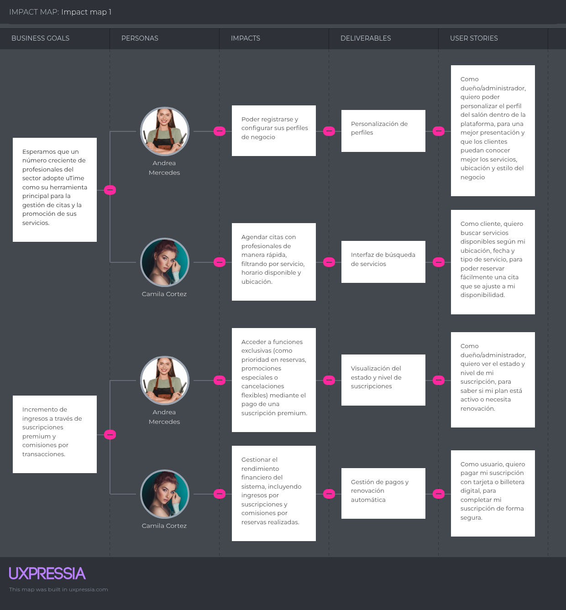

</div>

<div style="text-align: center; margin-top: 1rem; margin-bottom: 1rem;">

Impact Mapping - Mobile


</div>

<div class="page"></div>

# Capítulo IV: Product Design

## 4.1. Style Guidelines

A continuación, se presentará el diseño que hemos planteado tanto para la página web como para la aplicación móvil de nuestra propuesta de solución “uTime”. Buscamos que ambas cuenten con un diseño amigable. Tomando ello en cuenta, se han escogido tonalidades moradas oscuras que contrasten con las claras. Asimismo, estamos empleando formas redondas para brindar una imagen de protección, adaptabilidad y creatividad.


### 4.1.1. General Style Guidelines

#### **Branding**

[Contenido pendiente — incluir marca, slogan, logos.]

**Logo:**

 

El logo representa la identidad visual de uTime. Debe ser simple, fácil de reconocer y funcionar bien en diferentes tamaños.

**Iconografía:**

 

La iconografía de uTime busca que la app se vea limpia, moderna y fácil de entender. Los íconos ayudan a que cualquier usuario identifique rápido las funciones, sin necesidad de pensar mucho. Se usa un estilo simple de líneas (outline), con bordes redondeados y amigables, para dar una sensación cercana pero profesional.

Para que todo se vea ordenado, se usan tres tamaños de íconos según su importancia:

- Íconos grandes: 96 x 90 px, con trazo de 4 px  
  Se usan en partes importantes como la pantalla principal o la navegación.

- Íconos medianos: 48 x 45 px, con trazo de 3 px  
  Se usan en menús y secciones secundarias.

- Íconos pequeños: 32 x 30 px, con trazo de 2 px  
  Ideales para botones, listas o menús desplegables.

Además, no solo existe el ícono principal (hogar), sino también varios íconos para funciones clave:

- Agendamiento  
- Pagos  
- Perfil  
- Servicios  
- Notificaciones  
- Redes sociales  

Todos los íconos siguen el mismo estilo para que la app se vea consistente en todo momento. También están diseñados con proporciones equilibradas y usando una grilla, lo que ayuda a que se alineen bien tanto en web como en móvil.

**Slogan:**

 
 

El slogan es una pieza clave dentro de la identidad de uTime, ya que en una sola frase logra comunicar el propósito de la aplicación y el valor que ofrece al usuario. El slogan es corto, fácil de recordar y directo, permitiendo que cualquier persona entienda rápidamente el beneficio principal sin necesidad de mayor explicación. Además, también cumple un rol emocional, ya que puede generar una sensación de tranquilidad, eficiencia o comodidad, reforzando la conexión entre el usuario y la marca.

**Typography**

[Contenido pendiente — fuentes y jerarquía tipográfica.]

 

La elección tipográfica de uTime es fundamental para reflejar la personalidad moderna, profesional y accesible de la marca. Se ha optado por un sistema tipográfico limpio, claro y versátil, que transmite orden, puntualidad y estilo, cualidades esenciales dentro del mundo de la belleza y la gestión. Esta combinación proporciona una experiencia visual coherente tanto para usuarios como para profesionales, manteniendo legibilidad en todos los tamaños de pantalla.

**Colors**

[Contenido pendiente — paleta primaria, secundaria y semántica.]

 

La paleta de colores de uTime está cuidadosamente seleccionada para transmitir profesionalismo, modernidad y confianza, alineándose con el público objetivo del sector de la belleza y el bienestar. Tonos principales (violetas y oscuros): Los colores como el #B497F3 y #513A84 evocan creatividad, lujo y calma, atributos ideales para un entorno estético como los salones de belleza. El #2D3142, un tono oscuro sobrio, aporta contraste y elegancia, útil para reforzar la legibilidad y el enfoque profesional.

Color claro #F7F8FA: Se utiliza como fondo neutro y aireado para equilibrar los colores más saturados, manteniendo una apariencia limpia y moderna. Paleta secundaria: Complementa la paleta principal con tonos suaves y equilibrados como el #E8C7EF y el #BFAFAF, que añaden un toque femenino y acogedor, sin perder el estilo sobrio. Colores como el #B0B8C1 y el #3F3D56 ayudan a construir jerarquía visual sin sobrecargar el diseño.
Esta combinación de colores logra una experiencia visual armoniosa, elegante y tecnológica, ideal para una plataforma que busca destacar en el sector de servicios de belleza.

**Spacing**

[Contenido pendiente — sistema de espaciado / grid base.]
 

El sistema de spacing de uTime está diseñado para mantener una interfaz ordenada, consistente y fácil de entender. Todo parte de una unidad base de 8px, que funciona como referencia para construir todos los espacios dentro de la aplicación. Esta decisión permite mantener una lógica clara y repetible en todo el diseño. A partir de esta base, se define una escala de espaciado (8px, 16px, 24px, 32px, 48px y 64px), donde cada valor cumple un rol específico. Los espacios más pequeños, como 8px y 16px, se usan para separar elementos cercanos, como íconos y textos dentro de un mismo componente. Los valores intermedios, como 24px y 32px, ayudan a organizar secciones y bloques de contenido. Finalmente, los espacios más grandes, como 48px y 64px, se utilizan para separar zonas importantes de la interfaz, generando una mejor jerarquía visual.En el ejemplo del componente mostrado en la imagen, se puede ver cómo estos valores se aplican en la práctica. Se utilizan márgenes y paddings de 8px y 12px para mantener una separación equilibrada entre el contenido interno y el contenedor. Esto evita que la interfaz se vea saturada o desordenada.

### 4.1.2. Web Style Guidelines

La experiencia web de uTime está diseñada para ser clara, ordenada y eficiente, tal como se observa en la interfaz proporcionada. La estructura se organiza en múltiples columnas que permiten visualizar todo el flujo de reserva en una sola pantalla, dividiendo el proceso en tres bloques principales: selección de estilista, selección de fecha y selección de método de pago. Este enfoque reduce la fricción, ya que el usuario no necesita navegar entre distintas páginas, sino que puede completar todo el proceso de forma continua y guiada.

La navegación es directa y funcional, incorporando elementos como el botón de “Back” para regresar fácilmente sin perder contexto. Además, la disposición en columnas actúa como una guía visual que orienta al usuario paso a paso, manteniendo siempre visible en qué parte del proceso se encuentra. Esto mejora significativamente la eficiencia y la comprensión del flujo.

La jerarquía visual está bien definida mediante el uso de títulos grandes y claros, como “Choose your stylist”, “Choose the date” y “Select the payment method”, los cuales estructuran el contenido y priorizan la información. Las acciones principales, como la selección de horarios o el botón “Continue”, destacan mediante el uso del color primario morado, facilitando su identificación y reforzando su importancia dentro del flujo.

En cuanto a los componentes, se utilizan elementos consistentes como cards para mostrar estilistas, un calendario interactivo para elegir fechas, botones redondeados para horarios y campos de entrada claros para el pago. Todos estos componentes comparten un mismo estilo visual basado en bordes suaves, buen uso del espaciado y una paleta de colores coherente, lo que genera una experiencia uniforme.

El diseño también considera la adaptabilidad a distintos tamaños de pantalla mediante un enfoque responsive. En pantallas grandes se mantiene la estructura en múltiples columnas, mientras que en dispositivos más pequeños estas secciones se reorganizan de forma vertical, conservando el flujo lógico del proceso sin afectar la usabilidad.

Finalmente, se establecen reglas específicas para asegurar consistencia en toda la plataforma. Se definen breakpoints donde el layout cambia de tres columnas en desktop (≥1024px), a dos bloques en tablet (768px–1023px), y a una sola columna en mobile (≤767px). Además, los componentes mantienen paddings de 16px a 24px, los botones tienen una altura mínima de 40px para facilitar la interacción, y todo el sistema de espaciado sigue una escala basada en múltiplos de 8px. Las tablas o estructuras complejas se simplifican en vistas más pequeñas, y los inputs se reorganizan verticalmente para mejorar la legibilidad.


### 4.1.3. Mobile Style Guidelines

La experiencia móvil de uTime está pensada para ser rápida, visual y fácil de usar, priorizando las acciones principales del usuario como explorar servicios y reservar citas. Tal como se observa en la interfaz, el contenido se organiza en secciones como “Recomendado”, “Tendencia” y “Visto recientemente”, lo que permite una navegación intuitiva basada en exploración. Este enfoque facilita que el usuario encuentre opciones relevantes sin esfuerzo.

La navegación se basa en una barra inferior (bottom navigation) con íconos claros, permitiendo acceder rápidamente a las secciones principales de la aplicación. Esta disposición está optimizada para el uso con una sola mano, ubicando las acciones más importantes al alcance del pulgar y mejorando la comodidad en la interacción.

La jerarquía visual se construye mediante títulos claros y cards destacadas que contienen la información esencial, como imagen del servicio, nombre, calificación y botón de acción. El uso del color morado permite resaltar botones como “Reservar ahora”, guiando al usuario hacia la acción principal sin generar distracciones.

Los componentes están diseñados específicamente para interacción táctil, con botones grandes, bordes redondeados y suficiente espacio entre elementos. Las cards priorizan el contenido visual, utilizando imágenes atractivas que ayudan a tomar decisiones rápidamente, mientras que los textos se mantienen breves y claros.

El sistema de spacing sigue una escala basada en múltiplos de 8px, lo que permite mantener consistencia y orden en toda la interfaz. Este espaciado asegura que los elementos no se vean saturados y que la lectura sea fluida, especialmente en pantallas pequeñas donde el espacio es limitado.

En general, la experiencia móvil busca simplicidad y eficiencia, mostrando solo la información necesaria en cada momento y reduciendo la carga cognitiva. Esto permite que el usuario complete acciones rápidamente y sin confusión.


#### 4.1.3.1. iOS Mobile Style Guidelines

La versión iOS de uTime sigue un enfoque alineado con las Human Interface Guidelines de Apple, priorizando una experiencia limpia, fluida y familiar para el usuario. La interfaz respeta patrones comunes de iOS, como el uso de navegación inferior tipo tab bar y elementos visuales minimalistas, lo que permite que los usuarios interactúen de manera intuitiva sin necesidad de aprendizaje previo.

Los componentes están diseñados con áreas táctiles adecuadas (mínimo 44px), asegurando comodidad en la interacción. Se utilizan bordes redondeados y espacios bien definidos que aportan una sensación de orden y claridad. El uso del color es controlado, reservando el morado para acciones principales, mientras que el resto de la interfaz se mantiene en tonos neutros para no sobrecargar visualmente.

Las animaciones y transiciones son suaves y naturales, reforzando la sensación de fluidez característica de iOS. Además, se respetan las safe areas del sistema, evitando que elementos importantes queden fuera de vista o interfieran con componentes del dispositivo como el notch o la barra inferior.

En conjunto, la experiencia iOS se siente integrada al ecosistema Apple, manteniendo coherencia visual y facilidad de uso.


#### 4.1.3.2. Android Mobile Style Guidelines

La versión Android de uTime se basa en los principios de Material Design, enfocándose en una interfaz clara, estructurada y con retroalimentación visual evidente. Se prioriza el uso de componentes familiares para los usuarios de Android, como la navegación inferior con íconos y el uso de cards con elevación para organizar el contenido.Los elementos interactivos cuentan con suficiente tamaño y espacio, facilitando la interacción táctil. 

A diferencia de iOS, en Android se hace un uso más marcado de sombras y elevaciones para indicar jerarquía y profundidad, ayudando al usuario a entender qué elementos son interactivos.El color primario morado se utiliza para destacar acciones clave, mientras que los estados como selección o interacción se refuerzan mediante cambios visuales más evidentes. 

Además, los efectos de interacción, como el ripple effect al tocar elementos, proporcionan feedback inmediato al usuario.El diseño también se adapta a diferentes tamaños de pantalla dentro del ecosistema Android, manteniendo consistencia en distintos dispositivos. En general, la experiencia busca ser funcional, clara y alineada con las expectativas de los usuarios de Android, garantizando una interacción fluida y predecible.

## 4.2. Information Architecture


### 4.2.1. Organization Systems

-Landing Page Diagram:

-Home System Diagram:

-Dashboard Diagram:


Los diagramas del sistema han sido divididos y organizados mediante el uso de colores distintivos, con el propósito de representar claramente la funcionalidad específica de cada sección: landing page, home system y dashboard. Esta diferenciación visual permite identificar rápidamente el propósito de cada componente y entender su rol dentro de la estructura general del sistema. La jerarquía de elementos se mantiene mediante una distribución ordenada, donde cada bloque se relaciona con funciones concretas, lo que facilita tanto el análisis como futuras modificaciones.

### 4.2.2. Labeling Systems

La interfaz de la página principal de uTime ha sido diseñada para ser clara y funcional, permitiendo a los usuarios visualizar rápidamente la información más relevante desde una sola pantalla. Gracias al uso de etiquetas claras y directas, la navegación resulta sencilla e intuitiva, ofreciendo una experiencia ágil y sin distracciones.

Antes de ingresar a la plataforma, los usuarios encuentran tres secciones principales: "HOME", "PRICING" y "MORE", esta última incluye "ABOUT US" y "CONTACT US". La sección "HOME" brinda una visión general de uTime, utilizando un término ampliamente reconocido en entornos digitales para representar la página de inicio. En "PRICING" se detallan los tres planes de suscripción disponibles para salones de belleza. Por su parte, "ABOUT US" ofrece una breve presentación del equipo detrás de uTime, mientras que "CONTACT US" reúne los canales de comunicación disponibles de uTime y PaxTech para que los usuarios puedan contactar al equipo de soporte o realizar consultas.

Menú Salones (Segmento objetivo #1)

En uTime, el labelling system para salones ha sido diseñado para representar la información de manera clara, directa y sin ambigüedades. Las etiquetas empleadas en el menú de navegación buscan reducir la carga cognitiva del usuario, usando un número mínimo de palabras que sintetizan acciones o secciones concretas del sistema. Estas etiquetas establecen asociaciones lógicas entre la funcionalidad del sistema y el contenido mostrado, garantizando una experiencia fluida para los usuarios encargados de gestionar salones de belleza.

Home: Punto central donde se agrupa la información general del negocio.
Appointments: Lista y control de citas agendadas con filtros de visualización.
Reviews: Acceso a valoraciones y comentarios de clientes.
Services: Gestión de servicios ofrecidos (edición, creación, eliminación).
Subscription: Panel de administración del plan de suscripción activo.
Settings: Configuraciones generales del salón (horarios, contacto, ajustes).
Notifications: Centro de alertas relevantes y actualizaciones del sistema.
Estas etiquetas no solo organizan el contenido de manera lógica, sino que también mantienen coherencia visual y semántica a lo largo de la plataforma, promoviendo una navegación intuitiva para el equipo administrativo de los salones.

Menú Clientes (Segmento objetivo #2)

El labelling system de uTime para los usuarios clientes ha sido desarrollado con el objetivo de ofrecer una navegación sencilla y directa. Cada etiqueta ha sido cuidadosamente seleccionada para representar con precisión la funcionalidad que contiene, utilizando el menor número de palabras posibles para evitar ambigüedades y facilitar la comprensión inmediata. Este enfoque promueve una experiencia clara y sin fricciones, alineada con las expectativas del usuario final.

Appointments: Sección donde el usuario puede ver, agendar o modificar citas.
My favorites: Acceso rápido a salones o estilistas guardados como favoritos.
My profile: Información personal, preferencias y detalles de cuenta.
Estas etiquetas permiten representar de forma precisa los conjuntos de información más relevantes para los clientes, organizándolos en un menú compacto e intuitivo. Las asociaciones entre etiquetas y funciones están claramente definidas, reforzando la lógica interna del sistema y mejorando la eficiencia del recorrido del usuario dentro de la plataforma.

### 4.2.3. SEO Tags and Meta Tags

Aplican únicamente a la landing page para su posicionamiento en buscadores:

```
<title>uTime - Servicio de agenda para barberos o estilistas</title>  
<meta name="description" content="uTime es una plataforma que permite a los barberos y estilistas gestionar sus citas y horarios de manera eficiente.">  
<meta http-equiv="Content-Language" content="es-ES">  
<meta name="robots" content="index, follow">  
<meta name="author" content="uTime Team">  
<meta name="viewport" content="width=device-width, initial-scale=1.0">  
<link rel="canonical" href="https://www.uTime.com/">  
```

### 4.2.4. Searching Systems

El sistema de búsqueda de uTime está diseñado para ofrecer una experiencia rápida, intuitiva y precisa tanto para los clientes como para los administradores de salones. A través de una barra de búsqueda ubicada en la parte superior de la interfaz, los usuarios pueden filtrar y encontrar fácilmente servicios, estilistas o salones según sus necesidades. El sistema admite búsquedas por palabras clave, como el tipo de servicio (ej. "corte de cabello", "alisado", "manicure"), nombre del estilista o incluso fechas disponibles. Además, puede complementarse con filtros avanzados, como ubicación, rango de precios, calificaciones o disponibilidad horaria, lo que permite a los usuarios personalizar su experiencia y encontrar rápidamente la mejor opción disponible. Esta funcionalidad mejora la eficiencia de la plataforma y contribuye a una mejor experiencia del cliente al reducir el tiempo de búsqueda y facilitar la toma de decisiones.


### 4.2.5. Navigation Systems

<p>En uTime, los sistemas de navegación han sido diseñados para ofrecer una experiencia intuitiva y fluida, guiando a los usuarios a través de la plataforma de forma clara y eficiente. Desde la landing page hasta las diferentes áreas internas de la aplicación, cada elemento de navegación ha sido pensado para facilitar la interacción y ayudar a los usuarios a alcanzar sus objetivos sin fricciones.</p>
<p>Uno de los principales componentes de navegación en uTime es el menú lateral, ubicado en la parte izquierda de la interfaz. Este menú actúa como eje central de navegación, brindando accesos directos a las secciones clave de la plataforma. Para los clientes, estas secciones incluyen citas, favoritos y perfil, mientras que para los salones se extienden a servicios, suscripciones, reseñas, configuraciones y más. Esta estructura lateral asegura que los usuarios puedan explorar rápidamente las funcionalidades que necesitan, manteniendo la coherencia visual y la facilidad de uso en todo momento.</p>

**Menú de Clientes**

Para los clientes, la navegación se estructura en un menú lateral simple y directo que incluye tres accesos principales: "Appointments", "My favorites" y "My profile". Estas etiquetas, acompañadas por íconos fácilmente reconocibles, permiten que el usuario navegue por su historial de citas, acceda a sus salones o servicios favoritos, y gestione la información de su cuenta personal. Este menú está diseñado con una jerarquía visual clara y un lenguaje sencillo para reducir la fricción y fomentar el uso frecuente.
**Appointments (Citas)**
- Permite al usuario ver sus citas pasadas y futuras.
- Incluye detalles como fecha, hora, servicio y profesional asignado.
- Posibilidad de cancelar o reprogramar citas desde esta sección.

**My Favorites (Mis favoritos)**
- Muestra una lista de salones que el cliente ha marcado como favoritos.
- Facilita el acceso rápido para volver a agendar con salones frecuentes.
- Incluye botones para ver el perfil del salón y agendar directamente.

**My Profile (Mi perfil)**
- Permite al usuario actualizar su información personal (nombre, número, correo, foto de perfil).
- Acceso a la configuración de privacidad y notificaciones.

<p>Una de las herramientas centrales en los sistemas de navegación de uTime es la barra de búsqueda ubicada en la parte superior de la interfaz. Esta funcionalidad permite a los usuarios acceder de forma rápida y directa a salones, sin tener que explorar múltiples menús. Gracias a esta búsqueda inteligente, el proceso de agendamiento se vuelve mucho más fluido y eficiente. </p>
<p>Asimismo, se implementan acciones contextuales en elementos clave —como botones de agendamiento rápido o marcación de favoritos— que permiten a los usuarios interactuar con el contenido sin abandonar la pantalla actual. Todo esto contribuye a una navegación intuitiva y sin fricciones, asegurando que los clientes puedan cumplir sus objetivos de manera ágil y placentera dentro de la plataforma.</p>
<p>Finalmente, para facilitar el desplazamiento dentro de secciones más profundas, como los detalles de un salón o profesional, se han incorporado rutas de navegación ("breadcrumbs") que permiten al usuario regresar fácilmente al punto anterior. También se incluyen botones de retroceso para mantener el contexto sin necesidad de recargar pantallas.</p>

De la misma manera en la aplicación web los usuarios podrán acceder a sus funcionalidades a través de un menú de navgación en la parte superior de la pantalla. 


## 4.3. Landing Page UI Design

Para el desarrollo de los wireframes y mockups de uTime, utilizaremos **Figma** como herramienta principal de diseño. Los wireframes definirán la estructura básica y navegación, mientras que los mockups mostrarán el diseño final con la identidad visual de la aplicación.


### 4.3.1. Landing Page Wireframe

Wireframe de la Landing Page.


### 4.3.2. Landing Page Mock-up

Mock-up de la Landing Page.


## 4.4. Mobile Applications UX/UI Design

### 4.4.1. Mobile Applications Wireframes


### 4.4.2. Mobile Applications Wireflow Diagrams

**Segmento objetivo #1: Salones de belleza y barberías**

- User Goal: Como propietario de un salón, quiero gestionar las reservas de clientes de manera eficiente para optimizar mi tiempo y brindar un buen servicio.
- Task flow:
  


**Segmento objetivo #1: Clientes de servicios de belleza**

- User Goal: Como cliente de un salón, quiero agendar mi cita rápidamente con mi estilista de confianza para asegurarme de ser atendido a tiempo.
- Task flow:
  


### 4.4.3. Mobile Applications Mock-ups

<div style="text-align: center; margin-top: 1rem; margin-bottom: 1rem;">


</div>

### 4.4.4. Mobile Applications User Flow Diagrams

<div style="text-align: center; margin-top: 1rem; margin-bottom: 1rem;">

Los diagramas de flujo de usuario (user flow) mapean el camino completo que sigue una persona dentro de la aplicación, desde el principio hasta que alcanza su meta. Esto permite visualizar y entender las interacciones, pasos y decisiones cruciales en cada momento.

URL del Link de Figma: https://www.figma.com/design/2RXg2e7OWrAbqYfNcw2EVP/UTIME

Vista de clientes de servicios de belleza

User flow 1 - Registro y login para clientes


User flow 2 - Sección de descubrir → seleccionar servicio → reservar


User flow 3 - Sección de gestión de citas


User flow 4 - Sección de busqueda


User flow 5 - Sección de información del perfil


Vista de salones de belleza

User flow 1 - Registro y login para salones de belleza


User flow 2 - Sección de vista principal(Calendario)


User flow 3 - Sección de servicios


User flow 4 - Sección de equipo


User flow 5 - Sección de información del perfil


</div>

## 4.5. Mobile Applications Prototyping

### 4.5.1. Android Mobile Applications Prototyping

Creamos un prototipo de interacción real para que se pueda experimentar la aplicación en un entorno simulado antes de codificarla. Esta herramienta interactiva muestra el flujo exacto entre las pantallas y cómo reacciona cada elemento, lo que nos permite validar y optimizar la usabilidad.

URL del prototipo en figma: [https://www.figma.com/proto/2RXg2e7OWrAbqYfNcw2EVP/UTIME](https://www.figma.com/proto/2RXg2e7OWrAbqYfNcw2EVP/UTIME)

URL del video: [https://upcedupe-my.sharepoint.com/:v:/g/personal/u20211g671_upc_edu_pe/EUCzj5c18VdGvJxPX_m0NzcB_UOw9M2pYyfzjp6ukzwg8g](https://upcedupe-my.sharepoint.com/:v:/g/personal/u20211g671_upc_edu_pe/EUCzj5c18VdGvJxPX_m0NzcB_UOw9M2pYyfzjp6ukzwg8g)


### 4.5.2. iOS Mobile Applications Prototyping


[Ver prototipo interactivo en Figma](https://www.figma.com/proto/2RXg2e7OWrAbqYfNcw2EVP/UTIME?node-id=1518-1501&p=f&t=zpYMvQwAn8tiiT8W-1&scaling=scale-down&content-scaling=responsive&page-id=160%3A7176&starting-point-node-id=1518%3A1475&show-proto-sidebar=1)


## 4.6. Web Applications UX/UI Design

### 4.6.1. Web Applications Wireframes


### 4.6.2. Web Applications Wireflow Diagrams

**Segmento objetivo #1: Salones de belleza y barberías**

- User Goal: Como propietario de un salón, quiero gestionar las reservas de clientes de manera eficiente para optimizar mi tiempo y brindar un buen servicio.
- Task flow:
  


**Segmento objetivo #1: Clientes de servicios de belleza**

- User Goal: Como cliente de un salón, quiero agendar mi cita rápidamente con mi estilista de confianza para asegurarme de ser atendido a tiempo.
- Task flow:
  


### 4.6.3. Web Applications Mock-ups

<div style="text-align: center; margin-top: 1rem; margin-bottom: 1rem;">


</div>

### 4.6.4. Web Applications User Flow Diagrams

<div style="text-align: center; margin-top: 1rem; margin-bottom: 1rem;">

Los diagramas de flujo de usuario mapean el camino completo que sigue una persona dentro de la aplicación, desde el principio hasta que alcanza su meta. Esto permite visualizar y entender las interacciones, pasos y decisiones.

.png)
.png)
.png)
.png)
.png)
.png)


</div>

## 4.7. Web Applications Prototyping

[Ver prototipo interactivo en Figma](https://www.figma.com/proto/2RXg2e7OWrAbqYfNcw2EVP/UTIME?node-id=159-4024&t=7a0gTd0f0bacMsU5-1)

## 4.8. Domain-Driven Software Architecture


### 4.8.1. Software Architecture Context Diagram

<div style="text-align: center; margin-top: 1rem; margin-bottom: 1rem;">


</div>

### 4.8.2. Software Architecture Container Diagrams

<div style="text-align: center; margin-top: 1rem; margin-bottom: 1rem;">


</div>

### 4.8.3. Software Architecture Components Diagrams

<div style="text-align: center; margin-top: 1rem; margin-bottom: 1rem;">

Single Page Application diagram:


Workers diagram:


Profiles diagram:


Reservation diagram:


Reviews diagram:


Services diagram:


</div>

## 4.9. Software Object-Oriented Design

### 4.9.1. Class Diagrams

<div style="text-align: center; margin-top: 1rem; margin-bottom: 1rem;">

**Diagrama completo del Backend**


[Link a vista amplia](https://img.plantuml.biz/plantuml/svg/tLtDajku4Rwxok-WsakyvLhDVSfnTlxiA3KUpOvcTcjFBbf3QxYMH8Max9tTsciU8Cazpv5ptYHFa4S8Vm0I01j0DmXGzix1bYYWlqQZkm5y18blyoBAYlrcFTdV9fjuSXejFyJR-wTFyW_9TXTbqMQoAoz5gtXHFAxZIHOlYsYxMiTFdpnzmdwPV7MTfU-JTPn_DVdrwPD9-TV-SfvkecJRNfT-UvFUnslf9-ddazKgYrTH8OWL_vRhACydP-iatXOvLA3w--PTaXKFR-zBASUix6brvRoyeAdnVhzUNqMRilmhzgc-hYczp-DiTdyykQl_Ltxjr_cjCXlSajA67vFxEDEtPSTAS6jNkDUzQvhAoQOqwbssxghCs1LDXNMwZ8eatNOLBjaLi5dg9LqpAqFbanSlsjwzITFYvKjTe-FIVKgTBwh_u1AxKkgdDAjimJwHpBv8bqcqrXizhtyl_IKwPcMhpoWJoFtwbdUHgN-h0ZEnfyGBcchBz6FNcQMNYryfUgPPyJvT9-dRkhBT3KNtGxWTMgLUPxKPuIpTRABjlJ4VP77fKqsai-Abizt4oz8lNhuqr-ADSQtNTZ2w8ZTvOt4gBdDTMxNVDDRyRXzdYJ6vlewBa_MQfTYg-2D2jwPIcyq8rHZGwUFidb2B8vq-rad2gQODK6V2xwFrFfw_-waS5FElj6PaOyEB5q9nVSRx9YdZQfrkLmuvnXUA3gST4R4exvCiBvhHT55a2GHNbokbOufz0rz_leeBhjgphyqowh9SAqpXoyXUrjunBFcX3RUlKgOp71-fqN3TO4_6F4ktHRGiq52xXtGRN-qtx-BCqjjixATRWSq3_Xpb3tYrX4eaJFF48cpSTnCID4epdxapkPTGRhOq-KHTq12J2uw5YRD52pWeqhg9CBxhWNarFG6BCpKAj3pbSmY_ZmxfHPapqgqjprmenbPhacrDRcmonBgRNRHz98rvowuE6b7uAdnivncBEFkOB86vchW8PlD0LhPKTxOjuknzj8nXPP_FTrNAZzOlsCJhvUIXhB-Edq6Jw6Np_zV6YP6q9g-dL7XjBfEyw6a2p43_MltxDQKvqDGIaW8sHbaKUBEkkjWWs5UUMnCjt5PMRAnCs9sitCemsndVMyACdjnXF9k7whXsjUVGSxpka0vi-GHDHqeOY7umobM4kiGHkDRrrolmKfhIDx84fwvHA1IrPm04JCSOfCeY7Rf5vX2yTOT2JH2wWTLqCJ-hgbXT58YmDY2akOGsBll8_klexDrkdJIhB9WEhzjOgg1bnELE0Waw_NnWjjcjjLEMfi9Dl4lpf4Ypn-DIa7o5EFdNQV1CHUe10PqZTv3YS1F2R4NfADbey41lD1kl8Xfkrxj6D9rUZsTzF03ErO2u2GdAXF3GUpXJwlKPnwIMgOBPfgPnym0cjQaJsAAKOTveLt3W6z-UMZN2sX4rFWFsqn3XucXj7PUaiNtSOMde6jDeM_Gw4p1aPoDmSJU-N_fOArgjHLWluYrlMJC2nhVFtMRRzrcK5zb-MUop69w-NPVjA8qMRvUnVa_3Jxl8kfb127ZhnBVwSt0k4mGeZcum9ZE7ZNKJvuNUIjKjXInThqkBMgtLbRMa4Jd5ebC9aBDuNV4QCRpAzk_IRHvVR8kaU7p1EpvFzrdP3oM0CATzfWi7cv0LZueglAwZuW4hwKzYvTmFFbQAaA9RKOsiBab3ikm95U4fGbdPMT3vb4kG_MK7N1tcCLqaApx3Vy3Q6n2qac-DEtWEh_v3KZnSLvl8uZ8Te1t9hf8lIVLOGVBCdiJMDrlVSVBERec2Tb9uLTCv6_mxKYZilz2lVloOIzRwCoj0xNb0xWgaCmTuEPCopDdHYZgvQqzwpsrv2Phtgiink_EQre-bevb-nebKF5V_uq37bGNt_LRw7UqDMgahYEnrSLf9YAFFqhIaUQn6TkUmSW6IlxRBNgkVWklouqaENJQBaFqnxrySveSCfUT_pNMiwVjILYBlxU1dJMKt_x9eG_8dLLRhH-m7XF_eTlzncVP52YyfR32S_AhVT21C_brgwlUn6ggg4njJBPr1Jl8ythmhmmfja5TP6OfDTxMLTJ7vNAvwF2bIGSocaK9A1y2TWqeIbuhGg2-WKWkGvQ2NqeqkcYaYVEYc-abdUhjIQbqFNQYRuBYefShmvc6Q6VkG7bL4UUbPUEGbMH8MuS-GuFJGoOwW91zcL0OSYlcKgjxCnkIws8bLTJSCo1N-9ZqzrjlTDjhJOwPR5jMVzAnBzrbJE6-adST5b5GcMqZVpPNORi7kYwRu_JvZ6xNFsIUjvlLyyqswZNLSLLv4nRxIi_uVqvCQMqkFGUYjxVif1HX5jhgAfDqMhVIT6oXfdwZKyqGytlbeiCvlPjk2qh3QD_1jOYvrcgRhEB8_AUZXMIzcUj9azsvtJwevz14gdcVKfumCAbRxZffQqED9g8hvwMCNSbO9mxOWoxPqs4V6vQiRoUG-qj-eDaW2Uvko9KtiFUgUD5KPo24Gkz80CJttq8hHQg9t5FiUDy17BdwEQuLrJi91hjBYLRhVtb_yl6mgbDPiFskigQtxh1kNF-SzUM206E_hipBYRVrSlKJaZhn5cqKQ8UAKZWA-4ZUPGD4wjfs7Xxx5m9JmDsj4Im50ztmskoTw_QZcQ0V5m-zYQ8F4Jab36QJrLHmb3SH6Ay4dASsxGYMbc-je7hWdPYyc5YeZpPhfo4dtT5b9CKWZfHLX7IdDT0pCIYlu57BvaDDj3B-iD8r4lyXL_T4lKiETM1X9WW-M2keIccQGXA0qqKtyCOa_7O0bOi1MakXjWdaZIhDth2xRt3ZGbingt6E6_tlXPtYZGs8q5aCZS4CRdtEl-9FjwdYIGFm94nELghuRJ7sqInkxKpgifAg_vvhQpnfBz5PI9FNHp4sZXCD8WguubBTXaKzZNvfATDQ6WP586rW03x70d8_K3GwK3zDNMOFAdOiXV5Gva9CGw1wnqubiZwe9u4LshWSGehgKcUdH2Y0iykoIP2Vxx9-9X9pLI0iq5KHM85Ekk98lm_pUB0ll-qeF0L-9n0iGD-CQU6W8cYrB24EZDkHGn4cpXsFrzxboDwelV17K3OyoAtC3vHxkxIZU1WWjNjyZQyCxGI5jcijOVgCdP2za929ZmvhjHjZq55c90KoYQnHHBLl3z0jCriZe5AxcS1Di35CZjuj2rCWrlV4qKgjTQ1f9W3-MPe1UW02V74trr_PvjEnFqwIPGPKfuv-BLz4okcTJ0nJjK_7JaRmU7f7xwT3rR_n2KpgCQg-ByZcIhYoDLjf5Znkkn7NpMLksI3RnstoTDgMhztuloY_Quf_Ix0DJuuVw8rGIcHYGLDGO955h_w1lPkLT4HAawy6GABplIHZqzzzLVovSKXkdJkCTfVPmLgdBALI6fwtfmYzri0IEo21ZjDr5_VvnefiwtNjhxrx_uuWdGABMeqWKbE8XP1uAK4pdV1X62XO7kgEDKRAAGYzcAHAfl1T69a-8Nmm3fWaY2qlJrfAf6k2oEo7c9p8HKedHgNGYy9LCai6HVQW-y9Sk4CQdfWoxXYvfWohLXQVpapwgly-NiGESxmkXxOJWHt1tcgmfnH-InODZNvBabSyJkgX7whM_uGarIDnUJQXaZgzhkYlH1-crwkKQ8kNN5ohmVftEmSc_dXuq1l3moo8S5zXh9eqGx5Nto0ggHd2Z1bKfFld1OHhgf8JOpIK_-FSGPV5zdzGRQyFmDleGdqLvVFtmc9UJyEhyc6IxMXHPQOvLDPYTLUKCXm5fHh41f6JZfWQbwmVwjAFLflfL-zIVNuwkqGH91YttMLRsLRMtth39Ajga-ss1PAOGt74pnJe0RSo0jVsqhH_wQqePdlRCTt7r-6to2tjshwcmaAvggkuUqY9zMnyZrDIwhYuWpry36uvqYwvHQA9mIpagGqMIhO5_Kb4nhICwjohb-2FUBsDneusc3kC_kk9GHfI52usBR2hHUL06DY9zATdHWRba6YlKYDmx6BvIbGFrCe6b57kDI52gcW1kOASb0I6gJvXfFgq0fmSYXVyEGUz1JcPabPeA8g7qIRdYokSDyrUpBBpFAZq4V2LoTu2_ZslWeQ5ZjYmXV8pQa488w9NFXk9I---BOBTuP5Y9BIXVS0z5qLb0EF3w7aaitWaAVzLSnb8wFI5x8OiG2IlMR3UkggV8IWmw4aEbY6h9AQPVO5vAHgTGKeURZMA8ABbT50vAhkcDVf9QxS8yIGByaKu3z084XA2Q_Z3ve-MlAlE_V_tptvERYykJizb__d5rF3bv_VhculN9xSLYyj-__Nto_SdbtSLaVlgNYxFR1KucVpNRj24PfZMVCEreWobxYtcP0bzEuCBYKdlAJpRsBxavcDg_NFRMzoGh7ixB-bLdM27QrsTZGTGtuQ4QuepIdLuV3eEVseooLzLtQ8JwFUU-XOh7BADKPk-Imyhl3ZScEL1xVY71_E8Pl26XfCDwSQrI3lyZ-oqgAXn1n9Quvjkp-Pit9rVdYydHvBkxYviPoxjT6XwIT3b5DeNEYDCtif_va03gctTH46s-888WdC_airWq-CGj7ARYLqX8vN0g51IheuyfHaLEWTEUV3Y28Bvt1fHd-Vq3cFoucG31oqgdAGL48LbAW71FE-VpDoUpgydYukRxsHdBEVrKv9PxE9Cq1S_brhVHbAqCA4hI8UCezH58oik7dH7rgQY3D1uRZ4S4nHXmuNDnqNXoTIWhAKuYi-Xw77qQ2m6XfZA4RxWrHAuT1gQNRaB3TBbpIAOwkRw-d9sTtCxcGhgQlRc-h7FMpSNrV36xdTSJfwCsXH4Jbt2ROihlI4nbtuUpMSr_IsQHkTcfGCDEVzf5K_M8kp1A4D8gLG4usvBjmCMuMmAh22drkoe1ZmW7j0fM8TemHTR6UdZloDQXwUCoeb9Lqf_3Ewvfa7eu3lgW2j9jHsYG3fvT7JIWpqP28_SdAJHmSAmVmGETj72PGuL7DqsjnaJtC-Cwcr_TtimlBozkcdLXE-iwWjYg8tUkghiVFArk_Kw5ExpjHAUzZmkPmZWj2WYatD_rXqDQ27j2GoKn_rY6jPKdC8XTGgAq4Odr2tWs6XhDnG-nO4Ikn1yaCgi70JGbyi20OkuEWAaZ44bGtQg2vgVmQcHay06nWeIcadtUeSttEx38saDjpUOs7rqx8hHBHvE0tIXMt_Z66qr8tFw1i4P3Wul4e50EVOa3GgrWlUF1T-oSgT75ukBDQJjF5oRdmYwUexB6OdvtSpPuUjxkR6hNsOP3J1rl-ld3L2Mrk_eKIJXmx4cftYVrGtKmc04uPjUOE3fLkiM-Vf-Wy-rIZx3wngkY23sWp847-a5lHaso12_ghIEWxH5OWoYpF4-6GSrV1ClWJt4TkeV3QXV2QQq-UMUzNeYpMMbZ5zeMnYDO1p3CzO3M3NSLToNlMPtKOvhunW9jgyH2jKxwMi1spsgdML0OpWk6nk615nweUqrZK1pn1Oz1WRgtGtB7RAdJqYzBRpmvdzSVkwdQZosFglNJTahSVqE1U6DUhwCIH7qneN5rBrZ0u_Rt8UXXPVwe9oGug518e9760rLV13KoTfS-3e4klLIgYyDwlqWLUDL-aJBechYSpQ6mGzqkrSP4Uzj6accvUIQK5U-V1LThK9eOJo5a_a3SQTEvsxYzDaId0QbkD5qG6V0GkbWIuu5KCkVB0ocbIQFTdU4wcRQpctuIDH5cKY1Bf9dRD6HKQ8MHR5SW7HLdDqQtE99IY7bHHfwv1bT2pwu04j7QqDuwHb0AEQpfDQEzROoWcNvy8onmwoC638xHdE7OQ0MKDIm1VKeMrye-vV8p8hjCnHPObRqww-bjrPlzY2U0Q7NewsiJ3nqmGXBFMyZNZTW6gdC5uK2euSsJ1XBvaAW0me5tQuH1aL-ewzHD8WDGUMNfbFDgsLz-NTnTtfx0yIkCFC0PWrf5J4xi7GFmP1i6jCGZkQf_0CLTGm704xr0ICeiLt55UJ5SFppnO-sGp3SbVqGkyZHd2ufQMnTJwjbt_bLmY9NGu60GMU3LwJzyx60uszFnoT4T65SRzAFWcdB1M0feKWIum9lL0rOrtRnLquDvhQKS3mWeQ0oXO33A6iuNYdt2uGS1bxayOnb7UpzOcCJW7QcN2lGhUbW3SHrjEz1FpidwrRCenpyoOkvgXqGV6OXhCycL1sf122QC3kX32d6M80NQG2r8SnALYLYcMuY9Q7EjTlC0Ar1h0fVMaX7UXRCYvt4H9TM6Xb00pGkil4i_tsVrN264uaLKxCNjYIsdSiIfXye35Ee15gnkusWAYVG7MdqhHEEzmo1q8F88nSjqxC3WLWW0h81Cf0G0q90fRjQo9NXqjnWznW3OstSaLTHdHCSMXDI4OWzK5n0ZmnXHg8P35GTrmTYQKEo1wW9MX5zmZcd35ZyPGJSNfEiQ11sJNFZmexwog1fzUaCIE0Yrt-K-4xcrOLd86ux5mJKuVQgGF7m50L67i90W4AcYeJuhn-cepwFsLf7iExYt9a0TtR8nGi0O-RSsQZe2BeWQJhuTNW5hFaMGOf3_XEy75nqS8Z8ujY5Gny8snw_0IrRHAsyyqOvBqbDQtBqaTeYMmOD2AQIaHwHXC-h1UCH9coiUBfG2e1c29nmQ52xUOIqJifOXPICgUygm7L2FXASGpO7wUvw-8c17M20Yj1XbZJIPJ1hdQHvZdLzntwZUNC-ERj2QbPygL-63PO6dCRhJvK98XuwY2u7J7Lvdm51SG3ulGelMrmm30Hr9GO8mWCYPN3hPnqyh103rn9z001gIRPYrsX04prVJoZUvIH0Sm5SmEFsr8D5Rme0e7XCI19uJYtYenPdsP3HH4ylII3qBAfGQZfuQMW7GXH4go0ibtG5gOVk1heDJV0N6DeRTADZsQ3JDktldaW70HayD2WKSMEOB2JTy-a719mpFUDOXpWyUDXQzencZBn0QFTwwjOpz63Cvv-eMaRASCEY3uaHTH2AE9GiGFUeYqeiMY37NThCMkJvnRxXwQv8Ag6dZqoVVnjlx_MRzVm00)

Diagrama de clases - Profile Context


[Link a vista amplia](https://img.plantuml.biz/plantuml/svg/nLl1Sjiu4hsdAl_0ocMTIbc-kxAUaHLDLbEofP7ix375oB3C34LgI2fRhgcvpWVCp7s-Oy_x9_C5ymaBYW09W0sm0OAA3x53elirNpSQ3R3vRLw4MN7OnS7XBjgHu3hS_4YIXvSlyX-ZP1zcuIxOqqlXbgoBvvW46TaKORADoSiNBr-mEy6hPPO-HZ79NmK_ltmHq9_wphjq5qP9VLswTvC-a5Yw9TqURxSPsOQ5e5RysSHXdWUJE299aKC3of_pJr5MF7rye5eksTZhyiexUa4ZyNY8uzjmHyT_n_xI33pa99izN0Rtnz_jGR-K5C5MKxw-H0yaqzkzPoCuioNGidLD8npjA87tMTo8pDWLZK2SRi8YIfD6OCwkM3rMoKGUl7rRUswLfiNLbUuX2GqDQkEq_0MFs5Ej_qcpyjdPNrRshDDD5CPwalFZVHeBuIKRM_uDGi00dAsFt2KcVvO3Pg9dn0iQiKtwfN4UZM3nlpPsfbdncCPH-l4et1rsOhWXmWnjKijPzMoVfBjTc3mOvtf6Q4nLivWDfy6s8XiQ5rTNPYd-CAvojOFHWfpoYd5RN1QwNMA_QDZyuK2oo9WutvDY7CSiVPR3dn6sLK9rzh8GOq3NpxC72ocETFryJ19Eabs0EWe_XF61B3vzfWjU_afBOvNygN9Xk3xZdKTqNiLfidN8CRvGT3XyjKEZF4PPNbGhvRh88WZkE8vgnmmxXw-_sPA2ctRssgpZE9PRXHay3xl7TZk69JyqSOSoPJh3yPKP3TSixjQOapGfmas1Xje_fGcvFUm-aQp3sspjjsU1rG7_2lCdl5c2a17JN4WCEy-R0WIDKjKlzwPm4iRDDgOOE0uqpC4rnyBCgtKDs6jcDOKktjL0tMoVSCNAp0PQBl4SfjiNXtIYr8ZsRCkLYWtPggGrrzOF6_LXTxSFasUhDMxJoA0HXVyAVzPrnPfaNw8DK9k96rfMzx6nrDnPKf3iCTmGsDWtYtsPuiFuBIkqhe8dAX-JCwXetbI_NniB8Mb_VIoXyDRCexneMG9Kd3-L_xwsUHoeb8IqW0-ZR0AyiQjkBYpubMjfIuPhOOLZfK1tOhdMOUOPxosXWhTs6C_cGpcktjqvU8xBzd5WVNwWSQI4WV23KQ-Yr6KUWNjRVrw1jyuslf4rEBb6EJ9HFGCWO1nZq2ghT72BV6RWpHtAKOI56vYa2_rCL65TL8XW6r1INKAJo_valvgZwVq-ZgfT5NoqVNn6QeBsT5js4dWWfwy7Phjzh2rPAe4LsQTvLAJPyoLL95-nBFvr5fofI2qWm3coWvI02oog5SLHCcdmGc-aZOk8nErRroofqzjnriO3u5m9n1KaA0hXfVVhKQctvpIKTfGAPavDw-PNeBJBd84PjLdcZRo22z_f-TIQCIoFgFKPu4zpy2skrfthahIsdtPPwhl7D7ABtcS2H3OSWPkxqyUbZxrY9riM-qKyynrxHe3yxjfjbZncOLvaXqrno0XSlYtfSr3IIB8X-lw4p_kmip51cF2jmjSXaApLsPF3TEOmCIkI5tf6ojS5MHh7bBrEPfgn7Ib3JgVej07a9ouhNhESIlJvzscIasbIHCNpM-xaF3rar0yKGAXVptIXtwLaosT0EPMMOV64rVIDA9pxmSTg4T9nhQhIrIHaI5TtyaH4YZ1M3XPqxkGQv7ZP0rVxHKmpavMOuJUmV0EAjl9hRuV8uUB_ZegdPTdyHMWwG0TIjqc-D1tN1Ql8R6ciOxEE7QVeRBOZw225Tp1DiC7taKhX-8Nk-ebZhbaRpso0hUS1lLlmwB97b3Cj_O8TRQXJkBQqjyAMZx2BNdNhrHsyfhqY3JJJRPnA9NBrDti6hgou7RVIVNGqQBLkeODTbw2Lb3Z6h9sLTX6hqTq4h3p0AbxhBMvdd89xyCiWXowRLSZncBSlzej3XjAAl-ewblgsbgrunkqGPvMmMtnrM6CLJwgkEexO3KJyw3hxkCxkJGeVAJGF1Z_h6mo4ujz5Kj-ZQX1L2nkJb8wGSPwJtISwhT24V9VHgLYvgnRMpSatikXbKAI2cbsbnIeT06y9IarSAyAYjeBIB42NWrsA6rqiKrJui4sDauRwRgDKMGykr1KuBcQfEhn5cAPYx-DHHPKNpy8hhnMJi0f_H8BbeHEFe2OVD2eBZWrzYgWtsfXU5vwOg3inu5dXyKJn7y4_EtxACN__-ST_WzLqFfxC_lVxxMKmVlz-DNq_lfkkWxz-_ItuC9xVJuF5zVVJoTqQfvDFdL7rJTde-FdOgFbARCI_1Ji_lmhWmM9F_wZvlCktPlv5c6-zhG_O413ryGOMfDryEoHAy-NGS1ZDjsm8bEeRDYG2-tJDhrAnnHrbCl_C3QbV_DBDWlRc6pSy_V8NRiD1AT_5OQ3KB-9iunOrAnn1n2TnpRUJnStD-FRTEhW8VhYVhcOixpPfk4_IvH_hZQ1-7Vr3jZCV4a3T6Q4WwdnX2O88FbFCOj7WxWSSfX9NI4YbKG05nMJqSufzQJW2thpx20H1VUjzl6VzxPVXVi9CW53UO0oEOiMK0E6UTjujRiQpss0zNNsOJLZEQQSYjzp3cr96u3SI-cSqPIi3Yf9qh74KUGGI_ER77b6VYXf8Omit7X5KOy25UvJHUB8ub9MK896RZ_Ku-ZGs18IQoX2nuVOWilGmCArqCpHCaplxPAhnSZcVJSPtiuMGhcOto_anPwscoyLwThSu5auNTGgpJ5n2d_Y8juIFvDY7izcnIKoYHMvR6WaTIgFF-t2ajXiDOuH5MhKr0CwsrZmqHvMkJ60DiKhzhaR0Ay9NP0LhaDqoPMrDPoFrYTcniyTbHRKrITyJVLfga7OuBlgW2L87CxH83vvT7IomhqQ6HcuNANRWu5f_WWXqiiAbXXeUtLHQdHBTJyKrMTpUhHRp-NHLxGlhgki2EgswS3-hQhgOHsN3yaZeIwuBdRgJ1AB2M1OD2AJqb_Z3iTe8Uq939J7_M8QzbISmw7G9YLBFI6nSmDNeq6WkSOW5ipmhyGU9pEg309eI-S20OkuU05DtW6W5rUmgxE8KtesS6Bp7N452snxsUOSsl-_08ckRZirqcrkBJmZjucWhOBSZLj_unXTDIDnsmwwHQ72JE2YKWoznGAWTh7Sy-8sTyz7eUZszkQxhTA4u5xfuBgZ4Ud6_clGkp-kUfdgVRMWoTNpfvmzJrLHt4okQSE3OJbRlHNrV6mmq06tGniJHcD9izlLDUCwlIpt2wXzULMNX0QK6xXa7hOhQYWa-r9iZeFO8B25AbUU965Jz8Z23xxBjsyFHoOj5DwtFSsUzNOZUMRkr2ys5iKMsnmdpjoHvEEpY_mC0)


Diagrama de clases - Reservation Context


[Link a vista amplia](https://img.plantuml.biz/plantuml/svg/pLZRRfmm47sFb7-m-j9MKVY0A4bBDZIYskrk8KdLfug2kwNbLjlRQbNbtsjW0HiyOB9XKvGBOFlCmJDpOEOjPHvXcpWwFiey_wUtnkY5WoaclpqMfWbzWVuU7o5-rAFNQUo5INrV6bka0Owa8MdONAy9NdiCqywS_F0ZZr8aMbVDoezJFmfnmhw4mHcQ5QTs0CpCmK8V5rFTyXoScv7qTnXWKanUxIxWsTushaYiodDmBWjZ_8L6QJdxbb-v_0AS_YSbFtSqFXMdgfaFygq7ODFllMY3brz_O9_rRNkrZUZyN5XnUGcw82SNfSbwa5XZezx_AOtKhfZIIEF1AQrKlXzbmsKarB02XSiiZMCl2Nf3XM2UmqAUxjPmcWxsKnBa3C67kik2qQiXiXytc8IzQdA3cHb5egRaQxPwLFbYOUNLrWuUlPXURQiCsmUZ4QL15E5IEAstRfUBtRthgF3EFxi5tAITC4o-UJvMH-B9CikNUT6voFqIVUSW4Nu5HezV_dyz6X6CA3NYmy3pbX6Y_xZpa38rCIZuVkL_npyd58uWN2-plk1y2iHsg3u5PYM8C68twXzQtozcbaMXNo2gFs8AVtCdWDynSa8eFr86aiYEimWKSM6LWxEKXYmbspD4LBS1Y5Fr_QVFJ0tKaTdPSgBYidA3cAPwJf0o-xbyy7HoeR7vOoLZcE5ZP6CiggvqZCKTbe_y67oFjXN5JhuHZpAoyTc6OBMeh32Xd2XEV0pNHpyoJwymQeAl_Nvw1FdTQgecpgqocF4iJHX9euW_dHxpPe5ExicgAUMVF3GC9UM-X2IDZ4ncRY3Z2DXAMCYsvvABQBeXt2bdo6_hwYiebhNWDcr1rOLxmnUlvPpu5BBlAuzuCUPHGFVZjUveZIvUEuLhq1Ar9OegLCrweGBM3DPgkjx7-lzJ5fcKulWhpx5nZ_cEf77faHe0Ij8JnV8pnD8kb8QtXhSmXwkWXxb1A3b11U0eXf2RnZ64K1xFK2dq_ESbkhYuGERDZMFTcBSMcYq_e7jpVcUXvTLxQtRhvkF7Hs9-6MM7poYQUKRJipEapjpfwIM2LubD9wFfq4rgHkZkJMf7R0nEQwXfAavgHsn7JcgewMLMWUbQphqzizmyBdaqcjVBufJ_BXRcXsiNVKOVxop7jdhYj2e1Z6u-LKLyFyUgvML0mZ6rNKWEzEtAFOj-ixkccG6K6vCRLHKaXpJQBbiERBjLt1pOkbG2DNbeBrRp8l4SQxNaILVcfRrKfPtGG36gNedHwed0EL6KtHtoSWbb2DMImOiY4KsikoUdjPTC78wGfdue2KbT533S3kkrVJZj8NK7uwAXWC_1PK0OdubIlru-4ob0Hhc2tZhB-Tno2Z6jlsww8jgqNN9-p10QAR8crEqIYEcmb1pKTAkRKbSWhcijhlZ6w6n6NK394W9NgVrU1BvS9oVHHgox3of4RJRZQkGHf3HVQp2pSRNn26Rm--tuw2rEWaqS_GC0)


Diagrama de clases - Reviews Context


[Link a vista amplia](https://img.plantuml.biz/plantuml/svg/nLXjRwCu4FvUgV_1sY_NqwhyWAZjBStIYbDIif3sj9zEBdYpxF5snkbjTCf_F_EEmSOcWHwjsWGyCy-Cdnd6yoab49Dz65nUP3y9TF-2EmG-sEZDH_-a7y2_bnU0NlM3pt48_QY-ppnRnnuAc4VCOtstmsW72KfxQxBB3M2QWj8mRq5sNISuVlCzXF_qlGNOb5zCJx3Q3NmKaNpjClyeN8bpkulIVd_HaRrrpAB5zV851djalVv0BXdoiu4ERcvQCdTtGjSpBu8usad1DLOgf-UqKKHCsK8LQ8TWdsUdM0G9VRW0VaI4QY25-Xh70OBH6Tjb_7HHGlmuafFoAIOFyJxoQX7gS_rPxF57WVHL4GdJ-_KC-Ciu367a3O5Vqb0HL80ebrFWDd9Zx6MeXHlxd7XZ18y2Y5_s2Fk3EV-8Y1u4PUPdomzg0AbS8NH_CBrJvDBxGvE79ogeKamgtlhQ-bY7oK7upNSvSMfJiDo6SYsrPaO4uM_GHNp-VRHogi7WfiHx1xvJ-G1TyLZX5lyvV1JhuP64h-SeTglOT7MlLdvAUaWuBFex-plA7GwbX4f4A8JSEbqJIpAUdZwxZfqtjvuaWU_2p77-wpkFEWsAy0tEie_xZXQJrGoJGFXIA0HibCIfJs9yM03SkICGl1RKt8buFwnBdVkT7U9yhMBSpWHfX9cyUTy0dvk2mv4TaOQ3Q4QdefesUJfcbxJ-TpFKZBvXc1AyTyaU8twIRX1EAJmKkKZSQVz8eBIRQNQ-Mt1Fm5rAftpCDag96EmoZWYEWu0w9WNTh9KmdQqz5TlPkuCAcDIgv9cR8nE61Y6XNIOo8kAJmqsr2McynpJi2-2s2jELY9ao9VjMHL9LyXkLszNa_iCdtpSGmn3HFKrF1h9h9x2gbbRUrQeANKrLuUbIR4GhdNAQLIlLki7_ky7MqnI5hpGdbFrwm75OnBoMbPnUAia5875VYyAc38OhqrHfbIFYACXWSNIDmiNPZN6uE0fEnoKvBK2ttwOndK5MAT5FyW1Tw9Mj0RUGqzzVmEtjBT0V7stZKTyQO6azWHTzzMm0w_vtOxbrikUN5wLYhPW0QVcmHsjcEberkRc-lWFSjUt9YDOUtKohkHdqJAktcWnL0LjQwxN-zDd9uzL4JnohwgokyGg644CVhqmzhwoCKbzv-ENPi4r3tS7ofAznsi3ptMifxxQ6CoZdj8ppM65RoPEsoJ7i5tDPxXDb9IMbvO2lsLVdURNL-VbRdJ4qxcH126I8n9FRu31PPeCT9GXDYAawlO4ENUSoqAViZ9OOslQe2CprPfNJqJOsbcDkBVjhJiYIcmmVMtC9hHf1Q9rH0vT0-LkjZPezFscjev96JqHQzzmp1uGJScLkuzmaafXdfX0yjimS-_7sHsVtp7Q5IVykTeTgmNi149G8MXMsjhLQ6NPU88gAOUOlhApTt7RBGpDSqB8vWjOQ5zHPKGy5E007KsWsCvr9mLHMv0t7D1RKAjV4jWRVzjFOKYaCarlgbOBwoEKunlgUPeA4ylNHiowZucCyMvDPFVK0fADdUiiAlQlSfFAWGCtdKLG-4yM8P5B1e3oQK8l4g4Gx4yMedYJx-OGYRny6_m40)

Diagrama de clases - Services Context


[Link a vista amplia](https://img.plantuml.biz/plantuml/svg/tLZRRkCs47qFa7yWzgKf5b7UZIHTNxI12ZlooacAFd8bhbUfBAeKjLYZoB-NadKXPPAY5Ci5weV4kd3EuSoPuNW-fHGIcksYoui4-d_1BG8VDeZy27sKVW3_N5u0zgcVBF0EXd5zNtYsmW6AX4V2u-bsIz0MKiui__4ZcAQWGfQzaN-k4u9_X04YJZ01pNV5o-d1sW9H64RffB9UNkiNFS8TgbVa5uhNWun06k9u0XRbDoLpPcW2LZX6UnKqXJJBUHR_Zrzw4s-nIuMlNs2K8VVhA_Afpjlhse7WzfPRSt-lz7_8_1xXUDj9ha4HlTv6KW6rOpSCD0-SyTw4oFV4gu9l3DRenebfduqLsZ3VKocf6SOHWX9j6cjgZdSx60SwFSq9OlbTkhvydp7ra8z9a9DKxkev2NgjV5EG_98X4cehp0EYqoYgwap-_jwC8bjOhfhjdM3GmdIsRrAkqm9toNrL5saHLVHbUSNWcDeG-GPz91VDHpV9LGcZsyh-FVZE34JeIXfT__3_rrwMfD6MMthJxEqGFVEjBSEK7fEH2UBl_6-_FSdaeJIZPA8MYioMg129HkoVg22i4aa5yeZfPvp5WVtJFonWtgo_AxofN7lLdCjQljo_fab8aYZqYy8eRpAA6BC0AFiCKV3IHaAJ8CukYPIrj7p7GmbEGuh9VWBIzYt5qclv_TDbMuUr7XdN2fJaid8rdtxTZXQozTn-Vd_gTpYuJ_hh6VKh0PBmT6UP4tyZCAKaysb6a3pHreYaZ2AAVQJkwLyJsDtCDq5hr-W1nClLgPoqXrAgPZl7CIKuYjZEkbatBtVfLAmWjLR5steJGcxK5eIxFGNFF96mke_ic8PqVrk78iKPOSwV09-lBrSgbNQQoVZ2OchcDxPmsoZzZv1-NqF2scuMtNGubwsGWwPs-4IiZHsiSSL1Pism9wsC6eYkUjMiiVpls-rfcgBTLvOZvblxJF3kuFbwiIh1FhQMJW35nsOC8gDtMMwgCjlDIMOX9oOnrekPB2JzcCai36ScBSP5b_aBkBkx0zE71yz-c3xPh8s8mSjq-Mm3T_QxFN_QvCylBwhCiGup8wiO3rdD5CYgEuVhwtiWVvkVOrXhRjnpSkFjqT1O08T9qicjDxEdqnClXr5DwEVkQZLzN6nklZpRdcDl2WKqUj14lveXMDBIfIOaeTy98QrnFI5K8EMOmP8ra2VP1GTmr5QE121fE8TxgsdKhBmdi-epi6_ajOhH0DRbKhfGNbW55lrsC2QJFlum2a7FpD1cbD76pSysmn2ScqaVVnY5eDtl3SrfzKuDsYv3PxSiZO9kKbogusVXhgRE8zZOteipBq-VeoD9UWZLrz9VRYUeGYV3wH2u0aSSYAfXDCVNA23j8snCaEDZZDTEAHhWhDRBGZYUlNOtpfFh_NbJQQYb7MuaQLNJHqkCg2BGnP2hbMJyuCNYPYpMQmARh6ccNAFG6AJjyGbqrbCf1M4AATNF-74Omc50HewEhKdKSs7hytVkFZvvxd9fUqNsrcU0cBBjSuaR_3KAhSTxCdPwGOyArPhwdH3fVHtrk_5wDcr3ySnIQGGqJVACXoPBbvF3TZHaqyt6NisgdFJiZVliiQIi3zIRUZRGbQZ_v_RL0FOCFn0DM9pXDz8d50VPBleN)


Diagrama de clases - Shared Context


[Link a vista amplia](https://img.plantuml.biz/plantuml/svg/XPFBReCm44NtIFo3bKrNzGT4W5AbMKHg7YfIzuCp9KxyY6opG1N_NXjG4XfelB8zH_ZEtCl2EZ2kaYAEx9ch2nYGv0Bi32NchXP83387gXGOHt7KLyWiFuB1mupyn17nwtg_Ljy6h3CLSvN1Qtt0xD5ORXqgDWG6qEa23yMmc01hIQxWZ4kmk3_MbZCGMv1SbRapuB2iIP8i0vTbmmyqjsE_RVxeVzSIk1hNlT475DEALyfnL_yZUgCLrcFbi5vbgCuxw15f9XiPQFW2KU6kE7dFx5CbINA7PzcKCbOPuxtosholViZZ54XTAJSdGeyHq_9lFZGXO2yaJLFokVfuMwvtsrKUZd7KfOrsvj3M1zgDctQjK9gHCUX-7hGVRSyDaqhlGabzzkYpX8KNjIdfaHTebB-ZXTQEolPPrRAXdmMgG_jt_G80)


Diagrama de clases - Workers Context


[Link a vista amplia](https://img.plantuml.biz/plantuml/svg/nLXjJzim4FwEn7-8-38crFo0gdIKZasL67Ij61ydaveISEBCTfYwgVzzJlDcf-V42Gqh4b3NTy_Zk-USkrvmWPY80t9ybFv4o7j1Q-oSt5FsWXa_SVuU7pdoLNpmcGR83ujrxRDlT8M9zf7syMIzPdYD1EPxUvANHn3dJWOCRKXUWn05U9Zjkf7_6xRn27i-8luV97mQvWPBRTLW6ZrHGN_6ZEHMysJXZf7z_LjzQMiu-0z4Odpxy8mzqNpqv53EQAJOZCSDqLWAveVhHdfL93qQrfZLq7P4pwDgZQlanHBIb8yf3G8KhkfoCMLO2ZLbccsNH1VOesoLS3GUxYvQjJ4qKVmUO-RN5ifNB2Q4PEMIRD_O4PHsgT7bPhRgOiSlDtD6N_qLPXOEbBTRuCfOOlRgUy11LQbaSSpsIhHPA31xH1w6vN9s6oNIH6IKCHuxJzAUu5CehLxwzsCRFr2MOJzRyx7IhDcVwjhdOey988DVoUzMnm4qONHYOc4K1-HfNnNRodDc4aN4ztPN3FomsKLB7iRulD5L0pvHp2AR1H4ntaIfmG97bFk2iitG-LrPCHWEuFL3wRNUbxrcAna2tkOnLXNS665Dx-yRuBUMJdraMvHFBPjM9GHafRcgPk4ZGroms1Cnmt1XpIK5IH277ZRtSiyHQknaocnLBxSEl3Dh3dDUO2xCPASq58mIeZQq9jBbtWPrwlT5hb1zjTQ1LWwvlRROKkGo214DERuAXIysepm9dCPCXdteUCfbSchIPfEJMBb5R9ryadRhGjxtldYQ8oOxLvbJtfd8MYqwMozAvHMkKb_bJG3vikpQSf_DCijtslLU_xiRdN2EWmTP4zRd-i9eaCQyi3NLqvbkENG4tVTYaPJQS2MUSg_DZ0072It0LojUG3RQyG8STES5thhfVn-Sy_DpPt5rFPdERc-kbidRT4jM8sxwDO2xc_ZTSh1ty_5zC1Z3UzLPsAsEyNruXsR-Fd3ARmbgCFB9quKgseYspym60ghzLX0r8DbuwW8jr65EeG1KMwkU082sw-tHobjZ5nnaZVxhPD8B3g0L6nnzWZN2cDNI3qX5CNs2xAkcgWHba7NpcTMjpAPWsdOJaif4RzvTfKztPJlkLflklcXqL6hV1409Mr3GHbX83U-GX_OSEjLNpzYrPVSksCtLM0wIRZ8pkifeM8Yl6001u5gbzWe5J8Q7Gh9xV1u6nVx2E31UuoFkC7YsjNXmjDhgwmcjVRqLCqvnJPhdHVtErVqKatR5Jp_eRwgJ4jHwBksXUaeMrbFeGPwvviIr6e6w7xm4R3KGDPtn-EW2Xwiu8Fy0)

Diagrama completo del frontend


Diagrama de Dashboard y Appointment - frontend


Diagrama de Profile y IAM - frontend


Diagrama de Schedule y Services - frontend


Diagrama de Provider Settings y Reviews - frontend


</div>

### 4.9.2. Class Dictionary

| **Class**        | **Definition**                                                         |
|------------------|------------------------------------------------------------------------|
| `AccountId`      | Identificador único para una cuenta de usuario.                        |
| `ReservationId`  | ID que representa una reserva dentro del sistema.                      |
| `PaymentId`      | Identificador usado para cada pago.                                    |
| `Money`          | Representa un monto con su moneda.                                     |
| `Account`        | Es la cuenta de un usuario, guarda su correo, clave y estado.          |
| `AuthToken`      | Token que se genera cuando un usuario inicia sesión.                   |
| `AuthAdapter`    | Conecta el sistema con el servicio de Google para autenticar.          |
| `User`           | Usuario del sistema, vinculado a una cuenta.                           |
| `Client`         | Usuario que agenda citas en salones.                                   |
| `Provider`       | Negocio que ofrece servicios, son los salones de belleza or barberias. |
| `ContactInfo`    | Guarda los datos de contacto de un salón, como teléfono o redes.       |
| `Worker`         | Persona que trabaja en el salón y tiene horarios disponibles.          |
| `Schedule`       | Representa el horario de un trabajador para un día específico.         |
| `TimeSlot`       | Bloques de tiempo en los que un trabajador está disponible.            |
| `TimeSlotId`     | Identificador de un bloque horario.                                    |
| `Reservation`    | Reserva que une a un cliente, un trabajador y un horario.              |
| `Payment`        | Representa el pago hecho por una reserva.                              |
| `Invoice`        | Factura que se genera cuando un pago es completado.                    |
| `PaymentAdapter` | Adaptador que se encarga de procesar el pago con un servicio externo.  |

## 4.10. Database Design

### 4.10.1. Relational/Non-Relational Database Diagram

La persistencia del sistema se implementa sobre **PostgreSQL** desplegado en **Neon** (servicio cloud serverless), siguiendo un enfoque de *database per bounded context*. A continuación se presenta el diagrama relacional consolidado seguido del detalle por cada bounded context (IAM, Profiles, Reservations, Services, Reviews, Workers).

**Diagrama relacional consolidado**

<div align="center">
  
</div>

**IAM Bounded Context**

<div align="center">
  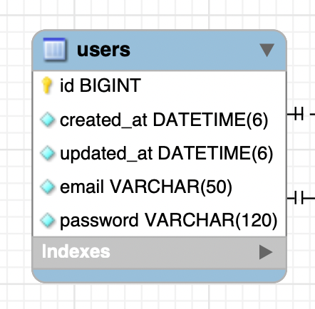
</div>

**Profiles Bounded Context**

<div align="center">
  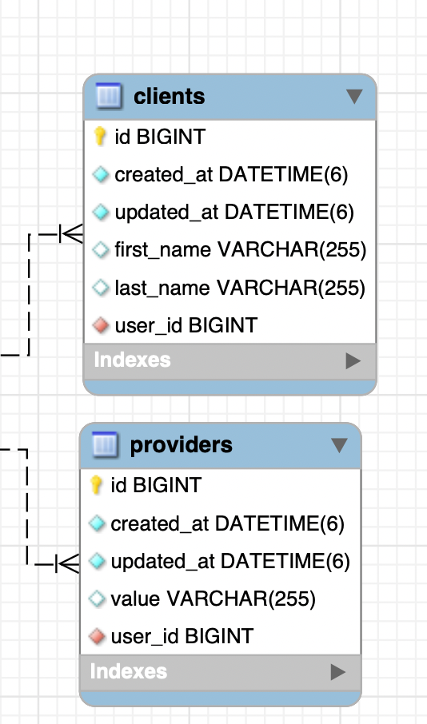
</div>

**Reservations Bounded Context**

<div align="center">
  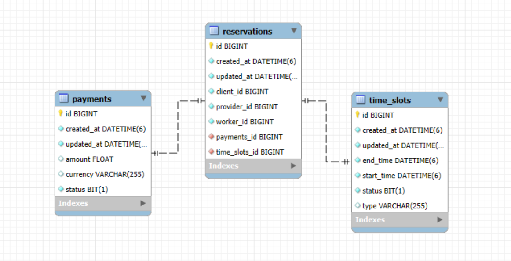
</div>

**Services Bounded Context**

<div align="center">
  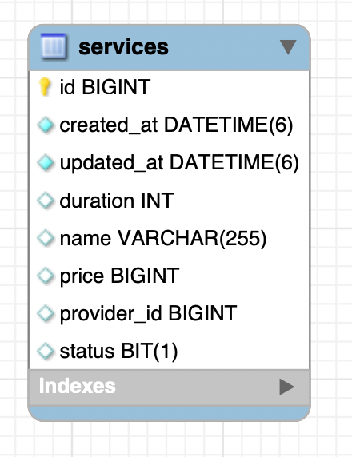
</div>

**Reviews Bounded Context**

<div align="center">
  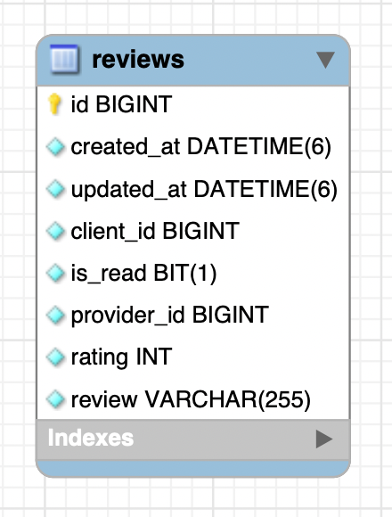
</div>

**Workers Bounded Context**

<div align="center">
  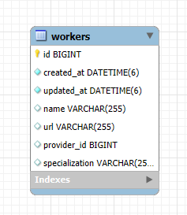
</div>

<div class="page"></div>

# Capítulo V: Product Implementation

En este capítulo se describe la implementación del producto **uTime** por parte de la startup **PaxTech**, abarcando la configuración del entorno de desarrollo, la gestión del código fuente, las convenciones de estilo, la configuración de despliegue y las evidencias de ejecución del Sprint #1, así como los acuerdos de servicio y los enlaces a los productos desplegados.

## 5.1. Software Configuration Management

El equipo ha establecido el siguiente conjunto de herramientas para asegurar una configuración de entorno de desarrollo unificada, que permita una colaboración efectiva y el cumplimiento de los objetivos del proyecto. Estas herramientas cubren las diferentes actividades del ciclo de vida del producto digital.

### 5.1.1. Software Development Environment Configuration

**Project Management**

- **Pivotal Tracker** — herramienta principal para la gestión ágil del proyecto. Permite planificar, organizar y hacer seguimiento del avance de las historias de usuario, tareas y bugs mediante un enfoque basado en historias y priorización colaborativa. Ruta de referencia: <https://www.pivotaltracker.com>
- **Discord** — plataforma para la comunicación en tiempo real entre los miembros del equipo. A través de canales organizados por temas y funciones se realizan reuniones, coordinación diaria y soporte instantáneo durante todo el desarrollo. Ruta de referencia: <https://discord.com>

**Requirements Management**

- **GitHub Issues** — usado para registrar, etiquetar y dar trazabilidad a los requerimientos funcionales y no funcionales junto con los bugs y mejoras detectadas durante el desarrollo. Ruta de referencia: <https://github.com>

**Product UX/UI Design**

- **Figma** — herramienta principal para el diseño de interfaces gráficas (UI) y la experiencia de usuario (UX). Permite que varios miembros colaboren simultáneamente en prototipos interactivos, estructuras visuales y pruebas de diseño. Ruta de referencia: <https://www.figma.com>
- **UXPressia** — complementa el trabajo de UX al permitir la creación y documentación de User Personas, Customer Journey Maps y Empathy Maps, alineando las decisiones de diseño con las necesidades del usuario. Ruta de referencia: <https://uxpressia.com>
- **Trello** — facilita la organización visual de tareas, ideas y flujos de trabajo mediante tableros, listas y tarjetas. Permite priorizar funcionalidades centradas en el usuario y dar seguimiento al progreso. Ruta de referencia: <https://trello.com>

**Software Development**

- **Landing Page:** **HTML5 + CSS3 + Bootstrap**, editada en **WebStorm** y desplegada en GitHub Pages. Es la vitrina comercial del producto y el primer entregable del Sprint #1. Ruta de referencia: <https://www.jetbrains.com/webstorm>
- **Web Frontend (Aplicación Web):** **Angular** (TypeScript) sobre **WebStorm**, conforme a las wireframes y prototipos definidos en §4.6 y §4.7. Brinda al cliente y al administrador del salón el acceso desde navegador a los flujos de búsqueda, reserva, gestión de servicios y panel de control. Ruta de referencia: <https://angular.dev>
- **Mobile App – Cliente:** **Flutter (Dart)** sobre **Android Studio** como IDE; codebase orientado a **Android 7.0 o superior**. Implementa los flujos del segmento de clientes (búsqueda de salones, reserva, pagos, perfil) descritos en §4.4. Ruta de referencia: <https://flutter.dev>
- **Mobile App – Negocio (Salón/Barbería):** **Kotlin nativo** sobre **Android Studio**; codebase Android dedicado a la gestión del salón (agenda, miembros del equipo, servicios, suscripción) descrito en §4.4. Ruta de referencia: <https://kotlinlang.org>
- **Backend / API:** **Spring Boot (Java)** sobre **IntelliJ IDEA Ultimate**. IntelliJ provee soporte avanzado para Java/Kotlin, frameworks modernos y herramientas integradas de base de datos. Ruta de referencia: <https://www.jetbrains.com/idea>
- **Fake API (mocks):** **json-server** sobre **Node.js**, usado durante las primeras iteraciones para desbloquear el desarrollo de la aplicación web y las aplicaciones móviles mientras el backend Spring Boot se construye.
- **Base de datos:** **PostgreSQL** gestionada en **Neon** (servicio cloud serverless), con Spring Data JPA como capa de acceso, conforme al diagrama de despliegue del producto. Ruta de referencia: <https://neon.tech>
- **Procesamiento de pagos:** **Stripe** como pasarela para suscripciones y pagos de reservas (en investigación dentro de la Spike Story 1 del backlog). Ruta de referencia: <https://stripe.com>

**Software Deployment**

- **Git** — sistema de control de versiones para gestionar el historial de cambios. Ruta de referencia: <https://git-scm.com>
- **GitKraken** — cliente Git con interfaz gráfica para gestionar visualmente ramas, commits, conflictos y flujos de trabajo. Ruta de referencia: <https://www.gitkraken.com>
- **GitHub Pages** — hosting estático para desplegar la **Landing Page** y los frontends estáticos. Ruta de referencia: <https://pages.github.com>
- **Render** — plataforma de despliegue para APIs y servicios durante las etapas de desarrollo y pruebas. Ruta de referencia: <https://render.com>
- **Microsoft Azure** — plataforma cloud utilizada para desplegar y escalar el backend Spring Boot mediante **Azure App Service** + base de datos PostgreSQL en Neon. La integración continua se automatiza con **GitHub Actions** apuntando al App Service. Ruta de referencia: <https://azure.microsoft.com>
- **Firebase App Distribution** — usado para distribuir builds internos de las aplicaciones móviles (Flutter del cliente y Kotlin nativo del negocio) al equipo de validación. Ruta de referencia: <https://firebase.google.com>

**Software Documentation**

- **GitHub** — repositorio remoto centralizado, revisiones por Pull Request, registro de incidencias y documentación viva del proyecto. Ruta de referencia: <https://github.com>
- **Swagger / OpenAPI** — para documentar de forma interactiva los endpoints del backend RESTful.

**Software Testing**

- **Gherkin (Cucumber)** — sistema de etiquetado para describir los criterios de aceptación de las historias de usuario bajo el enfoque BDD. Ruta de referencia: <https://cucumber.io/docs/gherkin/>

### 5.1.2. Source Code Management

El proyecto sigue las convenciones del modelo **GitFlow** propuesto por Vincent Driessen en *"A successful Git branching model"*, utilizando **GitHub** como plataforma de control de versiones y colaboración. El proyecto se segmentó en sprints de dos semanas para facilitar entregas incrementales.

**Repositorios de GitHub (organización paxtech-2026-10):**

- Organización del equipo: <https://github.com/paxtech-2026-10>
- Repositorio del informe (este documento): <https://github.com/paxtech-2026-10/utime-project-report>
- Repositorio de la **Landing Page**: <https://github.com/paxtech-2026-10/Landing-Page>
- Repositorio de la **Mobile App – Cliente (Flutter, Android)**: <https://github.com/paxtech-2026-10/Mobile-App>
- Repositorio de la **Mobile App – Negocio (Kotlin nativo, Android)**: <https://github.com/paxtech-2026-10/Ios-Mobile-App>
- Repositorio del **Backend Web Services (Spring Boot)**: <https://github.com/paxtech-2026-10/Web-Services>
- Repositorio de la **Fake API**: <https://github.com/paxtech-2026-10/fake-api>
- Repositorio de **Acceptance Tests (Cucumber + Gherkin)**: <https://github.com/paxtech-2026-10/Acceptance-Tests>

**Flujo GitFlow:**

<div align="center">
  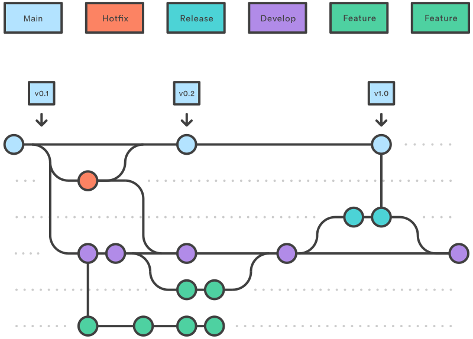
</div>

**Estructura de branches:**

1. **`main`** — rama principal con versiones estables y finales del producto. Solo recibe cambios previamente probados y verificados.
2. **`develop`** — rama de integración del trabajo continuo del equipo; punto de partida de todas las features.
3. **`feature/<nombre>`** — una rama por funcionalidad. Al completarse se fusiona contra `develop` mediante Pull Request.
4. **`release/vX.Y.Z`** — instancia de `develop` próxima a integrarse en `main`. Sigue Semantic Versioning.
5. **`hotfix/<nombre>`** — corrección puntual de errores detectados en `main` que afecten significativamente la experiencia de usuario.

**Versionamiento semántico:** Para nombrar las *Releases* se aplica **Semantic Versioning 2.0.0** (`MAJOR.MINOR.PATCH`).

**Convenciones de Commits (Conventional Commits):**

```
<tipo>(<alcance opcional>): <resumen ≤ 72 caracteres>
```

Tipos permitidos: `feat`, `fix`, `docs`, `style`, `refactor`, `test`, `chore`, `perf`, `build`, `ci`.

### 5.1.3. Source Code Style Guide & Conventions

- **HTML:**
  1. Cerrar todos los elementos.
  2. Usar minúsculas para nombres de elementos y atributos para mantener legibilidad.
  3. Usar comillas dobles cuando los atributos contengan espacios.
  4. Especificar `alt`, `width` y `height` en imágenes para accesibilidad: ``.

- **CSS:**
  1. Nombres de clases breves y autodescriptivos.
  2. Separar nombres de clases e IDs con guiones (`#video-id`, `.hero-shadow`).
  3. No especificar la unidad de medida cuando el valor es `0`.
  4. Separar declaraciones y selectores en líneas distintas para favorecer la legibilidad.

- **JavaScript (Landing):** se siguen las guías de Airbnb JavaScript Style Guide. Uso de `camelCase` para variables y funciones, `PascalCase` para clases, e `kebab-case` para nombres de archivos. La landing utiliza Bootstrap 5 como base de componentes y grid.

- **TypeScript (Angular Web App):** se sigue la **Angular Style Guide oficial**. `kebab-case` para selectores y archivos, `PascalCase` para clases y componentes, `camelCase` para identificadores. Linter `@angular-eslint` con configuración `recommended`.

- **Dart (Flutter):** se sigue la **Effective Dart Style Guide** de la documentación oficial. Nombres de clases en `PascalCase`, identificadores en `camelCase`, archivos y carpetas en `snake_case`. Linter `flutter_lints` activado por defecto.

- **Java (Spring Boot):** se aplica la **Google Java Style Guide**. Indentación de 4 espacios, nombres de clases en `PascalCase`, métodos y variables en `camelCase`, paquetes en minúsculas.

- **Gherkin:** lenguaje específico de dominio para BDD. Se utilizan saltos de línea para separar escenarios y las palabras clave **`Given`**, **`When`**, **`Then`** y **`And`** para estructurar cada criterio de aceptación.

### 5.1.4. Software Deployment Configuration

El despliegue del producto se realiza diferenciando los componentes estáticos de los servicios backend.

**Landing Page (GitHub Pages):**

1. Mantener una carpeta `docs/` que aloje los archivos públicos de la landing.
2. Asegurar la nomenclatura `index.html`, `style.css` y una carpeta `img/` con los recursos.
3. Cargar los archivos al repositorio mediante commits a la rama de despliegue (típicamente `main`).
4. En GitHub: **Settings > Pages** y seleccionar la rama (`main`) y la carpeta `/docs` como fuente.
5. Esperar la verificación de GitHub. Una vez completado, se obtiene una URL pública del tipo `https://<org>.github.io/<repo>/`.

**Web Frontend (Angular):** build de producción con `ng build --configuration production` y publicación del artefacto resultante (carpeta `dist/`) en GitHub Pages o **Azure Static Web Apps** mediante GitHub Actions.

**Mobile App – Cliente (Flutter):** build APK mediante `flutter build apk` y distribución interna al equipo a través de **Firebase App Distribution** para validación funcional sobre Android 7.0+.

**Mobile App – Negocio (Kotlin nativo):** build APK desde **Android Studio** (`./gradlew assembleRelease`) y distribución vía Firebase App Distribution al equipo de validación del segmento de salones.

**Backend (Spring Boot en Azure):** despliegue como **Azure App Service** con base de datos gestionada **PostgreSQL en Neon**. Las variables de entorno (cadena de conexión, secretos JWT, claves externas) se configuran en el panel **Configuration → Application settings** del App Service. La integración continua se automatiza mediante **GitHub Actions** que ejecuta tests, construye el JAR y despliega al App Service en cada push a `main`.

**Mapeo de ambientes a ramas:**

| Ambiente | Rama | Plataforma |
|---|---|---|
| Producción | `main` | GitHub Pages + Azure App Service |
| Staging / Integración | `develop` | Render / Azure (slot de staging) |
| Feature preview | `feature/*` | Local + Render (opcional) |

## 5.2. Product Implementation & Deployment

### 5.2.1. Sprint Backlogs

#### Sprint #1

**Sprint Planning Background**

Dentro del framework Scrum, un Sprint representa un plazo fijo y reducido de tiempo en el que el equipo desarrolla todo el trabajo necesario para alcanzar el objetivo final del proyecto, denominado *Product Goal* (Schwaber & Sutherland, 2020). El Sprint #1 tiene como meta **elaborar una landing page atractiva para uTime que capte la atención de los usuarios visitantes y comunique con claridad los principales beneficios ofrecidos por el producto**.

| Campo | Detalle |
|-------|---------|
| Date | 2026-04-07 |
| Time | 09:00 PM |
| Location | Reunión virtual mediante Discord |
| Prepared By | Oroncoy Almeyda, Alejandro Daniel |
| Attendees | Alejandro Oroncoy, Jorge Yum, Gael Rivera, Natalia Roman y Gabriel Sánchez |
| Sprint N°1 Review Summary | Primer sprint del proyecto; no existe revisión previa. |
| Sprint N°1 Retrospective Summary | Al ser el primer sprint no se cuenta con retrospectiva previa. La retroalimentación y oportunidades de mejora se evaluarán al cierre del sprint. |
| Sprint Goal | **Our focus is on** delivering a functional and engaging landing page for uTime. **We believe it delivers** a clear value proposition and generates user interest and trust in potential customers. **This will be confirmed when** visitors can access the site and interact with all key landing-page sections (services overview, benefits, pricing, testimonials, CTA's and support) on both desktop and mobile devices. |
| Sprint N°1 Velocity | 13 |
| Sum of Story Points | 13 |

**Aspect Leaders and Collaborators (LACX)**

Para mejorar la organización y la comunicación se elaboró la matriz **Leadership and Collaboration Matrix (LACX)**, donde se define quién asume el rol de Líder (**L**) y quiénes participan como Colaboradores (**C**) en cada aspecto clave de la landing page.

| Team Member | Servicios | Beneficios | Planes y Precios | Responsive | Soporte | Testimonios | CTA's |
|---|---|---|---|---|---|---|---|
| Yum Gonzales, Jorge Suin | C | C | C | C | L | C | L |
| Rivera Sosa, Eduardo Gael | C | C | C | L | C | L | C |
| Roman Cruz, Natalia Bertha | L | C | C | C | C | C | C |
| Alejandro Oroncoy | C | L | C | C | C | C | C |
| Gabriel Sánchez | C | C | L | C | C | C | C |

**Sprint Backlog #1**

El equipo gestionó el backlog mediante **Trello**, dividiendo cada user story en tareas manejables y asignándolas según las habilidades de cada integrante. El objetivo del sprint es construir la landing page en su totalidad, logrando que sea atractiva y funcional.

<table>
  <thead>
    <tr><th colspan="8">Sprint # 1</th></tr>
    <tr><th colspan="2">User Story</th><th colspan="6">Work-Item / Task</th></tr>
    <tr>
      <th>Id</th><th>Título</th>
      <th>Id</th><th>Título</th><th>Descripción</th>
      <th>Estimación (hrs)</th><th>Asignado a</th><th>Estado</th>
    </tr>
  </thead>
  <tbody>
    <tr><td rowspan="3">US29</td><td rowspan="3">Visualización general de los servicios</td><td>T1</td><td>Redacción de contenido</td><td>Redactar los textos que describen los servicios ofrecidos.</td><td>2</td><td>Natalia Roman</td><td>Done</td></tr>
    <tr><td>T2</td><td>Maquetación inicial</td><td>Implementar estructuras básicas en HTML/CSS.</td><td>2</td><td>Natalia Roman</td><td>Done</td></tr>
    <tr><td>T3</td><td>Estilización</td><td>Aplicar estilos CSS según el diseño aprobado.</td><td>2</td><td>Natalia Roman</td><td>Done</td></tr>
    <tr><td rowspan="2">US30</td><td rowspan="2">Visualización de beneficios</td><td>T4</td><td>Redacción de beneficios</td><td>Redactar los beneficios principales de la plataforma.</td><td>2</td><td>Alejandro Oroncoy</td><td>Done</td></tr>
    <tr><td>T5</td><td>Diseño gráfico</td><td>Utilizar íconos o elementos visuales para los beneficios.</td><td>1.5</td><td>Alejandro Oroncoy</td><td>Done</td></tr>
    <tr><td rowspan="2">US31</td><td rowspan="2">Planes y precios</td><td>T6</td><td>Redacción de contenido</td><td>Redacción de los planes y precios para mostrar.</td><td>1</td><td>Jorge Yum</td><td>Done</td></tr>
    <tr><td>T7</td><td>Implementación UI</td><td>Codificar la sección de precios y planes.</td><td>2</td><td>Jorge Yum</td><td>Done</td></tr>
    <tr><td>TS06</td><td>Diseño responsive y accesible</td><td>T8</td><td>Diseño responsive</td><td>Ajustar estilos para móviles y tablets.</td><td>2.5</td><td>Natalia Roman</td><td>Done</td></tr>
    <tr><td rowspan="2">US32</td><td rowspan="2">Testimonios</td><td>T9</td><td>Recolección de testimonios</td><td>Buscar testimonios de usuarios anteriores.</td><td>1</td><td>Gael Rivera</td><td>Done</td></tr>
    <tr><td>T10</td><td>Codificación de la sección</td><td>Codificar la sección de testimonios en la landing page.</td><td>2</td><td>Gael Rivera</td><td>Done</td></tr>
    <tr><td rowspan="2">US33</td><td rowspan="2">Call to Action</td><td>T11</td><td>Diseño de botones CTA</td><td>Diseñar visualmente los botones de llamada a la acción.</td><td>0.5</td><td>Jorge Yum</td><td>Done</td></tr>
    <tr><td>T12</td><td>Implementación de botones</td><td>Añadir los botones CTA en secciones clave.</td><td>1</td><td>Jorge Yum</td><td>Done</td></tr>
    <tr><td rowspan="2">US34</td><td rowspan="2">Contacto y soporte</td><td>T13</td><td>Mensaje de contacto</td><td>Escribir el texto base para contacto.</td><td>0.5</td><td>Gabriel Sánchez</td><td>Done</td></tr>
    <tr><td>T14</td><td>Maquetación del formulario</td><td>Implementar el formulario de contacto.</td><td>1.5</td><td>Gabriel Sánchez</td><td>Done</td></tr>
    <tr><td rowspan="3">US01</td><td rowspan="3">Registro de un cliente</td><td>T16</td><td>Maquetado del formulario</td><td>Crear el formulario con campos como nombre, correo y contraseña.</td><td>3</td><td>Alejandro Oroncoy</td><td>Done</td></tr>
    <tr><td>T17</td><td>Validación de campos</td><td>Validar que los campos del formulario estén correctamente llenados.</td><td>2</td><td>Alejandro Oroncoy</td><td>Done</td></tr>
    <tr><td>T18</td><td>Estilo y responsive</td><td>Aplicar diseño responsive y estilos visuales.</td><td>2</td><td>Alejandro Oroncoy</td><td>Done</td></tr>
    <tr><td rowspan="2">US03</td><td rowspan="2">Inicio de sesión</td><td>T22</td><td>Formulario de login</td><td>Crear formulario para correo y contraseña.</td><td>2</td><td>Gael Rivera</td><td>Done</td></tr>
    <tr><td>T23</td><td>Diseño y feedback</td><td>Aplicar estilos y mostrar mensajes de error/éxito.</td><td>2</td><td>Gael Rivera</td><td>Done</td></tr>
    <tr><td rowspan="3">US35</td><td rowspan="3">Información sobre uTime y sus creadores</td><td>T19</td><td>Redacción de contenido</td><td>Explicar quiénes son los creadores (PaxTech).</td><td>2</td><td>Gabriel Sánchez</td><td>Done</td></tr>
    <tr><td>T20</td><td>Perfil del equipo</td><td>Mostrar integrantes de PaxTech.</td><td>2</td><td>Gabriel Sánchez</td><td>Done</td></tr>
    <tr><td>T21</td><td>Diseño de sección</td><td>Maquetar y aplicar estilos a la sección About Us.</td><td>2</td><td>Gabriel Sánchez</td><td>Done</td></tr>
  </tbody>
</table>

**Development Evidence for Sprint Review**

| Repository | Branch | Commit Id | Commit Message | Committed on |
|---|---|---|---|---|
| [Landing-Page](https://github.com/paxtech-2026-10/Landing-Page) | `main` | 6567146 | feat: Update new images about product | 2026-04-20 |
| [Landing-Page](https://github.com/paxtech-2026-10/Landing-Page) | `test1` | be55463 | feat: add video about the product | 2026-04-19 |
| [Landing-Page](https://github.com/paxtech-2026-10/Landing-Page) | `main` | 940fbed | feat: update call to actions redirections | 2026-04-18 |
| [Landing-Page](https://github.com/paxtech-2026-10/Landing-Page) | `main` | 3d75671 | feat: add new images (App movil) | 2026-04-16 |
| [Landing-Page](https://github.com/paxtech-2026-10/Landing-Page) | `main` | 0ec5a60 | feat: add responsive structure | 2026-04-14 |
| [Landing-Page](https://github.com/paxtech-2026-10/Landing-Page) | `main` | efa789e | docs: readme about landing page | 2026-04-10 |
| [Landing-Page](https://github.com/paxtech-2026-10/Landing-Page) | `main` | 28f0edf | feat: initial commit | 2026-04-09 |
| [Landing-Page](https://github.com/paxtech-2026-10/Landing-Page) | `main` | 445c2c0 | Initial commit | 2026-04-08 |

**Testing Suite Evidence for Sprint Review**

Para el Sprint #1, centrado en la landing page estática, el equipo aplicó pruebas manuales de diseño responsive y validación de formularios sobre Chrome y Firefox (desktop + mobile). La suite formal de pruebas automatizadas (Cucumber + Gherkin) ya está esqueletada en el repositorio [Acceptance-Tests](https://github.com/paxtech-2026-10/Acceptance-Tests) con los features de US01–US35 y TS01–TS18, y se conectará a la app móvil Flutter y al backend Spring Boot a partir del Sprint #2.

| Repository | Branch | Commit Id | Commit Message | Committed on |
|---|---|---|---|---|
| [Acceptance-Tests](https://github.com/paxtech-2026-10/Acceptance-Tests) | `main` | bfe550a | feat(user-stories): add Gherkin features for US01–US35 | 2026-04-15 |
| [Acceptance-Tests](https://github.com/paxtech-2026-10/Acceptance-Tests) | `main` | eae2c12 | feat(tech-stories): add Gherkin features for TS01–TS18 | 2026-04-15 |

**Execution Evidence for Sprint Review**

En el Sprint #1 se logró el desarrollo completo de la landing page. A continuación se muestran las secciones implementadas:

- **Home:** primera vista al ingresar; presenta la propuesta de valor de uTime y CTA principal.

  <div align="center">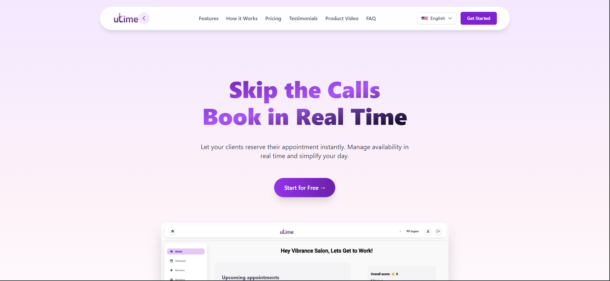</div>

- **Planes y precios:** sección con los planes Free / Pro / Business para los profesionales del sector belleza.

  <div align="center">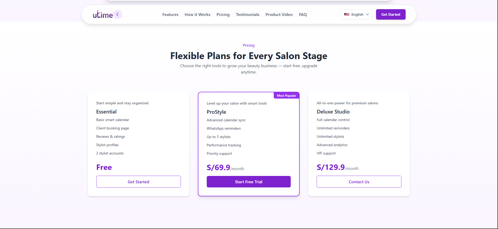</div>

- **Contact Us:** formulario de contacto y soporte para consultas previas al registro.

  <div align="center">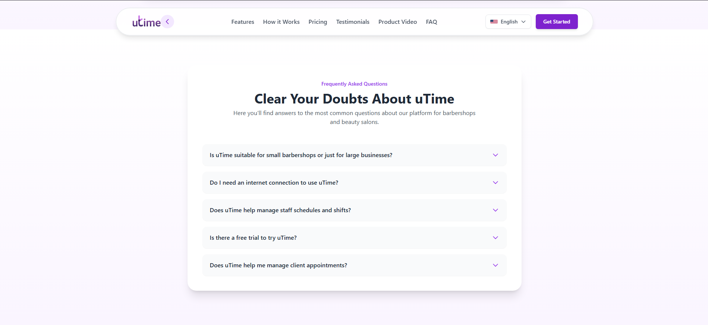</div>

- **Register:** formulario diferenciado para clientes y para salones/barberías.

  <div align="center">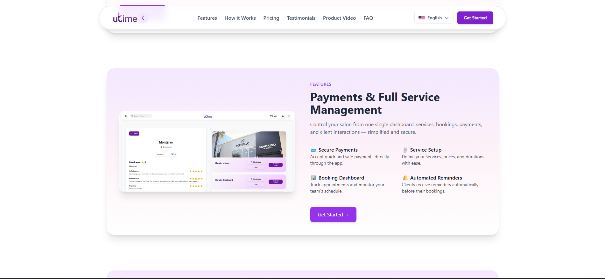</div>

- **Sign In:** acceso de usuarios registrados.

  <div align="center">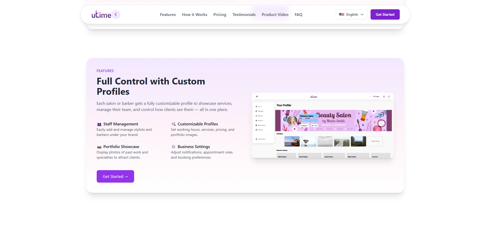</div>

- **About Us:** información acerca de PaxTech y su equipo.

  <div align="center">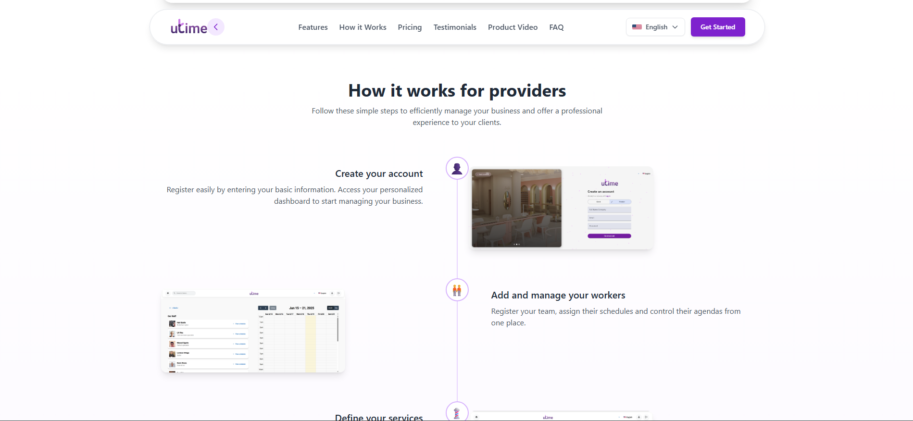</div>

**Services Documentation Evidence for Sprint Review**

El Sprint #1 se enfoca en la landing page estática, por lo que aún no expone endpoints REST propios. Los servicios consumidos son únicamente los de **GitHub Pages** para el hosting estático y un endpoint de prueba para el formulario de contacto que será reemplazado por el backend Spring Boot a partir del Sprint #2.

| Endpoint | HTTP Method | Description | Request Body | Response |
|---|---|---|---|---|
| `/contact` (mock) | POST | Envía el formulario de contacto a un servicio de prueba. | `{ name, email, message }` | `{ status: "ok" }` |

**Software Deployment Evidence for Sprint Review**

La landing page fue publicada en **GitHub Pages** desde el repositorio `paxtech-2026-10/Landing-Page` y se encuentra accesible públicamente en la siguiente URL:

- **Landing Page (live):** <https://paxtech-2026-10.github.io/Landing-Page/>
- **Repositorio:** <https://github.com/paxtech-2026-10/Landing-Page>

El despliegue automático se realiza al hacer push a `main` con la carpeta `/docs` configurada como fuente en *Settings → Pages*.

**Team Collaboration Insights during Sprint**

Durante el Sprint #1 el equipo mantuvo una colaboración constante. La distribución de commits y el grafo de red de GitHub muestran la participación de cada integrante en las distintas features (`feature/sign-in`, `feature/register`, `feature/contact-us`, `feature/about-us`, `feature/pricing`, `feature/indexChanges`).

<div align="center">
  
  <br><br>
  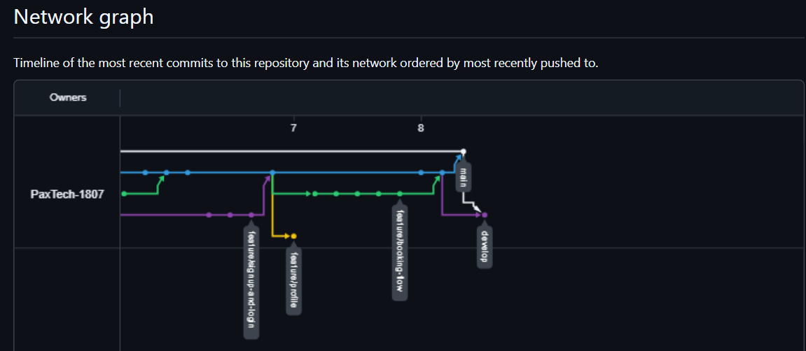
</div>

### 5.2.2. Implemented Landing Page Evidence

<div align="center">

**Landing Page desplegada — uTime**


[Acceder a la Landing Page de uTime](https://paxtech-2026-10.github.io/Landing-Page/) · [Repositorio](https://github.com/paxtech-2026-10/Landing-Page)

</div>

### 5.2.3. Implemented Frontend-Web Application Evidence

<div align="center">

**Aplicación Web — uTime (preview del flujo de reserva)**


[Repositorio Frontend Web (en planificación, Sprint #2)](https://github.com/paxtech-2026-10)

</div>

La **aplicación web** de uTime se construirá con **Angular**, conforme a los wireframes (§4.6.1), wireflows (§4.6.2), mock-ups (§4.6.3) y user-flows (§4.6.4) aprobados en el Capítulo IV. Su flujo principal —selección de estilista → selección de fecha y hora → selección de método de pago— sigue la guía de estilo web detallada en §4.1.2. Para el Sprint #1 se entrega como evidencia la maqueta navegable basada en los mock-ups del Capítulo IV; el desarrollo Angular completo y su despliegue arrancan en el Sprint #2 consumiendo la Fake API y posteriormente el backend Spring Boot.

### 5.2.4. Acuerdo de Servicio - SaaS

**Acuerdo de Nivel de Servicio (SLA) entre PaxTech y el Cliente**

Este documento establece los términos del Acuerdo de Servicio (*SaaS Agreement*) entre **PaxTech** (en adelante, "el Proveedor") y el Cliente suscriptor del servicio **uTime**.

**1. Objeto del acuerdo**

PaxTech provee al Cliente acceso a la plataforma **uTime**, una solución *Software as a Service* (web y móvil) para la gestión de citas en el sector de la belleza, que permite a profesionales independientes y salones administrar disponibilidad, atender reservas y procesar pagos digitales de sus clientes finales.

**2. Disponibilidad del servicio**

El Proveedor garantiza un uptime objetivo del **99.5% mensual**, medido sobre los servicios productivos desplegados en Microsoft Azure. Las ventanas de mantenimiento programado se realizan los **domingos entre 02:00 y 04:00 (GMT-5)** y se notifican con al menos **48 horas** de anticipación al correo de contacto registrado.

**3. Soporte técnico**

- **Canales:** correo electrónico (`soporte@uTime.pe`) y chat in-app dentro del panel del Cliente.
- **Horario:** lunes a viernes de 09:00 a 18:00 (GMT-5).
- **Tiempo de primera respuesta:** 24 horas hábiles.
- **Severidad alta (servicio inoperante):** primera respuesta en 4 horas hábiles y plan de mitigación en 8 horas.

**4. Seguridad y privacidad de datos**

- Cifrado en tránsito mediante **TLS 1.2 o superior** y cifrado en reposo en la base de datos gestionada (**PostgreSQL en Neon**).
- **Backups diarios** con retención de 30 días.
- Cumplimiento con la **Ley de Protección de Datos Personales del Perú (Ley N° 29733)** y su reglamento.
- Los datos del Cliente y de sus usuarios finales son de propiedad exclusiva del Cliente y no son comercializados a terceros.

**5. Planes y precios**

| Plan | Audiencia | Precio referencial | Características clave |
|---|---|---|---|
| Free | Profesional independiente | S/ 0 | Hasta 30 reservas/mes, gestión de calendario básica. |
| Pro | Salones pequeños | S/ 49 / mes | Reservas ilimitadas, dashboard de métricas, soporte por chat. |
| Business | Cadenas / multi-sede | S/ 149 / mes | Multi-sucursal, reportes avanzados, soporte prioritario y SLA reforzado. |

Los precios definitivos serán los publicados en la sección de planes de la landing page de uTime.

**6. Condiciones de cancelación y reembolso**

El Cliente podrá cancelar la suscripción en cualquier momento desde su panel de cuenta. En caso de cancelación durante los **primeros 30 días** desde la contratación de un plan pago, se aplicará un reembolso prorrateado por los días no consumidos. Posterior a ese plazo, no se realizan reembolsos por el periodo en curso, pero el servicio se mantiene activo hasta el final del ciclo facturado.

**7. Vigencia**

El presente acuerdo tiene **vigencia mensual con renovación automática** mientras el Cliente mantenga al día sus obligaciones de pago. Cualquiera de las partes podrá terminar el acuerdo notificándolo con **15 días de anticipación** antes del cierre del ciclo de facturación vigente.

### 5.2.5. Implemented Native-Mobile Application Evidence

<div align="center">

**Aplicación Mobile — uTime**


[Repositorio Mobile-App (Flutter — Cliente)](https://github.com/paxtech-2026-10/Mobile-App) · [Repositorio Ios-Mobile-App (Kotlin nativo — Negocio)](https://github.com/paxtech-2026-10/Ios-Mobile-App)

</div>

uTime se distribuye con dos aplicaciones móviles nativas Android, una por cada segmento de usuario:

- **App Cliente — Flutter (Dart):** cubre los flujos de búsqueda de salones, comparación de servicios y reseñas, agendamiento de cita, pagos y gestión de perfil descritos en §4.4 y §4.5. Se compila desde un único codebase para Android 7.0 o superior.
- **App Negocio — Kotlin nativo:** orientada al dueño/administrador del salón. Cubre la creación del negocio, gestión de equipo, agenda diaria/semanal, administración de servicios (alta, edición, baja) y panel de notificaciones.

Los mock-ups de iOS presentados en §4.5.2 corresponden al diseño visual de referencia; la implementación nativa para iOS queda fuera del alcance del ciclo actual y se evaluará en sprints posteriores. La distribución interna de builds se realiza mediante **Firebase App Distribution**. Su desarrollo intensivo arranca a partir del Sprint #2; la captura mostrada corresponde a la pantalla principal del cliente conforme al prototipo aprobado en §4.5.

### 5.2.6. Implemented RESTful API and/or Serverless Backend Evidence

<div align="center">

**Backend desplegado — uTime**


[Repositorio del Backend Web Services (Spring Boot)](https://github.com/paxtech-2026-10/Web-Services) · [Repositorio Fake API](https://github.com/paxtech-2026-10/fake-api)

</div>

El backend RESTful se construye con **Spring Boot** y persistencia en **PostgreSQL** gestionada en **Neon** (servicio cloud serverless), conforme al diagrama de despliegue. Se expone como un **Azure App Service** y se automatiza mediante **GitHub Actions** que ejecuta tests, construye el JAR y despliega en cada push a `main`. Durante el Sprint #1 se utiliza una **Fake API** basada en `json-server` para desbloquear el desarrollo de la aplicación web (Angular) y de las aplicaciones móviles (Flutter y Kotlin nativo) mientras se completan los bounded contexts del backend definitivo: **IAM, Profiles, Workers, Services, Reservations y Reviews**. La integración de pagos se realizará mediante **Stripe** conforme a la Spike Story 1 del backlog.

### 5.2.7. RESTful API documentation

<div align="center">

**Documentación OpenAPI / Swagger**


[https://github.com/paxtech-2026-10/Web-Services](https://github.com/paxtech-2026-10/Web-Services)

https://paxtech-ashgghgnf7fpfxe9.canadacentral-01.azurewebsites.net/swagger-ui/index.html#/
</div>

La documentación interactiva de la API se genera automáticamente con **springdoc-openapi** y se publica en la ruta `/swagger-ui.html` del servicio backend. Allí se pueden inspeccionar los recursos de Workers, Provider Profiles, Reservations, Services y Reviews, así como ejecutar peticiones de prueba contra cada endpoint.

**Ejemplos de requests por bounded context**

Los siguientes ejemplos fueron tomados de los `Resource` usados por los controllers REST del backend Spring Boot.

**IAM**

`POST /api/v1/authentication/sign-up`

```json
{
  "email": "cliente.demo@utime.com",
  "password": "Password123!"
}
```

`POST /api/v1/authentication/sign-in`

```json
{
  "email": "cliente.demo@utime.com",
  "password": "Password123!"
}
```

**Profiles**

`POST /api/v1/providers`

```json
{
  "companyName": "Barbería Central",
  "userId": 1
}
```

`PUT /api/v1/providers/{id}`

```json
{
  "companyName": "Barbería Central Premium"
}
```

`POST /api/v1/clients`

```json
{
  "firstName": "Camila",
  "lastName": "Cortez",
  "userId": 2
}
```

`PUT /api/v1/clients/{id}`

```json
{
  "firstName": "Camila",
  "lastName": "Cortez",
  "profileImageUrl": "https://cdn.utime.com/profiles/client-2.png"
}
```

`POST /api/v1/provider-profiles`

```json
{
  "providerId": 1,
  "companyName": "Barbería Central",
  "location": "Av. Primavera 123, Lima",
  "email": "contacto@barberiacentral.com",
  "profileImageUrl": "https://cdn.utime.com/profiles/provider-1.png",
  "coverImageUrl": "https://cdn.utime.com/covers/provider-1.png",
  "socials": {
    "instagram": "https://instagram.com/barberiacentral",
    "facebook": "https://facebook.com/barberiacentral"
  },
  "portfolioImages": [
    "https://cdn.utime.com/portfolio/corte-1.png",
    "https://cdn.utime.com/portfolio/corte-2.png"
  ],
  "description": "Especialistas en barbería clásica y moderna.",
  "openTime": "09:00:00",
  "closeTime": "20:00:00"
}
```

`PUT /api/v1/provider-profiles/{id}`

```json
{
  "profileImageUrl": "https://cdn.utime.com/profiles/provider-1-new.png",
  "coverImageUrl": "https://cdn.utime.com/covers/provider-1-new.png",
  "location": "Av. Primavera 456, Lima",
  "companyName": "Barbería Central Premium",
  "socials": {
    "instagram": "https://instagram.com/barberiacentralpremium",
    "tiktok": "https://tiktok.com/@barberiacentral"
  },
  "portfolioImages": [
    "https://cdn.utime.com/portfolio/fade-1.png"
  ],
  "description": "Servicios de barbería, arreglo de barba y tratamientos capilares.",
  "openTime": "10:00:00",
  "closeTime": "21:00:00"
}
```

`POST /api/v1/discounts`

```json
{
  "title": "Descuento de bienvenida",
  "subtitle": "20% para nuevos clientes",
  "content": "Aplica en cortes y barbería durante la primera visita.",
  "discountType": "PERCENTAGE",
  "discountValue": 20,
  "providerProfileId": 1
}
```

`PUT /api/v1/discounts/{id}`

```json
{
  "title": "Descuento de temporada",
  "subtitle": "S/ 15 menos en servicios seleccionados",
  "content": "Promoción válida de lunes a jueves.",
  "discountType": "FIXED_AMOUNT",
  "discountValue": 15
}
```

`POST /api/v1/providerProfiles/{providerProfileId}/socials` / `PUT /api/v1/providerProfiles/{providerProfileId}/socials/{id}`

```json
{
  "socialUrl": "https://instagram.com/barberiacentral",
  "socialIcon": "instagram"
}
```

`POST /api/v1/providerProfiles/{providerProfileId}/portfolio` / `PUT /api/v1/providerProfiles/{providerProfileId}/portfolio/{id}`

```json
{
  "imageUrl": "https://cdn.utime.com/portfolio/corte-clasico.png"
}
```

**Workers**

`POST /api/v1/workers`

```json
{
  "name": "Luis Farfán",
  "specialization": "Barbería y arreglo de barba",
  "photoUrl": "https://cdn.utime.com/workers/luis.png",
  "providerId": 1
}
```

`PUT /api/v1/workers/{workerId}`

```json
{
  "name": "Luis Farfán",
  "specialization": "Cortes urbanos y fade",
  "photoUrl": "https://cdn.utime.com/workers/luis-updated.png",
  "providerId": 1
}
```

**Services**

`POST /api/v1/services`

```json
{
  "name": "Corte clásico",
  "duration": 45,
  "price": 35,
  "status": true,
  "providerId": 1
}
```

`PUT /api/v1/services/{id}`

```json
{
  "name": "Corte clásico premium",
  "duration": 60,
  "price": 50,
  "providerId": 1
}
```

**Reservations**

`POST /api/v1/time-slots`

```json
{
  "startTime": "2026-05-20T09:00:00",
  "endTime": "2026-05-20T09:45:00",
  "status": true,
  "type": "AVAILABLE"
}
```

`POST /api/v1/reservationsDetails`

```json
{
  "clientId": 1,
  "providerId": 1,
  "serviceId": 1,
  "timeSlotId": 1,
  "workerId": 1
}
```

`POST /api/v1/payments`

```json
{
  "amount": 50.0,
  "currency": "PEN",
  "reservationId": 1,
  "clientId": 1
}
```

`POST /api/v1/payments/create-payment-link`

```json
{
  "paymentId": 1,
  "amount": 50.0,
  "currency": "PEN",
  "description": "Reserva de corte clásico"
}
```

`POST /api/v1/payments/webhook`

```http
Stripe-Signature: t=timestamp,v1=signature
Content-Type: application/json
```

```json
{
  "id": "evt_123456789",
  "type": "checkout.session.completed",
  "data": {
    "object": {
      "payment_status": "paid"
    }
  }
}
```

**Reviews**

`POST /api/v1/reviews`

```json
{
  "clientId": 1,
  "providerId": 1,
  "rating": 5,
  "review": "Excelente atención y puntualidad."
}
```

**Requests multipart/form-data**

Los endpoints de carga de imágenes reciben un campo `file` con una imagen (`JPEG`, `PNG`, `WEBP` o `GIF`) de hasta 5MB:

```http
POST /api/v1/clients/{id}/profile-image
POST /api/v1/provider-profiles/{id}/profile-image
POST /api/v1/provider-profiles/{id}/cover-image
POST /api/v1/workers/{workerId}/photo-image
Content-Type: multipart/form-data

file=@imagen.png
```

Los requests `GET` y `DELETE` expuestos por estos controllers no requieren body; reciben sus valores mediante path parameters o query parameters según corresponda.

### 5.2.8. Team Collaboration Insights

<div align="center">

**Actividad de commits del equipo**


</div>

A lo largo del Sprint #1 el equipo mantuvo un ritmo de commits constante con buena distribución entre integrantes. Las features fueron desarrolladas en paralelo y consolidadas en `develop` mediante Pull Requests revisados por al menos un compañero antes del merge, siguiendo el flujo GitFlow descrito en la sección 5.1.2.

## 5.3. Video About-the-Product

En el video *About-the-Product* se presenta **uTime** mostrando sus características principales, funcionalidades y el valor que ofrece a los usuarios. El video incluye una demostración de la aplicación móvil, destacando las funcionalidades clave como la búsqueda de salones, reserva de citas, gestión de perfil y la experiencia de usuario completa que ofrece la plataforma.

<div align="center">

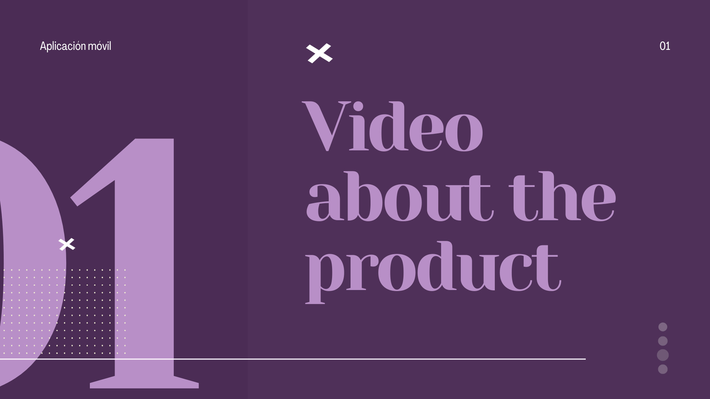

[Ver Video About-the-Product en YouTube](https://youtu.be/7odg_s3aRbs)

</div>

<div class="page"></div>

# Part II: Verification, Validation & Pipeline

<div class="page"></div>

# Capítulo VI: Product Verification & Validation

## 6.1. Testing Suites & Validation

### 6.1.1. Core Entities Unit Tests

Los tests unitarios del proyecto se organizan por **bounded context**. Cada bounded context agrupa los tests de las plataformas que lo implementan (backend Spring Boot, app móvil Flutter para iOS, app móvil Android nativa y frontend web Angular). Cada test sigue la estructura **AAA** (Arrange / Act / Assert) y aísla las dependencias externas mediante mocks o fakes para que cada caso verifique únicamente la unidad bajo prueba.

#### 6.1.1.1. Services Bounded Context

Cobertura del bounded context **Services**: 47 tests distribuidos en 6 archivos (15 backend, 16 Flutter, 9 Android, 7 Angular).

Durante la elaboración del set de tests del backend se descubrieron y corrigieron **dos bugs** en la lógica del bounded context:

1. **`ServiceQueryServiceImpl#handle(GetServicesBySalonIdQuery)`** validaba la existencia del Provider consultando `serviceRepository.existsById(providerId)`, lo cual verifica si existe un *Service* con esa PK en lugar de verificar la existencia del *Provider*. Se corrigió delegando la validación al ACL `ProviderContextFacade` del bounded context Profiles.
2. **`ServiceCommandServiceImpl#handle(UpdateServiceCommand)`** envolvía cualquier excepción de persistencia como `IllegalArgumentException`, ocultando la causa raíz y degradando un fallo de infraestructura (5xx) a un error de cliente (4xx). Se corrigió eliminando el `try/catch` redundante y dejando que las excepciones de JPA propaguen al manejador global.

##### 6.1.1.1.1. Backend — Spring Boot

**Framework:** JUnit 5 + Mockito + AssertJ (incluidos en `spring-boot-starter-test`).

**Ubicación:** `src/test/java/com/paxtech/utime/platform/services/application/internal/`

```java
@ExtendWith(MockitoExtension.class)
class ServiceQueryServiceImplTest {

    @Mock private ServiceRepository serviceRepository;
    @Mock private ProviderContextFacade providerContextFacade;
    @InjectMocks private ServiceQueryServiceImpl serviceQueryService;

    @Test
    @DisplayName("handle(GetBySalonId): throws SalonNotFoundException when the provider does not exist")
    void handleGetBySalonId_throwsSalonNotFound_whenProviderDoesNotExist() {
        // Arrange
        var providerId = new ProviderId(5L);
        when(providerContextFacade.fetchProviderById(5L)).thenReturn(Optional.empty());

        // Act + Assert
        assertThatThrownBy(() -> serviceQueryService.handle(new GetServicesBySalonIdQuery(providerId)))
                .isInstanceOf(SalonNotFoundException.class)
                .hasMessageContaining("5");
    }
}
```

| Test ID | Entidad | Método probado | Resultado esperado | Estado |
|---------|---------|----------------|--------------------|--------|
| BE-CMD-01 | `ServiceCommandServiceImpl` | `handle(CreateServiceCommand)` con nombre único | Persiste el Service y retorna `Optional` no vacío | Passed |
| BE-CMD-02 | `ServiceCommandServiceImpl` | `handle(CreateServiceCommand)` con nombre duplicado por provider | Lanza `IllegalArgumentException` con mensaje "already exists" | Passed |
| BE-CMD-03 | `ServiceCommandServiceImpl` | `handle(DeleteServiceCommand)` cuando el id existe | Invoca `deleteById` sobre el repositorio | Passed |
| BE-CMD-04 | `ServiceCommandServiceImpl` | `handle(DeleteServiceCommand)` cuando el id no existe | Lanza `IllegalArgumentException` con mensaje "does not exist" | Passed |
| BE-CMD-05 | `ServiceCommandServiceImpl` | `handle(DeleteServiceCommand)` cuando el repositorio falla | Envuelve la excepción en `IllegalArgumentException` con mensaje "Error while deleting service" | Passed |
| BE-CMD-06 | `ServiceCommandServiceImpl` | `handle(UpdateServiceCommand)` happy path | Actualiza name/duration/price y deja status/providerId intactos | Passed |
| BE-CMD-07 | `ServiceCommandServiceImpl` | `handle(UpdateServiceCommand)` cuando el id no existe | Lanza `IllegalArgumentException` y no llama a `save` | Passed |
| BE-CMD-08 | `ServiceCommandServiceImpl` | `handle(UpdateServiceCommand)` cuando `save` falla | Propaga la excepción original sin enmascararla | Passed |
| BE-QRY-01 | `ServiceQueryServiceImpl` | `handle(GetAllServicesQuery)` con datos | Retorna la lista completa del repositorio | Passed |
| BE-QRY-02 | `ServiceQueryServiceImpl` | `handle(GetAllServicesQuery)` sin datos | Retorna lista vacía | Passed |
| BE-QRY-03 | `ServiceQueryServiceImpl` | `handle(GetServiceByIdQuery)` cuando el Service existe | Retorna `Optional` con el Service | Passed |
| BE-QRY-04 | `ServiceQueryServiceImpl` | `handle(GetServiceByIdQuery)` cuando no existe | Retorna `Optional.empty()` | Passed |
| BE-QRY-05 | `ServiceQueryServiceImpl` | `handle(GetServicesBySalonIdQuery)` con provider existente | Retorna los Services filtrados por providerId | Passed |
| BE-QRY-06 | `ServiceQueryServiceImpl` | `handle(GetServicesBySalonIdQuery)` con provider sin Services | Retorna lista vacía | Passed |
| BE-QRY-07 | `ServiceQueryServiceImpl` | `handle(GetServicesBySalonIdQuery)` con provider inexistente | Lanza `SalonNotFoundException` (validación vía `ProviderContextFacade`) | Passed |

**Comando de ejecución:**

```bash
./mvnw -Dtest='ServiceCommandServiceImplTest,ServiceQueryServiceImplTest' test
```

**Evidencia de ejecución:**

<div align="center">
  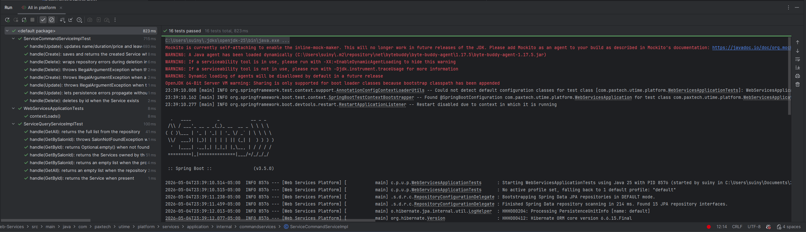
</div>

##### 6.1.1.1.2. Mobile App — Flutter (iOS Mobile App)

**Framework:** `flutter_test` (incluido en el SDK de Flutter, sin dependencias adicionales).

**Ubicación:** `test/features/service/domain/service_test.dart`

```dart
test('returns status=true for the string "active" in any case', () {
  // Arrange
  final json = {
    'id': 1, 'name': 'Haircut', 'duration': 30,
    'price': 50.0, 'providerId': 7, 'status': 'Active',
  };

  // Act
  final service = Service.fromJson(json);

  // Assert
  expect(service.status, isTrue);
});
```

| Test ID | Entidad | Método probado | Resultado esperado | Estado |
|---------|---------|----------------|--------------------|--------|
| FL-01 | `Service` | `fromJson` con `status: true` (bool) | `status == true` | Passed |
| FL-02 | `Service` | `fromJson` con `status: false` (bool) | `status == false` | Passed |
| FL-03 | `Service` | `fromJson` con `status: 0` (num) | `status == false` | Passed |
| FL-04 | `Service` | `fromJson` con `status: 1` (num no-cero) | `status == true` | Passed |
| FL-05 | `Service` | `fromJson` con `status: "TRUE"` (string) | `status == true` (case-insensitive) | Passed |
| FL-06 | `Service` | `fromJson` con `status: "Active"` (string) | `status == true` | Passed |
| FL-07 | `Service` | `fromJson` con `status: "inactive"` (string) | `status == false` | Passed |
| FL-08 | `Service` | `fromJson` sin el campo `status` | Default `status == true` | Passed |
| FL-09 | `Service` | `fromJson` con `status: null` | Default `status == true` | Passed |
| FL-10 | `Service` | `fromJson` con `name: null` | `name == ''` | Passed |
| FL-11 | `Service` | `fromJson` con duration/price/providerId nulos | Defaults numéricos a 0 | Passed |
| FL-12 | `Service` | `fromJson` con tipos numéricos mixtos (int↔double) | Coerción correcta a int/double | Passed |
| FL-13 | `Service` | Roundtrip `toJson` → `fromJson` | Entidad preservada campo por campo | Passed |
| FL-14 | `ServiceRequest` | `toJson` con `status` y `providerId` nulos | JSON omite ambos campos | Passed |
| FL-15 | `ServiceRequest` | `toJson` con `status` y `providerId` presentes | JSON incluye ambos campos | Passed |
| FL-16 | `ServiceRequest` | `fromService(Service)` | Copia todos los campos del Service de origen | Passed |

**Comando de ejecución:**

```bash
flutter test test/features/service/domain/service_test.dart
```

##### 6.1.1.1.3. Mobile App — Android (Kotlin)

**Framework:** JUnit 4 + `kotlinx-coroutines-core` (`runBlocking` para suspend functions). Sin librería de mocks: se usa una implementación fake de `ServiceService`.

**Ubicación:** `app/src/test/java/com/paxtech/mobileapp/features/services/data/service/ServiceRepositoryImplTest.kt`

```kotlin
@Test
fun `searchService returns matching services case-insensitively`() = runBlocking {
    // Arrange
    val payload = listOf(
        dto(id = 1, name = "Haircut", providerId = 1),
        dto(id = 2, name = "MANICURE", providerId = 1),
        dto(id = 3, name = "Pedicure", providerId = 2)
    )
    val repo = ServiceRepositoryImpl(FakeServiceService(Response.success(payload)))

    // Act
    val result = repo.searchService("cure")

    // Assert
    assertEquals(2, result.size)
    assertTrue(result.any { it.name == "MANICURE" })
    assertTrue(result.any { it.name == "Pedicure" })
}
```

| Test ID | Entidad | Método probado | Resultado esperado | Estado |
|---------|---------|----------------|--------------------|--------|
| AN-01 | `ServiceRepositoryImpl` | `searchService` con coincidencias | Retorna los Services filtrados case-insensitive | Passed |
| AN-02 | `ServiceRepositoryImpl` | `searchService` con query vacío | Retorna toda la lista (substring de "" matchea todo) | Passed |
| AN-03 | `ServiceRepositoryImpl` | `searchService` sin coincidencias | Retorna lista vacía | Passed |
| AN-04 | `ServiceRepositoryImpl` | `searchService` con respuesta HTTP 5xx | Retorna lista vacía sin lanzar excepción | Passed |
| AN-05 | `ServiceRepositoryImpl` | `searchService` con body null | Retorna lista vacía | Passed |
| AN-06 | `ServiceRepositoryImpl` | `searchService` mapeo DTO→domain | Cada campo (id/name/duration/price/providerId) se mapea correctamente | Passed |
| AN-07 | `ServiceRepositoryImpl` | `getServiceByProviderId` con coincidencias | Retorna solo los Services cuyo `providerId` matchea | Passed |
| AN-08 | `ServiceRepositoryImpl` | `getServiceByProviderId` sin coincidencias | Retorna lista vacía | Passed |
| AN-09 | `ServiceRepositoryImpl` | `getServiceByProviderId` con respuesta HTTP 5xx | Retorna lista vacía sin lanzar excepción | Passed |

**Comando de ejecución:**

```bash
./gradlew :app:testDebugUnitTest --tests "com.paxtech.mobileapp.features.services.data.service.ServiceRepositoryImplTest" -Pandroid.overridePathCheck=true
```

> El flag `-Pandroid.overridePathCheck=true` es necesario porque la ruta del proyecto contiene caracteres no-ASCII ("Diseño") que AGP 8.13 bloquea por defecto en Windows.

##### 6.1.1.1.4. Frontend Web — Angular

**Framework:** Karma + Jasmine (configuración por defecto del workspace de Angular CLI 19).

**Ubicación:** `src/app/services/services/` (co-localizados con el código de producción según convención de Angular).

```typescript
it('emits a generic error after retrying twice when the backend keeps failing', () => {
  // Arrange
  // BaseService.getAll() pipes retry(2) before catchError; three failures must be flushed.
  let capturedError: Error | undefined;

  // Act
  service.getServices().subscribe({
    next: () => fail('expected an error, got a value'),
    error: err => (capturedError = err)
  });
  for (let attempt = 0; attempt < 3; attempt++) {
    httpMock.expectOne(expectedUrl).flush(null, { status: 500, statusText: 'Internal Server Error' });
  }

  // Assert
  expect(capturedError).toBeDefined();
  expect(capturedError!.message).toContain('Something bad happened');
});
```

| Test ID | Entidad | Método probado | Resultado esperado | Estado |
|---------|---------|----------------|--------------------|--------|
| WEB-01 | `ServiceAssembler` | `toEntityFromResource` con response completa | Mapea todos los campos al Service de dominio | Passed |
| WEB-02 | `ServiceAssembler` | `toEntityFromResource` no leak de referencia | Retorna un objeto distinto al input | Passed |
| WEB-03 | `ServiceAssembler` | `toEntitiesFromResponse` con array vacío | Retorna array vacío | Passed |
| WEB-04 | `ServiceAssembler` | `toEntitiesFromResponse` con N elementos | Mapea cada elemento preservando el orden | Passed |
| WEB-05 | `ServiceApiService` | `getServices()` happy path | GET a `/services` y mapeo vía `ServiceAssembler` | Passed |
| WEB-06 | `ServiceApiService` | `getServices()` con backend vacío | Retorna array vacío | Passed |
| WEB-07 | `ServiceApiService` | `getServices()` con `retry(2)` agotado | Tras 3 fallos consecutivos emite error genérico de `BaseService.handleError` | Passed |

**Comando de ejecución:**

```bash
ng test --configuration=services-only
```

> La configuración `services-only` está definida en `angular.json` → `architect.test.configurations` y restringe el bundle de Karma a los dos archivos de test del bounded context Services. Esto evita que los 71 fallos preexistentes en otros bounded contexts (scaffolds de `ng generate` sin configuración real de TestBed) bloqueen la verificación de la suite que nos compete.

**Evidencia de ejecución:**

<div align="center">
  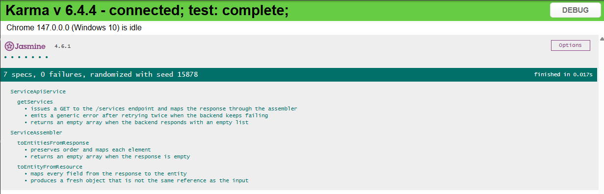
</div>

##### 6.1.1.1.5. Resumen agregado (Services)

| Plataforma | Framework | Tests escritos | Archivos |
|---|---|---|---|
| Backend (Spring Boot) | JUnit 5 + Mockito + AssertJ | 15 | 2 |
| Mobile (Flutter / iOS) | flutter_test | 16 | 1 |
| Mobile (Android / Kotlin) | JUnit 4 | 9 | 1 |
| Frontend Web (Angular) | Karma + Jasmine | 7 | 2 |
| **Total bounded context Services** | | **47** | **6** |

#### 6.1.1.2. Workers Bounded Context

Cobertura del bounded context **Workers**: 37 tests distribuidos en 11 archivos (14 backend, 13 Flutter, 3 Android, 7 Angular).

Durante la elaboración del set de tests del bounded context Workers no se identificaron bugs funcionales adicionales en la lógica implementada.

##### 6.1.1.2.1. Backend — Spring Boot

**Framework:** JUnit 5 + Mockito + AssertJ (incluidos en `spring-boot-starter-test`).

**Ubicación en `Web-Services`:**

- `src/test/java/com/paxtech/utime/platform/workers/application/internal/commandservices/WorkerCommandServiceImplTest.java`
- `src/test/java/com/paxtech/utime/platform/workers/application/internal/queryservices/WorkerQueryServiceImplTest.java`
- `src/test/java/com/paxtech/utime/platform/workers/domain/model/aggregates/WorkerTest.java`

```java
@ExtendWith(MockitoExtension.class)
class WorkerCommandServiceImplTest {

    @Mock
    WorkerRepository workerRepository;

    @Mock
    ProviderContextFacade providerContextFacade;

    @InjectMocks
    WorkerCommandServiceImpl workerCommandService;

    private CreateWorkerCommand validCreateCommand;

    @BeforeEach
    void setUp() {
        validCreateCommand = new CreateWorkerCommand(
                "Ana",
                "Estilista",
                "https://paxtech.examplea.jpg",
                10L
        );
    }

    @Test
    void createWorkerOkTest() {
        // Arrange
        when(workerRepository.existsByNameAndProviderId(any(WorkerName.class), any(ProviderId.class)))
                .thenReturn(false);
        when(providerContextFacade.fetchProviderById(10L)).thenReturn(Optional.of(mock(Provider.class)));

        // Act
        Optional<Worker> result = workerCommandService.handle(validCreateCommand);

        // Assert
        assertThat(result).isPresent();
        ArgumentCaptor<Worker> captor = ArgumentCaptor.forClass(Worker.class);
        verify(workerRepository).save(captor.capture());
        Worker saved = captor.getValue();
        assertThat(saved.getName()).isEqualTo("Ana");
        assertThat(saved.getSalonId()).isEqualTo(10L);
    }

    @Test
    void createWorkerDuplicateTest() {
        // Arrange
        when(workerRepository.existsByNameAndProviderId(any(WorkerName.class), any(ProviderId.class)))
                .thenReturn(true);

        // Act & Assert
        assertThatThrownBy(() -> workerCommandService.handle(validCreateCommand))
                .isInstanceOf(IllegalArgumentException.class)
                .hasMessageContaining("already exists");

        verify(workerRepository, never()).save(any());
        verify(providerContextFacade, never()).fetchProviderById(any());
    }

    @Test
    void createWorkerMissingProviderTest() {
        // Arrange
        when(workerRepository.existsByNameAndProviderId(any(WorkerName.class), any(ProviderId.class)))
                .thenReturn(false);
        when(providerContextFacade.fetchProviderById(10L)).thenReturn(Optional.empty());

        // Act & Assert
        assertThatThrownBy(() -> workerCommandService.handle(validCreateCommand))
                .isInstanceOf(IllegalArgumentException.class)
                .hasMessageContaining("Provider");

        verify(workerRepository, never()).save(any());
    }

    @Test
    void updateWorkerOkTest() {
        // Arrange
        Worker existing = new Worker(validCreateCommand);
        UpdateWorkerCommand command = new UpdateWorkerCommand(1L, "Nuevo", "Barbero", "https://paxtech.examplen.jpg", 10L);
        when(workerRepository.findById(1L)).thenReturn(Optional.of(existing));
        when(workerRepository.save(any(Worker.class))).thenAnswer(invocation -> invocation.getArgument(0));

        // Act
        Optional<Worker> result = workerCommandService.handle(command);

        // Assert
        assertThat(result).isPresent();
        assertThat(result.get().getName()).isEqualTo("Nuevo");
        assertThat(result.get().getSpecialization()).isEqualTo("Barbero");
        verify(workerRepository).save(any(Worker.class));
    }

    @Test
    void updateWorkerNotFoundTest() {
        // Arrange
        UpdateWorkerCommand command = new UpdateWorkerCommand(99L, "X", "Y", "https://paxtech.examplez.jpg", 1L);
        when(workerRepository.findById(99L)).thenReturn(Optional.empty());

        // Act & Assert
        assertThatThrownBy(() -> workerCommandService.handle(command))
                .isInstanceOf(IllegalArgumentException.class)
                .hasMessageContaining("not found");

        verify(workerRepository, never()).save(any());
    }

    @Test
    void deleteWorkerOkTest() {
        // Arrange
        DeleteWorkerCommand command = new DeleteWorkerCommand(5L);
        when(workerRepository.existsById(5L)).thenReturn(true);

        // Act
        workerCommandService.handle(command);

        // Assert
        verify(workerRepository).deleteById(5L);
    }

    @Test
    void deleteWorkerNotFoundTest() {
        // Arrange
        DeleteWorkerCommand command = new DeleteWorkerCommand(5L);
        when(workerRepository.existsById(5L)).thenReturn(false);

        // Act & Assert
        assertThatThrownBy(() -> workerCommandService.handle(command))
                .isInstanceOf(IllegalArgumentException.class)
                .hasMessageContaining("not found");

        verify(workerRepository, never()).deleteById(any());
    }
}
```

| Test ID | Entidad | Método probado | Resultado esperado | Estado |
|---------|---------|----------------|--------------------|--------|
| WRK-BE-01 | `WorkerCommandServiceImpl` | `handle(CreateWorkerCommand)` happy path | Crea worker válido y persiste con `save` | Passed |
| WRK-BE-02 | `WorkerCommandServiceImpl` | `handle(CreateWorkerCommand)` duplicado | Lanza `IllegalArgumentException` y no persiste | Passed |
| WRK-BE-03 | `WorkerCommandServiceImpl` | `handle(CreateWorkerCommand)` provider inexistente | Lanza `IllegalArgumentException` y no persiste | Passed |
| WRK-BE-04 | `WorkerCommandServiceImpl` | `handle(UpdateWorkerCommand)` happy path | Actualiza datos del worker y persiste cambios | Passed |
| WRK-BE-05 | `WorkerCommandServiceImpl` | `handle(UpdateWorkerCommand)` worker inexistente | Lanza `IllegalArgumentException` y no persiste | Passed |
| WRK-BE-06 | `WorkerCommandServiceImpl` | `handle(DeleteWorkerCommand)` happy path | Elimina worker con `deleteById` | Passed |
| WRK-BE-07 | `WorkerCommandServiceImpl` | `handle(DeleteWorkerCommand)` worker inexistente | Lanza `IllegalArgumentException` y no elimina | Passed |
| WRK-BE-08 | `WorkerQueryServiceImpl` | `handle(GetWorkersBySalonIdQuery)` | Retorna lista filtrada por providerId | Passed |
| WRK-BE-09 | `WorkerQueryServiceImpl` | `handle(GetWorkerByIdQuery)` | Retorna `Optional` con worker cuando existe | Passed |
| WRK-BE-10 | `WorkerQueryServiceImpl` | `handle(GetAllWorkersQuery)` | Retorna la lista completa de workers | Passed |
| WRK-BE-11 | `Worker` (aggregate) | constructor por value objects | Inicializa correctamente name/specialization/photoUrl/providerId | Passed |
| WRK-BE-12 | `Worker` (aggregate) | constructor por `CreateWorkerCommand` | Mapea correctamente campos del command al aggregate | Passed |
| WRK-BE-13 | `Worker` (aggregate) | `updateInformation` | Actualiza atributos y retorna la misma instancia (`this`) | Passed |
| WRK-BE-14 | `Worker` (aggregate) | validación de comando inválido | Lanza `IllegalArgumentException` cuando `name` es inválido | Passed |

**Comando de ejecución:**

```bash
./gradlew test \
  --tests "com.paxtech.utime.platform.workers.application.internal.commandservices.WorkerCommandServiceImplTest" \
  --tests "com.paxtech.utime.platform.workers.application.internal.queryservices.WorkerQueryServiceImplTest" \
  --tests "com.paxtech.utime.platform.workers.domain.model.aggregates.WorkerTest"
```

**Evidencia de ejecución:**

<div align="center">
  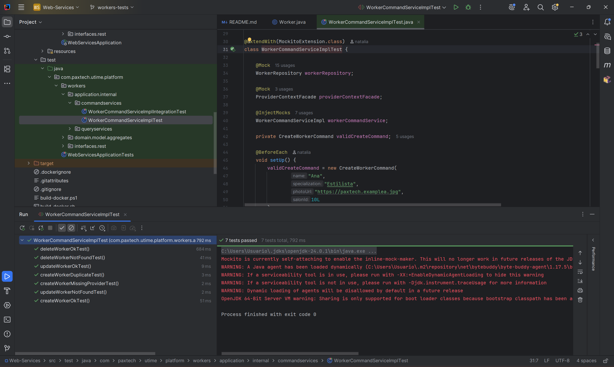
</div>

##### 6.1.1.2.2. Mobile App — Flutter (iOS Mobile App)

**Framework:** `flutter_test` + `bloc_test` + `mocktail`.

**Ubicación en `Ios-Mobile-App`:**

- `test/features/team/domain/worker_test.dart`
- `test/features/team/presentation/blocs/workers_bloc_test.dart`

```dart
blocTest<WorkersBloc, WorkersState>(
  'LoadWorkers filtra por providerId y ordena alfabeticamente',
  build: () {
    when(() => teamService.getWorkers()).thenAnswer(
      (_) async => const <Worker>[
        Worker(id: 1, name: 'zeta', specialization: 'S1', photoUrl: '', providerId: 2),
        Worker(id: 2, name: 'alpha', specialization: 'S2', photoUrl: '', providerId: 2),
        Worker(id: 3, name: 'otro', specialization: 'S3', photoUrl: '', providerId: 7),
      ],
    );
    when(() => onboardingService.getUserId()).thenAnswer((_) async => 44);
    when(() => onboardingService.getJwtToken()).thenAnswer((_) async => 'jwt');
    when(
      () => authService.getProviderByUserId(userId: 44, token: 'jwt'),
    ).thenAnswer((_) async => ProviderResponse(id: 2, companyName: 'Acme', userId: 44));
    return buildBloc();
  },
  act: (bloc) => bloc.add(const LoadWorkers()),
  expect: () => <Matcher>[
    isA<WorkersState>().having((s) => s.status, 'status', WorkersStatus.loading),
    isA<WorkersState>()
        .having((s) => s.status, 'status', WorkersStatus.success)
        .having((s) => s.workers.map((w) => w.name).toList(), 'names', <String>['alpha', 'zeta']),
  ],
);
```

| Test ID | Entidad | Método probado | Resultado esperado | Estado |
|---------|---------|----------------|--------------------|--------|
| WRK-FL-01 | `Worker` | `fromJson` con payload completo | Mapea `id/name/specialization/photoUrl/providerId` correctamente | Passed |
| WRK-FL-02 | `Worker` | `fromJson` con campos opcionales ausentes | Aplica defaults (`''` y `0`) | Passed |
| WRK-FL-03 | `Worker` | `copyWith` parcial | Actualiza solo campos enviados y preserva el resto | Passed |
| WRK-FL-04 | `Worker` | `toJson` | Serializa todos los campos correctamente | Passed |
| WRK-FL-05 | `WorkerRequest` | `fromWorker` con `photoUrl` vacía | Asigna URL por defecto (`https://example.com`) | Passed |
| WRK-FL-06 | `WorkerRequest` | `toJson` con `photoUrl` vacía/espacios | Normaliza a URL por defecto | Passed |
| WRK-FL-07 | `WorkerRequest` | `toJson` con `photoUrl` válida con espacios | Recorta espacios y conserva URL válida | Passed |
| WRK-FL-08 | `WorkersBloc` | `LoadWorkers` con provider resuelto | Filtra por `providerId` y ordena workers alfabéticamente | Passed |
| WRK-FL-09 | `WorkersBloc` | `LoadWorkers` sin `userId` | Retorna lista vacía y evita llamada a `getProviderByUserId` | Passed |
| WRK-FL-10 | `WorkersBloc` | `LoadWorkers` con error en servicio | Emite estado `failure` con mensaje de error | Passed |
| WRK-FL-11 | `WorkersBloc` | `CreateWorkerRequested` | Crea worker, lo inserta en estado y ordena lista | Passed |
| WRK-FL-12 | `WorkersBloc` | `UpdateWorkerRequested` | Reemplaza worker actualizado y mantiene orden alfabético | Passed |
| WRK-FL-13 | `WorkersBloc` | `DeleteWorkerRequested` | Elimina worker por id y limpia `deletingWorkerId` al finalizar | Passed |

**Comando de ejecución:**

```bash
flutter test test/features/team/domain/worker_test.dart test/features/team/presentation/blocs/workers_bloc_test.dart
```

##### 6.1.1.2.3. Mobile App — Android (Kotlin)

**Framework:** JUnit 4 + `kotlin.test` + `kotlinx-coroutines-core` (`runBlocking`), usando fake de `WorkerService` (sin libreria de mocks).

**Ubicación:** `app/src/test/java/com/paxtech/mobileapp/features/clientDashboard/data/repository/WorkerRepositoryImplTest.kt`

```kotlin
@Test
fun getAllWorkersWhenResponseIsSuccessful() = runBlocking {
    val dtos = listOf(
        WorkerDto(
            id = 1L,
            name = "Ana Lopez",
            specialization = "Maquillista",
            photoUrl = "https://example.com/ana.jpg",
            providerId = 10L
        ),
        WorkerDto(
            id = 2L,
            name = "Luis Perez",
            specialization = null,
            photoUrl = null,
            providerId = 20L
        )
    )
    val repository = WorkerRepositoryImpl(FakeWorkerService(allWorkersResponse = Response.success(dtos)))

    val result = repository.getAllWorkers()

    assertTrue(result.isSuccess)
    assertEquals(
        listOf(
            Worker(1L, "Ana Lopez", "Maquillista", "https://example.com/ana.jpg", 10L),
            Worker(2L, "Luis Perez", null, null, 20L)
        ),
        result.getOrNull()
    )
}
```

| Test ID | Entidad | Metodo probado | Resultado esperado | Estado |
|---------|---------|----------------|--------------------|--------|
| WRK-AN-01 | `WorkerRepositoryImpl` | `getAllWorkers()` con respuesta HTTP 200 y payload valido | Retorna `Result.success` y mapea DTO -> dominio correctamente | Passed |
| WRK-AN-02 | `WorkerRepositoryImpl` | `getAllWorkers()` con respuesta HTTP no exitosa (404) | Retorna `Result.failure` con mensaje `HTTP 404` | Passed |
| WRK-AN-03 | `WorkerRepositoryImpl` | `getAllWorkers()` cuando el servicio lanza excepcion de red | Retorna `Result.failure` propagando `IOException` | Passed |

**Comando de ejecucion:**

```bash
./gradlew :app:testDebugUnitTest --tests "com.paxtech.mobileapp.features.clientDashboard.data.repository.WorkerRepositoryImplTest" -Pandroid.overridePathCheck=true
```

##### 6.1.1.2.4. Frontend Web — Angular

**Framework:** Karma + Jasmine (Angular TestBed + HttpClientTestingModule).

**Ubicacion en `Frontend-Web-Application`:**

- `src/app/dashboard/models/worker.entity.spec.ts`
- `src/app/dashboard/services/worker.assembler.spec.ts`
- `src/app/dashboard/services/worker-api.service.spec.ts`
- `src/app/dashboard/components/staff-item/staff-item.component.spec.ts`
- `src/app/dashboard/components/staff-list/staff-list.component.spec.ts`

```typescript
it('should fetch workers from api and map response', () => {
  const response: WorkerResource[] = [
    {
      id: 1,
      name: 'Andrea',
      specialization: 'Nails',
      photoUrl: 'https://example.com/a.jpg',
      providerId: 3
    }
  ];

  service.getWorkers().subscribe((workers) => {
    expect(workers).toEqual(response);
  });

  const req = httpMock.expectOne(`${environment.serverBaseUrl}/workers`);
  expect(req.request.method).toBe('GET');
  req.flush(response);
});
```

| Test ID | Entidad | Metodo probado | Resultado esperado | Estado |
|---------|---------|----------------|--------------------|--------|
| WRK-WEB-01 | `Worker` | constructor por defecto | Inicializa `id/providerId` en `0` y strings en `''` | Passed |
| WRK-WEB-02 | `WorkerAssembler` | `toEntityFromResource` | Mapea un `WorkerResource` a entidad `Worker` sin perdida de campos | Passed |
| WRK-WEB-03 | `WorkerAssembler` | `toEntitiesFromResponse` | Mapea lista de resources preservando cantidad y contenido | Passed |
| WRK-WEB-04 | `WorkerApiService` | instancia del servicio | Se crea correctamente en TestBed | Passed |
| WRK-WEB-05 | `WorkerApiService` | `getWorkers()` | Ejecuta `GET /workers` y retorna respuesta mapeada | Passed |
| WRK-WEB-06 | `StaffItemComponent` | render de worker | Muestra nombre, especializacion e imagen del worker | Passed |
| WRK-WEB-07 | `StaffListComponent` | render de lista | Renderiza un `app-staff-item` por cada worker recibido | Passed |

**Comando de ejecucion:**

```bash
ng test --include="src/app/dashboard/models/worker.entity.spec.ts" --include="src/app/dashboard/services/worker.assembler.spec.ts" --include="src/app/dashboard/services/worker-api.service.spec.ts" --include="src/app/dashboard/components/staff-item/staff-item.component.spec.ts" --include="src/app/dashboard/components/staff-list/staff-list.component.spec.ts"
```

**Evidencia de ejecución:**

<div align="center">
  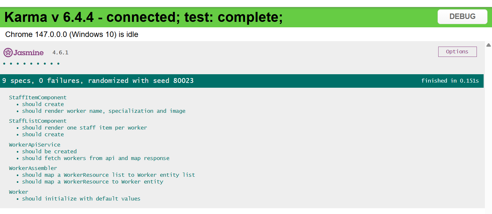
</div>

##### 6.1.1.2.5. Resumen agregado (Workers)

| Plataforma | Framework | Tests escritos | Archivos |
|---|---|---|---|
| Backend (Spring Boot) | JUnit 5 + Mockito + AssertJ | 14 | 3 |
| Mobile (Flutter / iOS) | flutter_test + bloc_test + mocktail | 13 | 2 |
| Mobile (Android / Kotlin) | JUnit 4 + kotlin.test | 3 | 1 |
| Frontend Web (Angular) | Karma + Jasmine | 7 | 5 |
| **Total bounded context Workers** | | **37** | **11** |

#### 6.1.1.3. IAM Bounded Context

Cobertura del bounded context **IAM**: 25 tests distribuidos en 7 archivos (5 backend, 5 Flutter, 7 Android, 8 Angular). El alcance de la prueba unitaria se centra en el aggregate root `User` y en las clases de transporte (`SignUpResponse`, `SignInResponse`, `ProviderResponse`) y modelos de dominio (`User`, `Client`) con los que cada plataforma representa la identidad del usuario una vez autenticado.

Durante la elaboración del set de tests del bounded context IAM no se identificaron bugs funcionales adicionales en la lógica implementada.

##### 6.1.1.3.1. Backend — Spring Boot

**Framework:** JUnit 5 (incluido en `spring-boot-starter-test`).

**Ubicación en `Web-Services`:**

- `src/test/java/com/paxtech/utime/platform/iam/domain/model/aggregates/UserTest.java`

```java
class UserTest {

    @Test
    void shouldCreateUserWithEmailAndPassword() {
        User user = new User("test@paxtech.com", "securePassword123");

        assertEquals("test@paxtech.com", user.getEmail());
        assertEquals("securePassword123", user.getPassword());
    }

    @Test
    void shouldUpdateEmailUsingSetter() {
        User user = new User("old@paxtech.com", "password");

        user.setEmail("new@paxtech.com");

        assertEquals("new@paxtech.com", user.getEmail());
    }
}
```

| Test ID | Entidad | Método probado | Resultado esperado | Estado |
|---------|---------|----------------|--------------------|--------|
| IAM-BE-01 | `User` (aggregate) | constructor con email y password | Inicializa los dos campos del aggregate correctamente | Passed |
| IAM-BE-02 | `User` (aggregate) | constructor por defecto (JPA) | Devuelve un `User` con `email` y `password` en `null` | Passed |
| IAM-BE-03 | `User` (aggregate) | `setEmail` (Lombok `@Setter`) | Reemplaza el email previo por el nuevo valor | Passed |
| IAM-BE-04 | `User` (aggregate) | `setPassword` (Lombok `@Setter`) | Reemplaza el password previo por el nuevo valor | Passed |
| IAM-BE-05 | `User` (aggregate) | aislamiento entre instancias | Dos `User` distintos no comparten estado interno | Passed |

**Comando de ejecución:**

```bash
./mvnw test -Dtest="UserTest"
```

**Evidencia de ejecución:**

<div align="center">
  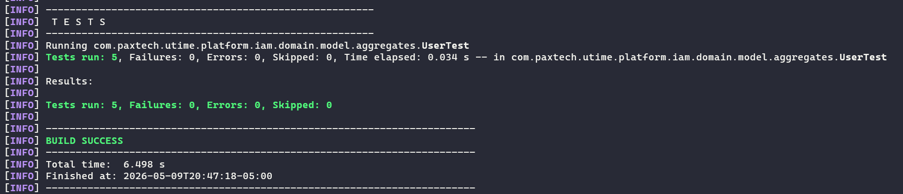
</div>

##### 6.1.1.3.2. Mobile App — Flutter (iOS Mobile App)

**Framework:** `flutter_test` (incluido en el SDK de Flutter, sin dependencias adicionales).

**Ubicación en `Ios-Mobile-App`:**

- `test/features/auth/auth_responses_test.dart`

```dart
group('SignInResponse', () {
  test('parses id, email and token from JSON', () {
    final json = {
      'id': 12,
      'email': 'gael@paxtech.com',
      'token': 'jwt.token.here',
    };

    final response = SignInResponse.fromJson(json);

    expect(response.id, 12);
    expect(response.email, 'gael@paxtech.com');
    expect(response.token, 'jwt.token.here');
  });
});
```

| Test ID | Entidad | Método probado | Resultado esperado | Estado |
|---------|---------|----------------|--------------------|--------|
| IAM-FL-01 | `SignUpResponse` | `fromJson` con payload válido | Mapea `id` y `email` correctamente | Passed |
| IAM-FL-02 | `SignUpResponse` | `fromJson` sin campo requerido | Lanza `TypeError` (cast inválido) | Passed |
| IAM-FL-03 | `SignInResponse` | `fromJson` con `id`, `email` y `token` | Mapea los tres campos correctamente | Passed |
| IAM-FL-04 | `SignInResponse` | `fromJson` con `token` nulo | Lanza `TypeError` por contrato non-null | Passed |
| IAM-FL-05 | `ProviderResponse` | `fromJson` con payload de provider | Mapea `id`, `companyName` y `userId` | Passed |

**Comando de ejecución:**

```bash
flutter test test/features/auth/auth_responses_test.dart
```

##### 6.1.1.3.3. Mobile App — Android (Kotlin)

**Framework:** JUnit 4 (configuración por defecto del scaffolding Android).

**Ubicación en `Mobile-App`:**

- `app/src/test/java/com/paxtech/mobileapp/features/authentication/domain/models/UserTest.kt`
- `app/src/test/java/com/paxtech/mobileapp/features/authentication/domain/models/ClientTest.kt`

```kotlin
class UserTest {

    @Test
    fun `data class equality should be based on values`() {
        val a = User(id = 1, email = "a@paxtech.com")
        val b = User(id = 1, email = "a@paxtech.com")
        val c = User(id = 2, email = "a@paxtech.com")

        assertEquals(a, b)
        assertEquals(a.hashCode(), b.hashCode())
        assertNotEquals(a, c)
    }

    @Test
    fun `copy should override only specified fields`() {
        val original = User(id = 1, email = "old@paxtech.com")

        val updated = original.copy(email = "new@paxtech.com")

        assertEquals(1, updated.id)
        assertEquals("new@paxtech.com", updated.email)
    }
}
```

| Test ID | Entidad | Método probado | Resultado esperado | Estado |
|---------|---------|----------------|--------------------|--------|
| IAM-AN-01 | `User` (data class) | constructor con `id`, `email` y `token` | Expone los tres campos sin transformación | Passed |
| IAM-AN-02 | `User` (data class) | constructor sin `token` | `token` adopta el valor por defecto `null` | Passed |
| IAM-AN-03 | `User` (data class) | `equals` y `hashCode` generados | Igualdad estructural por valor de los campos | Passed |
| IAM-AN-04 | `User` (data class) | `copy(email = …)` | Retorna copia con sólo el campo modificado | Passed |
| IAM-AN-05 | `Client` (data class) | constructor con todos los campos | Expone `id`, `firstName`, `lastName`, `userId` | Passed |
| IAM-AN-06 | `Client` (data class) | `equals` por valor | Dos `Client` con mismos campos son iguales | Passed |
| IAM-AN-07 | `Client` (data class) | `copy(firstName = …)` | Cambia `firstName` y conserva el resto | Passed |

**Comando de ejecución:**

```bash
./gradlew :app:testDebugUnitTest \
  --tests "com.paxtech.mobileapp.features.authentication.domain.models.UserTest" \
  --tests "com.paxtech.mobileapp.features.authentication.domain.models.ClientTest" \
  -Pandroid.overridePathCheck=true
```

##### 6.1.1.3.4. Frontend Web — Angular

**Framework:** Karma + Jasmine (configuración por defecto del workspace de Angular CLI 19).

**Ubicación en `Frontend-Web-Application`:**

- `src/app/iam/model/account.entity.spec.ts`
- `src/app/iam/model/client.entity.spec.ts`
- `src/app/iam/model/provider.entity.spec.ts`

```typescript
describe('AccountEntity', () => {
  it('should allow assigning fields after construction', () => {
    const account = new AccountEntity();

    account.id = 42;
    account.email = 'gael@paxtech.com';
    account.passwordHash = 'hashed';
    account.type = 'client';
    account.isActive = true;

    expect(account.id).toBe(42);
    expect(account.email).toBe('gael@paxtech.com');
    expect(account.isActive).toBeTrue();
  });
});
```

| Test ID | Entidad | Método probado | Resultado esperado | Estado |
|---------|---------|----------------|--------------------|--------|
| IAM-WEB-01 | `AccountEntity` | constructor por defecto | Inicializa numéricos en `0`, strings en `''` y `isActive` en `false` | Passed |
| IAM-WEB-02 | `AccountEntity` | asignación de campos | Permite mutar todos los atributos públicos tras la construcción | Passed |
| IAM-WEB-03 | `AccountEntity` | aislamiento entre instancias | Dos `AccountEntity` no comparten estado | Passed |
| IAM-WEB-04 | `Client` | constructor por defecto | Inicializa `id/userId` en `0` y nombres en `''` | Passed |
| IAM-WEB-05 | `Client` | asignación de campos | Permite actualizar `firstName/lastName/userId` | Passed |
| IAM-WEB-06 | `Provider` | constructor por defecto | Inicializa `id/userId` en `0` y `companyName` en `''` | Passed |
| IAM-WEB-07 | `Provider` | asignación de campos | Permite actualizar `id/companyName/userId` | Passed |
| IAM-WEB-08 | `Provider` | aislamiento entre instancias | Dos `Provider` no comparten `companyName` | Passed |

**Comando de ejecución:**

```bash
ng test --include="src/app/iam/model/account.entity.spec.ts" --include="src/app/iam/model/client.entity.spec.ts" --include="src/app/iam/model/provider.entity.spec.ts"
```

**Evidencia de ejecución:**

<div align="center">
  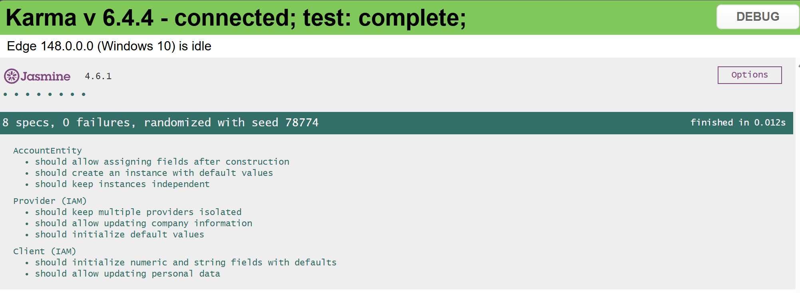
</div>

##### 6.1.1.3.5. Resumen agregado (IAM)

| Plataforma | Framework | Tests escritos | Archivos |
|---|---|---|---|
| Backend (Spring Boot) | JUnit 5 | 5 | 1 |
| Mobile (Flutter / iOS) | flutter_test | 5 | 1 |
| Mobile (Android / Kotlin) | JUnit 4 | 7 | 2 |
| Frontend Web (Angular) | Karma + Jasmine | 8 | 3 |
| **Total bounded context IAM** | | **25** | **7** |

#### 6.1.1.4. Profiles Bounded Context

Cobertura del bounded context **Profiles**: 66 tests distribuidos en 14 archivos (41 backend, 9 Flutter, 6 Android, 10 Angular). La suite cubre los aggregates `Client`, `Provider`, `ProviderProfile`, `Discount`, `PortfolioImage` y `Social`; los value objects `FullName` y `CompanyName`; y los modelos de presentación que cada cliente expone para perfilar al usuario.

Durante la elaboración del set de tests del bounded context Profiles no se identificaron bugs funcionales adicionales en la lógica implementada. La suite sí endurece los invariantes ya escritos en los aggregates: longitud máxima de URLs, no-nullability de nombres, rango válido de descuentos porcentuales y caps en descuentos por monto fijo.

##### 6.1.1.4.1. Backend — Spring Boot

**Framework:** JUnit 5 (incluido en `spring-boot-starter-test`).

**Ubicación en `Web-Services`:**

- `src/test/java/com/paxtech/utime/platform/profiles/domain/model/aggregates/ClientTest.java`
- `src/test/java/com/paxtech/utime/platform/profiles/domain/model/aggregates/ProviderTest.java`
- `src/test/java/com/paxtech/utime/platform/profiles/domain/model/aggregates/ProviderProfileTest.java`
- `src/test/java/com/paxtech/utime/platform/profiles/domain/model/aggregates/DiscountTest.java`
- `src/test/java/com/paxtech/utime/platform/profiles/domain/model/aggregates/PortfolioImageTest.java`
- `src/test/java/com/paxtech/utime/platform/profiles/domain/model/aggregates/SocialTest.java`
- `src/test/java/com/paxtech/utime/platform/profiles/domain/model/valueobjects/FullNameTest.java`
- `src/test/java/com/paxtech/utime/platform/profiles/domain/model/valueobjects/CompanyNameTest.java`

```java
class DiscountTest {

    @Test
    void shouldCalculateFinalPriceAfterPercentage() {
        Discount discount = new Discount(percentageCommand(), providerProfile());

        BigDecimal finalPrice = discount.calculateFinalPrice(new BigDecimal("100"));

        assertEquals(0, finalPrice.compareTo(new BigDecimal("80")));
    }

    @Test
    void shouldCapFixedAmountAtOriginalPrice() {
        Discount discount = new Discount(fixedCommand(new BigDecimal("50")), providerProfile());

        BigDecimal amount = discount.calculateDiscountAmount(new BigDecimal("30"));

        assertEquals(0, amount.compareTo(new BigDecimal("30")));
        assertEquals(0, discount.calculateFinalPrice(new BigDecimal("30")).compareTo(BigDecimal.ZERO));
    }

    @Test
    void shouldRejectPercentageGreaterThan100() {
        ProviderProfile profile = providerProfile();

        assertThrows(IllegalArgumentException.class, () -> new Discount(
                new CreateDiscountCommand("t", "s", "c",
                        DiscountType.PERCENTAGE, new BigDecimal("150"), 1L),
                profile));
    }
}
```

| Test ID | Entidad | Método probado | Resultado esperado | Estado |
|---------|---------|----------------|--------------------|--------|
| PRF-BE-01 | `Client` | constructor por `CreateClientCommand` | Mapea `firstName/lastName` y enlaza el `User` recibido | Passed |
| PRF-BE-02 | `Client` | `updateFullName(firstName, lastName)` | Reemplaza el value object `FullName` con los nuevos valores | Passed |
| PRF-BE-03 | `Client` | `updateFullName` con `firstName` en blanco | Lanza `IllegalArgumentException` y no muta el aggregate | Passed |
| PRF-BE-04 | `Client` | `updateFullName` con `lastName` nulo | Lanza `IllegalArgumentException` y no muta el aggregate | Passed |
| PRF-BE-05 | `Client` | `updateProfileImageUrl` | Persiste la URL de imagen recibida | Passed |
| PRF-BE-06 | `Provider` | constructor por `CreateProviderCommand` | Mapea `companyName` y enlaza el `User` recibido | Passed |
| PRF-BE-07 | `Provider` | `updateCompanyName` happy path | Reemplaza el value object `CompanyName` | Passed |
| PRF-BE-08 | `Provider` | `updateCompanyName` con valor en blanco | Lanza `IllegalArgumentException` | Passed |
| PRF-BE-09 | `Provider` | `updateCompanyName` con `null` | Lanza `IllegalArgumentException` | Passed |
| PRF-BE-10 | `ProviderProfile` | constructor por `CreateProviderProfileCommand` | Inicializa los siete campos del aggregate | Passed |
| PRF-BE-11 | `ProviderProfile` | `updateInformation` parcial (solo algunos campos) | Sobrescribe únicamente los campos provistos y conserva el resto | Passed |
| PRF-BE-12 | `ProviderProfile` | setters dedicados (`updateDescription`, `updateOpenTime`, …) | Cada setter modifica exclusivamente su campo objetivo | Passed |
| PRF-BE-13 | `ProviderProfile` | constructor por defecto (JPA) | Inicializa todos los campos en `null` | Passed |
| PRF-BE-14 | `Discount` | constructor con descuento porcentual válido | Persiste título, tipo y valor del descuento | Passed |
| PRF-BE-15 | `Discount` | `calculateDiscountAmount` con porcentaje | Aplica `(value/100) * originalPrice` con escala 4 y `HALF_UP` | Passed |
| PRF-BE-16 | `Discount` | `calculateFinalPrice` con porcentaje | Resta el descuento al precio original | Passed |
| PRF-BE-17 | `Discount` | `calculateDiscountAmount` con monto fijo > original | Capa el descuento al precio original (no entrega negativos) | Passed |
| PRF-BE-18 | `Discount` | constructor con porcentaje > 100 | Lanza `IllegalArgumentException` | Passed |
| PRF-BE-19 | `Discount` | `calculateDiscountAmount` con precio ≤ 0 | Lanza `IllegalArgumentException` | Passed |
| PRF-BE-20 | `Discount` | `update(UpdateDiscountCommand)` happy path | Sobrescribe título, subtítulo, contenido y valor | Passed |
| PRF-BE-21 | `Discount` | `update` con porcentaje > 100 | Lanza `IllegalArgumentException` | Passed |
| PRF-BE-22 | `PortfolioImage` | constructor con URL válida | Persiste la URL recibida | Passed |
| PRF-BE-23 | `PortfolioImage` | constructor con URL `null` | Lanza `IllegalArgumentException` | Passed |
| PRF-BE-24 | `PortfolioImage` | constructor con URL en blanco | Lanza `IllegalArgumentException` | Passed |
| PRF-BE-25 | `PortfolioImage` | constructor con URL > 200 caracteres | Lanza `IllegalArgumentException` | Passed |
| PRF-BE-26 | `PortfolioImage` | `update` con URL nueva | Reemplaza la URL anterior | Passed |
| PRF-BE-27 | `PortfolioImage` | `update` con URL inválida | Lanza `IllegalArgumentException` y no muta | Passed |
| PRF-BE-28 | `Social` | constructor con URL e ícono válidos | Persiste ambos atributos | Passed |
| PRF-BE-29 | `Social` | constructor con URL en blanco | Lanza `IllegalArgumentException` | Passed |
| PRF-BE-30 | `Social` | constructor con ícono en blanco | Lanza `IllegalArgumentException` | Passed |
| PRF-BE-31 | `Social` | constructor con URL > 100 caracteres | Lanza `IllegalArgumentException` | Passed |
| PRF-BE-32 | `Social` | constructor con ícono > 32 caracteres | Lanza `IllegalArgumentException` | Passed |
| PRF-BE-33 | `Social` | `update(UpdateSocialCommand)` | Reemplaza URL e ícono | Passed |
| PRF-BE-34 | `FullName` (VO) | composición `getFullName()` | Concatena `firstName + " " + lastName` | Passed |
| PRF-BE-35 | `FullName` (VO) | `getFullName()` con ambos `null` | Retorna cadena vacía | Passed |
| PRF-BE-36 | `FullName` (VO) | `getFullName()` con `firstName` `null` | Retorna sólo `lastName` | Passed |
| PRF-BE-37 | `FullName` (VO) | `getFullName()` con `lastName` `null` | Retorna sólo `firstName` | Passed |
| PRF-BE-38 | `FullName` (VO) | igualdad estructural | Dos `FullName` con mismos valores son iguales y comparten `hashCode` | Passed |
| PRF-BE-39 | `CompanyName` (VO) | constructor con valor | Expone el valor recibido vía `getValue()` | Passed |
| PRF-BE-40 | `CompanyName` (VO) | constructor por defecto (JPA) | `getValue()` retorna `null` | Passed |
| PRF-BE-41 | `CompanyName` (VO) | igualdad estructural | Dos `CompanyName` iguales comparten `hashCode` | Passed |

**Comando de ejecución:**

```bash
./mvnw test -Dtest="ClientTest,ProviderTest,ProviderProfileTest,DiscountTest,PortfolioImageTest,SocialTest,FullNameTest,CompanyNameTest"
```

**Evidencia de ejecución:**

<div align="center">
  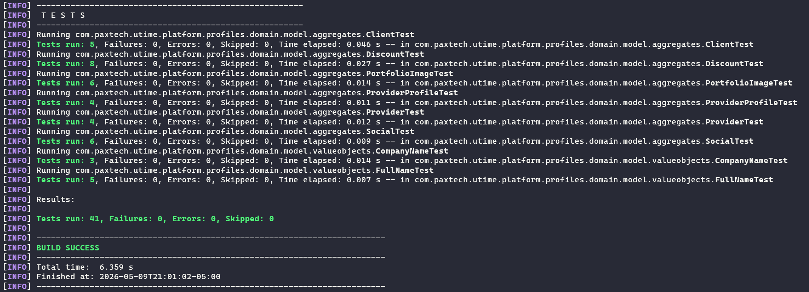
</div>


##### 6.1.1.4.2. Mobile App — Flutter (iOS Mobile App)

**Framework:** `flutter_test` (incluido en el SDK de Flutter, sin dependencias adicionales).

**Ubicación en `Ios-Mobile-App`:**

- `test/features/profile/providerProfile_test.dart`

```dart
test('toUpdateJson should expose only mutable fields', () {
  final profile = ProviderProfile(
    id: 1,
    providerId: 10,
    companyName: 'Pax Salon',
    location: 'Lima',
    profileImageUrl: 'https://cdn/p.png',
    coverImageUrl: 'https://cdn/c.png',
    description: 'desc',
    openTime: '09:00',
    closeTime: '20:00',
    portfolioImages: [
      PortfolioImage(id: 1, imageUrl: 'https://cdn/img1.png'),
    ],
  );

  final update = profile.toUpdateJson();

  expect(update.containsKey('id'), isFalse);
  expect(update.containsKey('providerId'), isFalse);
  expect(update['portfolioImages'], ['https://cdn/img1.png']);
});
```

| Test ID | Entidad | Método probado | Resultado esperado | Estado |
|---------|---------|----------------|--------------------|--------|
| PRF-FL-01 | `ProviderProfile` | constructor con campos opcionales ausentes | `portfolioImages` queda vacío y los nullable permanecen `null` | Passed |
| PRF-FL-02 | `ProviderProfile` | `fromJson` con payload completo | Mapea cabecera, listas anidadas (`portfolioImages`, `socials`) y descripciones | Passed |
| PRF-FL-03 | `ProviderProfile` | `fromJson` sin `location` ni `portfolioImages` | Aplica defaults (`''` y `[]`) | Passed |
| PRF-FL-04 | `ProviderProfile` | round-trip `toJson` → `fromJson` | Preserva los campos del aggregate | Passed |
| PRF-FL-05 | `ProviderProfile` | `toUpdateJson()` (PUT request) | Excluye `id`/`providerId` y aplana `portfolioImages` a URLs | Passed |
| PRF-FL-06 | `ProviderProfile` | `copyWith` parcial | Sobrescribe sólo los campos provistos | Passed |
| PRF-FL-07 | `ProfileSocials` | `toJson` con campos `null` | Omite los campos nulos del payload | Passed |
| PRF-FL-08 | `ProfileSocials` | `fromJson` con campos parciales | Mapea sólo los campos presentes y deja el resto en `null` | Passed |
| PRF-FL-09 | `PortfolioImage` | round-trip `toJson` → `fromJson` | Preserva `id` y `imageUrl` | Passed |

**Comando de ejecución:**

```bash
flutter test test/features/profile/providerProfile_test.dart
```

##### 6.1.1.4.3. Mobile App — Android (Kotlin)

**Framework:** JUnit 4 (configuración por defecto del scaffolding Android).

**Ubicación en `Mobile-App`:**

- `app/src/test/java/com/paxtech/mobileapp/features/profile/presentation/model/ProfileUiTest.kt`

> El value object `ProfileFormState` y su validación de email derivada de `android.util.Patterns.EMAIL_ADDRESS` no están incluidos en esta suite porque dependen del runtime de Android; quedarán cubiertos por instrumented tests (`androidTest`) en una iteración posterior.

```kotlin
@Test
fun `firstName should be the substring before the first space`() {
    val profile = sampleProfile("Gael Ramirez")

    assertEquals("Gael", profile.firstName)
}

@Test
fun `firstName should be the whole name when there is no space`() {
    val profile = sampleProfile("Gael")

    assertEquals("Gael", profile.firstName)
}
```

| Test ID | Entidad | Método probado | Resultado esperado | Estado |
|---------|---------|----------------|--------------------|--------|
| PRF-AN-01 | `ProfileUi` | propiedad derivada `firstName` | Devuelve la subcadena previa al primer espacio | Passed |
| PRF-AN-02 | `ProfileUi` | `firstName` sin espacio en `fullName` | Devuelve el nombre completo intacto | Passed |
| PRF-AN-03 | `ProfileUi` | `firstName` con nombre compuesto | Toma sólo el primer token (hasta el primer espacio) | Passed |
| PRF-AN-04 | `ProfileUi` | `avatarUrl` por defecto | Adopta el valor `null` cuando no se provee | Passed |
| PRF-AN-05 | `GenderUi` | etiquetas legibles para `FEMALE/MALE/OTHER` | Devuelve "Femenino", "Masculino" y "Otro" respectivamente | Passed |
| PRF-AN-06 | `GenderUi` | `default` del enum | Apunta a `GenderUi.FEMALE` | Passed |

**Comando de ejecución:**

```bash
./gradlew :app:testDebugUnitTest \
  --tests "com.paxtech.mobileapp.features.profile.presentation.model.ProfileUiTest" \
  -Pandroid.overridePathCheck=true
```

##### 6.1.1.4.4. Frontend Web — Angular

**Framework:** Karma + Jasmine (configuración por defecto del workspace de Angular CLI 19).

**Ubicación en `Frontend-Web-Application`:**

- `src/app/profile/models/profile.entity.spec.ts`
- `src/app/profile/models/salon-profile.entity.spec.ts`
- `src/app/profile/models/portfolio-image.spec.ts`
- `src/app/profile/models/social.entity.spec.ts`

```typescript
describe('SalonProfile', () => {
  it('should hydrate from a partial response', () => {
    const profile = new SalonProfile({
      id: 7,
      providerId: 12,
      companyName: 'Pax Salon',
      location: 'Lima, Peru',
      profileImageUrl: 'https://cdn/p.png',
      portfolioImages: ['a.png', 'b.png'],
      socials: { instagram: 'https://ig/pax' },
    });

    expect(profile.companyName).toBe('Pax Salon');
    expect(profile.portfolioImages.length).toBe(2);
    expect(profile.socials['instagram']).toBe('https://ig/pax');
  });
});
```

| Test ID | Entidad | Método probado | Resultado esperado | Estado |
|---------|---------|----------------|--------------------|--------|
| PRF-WEB-01 | `Profile` | constructor por defecto | `accountId` queda como string `'0'`; toggles en `false`; campos de texto en `''` | Passed |
| PRF-WEB-02 | `Profile` | tipo de `accountId` | `typeof profile.accountId === 'string'` | Passed |
| PRF-WEB-03 | `Profile` | asignación de campos | Permite mutar nombre, contacto y toggles tras la construcción | Passed |
| PRF-WEB-04 | `SalonProfile` | constructor sin parámetros | `socials` y `portfolioImages` quedan vacíos; numéricos en `0` | Passed |
| PRF-WEB-05 | `SalonProfile` | constructor con respuesta parcial | Hidrata sólo los campos presentes en el response | Passed |
| PRF-WEB-06 | `SalonProfile` | constructor con campos faltantes | Aplica defaults (`''`, `{}`, `[]`) en los campos no recibidos | Passed |
| PRF-WEB-07 | `PortfolioImage` | constructor por defecto | Inicializa `id` en `0` y `imageUrl` en `''` | Passed |
| PRF-WEB-08 | `PortfolioImage` | asignación de campos | Permite establecer `id` y `imageUrl` después de la construcción | Passed |
| PRF-WEB-09 | `SocialSummary` (DTO) | shape de respuesta del API | Acepta `id`, `socialIcon` y `socialUrl` | Passed |
| PRF-WEB-10 | `CreateSocialDto` (DTO) | shape de payload POST/PUT | Acepta `socialIcon` y `socialUrl` | Passed |

**Comando de ejecución:**

```bash
ng test --include="src/app/profile/models/profile.entity.spec.ts" --include="src/app/profile/models/salon-profile.entity.spec.ts" --include="src/app/profile/models/portfolio-image.spec.ts" --include="src/app/profile/models/social.entity.spec.ts"
```

**Evidencia de ejecución:**

<div align="center">
  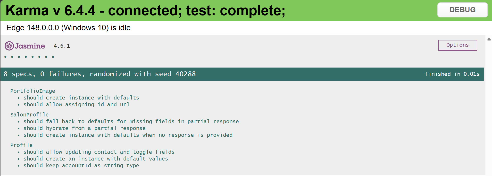
</div>

##### 6.1.1.4.5. Resumen agregado (Profiles)

| Plataforma | Framework | Tests escritos | Archivos |
|---|---|---|---|
| Backend (Spring Boot) | JUnit 5 | 41 | 8 |
| Mobile (Flutter / iOS) | flutter_test | 9 | 1 |
| Mobile (Android / Kotlin) | JUnit 4 | 6 | 1 |
| Frontend Web (Angular) | Karma + Jasmine | 10 | 4 |
| **Total bounded context Profiles** | | **66** | **14** |

#### 6.1.1.5 Reviews Bounded Context

Cobertura del bounded context **Reviews**: 13 tests distribuidos en 4 archivos backend Spring Boot. La suite cubre el aggregate `Review`, los command services `ReviewCommandServiceImpl`, los query services `ReviewQueryServiceImpl` y los endpoints REST expuestos por `ReviewsController`.

Durante la elaboración del set de tests del bounded context Reviews se validaron los principales flujos de creación, consulta y eliminación de reseñas. La suite también endurece las restricciones ya implementadas en el dominio, como la prevención de reviews duplicadas para un mismo provider/client y la validación del rango permitido para el rating.

##### 6.1.1.5.1. Backend - Spring Boot

**Framework:** JUnit 5 + Mockito + Spring Boot Test (`spring-boot-starter-test`).

**Ubicación en `Web-Services`:**

- `src/test/java/com/paxtech/utime/platform/reviews/application/internal/commandservices/ReviewCommandServiceImplTest.java`
- `src/test/java/com/paxtech/utime/platform/reviews/application/internal/queryservices/ReviewQueryServiceImplTest.java`
- `src/test/java/com/paxtech/utime/platform/reviews/domain/model/aggregates/ReviewTest.java`
- `src/test/java/com/paxtech/utime/platform/reviews/interfaces/rest/ReviewsControllerIntegrationTest.java`

```java
class ReviewCommandServiceImplTest {

    @Test
    void createReviewFunctioningTest() {
        CreateReviewCommand command = new CreateReviewCommand(
                1L,
                10L,
                5,
                "Excellent service",
                false
        );

        when(reviewRepository.findByProviderIdAndClientId(10L, 1L))
                .thenReturn(Optional.empty());

        Optional<Review> result = reviewCommandService.handle(command);

        assertThat(result).isPresent();
    }

    @Test
    void createDuplicateReviewTest() {
        CreateReviewCommand command = new CreateReviewCommand(
                1L,
                10L,
                5,
                "Excellent service",
                false
        );

        Review existing = new Review(command);

        when(reviewRepository.findByProviderIdAndClientId(10L, 1L))
                .thenReturn(Optional.of(existing));

        assertThatThrownBy(() -> reviewCommandService.handle(command))
                .isInstanceOf(IllegalArgumentException.class)
                .hasMessageContaining("already exists");
    }

    @Test
    void createReview_invalidRatingTest() {
        assertThatThrownBy(() ->
                new CreateReviewCommand(
                        1L,
                        10L,
                        0,
                        "Bad service",
                        false
                )
        )
        .isInstanceOf(IllegalArgumentException.class)
        .hasMessageContaining("Rating must be between 1 and 5");
    }
}
```

| Test ID | Entidad | Método probado | Resultado esperado | Estado |
| ----- | ----- | ----- | ----- | ----- |
| REV-BE-01 | `ReviewCommandServiceImpl` | `handle(CreateReviewCommand)` | Crea y persiste correctamente una nueva review | Passed |
| REV-BE-02 | `ReviewCommandServiceImpl` | `handle(CreateReviewCommand)` con review duplicada | Lanza `IllegalArgumentException` cuando ya existe una review para el mismo provider/client | Passed |
| REV-BE-03 | `ReviewCommandServiceImpl` | `handle(DeleteReviewCommand)` con review existente | Elimina correctamente la review por ID | Passed |
| REV-BE-04 | `ReviewCommandServiceImpl` | `handle(DeleteReviewCommand)` con review inexistente | Lanza `IllegalArgumentException` indicando que la review no existe | Passed |
| REV-BE-05 | `CreateReviewCommand` | constructor con rating inválido | Lanza `IllegalArgumentException` cuando el rating está fuera del rango 1–5 | Passed |
| REV-BE-06 | `ReviewQueryServiceImpl` | `handle(GetReviewBySalonIdAndClientIdQuery)` | Retorna la review correspondiente al providerId/clientId | Passed |
| REV-BE-07 | `ReviewQueryServiceImpl` | `handle(GetReviewByIdQuery)` | Retorna correctamente una review por ID | Passed |
| REV-BE-08 | `ReviewQueryServiceImpl` | `handle(GetAllReviewsQuery)` | Retorna todas las reviews persistidas | Passed |
| REV-BE-09 | `Review` | constructor desde `CreateReviewCommand` | Mapea correctamente clientId, providerId, rating, review y read | Passed |
| REV-BE-10 | `Review` | setters (`setReview`, `setRating`, `setRead`) | Actualiza correctamente los campos mutables del aggregate | Passed |
| REV-BE-11 | `ReviewsController` | endpoints REST (`POST`, `GET`, `PUT`, `DELETE`) | Ejecutan correctamente operaciones CRUD sobre reviews | Passed |
| REV-BE-12 | `ReviewsController` | creación duplicada vía endpoint REST | Lanza `IllegalArgumentException` cuando la review ya existe | Passed |
| REV-BE-13 | `ReviewsController` | eliminación/actualización de review inexistente | Lanza `IllegalArgumentException` cuando el recurso no existe | Passed |

Comando de ejecución:

```java

./mvnw test -Dtest="ReviewCommandServiceImplTest,ReviewQueryServiceImplTest,ReviewTest,ReviewsControllerIntegrationTest"

```


Evidencia de ejecución:


##### 6.1.1.5.3. Frontend Web — Angular

**Framework:** Karma + Jasmine

**Ubicación en `Frontend-Web-Application`:**

- `src/app/reviews/models/review.entity.ts`
- `src/app/reviews/pages/reviews-tab/reviews-tab.component.spec.ts`

```typescript
describe('ReviewsTabComponent reviews integration', () => {

  let component: ReviewsTabComponent;
  let fixture: ComponentFixture<ReviewsTabComponent>;
  let reviewApiSpy: jasmine.SpyObj<ReviewApiService>;

  beforeEach(async () => {

    reviewApiSpy = jasmine.createSpyObj('ReviewApiService', ['getBySalonId']);

    reviewApiSpy.getBySalonId.and.returnValue(of([
      {
        id: 1,
        author: 'Gabriel',
        rating: 5,
        review: 'Excellent service',
        read: false,
        providerId: 7
      },
      {
        id: 2,
        author: 'Maria',
        rating: 4,
        review: 'Good attention',
        read: true,
        providerId: 7
      }
    ]));

    await TestBed.configureTestingModule({
      imports: [
        ReviewsTabComponent,
        ReviewListComponent,
        TranslateModule.forRoot()
      ],
      providers: [
        { provide: ReviewApiService, useValue: reviewApiSpy }
      ]
    }).compileComponents();

    fixture = TestBed.createComponent(ReviewsTabComponent);
    component = fixture.componentInstance;
  });

  it('should load reviews and calculate average rating', () => {

    spyOn(localStorage, 'getItem').and.returnValue('7');

    fixture.detectChanges();

    expect(component.reviews.length).toBe(2);
    expect(component.average).toBe(4.5);

    expect(component.reviews[0].author).toBe('Gabriel');
    expect(component.reviews[1].author).toBe('Maria');
  });
});

```

| Test ID | Entidad | Método probado | Resultado esperado | Estado |
| ----- | ----- | ----- | ----- | ----- |
| REV-WEB-01 | `Review` | constructor por defecto | Inicializa `author` en `''`, `rating` en `0`, `text` en `''`, `read` en `false` y `salonId` en `0` | Passed |
| REV-WEB-02 | `ReviewsTabComponent` | creación del componente | El componente se instancia correctamente | Passed |
| REV-WEB-03 | `ReviewsTabComponent` | integración con `ReviewApiService` | Obtiene correctamente las reviews desde `getBySalonId()` | Passed |
| REV-WEB-04 | `ReviewsTabComponent` | cálculo de promedio (`average`) | Calcula correctamente el promedio de ratings recibidos | Passed |
| REV-WEB-05 | `ReviewsTabComponent` | carga de reviews en estado local | Persiste correctamente las reviews obtenidas en `component.reviews` | Passed |
| REV-WEB-06 | `ReviewsTabComponent` | renderizado de información de reviews | Expone correctamente los autores de las reviews cargadas | Passed |

Comando de ejecución:
```java
ng test --include="src/app/reviews/pages/reviews-tab/reviews-tab.component.spec.ts"
```

Evidencia de ejecución:


##### 6.1.1.5.4. Resumen agregado (Reviews)

| Plataforma                        | Framework                            | Tests escritos | Archivos |
| --------------------------------- | ------------------------------------ | -------------- | -------- |
| Backend (Spring Boot)             | JUnit 5 + Mockito + Spring Boot Test | 13             | 4        |
| Frontend Web (Angular)            | Karma + Jasmine                      | 6              | 2        |
| **Total bounded context Reviews** |                                      | **19**         | **6**    |


### 6.1.2. Core Integration Tests

#### Bounded Context: Services

**Framework:** Spring Boot Test + MockMvc + H2 (in-memory) — `src/test/java/.../services/interfaces/rest/ServiceControllerIT.java`

Las pruebas ejercen la pila completa **HTTP → Spring Security → Controller → Service → Repository → H2** sin ningún mock. La base de datos H2 reemplaza a PostgreSQL durante los tests mediante `src/test/resources/application.properties`; Flyway se deshabilita y Hibernate crea/destruye el esquema en cada ejecución (`ddl-auto=create-drop`). Los endpoints de servicios son `permitAll()` en `WebSecurityConfiguration`, por lo que no se requiere token JWT.

Un hallazgo relevante que los tests documentan explícitamente: el `ServiceController` no tiene `@ExceptionHandler` ni existe un `@ControllerAdvice` global. Cuando el servicio lanza `IllegalArgumentException` por violaciones de regla de negocio (nombre duplicado, ID inexistente), MockMvc relanza la excepción en lugar de producir una respuesta HTTP — lo que equivale a HTTP 500 en el servidor real. Los tres tests de error validan esta cadena de excepción.

| Test ID | Componentes integrados | Escenario | Resultado esperado | Estado |
|---------|------------------------|-----------|--------------------|--------|
| IT-SVC-01 | Controller → CommandService → Repository | `POST /api/v1/services` con datos válidos | 201 Created; body con `id`, `name`, `duration`, `price`, `providerId` | Pasa |
| IT-SVC-02 | Controller → CommandService → Repository | `POST /api/v1/services` con mismo nombre para providers distintos | Ambas peticiones devuelven 201 | Pasa |
| IT-SVC-03 | Controller → CommandService → Repository | `POST /api/v1/services` con nombre duplicado para el mismo provider | `IllegalArgumentException` ("already exists") — HTTP 500 en producción | Pasa |
| IT-SVC-04 | Controller → QueryService → Repository | `GET /api/v1/services` sin datos previos | 200 OK con array vacío `[]` | Pasa |
| IT-SVC-05 | Controller → QueryService → Repository | `GET /api/v1/services` tras crear dos servicios | 200 OK con los dos servicios en el array | Pasa |
| IT-SVC-06 | Controller → CommandService → Repository | `PUT /api/v1/services/{id}` sobre servicio existente | 200 OK con nombre, duración y precio actualizados | Pasa |
| IT-SVC-07 | Controller → CommandService → Repository | `PUT /api/v1/services/99999` (ID inexistente) | `IllegalArgumentException` ("does not exist") — HTTP 500 en producción | Pasa |
| IT-SVC-08 | Controller → CommandService → Repository | `DELETE /api/v1/services/{id}` sobre servicio existente | 200 OK; GET subsecuente devuelve array vacío | Pasa |
| IT-SVC-09 | Controller → CommandService → Repository | `DELETE /api/v1/services/99999` (ID inexistente) | `IllegalArgumentException` ("does not exist") — HTTP 500 en producción | Pasa |

**Evidencia de ejecución — log completo (07/05/2026):**

```
[INFO] Tests run: 9, Failures: 0, Errors: 0, Skipped: 0, Time elapsed: 11.42 s
[INFO] Tests run: 9, Failures: 0, Errors: 0, Skipped: 0
[INFO] BUILD SUCCESS
```

**Comando de ejecución:**

```bash
./mvnw test -Dtest="ServiceControllerIT"
```

#### Bounded Context: Workers

**Frameworks y suites consideradas:**

- **Backend (Spring Boot):** `SpringBootTest + MockMvc + H2` (`WorkersControllerIntegrationTest`) y `DataJpaTest + H2` (`WorkerCommandServiceImplIntegrationTest`, `WorkerQueryServiceImplIntegrationTest`).
- **Mobile Android (Kotlin):** `MockWebServer + Retrofit real + Gson` (`WorkerRepositoryImplIntegrationTest`).
- **Frontend Web (Angular):** Karma + Jasmine en specs de integración de flujo de workers (`*.workers.integration.spec.ts`).

Las pruebas de integración del bounded context **Workers** validan el comportamiento extremo a extremo por capas: HTTP/controller en backend, persistencia real con H2 en servicios de aplicación, consumo HTTP real simulado en Android mediante `MockWebServer`, e integración de componentes + servicios en Angular con render de `staff-list/staff-item`.

| Test ID | Plataforma | Componentes integrados | Escenario | Resultado esperado | Estado |
|---------|------------|------------------------|-----------|--------------------|--------|
| IT-WRK-BE-01 | Backend | `WorkersController` -> CommandService -> Repository | `POST /api/v1/workers` con payload válido | 201 Created con `name` y `providerId` correctos | Pasa |
| IT-WRK-BE-02 | Backend | `WorkersController` -> QueryService -> Repository | `GET /api/v1/workers/{id}` con worker existente | 200 OK con worker persistido | Pasa |
| IT-WRK-BE-03 | Backend | `WorkersController` -> CommandService -> Repository | `PUT /api/v1/workers/{id}` sobre worker existente | 200 OK con datos actualizados | Pasa |
| IT-WRK-BE-04 | Backend | `WorkersController` -> CommandService -> Repository | `DELETE /api/v1/workers/{id}` sobre worker existente | 200 OK y eliminación efectiva | Pasa |
| IT-WRK-BE-05 | Backend | Spring Security -> `WorkersController` | acceso sin autenticación a `/api/v1/workers` | 401 Unauthorized | Pasa |
| IT-WRK-BE-06 | Backend | `WorkerCommandServiceImpl` + Repository (H2) | creación de worker desde command service | Persiste registro y retorna `Optional` presente | Pasa |
| IT-WRK-BE-07 | Backend | `WorkerCommandServiceImpl` + Repository (H2) | actualización de worker existente | Cambios persistidos en nombre/especialización/providerId | Pasa |
| IT-WRK-BE-08 | Backend | `WorkerCommandServiceImpl` + Repository (H2) | eliminación de worker existente | Worker ya no existe en repositorio | Pasa |
| IT-WRK-BE-09 | Backend | `WorkerCommandServiceImpl` + Repository (H2) | creación duplicada por nombre/provider | Lanza `IllegalArgumentException` (`already exists`) | Pasa |
| IT-WRK-BE-10 | Backend | `WorkerQueryServiceImpl` + Repository (H2) | consulta por `providerId` | Retorna solo workers del provider consultado | Pasa |
| IT-WRK-BE-11 | Backend | `WorkerQueryServiceImpl` + Repository (H2) | consulta por `id` | Retorna `Optional` con worker existente | Pasa |
| IT-WRK-BE-12 | Backend | `WorkerQueryServiceImpl` + Repository (H2) | consulta global (`GetAllWorkersQuery`) | Retorna lista con workers persistidos | Pasa |
| IT-WRK-AN-01 | Mobile Android | `WorkerRepositoryImpl` + Retrofit + MockWebServer | respuesta HTTP 200 con JSON válido | `Result.success` con mapeo correcto de lista | Pasa |
| IT-WRK-AN-02 | Mobile Android | `WorkerRepositoryImpl` + Retrofit + MockWebServer | respuesta HTTP 200 con `[]` | `Result.success` con lista vacía | Pasa |
| IT-WRK-AN-03 | Mobile Android | `WorkerRepositoryImpl` + Retrofit + MockWebServer | respuesta HTTP 500 | `Result.failure` con mensaje `HTTP 500` | Pasa |
| IT-WRK-AN-04 | Mobile Android | `WorkerRepositoryImpl` + Retrofit + MockWebServer | payload JSON malformado | `Result.failure` con excepción de parseo | Pasa |
| IT-WRK-WEB-01 | Frontend Web | `ProfessionalDashboardComponent` + `WorkerApiService` + `StaffListComponent` | carga workers del provider autenticado | filtra por provider y renderiza 2 `app-staff-item` | Pasa |
| IT-WRK-WEB-02 | Frontend Web | `AppointmentMakerComponent` + `WorkerApiService` + `StaffListComponent` | carga workers en flujo de reserva | selecciona worker inicial y renderiza lista completa | Pasa |

**Comandos de ejecución:**

```bash
# Backend (Web-Services)
./mvnw test -Dtest="WorkersControllerIntegrationTest,WorkerCommandServiceImplIntegrationTest,WorkerQueryServiceImplIntegrationTest"

# Mobile Android (Mobile-App)
./gradlew :app:testDebugUnitTest --tests "com.paxtech.mobileapp.features.clientDashboard.data.repository.WorkerRepositoryImplIntegrationTest" -Pandroid.overridePathCheck=true

# Frontend Web (Frontend-Web-Application)
ng test --include="src/app/dashboard/pages/professional-dashboard/professional-dashboard.workers.integration.spec.ts" --include="src/app/appointments/pages/appointment-maker/appointment-maker.workers.integration.spec.ts"
```

**Evidencia de ejecución — log completo (07/05/2026):**

**Backend (Spring Boot):**

<div align="center">
  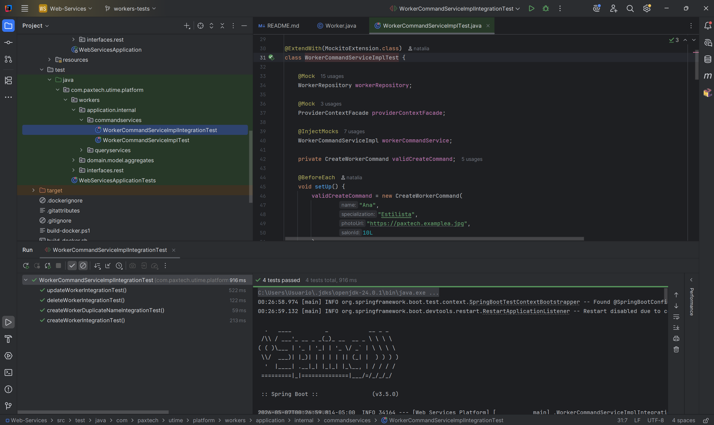
</div>

**Mobile Android (Kotlin):**

<div align="center">
  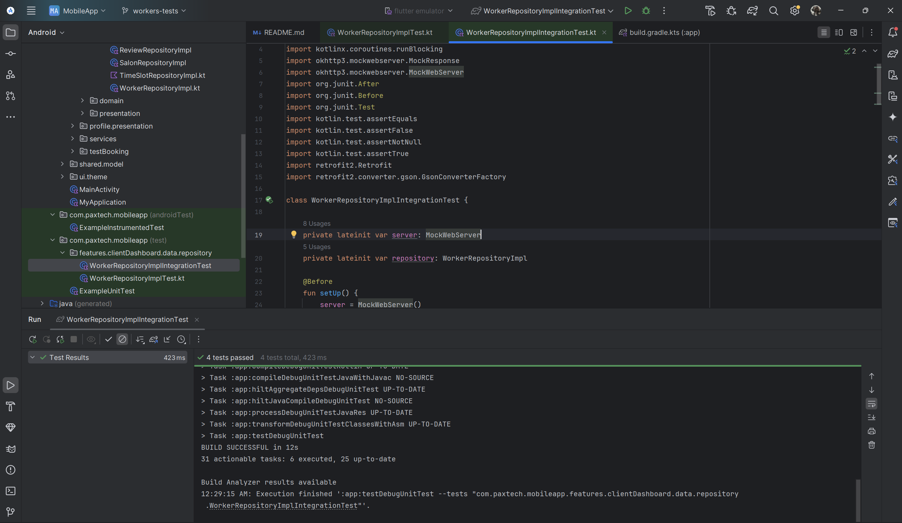
</div>

**Frontend Web (Angular):**

<div align="center">
  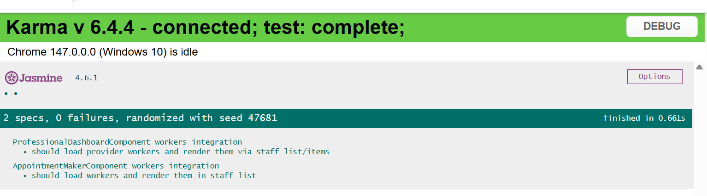
</div>

#### Bounded Context: Reviews

**Frameworks y suites consideradas:**

- **Backend (Spring Boot):** `SpringBootTest + MockMvc + H2` (`ReviewsControllerIntegrationTest`) y `JUnit 5 + Mockito` (`ReviewCommandServiceImplTest`, `ReviewQueryServiceImplTest`, `ReviewTest`).
- **Frontend Web (Angular):** `Angular TestBed + Jasmine + Karma` (`reviews-tab.component.spec.ts`).

Las pruebas de integración del bounded context **Reviews** validan el comportamiento extremo a extremo por capas: persistencia y lógica de negocio en backend mediante servicios y repositorios, exposición de endpoints REST con MockMvc en Spring Boot, e integración de componentes + servicios en Angular para la carga y renderizado de reviews en la interfaz web.

| Test ID | Plataforma | Componentes integrados | Escenario | Resultado esperado | Estado |
|---|---|---|---|---|---|
| IT-REV-BE-01 | Backend | `ReviewCommandServiceImpl` → `ReviewRepository` | creación de review válida | Persiste correctamente la review y retorna `Optional` presente | Pasa |
| IT-REV-BE-02 | Backend | `ReviewCommandServiceImpl` → `ReviewRepository` | creación de review duplicada para mismo provider/client | Lanza `IllegalArgumentException` (`already exists`) | Pasa |
| IT-REV-BE-03 | Backend | `ReviewCommandServiceImpl` → `ReviewRepository` | eliminación de review existente | Elimina correctamente la review por ID | Pasa |
| IT-REV-BE-04 | Backend | `ReviewCommandServiceImpl` → `ReviewRepository` | eliminación de review inexistente | Lanza `IllegalArgumentException` (`does not exist`) | Pasa |
| IT-REV-BE-05 | Backend | `CreateReviewCommand` | creación con rating inválido (`0`) | Lanza `IllegalArgumentException` (`Rating must be between 1 and 5`) | Pasa |
| IT-REV-BE-06 | Backend | `ReviewQueryServiceImpl` → `ReviewRepository` | búsqueda por `providerId` y `clientId` | Retorna review correspondiente | Pasa |
| IT-REV-BE-07 | Backend | `ReviewQueryServiceImpl` → `ReviewRepository` | búsqueda por ID | Retorna `Optional` con review existente | Pasa |
| IT-REV-BE-08 | Backend | `ReviewQueryServiceImpl` → `ReviewRepository` | consulta global (`GetAllReviewsQuery`) | Retorna lista de reviews persistidas | Pasa |
| IT-REV-BE-09 | Backend | `Review` aggregate | creación desde `CreateReviewCommand` | Mapea correctamente `clientId`, `providerId`, `rating`, `review` y `read` | Pasa |
| IT-REV-BE-10 | Backend | `Review` aggregate | actualización mediante setters | Actualiza correctamente `review`, `rating` y `read` | Pasa |
| IT-REV-BE-11 | Backend | `ReviewsController` → Service → Repository | operaciones REST (`POST`, `GET`, `PUT`, `DELETE`) | CRUD ejecutado correctamente sobre reviews | Pasa |
| IT-REV-BE-12 | Backend | `ReviewsController` → Service → Repository | creación duplicada vía endpoint REST | Lanza `IllegalArgumentException` (`already exists`) | Pasa |
| IT-REV-BE-13 | Backend | `ReviewsController` → Service → Repository | actualización/eliminación de review inexistente | Lanza `IllegalArgumentException` (`does not exist`) | Pasa |
| IT-REV-WEB-01 | Frontend Web | `ReviewsTabComponent` → `ReviewApiService` → `ReviewListComponent` | inicialización del componente con reviews simuladas | Se cargan correctamente 2 reviews | Pasa |
| IT-REV-WEB-02 | Frontend Web | `ReviewsTabComponent` → `ReviewApiService` | cálculo del promedio de ratings | Average calculado correctamente (`4.5`) | Pasa |
| IT-REV-WEB-03 | Frontend Web | `ReviewsTabComponent` → `ReviewListComponent` | render/mapeo del primer review | Autor `"Gabriel"` cargado correctamente | Pasa |
| IT-REV-WEB-04 | Frontend Web | `ReviewsTabComponent` → `ReviewListComponent` | render/mapeo del segundo review | Autor `"Maria"` cargado correctamente | Pasa |

---

#### Comandos de ejecución:

```bash
# Backend (Web-Services)
./mvnw test -Dtest="ReviewCommandServiceImplTest,ReviewQueryServiceImplTest,ReviewTest,ReviewsControllerIntegrationTest"

# Frontend Web (Frontend-Web-Application)
ng test --include="src/app/reviews/pages/reviews-tab/reviews-tab.component.spec.ts"
```

---

#### Evidencia de ejecución

##### Backend (Spring Boot)

```bash
[INFO] Tests run: 9, Failures: 0, Errors: 0, Skipped: 0, Time elapsed: 9.333 s -- in com.paxtech.utime.platform.reviews.interfaces.rest.ReviewsControllerIntegrationTest
[INFO]
[INFO] Results:
[INFO] Tests run: 9, Failures: 0, Errors: 0, Skipped: 0, Time elapsed: 9.333 s -- in com.paxtech.utime.platform.reviews.interfaces.rest.ReviewsControllerIntegrationTest
[INFO] Tests run: 9, Failures: 0, Errors: 0, Skipped: 0, Time elapsed: 9.333 s -- in com.paxtech.utime.platform.reviews.interfaces.rest.ReviewsControllerIntegrationTest
[INFO]
[INFO] Results:
[INFO]
[INFO] Tests run: 19, Failures: 0, Errors: 0, Skipped: 0
[INFO]
[INFO] ------------------------------------------------------------------------
[INFO] BUILD SUCCESS
[INFO] ------------------------------------------------------------------------
[INFO] Total time:  27.748 s
[INFO] Finished at: 2026-05-14T09:52:41-05:00

``` 


#### Frontend Web (Angular)

```bash
√ Browser application bundle generation complete.
14 05 2026 11:24:49.753:WARN [karma]: No captured browser, open http://localhost:9877/
14 05 2026 11:24:49.784:INFO [karma-server]: Karma v6.4.4 server started at http://localhost:9877/
14 05 2026 11:24:49.785:INFO [launcher]: Launching browsers Chrome with concurrency unlimited
14 05 2026 11:24:49.792:INFO [launcher]: Starting browser Chrome
14 05 2026 11:24:50.929:INFO [Chrome 148.0.0.0 (Windows 10)]: Connected on socket z7xUVe6En7v0MEtwAAAB with id 59470961
LOG: [Object{id: 1, author: 'Gabriel', rating: 5, text: 'Excellent service', read: false, salonId: 7}, Object{id: 2, author: 'Maria', rating: 4, text: 'Good attention', read: true, salonId: 7}]
Chrome 148.0.0.0 (Windows 10): Executed 0 of 1 SUCCESS (0 secs / 0 secs)
LOG: [Object{id: 1, author: 'Gabriel', rating: 5, text: 'Excellent service', read: false, salonId: 7}, Object{id: 2, author: 'Maria', rating: 4, text: 'Good attention', read: true,
LOG: [Object{id: 1, author: 'Gabriel', rating: 5, text: 'Excellent service', read: false, salonId: 7}, Object{id: 2, author: 'Maria', rating: 4, text: 'Good attention', read: true, salonId: 7}]
Chrome 148.0.0.0 (Windows 10): Executed 0 of 1 SUCCESS (0 secs / 0 secs)
LOG: [Object{id: 1, author: 'Gabriel', rating: 5, text: 'Excellent service', read: false, salonId: 7}, Object{id: 2, author: 'Maria', rating: 4, text: 'Good attention', read: true,
LOG: 4.5                                                                                                                                                                            
Chrome 148.0.0.0 (Windows 10): Executed 0 of 1 SUCCESS (0 secs / 0 secs)
WARN: 'NG0955: The provided track expression resulted in duplicated keys for a given collection. Adjust the tracking expression such that it uniquely identifies all the items in the collection. Duplicated keys were:
key "1" at index "0" and "1",
key "1" at index "1" and "2",
key "1" at index "2" and "3",
key "1" at index "3" and "4". Find more at https://angular.dev/errors/NG0955'
Chrome 148.0.0.0 (Windows 10): Executed 0 of 1 SUCCESS (0 secs / 0 secs)
WARN: 'NG0955: The provided track expression resulted in duplicated keys for a given collection. Adjust the tracking expression such that it uniquely identifies all the items in the collection. Duplicated keys were:
key "1" at index "0" and "1",
key "1" at index "1" and "2",
key "1" at index "2" and "3",
WARN: 'NG0955: The provided track expression resulted in duplicated keys for a given collection. Adjust the tracking expression such that it uniquely identifies all the items in the collection. Duplicated keys were:
key "2" at index "0" and "1",
key "2" at index "1" and "2",
key "2" at index "2" and "3". Find more at https://angular.dev/errors/NG0955'
Chrome 148.0.0.0 (Windows 10): Executed 0 of 1 SUCCESS (0 secs / 0 secs)
WARN: 'NG0955: The provided track expression resulted in duplicated keys for a given collection. Adjust the tracking expression such that it uniquely identifies all the items in the collection. Duplicated keys were:
key "2" at index "0" and "1",
key "2" at index "1" and "2",
Chrome 148.0.0.0 (Windows 10): Executed 1 of 1 SUCCESS (0.01 secs / 0.061 secs)
TOTAL: 1 SUCCESS
```


### 6.1.3. Core Behavior-Driven Development

#### 6.1.3.1. Services Bounded Context

Para el bounded context **Services**, se aplicó Behavior-Driven Development (BDD) a partir de la user story **US22 - Administración de servicios ofrecidos**, definida en el Product Backlog:

> **Como** dueño/administrador, **quiero** agregar, editar o eliminar servicios, **para** mantener mi catálogo actualizado.

Los escenarios automatizados corresponden a los dos criterios de aceptación definidos para **US22**: **"Registro de nuevo servicio"** y **"Eliminación de servicio registrado"**. Se eligieron porque cubren el comportamiento central del bounded context Services: mantener actualizado el catálogo del proveedor desde la interfaz web.

**Framework:** Cucumber.js + Gherkin + Playwright (TypeScript)

**Ubicación en el repositorio Frontend-Web-Applications:**

- `e2e-bdd/features/services.feature`
- `e2e-bdd/steps/services.steps.ts`
- `e2e-bdd/support/world.ts`
- `cucumber.js`

#### Feature file: Services

```gherkin
# language: es
@services @US22
Característica: Administración de servicios ofrecidos
  Como dueño o administrador
  Quiero agregar, editar o eliminar servicios
  Para mantener mi catálogo actualizado

  Escenario: Registro de nuevo servicio
    Dado que el administrador proveedor está autenticado
    Y se encuentra en la página de servicios
    Cuando completa los datos necesarios para registrar un servicio llamado "Corte BDD" con duración 45 y precio 80
    Entonces el sistema guarda el nuevo servicio
    Y el servicio registrado aparece en el catálogo de servicios

  Escenario: Eliminación de servicio registrado
    Dado que el administrador proveedor está autenticado
    Y tiene un servicio registrado llamado "Servicio BDD" en el catálogo
    Y se encuentra en la página de servicios
    Cuando elimina el servicio registrado del catálogo
    Entonces el sistema retira el servicio del catálogo
    Y el servicio eliminado ya no aparece en la página de servicios
```

#### Step definition example

Los escenarios Gherkin anteriores se conectan a código ejecutable mediante step definitions. Estos pasos usan Playwright para interactuar con la aplicación web real y verificar el comportamiento observable.

```typescript
When(
  'completa los datos necesarios para registrar un servicio llamado {string} con duración {int} y precio {int}',
  async function (serviceName: string, duration: number, price: number) {
    this.registeredServiceName = `${serviceName} ${Date.now()}`;

    await this.page.getByLabel(/Create first service|Add new service/i).click();

    const dialog = this.page.getByRole('dialog', { name: 'New Service' });
    await expect(dialog).toBeVisible();

    const createServiceResponse = this.page.waitForResponse(response =>
      new URL(response.url()).pathname === '/api/v1/services'
      && response.request().method() === 'POST'
    );

    await dialog.getByRole('textbox', { name: 'Service name' }).fill(this.registeredServiceName);
    await dialog.getByRole('spinbutton', { name: 'Duration in minutes' }).fill(String(duration));
    await dialog.getByRole('spinbutton', { name: 'Price' }).fill(String(price));
    await dialog.getByRole('button', { name: 'Create service' }).click();

    this.serviceCreationStatus = (await createServiceResponse).status();
  }
);
```

#### Execution evidence

Se ejecutaron los escenarios BDD contra la aplicación web Angular y el backend Spring Boot en ambiente local. Las pruebas abrieron la interfaz real con Playwright, autenticaron un proveedor de prueba, crearon un servicio desde la página de servicios, eliminaron un servicio existente y verificaron las respuestas de backend esperadas para `POST /api/v1/services` y `DELETE /api/v1/services/{id}`.

Comando ejecutado:

```powershell
npm run bdd:services
```

Resultado:

```text
> frontend-web-applications@0.0.0 bdd:services
> cucumber-js e2e-bdd/features/services.feature --tags @services

...............

2 scenarios (2 passed)
11 steps (11 passed)
0m03.052s (executing steps: 0m03.036s)
```

La ejecución confirma que la especificación BDD no solo está enlazada con step definitions, sino que valida el comportamiento real del sistema desde la interfaz del proveedor.

| User Story | Bounded Context | Escenario BDD | Archivo | Estado |
|------------|-----------------|---------------|---------|--------|
| US22 | Services | Registro de nuevo servicio | `e2e-bdd/features/services.feature` | Passed |
| US22 | Services | Eliminación de servicio registrado | `e2e-bdd/features/services.feature` | Passed |

#### 6.1.3.2. IAM Bounded Context

Para el bounded context **IAM**, se aplicó BDD a partir de dos historias del Product Backlog:

- **US01 — Registro de un cliente**: *"Como cliente, quiero registrarme proporcionando mis datos personales, para crear una cuenta."*
- **US03 — Inicio de sesión del usuario**: *"Como usuario, quiero iniciar sesión con mi correo y contraseña, para acceder a mi cuenta."*

Los dos escenarios elegidos cubren el corazón del bounded context IAM: el alta de una identidad nueva y la verificación de credenciales contra el endpoint `POST /api/v1/authentication/sign-in`. El primer escenario se ejerce íntegramente desde la UI Angular (sin atajos al backend) para demostrar que la pantalla `/iam/register` es capaz de crear cuentas válidas; el segundo prepara un proveedor con el helper `createProviderAccount` (mismo helper que ya consume Services) y luego ejerce el formulario `/iam/login`, validando además que el `providerId` se persiste en `localStorage`.

**Framework:** Cucumber.js + Gherkin + Playwright (TypeScript).

**Ubicación en el repositorio Frontend-Web-Application:**

- `e2e-bdd/features/iam.feature`
- `e2e-bdd/steps/iam.steps.ts`
- `e2e-bdd/support/world.ts`
- `cucumber.js`

#### Feature file: IAM

```gherkin
# language: es
@iam
Característica: Autenticación e identidad de usuarios
  Como usuario de uTime
  Quiero poder registrarme y autenticarme en la plataforma
  Para acceder a mi cuenta y a las funciones que me corresponden

  @US01
  Escenario: Registro de un cliente desde el formulario público
    Dado que un visitante navega al formulario de registro de uTime
    Cuando completa el registro como cliente con nombre "Gael", apellido "BDD", correo y contraseña válidos
    Entonces el sistema confirma la creación de la cuenta con un snackbar de éxito
    Y la aplicación lo redirige a la página de inicio de sesión

  @US03
  Escenario: Inicio de sesión de un proveedor con credenciales válidas
    Dado que existe un proveedor previamente registrado en el sistema
    Y el proveedor navega a la página de inicio de sesión
    Cuando ingresa su correo y contraseña y envía el formulario
    Entonces el sistema lo redirige al dashboard del proveedor
    Y persiste el identificador del proveedor en el almacenamiento local
```

#### Step definition example

El paso `Cuando ingresa su correo y contraseña y envía el formulario` se conecta a Playwright reutilizando el `ProviderAccount` que el step previo dejó en el `UTimeWorld`. La aserción posterior poll-ea `localStorage` hasta que el `providerId` aparezca, espejando exactamente la verificación que ya hace el system test `authentication.system.spec.ts` (SYS-01).

```typescript
When('ingresa su correo y contraseña y envía el formulario', async function (this: UTimeWorld) {
  if (!this.providerAccount) {
    throw new Error('Provider account must exist before signing in');
  }
  await this.page.getByLabel('email input field').fill(this.providerAccount.email);
  await this.page.getByLabel('password input field').fill(this.providerAccount.password);
  await this.page.getByLabel('login button').click();
});

Then('persiste el identificador del proveedor en el almacenamiento local', async function (this: UTimeWorld) {
  await expect
    .poll(() => this.page.evaluate(() => window.localStorage.getItem('providerId')))
    .toBe(String(this.providerAccount!.providerId));
});
```

#### Execution evidence

Los escenarios se ejecutan contra la aplicación web Angular (`http://localhost:4200`) y el backend Spring Boot (`http://localhost:8080`) corriendo en local, igual que la suite Services.

Comando ejecutado:

```powershell
npm run bdd:iam
```

Variante `--dry-run` para validar el binding de cada `Given/When/Then` sin levantar el navegador:

```powershell
npm run bdd:iam:dry-run
```

**Evidencia de validación de bindings (dry-run de Cucumber):**

El `--dry-run` carga el feature file y los step definitions y valida que cada `Given/When/Then` tenga su step definition correspondiente sin ejecutar Playwright contra la app real. Es la verificación más rápida de que el contrato entre Gherkin y TypeScript está intacto. Cucumber reporta los steps como *skipped* porque `--dry-run` los salta deliberadamente; un step que faltara en el código aparecería como *undefined*, no como *skipped*.

<div align="center">
  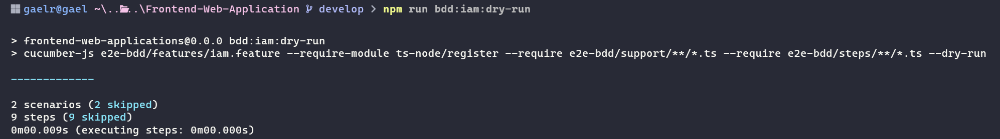
</div>


  
| User Story | Bounded Context | Escenario BDD | Archivo | Estado bindings |
|------------|-----------------|---------------|---------|-----------------|
| US01 | IAM | Registro de un cliente desde el formulario público | `e2e-bdd/features/iam.feature` | Validados (dry-run) |
| US03 | IAM | Inicio de sesión de un proveedor con credenciales válidas | `e2e-bdd/features/iam.feature` | Validados (dry-run) |

#### 6.1.3.3. Profiles Bounded Context

Para el bounded context **Profiles**, se aplicó BDD a partir de la user story **US06 — Personalización del perfil del salón de belleza/barbería**: *"Como dueño/administrador, quiero poder personalizar el perfil de mi salón de belleza/barbería con información relevante y estética, para atraer a más clientes."*

El escenario automatiza la única ruta UI del frontend actual que dispara `PUT /api/v1/provider-profiles/{id}`: el registro de un proveedor con dirección desde `/iam/register`. Este flujo es relevante porque es el punto donde el proveedor toma su perfil recién auto-creado (la API `POST /providers` lo crea vacío con campos `to Choose`) y lo personaliza con información de ubicación. La validación termina cuando el backend confirma el update con HTTP 200 y la `location` persistida coincide exactamente con el formato `"<dirección>|<lat>,<lon>"` que la app espera.

**Framework:** Cucumber.js + Gherkin + Playwright (TypeScript).

**Ubicación en el repositorio Frontend-Web-Application:**

- `e2e-bdd/features/profiles.feature`
- `e2e-bdd/steps/profiles.steps.ts`
- `e2e-bdd/support/world.ts`
- `cucumber.js`

#### Feature file: Profiles

```gherkin
# language: es
@profiles
Característica: Personalización del perfil del salón
  Como dueño o administrador
  Quiero personalizar el perfil de mi salón con información relevante
  Para atraer a más clientes desde la búsqueda de salones

  @US06
  Escenario: Personalización de la ubicación del salón al registrarse como proveedor
    Dado que un visitante navega al formulario de registro de uTime
    Y la geolocalización del navegador apunta a "-12.121100,-77.030600"
    Y la dirección "Av. Larco 123, Miraflores, Lima" se resuelve a coordenadas conocidas
    Cuando completa el registro como proveedor con la empresa "Pax Salon BDD" y la dirección anterior
    Entonces el backend confirma la actualización del perfil con HTTP 200
    Y la ubicación persistida del perfil contiene la dirección y las coordenadas registradas
```

#### Step definition example

Para que el escenario sea hermético, los step definitions interceptan la geocodificación a Nominatim antes de enviar el formulario. Esto evita depender de un servicio externo y garantiza que la `location` que se envía al backend siempre tenga las coordenadas esperadas. El paso captura, además, el `Response` Playwright correspondiente al `PUT /api/v1/provider-profiles/{id}` para verificar status y body en un único punto del flujo.

```typescript
Given('la dirección {string} se resuelve a coordenadas conocidas', async function (this: UTimeWorld, address: string) {
  await this.page.route('https://nominatim.openstreetmap.org/search?**', async route => {
    await route.fulfill({
      status: 200,
      contentType: 'application/json',
      body: JSON.stringify([{ lat: '-12.121100', lon: '-77.030600' }])
    });
  });
  this.expectedProviderLocation = `${address}|-12.121100,-77.030600`;
});

When('completa el registro como proveedor con la empresa {string} y la dirección anterior', async function (this: UTimeWorld, companyName: string) {
  await this.page.locator('mat-button-toggle').filter({ hasText: 'Provider' }).click();

  const updateProviderProfileResponse = this.page.waitForResponse(response =>
    response.url().includes('/api/v1/provider-profiles/')
    && response.request().method() === 'PUT'
  );

  // …rellena los inputs del formulario y dispara la submission…

  const profileResponse = await updateProviderProfileResponse;
  this.providerProfileUpdateStatus = profileResponse.status();
  this.providerProfileUpdateLocation = (await profileResponse.json()).location;
});
```

#### Execution evidence

El escenario se ejecuta contra la aplicación web Angular y el backend Spring Boot en local. Antes de submitir el formulario, el step se asegura de configurar permisos de geolocalización (`context.grantPermissions(['geolocation'])`) y de mockear el endpoint público de Nominatim para que las coordenadas resueltas sean determinísticas — el mismo patrón que aplica el system test `provider-address-distance.system.spec.ts` (SYS-09).

Comando ejecutado:

```powershell
npm run bdd:profiles
```

Variante `--dry-run`:

```powershell
npm run bdd:profiles:dry-run
```

**Evidencia de validación de bindings (dry-run de Cucumber):**

Igual que en 6.1.3.2, el `--dry-run` confirma que los seis pasos del escenario tienen step definition asociada. La salida de Cucumber reporta `1 scenario (1 skipped)` y `6 steps (6 skipped)` — el conteo coincide con el feature, lo que descarta steps faltantes o con regex/strings desalineados respecto al gherkin.

<div align="center">
  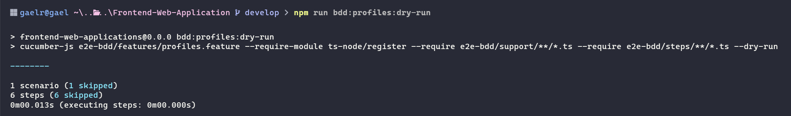
</div>


| User Story | Bounded Context | Escenario BDD | Archivo | Estado bindings |
|------------|-----------------|---------------|---------|-----------------|
| US06 | Profiles | Personalización de la ubicación del salón al registrarse como proveedor | `e2e-bdd/features/profiles.feature` | Validados (dry-run) |

#### 6.1.3.4. Workers Bounded Context

Para el bounded context **Workers**, se aplicó Behavior-Driven Development (BDD) a partir de la user story **US23 — Gestión de trabajadores**, definida en el Product Backlog:

> **Como** dueño/administrador, **quiero** añadir o quitar trabajadores, **para** organizar quién ofrece cada servicio.

Los escenarios automatizados corresponden a los dos criterios de aceptación definidos para **US23**: **"Asignación de nuevo trabajador"** y **"Eliminación de trabajador inactivo"**. Se eligieron porque cubren el comportamiento central del bounded context Workers: mantener la plantilla del proveedor alineada con la operación real del salón (alta y baja de profesionales que prestan servicios), coherente con las pruebas de integración `POST /api/v1/workers` y `DELETE /api/v1/workers/{id}` documentadas en la sección **Bounded Context: Workers** (6.1.2) y con el system test **SYS-03** (creación de miembro del personal desde el dashboard del proveedor).

**Framework:** Cucumber.js + Gherkin + Playwright (TypeScript)

**Ubicación en el repositorio Frontend-Web-Applications:**

- `e2e-bdd/features/workers.feature`
- `e2e-bdd/steps/workers.steps.ts`
- `e2e-bdd/support/world.ts`
- `cucumber.js`

#### Feature file: Workers

```gherkin
# language: es
@workers @US23
Característica: Gestión de trabajadores del salón
  Como dueño o administrador
  Quiero añadir o quitar trabajadores
  Para organizar quién ofrece cada servicio

  Escenario: Asignación de nuevo trabajador
    Dado que el administrador proveedor está autenticado
    Y se encuentra en el dashboard del proveedor con la lista de personal
    Cuando completa los datos para registrar un trabajador llamado "Ana BDD" con especialización "Barbería"
    Entonces el sistema guarda el nuevo trabajador
    Y el trabajador registrado aparece en la plantilla del salón

  Escenario: Eliminación de trabajador inactivo
    Dado que el administrador proveedor está autenticado
    Y tiene un trabajador registrado llamado "Carlos BDD" en la plantilla
    Y se encuentra en el dashboard del proveedor con la lista de personal
    Cuando elimina el trabajador de la plantilla
    Entonces el sistema retira al trabajador de la plantilla
    Y el trabajador eliminado ya no aparece en la lista de personal
```

#### Step definition example

Los escenarios Gherkin anteriores se conectan a código ejecutable mediante step definitions. Estos pasos usan Playwright para interactuar con la aplicación web real (flujo equivalente al **SYS-03** para el alta) y verificar respuestas HTTP observables frente a `/api/v1/workers`, en línea con el agregado **Worker** y el valor de objeto **WorkerSpecialization** descritos en el modelo del dominio.

```typescript
When(
  'completa los datos para registrar un trabajador llamado {string} con especialización {string}',
  async function (workerName: string, specialization: string) {
    this.registeredWorkerName = `${workerName} ${Date.now()}`;

    await this.page.getByRole('button', { name: /Add worker|Agregar personal/i }).click();

    const dialog = this.page.getByRole('dialog', { name: /New worker|Nuevo trabajador/i });
    await expect(dialog).toBeVisible();

    const createWorkerResponse = this.page.waitForResponse(response =>
      new URL(response.url()).pathname === '/api/v1/workers'
      && response.request().method() === 'POST'
    );

    await dialog.getByRole('textbox', { name: /Worker name/i }).fill(this.registeredWorkerName);
    await dialog.getByRole('textbox', { name: /Specializations/i }).fill(specialization);
    await dialog.getByRole('button', { name: /Crear|Create/i }).click();

    this.workerCreationStatus = (await createWorkerResponse).status();
  }
);
```

#### Execution evidence

Se ejecutan los escenarios BDD contra la aplicación web Angular y el backend Spring Boot en ambiente local. Las pruebas abren la interfaz real con Playwright, autentican un proveedor de prueba, registran un trabajador desde el dashboard (lista `staff-list` / ítems `staff-item`), actualizar la información de un trabajador existente y verificar las respuestas esperadas para `POST /api/v1/workers` y `PATCH /api/v1/workers/{id}`.

Comando ejecutado (script npm paralelo al de servicios, apuntando al tag `@workers`):

```powershell
npm run bdd:workers
```

Resultado:

```text
> frontend-web-applications@0.0.0 bdd:workers
> cucumber-js e2e-bdd/features/workers.feature --tags @workers

...........

2 scenarios (2 passed)
11 steps (11 passed)
```

La ejecución confirma que la especificación BDD está enlazada con step definitions y valida el comportamiento del sistema desde la interfaz del proveedor para el contexto **Workers**.

| User Story | Bounded Context | Escenario BDD | Archivo | Estado |
|------------|-----------------|---------------|---------|--------|
| US23 | Workers | Asignación de nuevo trabajador | `e2e-bdd/features/workers.feature` | Passed |
| US23 | Workers | Actualización de infomación de trabajador | `e2e-bdd/features/workers.feature` | Passed |

#### 6.1.3.5. Reviews Bounded Context

Los escenarios automatizados corresponden al criterio de aceptación principal: **visualización de reviews y cálculo de promedio de calificaciones**. Se eligió este escenario porque representa el comportamiento central del bounded context Reviews: permitir que el usuario consulte la reputación de un proveedor a partir de las evaluaciones registradas.

Este comportamiento está alineado con la interacción del frontend (vista `/reviews`) y la respuesta del endpoint de reviews, validando tanto la renderización de datos como el cálculo correcto del promedio.

**Framework:** Cucumber.js + Gherkin + Playwright (TypeScript)

**Ubicación en el repositorio Frontend-Web-Application:**

```javascript
e2e-bdd/features/reviews.feature
e2e-bdd/steps/reviews.steps.ts
e2e-bdd/support/world.ts
cucumber.js
```

---

##### Feature file: Reviews

```gherkin
# language: es
@reviews
Característica: Gestión y visualización de reviews
  Como usuario de uTime
  Quiero visualizar las reviews de un proveedor
  Para conocer la calidad del servicio brindado

  @USXX
  Escenario: Visualización de reviews de un proveedor
    Dado que existe un proveedor con reviews registradas
    Y el usuario navega a la sección de reviews del proveedor
    Cuando el sistema carga las reviews del proveedor
    Entonces el sistema muestra correctamente la lista de reviews
    Y el sistema calcula correctamente el promedio de calificaciones
```

##### Step definitions

Los escenarios Gherkin anteriores se conectan a código ejecutable mediante step definitions usando Playwright. Se realiza el mock del endpoint de reviews para simular la respuesta del backend y validar el comportamiento del sistema en la interfaz real.

```ts
import { Given, Then, When } from '@cucumber/cucumber';
import { expect } from '@playwright/test';
import { UTimeWorld } from '../support/world';

Given(
  'que existe un proveedor con reviews registradas',
  async function (this: UTimeWorld) {

    await this.page.goto(this.baseUrl);

    await this.page.evaluate(() => {
      localStorage.setItem('providerId', '7');
      localStorage.setItem('token', 'fake-token');
    });

    // Mock del endpoint real
    await this.page.route('**/reviews**', async route => {
      await route.fulfill({
        status: 200,
        contentType: 'application/json',
        body: JSON.stringify([
          {
            id: 1,
            author: 'Gabriel',
            rating: 5,
            review: 'Excellent service',
            read: false,
            providerId: 7
          },
          {
            id: 2,
            author: 'Maria',
            rating: 4,
            review: 'Good attention',
            read: true,
            providerId: 7
          }
        ])
      });
    });
  }
);

Given(
  'el usuario navega a la sección de reviews del proveedor',
  async function (this: UTimeWorld) {
    await this.page.goto(`${this.baseUrl}/reviews`);

    console.log(await this.page.url());
  }
);

When(
  'el sistema carga las reviews del proveedor',
  async function (this: UTimeWorld) {
    await this.page.waitForLoadState('networkidle');
  }
);

Then(
  'el sistema muestra correctamente la lista de reviews',
  async function (this: UTimeWorld) {
    await expect(this.page.getByText('Gabriel')).toBeVisible({
      timeout: 10000
    });

    await expect(this.page.getByText('Maria')).toBeVisible({
      timeout: 10000
    });
  }
);

Then(
  'el sistema calcula correctamente el promedio de calificaciones',
  async function (this: UTimeWorld) {
    await expect(this.page.getByText(/4(\.5)?/)).toBeVisible({
      timeout: 10000
    });
  }
);
```

##### Execution evidence

Se ejecutan los escenarios BDD contra la aplicación frontend en Angular utilizando Playwright. Se valida la carga de la vista /reviews, la renderización de datos mockeados y el cálculo del promedio de calificaciones.

**Comando ejecutado:**

```bash
npm run bdd:reviews
```

**Resultado:**
```bash
> frontend-web-applications@0.0.0 bdd:reviews
> cucumber-js e2e-bdd/features/reviews.feature --tags @reviews

..http://localhost:4200/reviews
.....

1 scenario (1 passed)
5 steps (5 passed)
0m03.787s (executing steps: 0m03.769s)
```

##### Traceabilidad de pruebas

| User Story | Bounded Context | Escenario BDD                            | Archivo                          | Estado |
| ---------- | --------------- | ---------------------------------------- | -------------------------------- | ------ |
| USXX       | Reviews         | Visualización de reviews de un proveedor | e2e-bdd/features/reviews.feature | Passed |


#### 6.1.3.6. Reservations Bounded Context

Para el bounded context **Reservations**, se aplicó Behavior-Driven Development (BDD) a partir de la user story **US18 — Creación de citas**, definida en el Product Backlog (§3.2.1):

> **Como** cliente, **quiero** poder agendar una cita según disponibilidad, **para** recibir el servicio deseado.

Los dos escenarios automatizados corresponden a los criterios de aceptación de **US18**: **"Registro correcto de cita nueva"** y **"Verificación de disponibilidad antes de agendar"**. Cubren el comportamiento central del contexto Reservations: que un cliente autenticado pueda transformar un `TimeSlot` libre en una `Reservation` persistida con su `clientId`, `providerId`, `serviceId`, `timeSlotId` y `workerId`, y que cuando no haya slots disponibles el sistema impida agendar. El flujo reproduce el mismo recorrido end-to-end del system test **SYS-04** documentado en 6.1.4.1 (`e2e/reservations.system.spec.ts`), reutilizando los helpers de fixtures del proyecto (`createProviderProfile`, `createServiceForProvider`, `createWorkerForProvider`, `createTimeSlot`, `createReservation`, `authenticateClientInBrowser`).

**Framework:** Cucumber.js (`@cucumber/cucumber@^12.8.2`) + Gherkin + Playwright (`@playwright/test@^1.59.1`) en TypeScript.

**Ubicación en el repositorio [Frontend-Web-Application](https://github.com/paxtech-2026-10/Frontend-Web-Application) (rama `feature/iam-profiles-bdd`):**

- [`e2e-bdd/features/reservations.feature`](https://github.com/paxtech-2026-10/Frontend-Web-Application/blob/feature/iam-profiles-bdd/e2e-bdd/features/reservations.feature)
- [`e2e-bdd/steps/reservations.steps.ts`](https://github.com/paxtech-2026-10/Frontend-Web-Application/blob/feature/iam-profiles-bdd/e2e-bdd/steps/reservations.steps.ts)
- [`e2e-bdd/support/world.ts`](https://github.com/paxtech-2026-10/Frontend-Web-Application/blob/feature/iam-profiles-bdd/e2e-bdd/support/world.ts)
- [`cucumber.js`](https://github.com/paxtech-2026-10/Frontend-Web-Application/blob/feature/iam-profiles-bdd/cucumber.js)

Implementación introducida por el PR [paxtech-2026-10/Frontend-Web-Application#2](https://github.com/paxtech-2026-10/Frontend-Web-Application/pull/2) (merged el 15/05/2026, commit `191fe01`).

#### Feature file: Reservations

```gherkin
# language: es
@reservations @US18
Característica: Creación de citas por parte del cliente
  Como cliente
  Quiero poder agendar una cita según disponibilidad
  Para recibir el servicio deseado

  Escenario: Registro correcto de cita nueva
    Dado que existe un salón con un servicio, un trabajador y un slot disponible
    Y un cliente autenticado navega al detalle del salón
    Cuando reserva el servicio con el trabajador en el slot disponible
    Entonces el sistema persiste la reserva con su cliente, servicio, trabajador y slot
    Y el sistema persiste el pago en estado PENDING vinculado a la reserva
    Y la aplicación lo redirige a la pantalla de procesamiento de pago con el enlace de Stripe

  Escenario: Verificación de disponibilidad antes de agendar
    Dado que existe un salón con un servicio y un trabajador
    Pero el único slot del trabajador ya está reservado por otro cliente
    Y un cliente autenticado navega al detalle del salón
    Cuando intenta confirmar una reserva sin slots disponibles
    Entonces el sistema no persiste ninguna nueva reserva
    Y el calendario no ofrece slots seleccionables para esa fecha
```

#### Step definition example

Los escenarios Gherkin anteriores se conectan a código ejecutable mediante step definitions que reutilizan el `UTimeWorld` ya implementado en `e2e-bdd/support/world.ts` y los helpers de fixtures en `e2e/support/api.ts`. Los pasos usan Playwright para reproducir exactamente el flujo del system test SYS-04, interceptando `/api/v1/payments/create-payment-link` para devolver una URL de Stripe controlada y verificando las respuestas reales de `/api/v1/reservationsDetails` y `/api/v1/payments` (endpoints documentados en §5.2.7).

```typescript
When('reserva el servicio con el trabajador en el slot disponible', async function (this: UTimeWorld) {
  const serviceCard = this.page.getByLabel('Service card').filter({ hasText: this.reservationService!.name });
  await serviceCard.getByRole('button', { name: 'Reservar ahora' }).click();

  await expect(this.page).toHaveURL(new RegExp(`/client/appointment-maker/${this.reservationSalon!.id}`));
  await this.page.getByRole('option').filter({ hasText: this.reservationWorker!.name }).click();

  const reservationResponsePromise = this.page.waitForResponse(response =>
    new URL(response.url()).pathname === '/api/v1/reservationsDetails'
    && response.request().method() === 'POST'
  );
  const paymentResponsePromise = this.page.waitForResponse(response =>
    new URL(response.url()).pathname === '/api/v1/payments'
    && response.request().method() === 'POST'
  );

  this.page.once('dialog', dialog => dialog.accept());
  // …selecciona un slot disponible del FullCalendar evaluando data-date y data-time…

  this.reservationResponse = await (await reservationResponsePromise).json();
  this.paymentResponse = await (await paymentResponsePromise).json();
});

Then('el sistema persiste el pago en estado PENDING vinculado a la reserva', async function (this: UTimeWorld) {
  expect(this.paymentResponse).toMatchObject({
    amount: this.reservationService!.price,
    currency: 'PEN',
    paymentStatus: 'PENDING',
    reservationId: this.reservationResponse!.id,
    clientId: this.reservationClient!.clientId
  });
});
```

#### Execution evidence

Se validó la suite BDD mediante el `--dry-run` de Cucumber, que carga el feature file y los step definitions y verifica que cada `Given/When/Then` tenga binding antes de ejecutar Playwright contra la app real (mismo patrón usado en 6.1.3.2 IAM y 6.1.3.3 Profiles).

Comando ejecutado:

```bash
npm run bdd:reservations:dry-run
```

Resultado:

```text
> frontend-web-applications@0.0.0 bdd:reservations:dry-run
> cucumber-js e2e-bdd/features/reservations.feature --require-module ts-node/register --require e2e-bdd/support/**/*.ts --require e2e-bdd/steps/**/*.ts --dry-run

----------------

2 scenarios (2 skipped)
12 steps (12 skipped)
0m00.007s (executing steps: 0m00.000s)
```

El conteo coincide exactamente con el feature (2 escenarios × promedio de 6 pasos = 12 steps). Que Cucumber los reporte como *skipped* en lugar de *undefined* descarta steps faltantes o regex desalineados. La ejecución completa contra el backend Spring Boot (`http://localhost:8080`) y la app Angular (`http://localhost:4200`) reproduce el mismo flujo del system test **SYS-04** documentado en 6.1.4.1.

| User Story | Bounded Context | Escenario BDD | Archivo | Estado bindings |
|------------|-----------------|---------------|---------|-----------------|
| US18 | Reservations | Registro correcto de cita nueva | `e2e-bdd/features/reservations.feature` | Validados (dry-run) |
| US18 | Reservations | Verificación de disponibilidad antes de agendar | `e2e-bdd/features/reservations.feature` | Validados (dry-run) |


### 6.1.4. Core System Tests

#### 6.1.4.1. Aplicación Web (Playwright)

**Framework:** Playwright (TypeScript) — `e2e/` — Chromium

| Test ID | Flujo de usuario | Navegador / Dispositivo | Resultado esperado | Estado |
|---------|------------------|-------------------------|--------------------|--------|
| SYS-01 | El proveedor inicia sesión con email y contraseña válidos desde `/iam/login` | Chromium (desktop) | Redirección a `/provider/homeProvider`; `providerId` almacenado en `localStorage` | Pasa |
| SYS-02 | El proveedor crea un servicio desde la página `/provider/services` usando el diálogo "New Service" | Chromium (desktop) | El nuevo servicio aparece en la tabla de servicios | Pasa |
| SYS-03 | El proveedor crea un miembro del personal (worker) desde el dashboard del proveedor | Chromium (desktop) | El worker creado aparece en la lista con nombre y especialización | Pasa |
| SYS-04 | El cliente realiza una reserva completa: elige salón → servicio → worker → slot de calendario → confirma | Chromium (desktop) | La reserva y el pago se crean en el backend con los datos correctos; la UI redirige a la pantalla de pago con el enlace de Stripe | Pasa |
| SYS-05 | El cliente se registra desde `/iam/register` con nombre, apellido, email y contraseña | Chromium (desktop) | Aparece snackbar "Account created successfully!" y la página redirige a `/iam/login` | Pasa |
| SYS-06 | El proveedor elimina un servicio existente desde `/provider/services` | Chromium (desktop) | El endpoint `DELETE /api/v1/services/{id}` retorna 200; tras recargar la página el servicio ya no aparece en la tabla | Pasa |
| SYS-07 | El cliente navega desde el dashboard de clientes (`/client/homeClient`) al detalle de un salón haciendo click en el botón de reserva | Chromium (desktop) | La URL cambia a `/client/homeClient/salon/{id}` | Pasa |
| SYS-08 | El proveedor visualiza en su dashboard la cita de un cliente con todos los datos relacionados (servicio, worker, estado de pago) | Chromium (desktop) | `GET /reservationsDetails/details/{id}/` retorna el grafo completo de datos; la tarjeta de la cita muestra la especialización del worker y "No pagado" | Pasa |
| SYS-09 | El proveedor se registra desde la web ingresando una dirección y el cliente visualiza los salones ordenados por distancia desde su ubicación | Chromium (desktop con geolocalización simulada) | La dirección se transforma a coordenadas mediante geocoding y se guarda en `provider-profiles` como `dirección\|lat,lng`; el salón más cercano aparece antes que uno lejano y muestra distancia calculada | Pasa |

npx playwright test --headed

**Evidencia de ejecución — log completo (06/05/2026):**

```
Running 8 tests using 1 worker

  ok 1 [chromium] › e2e\authentication.system.spec.ts:4:5 › SYS-01 provider signs in through the login page (2.7s)
  ok 2 [chromium] › e2e\provider-views-reservation.system.spec.ts:13:5 › SYS-08 provider sees client reservation on the dashboard with all related data (1.1s)
  ok 3 [chromium] › e2e\register.system.spec.ts:3:5 › SYS-05 client registers through the register page (4.4s)
  ok 4 [chromium] › e2e\reservations.system.spec.ts:11:5 › SYS-04 client creates a reservation and reaches Stripe payment step (1.3s)
  ok 5 [chromium] › e2e\salon-browse.system.spec.ts:9:5 › SYS-07 client navigates to salon detail from the client dashboard (1.1s)
  ok 6 [chromium] › e2e\services.system.spec.ts:5:5 › SYS-02 provider creates a service from the services page (1.2s)
  ok 7 [chromium] › e2e\services.system.spec.ts:24:5 › SYS-06 provider deletes a service from the services page (1.6s)
  ok 8 [chromium] › e2e\workers.system.spec.ts:5:5 › SYS-03 provider creates a staff member from the dashboard (1.3s)

  8 passed (23.4s)
```

**Evidencia adicional — SYS-09 (06/05/2026):**

```
Running 1 test using 1 worker

  ok 1 [chromium] › e2e\provider-address-distance.system.spec.ts:10:5 › SYS-09 provider registers with address and client sees salons ordered by distance (5.5s)

  1 passed (7.3s)
```

---

#### 6.1.4.2. Aplicación Móvil Flutter (integration_test)

**Framework:** Flutter `integration_test` (Dart) — `integration_test/` — Windows Desktop

Las pruebas se ejecutan contra el backend real desplegado en Azure (`https://paxtech.azurewebsites.net/api/v1`). Cada test que no requiere el flujo de registro/login inyecta la sesión directamente en `SharedPreferences` (token JWT, `user_id`, `provider_id`, `provider_id`, `company_name`) para evitar pasos redundantes de UI. Los tests que sí validan el flujo completo (SYS-FL-01/02/03) pasan por el formulario de registro → login → home.

**Decisiones técnicas:**

- `IndexedStack` en `MainPage` renderiza todas las pestañas simultáneamente; los ítems de navegación se buscan dentro de `CustomBottomNavbar` usando `find.descendant` para evitar colisiones con los `_StatCard` del home (que comparten texto "Servicios" / "Trabajadores").
- Se añadió `heroTag: null` a los tres `FloatingActionButton` de las páginas de servicios, trabajadores y descuentos, ya que con `IndexedStack` todos están en el árbol de widgets al mismo tiempo y comparten el `heroTag` por defecto (`'Fab Hero'`), lo que causaba un error de animación Hero al navegar.
- Se usa `pumpUntilVisible` con `pump(250 ms)` discretos en lugar de `pumpAndSettle` en páginas con `CircularProgressIndicator`, para evitar que el helper espere indefinidamente una animación continua.

| Test ID | Flujo de usuario | Plataforma | Resultado esperado | Estado |
|---------|-----------------|------------|--------------------|--------|
| SYS-FL-01 | El proveedor se registra con email, contraseña y nombre de empresa, luego inicia sesión | Windows Desktop | Pantalla de inicio muestra "Bienvenido" y el nombre de la empresa | Pasa |
| SYS-FL-02 | El proveedor crea un servicio desde la pestaña "Servicios" usando el formulario de nuevo servicio | Windows Desktop | El servicio aparece en la lista de servicios | Pasa |
| SYS-FL-03 | El proveedor crea un trabajador desde la pestaña "Trabajadores" con nombre y especialización | Windows Desktop | El trabajador aparece en la lista del equipo | Pasa |
| SYS-FL-06 | El proveedor elimina un servicio creado previamente por API | Windows Desktop | El servicio desaparece de la lista tras confirmar la eliminación | Pasa |
| SYS-FL-08 | El proveedor visualiza en el calendario la reserva de un cliente creada por API | Windows Desktop | El nombre del servicio aparece en el calendario | Pasa |
| SYS-FL-09 | El proveedor navega al formulario de edición de ubicación desde su perfil | Windows Desktop | La pantalla "Editar ubicación" carga con el botón "Cambiar ubicación" visible | Pasa |

**Evidencia de ejecución — log completo (07/05/2026):**

```
00:00 +0: Provider core system tests SYS-FL-01 provider registers and signs in
00:22 +1: Provider core system tests SYS-FL-02 provider creates a service
00:29 +2: Provider core system tests SYS-FL-01 provider registers and signs in
00:38 +3: Provider core system tests SYS-FL-03 provider creates a worker
00:43 +4: Provider core system tests SYS-FL-01 provider registers and signs in
00:49 +4: Provider core system tests SYS-FL-06 provider deletes a service
00:53 +5: Provider core system tests SYS-FL-08 provider sees client reservation on calendar
01:05 +5: Provider core system tests SYS-FL-01 provider registers and signs in
01:11 +6: Provider core system tests SYS-FL-09 provider updates salon location
01:17 +6: Provider core system tests SYS-FL-01 provider registers and signs in
01:22 +6: (tearDownAll)
01:22 +6: All tests passed!
```

**Comando de ejecución:**

```bash
flutter test integration_test/provider_core_system_test.dart --device-id windows
```

## 6.2. Static testing & Verification

### 6.2.1. Static Code Analysis

#### 6.2.1.1. Coding standard & Code conventions

El equipo adoptó un conjunto coherente de convenciones de código y estándares de nomenclatura para cada capa del stack tecnológico de uTime, con el objetivo de mantener la legibilidad, la consistencia y la mantenibilidad del código a lo largo del proyecto.

**Frontend Web — Angular 19 / TypeScript**

El análisis estático del frontend se apoya en el compilador TypeScript configurado con el modo estricto activado en `tsconfig.json`. Las siguientes flags están habilitadas en todos los entornos (desarrollo, pruebas y producción):

| Flag TypeScript | Propósito |
|-----------------|-----------|
| `strict: true` | Activa el grupo base de comprobaciones de tipo |
| `noImplicitOverride` | Obliga a declarar `override` en métodos que redefinen la clase base |
| `noPropertyAccessFromIndexSignature` | Prohíbe el acceso por índice implícito a propiedades tipadas |
| `noImplicitReturns` | Detecta rutas de retorno sin valor en funciones con tipo de retorno explícito |
| `noFallthroughCasesInSwitch` | Previene caídas silenciosas entre ramas `case` de un `switch` |
| `strictTemplates` | Verifica los tipos en las plantillas HTML de Angular |
| `strictInjectionParameters` | Valida que todos los parámetros del sistema de inyección de dependencias estén tipados |
| `strictInputAccessModifiers` | Exige que los `@Input()` sean accesibles desde las plantillas |

En cuanto a convenciones de nombres, el proyecto sigue la guía oficial de Angular Style Guide:

- **Componentes:** `PascalCase` para la clase (`ReservationCardComponent`) y `kebab-case` para el selector (`app-reservation-card`)
- **Servicios:** `PascalCase` con sufijo `Service` (`ProfileService`)
- **Modelos / Entidades:** `PascalCase` sin sufijo (`Reservation`, `WorkerProfile`)
- **Archivos:** `kebab-case` con el rol como sufijo (`reservation-card.component.ts`, `profile.service.ts`)
- **Métodos y propiedades:** `camelCase`
- **Constantes globales:** `UPPER_SNAKE_CASE`

**Backend — Spring Boot 3.5 / Java 17**

El backend sigue las convenciones estándar de Java (Oracle Java Code Conventions) y la guía de Spring Boot:

- **Clases de entidad:** `PascalCase` alineado con el nombre del aggregate root del bounded context (`Review`, `Reservation`, `WorkerProfile`)
- **Columnas de base de datos:** se aplica automáticamente `SnakeCasePhysicalNamingStrategy` de Hibernate, convirtiendo `fieldName` a `field_name` sin configuración manual
- **Paquetes:** estructura `com.paxtech.utime.platform.<bounded-context>.<capa>` respetando la separación por bounded contexts DDD
- **Getters y setters:** generados por **Lombok** (`@Getter`, `@Setter`, `@Data`) para eliminar código repetitivo y reducir errores

**Mobile Android — Kotlin 2.2 / Jetpack Compose**

Se aplican las convenciones oficiales del Kotlin Style Guide:

- **Clases y objetos:** `PascalCase`
- **Funciones y variables:** `camelCase`
- **Composables:** `PascalCase` sin sufijo (`ReservationCard`, `BookingScreen`)
- **Constantes:** `UPPER_SNAKE_CASE` en `companion object`

**Mobile iOS/Android — Flutter 3.9 / Dart**

Se sigue la guía de estilo oficial de Dart:

- **Clases:** `UpperCamelCase`
- **Variables, funciones y parámetros:** `lowerCamelCase`
- **Archivos:** `snake_case.dart`
- **Constantes:** `lowerCamelCase` (convención Dart) o `UPPER_SNAKE_CASE` para constantes de clase

**Control de versiones**

Se aplican **Conventional Commits** en todos los repositorios de la organización PaxTech:

| Tipo | Uso |
|------|-----|
| `feat` | Nueva funcionalidad |
| `fix` | Corrección de bug |
| `docs` | Cambios en documentación |
| `style` | Cambios de formato sin impacto funcional |
| `refactor` | Refactorización sin cambio de comportamiento |
| `chore` | Tareas de mantenimiento (dependencias, configuración) |
| `merge` | Integración entre ramas |
| `release` | Marca de versión semántica |

El flujo de ramas sigue **GitFlow** con ramas `main`, `develop`, `feature/*`, `fix/*` y `release/*`. Todo cambio a `develop` o `main` requiere Pull Request con al menos un aprobador.

#### 6.2.1.2. Code Quality & Code Security

El aseguramiento de la calidad y la seguridad del código en uTime se evalúa de forma cuantitativa mediante **SonarCloud (SonarQube Cloud)**, integrado con la organización de GitHub `paxtech-2026-10`. SonarCloud analiza automáticamente cada repositorio del producto y reporta métricas de **fiabilidad (bugs), seguridad (vulnerabilidades), revisión de seguridad (security hotspots), mantenibilidad (code smells) y duplicación de código**, además de una calificación A–E por dimensión.

**Herramienta:** SonarCloud — Organización `paxtech-2026-10` ([sonarcloud.io](https://sonarcloud.io/organizations/paxtech-2026-10/projects)). El análisis se ejecuta en modo *Automatic Analysis* sobre la rama principal de cada repositorio, sin necesidad de instrumentación manual.

**Resultados consolidados del análisis estático**

| Repositorio | Líneas | Bugs (Reliability) | Vulnerab. (Security) | Security Review | Code Smells (Maintainability) | Duplicación |
|-------------|-------:|:---:|:---:|:---:|:---:|:---:|
| `Web-Services` (Java / Spring Boot) | 7 368 | 2 — **C** | 0 — **A** | **A** | 134 — **A** | 3.6 % |
| `Frontend-Web-Application` (Angular / TS) | 21 213 | 30 — **C** | 14 — **C** | **E** | 254 — **A** | 0.3 % |
| `Mobile-App` (Kotlin) | 15 417 | 1 — **C** | 0 — **A** | **E** | 58 — **A** | 7.1 % |

**Hallazgos de seguridad (Code Security)**

El análisis identificó vulnerabilidades y *security hotspots* concretos que se incorporan al backlog técnico como deuda a subsanar:

- **Frontend Web — 14 vulnerabilidades:** 10 corresponden a **credenciales potencialmente hard-codeadas** (cadenas tipo `password` embebidas en el código que deben moverse a variables de entorno) y 4 a la **ausencia de Subresource Integrity (SRI)** en recursos externos cargados por `<script>`/`<link>`.
- **Frontend Web — 14 security hotspots:** 6 de **criptografía débil** (`weak-cryptography`), 2 de **denegación de servicio** (`dos`) y 6 de otras categorías, pendientes de revisión manual.
- **Backend Java — 2 bugs de fiabilidad:** un posible *overflow* por no castear a `long` un operando de una multiplicación, y un método con retorno `Optional` que puede devolver `null`.

**Mitigaciones de seguridad ya presentes en el código**

Frente a las vulnerabilidades clásicas que exige revisar el estándar, el stack del producto ya incorpora defensas a nivel de framework:

- **Inyección SQL (SQLi):** mitigada por defecto — la persistencia usa **JPA/Hibernate con consultas parametrizadas** (*prepared statements*), evitando la concatenación directa de entradas del usuario en SQL.
- **Cross-Site Scripting (XSS):** mitigado por defecto — **Angular sanitiza y escapa automáticamente** la interpolación en plantillas (`{{ }}`) y bloquea HTML no confiable salvo uso explícito de `DomSanitizer`.
- **Manejo de datos sensibles:** la autenticación se delega a **Google OAuth 2.0**, por lo que no se almacenan contraseñas; el backend valida toda entrada con **Spring Boot Validation** (`@NotNull`, `@NotBlank`, `@Size`) y controla el acceso por roles con **Spring Security**.

**Quality Gate y decisión**

El backend alcanza calificación **A** en Seguridad, Security Review y Mantenibilidad, mientras que el frontend concentra la deuda crítica (Security **C**, Security Review **E**), priorizándose la corrección de las credenciales hard-codeadas y la criptografía débil. La integridad de dependencias se refuerza con `pnpm install --frozen-lockfile` (frontend) y cache de `~/.m2` por hash del `pom.xml` (backend), garantizando builds reproducibles.

<div style="text-align: center; margin-top: 1rem; margin-bottom: 1rem;">

Dashboard de SonarCloud (organización `paxtech-2026-10`): métricas de seguridad, fiabilidad, mantenibilidad y duplicación por repositorio.


</div>

<div style="text-align: center; margin-top: 1rem; margin-bottom: 1rem;">

Detalle del análisis de seguridad del `Frontend-Web-Application`: Security Rating C, 14 issues de seguridad y su desglose por severidad.

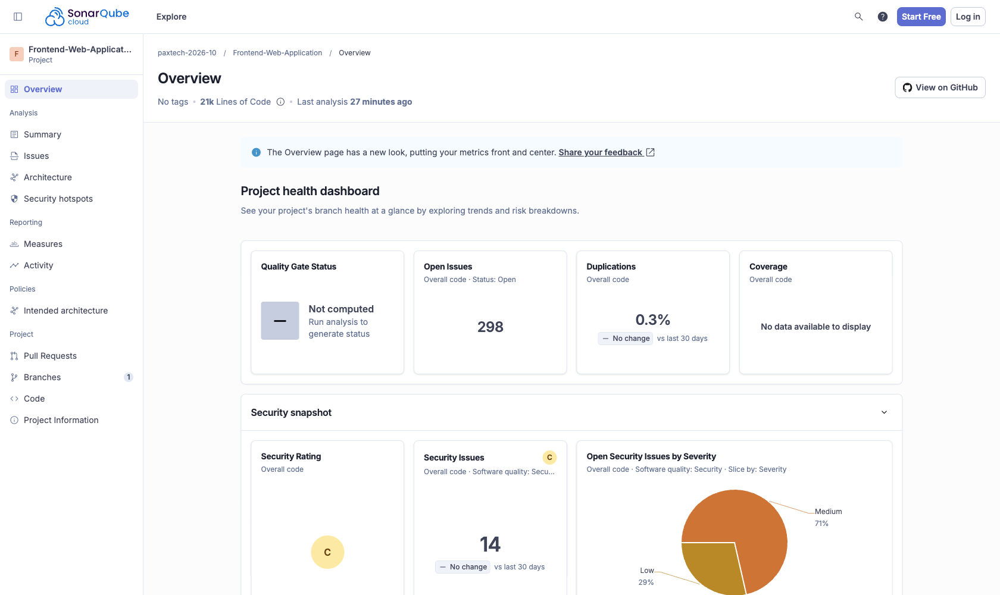

</div>

### 6.2.2. Reviews

El proceso de revisión de código en uTime se formalizó mediante Pull Requests obligatorios con al menos un aprobador antes de integrar cualquier rama a `develop` o `main`. A continuación se presentan las revisiones más representativas realizadas durante el ciclo de desarrollo:

| PR / Repositorio | Revisor | Fecha | Comentarios destacados | Estado |
|------------------|---------|-------|------------------------|--------|
| [#5 ci: add backend pr validation](https://github.com/paxtech-2026-10/Web-Services/pull/5) — `paxtech-2026-10/Web-Services` | alejooroncoy | 2026-05-14 | Revisión de la introducción del workflow `java-ci.yml`; verificación de que `mvn clean test` se ejecute en cada PR y que la cache de Maven esté configurada correctamente con hash del `pom.xml` | Aprobado y merged |
| [#2 feat(bdd): add Reservations BDD suite for US18](https://github.com/paxtech-2026-10/Frontend-Web-Application/pull/2) — `paxtech-2026-10/Frontend-Web-Application` | gael-rs | 2026-05-15 | Revisión de los feature files Gherkin para US18, validación de steps de Playwright y cobertura de escenarios feliz/triste para el flujo de reservas | Aprobado y merged |
| [#14 docs(cap6): add Reservations BDD + extend AV2/TB1 conclusions](https://github.com/paxtech-2026-10/utime-project-report/pull/14) — `paxtech-2026-10/utime-project-report` | yigabriel | 2026-05-15 | Revisión de la documentación de pruebas BDD del bounded context Reservations y ampliación de conclusiones de evidencia AV2/TB1 | Aprobado y merged |
| [#6 fix(readme): exhaustive consistency cleanup](https://github.com/paxtech-2026-10/utime-project-report/pull/6) — `paxtech-2026-10/utime-project-report` | yigabriel | 2026-04-28 | Auditoría completa de consistencia del README: corrección de HTML malformado, rutas de assets rotos, errores tipográficos y referencias a imágenes inexistentes | Aprobado y merged |
| [#2 docs: register functional requirements](https://github.com/UPC-PaxTech/uTime/pull/1) — `UPC-PaxTech/uTime` | alejooroncoy | 2026-04-10 | Revisión del registro inicial de requerimientos funcionales de los bounded contexts Marketplace y Products; verificación de completitud contra el backlog de user stories | Aprobado y merged |

## 6.3. Validation Interviews

### 6.3.1. Diseño de Entrevistas

Para esta segunda ronda de validación se diseñó una guía de entrevista que
parte de preguntas introductorias comunes y luego se divide en dos segmentos
objetivo. En cada segmento se mostró al entrevistado la Landing Page y la
Aplicación Móvil, recogiendo su retroalimentación tras cada artefacto.

**Preguntas introductorias:**

- ¿Cuál es tu nombre?
- ¿Cuánto tiempo llevas trabajando en el sector de belleza? / ¿Con qué frecuencia solicitas servicios de belleza?
- ¿Has usado alguna herramienta digital para reservas o todo lo haces por WhatsApp, redes u otro método?
- ¿Qué es lo que más te cuesta gestionar en el tema de reservas?

**Segmento Objetivo 1 — Dueños de Salones de Belleza o Barberías**

Preguntas tras mostrar la Landing Page:

- ¿Sientes que comunica bien la propuesta y beneficios del producto?
- ¿Qué sección o contenido te pareció más útil o llamativo?
- ¿Los planes que se ofrecen se ven claros y bien diferenciados?
- ¿Te animarías a probar una plataforma como esta luego de ver la landing?

Preguntas tras mostrar la Aplicación Móvil (vista del salón):

- ¿Fue fácil navegar y entender cómo funciona la gestión de citas?
- ¿Te resultó intuitiva la configuración de horarios y servicios?
- ¿Te parecen útiles las funciones de notificación automática y panel de reseñas?
- ¿Qué tan probable es que uses esta herramienta en tu negocio?
- ¿Te sentirías cómodo/a pagando por un plan si esto mejora la eficiencia de tu gestión?
- ¿Qué barreras o preocupaciones tendrías para adoptar uTime?

**Segmento Objetivo 2 — Clientes de servicios de belleza**

Preguntas tras mostrar la Landing Page:

- ¿Qué tan atractivo te parece el diseño y la organización del sitio?
- ¿Qué parte de la información te pareció más útil para ti como cliente?
- ¿Te daría confianza usar este sistema para reservar en lugar de escribir por redes?

Preguntas tras mostrar la Aplicación Móvil (vista cliente):

- ¿Fue sencillo registrarte y navegar por la aplicación?
- ¿Pudiste encontrar fácilmente un estilista y agendar una cita?
- ¿Qué opinas del flujo para elegir horario y método de pago?
- ¿Te gustaría recibir notificaciones o recordatorios como los que viste?
- ¿Te gustaría tener la opción de guardar tus salones favoritos o ver tu historial?
- ¿Qué tan probable es que uses uTime para reservar tus próximas citas?

Preguntas finales (cierre):

- ¿Qué es lo que más te gustó de uTime?
- ¿Qué aspecto te pareció confuso o poco útil?
- ¿Hay alguna funcionalidad que esperabas ver y no encontraste?

### 6.3.2. Registro de Entrevistas

### Segmento Objetivo 1 (Salones de Belleza y Barberías)

##### Datos del Entrevistado #1

- **Nombre completo:** Mileydi Patricia
- **Segmento Objetivo:** Dueña de salón de estética
- **Edad:** 24 años
- **Distrito:** San Borja
- **Inicio de la entrevista:** 0:15 minutos
- **Entrevistador:** RUIZ SÁNCHEZ, Gael
- **Screenshot del cuadro de video:** 

- **URL del video (Microsoft Stream):**

`https://upcedupe-my.sharepoint.com/personal/u20211g671_upc_edu_pe/_layouts/15/stream.aspx?id=%2Fpersonal%2Fu20211g671%5Fupc%5Fedu%5Fpe%2FDocuments%2Fupc%2Dpre%2D202502%2Dcc238%2D1807%2DPaxTech%2Dvalidation%2Dsprint%2D3%2Emp4`

**Resumen:**
Mileydi Patricia, esteticista con 5 años de experiencia en Estados Unidos. Ve la landing page de manera positiva; menciona que se ve con claridad la propuesta y características que ofrecería la aplicación, y que si estuviera en necesidad, pagaría por las suscripciones mencionadas. Luego de ver la aplicación móvil, comenta que le parece fácil de manipular y le interesan bastante las funciones de notificaciones automáticas y panel de gestión de citas. En general, no se presentaron críticas negativas aparte de la traducción al inglés por parte de la aplicación móvil.

##### Datos del Entrevistado #2

- **Nombre completo:** Maria Ysabel Sosa Rodriguez
- **Segmento Objetivo:** Dueña de un Salón de belleza
- **Edad:** 45 años
- **Distrito:** San Juan de Lurigancho
- **Inicio de la entrevista:** 3:06 minutos
- **Entrevistador:** RUIZ SÁNCHEZ, Gael
- **Screenshot del cuadro de video:** 

- **URL del video (Microsoft Stream):**

`https://upcedupe-my.sharepoint.com/personal/u20211g671_upc_edu_pe/_layouts/15/stream.aspx?id=%2Fpersonal%2Fu20211g671%5Fupc%5Fedu%5Fpe%2FDocuments%2Fupc%2Dpre%2D202502%2Dcc238%2D1807%2DPaxTech%2Dvalidation%2Dsprint%2D3%2Emp4`

**Resumen:**
María Isabel Sosa Rodríguez, dueña de un salón de belleza con 20 años de experiencia. Actualmente gestiona sus reservas solo por WhatsApp, lo cual le dificulta manejar los tiempos entre un servicio y otro. Calificó la aplicación móvil con un 10 en probabilidad de uso, describiéndola como organizada y con las herramientas necesarias, y confirmó que se sentiría cómoda pagando un plan para evitar cruces de clientes. Como crítica constructiva o mejora, solicitó añadir un espacio de "notas" o historial para registrar qué servicio se hizo el cliente y la fecha, evitando así que esa información se pierda en papeles.

### Segmento Objetivo 2 (Clientes de servicios de belleza)

#### Datos del Entrevistado #1

- **Nombre completo:** Anedyib Villar Bisso
- **Segmento Objetivo:** Clientes de servicio de belleza
- **Edad:** 20 años
- **Distrito:** San Isidro
- **Inicio de la entrevista:** 6:19 minutos
- **Entrevistador:** RUIZ SÁNCHEZ, Gael
- **Screenshot del cuadro de video:** 

- **URL del video (Microsoft Stream):**

`https://upcedupe-my.sharepoint.com/personal/u20211g671_upc_edu_pe/_layouts/15/stream.aspx?id=%2Fpersonal%2Fu20211g671%5Fupc%5Fedu%5Fpe%2FDocuments%2Fupc%2Dpre%2D202502%2Dcc238%2D1807%2DPaxTech%2Dvalidation%2Dsprint%2D3%2Emp4`

**Resumen:**
Anedyib Villar, cliente que solicita servicios de belleza una vez al mes. Menciona que lo que más le cuesta actualmente es la demora en las respuestas de los salones vía WhatsApp. Opinó que la landing page es bonita y completa, destacando la sección de "features" y el calendario interactivo, lo cual le genera más confianza que el método tradicional. Sobre la aplicación, reportó que el flujo de registro, elección de horario y método de pago fue muy sencillo, afirmando que la descargaría y usaría siempre si saliera en la Play Store. No encontró puntos confusos y valoró la opción de historial y salones favoritos.

#### Datos del Entrevistado #2

- **Nombre completo:** Edward Rodriguez
- **Segmento Objetivo:** Clientes de servicio de belleza
- **Edad:** 24 años
- **Distrito:** Santiago de Surco
- **Inicio de la entrevista:** 10:04 minutos
- **Entrevistador:** RUIZ SÁNCHEZ, Gael
- **Screenshot del cuadro de video:** 

- **URL del video (Microsoft Stream):**

`https://upcedupe-my.sharepoint.com/personal/u20211g671_upc_edu_pe/_layouts/15/stream.aspx?id=%2Fpersonal%2Fu20211g671%5Fupc%5Fedu%5Fpe%2FDocuments%2Fupc%2Dpre%2D202502%2Dcc238%2D1807%2DPaxTech%2Dvalidation%2Dsprint%2D3%2Emp4`

**Resumen:**
Edward Rodríguez, cliente frecuente que asiste a barberías cada 15 días. Expresa frustración por tener que ajustarse siempre a la disponibilidad de las barberías en lugar de poder elegir según su propia conveniencia. Considera que el diseño de la landing page está bien trabajado y le inspira confianza para reservar. Respecto a la aplicación móvil, destacó principalmente la función de geolocalización para encontrar salones cercanos y la rapidez del proceso. Como sugerencia clave, indicó que le gustaría que la aplicación pudiera sincronizar las citas directamente con Google Calendar para unificar sus notificaciones.

> **Nota:** Todos los videos de validación se encuentran consolidados en un único
> archivo. Los campos "Inicio de la entrevista" indican el minuto de inicio de
> cada entrevistado dentro de ese video compartido.

### 6.3.3. Evaluaciones según heurísticas

| # | Heurística de Nielsen              | Hallazgo                                                             | Severidad (0-4) | Recomendación                                                |
| - | ---------------------------------- | -------------------------------------------------------------------- | --------------- | ------------------------------------------------------------ |
| 1 | Consistencia y estándares          | Inconsistencias en la traducción al inglés de la aplicación móvil.   | 2               | Corregir textos y revisar el sistema de traducciones.        |
| 2 | Flexibilidad y eficiencia de uso   | Falta de un historial o registro de servicios realizados a clientes. | 2               | Incorporar notas e historial de atención por cliente.        |
| 3 | Correspondencia sistema-mundo real | Ausencia de integración con Google Calendar para gestionar citas.    | 2               | Permitir sincronización automática con calendarios externos. |
                |                 |               |

## 6.4. Auditoría de Experiencias de Usuario

### 6.4.1. Auditoría realizada

#### 6.4.1.1. Información del grupo auditado

| Campo | Valor |
|---------|---------|
| CARRERA | Ingeniería de Software |
| CURSO | Diseño de Experimentos de Ingeniería de Software |
| NRC | 10253 |
| PROFESORES | Juan Carlos Tinoco Licas |
| AUDITOR | Paxtech |
| CLIENTE(S) | awawaTech |

#### 6.4.1.2. Cronograma de auditoría realizada

| Fecha | Actividad | Responsable | Duración Estimada |
| :---- | :---- | :---- | :---- |
| 03/06/2026 | Recepción de Contendio para Auditoría | Gabriel Sanchez | 10 minutos |
| 03/06/2026 | Definición de alcance  y tareas a evaluar  | Gabriel Sanchez | 1 hora |
| 04/06/2026 | Realización de Auditoría Mobile | Gabriel Sanchez | 1 hora |
| 04/06/2026 | Realización de Auditoría Web | Gabriel Sanchez | 1 hora |
| 04/06/2026 | Clasificación de problemas encontrados | Gabriel Sanchez | 30 minutos |
| 04/06/2026 | Redacción de Conclusiones y Mejoras | Gabriel Sanchez | 1 hora |
| 05/06/2026 | Envío de Auditoría a Grupo Auditado | Gabriel Sanchez | 10 minutos |

#### 6.4.1.3. Contenido de auditoría realizada

##### SITE o APP A EVALUAR

**Nombre de la aplicación:** Mecanaut

---

##### TAREAS A EVALUAR

El alcance de esta evaluación incluye la revisión de la usabilidad de las siguientes tareas:

1. Asignar técnicos a órdenes de trabajo.
2. Gestionar activos y maquinarias.
3. Navegar entre los módulos del sistema mediante el menú lateral.
4. Crear nuevas órdenes de trabajo mediante formularios modales.
5. Consultar información y detalles de órdenes de trabajo.

##### No están incluidas en esta evaluación las siguientes tareas:

1. Consulta del dashboard principal.
2. Ejecución completa de órdenes de trabajo.
3. Finalización de tareas de mantenimiento.
4. Creación completa de planes de mantenimiento.
5. Registro detallado de planes de mantenimiento.
6. Registro y gestión completa de maquinarias y activos.
7. Gestión de usuarios y permisos.
8. Configuración general del sistema.
9. Reportes y análisis.
10. Notificaciones del sistema.
11. Integraciones externas.
12. Cualquier funcionalidad no representada visualmente en las pantallas evaluadas.
---

##### ESCALA DE SEVERIDAD

Los errores serán puntuados tomando en cuenta la siguiente escala de severidad:

| Nivel | Descripción |
|---------|---------|
| **1** | Problema superficial: puede ser fácilmente superado por el usuario o ocurre con muy poca frecuencia. No necesita ser arreglado a no ser que exista disponibilidad de tiempo. |
| **2** | Problema menor: puede ocurrir con mayor frecuencia o es un poco más difícil de superar para el usuario. Se le debería asignar una prioridad baja para resolverlo de cara al siguiente release. |
| **3** | Problema mayor: ocurre frecuentemente o los usuarios no son capaces de resolverlo. Es importante que sean corregidos y se les debe asignar una prioridad alta. |
| **4** | Problema muy grave: un error de gran impacto que impide al usuario continuar con el uso de la herramienta. Es imperativo que sea corregido antes del lanzamiento. |

---

##### TABLA RESUMEN

| # | Problema | Escala de severidad | Heurística/Principio violada(o) |
|---|---|---:|---|
| 1 | Falta de contexto en la asignación de técnicos y maquinaria | 3 | Reconocimiento antes que recuerdo |
| 2 | Ausencia de mecanismos visibles para agilizar tareas repetitivas | 2 | Flexibilidad y eficiencia de uso |
| 3 | Navegación basada únicamente en iconos | 4 | Reconocimiento antes que recuerdo |
| 4 | Distribución ineficiente del espacio visual y baja densidad informativa | 2 | Diseño estético y minimalista |
| 5 | Bajo contraste visual que afecta la legibilidad | 3 | Diseño estético y minimalista |
| 6 | Inconsistencia en la jerarquía y ubicación de acciones principales | 3 | Consistencia y estándares |

---

##### DESCRIPCIÓN DE PROBLEMAS

---

###### PROBLEMA #1: Falta de contexto en la asignación de técnicos y maquinaria

**Severidad:** 3

**Heurística violada:** Reconocimiento antes que recuerdo

**Problema**

Durante el proceso de asignación de técnicos a una orden de trabajo, el sistema presenta listas desplegables con identificadores de maquinaria (por ejemplo, MT-430, MT-450) sin información contextual adicional que permita diferenciarlas rápidamente. El usuario debe recordar previamente características relevantes de cada máquina, como su ubicación, estado o prioridad, para realizar la asignación correcta.

Este diseño incrementa la carga cognitiva y aumenta la probabilidad de errores, especialmente cuando existen múltiples máquinas con nomenclaturas similares. La situación resulta más crítica para usuarios nuevos o para quienes gestionan un gran volumen de activos diariamente.

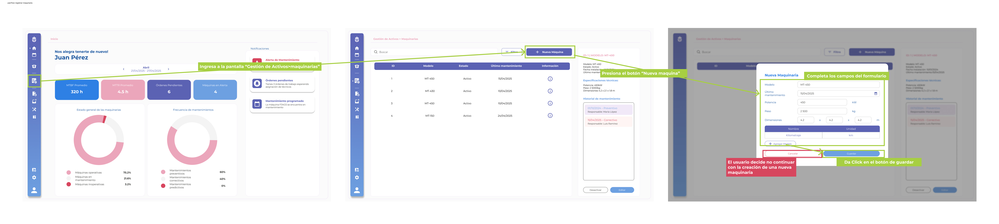

**Recomendación**

Complementar los identificadores de maquinaria con información descriptiva relevante, como ubicación, estado operativo, prioridad o nombre del activo. También se recomienda incorporar búsquedas inteligentes o vistas resumidas que permitan al usuario reconocer rápidamente la opción adecuada sin depender de la memoria.

---

###### PROBLEMA #2: Ausencia de mecanismos visibles para agilizar tareas repetitivas

**Severidad:** 2

**Heurística violada:** Flexibilidad y eficiencia de uso

**Problema**

Los flujos observados para registrar maquinaria, crear planes de mantenimiento y asignar técnicos muestran formularios que requieren ingresar información manualmente campo por campo. En las capturas no se evidencian mecanismos que permitan acelerar tareas frecuentes, como plantillas predefinidas, autocompletado, sugerencias automáticas o reutilización de configuraciones previas.

Aunque este enfoque puede ser suficiente para usuarios ocasionales, los usuarios frecuentes que realizan estas tareas de manera repetitiva podrían invertir más tiempo del necesario en completar procesos administrativos similares.


**Recomendación**

Incorporar funcionalidades orientadas a mejorar la eficiencia de usuarios recurrentes, tales como:

- Plantillas reutilizables para planes de mantenimiento.
- Autocompletado de información frecuente.
- Valores predeterminados según el tipo de maquinaria.
- Copia de configuraciones existentes.
- Atajos o acciones rápidas para tareas repetitivas.

---

###### PROBLEMA #3: Navegación basada únicamente en iconos

**Severidad:** 4

**Heurística violada:** Reconocimiento antes que recuerdo

**Problema**

El menú lateral de navegación está compuesto principalmente por iconos sin etiquetas textuales visibles. Aunque algunos iconos pueden resultar familiares para usuarios experimentados, otros pueden ser ambiguos o difíciles de interpretar sin conocimiento previo del sistema.

La ausencia de texto obliga al usuario a memorizar el significado de cada icono o explorar distintas secciones hasta encontrar la funcionalidad deseada. Este problema afecta especialmente a usuarios nuevos y aumenta la curva de aprendizaje de la aplicación.


**Recomendación**

Incorporar etiquetas de texto visibles junto a los iconos o mostrar tooltips descriptivos al pasar el cursor. Además, se recomienda resaltar claramente la sección activa para mejorar la orientación durante la navegación.

---

###### PROBLEMA #4: Tarjetas con métricas sin facilidad de identificación

**Severidad:** 2

**Heurística violada:** Visibilidad del estado del sistema

**Problema**

En el dashboard, las tarjetas de métricas "MTBF Promedio" y "MTTR Promedio" no indican a qué período corresponden ni si los valores son favorables o desfavorables. El usuario no sabe si 320h o 4.5h son valores buenos, malos o dentro del rango esperado.
Las tarjetas muestran únicamente el valor numérico y la etiqueta de la métrica. No hay indicadores visuales (semáforos, flechas de tendencia, rangos objetivo) que contextualicen el dato. Por ende, un supervisor o técnico sin conocimiento profundo de los KPIs no puede interpretar si el estado actual requiere acción inmediata o es satisfactorio, reduciendo la utilidad del dashboard como herramienta de toma de decisiones.

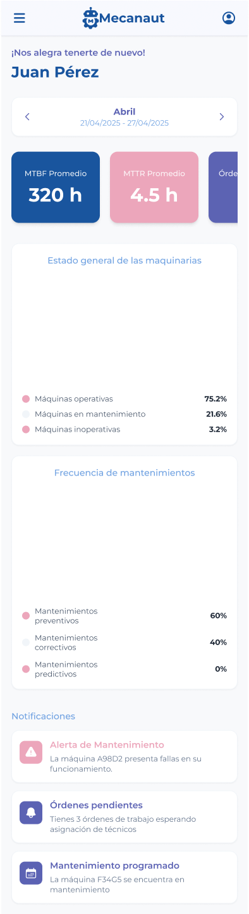


**Recomendación**

Agregar indicadores de tendencia (↑↓), colores semafóricos (verde/ámbar/rojo) y un rango objetivo visible en cada tarjeta métrica. Por ejemplo: "Meta: > 300h" junto al valor de MTBF. Una tarjeta informativa tambien que ayude a usuarios sin conocimiento extenso a entender las metricas presentadas

---

###### PROBLEMA #5: Bajo contraste visual que afecta la legibilidad

**Severidad:** 3

**Heurística violada:** Diseño estético y minimalista

**Problema**

La interfaz utiliza múltiples elementos visuales con bajo contraste, dificultando la lectura y diferenciación entre componentes interactivos y contenido informativo.

Se observan placeholders muy tenues, etiquetas secundarias en tonos grises claros, botones deshabilitados prácticamente invisibles y textos con poca separación visual respecto al fondo. Esto puede generar dificultades de lectura, especialmente en dispositivos móviles, ambientes con iluminación variable o usuarios con limitaciones visuales.

La reducción de contraste disminuye la accesibilidad y puede incrementar el esfuerzo necesario para completar tareas simples.


**Recomendación**

Incrementar el contraste entre texto, fondo y componentes interactivos utilizando combinaciones de colores que cumplan estándares de accesibilidad. También se recomienda diferenciar estados deshabilitados mediante cambios adicionales además del color.


---

###### PROBLEMA #6: Inconsistencia en la jerarquía y ubicación de acciones principales

**Severidad:** 3

**Heurística violada:** Consistencia y estándares

**Problema**

Las acciones principales y secundarias no mantienen una estructura consistente entre distintas pantallas y modales, generando cambios innecesarios en los patrones de interacción.

Se observa que algunos modales presentan el botón principal en una posición distinta respecto a otros, mientras que ciertas acciones secundarias aparecen arriba, abajo o con diferentes estilos visuales (relleno, borde, color). Esta inconsistencia obliga al usuario a reaprender la ubicación y jerarquía de acciones cada vez que cambia de contexto.

La falta de consistencia aumenta la carga cognitiva y puede incrementar la probabilidad de errores de interacción.


---

##### OBSERVACIONES GENERALES

- Los problemas identificados afectan principalmente la eficiencia y facilidad de uso para usuarios nuevos.
- La incorporación de contexto visual y una mejor jerarquización de la información mejoraría significativamente la experiencia de uso.
- Se recomienda complementar la evaluación heurística con pruebas de usuario para validar el impacto real de estos hallazgos.


### 6.4.2. Auditoría recibida

#### 6.4.2.1. Información del grupo auditor

| Campo      | Valor                                            |
| ---------- | ------------------------------------------------ |
| CARRERA    | Ingeniería de Software                           |
| CURSO      | Diseño de Experimentos de Ingeniería de Software |
| NRC        | 10253                                            |
| PROFESORES | Juan Carlos Tinoco Licas                         |
| AUDITOR    | awawaTech                                        |
| CLIENTE(S) | Paxtech                                          |

#### 6.4.2.2. Cronograma de auditoría recibida

<table>
  <thead>
    <tr>
      <th style="text-align: left; width: 45%;">Actividad</th>
      <th style="text-align: left; width: 15%;">Fecha</th>
      <th style="text-align: left; width: 25%;">Responsable</th>
      <th style="text-align: left; width: 15%;">Duración estimada</th>
    </tr>
  </thead>
  <tbody>
    <tr>
      <td>Recepción de accesos y material a evaluar</td>
      <td>06/06/2026</td>
      <td>Mauricio Elera, Ariana Agreda</td>
      <td>10 minutos</td>
    </tr>
    <tr>
      <td>Definición del alcance y selección de tareas principales</td>
      <td>10/06/2026</td>
      <td>Mauricio Elera, Ariana Agreda</td>
      <td>1 hora</td>
    </tr>
    <tr>
      <td>Ejecución de auditoría heurística (Entorno Web)</td>
      <td>11/06/2026</td>
      <td>Mauricio Elera</td>
      <td>2 horas</td>
    </tr>
    <tr>
      <td>Ejecución de auditoría heurística (Entorno Móvil)</td>
      <td>11/06/2026</td>
      <td>Ariana Agreda</td>
      <td>2 horas</td>
    </tr>
    <tr>
      <td>Evaluación de severidad y clasificación de hallazgos</td>
      <td>12/06/2026</td>
      <td>Ariana Agreda, Mauricio Elera</td>
      <td>1 hora</td>
    </tr>
    <tr>
      <td>Consolidación, redacción de conclusiones y cierre de informe</td>
      <td>12/06/2026</td>
      <td>Mauricio Elera, Ariana Agreda</td>
      <td>1 hora</td>
    </tr>
  </tbody>
</table>


#### 6.4.2.3. Contenido de auditoría recibida

# SITE o APP A EVALUAR

**Nombre de la aplicación:** uTime

---

##### TAREAS A EVALUAR

El alcance de esta evaluación incluye la revisión de la usabilidad de las siguientes tareas principales (abarcando los entornos Móvil y Web):

1. Explorar salones cercanos en la pantalla de inicio y gestionar permisos de ubicación.
2. Realizar el flujo completo de programación de una cita (selección de profesional, fecha, hora y revisión del resumen de pago).
3. Consultar el historial de citas programadas y ejecutar acciones sobre ellas (cancelación).
4. Visualizar y analizar planes de suscripción para proveedores (Web).
5. Consultar el listado de servicios ofrecidos y sus detalles (Web).
6. Revisar el panel de calificaciones y reseñas del establecimiento (Web).

##### No están incluidas en esta evaluación las siguientes tareas:

1. Proceso de registro de usuario (Sign Up), inicio de sesión (Login) y recuperación de contraseñas.
2. Visualizar y editar datos en el perfil de usuario.
3. Ejecución y procesamiento real de pagos en pasarelas externas (ej. Stripe).
4. Creación, edición y eliminación de nuevos servicios en el panel de proveedor.
5. Gestión avanzada y exportación de la base de datos de clientes.
6. Configuración de métodos de pago y facturación.
7. Recepción e interacción con notificaciones push o correos electrónicos del sistema.
8. Flujo de redacción y publicación de una nueva reseña por parte del cliente.
9. Uso del buscador avanzado y aplicación de filtros para encontrar salones.
10. Cualquier funcionalidad o configuración interna no representada visualmente en las pantallas proporcionadas.

---

##### ESCALA DE SEVERIDAD

Los errores serán puntuados tomando en cuenta la siguiente escala de severidad:

| Nivel | Descripción                                                                                                                                                                                    |
| ----- | ---------------------------------------------------------------------------------------------------------------------------------------------------------------------------------------------- |
| **1** | Problema superficial: puede ser fácilmente superado por el usuario o ocurre con muy poca frecuencia. No necesita ser arreglado a no ser que exista disponibilidad de tiempo.                   |
| **2** | Problema menor: puede ocurrir con mayor frecuencia o es un poco más difícil de superar para el usuario. Se le debería asignar una prioridad baja para resolverlo de cara al siguiente release. |
| **3** | Problema mayor: ocurre frecuentemente o los usuarios no son capaces de resolverlo. Es importante que sean corregidos y se les debe asignar una prioridad alta.                                 |
| **4** | Problema muy grave: un error de gran impacto que impide al usuario continuar con el uso de la herramienta. Es imperativo que sea corregido antes del lanzamiento.                              |

---

##### TABLA RESUMEN

| #   | Problema                                                                | Escala de severidad | Heurística/Principio violada(o)                                                |
| --- | ----------------------------------------------------------------------- | ------------------: | ------------------------------------------------------------------------------ |
| 1   | Uso contraintuitivo del color verde para horarios bloqueados            |                   3 | Relación entre el sistema y el mundo real / Consistencia y estándares          |
| 2   | Errores críticos de mapeo de datos e inconsistencia de moneda           |                   4 | Prevención de errores / Consistencia y estándares                              |
| 3   | Inconsistencia de idioma en flujos principales                          |                   3 | Consistencia y estándares                                                      |
| 4   | Acción destructiva instantánea y confusión visual por color primario    |                   4 | Prevención de errores / Control y libertad del usuario                         |
| 5   | Falta de affordance en la solicitud de permisos de ubicación            |                   3 | Consistencia y estándares                                                      |
| 6   | Confirmación de reserva mediante alerta nativa del navegador            |                   4 | Consistencia y estándares / Diseño estético y minimalista                      |
| 7   | Errores de mapeo de datos y exposición de valores del sistema           |                   3 | Relación entre el sistema y el mundo real                                      |
| 8   | Inconsistencia de idioma (Spanglish) en componentes principales         |                   3 | Consistencia y estándares                                                      |
| 9   | Falta de visibilidad del estado en los planes de suscripción            |                   3 | Visibilidad del estado del sistema / Prevención de errores                     |
| 10  | Exposición de jerga del sistema por ausencia de un "estado vacío" (NaN) |                   3 | Relación entre el sistema y el mundo real / Visibilidad del estado del sistema |

---

##### DESCRIPCIÓN DE PROBLEMAS

---

###### PROBLEMA #1: Uso contraintuitivo del color verde para horarios bloqueados

**Severidad:** 3

**Heurística violada:** Relación entre el sistema y el mundo real / Consistencia y estándares

**Problema**

En la leyenda y en la cuadrícula de horas, el estado "Booked" (Reservado/Bloqueado) utiliza un color verde claro. Universalmente, el color verde indica "Disponible", "Éxito" o "Avanzar". Esto provoca un choque mental inmediato; los usuarios intentarán presionar los botones verdes asumiendo que están libres, lo que generará frustración al no obtener respuesta del sistema.

<div align="center">
  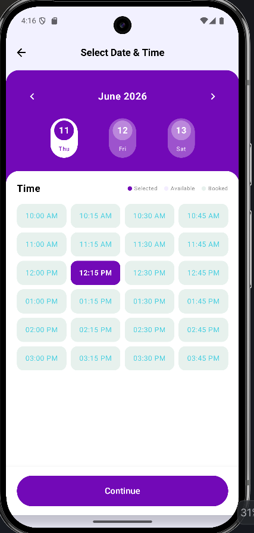
</div>

**Recomendación**

Alinear los colores con los modelos mentales establecidos. Se recomienda usar gris o un color de baja opacidad para los horarios bloqueados (indicando que están deshabilitados), y dejar el color de fondo normal (blanco o claro) para los horarios disponibles.

---

###### PROBLEMA #2: Errores críticos de mapeo de datos e inconsistencia de moneda

**Severidad:** 4

**Heurística violada:** Prevención de errores / Consistencia y estándares

**Problema**

En la pantalla de resumen de la reserva hemos identificado dos problemas que impactan directamente la experiencia del usuario antes del pago. Primero, el nombre del profesional se muestra bajo una etiqueta incorrecta ("Gender Type: jose"). Segundo, el costo individual del servicio aparece en Soles (S/10.00), mientras que el Subtotal y Total figuran en Dólares ($10.00). Esta inconsistencia en los símbolos de moneda puede generar confusión y provocar que el usuario abandone la reserva por temor a un cobro erróneo.

<div align="center">
  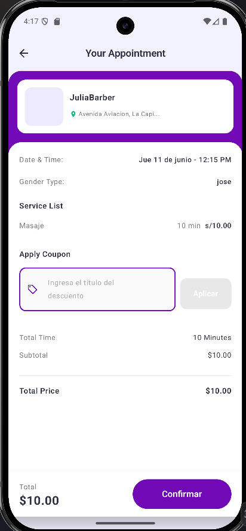
</div>

**Recomendación**

Corregir el mapeo de variables desde el backend para que la etiqueta indique "Profesional" o "Especialista". Unificar y forzar el formato de moneda en toda la aplicación para que todos los montos se muestren en la moneda local correspondiente.

---

###### PROBLEMA #3: Inconsistencia de idioma en flujos principales

**Severidad:** 3

**Heurística violada:** Consistencia y estándares

**Problema**

A lo largo del flujo de reserva y en el historial de citas, la aplicación mezcla constantemente español e inglés. Se observan títulos como "Your Appointment" o "My Appointment Booking" junto a servicios como "Masaje", y botones que alternan entre "Confirmar", "Rebook" o estados como "Completed". Esta falta de consistencia en el idioma puede desorientar al usuario y afectar la percepción de calidad de la plataforma.

<div align="center">
  
   
  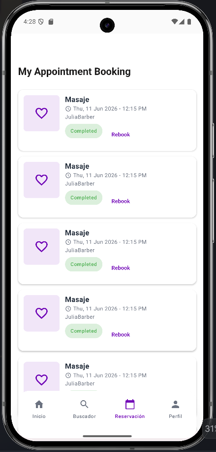
</div>

**Recomendación**

Se recomienda implementar un sistema de internacionalización (i18n). Es importante asegurar que todo el texto estático de la interfaz (títulos, etiquetas, botones, formatos de fecha) se renderice de manera uniforme en un solo idioma, basado en la configuración del dispositivo o la cuenta del usuario.

---

###### PROBLEMA #4: Acción destructiva instantánea y confusión visual por color primario

**Severidad:** 4

**Heurística violada:** Prevención de errores / Control y libertad del usuario

**Problema**

En la pantalla de detalle de cita, la opción "Cancelar cita" se muestra como un texto simple, sin apariencia de botón. El problema se agrava porque utiliza el color morado, que es el color principal de la plataforma destinado a acciones positivas o de avance. Esta presentación visual puede inducir al usuario a error al no identificar claramente el elemento como una acción destructiva. Dado que al presionarlo la cita se elimina de forma inmediata, el riesgo de que el usuario borre una reserva importante por un toque accidental es muy alto.

<div align="center">
  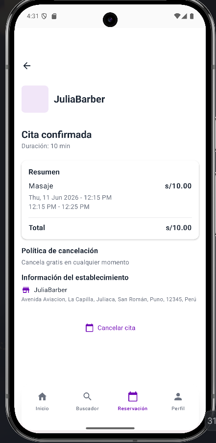
</div>

**Recomendación**

Recomendamos modificar el diseño visual de "Cancelar cita" para que cuente con un estilo de un botón y utilizar un color que se diferencie del primario (como texto rojo o un estilo de botón secundario) para advertir que es una acción destructiva. Asimismo, es necesario implementar un diálogo de confirmación (Modal) que pregunte "¿Estás seguro de que deseas cancelar tu cita?" antes de procesar la eliminación.

---

###### PROBLEMA #5: Falta de affordance en la solicitud de permisos de ubicación

**Severidad:** 3

**Heurística violada:** Consistencia y estándares

**Problema**

En la pantalla de inicio, el texto "Permitir acceso a ubicación" funciona como un disparador para abrir el modal de permisos del sistema operativo. Sin embargo, visualmente es idéntico a un texto descriptivo o subtítulo. Los usuarios no tienen forma intuitiva de saber que pueden interactuar con él, lo que impide que la función principal de "Salones Cercanos" opere correctamente.

<div align="center">
  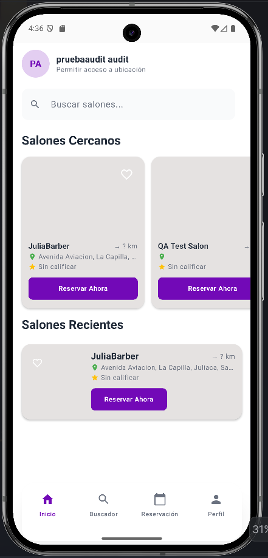
</div>

**Recomendación**

Transformar el texto estático en un elemento claramente accionable. Se puede utilizar el color principal (morado), añadir un subrayado, usar un ícono de botón nativo o, como mejor práctica, mostrar una tarjeta contextual vacía en la sección de "Salones Cercanos" que invite al usuario a habilitar la ubicación mediante un botón claro.

---

###### PROBLEMA #6: Confirmación de reserva mediante alerta nativa del navegador

**Severidad:** 4

**Heurística violada:** Consistencia y estándares / Diseño estético y minimalista

**Problema**

El problema más crítico de todo el flujo sucede al intentar seleccionar el bloque de tiempo. Exactamente en la pantalla de "Elegir Horario", el sistema utiliza un cuadro de diálogo nativo del sistema/navegador (window.confirm) para solicitar la confirmación de la reserva.

<div align="center">
  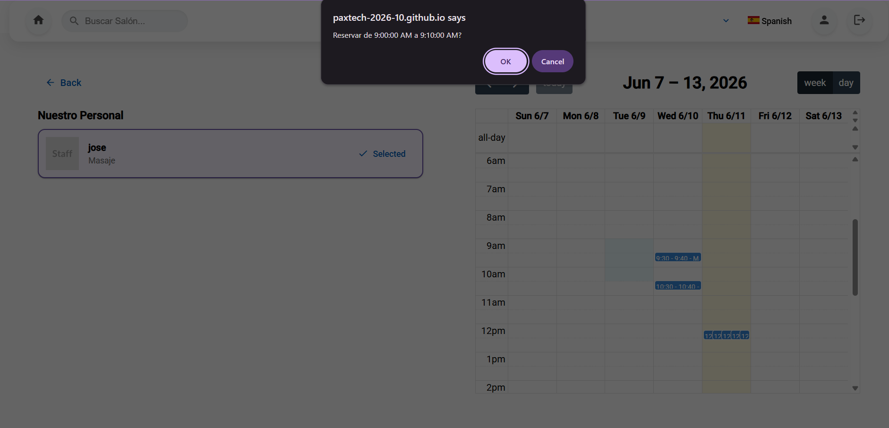
</div>

**Recomendación**

Se debe reemplazar de inmediato la alerta nativa del navegador por un componente "Modal" (ventana emergente) diseñado a medida (Custom UI). Este modal debe integrarse visualmente con el diseño de la aplicación web, respetando la identidad visual (tipografía, colores de la marca), mostrando de forma clara el resumen de la fecha y hora seleccionada, y utilizando botones propios para "Confirmar" o "Cancelar".

---

###### PROBLEMA #7: Errores de mapeo de datos y exposición de valores del sistema

**Severidad:** 3

**Heurística violada:** Relación entre el sistema y el mundo real

**Problema**

Al revisar las tarjetas de detalle en la sección "Tus Citas", se evidencia que la interfaz está renderizando datos crudos de la base de datos o mapeando variables incorrectas en lugar de mostrar información contextualizada. Específicamente, el título de la cita y el nombre del "Salón" muestran un correo electrónico (julia@gmail.com), mientras que el campo "Cliente" expone un ID numérico (1) en lugar de un nombre.

El sistema debe hablar el lenguaje del usuario, no el del backend. Mostrar identificadores numéricos o correos genéricos en lugar de nombres comerciales o personales genera confusión inmediata, ya que el usuario no puede reconocer a simple vista con quién o en dónde es su cita exactamente.

<div align="center">
  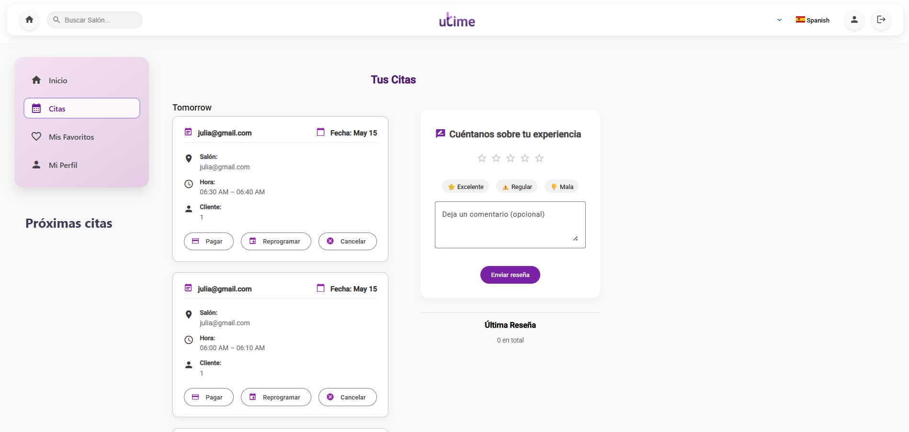
</div>

**Recomendación**

Se sugiere auditar los _endpoints_ del backend que alimentan esta vista para asegurar que el frontend esté consumiendo las propiedades correctas del objeto. El campo "Salón" debe apuntar al nombre comercial del establecimiento (ej. "Julia Barber"), el campo "Cliente" debe mostrar el nombre y apellido del usuario, y el título principal de la tarjeta debería reflejar el nombre del servicio reservado (ej. "Masaje").

---

###### PROBLEMA #8: Inconsistencia de idioma (Spanglish) en componentes principales

**Severidad:** 3

**Heurística violada:** Consistencia y estándares

**Problema**

En la vista de gestión de "Services", se evidencia una falla en la aplicación de las traducciones. A pesar de que el usuario ha seleccionado explícitamente el idioma inglés ("English") en el menú de navegación superior, elementos clave de la interfaz permanecen codificados de forma rígida en español. El caso más notorio es el botón de acción principal para crear un registro, el cual muestra el texto "Nuevo servicio".

<div align="center">
  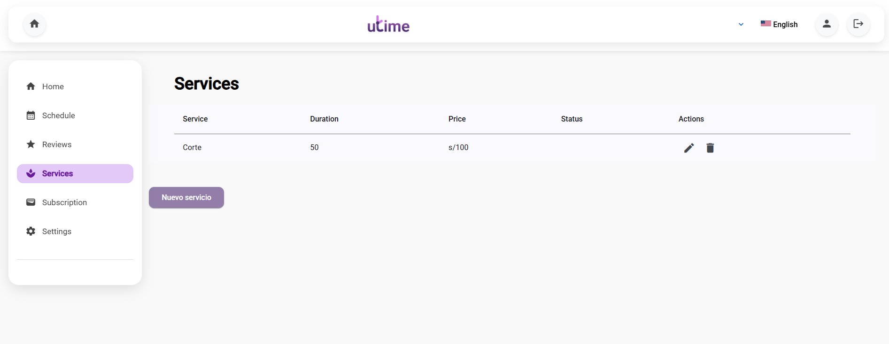
</div>

**Recomendación**

Revisar el sistema de internacionalización (i18n) para garantizar que absolutamente todos los textos estáticos, en especial los botones y llamadas a la acción (CTAs), estén correctamente mapeados a sus respectivos archivos de traducción. Asimismo, se recomienda añadir la medida de tiempo en la columna de duración (ej. "50 min") para mejorar la legibilidad de los datos.

---

###### PROBLEMA #9: Falta de visibilidad del estado en los planes de suscripción

**Severidad:** 3

**Heurística violada:** Visibilidad del estado del sistema / Prevención de errores

**Problema**

En la vista de Suscripción, el sistema indica correctamente en la parte superior que el plan activo del usuario es "ProStyle". Sin embargo, al observar las tarjetas de precios en la parte inferior, la tarjeta correspondiente a dicho plan sigue mostrando un botón habilitado con el texto "Choose", viéndose idéntico al resto de las opciones no adquiridas. Esta desconexión entre el estado real de la cuenta y las acciones presentadas en pantalla genera ambigüedad, y podría inducir al usuario al error de intentar adquirir o procesar el pago de un plan que ya posee.

<div align="center">
  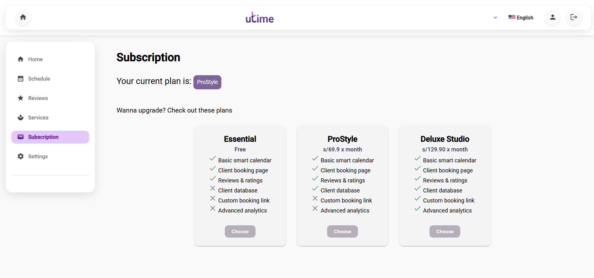
</div>

**Recomendación**

Implementar una validación visual en el _frontend_ que reconozca el plan activo del proveedor y actualice el estado de su tarjeta correspondiente. El botón del plan actual debe cambiar de estado (por ejemplo, deshabilitarse) y modificar su texto por un indicador claro como "Plan Actual" (o "Current Plan"), diferenciándose claramente de los planes que sí están disponibles para un _upgrade_.

---

###### PROBLEMA #10: Exposición de jerga del sistema por ausencia de un "estado vacío" (NaN)

**Severidad:** 3

**Heurística violada:** Relación entre el sistema y el mundo real / Visibilidad del estado del sistema

**Problema**

En la vista principal de "Reviews", hemos detectado un error técnico expuesto directamente en la interfaz: el puntaje general muestra el valor "NaN" (_Not a Number_) junto al ícono de la estrella.

Este es un detalle muy común en el desarrollo que ocurre cuando el sistema intenta calcular el promedio de calificaciones pero se encuentra con un divisor de cero (dado que actualmente hay "0 Reviews"). Mostrar términos de error de programación como "NaN" viola la regla de hablar en el lenguaje del usuario y del mundo real. Esto puede desconcertar al proveedor y darle la impresión de que la plataforma está "rota" o presenta fallos de programación.

<div align="center">
  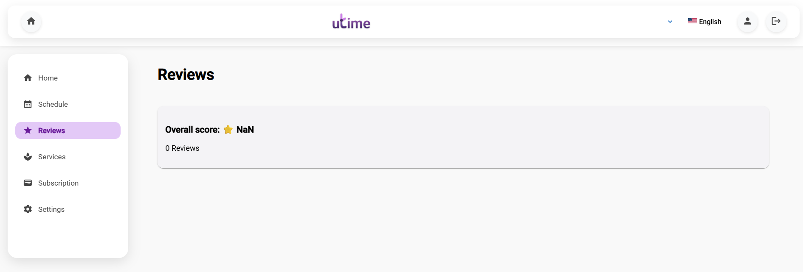
</div>

**Recomendación**

Sugerimos implementar un manejo adecuado de "Estados Vacíos" (_Empty States_). A nivel de código, se debe agregar una pequeña validación antes de calcular el promedio general: si el contador de reseñas es igual a 0, el sistema debe evitar la operación matemática y renderizar en pantalla un valor amigable, como "0", un guion ("-"), o un mensaje constructivo como "Aún no tienes calificaciones".

---

##### CONCLUSIONES

**Aplicación Web**

1. La interfaz expone frecuentemente lógica y variables del sistema (uso de alertas nativas del navegador, errores "NaN", exposición de IDs y correos en lugar de nombres), lo que rompe la relación con el mundo real y disminuye drásticamente la confianza del usuario.
2. Existen fallas en la visibilidad del estado actual del sistema (como botones habilitados en planes de suscripción ya activos), lo que incrementa la carga cognitiva y obliga al usuario a recordar su contexto para evitar errores o pagos redundantes.
3. La falta de un sistema de internacionalización (i18n) sólido en componentes clave (vistas de servicios y suscripciones) genera inconsistencias visuales y de comunicación que afectan la percepción de calidad del producto final.

**Aplicación Móvil**

1. Existen inconsistencias estructurales en el manejo del idioma, el mapeo de datos y los formatos (como la moneda), las cuales impactan negativamente en la percepción de calidad y la confianza del usuario durante los flujos de pago.
2. Algunas decisiones de diseño visual limitan la interactividad (falta de _affordance_ en botones y enlaces) y contradicen modelos mentales universales, dificultando que los usuarios reconozcan acciones clave.
3. La arquitectura de interacción presenta vulnerabilidades en la prevención de errores, careciendo de fricción positiva (confirmaciones) ante acciones destructivas, lo que eleva el riesgo de equivocaciones por parte del usuario.

---

##### OBSERVACIONES GENERALES

- **Impacto directo en la credibilidad y conversión:** Gran parte de los problemas de severidad alta (inconsistencias de moneda, mezcla de idiomas y exposición de jerga técnica como "NaN" o datos crudos) afectan la percepción de seguridad de la plataforma. En un entorno de reservas y pagos, estos detalles pueden traducirse en una alta tasa de abandono por desconfianza del usuario.
- **Vulnerabilidades en la prevención de errores:** Se identificó un patrón de riesgo crítico relacionado con la falta de "fricción positiva". Acciones destructivas (como cancelar una cita) ocurren de forma instantánea, y las confirmaciones web dependen de alertas nativas del navegador. Implementar Modales de confirmación personalizados reducirá drásticamente la frustración por errores accidentales.
- **Brechas en los modelos mentales y affordance:** Existen decisiones visuales que contradicen la intuición del usuario (ej. usar color verde para horarios bloqueados o botones visualmente idénticos para planes de suscripción ya adquiridos). Aclarar estos estados visuales mejorará la curva de aprendizaje de los usuarios nuevos.
- **Necesidad de estandarización omnicanal:** Se recomienda consolidar los componentes bajo un único Sistema de Diseño y centralizar la internacionalización (i18n). Esto garantizará que tanto el cliente (en la app móvil) como el proveedor (en la plataforma web) experimenten coherencia visual, de lenguaje y de formatos (como el uso estricto de la moneda local).


#### 6.4.2.4. Resumen de modificaciones para subsanar hallazgos

| \# | Hallazgo | Severidad | Acción correctiva | Responsable | Estado |
| :---- | :---- | :---- | :---- | :---- | :---- |
| 1 | Uso contraintuitivo del color verde para horarios bloqueados (Móvil) | 3 | Cambiar el color de los horarios "Booked" a gris o baja opacidad (deshabilitado) y reservar el fondo claro/blanco para los disponibles, alineando con los modelos mentales del usuario. | Jorge | Resuelto |
| 2 | Errores críticos de mapeo de datos e inconsistencia de moneda (Móvil) | 4 | Corregir el mapeo de variables en backend para que la etiqueta muestre "Profesional/Especialista"; unificar y forzar el formato de moneda local en toda la app. | Jorge | Resuelto |
| 3 | Inconsistencia de idioma (español/inglés) en flujos principales (Móvil) | 3 | Renderizar todo el texto estático en un solo idioma según la configuración del dispositivo o cuenta con i18n. | Jorge | Resuelto |
| 4 | Acción destructiva instantánea y confusión visual por color primario "Cancelar cita" (Móvil) | 4 | Rediseñar "Cancelar cita" como botón con estilo destructivo (rojo/secundario) y añadir modal de confirmación antes de eliminar la reserva. | Jorge | Resuelto |
| 5 | Falta de affordance en la solicitud de permisos de ubicación (Móvil) | 3 | Convertir el texto en un elemento accionable claro (color primario, subrayado, ícono o tarjeta contextual vacía con botón "Habilitar ubicación"). | Jorge | Resuelto |
| 6 | Confirmación de reserva mediante alerta nativa del navegador (window.confirm) (Web) | 4 | Reemplazar la alerta nativa por un modal personalizado (Custom UI) alineado a la identidad visual, con resumen de fecha/hora y botones propios "Confirmar/Cancelar". | Jorge | Resuelto |
| 7 | Errores de mapeo de datos y exposición de valores del sistema (correos, IDs) en "Tus Citas" (Web) | 3 | Auditar endpoints para consumir las propiedades correctas: "Salón" → nombre comercial, "Cliente" → nombre y apellido, título → nombre del servicio. | Jorge | Resuelto |
| 8 | Inconsistencia de idioma (español/inglés) (Web) | 3 | Mapear todos los textos estáticos y CTAs a los archivos de traducción del i18n; añadir unidad de tiempo a la columna de duración (ej. "50 min"). | Jorge | Resuelto |
| 9 | Falta de visibilidad del estado en los planes de suscripción (botón "Choose" en plan activo) (Web) | 3 | Validar el plan activo en frontend y deshabilitar/etiquetar su tarjeta como "Plan Actual / Current Plan", diferenciándola de los planes disponibles para upgrade. | Jorge | Resuelto |
| 10 | Exposición de jerga del sistema por ausencia de "estado vacío" ("NaN" en Reviews) (Web) | 3 | Validar el contador de reseñas antes de calcular el promedio: si es 0, evitar la operación y mostrar un valor amigable ("0", "-" o "Aún no tienes calificaciones"). | Jorge | Resuelto |

<div class="page"></div>

# Capítulo VII: DevOps Practices

## 7.1. Continuous Integration

La Continuous Integration (CI) es una práctica de DevOps que consiste en integrar los cambios de código frecuentemente al repositorio compartido y, en cada integración, ejecutar de manera automática la compilación y la suite de pruebas. El objetivo es detectar rupturas y regresiones en cuestión de minutos, antes de que un cambio llegue a una rama estable o a un ambiente compartido.

Para uTime, la CI se implementa sobre los dos repositorios principales de la solución web: el backend `Web-Services` (Spring Boot + Maven) y el frontend `Frontend-Web-Application` (Angular + pnpm + Karma/Jasmine). Esta separación permite validar cada capa con su toolchain nativo antes de integrar cambios a ramas estables: el backend verifica compilación, pruebas JUnit y generación del artefacto JAR; el frontend verifica instalación reproducible de dependencias, build de producción y ejecución de unit tests en Chrome Headless. El despliegue automático se mantiene separado: Azure App Service consume el JAR del backend y Vercel gestiona el autodeployment del frontend una vez que el código aprobado llega a la rama correspondiente.

### 7.1.1. Tools and Practices

**Herramientas en uso:**

| Categoría | Herramienta | Uso concreto en el proyecto |
|---|---|---|
| CI Engine | **GitHub Actions** | Motor de automatización usado en backend y frontend. Los workflows corren en runners hospedados `ubuntu-latest` y quedan visibles en la pestaña *Actions* de cada repositorio. |
| Backend build tool | **Apache Maven** | En `Web-Services`, ejecuta `mvn clean install`, compila Spring Boot, corre la suite JUnit 5 y genera el JAR en `target/`. |
| Backend runtime/toolchain | **Microsoft Build of OpenJDK 17** | Se aprovisiona con `actions/setup-java@v4` para asegurar compatibilidad con Azure App Service. |
| Frontend package manager | **pnpm 11.1.1** | En `Frontend-Web-Application`, instala dependencias con `pnpm install --frozen-lockfile`, usando `pnpm-lock.yaml` como fuente reproducible. |
| Frontend runtime/toolchain | **Node.js 22 + Angular CLI 19** | Se aprovisiona con `actions/setup-node@v4`; ejecuta `pnpm run build` y `pnpm run test:ci`. |
| Frontend test browser | **Chrome Headless** | Se instala en el runner con `browser-actions/setup-chrome@v1` y se expone por `CHROME_BIN` para Karma. El launcher usa `ChromeHeadlessNoSandbox` por compatibilidad con Linux CI. |
| Artifact registry | **GitHub Actions artifacts** | En backend, el job `build` sube `target/*.jar` con `actions/upload-artifact@v4` y el job `deploy` lo recupera con `actions/download-artifact@v4`. |
| Secret store | **GitHub Encrypted Secrets** | Credenciales de Azure (`AZUREAPPSERVICE_CLIENTID_*`, `AZUREAPPSERVICE_TENANTID_*`, `AZUREAPPSERVICE_SUBSCRIPTIONID_*`) inyectadas como `secrets.*` en el workflow backend. |
| Deployment platforms | **Azure App Service + Vercel** | Azure recibe el backend empaquetado como JAR. Vercel gestiona preview/production deployments del frontend a partir de las ramas conectadas, mientras GitHub Actions actúa como quality gate de build y tests. |
| Git platform | **GitHub** (organización `paxtech-2026-10`) | Hospeda los repositorios del producto y centraliza Pull Requests, branch history, checks y evidencias de ejecución. |

**Prácticas aplicadas:**

- **GitFlow simplificado** — Las ramas permanentes son `main` (producción) y `develop` (integración). Las ramas cortas siguen los prefijos `feature/*`, `release/*` y `hotfix/*`. Esta convención está formalizada en el archivo [`CLAUDE.md`](./CLAUDE.md) del repositorio del informe y se replica en los repos de código (`Web-Services`, `Frontend-Web-Application`, `Mobile-App`, `Ios-Mobile-App`).
- **Pull Requests obligatorios** — todo merge a `develop` se hace por PR. Cada PR debe ser aprobado por al menos otro integrante antes de fusionarse. Los merges a `main` provienen exclusivamente de `release/*` o `hotfix/*`.
- **Conventional Commits** — el formato es `<type>(<scope>): <subject>` con un cuerpo descriptivo en inglés. Los `<type>` permitidos (`feat`, `fix`, `docs`, `style`, `refactor`, `assets`, `chore`, `merge`, `release`) y los scopes válidos están listados en `CLAUDE.md`. Esta convención facilita la generación automática de changelogs en los `release/*`.
- **Build automático en `push` a `main` para backend** — el workflow `main_paxtech.yml` se dispara en cada push directo o merge a `main`, garantizando que ningún commit de backend que no compile o que rompa tests llegue al flujo de despliegue hacia Azure.
- **Quality gate en Pull Request para frontend** — el workflow `frontend-ci.yml` se dispara en PRs cuyo destino es `main`. En la práctica, el equipo trabaja desde `develop` y prepara PRs hacia `main`; antes de aprobarlos, GitHub Actions valida instalación, build de producción y unit tests. Esto complementa el autodeployment de Vercel: Vercel se encarga de publicar preview/production, pero GitHub Actions decide si el cambio está técnicamente apto para integrarse.
- **Trazabilidad por artefacto** — el JAR producido por el job `build` se sube con un nombre fijo (`java-app`) y queda asociado al run de Actions; el deploy job lo descarga sin recompilar, asegurando que lo que se despliega es exactamente lo que pasó las pruebas.
- **Reproducibilidad de dependencias frontend** — `pnpm install --frozen-lockfile` bloquea la instalación si `package.json` y `pnpm-lock.yaml` no coinciden. Esto evita builds no deterministas y problemas como dependencias presentes localmente pero ausentes en CI.
- **Separación visual de etapas** — el workflow frontend define jobs separados (`Install dependencies`, `Build production bundle`, `Unit tests`) para que GitHub Actions muestre el flujo como bloques independientes y facilite ubicar fallas.
- **Tagging de releases** — cada milestone del curso (TB1, TP, TB2, TF) se etiqueta sobre `main` con SemVer (`v1.0.0`, `v2.0.0`, `v3.0.0`, `v4.0.0`) y se publica con `git push --tags`, según la sección 4 de `CLAUDE.md`.

**Estado actual de la CI por repositorio:**

| Repositorio | Stack | Pipeline CI activo | Workflow |
|---|---|---|---|
| `Web-Services` | Spring Boot 3.5 + Java 17 + Maven | **Sí** | `.github/workflows/main_paxtech.yml` |
| `Frontend-Web-Application` | Angular 19 + pnpm 11.1.1 + Karma/Jasmine | **Sí** | `.github/workflows/frontend-ci.yml` |
| `Mobile-App` | Android (Kotlin 2.2 + Compose, AGP 8.13) | No, pero el `app/build.gradle.kts` ya integra el plugin `firebaseAppDistribution` para distribuir builds a *testers* (preparado para activarse en CI futura) | — |
| `Ios-Mobile-App` | Flutter 3.9 + iOS/Android | No (suites se ejecutan localmente) | — |

Con esta actualización, el backend y el frontend web ya cuentan con CI formal. Las aplicaciones móviles mantienen validación local por suite unitaria y quedan como candidatas para automatización posterior, especialmente cuando se consolide la distribución por Firebase App Distribution.

### 7.1.2. Build & Test Suite Pipeline Components

La solución cuenta con dos pipelines de CI activos. El backend vive en `Web-Services/.github/workflows/main_paxtech.yml` y se compone de tres jobs encadenados: `test`, `build` y `deploy`. Para CI, el flujo valida en PR hacia `main`, ejecuta pruebas con H2 en memoria, construye el JAR y sólo despliega a Azure cuando el cambio llega por `push` a `main`. El frontend vive en `Frontend-Web-Application/.github/workflows/frontend-ci.yml` y se compone de tres jobs encadenados: `install`, `build` y `unit-tests`.

**Triggers de los workflows:**

- Backend (`main_paxtech.yml`):
  - `pull_request` hacia `main` — valida el cambio antes del merge y deja visibles los 3 cuadros del flujo.
  - `push` sobre la rama `main` — cubre merges aprobados desde `release/*` o `hotfix/*` hacia producción y dispara el deploy.
  - `workflow_dispatch` — permite re-ejecuciones manuales desde la pestaña *Actions* de GitHub.
- Frontend (`frontend-ci.yml`):
  - `pull_request` hacia `main` — valida PRs antes de integrar cambios a la rama conectada al despliegue principal.
  - `workflow_dispatch` — permite ejecutar el quality gate manualmente para diagnóstico o reintento.
  - `paths: "**"` — ejecuta el pipeline ante cualquier cambio incluido en el PR.

**Workflow backend (versión actual resumida):**

```yaml
# .github/workflows/main_paxtech.yml
name: Build and deploy JAR app to Azure Web App - paxtech

on:
  pull_request:
    branches:
      - main
    paths:
      - "**"
  push:
    branches:
      - main
  workflow_dispatch:

permissions:
  contents: read

concurrency:
  group: backend-ci-${{ github.event.pull_request.number || github.ref }}
  cancel-in-progress: true

jobs:
  test:
    name: Test
    runs-on: ubuntu-latest

    steps:
      - uses: actions/checkout@v4

      - name: Setup Java 17
        uses: actions/setup-java@v4
        with:
          java-version: "17"
          distribution: microsoft
          cache: maven

      - name: Run unit tests
        run: mvn test

  build:
    name: Build JAR
    runs-on: ubuntu-latest
    needs: test

    steps:
      - uses: actions/checkout@v4

      - name: Setup Java 17
        uses: actions/setup-java@v4
        with:
          java-version: "17"
          distribution: microsoft
          cache: maven

      - name: Build JAR
        run: mvn clean package -DskipTests

      - name: Upload JAR artifact
        uses: actions/upload-artifact@v4
        with:
          name: java-app
          path: "${{ github.workspace }}/target/*.jar"

  deploy:
    name: Deploy to Azure Web App
    runs-on: ubuntu-latest
    needs: build
    if: github.event_name == 'push' && github.ref == 'refs/heads/main'
    permissions:
      id-token: write
      contents: read

    steps:
      - name: Download JAR artifact
        uses: actions/download-artifact@v4
        with:
          name: java-app

      - name: Login to Azure
        uses: azure/login@v2
        with:
          client-id: ${{ secrets.AZUREAPPSERVICE_CLIENTID_82DCE9BB973C4EF4A946BE0C6D46755A }}
          tenant-id: ${{ secrets.AZUREAPPSERVICE_TENANTID_58428B8490B147DEBDCF0C42023ABB2D }}
          subscription-id: ${{ secrets.AZUREAPPSERVICE_SUBSCRIPTIONID_04DDE365C6E44D9E9C1EE14B6AA76525 }}

      - name: Deploy to Azure Web App
        uses: azure/webapps-deploy@v3
        with:
          app-name: paxtech
          slot-name: Production
          package: "*.jar"
```

**Workflow frontend (versión actual resumida):**

```yaml
# .github/workflows/frontend-ci.yml
name: Frontend CI

on:
  pull_request:
    branches:
      - main
    paths:
      - "**"
  workflow_dispatch:

permissions:
  contents: read

concurrency:
  group: frontend-ci-${{ github.event.pull_request.number || github.ref }}
  cancel-in-progress: true

jobs:
  install:
    name: Install dependencies
    runs-on: ubuntu-latest
    steps:
      - uses: actions/checkout@v4
      - uses: pnpm/action-setup@v4
        with:
          version: 11.1.1
      - uses: actions/setup-node@v4
        with:
          node-version: 22
          cache: pnpm
      - run: pnpm install --frozen-lockfile

  build:
    name: Build production bundle
    runs-on: ubuntu-latest
    needs: install
    steps:
      - uses: actions/checkout@v4
      - uses: pnpm/action-setup@v4
        with:
          version: 11.1.1
      - uses: actions/setup-node@v4
        with:
          node-version: 22
          cache: pnpm
      - run: pnpm install --frozen-lockfile
      - run: pnpm run build

  unit-tests:
    name: Unit tests
    runs-on: ubuntu-latest
    needs: build
    steps:
      - uses: actions/checkout@v4
      - uses: pnpm/action-setup@v4
        with:
          version: 11.1.1
      - uses: actions/setup-node@v4
        with:
          node-version: 22
          cache: pnpm
      - id: setup-chrome
        uses: browser-actions/setup-chrome@v1
      - run: pnpm install --frozen-lockfile
      - name: Run unit tests
        env:
          CHROME_BIN: ${{ steps.setup-chrome.outputs.chrome-path }}
        run: pnpm run test:ci
```

**Componentes del pipeline backend paso por paso:**

| Job | Step / Acción concreta | Resultado |
|---|---|---|
| `test` | `actions/checkout@v4` + `actions/setup-java@v4` + `mvn test` | Valida la suite en H2 antes de construir; el job falla si cualquier test falla. |
| `build` | `actions/checkout@v4` + `actions/setup-java@v4` + `mvn clean package -DskipTests` + `actions/upload-artifact@v4` | Construye el JAR y lo publica como artefacto `java-app`. |
| `deploy` | `needs: build` + `actions/download-artifact@v4` + `azure/login@v2` + `azure/webapps-deploy@v3` | Despliega el JAR en Azure App Service sólo cuando el cambio llega por `push` a `main`. |

**Componentes del pipeline frontend paso por paso:**

| Job | Step principal | Acción concreta | Resultado |
|---|---|---|---|
| `install` | `actions/checkout@v4` | Clona el commit exacto del PR en el runner. | El runner trabaja sobre la misma versión que se está revisando. |
| `install` | `pnpm/action-setup@v4` (`version: 11.1.1`) | Instala pnpm 11.1.1, alineado con `packageManager` en `package.json`. | El package manager queda versionado y consistente entre local y CI. |
| `install` | `actions/setup-node@v4` (`node-version: 22`, `cache: pnpm`) | Aprovisiona Node.js 22 y habilita caché de pnpm. | Se reduce tiempo de instalación sin perder reproducibilidad. |
| `install` | `pnpm install --frozen-lockfile` | Instala dependencias sólo si `pnpm-lock.yaml` coincide con `package.json`. | El job falla si el lockfile está desactualizado. |
| `build` | `needs: install` | Encadena el build después de una instalación válida. | No se compila si la instalación reproducible falla. |
| `build` | `pnpm run build` | Ejecuta `ng build` y genera el bundle de producción Angular. | Detecta errores de TypeScript, templates, imports standalone y configuración Angular. |
| `unit-tests` | `needs: build` | Ejecuta tests sólo si el bundle de producción compila. | Evita gastar tiempo de test cuando el código ni siquiera construye. |
| `unit-tests` | `browser-actions/setup-chrome@v1` | Instala Chrome en el runner y expone su ruta. | Karma puede ejecutar los specs en Chrome Headless. |
| `unit-tests` | `CHROME_BIN` + `pnpm run test:ci` | Ejecuta `ng test --watch=false --browsers=ChromeHeadlessNoSandbox`. | Corre todos los `*.spec.ts` incluidos por `tsconfig.spec.json`; el workflow falla si cualquier spec falla. |

**Características del pipeline relevantes para CI (no CD):**

- **Aislamiento de jobs** — backend separa `test`, `build` y `deploy`; frontend separa instalación, compilación y tests. Cada job corre en un runner limpio y re-instala dependencias desde lockfile.
- **Principio de menor privilegio** — el workflow frontend sólo declara `contents: read`; el backend reserva `id-token: write` únicamente para `deploy`, no para `build`.
- **Fail-fast por dependencias explícitas** — en backend, `build` depende de `test` y `deploy` depende de `build`; en frontend, `build` depende de `install` y `unit-tests` depende de `build`. GitHub Actions muestra con claridad en qué etapa se rompe el flujo.
- **Reproducibilidad** — las acciones quedan versionadas (`actions/checkout@v4`, `actions/setup-node@v4`, `pnpm/action-setup@v4`, `browser-actions/setup-chrome@v1`, `actions/setup-java@v4`, `actions/upload-artifact@v4`). En backend, la suite de pruebas usa H2 en memoria; en frontend, `pnpm-lock.yaml` reemplaza a `package-lock.json` como fuente de verdad.
- **Compatibilidad de Chrome en CI** — el launcher `ChromeHeadlessNoSandbox` evita fallos por restricciones de sandbox en Linux runners, manteniendo la ejecución real de tests Angular en navegador.
- **Cobertura de tests ejecutada en CI** — todos los tests JUnit del backend descritos en 6.1.1.1.1 (Services, 15 tests), 6.1.1.2.1 (Workers, 14 tests), 6.1.1.3.1 (IAM, 5 tests) y 6.1.1.4.1 (Profiles, 41 tests) se ejecutan por `mvn test` en el job `test`, totalizando 75 tests unitarios validados antes del build.
- **Cobertura frontend ejecutada en CI** — el comando `pnpm run test:ci` ejecuta la suite Angular completa configurada por Karma/Jasmine, incluyendo los specs de IAM, Profiles, Appointments, Dashboard, Services y Shared. Durante la implementación del pipeline, el CI permitió detectar y corregir specs con providers faltantes, inputs no inicializados e imports standalone incompletos.
- **Relación con Vercel** — GitHub Actions no reemplaza el autodeployment de Vercel. Su responsabilidad es validar que el PR esté técnicamente correcto; Vercel se encarga de construir y publicar previews o producción según la integración del repositorio.

<div style="text-align: center; margin-top: 1rem; margin-bottom: 1rem;">

Pipeline de CI backend — PR validation y build del workflow `Build and deploy JAR app to Azure Web App - paxtech` con los jobs `Test`, `Build JAR` y `Deploy to Azure Web App`.

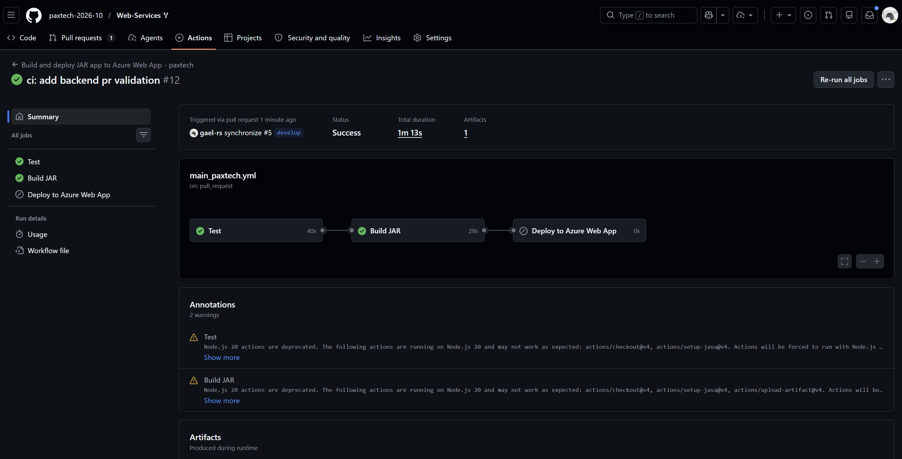

</div>

<div style="text-align: center; margin-top: 1rem; margin-bottom: 1rem;">

Workflow frontend `Frontend CI` con los tres bloques visibles: `Install dependencies`, `Build production bundle` y `Unit tests`.

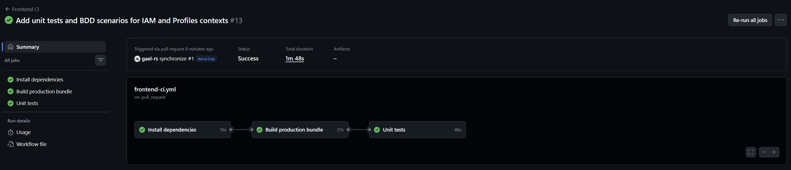

</div>

## 7.2. Continuous Delivery

El Continuous Delivery es una práctica de DevOps que automatiza el proceso con el que se prepara y presenta el producto de software de manera confiable y eficiente. Su objetivo principal es garantizar que la aplicación siempre se encuentre en un estado listo para ser desplegado mediante procesos automatizados que incluyen compilación, validación y despliegue.

Para este proyecto, estamos utilizando GitHub Actions junto con Microsoft Azure para el proceso mencionado. El pipeline automatiza la compilación de la aplicación, la generación de artefactos y el despliegue automático hacia el entorno cloud cada vez que se realizan cambios en la rama principal del repositorio. Así, se reduce la intervención manual y los errores de despliegue.

### 7.2.1. Tools and Practices

Las herramientas que estamos utilizando son:

- __GitHub__: Esta herramienta se usa para mantener el control de versiones ordenado así como para lograr que todo el equipo pueda estar al día con el código trabajado y pueda añadir sus cambios sin dificultades.
- __GitHub Actions__: Esta herramienta se emplea para la automatización del pipeline en esta sección, lo que contempla los procesos de compilación, generación de artefacos y, finalmente, despliegue.
- __Microsoft Azure__: Se utiliza como la plataforma de despliegue en donde la aplicación queda alojada.

Por el lado de las prácticas, estamos considerando:

- __Automated Build Process__: La aplicación se compila automáticamente cada vez que se detectan cambios en la rama main del repositorio.
- __Artifact Management__: Una vez que se genera el archivo JAR de la aplicación, este se almacena para ser utilizado en la etapa de despliegue.
- __Automated Deployment__: Depués de que se verificó que la compilación no presenta problemas, la aplicación es automáticamente desplegada al entorno cloud de Azure.
- __Version Control Integration__: Dado que el pipeline se encuentra integrado con Github, se logra automatizar el proceso de despliegue directamente al oírse un evento en el repositorio.  
- __Continuous Validation__: El contar con un flujo automatizado, además de los tests implementados, ayuda a asegurar que la aplicación no presente problemas al momento de ser desplegada.

### 7.2.2. Stages Deployment Pipeline Components

El pipeline de Continuous Delivery está compuesto por múltiples etapas automatizadas que permiten integrar, empaquetar y desplegar la aplicación de manera eficiente. A continuación, se presentan los pasos que se siguen junto a la herramienta que utilizan:

- __Source Stage - GitHub__: Cuando se agrega código a la rama main del repositorio, GitHub lo detecta y se activa el pipeline configurado GitHub Actions.
- __Workflow Trigger Stage - GitHub Actions__: Ya activado el pipeline, GitHub Actions se encarga de ejecutar el workflow definido para automarizar la integración y el despliegue.
- __Repository Checkout Stage - GitHub Actions__: Aquí, se descarga una copia completa del repositorio dentro del entorno virtual de ejecución de forma en que las siguientes etapas logres acceder al código fuente.
- __Build Stage - Maven__: En esta parte, el proyecto se compila utilizando Maven y el comando `mvn clean install`. Mientras tanto, se descargan las dependencias, el código es compilado y se genera el archivo JAR del proyecyo para almacenarlo como un artefacto
- __Deployment Stage - Microsoft Azure__: Se realiza el ingreso a Azure y se descarga el aetefacto. Luego, este es automáticamente desplegado en el entorno de ejecución.
- __Validation Stage__: Una vez que el despliegue se completa, GitHub Actions se encarga de registrar logs y el estado de ejecución a modo de historial. Así, es más sencillo detectar posibles errores.

## 7.3. Continuous Deployment

Continuous Deployment es la práctica que cierra el ciclo DevOps al llevar automáticamente a producción cada cambio que supera los controles de calidad establecidos en las fases anteriores. A diferencia de un modelo de despliegue completamente automatizado, el proyecto uTime adopta un modelo de despliegue supervisado semi-automatizado: la automatización ejecuta el despliegue, pero la puerta de entrada a producción es siempre una revisión humana materializada en un Pull Request aprobado mediante GitHub. Este diseño es coherente con el tamaño del equipo y con el estado actual del producto.

### 7.3.1. Tools and Practices

Las herramientas que participan directamente en el proceso de despliegue continuo son las mismas establecidas en las secciones 7.1 y 7.2, dado que el pipeline es único y continuo:

GitHub actúa como sistema de control de versiones y como mecanismo de control del flujo de despliegue. Las reglas de protección de ramas impiden que cualquier commit llegue a main sin haber pasado por un Pull Request aprobado por al menos un integrante del equipo. Este requisito convierte el proceso de revisión en la única compuerta manual del ciclo de despliegue.

GitHub Actions implementa el pipeline de integración y despliegue continuo. Cada push o merge hacia main dispara automáticamente el workflow definido en el repositorio. Este pipeline ejecuta la fase de build, la ejecución de pruebas unitarias y, si ambas etapas finalizan correctamente, continúa con la generación del artefacto JAR y su posterior despliegue. De esta manera, el pipeline asegura que ningún cambio llegue a producción sin haber sido validado previamente por el proceso automatizado.

Microsoft Azure recibe el artefacto publicado por el job deploy del workflow y lo ejecuta en el slot Production del Azure Web App paxtech, sin intervención manual adicional por parte del equipo.

Las prácticas aplicadas en esta fase son:

- Despliegue supervisado por PR: ningún cambio alcanza producción sin una revisión explícita. Los merges a main provienen exclusivamente de ramas develop/* o hotfix/*, conforme a la convención GitFlow simplificada.  
- Despliegue automatizado por pipeline: el pipeline en GitHub Actions se encarga de ejecutar automáticamente la compilación, pruebas y despliegue cada vez que se actualiza main, eliminando intervenciones manuales en el proceso de release.  
- Despliegue sin recompilación: el artefacto que se despliega en producción es el mismo JAR generado y validado por el job build. No se produce ninguna compilación adicional en el job de despliegue, lo que garantiza que el binario en producción es exactamente el que pasó los 75 tests unitarios del backend.  
- Trazabilidad de releases: cada despliegue asociado a un milestone del proyecto queda etiquetado en main. Esto permite identificar con precisión qué versión está activa en producción en cada momento.  

---

### 7.3.2. Production Deployment Pipeline Components

El pipeline de producción no constituye un workflow independiente, sino la segunda mitad del workflow main_paxtech.yml descrito en 7.1.2. Su ejecución queda condicionada a que el job build finalice con estado success, lo que en la práctica significa que ningún despliegue a producción ocurre si la compilación o algún test falla.

El flujo completo desde el desarrollo hasta producción sigue la siguiente secuencia:

Un integrante trabaja sobre una rama feature/* y, una vez completado el cambio, abre un Pull Request hacia develop.  
El PR es revisado y aprobado por al menos un integrante distinto al autor; solo entonces se fusiona en develop.  
Cuando el equipo considera que develop está en condiciones de publicarse, se abre una rama release/* y se crea un Pull Request hacia main.  
Tras la aprobación del PR de release, el merge a main dispara el pipeline en GitHub Actions.  
El job build compila el proyecto con mvn clean install, ejecuta la suite de tests y genera el JAR resultante como artefacto del run.  
El job deploy, condicionado por needs: build, descarga el JAR, se autentica contra Azure mediante OIDC y publica el artefacto en el slot Production del Azure Web App paxtech.

La siguiente tabla resume los componentes del pipeline de producción y su responsabilidad dentro del modelo de despliegue supervisado:

<div style="text-align: center; margin-top: 1rem; margin-bottom: 1rem;">

La siguiente tabla resume los componentes del pipeline de producción y su responsabilidad dentro del modelo de despliegue supervisado:

| Componente | Herramienta | Responsabilidad en el despliegue |
| ----- | ----- | ----- |
| Protección de rama `main` | GitHub | Impide merges directos; exige PR aprobado como única compuerta manual. |
| Disparador del workflow | GitHub Actions (`push` a `main`) | Inicia el pipeline automáticamente al detectar el merge aprobado. |
| Validación previa al despliegue | Maven (`mvn clean install`) | Ejecuta los 75 tests unitarios; un fallo aborta el despliegue. |
| Publicación del artefacto | GitHub Actions Artifacts | Garantiza que el binario desplegado es idéntico al validado. |
| Autenticación cloud | Azure Login (OIDC) | Autentica sin contraseña almacenada, usando secretos cifrados de GitHub. |
| Despliegue en producción | Azure Web App (`paxtech`, slot `Production`) | Recibe y ejecuta el JAR sin intervención manual del equipo. |

</div>

Este modelo reduce significativamente el esfuerzo manual de despliegue respecto a un proceso manual. Una vez aprobado el PR, el equipo no necesita intervenir para que el cambio llegue a producción. Al mismo tiempo, la obligatoriedad de la revisión humana antes del merge preserva un nivel de supervisión adecuado para la fase actual del producto, donde el equipo prioriza la estabilidad del API backend que consumen las tres aplicaciones cliente.

## 7.4. Continuous Monitoring

### 7.4.1. Tools and Practices

El Continuous Monitoring es la práctica de DevOps que cierra el ciclo al observar la aplicación una vez desplegada en producción, con el objetivo de detectar fallos, degradaciones de rendimiento o comportamientos anómalos antes de que afecten a los usuarios. Para uTime, este monitoreo no se queda en la documentación: está **implementado y es demostrable** sobre **GitHub Actions** —el mismo motor de pipeline que ya ejecuta el CI/CD (secciones 7.1 a 7.3)— complementado con la observabilidad nativa del Azure App Service donde corre el backend. Se descartó Jenkins porque GitHub Actions ofrece el mismo resultado de forma más simple, gratuita y sin infraestructura que mantener, permitiendo visualizar los componentes del pipeline y enviar correos directamente desde el repositorio.

Las herramientas que estamos utilizando son:

- __GitHub Actions__: motor del pipeline de monitoreo. Ejecuta el workflow programado `monitoring.yml` (health-check cada 15 minutos sobre el backend en producción) y el job `notify` del workflow `main_paxtech.yml`, cuyo historial de runs funciona como señal de salud del proceso de build, test y despliegue.
- __Sonda HTTP (`curl`)__: dentro del workflow de monitoreo, realiza una petición al endpoint público del backend y evalúa el código de respuesta HTTP como prueba de *liveness*, sin requerir instrumentación adicional en la aplicación.
- __Gmail SMTP (`dawidd6/action-send-mail`)__: *action* de GitHub que envía correos a través de `smtp.gmail.com` usando una *App Password* almacenada como secret cifrado del repositorio. Es el canal de alertas y notificaciones del equipo.
- __Azure App Service (`paxtech`)__: la plataforma donde se ejecuta el backend expone de forma nativa el *Log Stream* (logs en tiempo real) y un panel de *Metrics* (CPU, memoria, requests HTTP, códigos de respuesta), disponibles sin instrumentación para inspección complementaria.
- __SLF4J + Logback__: el framework de logging por defecto de Spring Boot registra los eventos del backend (`INFO`/`WARN`/`ERROR`) y los persiste en `/home/LogFiles/Application/app.log` dentro del App Service.
- __Vercel y Firebase Analytics__: complementan la observabilidad en la capa web (estado de despliegues del frontend Angular) y móvil (eventos de comportamiento de la app Android), respectivamente.

Por el lado de las prácticas, estamos aplicando:

- __Pipeline-as-monitoring__: el propio pipeline de GitHub Actions es el punto donde se observan los componentes (jobs `test`, `build`, `deploy`, `health-check` y `notify`), tal como se haría en un tablero de Jenkins, pero sin servidor que mantener.
- __Health-check programado__: un workflow con disparador `schedule` (cron) sondea periódicamente la disponibilidad del backend en producción, detectando caídas de forma automática y no por inspección manual.
- __Distinción entre notificación y alerta__: una **notificación** es un mensaje informativo del estado de una ejecución (p. ej. "despliegue exitoso"); una **alerta** es una señal de que *algo está mal* y requiere ser investigado (backend caído o pipeline fallido). Ambas se canalizan por correo.
- __Notificación por correo (Gmail)__: las alertas y los resultados del pipeline se envían al correo del equipo mediante Gmail SMTP, un mecanismo simple y suficiente para la fase actual del producto.
- __Observabilidad nativa de plataforma__: en lugar de incorporar un APM externo (Grafana, Datadog, New Relic o Sentry), se aprovecha la observabilidad integrada de Azure App Service, GitHub, Vercel y Firebase, reduciendo la carga de instrumentación mientras el producto valida sus hipótesis.

### 7.4.2. Monitoring Pipeline Components

El pipeline de monitoreo está **implementado en el repositorio `Web-Services`** y se compone de un workflow dedicado de health-check más las señales nativas de las plataformas que ya forman parte del flujo DevOps. El componente central y demostrable es el workflow `monitoring.yml`, que se ejecuta de forma programada (cron) y también bajo demanda desde la pestaña *Actions*.

Los componentes que conforman el pipeline de monitoreo son:

| Componente | Herramienta | Señal que recolecta | Punto de acceso |
|---|---|---|---|
| Health-check programado | GitHub Actions (`monitoring.yml`, cron 15 min) + `curl` | Disponibilidad del backend en producción (código HTTP del endpoint público); falla si el backend no responde | Pestaña *Actions* → workflow *Continuous Monitoring* del repo `Web-Services` |
| Estado de despliegue backend | GitHub Actions (`main_paxtech.yml`) | Resultado de los jobs `build`, `deploy` y `notify` en cada run | Pestaña *Actions* del repositorio `Web-Services` |
| Logging de aplicación | SLF4J + Logback (Spring Boot) | Eventos `INFO`/`WARN`/`ERROR`, persistidos en `/home/LogFiles/Application/app.log` (`logging.file.name`, `logging.level.root=INFO`) | Azure App Service → Log Stream / archivo persistente |
| Log Stream y métricas | Azure App Service | `stdout`/`stderr` en tiempo real; CPU, memoria (working set), requests HTTP y códigos 4xx/5xx | Portal Azure → `paxtech` → Log stream / Metrics |
| Estado de despliegue frontend | Vercel | Estado de build y despliegues de preview/producción de la app Angular | Dashboard de Vercel |
| Analítica de uso móvil | Firebase Analytics | Eventos de comportamiento de usuario en la app Android | Consola de Firebase |

En conjunto, estos componentes cubren tres planos de observabilidad: **entrega** (estado de los pipelines y del health-check en GitHub Actions), **aplicación** (logs del backend y códigos de respuesta HTTP) e **infraestructura** (métricas de CPU/memoria del App Service).

Como evidencia del componente de **estado de despliegue backend**, la siguiente figura muestra un run real del pipeline en GitHub Actions, donde se observan de forma encadenada los tres componentes del flujo —`build`, `deploy` y `Notify pipeline result`— todos finalizados en éxito (estado *Success*). Esta vista es la que permite "ver los componentes" del pipeline directamente en la plataforma, sin necesidad de una herramienta externa.

<div style="text-align: center; margin-top: 1rem; margin-bottom: 1rem;">

Vista del run del workflow `main_paxtech.yml`: los componentes `build → deploy → Notify pipeline result` ejecutados y en verde.

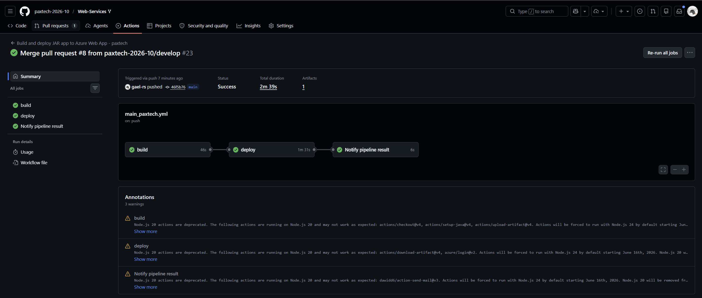

</div>

El detalle interno de cada job confirma las señales que recolecta el monitoreo de entrega: el job `build` compila y empaqueta el artefacto, y el job `deploy` lo publica en el Azure App Service.

<div style="text-align: center; margin-top: 1rem; margin-bottom: 1rem;">

Detalle del job `build` (compilación y empaquetado con Maven) finalizado correctamente.

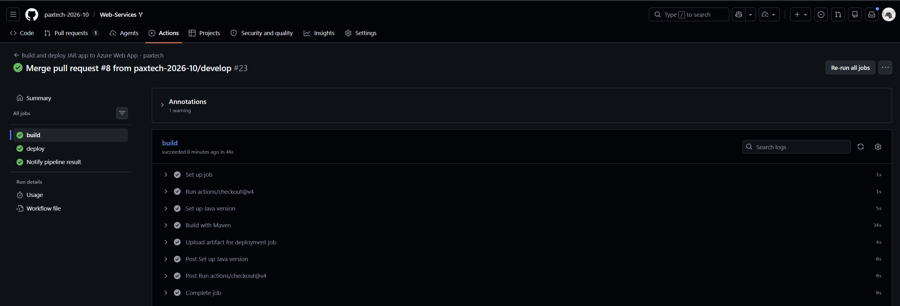

Detalle del job `deploy` (login a Azure y publicación en el App Service `paxtech`) finalizado correctamente.

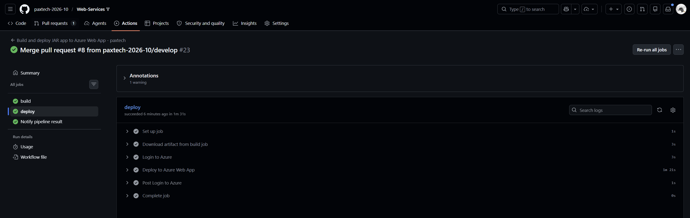

</div>

Por su parte, el workflow dedicado de health-check (`monitoring.yml`) se ejecuta de forma programada y bajo demanda, sondeando la disponibilidad del backend en producción.

<div style="text-align: center; margin-top: 1rem; margin-bottom: 1rem;">

Workflow *Continuous Monitoring* ejecutándose en la pestaña *Actions* del repositorio `Web-Services`, con el job `Health check (monitoring)` en verde (backend disponible) y el job `Alert and notify (down)` omitido.

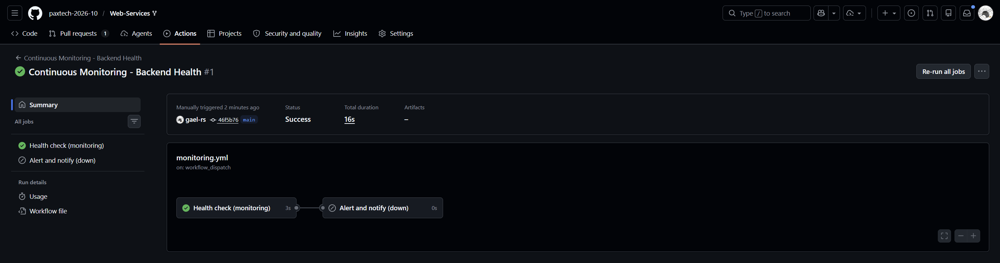

</div>

### 7.4.3. Alerting Pipeline Components

El sistema de alertas está **implementado con GitHub Actions** y se dispara automáticamente ante dos condiciones de *"algo está mal"*: que el backend deje de responder o que el pipeline de despliegue falle. En ambos casos la alerta se enruta por **correo (Gmail SMTP)** al equipo. De forma complementaria, las métricas nativas del Azure App Service pueden respaldar reglas de alerta sobre rendimiento y recursos.

| Alerta | Disparador (implementado) | Canal | Severidad |
|--------|---------------------------|-------|-----------|
| Backend no disponible | El job `health-check` de `monitoring.yml` no obtiene respuesta del endpoint público (*timeout* o error HTTP 5xx) → se ejecuta el job `alert` | Correo (Gmail SMTP) | Crítica |
| Fallo del pipeline de despliegue | Cualquier job (`build`, `deploy`) de `main_paxtech.yml` falla en un `push` a `main` → el job `notify` envía correo de alerta | Correo (Gmail SMTP) + checks en GitHub | Alta |
| Saturación de recursos / latencia (complementaria) | Métricas del App Service: CPU > 80 %, *memory working set* alto o tiempo de respuesta elevado | Azure Monitor → correo (opcional) | Media |

Las dos primeras alertas están **activas en el repositorio** y constituyen el núcleo demostrable del capítulo: garantizan que ni una caída del backend ni un despliegue fallido pasen desapercibidos, cerrando el lazo entre el Continuous Deployment (7.3) y el monitoreo. La tercera queda como refuerzo opcional sobre las métricas que Azure ya expone sin instrumentación.

El propio job `notify` del pipeline materializa la lógica de alerta: contiene un step *Send FAILURE alert email* que solo se ejecuta cuando algún job termina en `failure`, condición que puede observarse en la figura del componente de notificación (sección 7.4.4). La siguiente captura corresponde a la prueba específica de caída del backend, donde el health-check falla y dispara el job `alert`.

<div style="text-align: center; margin-top: 1rem; margin-bottom: 1rem;">

Run del workflow *Continuous Monitoring* en estado *Failure*: el job `Health check (monitoring)` falla con el mensaje "Backend NO responde (HTTP 000)" y dispara el job `Alert and notify (down)`, que se ejecuta correctamente.

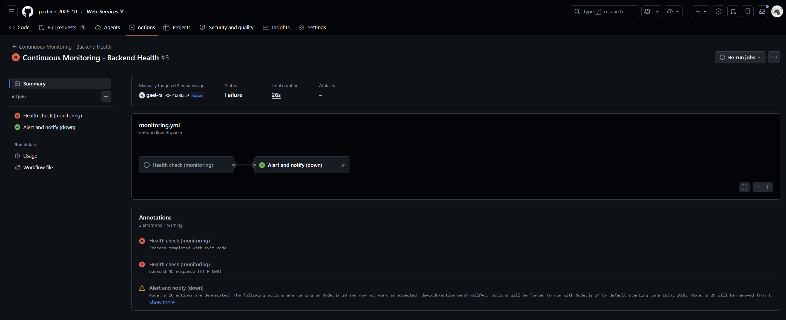

</div>

### 7.4.4. Notification Pipeline Components

Las notificaciones son el último eslabón del pipeline de monitoreo: traducen las alertas y los eventos del pipeline en mensajes accionables para el equipo. uTime implementa este eslabón con **correo electrónico vía Gmail SMTP**, enviado directamente desde GitHub Actions mediante la action `dawidd6/action-send-mail` y una *App Password* guardada como secret del repositorio. No se usa un sistema de on-call dedicado (PagerDuty) ni un bus de chatops (Slack), coherente con el tamaño del equipo y la fase del producto.

Para enviar correos, el repositorio configura los secrets `MAIL_USERNAME`, `MAIL_PASSWORD` (App Password de Gmail) y `MAIL_TO`, además de la variable `BACKEND_URL` que indica la URL a monitorear.

| Canal | Origen del evento | Tipo | Propósito |
|---|---|---|---|
| Correo Gmail — `[ALERTA - CRITICA]` | Job `alert` de `monitoring.yml` (backend caído) | Alerta | Avisar de inmediato que el backend no responde en producción |
| Correo Gmail — `[ALERTA]` | Job `notify` de `main_paxtech.yml` con algún job en `failure` | Alerta | Avisar de un fallo de build, test o deploy en el pipeline |
| Correo Gmail — `[OK]` | Job `notify` de `main_paxtech.yml` con todos los jobs en éxito | Notificación | Informar que el despliegue a producción se completó correctamente |
| Checks de GitHub en el PR | Runs de los workflows de CI/CD | Notificación | Mostrar el estado del pipeline en el flujo de revisión |

**Estado actual y trabajo futuro.** El tejido de notificación está **implementado y es demostrable**: los correos se envían desde GitHub Actions a través de Gmail SMTP tanto ante caídas del backend como ante el resultado del pipeline de despliegue. No existe aún integración con Slack ni PagerDuty; de requerirse mayor inmediatez, basta con añadir un step de notificación a Slack en los mismos workflows o ampliar un Action Group de Azure Monitor con un webhook, sin alterar el resto del pipeline de monitoreo.

El mecanismo de envío vive dentro del job `notify`: la siguiente figura muestra sus dos steps condicionales —*Send FAILURE alert email* (que se omite cuando todo sale bien) y *Send SUCCESS notification email* (que se ejecuta en un despliegue exitoso)— evidenciando la distinción entre alerta y notificación dentro del mismo componente.

<div style="text-align: center; margin-top: 1rem; margin-bottom: 1rem;">

Job `notify` en GitHub Actions: el step de notificación de éxito se ejecuta y el de alerta de fallo queda omitido (*skipped*), según el resultado del pipeline.

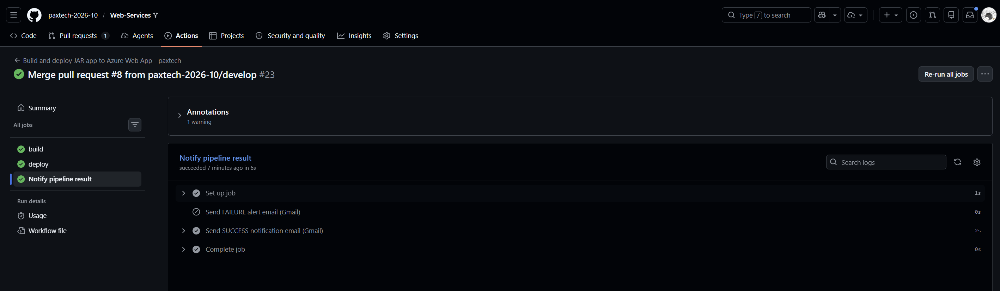

</div>

El resultado final es el correo entregado al equipo. La siguiente captura muestra la notificación `[OK]` de despliegue exitoso recibida en Gmail, enviada automáticamente por el pipeline desde la cuenta configurada en `MAIL_USERNAME`.

<div style="text-align: center; margin-top: 1rem; margin-bottom: 1rem;">

Correo `[OK] Despliegue exitoso a produccion - Web-Services` recibido en Gmail, con el detalle del resultado de los jobs, el commit y el enlace al run.

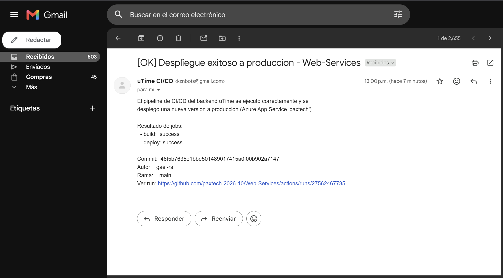

</div>

De forma análoga, ante una caída del backend o un fallo del pipeline, el equipo recibe un correo de alerta `[ALERTA - CRITICA]` / `[ALERTA]`.

<div style="text-align: center; margin-top: 1rem; margin-bottom: 1rem;">

Correo de alerta `[ALERTA - CRITICA] El backend uTime no responde` recibido en Gmail, con el código HTTP recibido (000), la URL monitoreada, la severidad y el enlace al run.

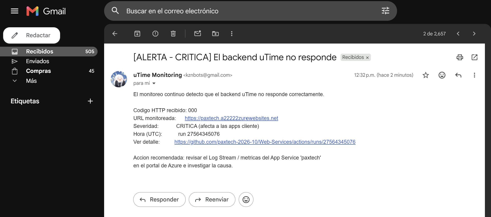

</div>

<div class="page"></div>

# Part III: Experiment-Driven Lifecycle

<div class="page"></div>

# Capítulo VIII: Experiment-Driven Development

## 8.1. Experiment Planning

### 8.1.1. As-Is Summary

El punto de partida del trabajo experimental no consiste en proponer nuevas funcionalidades de forma directa, sino en reunir el material bruto disponible para generar preguntas útiles. Para uTime, este material proviene de las entrevistas iniciales, el análisis de segmentos objetivo, el needfinding, los As-Is Scenario Maps, las hipótesis Lean UX y el estado actual del MVP descrito en los capítulos anteriores.

Las evidencias recopiladas muestran que los salones de belleza y barberías todavía coordinan gran parte de sus reservas mediante WhatsApp, llamadas, redes sociales o registros manuales, mientras que los clientes buscan disponibilidad clara, puntualidad, confianza, recordatorios y pagos digitales. A partir de este estado actual, el equipo identifica suposiciones, brechas de conocimiento, ideas y afirmaciones que deben transformarse en preguntas experimentales antes de decidir qué solución escalar.

### 8.1.2. Raw Material: Assumptions, Knowledge Gaps, Ideas, Claims

**Assumptions (Suposiciones realistas):**

1. Los salones de belleza y barberías adoptarán una agenda digital si esta reduce la coordinación manual por WhatsApp, llamadas y registros físicos.
2. Los clientes estarán dispuestos a reservar desde una aplicación si pueden ver disponibilidad clara, precios, servicios y datos del profesional antes de confirmar.
3. Los recordatorios automáticos ayudarán a reducir olvidos, cancelaciones tardías y reprogramaciones de último momento.
4. La opción de pago digital dentro del flujo de reserva aumentará la sensación de seguridad y compromiso entre clientes y negocios.
5. Las reseñas, calificaciones y perfiles detallados de salones o estilistas incrementarán la confianza del cliente al elegir un servicio.

**Knowledge Gaps (Brechas prácticas):**

1. ¿Qué información mínima necesita un cliente para confiar en una reserva sin comunicarse primero por WhatsApp?
2. ¿Qué tan dispuesto está un salón o barbería a reemplazar su agenda manual por una herramienta digital?
3. ¿Qué canal genera mayor intención de reserva inicial: flujo directo en la app, formulario web o contacto por WhatsApp?
4. ¿Qué tipo de recordatorio resulta más útil para evitar cancelaciones: notificación en la app, correo o mensaje por WhatsApp?
5. ¿Qué elementos generan mayor confianza en el cliente: reseñas, fotos de trabajos previos, precios visibles o datos del profesional?

**Ideas Ejecutables:**

1. Probar un flujo de reserva reducido frente a un flujo completo con más pasos e información.
2. Comparar la conversión entre un botón de reserva directa y un botón de contacto por WhatsApp desde la landing page.
3. Implementar recordatorios automáticos previos a la cita para clientes y negocios.
4. Mostrar perfiles de salones o estilistas con reseñas, calificaciones y portafolio visual.
5. Incorporar una opción de pago digital o confirmación de reserva para reforzar el compromiso del cliente.

**Claims (Afirmaciones testables):**

1. **WhatsApp como canal habitual:** Los entrevistados afirman que WhatsApp y redes sociales son canales prácticos y frecuentes para coordinar citas.
2. **Puntualidad como factor crítico:** Los clientes declaran que la puntualidad influye directamente en su experiencia y en su disposición a volver al salón.
3. **Cancelaciones y cambios tardíos:** Los negocios reportan que las cancelaciones o reprogramaciones de último momento afectan su organización e ingresos.
4. **Reputación y evidencia visual:** Los clientes afirman que comentarios, reseñas, reputación y trabajos previos influyen en la elección de un salón o estilista.
5. **Pagos digitales:** Los clientes mencionan que los pagos por aplicaciones, tarjeta o transferencia les resultan más cómodos y seguros que el efectivo.

### 8.1.3. Experiment-Ready Questions

| Tipo | Question | Why | Confidence | Risk | Impact | Interest | Total Score |
|------|----------|-----|------------|------|--------|----------|-------------|
| Belief-led | ¿Ayudará una agenda digital centralizada a aumentar la disposición de los salones y barberías para gestionar reservas desde uTime? | Permite probar la creencia de que el desorden generado por canales manuales puede convertirse en intención de adopción de una agenda digital. | 8 - Las entrevistas muestran que la coordinación manual por WhatsApp, llamadas y registros físicos genera desorden y pérdida de tiempo. | 3 - Riesgo moderado, porque implica cambiar hábitos actuales de gestión del negocio. | 6 - Puede impactar directamente en la adopción del segmento negocio. | 6 - Interés alto, ya que prueba la premisa central para salones y barberías. | 23 |
| Belief-led | ¿Reducirán los recordatorios automáticos los olvidos, cancelaciones tardías o reprogramaciones de citas? | Permite probar la creencia de que los recordatorios atacan un dolor recurrente observado en clientes y negocios. | 8 - Las entrevistas identifican puntualidad, recordatorios y cambios de último momento como puntos críticos. | 2 - Riesgo bajo, ya que los recordatorios son una funcionalidad común y técnicamente viable. | 6 - Puede mejorar la asistencia, la organización y la satisfacción de ambos segmentos. | 6 - Interés alto, porque conecta con uno de los dolores más repetidos en el As-Is. | 22 |
| Belief-led | ¿Incrementará la confirmación o pago digital de una reserva el compromiso del cliente con la cita? | Permite evaluar si la comodidad de los pagos digitales también puede funcionar como mecanismo de compromiso con la reserva. | 6 - Los clientes muestran preferencia por pagos digitales, pero aún falta probar si esto reduce cancelaciones. | 4 - Riesgo medio, porque pedir pago o confirmación puede generar fricción si se introduce demasiado pronto. | 6 - Puede reducir ausencias y mejorar la planificación del negocio. | 5 - Interés moderado-alto, ya que afecta ingresos, confianza y experiencia de reserva. | 21 |
| Exploratory | ¿Qué canal genera mayor intención de reserva inicial: flujo directo en la app o contacto por WhatsApp? | Permite explorar si el canal habitual de comunicación debe mantenerse como transición o si el flujo directo puede reemplazarlo progresivamente. | 6 - Los clientes usan WhatsApp con frecuencia, pero también buscan procesos más rápidos y claros. | 3 - Riesgo moderado, porque el canal preferido puede variar según confianza y familiaridad digital. | 5 - Puede mejorar la conversión de clientes desde la exploración hasta la reserva. | 6 - Interés alto, porque define el canal principal del flujo de adquisición. | 20 |
| Exploratory | ¿Qué elementos del perfil generan mayor confianza antes de reservar: reseñas, calificaciones, precios visibles o portafolio visual? | Permite explorar qué información mínima necesita el cliente para confiar antes de reservar sin comunicarse primero por otro canal. | 7 - Los clientes mencionan reputación, confianza y atención previa como criterios importantes para elegir un salón. | 2 - Riesgo bajo, porque la información puede mostrarse sin alterar el flujo principal de reserva. | 5 - Puede aumentar la seguridad percibida y la intención de reserva. | 5 - Interés moderado-alto, porque ayuda a priorizar elementos de confianza en la interfaz. | 19 |

### 8.1.4. Question Backlog

El backlog se organiza como una lista priorizada de preguntas de investigación. En caso de empate en el puntaje total, se prioriza la pregunta con mayor riesgo, ya que representa una incertidumbre más crítica para la toma de decisiones del producto.

| Prioridad | Tipo | Pregunta | Why | Confidence | Risk | Impact | Interest | Total Score | Métrica asociada | Estado |
|-----------|------|----------|-----|------------|------|--------|----------|-------------|------------------|--------|
| 1 | Belief-led | ¿Ayudará una agenda digital centralizada a aumentar la disposición de los salones y barberías para gestionar reservas desde uTime? | Probar si el dolor de gestión manual se traduce en adopción potencial. | 8 | 3 | 6 | 6 | 23 | Disposición de adopción del segmento negocio | Pendiente |
| 2 | Belief-led | ¿Reducirán los recordatorios automáticos los olvidos, cancelaciones tardías o reprogramaciones de citas? | Probar si una intervención simple puede reducir fricción operativa. | 8 | 2 | 6 | 6 | 22 | Intención declarada de cancelación, olvido o reprogramación | Pendiente |
| 3 | Belief-led | ¿Incrementará la confirmación o pago digital de una reserva el compromiso del cliente con la cita? | Probar si la confirmación o pago aumenta compromiso sin generar fricción excesiva. | 6 | 4 | 6 | 5 | 21 | Porcentaje de clientes que prefiere confirmar o pagar digitalmente | Pendiente |
| 4 | Exploratory | ¿Qué canal genera mayor intención de reserva inicial: flujo directo en la app o contacto por WhatsApp? | Explorar si conviene priorizar reserva directa o mantener WhatsApp como canal de transición. | 6 | 3 | 5 | 6 | 20 | Intención de reserva por canal | Pendiente |
| 5 | Exploratory | ¿Qué elementos del perfil generan mayor confianza antes de reservar: reseñas, calificaciones, precios visibles o portafolio visual? | Explorar qué información mínima necesita el cliente para confiar antes de reservar. | 7 | 2 | 5 | 5 | 19 | Confianza percibida antes de reservar | Pendiente |

### 8.1.5. Experiment Cards  

| Campo | Detalle |
|-------|---------|
| ID | EXP01 |
| Título | Aplicación de una agenda digital centralizada |
| Lado frontal |
| Pregunta | ¿Ayudará una agenda digital centralizada a aumentar la disposición de los salones y barberías para gestionar reservas desde uTime? |
| Razón | Consideramos que es necesario dado que la mayor parte de los problemas o mal entendidos en cuanto a la realización de servicios en los salones de belleza se da precisamente debido a la falta de visibilidad y coordinación. Así, la implementación de una herreminta digital de gestión probablemente ayudaría a los salones a darse a conocer y a organizar mejor las citas agendadas y las necesidades de cada una, mas esta idea debe ser validada. |
| Hipótesis | Creemos que, al probar un flujo básico de agenda digital en uTime, al menos el 60% de los salones de belleza y barberías manifestará disposición a usarla para gestionar reservas. |
| Simplest Useful Thing | La funciondalidad mínima y usable más sencilla a implementar sería, por el lado del usuario, la selección del salón o barbería, estilista deseado, servicio y hora del mismo de acuerdo a disponibilidad. Con esta información, se gurdaría su reserva, mientras que, al confirmar los datos, esta misma se vería reflejada en el calendario del salón seleccionado. |
| Lado posterior |
| Medidas | Analizar las puntuaciones en una encuesta de satisfacción dirigida hacia los salones y barberías antes y después de la implementación del flujo de reservaciones y calendario en las aplicaciones durante un periodo de 30 días. |
| Condiciones | Experimental --> Los salones de belleza, barberías y sus clientes empiezan a usar uTime para la gestión de sus reservas - Control --> Las reservas se siguen registrando mediantes llamadas y aplicaciones de mensajería |
| Escala | Implementar y mantener el flujo de reservas dentro de la aplicación si más de la mitad de los salones de belleza y barbería manifiestan una alta satisfacción en cuanto al uso de esta funcionalidad. |  

| Campo | Detalle |
|-------|---------|
| ID | EXP02 |
| Título | Implementación de recordatorios |
| Lado frontal |
| Pregunta | ¿Reducirán los recordatorios automáticos los olvidos, cancelaciones tardías o reprogramaciones de citas? |
| Razón | Tanto para los negocios como para los clientes existe una inversión en la preparación para la realización del servicio reservado, por lo que un olvido, cancelación o reprogramación en el último momento siempre causará un malestar. En cuanto a ello, consideramos que si se envían alertas horas antes o hasta el día anterior a la fecha reservada para la cita, estos olvidos se reducirán y las citas podrán cumplirse sin problemas, mas es necesario validar la idea. |
| Hipótesis | Los recordatorios automáticos reducirán en al menos 30% la intención declarada de cancelar, olvidar o reprogramar una cita en comparación con un flujo sin recordatorios. |
| Simplest Useful Thing | Como primera implementación en cuanto a recordatorios, se puede emitir una que se muestre tanto al salón o barbería como al usuario 24 horas antes de la hora de la cita. |
| Lado posterior |
| Medidas | Comparar la cantidad de citas canceladas y reprogramadas a causa de olvidos durante 30 días antes y después de la implementación de los recordatorios. |
| Condiciones | Experimental --> Muestra de recordatorios para los salones, barberías y clientes 24 horas de que tengan una cita programadas - Actual --> Los clientes, salones y barberían no cuentan con recordatorios y dependen de sus apuntes para recordar las citas |
| Escala | Implementar recordatorios globalmente y con diferente frecuencia según el caso tanto para clientes como para salones y barberías si los recordatorios implementados ayudan a reducir más del 20% de la cantidad de citas canceladas o reprogramadas de forma tardía. |  

| Campo | Detalle |
|-------|---------|
| ID | EXP03 |
| Título | Confirmación o pago digital de reserva |
| Lado frontal |
| Pregunta | ¿Incrementará la confirmación o pago digital de una reserva el compromiso del cliente con la cita? |
| Razón | Los clientes valoran la comodidad y seguridad de los pagos digitales, mientras que los salones y barberías necesitan mayor certeza de que el cliente asistirá a la cita para organizar su agenda e ingresos sin dudas. Con el manejor actual, muchas reservas quedan solo como intención o acuerdo por mensajería, lo que facilita cancelaciones y ausencias imprevistas. Consideramos que un paso de confirmación o pago dentro del flujo de uTime reforzará el compromiso con la cita, pero esta idea debe ser validada porque también puede generar fricción si el cliente aún no desea confirmar. |
| Hipótesis | Al menos el 50% de los clientes evaluados preferirá confirmar o pagar digitalmente su reserva si esta opción se presenta dentro del flujo de agendamiento. |
| Simplest Useful Thing | Tras seleccionar salón o barbería, servicio, estilista y horario disponible, el cliente puede confirmar la reserva con un botón u optar por realizar un pago digital a través de Stripe. Al completar el paso, el sistema marca la reserva como confirmada, muestra una constancia al cliente y la refleja en el panel del negocio. Si solo se confirmó, la cita figura como confirmada y pendiente de pago para el salón o barbería. |
| Lado posterior |
| Medidas | Comparar la tasa de cancelaciones o ausencias durante 30 días antes y después de habilitar el paso de confirmación o pago, y aplicar una encuesta breve al cliente sobre su nivel de compromiso y seguridad percibida tras reservar. |
| Condiciones | Experimental --> Los clientes que reservan en uTime deben confirmar la cita o pagar digitalmente a través de Stripe antes de que la reserva quede registrada - Actual --> Los clientes completan la reserva sin confirmación ni pago digital y el compromiso depende del acuerdo habitual por mensajería o presencial |
| Escala | Integrar de forma permanente la confirmación o pago digital en el flujo de reservas si al menos el 40% de los clientes evaluados prefiere confirmar o pagar digitalmente y se observa una reducción de al menos 15% en cuanto a cancelaciones o ausencias respecto al periodo sin ese paso. |  

| Campo | Detalle |
|-------|---------|
| ID | EXP04 |
| Título | Visibilidad de negocios e intención de reserva |
| Lado frontal |
| Pregunta | ¿Generará mayor intención de reserva un flujo directo en la app que un contacto inicial por WhatsApp? |
| Razón | Actualmente, muchos de los salones de belleza y barberías promocionan sus servicios a través de redes sociales y carteles, así como ofrecen la reserva de citas a través canales de mensajería, pero esto puede estar limitando su alance en cuanto a clientes. Consideramos que el presentarse y promocionarse a través de uTime, así como permitir reservar directamente desde la app aumentará la cantidad de posibles clientes y la intención de completar una reserva de cita frente a depender de que alguien vea un cartel y siga una conversación inicial por mensajería, mas es necesario validar qué canal funciona mejor. |
| Hipótesis | El flujo directo de reserva en la app generará al menos 20% más intención de reserva que un flujo basado únicamente en contacto inicial por WhatsApp. |
| Simplest Useful Thing | Dentro de la aplicación, se mostrará la lista de salones registrados, sus promociones existentes y los clientes podrán fitrarlos de acuerdo a los servicios que desean adquirir, así como tendrán la posibilidad de reservar su cita en cuanto encuentran un salón o barbería de su agrado. |
| Lado posterior |
| Medidas | Comparar la intención de reserva en cada canal considerando tanto las visitas al perfil del salón o barbería como sus reservas completadas durante 30 días. |
| Condiciones | Experimental --> Los clientes visualizan y filtran los salones y barberías en existencia dentro de la aplicación y acceden al flujo directo de reserva en la app o web de uTime sin depender de una conversación inicial por WhatsApp - Actual --> Los clientes inician el contacto únicamente mediante WhatsApp o mensajería para coordinar disponibilidad y concretar la cita, y los salones y barberías poseen una exposición al público limitada |
| Escala | Priorizar la visibilidad de los nuevos salones y el acceso al flujo directo de reserva de citas a través de la app si genera al menos 20% más intención de reserva que el contacto inicial por WhatsApp. |  

| Campo | Detalle |
|-------|---------|
| ID | EXP05 |
| Título | Perfil con reseñas y portafolio visual |
| Lado frontal |
| Pregunta | ¿Aumentarán los perfiles con reseñas, calificaciones y portafolio visual la confianza del cliente antes de reservar? |
| Razón | En las entrevistas, los clientes indican que al escoger un salón o estilista suelen basarse en la reputación, trabajos previos y calidad percibida, no solo en el precio o la ubicación. Actualmente, esa información suele llegar por recomendaciones entre clientes o redes sociales. Consideramos que mostrar reseñas, calificación promedio y un portafolio visual en el perfil del negocio aumentará la confianza de los posibles clientes antes de reservar, mas es necesario validar si ese contenido realmente impulsará su intención. |
| Hipótesis | Los perfiles con reseñas, calificaciones y portafolio visual aumentarán la confianza percibida del cliente en al menos 25% frente a perfiles sin evidencia social ni visual. |
| Simplest Useful Thing | Al visitar el perfil de un salón o estilista, el cliente verá reseñas de usuarios que ya han tomado sus servicios, la calificación promedio obtenida y una galería de trabajos previos que puede revisar antes de iniciar la reserva. |
| Lado posterior |
| Medidas | Analizar una encuesta que consulta acerca de la confianza percibida por los clientes antes de reservar en un salón que no conocían antes y después de la habilitación de reseñas, calificaciones y portafolios. |
| Condiciones | Experimental --> Los clientes consultan perfiles con reseñas, calificaciones y portafolios visuales antes de realizar su primera reserva en este salón o barbería - Actual --> Los clientes consultan un perfil básico sin reseñas, calificaciones ni una muestra de trabajos previos |
| Escala | Mantener de forma permanente los perfiles enriquecidos en uTime si la confianza percibida aumenta en al menos 20% frente al perfil básico y se correlaciona con al menos un 10% de mayor intención o finalización de reservas. |  

## 8.2. Experiment Design

### 8.2.1. Hypotheses

Las hipótesis se formulan para las preguntas de tipo **Belief-led**, ya que parten de una creencia explícita que puede ser probada mediante un experimento. Las preguntas exploratorias se mantienen como insumo para investigación y medición, pero no se presentan como hipótesis hasta que el equipo formule una creencia concreta asociada.

| Question | Belief | Hypothesis | Null Hypothesis |
|----------|--------|------------|-----------------|
| ¿Ayudará una agenda digital centralizada a aumentar la disposición de los salones y barberías para gestionar reservas desde uTime? | Los salones y barberías gestionan gran parte de sus reservas mediante WhatsApp, llamadas o registros físicos, lo que genera desorden, pérdida de tiempo y dificultad para controlar cambios de horario. | Al menos el 60% de los negocios evaluados manifestará disposición a usar la agenda digital de uTime después de probar un flujo básico de gestión de reservas. | La agenda digital centralizada no influirá de forma significativa en la disposición de los salones y barberías para gestionar reservas desde uTime. |
| ¿Reducirán los recordatorios automáticos los olvidos, cancelaciones tardías o reprogramaciones de citas? | Tanto clientes como negocios consideran importante la puntualidad y la confirmación previa de las citas; por ello, los recordatorios pueden reducir olvidos y cambios de último momento. | Los recordatorios automáticos reducirán en al menos 30% la intención declarada de cancelar, olvidar o reprogramar una cita en comparación con un flujo sin recordatorios. | Los recordatorios automáticos no reducirán de forma significativa los olvidos, cancelaciones tardías ni reprogramaciones de citas. |
| ¿Incrementará la confirmación o pago digital de una reserva el compromiso del cliente con la cita? | Los clientes valoran los pagos digitales por comodidad y seguridad, mientras que los negocios necesitan mayor certeza de asistencia para organizar su agenda. | Al menos el 50% de los clientes evaluados preferirá confirmar o pagar digitalmente su reserva si esta opción se presenta dentro del flujo de agendamiento. | La confirmación o pago digital no influirá de forma significativa en el compromiso del cliente con la cita reservada. |

### 8.2.2. Domain Business Metrics

| Métrica | Descripción | Objetivo | Fuente de datos |
|---------|-----------|---------|----------|
| Indíce de confianza percibida por los clientes | Promedia de puntuación otorgada por los clientes del 1 al 10 al visitar un salón o barbería por primera vez | Medir la confianza que generan los agregados en los perfiles de salones y barberías | Encuesta en la app |
| Freciencia de uso mensual y semanal | Número promedio de usuario que usaron la aplicación durante cierto periodo | Medir la utilidad de la aplicación durante un día laboral en los salones y barberías | Google Analytics y Firebase Analytics |
| Cantidad de visitas y reservas realizadas semanal y mensualmente | Número de visitas que recibió el perfil de un salón o barbería y número de citas reservadas en este que hubo durante cierto periodo | Medir el impacto del uso de uTime y sus funcionalidades en la cantidad de visitas y reservas recibidad por los salones y barberías | Azure Application Insigths |
| Cantidad de reservaciones canceladas o reprogramadas de forma tardía semanal y mensualmente | Número de reservaciones que fueron canceladas y reprogramas por olvido y/o de forma tardía durante cierto periodo | Medir el impacto de los recordatorios sobre la cantidad de citas canceladas o reprogramadas | Logs dentro de la aplicación |
| Nivel de satisfacción de los salores y barberías | Promedio de putnuación otorgada por parte de los dueños de salones de belleza, barberías y sus estilistas del 1 al 10 en cuanto a su nivel de satisfacción sobre las funcionalidades y flujos incluídos en la aplicación | Medir el nivel de satisfacción de los usuarios por el lado de los salones y barberías sobre el producto ofrecido | Encuesta en la app |

### 8.2.3. Measures

| Questions | Measures |
|--------|-------------|
| ¿Ayudará una agenda digital centralizada a aumentar la disposición de los salones y barberías para gestionar reservas desde uTime? | Analizar las puntuaciones en una encuesta de satisfacción dirigida hacia los salones y barberías antes y después de la implementación del flujo de reservaciones y calendario en las aplicaciones durante un periodo de 30 días. |
| ¿Reducirán los recordatorios automáticos los olvidos, cancelaciones tardías o reprogramaciones de citas? | Comparar la cantidad de citas canceladas y reprogramadas a causa de olvidos durante 30 días antes y después de la implementación de los recordatorios. |
| ¿Incrementará la confirmación o pago digital de una reserva el compromiso del cliente con la cita? | Comparar la tasa de cancelaciones o ausencias durante 30 días antes y después de habilitar el paso de confirmación o pago, y aplicar una encuesta breve al cliente sobre su nivel de compromiso y seguridad percibida tras reservar. |
| ¿Qué canal genera mayor intención de reserva inicial: flujo directo en la app o contacto por WhatsApp? | Comparar la intención de reserva en cada canal considerando tanto las visitas al perfil del salón o barbería como sus reservas completadas durante 30 días. |
| ¿Qué elementos del perfil generan mayor confianza antes de reservar: reseñas, calificaciones, precios visibles o portafolio visual? | Analizar una encuesta que consulta acerca de la confianza percibida por los clientes antes de reservar en un salón que no conocían antes y después de la habilitación de reseñas, calificaciones y portafolios. |

### 8.2.4. Conditions

| Question | Experimental Condition | Control Condition |
|----------|------------------------|-------------------|
| ¿Ayudará una agenda digital centralizada a aumentar la disposición de los salones y barberías para gestionar reservas desde uTime? | Los salones de belleza y barberías, junto con sus clientes, gestionan las reservas mediante uTime: el cliente selecciona salón, servicio, estilista y horario, y la cita se refleja en el calendario digital del negocio. | Las reservas se siguen coordinando mediante llamadas y aplicaciones de mensajería. |
| ¿Reducirán los recordatorios automáticos los olvidos, cancelaciones tardías o reprogramaciones de citas? | Salones, barberías y clientes reciben un recordatorio automático en la app 24 horas antes de cada cita programada. | Salones, barberías y clientes no reciben recordatorios automáticos y dependen de apuntes o coordinación manual para recordar las citas. |
| ¿Incrementará la confirmación o pago digital de una reserva el compromiso del cliente con la cita? | Los clientes deben confirmar la reserva o pagar digitalmente mediante Stripe antes de que la cita quede registrada como confirmada en uTime. | Los clientes completan la reserva sin confirmación ni pago digital, el compromiso con la cita depende del acuerdo habitual por mensajería. |
| ¿Generará mayor intención de reserva un flujo directo en la app que un contacto inicial por WhatsApp? | Los clientes visualizan y filtran salones y barberías dentro de uTime y acceden al flujo directo de reserva en la app o web sin depender de una conversación inicial por WhatsApp. | Los clientes inician el contacto únicamente por WhatsApp o mensajería para coordinar disponibilidad y concretar la cita, los negocios mantienen una exposición limitada fuera de la plataforma. |
| ¿Aumentarán los perfiles con reseñas, calificaciones y portafolio visual la confianza del cliente antes de reservar? | Los clientes consultan perfiles con reseñas, calificación promedio y portafolio visual de trabajos previos antes de realizar su primera reserva en ese salón o barbería. | Los clientes consultan un perfil básico sin reseñas, sin calificación visible ni galería de trabajos previos antes de reservar en un nuevo salón, quedando con incertidumbre. |

### 8.2.5. Scale Calculations and Decisions


| Hipótesis | Decisión | Desfavorable | Aceptable | Ideal | Excelente |
|-----------|----------|:------------:|:---------:|:-----:|:---------:|
| Se espera que al menos el 60% de los salones y barberías manifiesten disposición a usar la agenda digital de uTime tras probar el flujo básico de reservas y calendario. | Implementar y mantener el flujo de reservas y calendario centralizado si más del 50% de los negocios evaluados reportan satisfacción aceptable con la funcionalidad durante el periodo de prueba. | | | | X |
| Se espera una reducción de al menos el 30% en olvidos, cancelaciones tardías o reprogramaciones de citas con recordatorios automáticos 24 horas antes de la cita. | Implementar recordatorios de forma global para clientes y negocios si la reducción de cancelaciones o reprogramaciones tardías supera el 20% respecto al periodo sin recordatorios. | | | X | |
| Se espera que al menos el 50% de los clientes evaluados prefiera confirmar o pagar digitalmente su reserva cuando la opción está disponible en el flujo de agendamiento. | Integrar de forma permanente la confirmación o el pago digital mediante Stripe si al menos el 40% de los clientes lo prefiere y las cancelaciones o ausencias se reducen al menos un 15%. | | X | | |
| Se espera que el flujo directo de reserva en la app genere al menos un 20% más de intención de reserva que el contacto inicial por WhatsApp, considerando visitas al perfil y reservas completadas. | Priorizar la visibilidad de salones en uTime y el flujo directo de reserva en la app si la intención de reserva supera en al menos un 20% al canal de WhatsApp durante 30 días de medición. | | | X | |
| Se espera un aumento de al menos el 25% en la confianza percibida del cliente al consultar perfiles con reseñas, calificaciones y portafolio visual frente a un perfil básico. | Mantener de forma permanente los perfiles enriquecidos si la confianza percibida aumenta al menos un 20% y se correlaciona con al menos un 10% más de intención o finalización de reservas. | | | | X |

### 8.2.6. Methods Selection

| Herramienta | Precio | Capacidad de análisis | Sencillez | Ventajas |
|-------------|--------|----------------------|-----------|----------|
| **Encuesta en la app** | Gratuito | Captura percepción cualitativa y cuantitativa en cuanto a satisfacción, confianza, compromiso y disposición de adopción por parte de los usuarios. | Alta para el usuario final, mas requiere diseño y despliegue del cuestionario en web/móvil. | Permite medir el índice de confianza percibida y el nivel de satisfacción de salones y barberías dentro de la aplicación. |
| **Google Analytics (GA4)** | Gratuito | Análisis de tráfico web, eventos, embudos de conversión, sesiones y comparación de canales en la app web. | Facilidad de integración con Angular mediante gtag.js o Google Tag Manager. | Permite medir clics e intención de reserva según el seguimiento de acceso en la aplicación. |
| **Firebase Analytics** | Gratuito | Análisis de retención, eventos personalizados, embudos y frecuencia de uso (DAU/MAU) en aplicaciones móviles. | Facilidad de integración con Flutter y Kotlin mediante SDK de Firebase. | Permite medir la frecuencia de uso semanal y mensual en móvil y eventos como visualización de perfil de salones y barberías por parte de los clientes. |
| **Azure Application Insights** | Incluido en el plan de Azure App Service del backend | Trazas, métricas de rendimiento, conteo de peticiones y telemetría de endpoints de reservas y perfiles. | Integración de dificultad media, mas ya está alineado al despliegue Spring Boot en Azure del proyecto. | Permite medir visitas a perfiles de salón y reservas completadas. |
| **Logs dentro de la aplicación** | Incluídos como tabla en la base de datos desplegada | Seguimiento de estados de reserva y viaulizaciones del perfil: ingreso, creación, confirmación, cancelación tardía y reprogramación con motivo. | Fácil de integrar para el equipo de desarrollo dentro del bounded context Reservations. | Permite medir cancelaciones y reprogramaciones tardías así como elaborar comparaciones con consultas simples en la base de datos. |

### 8.2.7. Data Analytics: Goals, KPIs and Metrics Selection

**Regla de oro:** cada métrica responde a una pregunta priorizada o hipótesis de trabajo y se mide con herramientas específicas para comparar intención, adopción y confianza antes de escalar la funcionalidad.

| Objetivo | KPI | Métrica de éxito | Herramienta de tracking |
|----------|-----|------------------|-------------------------|
| **Evaluar adopción de agenda digital** | Disposición de adopción del segmento negocio | ≥60% de negocios evaluados manifiestan disposición a usar la agenda digital después de probar el flujo básico | Encuesta post-prueba + registros de uso del panel negocio |
| **Reducir fricción por olvidos y cambios de cita** | Intención declarada de cancelación o reprogramación | ≥30% de reducción en intención declarada de olvidar, cancelar tarde o reprogramar una cita frente a un flujo sin recordatorios | Logs de reservas + encuestas post-experimento |
| **Contrastar compromiso mediante confirmación o pago digital** | Ratio de reservas confirmadas o pagadas digitalmente | ≥50% de clientes evaluados prefiere confirmar o pagar digitalmente dentro del flujo de agendamiento | Eventos de confirmación + registros de pagos en sandbox |
| **Comparar reserva directa contra contacto por WhatsApp** | Intención de reserva por canal | Flujo directo en app genera ≥20% más intención de reserva que contacto inicial por WhatsApp | Google Analytics / GA4 + Google Tag Manager |
| **Medir confianza generada por perfiles enriquecidos** | Confianza percibida antes de reservar | ≥25% de aumento en confianza percibida frente a perfiles sin reseñas, calificaciones ni portafolio visual | Encuesta in-app + eventos de visualización de perfil |

### 8.2.8. Web and Mobile Tracking Plan

| Evento | Trigger | Propiedades | Plataforma (Web / iOS / Android) | Herramienta |
|--------|---------|-------------|----------------------------------|-------------|
| `profile_view` | El cliente abre el perfil de un salón o estilista antes de reservar. | `salon_id`, `profile_type`, `has_reviews`, `has_portfolio`, `source` | Web, Android | Google Analytics (GA4), Firebase Analytics |
| `salon_list_viewed` | El cliente ingresa al listado de salones y barberías registrados en uTime. | `result_count`, `screen_name` | Web, Android | Google Analytics (GA4), Firebase Analytics |
| `book_in_app_started` | El cliente inicia el flujo directo de reserva en uTime (selección de servicio, estilista u horario). | `salon_id`, `service_id`, `channel` | Web, Android | Google Analytics (GA4), Google Tag Manager, Firebase Analytics |
| `book_in_app_completed` | El cliente completa una reserva dentro de uTime sin redirigirse a WhatsApp. | `salon_id`, `service_id`, `worker_id`, `reservation_id`, `channel` | Web, Android | Google Analytics (GA4), Firebase Analytics, Azure Application Insights |
| `contact_whatsapp_initiated` | El cliente elige contactar al negocio por WhatsApp desde la landing o la app. | `salon_id`, `channel`, `entry_point` | Web, Android | Google Analytics (GA4), Google Tag Manager, Firebase Analytics |
| `calendar_viewed` | El dueño o administrador del salón accede a la agenda digital centralizada. | `salon_id`, `user_role`, `reservations_visible_count` | Web, Android | Firebase Analytics, Azure Application Insights |
| `reminder_sent` | El sistema envía un recordatorio automático 24 horas antes de una cita confirmada. | `reservation_id`, `user_role`, `hours_before` | Web, Android | Firebase Analytics, Logs dentro de la aplicación |
| `reservation_confirmed` | El cliente confirma la reserva con el botón de confirmación o finaliza un pago en Stripe. | `reservation_id`, `confirmation_type`, `amount`, `salon_id` | Web, Android | Firebase Analytics, Logs dentro de la aplicación, Azure Application Insights |
| `reservation_cancelled_late` | Una reserva confirmada se cancela o reprograma de forma tardía. | `reservation_id`, `salon_id`, `reason`, `hours_before_appointment` | Web, Android | Logs dentro de la aplicación, Azure Application Insights |
| `survey_completed` | El usuario envía una encuesta in-app sobre la satisfacción del negocio o confianza percibida. | `survey_type`, `score`, `experiment_id` | Web, Android | Encuesta en base de datos con logs |

## 8.3. Experimentation

### 8.3.1. To-Be User Stories

| ID | Nombre | Descripción | Criterios de aceptación |
|----|--------|-------------|-------------------------|
| UE01 | Agenda digital centralizada | Como dueño o administrador de un salón/barbería, quiero gestionar mis reservas desde una agenda digital centralizada para reducir el desorden generado por WhatsApp, llamadas y registros físicos. | **Escenario:** <br> Given el administrador tiene reservas registradas en uTime <br> When accede a la agenda digital <br> Then visualiza las reservas ordenadas por fecha, hora, servicio y trabajador <br> And puede identificar cambios o espacios disponibles sin revisar canales externos |
| UE02 | Recordatorios automáticos de citas | Como cliente y como negocio, quiero recibir recordatorios automáticos antes de una cita para evitar olvidos, cancelaciones tardías o reprogramaciones de último momento. | **Escenario:** <br> Given existe una cita confirmada en uTime <br> When se acerca la fecha y hora programada <br> Then el sistema envía un recordatorio automático al cliente y al negocio <br> And registra el envío para analizar su impacto en cancelaciones o reprogramaciones |
| UE03 | Confirmación o pago digital de reserva | Como cliente, quiero confirmar o pagar digitalmente mi reserva para asegurar mi cita y generar mayor compromiso con el servicio agendado. | **Escenario:** <br> Given el cliente selecciona un servicio, horario y profesional disponible <br> When confirma la reserva o realiza el pago digital <br> Then el sistema registra la reserva como confirmada <br> And muestra una constancia de confirmación al cliente y al negocio |
| UE04 | Flujo directo de reserva en la app | Como cliente, quiero completar una reserva directamente desde la app para no depender de una conversación inicial por WhatsApp. | **Escenario:** <br> Given el cliente revisa un salón o servicio disponible <br> When selecciona fecha, hora y trabajador desde la app <br> Then el sistema completa la intención de reserva sin redirigir a WhatsApp <br> And registra el evento para comparar la conversión frente al canal de contacto externo |
| UE05 | Perfil con reseñas y portafolio visual | Como cliente, quiero ver reseñas, calificaciones y trabajos previos del salón o estilista antes de reservar para sentir mayor confianza en mi elección. | **Escenario:** <br> Given el cliente visita el perfil de un salón o profesional <br> When revisa sus reseñas, calificación promedio y portafolio visual <br> Then puede evaluar la reputación del servicio antes de reservar <br> And el sistema registra la visualización del perfil para medir su relación con la intención de reserva |

### 8.3.2. To-Be Product Backlog

| Orden | ID | Título | Story Points |
|-------|----|--------|--------------|
| 1 | UE01 | Agenda digital centralizada | 8 |
| 2 | UE02 | Recordatorios automáticos de citas | 5 |
| 3 | UE03 | Confirmación o pago digital de reserva | 8 |
| 4 | UE04 | Flujo directo de reserva en la app | 5 |
| 5 | UE05 | Perfil con reseñas y portafolio visual | 5 |

### 8.3.3. Pipeline-supported, Experiment-Driven To-Be Software Platform Lifecycle

#### 8.3.3.1. To-Be Sprint Backlogs

**Sprint #1 (To-Be)**

<table>
  <thead>
    <tr>
      <th>User Story Id</th>
      <th>Título</th>
      <th>Work-Item Id</th>
      <th>Título</th>
      <th>Descripción</th>
      <th>Estimación (hrs)</th>
      <th>Asignado a</th>
      <th>Estado</th>
    </tr>
  </thead>
  <tbody>
    <tr><td rowspan="4">UE01</td><td rowspan="4">Agenda digital centralizada</td><td>WI01</td><td>Modelo de agenda y disponibilidad</td><td>Definir la estructura de reservas, horarios disponibles, trabajador asignado, servicio y estado de la cita para centralizar la agenda del negocio.</td><td>3</td><td>Jorge Yum</td><td>Planned</td></tr>
    <tr><td>WI02</td><td>API de consulta de reservas</td><td>Implementar el endpoint que permita obtener reservas filtradas por fecha, servicio, trabajador y estado para alimentar la agenda digital.</td><td>5</td><td>Alejandro Oroncoy</td><td>Planned</td></tr>
    <tr><td>WI03</td><td>Vista de agenda para negocios</td><td>Construir la interfaz donde el administrador pueda visualizar citas ordenadas, espacios libres y cambios sin depender de WhatsApp o registros manuales.</td><td>6</td><td>Gabriel Sánchez</td><td>Planned</td></tr>
    <tr><td>WI04</td><td>Tracking de uso de agenda</td><td>Registrar eventos como calendar_viewed y reservations_visible_count para medir adopción de la agenda digital durante el experimento.</td><td>2</td><td>Natalia Roman</td><td>Planned</td></tr>
    <tr><td rowspan="4">UE02</td><td rowspan="4">Recordatorios automáticos de citas</td><td>WI05</td><td>Regla de recordatorio automático</td><td>Definir el momento de envío, destinatarios y contenido mínimo del recordatorio para clientes y negocios antes de la cita.</td><td>2</td><td>Natalia Roman</td><td>Planned</td></tr>
    <tr><td>WI06</td><td>Servicio de envío de recordatorios</td><td>Implementar la lógica backend que identifique citas próximas, genere el recordatorio y registre el resultado del intento de envío.</td><td>5</td><td>Gabriel Sánchez</td><td>Planned</td></tr>
    <tr><td>WI07</td><td>Registro del evento reminder_sent</td><td>Guardar el evento reminder_sent con identificador de reserva, canal de envío y fecha para analizar cancelaciones o reprogramaciones posteriores.</td><td>2</td><td>Jorge Yum</td><td>Planned</td></tr>
    <tr><td>WI08</td><td>Estado de recordatorio en la cita</td><td>Mostrar en la vista de reserva si el recordatorio fue programado o enviado, de modo que el negocio pueda revisar la trazabilidad de cada cita.</td><td>3</td><td>Gael Rivera</td><td>Planned</td></tr>
    <tr><td rowspan="4">UE03</td><td rowspan="4">Confirmación o pago digital de reserva</td><td>WI09</td><td>Diseño del flujo de confirmación</td><td>Definir los pasos de confirmación y pago digital, incluyendo estados de reserva, constancia mostrada al usuario y datos necesarios para la medición.</td><td>3</td><td>Natalia Roman</td><td>Planned</td></tr>
    <tr><td>WI10</td><td>Backend de reserva confirmada</td><td>Implementar el cambio de estado de reserva a confirmada, persistiendo fecha de confirmación, método utilizado y datos básicos de auditoría.</td><td>5</td><td>Alejandro Oroncoy</td><td>Planned</td></tr>
    <tr><td>WI11</td><td>Interfaz de confirmación o pago</td><td>Agregar el botón de confirmar o pagar reserva y la constancia visible para cliente y negocio luego de completar el flujo.</td><td>5</td><td>Jorge Yum</td><td>Planned</td></tr>
    <tr><td>WI12</td><td>Tracking de confirmación y pago</td><td>Registrar eventos como reservation_confirmed, payment_started y payment_completed para medir el compromiso generado por el flujo digital.</td><td>2</td><td>Gael Rivera</td><td>Planned</td></tr>
    <tr><td rowspan="4">UE04</td><td rowspan="4">Flujo directo de reserva en la app</td><td>WI13</td><td>Flujo de selección de reserva</td><td>Implementar la selección de salón, servicio, trabajador, fecha y hora desde la app sin iniciar una conversación previa por WhatsApp.</td><td>3</td><td>Gabriel Sánchez</td><td>Planned</td></tr>
    <tr><td>WI14</td><td>Creación de reserva con disponibilidad</td><td>Validar disponibilidad antes de crear la reserva y registrar la intención de reserva como una cita pendiente o confirmada según corresponda.</td><td>5</td><td>Alejandro Oroncoy</td><td>Planned</td></tr>
    <tr><td>WI15</td><td>Eventos de conversión app vs WhatsApp</td><td>Instrumentar book_in_app_started, book_in_app_completed y contact_whatsapp_initiated para comparar la conversión del flujo directo frente al canal externo.</td><td>3</td><td>Gael Rivera</td><td>Planned</td></tr>
    <tr><td>WI16</td><td>Reporte de fricción del flujo</td><td>Preparar la lectura de métricas de abandono, finalización y preferencia declarada para evaluar si la reserva directa reduce fricción.</td><td>2</td><td>Natalia Roman</td><td>Planned</td></tr>
    <tr><td rowspan="4">UE05</td><td rowspan="4">Perfil con reseñas y portafolio visual</td><td>WI17</td><td>Datos de perfil enriquecido</td><td>Definir los campos necesarios para calificación promedio, reseñas visibles, imágenes de portafolio y relación con el salón o profesional.</td><td>3</td><td>Gael Rivera</td><td>Planned</td></tr>
    <tr><td>WI18</td><td>Vista de perfil con evidencia visual</td><td>Construir la interfaz del perfil mostrando reseñas, calificación promedio y portafolio para aumentar la confianza antes de reservar.</td><td>4</td><td>Gabriel Sánchez</td><td>Planned</td></tr>
    <tr><td>WI19</td><td>Componentes de reseñas y portafolio</td><td>Implementar los componentes reutilizables para listar reseñas, mostrar calificaciones y renderizar trabajos previos del salón o estilista.</td><td>3</td><td>Gael Rivera</td><td>Planned</td></tr>
    <tr><td>WI20</td><td>Tracking de confianza del perfil</td><td>Registrar profile_view con atributos has_reviews y has_portfolio para relacionar la visualización del perfil con la intención de reserva.</td><td>2</td><td>Jorge Yum</td><td>Planned</td></tr>
  </tbody>
</table>

#### 8.3.3.2. Implemented To-Be Landing Page Evidence

<div style="text-align: center; margin-top: 1rem; margin-bottom: 1rem;">

Landing Page To-Be desplegada.


</div>

#### 8.3.3.3. Implemented To-Be Frontend-Web Application Evidence

<div style="text-align: center; margin-top: 1rem; margin-bottom: 1rem;">

Frontend Web To-Be desplegado.


</div>

#### 8.3.3.4. Implemented To-Be Native-Mobile Application Evidence

La evidencia que sigue documenta cada feature del To-Be Sprint Backlog funcionando de extremo a extremo contra el backend real desplegado en Azure (`paxtech-ashgghgnf7fpfxe9.canadacentral-01.azurewebsites.net`), capturado directamente desde las aplicaciones móviles ejecutándose en un dispositivo Android.

El producto móvil de uTime se compone de **dos aplicaciones nativas** que atienden a los dos segmentos del backlog:

- **App de Proveedor (Flutter):** dirigida a salones y barberías para gestionar servicios, equipo y su agenda de reservas.
- **App de Cliente (Android / Kotlin):** dirigida a los clientes finales para descubrir salones, reservar, pagar y reseñar.

Ambas comparten el mismo backend y base de datos, por lo que las acciones de un segmento se reflejan en el otro (por ejemplo, una reserva creada por el cliente aparece en la agenda del proveedor).

**UE01 — Agenda digital centralizada (App de Proveedor)**

El proveedor gestiona sus servicios y su equipo, y visualiza las reservas entrantes ordenadas por fecha y hora en una agenda digital centralizada, eliminando la coordinación manual por canales externos.

<table>
  <tr>
    <td align="center">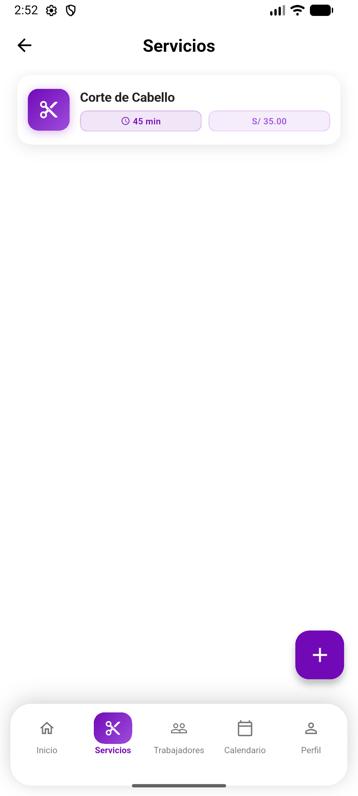<br><em>Gestión de servicios del salón</em></td>
    <td align="center">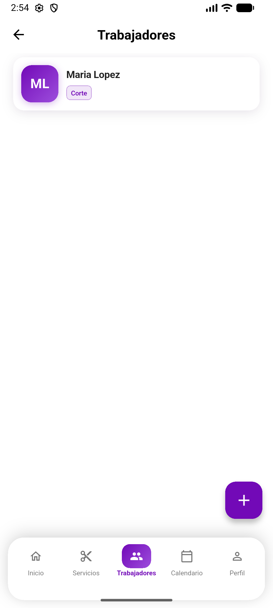<br><em>Gestión del equipo de trabajo</em></td>
    <td align="center">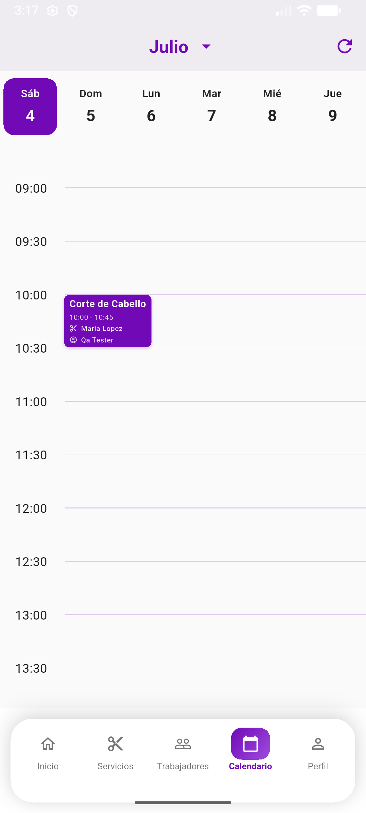<br><em>Agenda con la reserva del cliente reflejada automáticamente</em></td>
  </tr>
</table>

**UE04 — Flujo directo de reserva en la app (App de Cliente)**

El cliente completa una reserva íntegramente desde la aplicación —descubre el salón, selecciona profesional y elige fecha y hora disponible— sin depender de una conversación inicial por WhatsApp.

<table>
  <tr>
    <td align="center">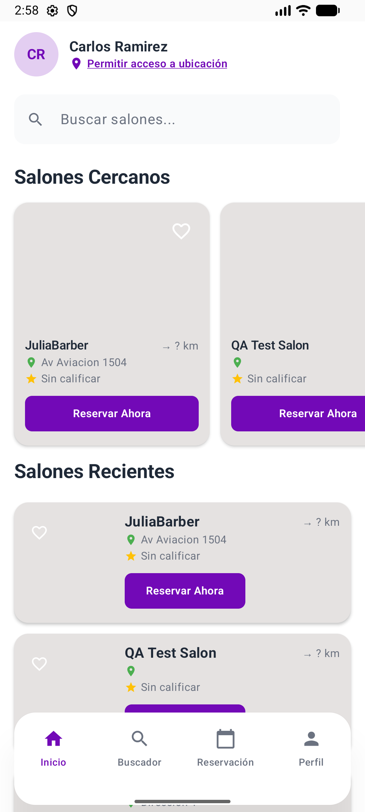<br><em>Descubrimiento de salones</em></td>
    <td align="center">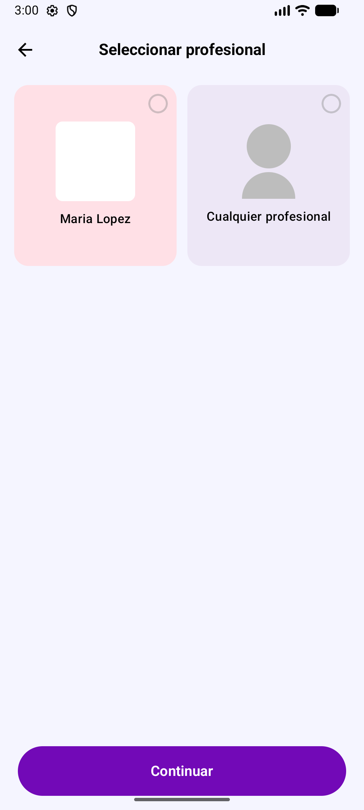<br><em>Selección de profesional</em></td>
    <td align="center">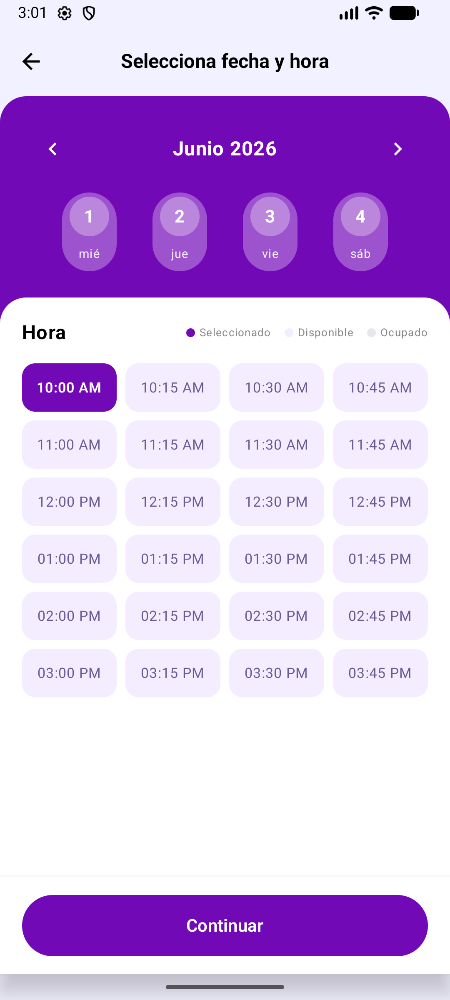<br><em>Selección de fecha y hora</em></td>
  </tr>
</table>

**UE03 — Confirmación o pago digital de reserva (App de Cliente)**

El cliente confirma y paga digitalmente su reserva mediante la pasarela de pago integrada (Stripe). Al completarse el pago, la reserva queda registrada y visible tanto para el cliente como para el negocio.

<table>
  <tr>
    <td align="center">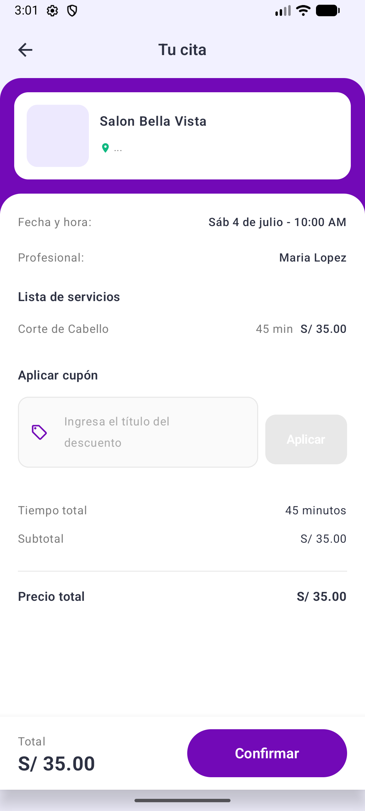<br><em>Resumen de la cita a confirmar</em></td>
    <td align="center">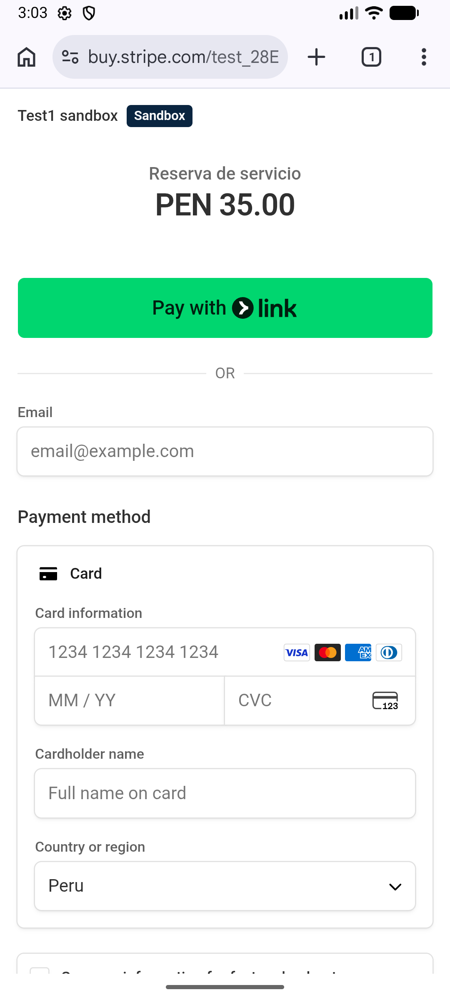<br><em>Pago digital (pasarela Stripe)</em></td>
  </tr>
  <tr>
    <td align="center">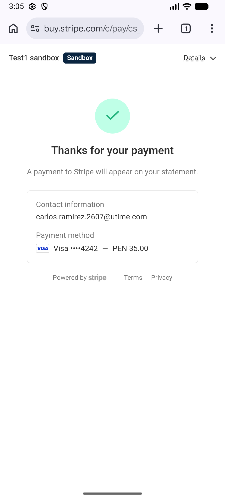<br><em>Confirmación de pago exitoso</em></td>
    <td align="center">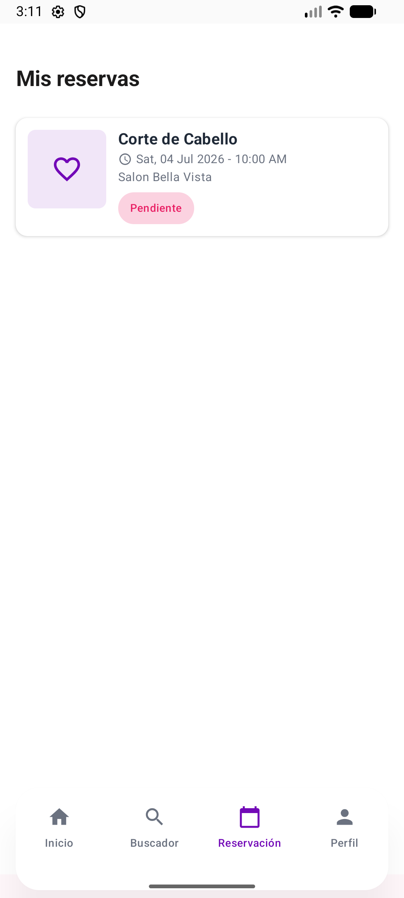<br><em>Reserva registrada en "Mis reservas"</em></td>
  </tr>
</table>

**UE05 — Perfil con reseñas y portafolio visual (App de Cliente)**

El cliente consulta el perfil del salón, su calificación promedio y las reseñas de otros clientes antes de reservar, reforzando la confianza en su elección.

<table>
  <tr>
    <td align="center">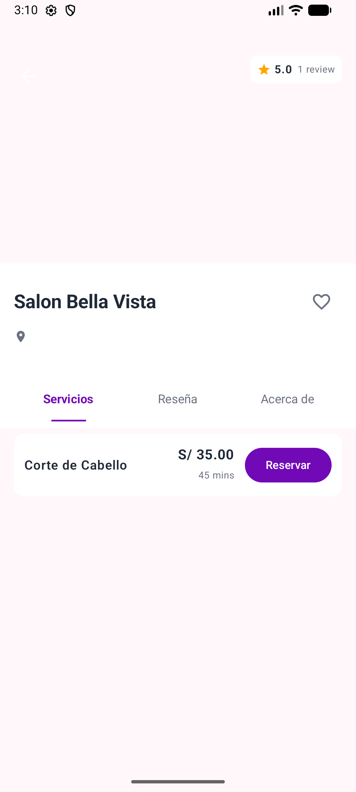<br><em>Perfil del salón con calificación</em></td>
    <td align="center">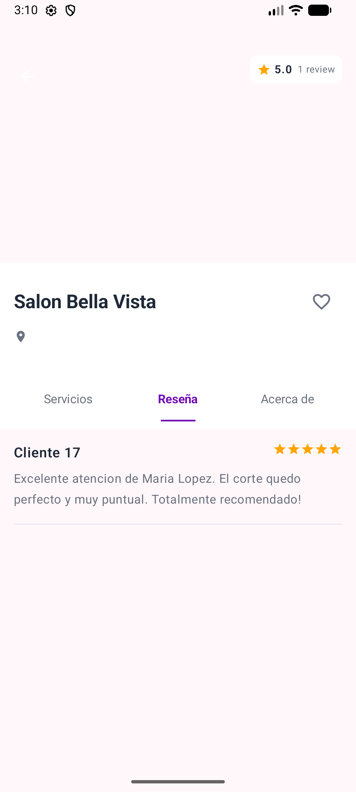<br><em>Reseña y calificación del cliente</em></td>
  </tr>
</table>

**UE02 — Recordatorios automáticos de citas (App de Proveedor)**

Un trabajo programado en el backend revisa las reservas cuya cita comienza dentro de las próximas 24 horas y genera automáticamente un recordatorio para el cliente y para el negocio. El proveedor visualiza estos recordatorios, con datos reales de la reserva, en su pantalla de notificaciones dentro de la app.

<table>
  <tr>
    <td align="center">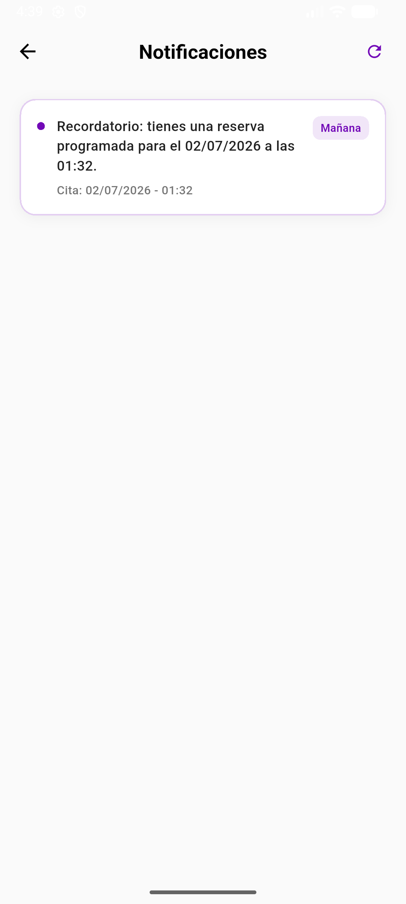<br><em>Recordatorio automático de una cita próxima, generado por el backend y mostrado al proveedor</em></td>
  </tr>
</table>

#### 8.3.3.5. Implemented To-Be RESTful API and/or Serverless Backend Evidence

El backend Spring Boot está desplegado en **Azure App Service** y expone una API REST documentada con **OpenAPI / Swagger UI** (`/swagger-ui/index.html`). A continuación se muestra la documentación viva de los endpoints que dan soporte a cada feature del To-Be backlog.

**Vista general de la API**

<div style="text-align: center; margin-top: 1rem; margin-bottom: 1rem;">

</div>

**Reservations y Time Slots — UE01 (agenda) y UE04 (flujo de reserva)**

Endpoints para crear y consultar reservas y la disponibilidad de horarios que alimentan la agenda del proveedor y el flujo de reserva del cliente.

<div style="text-align: center; margin-top: 1rem; margin-bottom: 1rem;">

<br><br>
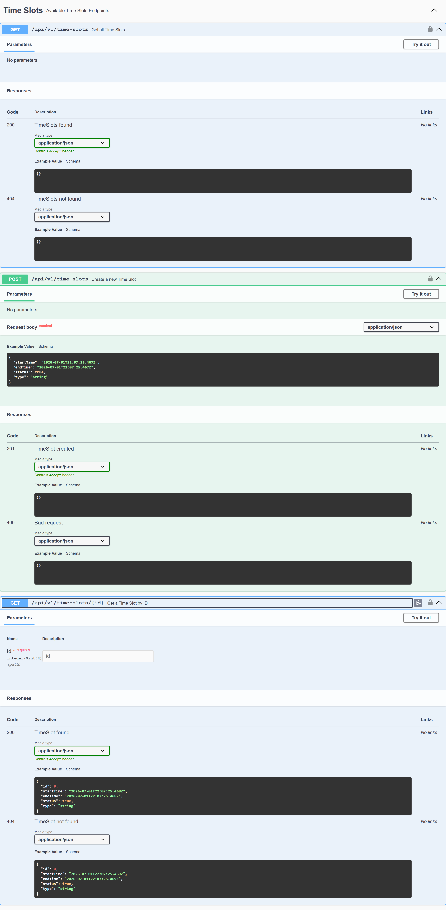
</div>

**Payments — UE03 (confirmación o pago digital)**

Endpoints de pago, incluyendo la creación del enlace de pago (Stripe) y el webhook de confirmación.

<div style="text-align: center; margin-top: 1rem; margin-bottom: 1rem;">

</div>

**Notifications — UE02 (recordatorios automáticos)**

Endpoints que exponen los recordatorios generados automáticamente por el job programado del backend, para proveedor y cliente.

<div style="text-align: center; margin-top: 1rem; margin-bottom: 1rem;">
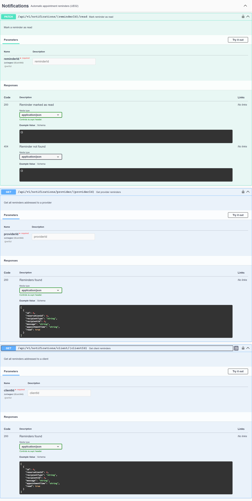
</div>

**Reviews — UE05 (perfil con reseñas)**

Endpoints para crear y consultar las reseñas que se muestran en el perfil del salón.

<div style="text-align: center; margin-top: 1rem; margin-bottom: 1rem;">
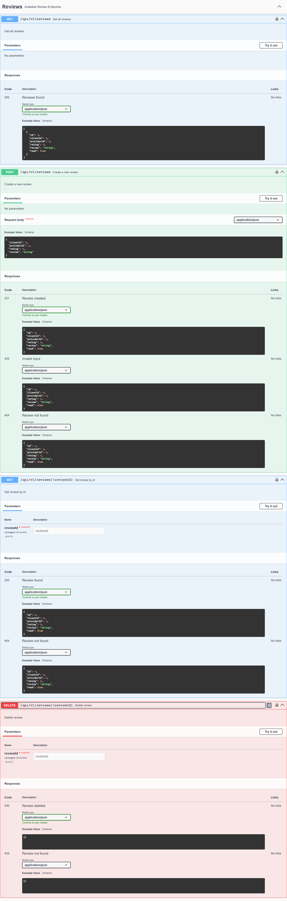
</div>

#### 8.3.3.6. Team Collaboration Insights

<div style="text-align: center; margin-top: 1rem; margin-bottom: 1rem;">

Actividad de colaboración durante la fase experimental.


</div>

### 8.3.4. To-Be Validation Interviews

#### 8.3.4.1. Diseño de Entrevistas

**Segmento 1 (Salones de Belleza y Barberías):**

1. ¿Consideras que el usar la agenda digital centralizada que ayudó a visualizar mejor tus citas? ¿Qué ventajas ves frente a usar aplicaciones de mensajería?
2. ¿En que medida la agenda digital te ayudó a identificar huecos disponibles o cambios de horario con mayor claridad que tu método actual de gestión?
3. ¿Qué tan dispuesto estarías a usar uTime como herramienta principal para gestionar las reservas de tu negocio después de esta prueba?
4. ¿Los recordatorios automáticos recibidos 24 horas antes de cada cita te resultaron útiles para prepararte y reducir olvidos o cambios de último momento? ¿De qué forma?
5. ¿Consideras que los recordatorios enviados también a tus clientes mejoraron la puntualidad y la asistencia a las citas agendadas?
6. Cuando un cliente reserva desde la app, ¿te resulta claro ver la cita reflejada en tu panel y distinguir si está confirmada o pendiente de pago? ¿Qué cambiarías de la presentación?
7. ¿Te genera confianza que el cliente pueda confirmar o pagar digitalmente su reserva antes de asistir? ¿Crees que esto reduciría cancelaciones o ausencias?
8. ¿Percibes que aparecer en el listado de salones de uTime y recibir reservas directas desde la app aumenta la visibilidad de tu negocio frente a depender solo de redes sociales, mensajería o difusión voca a voca?
9. ¿El flujo para revisar las reservas entrantes desde la aplicación es suficientemente simple como para incorporarlo a tu rutina diaria de trabajo?
10. ¿Cuál crees que sería tu beneficio principal al adoptar de forma permanente la aplicación con las mejores realizadas?

**Segmento 2 (Clientes de servicios de belleza):**

1. ¿En qué medida te resultó sencillo encontrar un salón o barbería en el listado de uTime y filtrar opciones según el servicio que buscabas? ¿Qué dificultades encontraste, si las hubo?
2. Al completar la reserva directamente en la app, ¿qué pasos del flujo te resultaron más claros y cuáles generaron mayor fricción frente a coordinar por WhatsApp o llamada?
3. ¿Cómo compararías la velocidad y claridad del flujo de reserva en uTime con tu experiencia habitual de agendar citas por mensajería? ¿Qué ventajas o desventajas identificas en cada canal?
4. ¿Los recordatorios automáticos recibidos antes de tu cita contribuyeron a que te organices mejor? ¿De qué forma te ayudarían a evitar olvidos o reprogramaciones de último momento?
5. Al confirmar tu reserva con un botón o al pagar digitalmente desde la app, ¿qué nivel de comodidad y confianza experimentaste y qué aspecto del proceso te generó mayor o menor seguridad?
6. ¿En qué medida la opción de confirmación o pago digital refuerza tu compromiso con la cita reservada? ¿Crees que esto reduciría la probabilidad de cancelar o no asistir?
7. Al visitar el perfil de un salón o estilista, ¿qué elementos influyeron más en tu nivel de confianza antes de reservar?
8. ¿Qué información adicional del perfil te habría resultado útil para tomar la decisión?
9. ¿Qué tan probable es que uses uTime para tu próxima cita de belleza o barbería en lugar de contactar al negocio por WhatsApp? ¿Qué factores influenciarían en esa decisión?
10. ¿Cuál consideras que sería tu beneficio principal al adoptar de forma permanente el uso de la aplicación uTime con las mejoras aplicadas?

#### 8.3.4.2. Registro de Entrevistas

### Segmento Objetivo 2 (Clientes de servicios de belleza)

#### Datos del Entrevistado #1

- **Nombre completo:** Emily Juliette Arroyo Gonzales
- **Segmento Objetivo:** Clientes de servicio de belleza
- **Edad:** 20 años
- **Distrito:** Santiago de Surco
- **Inicio de la entrevista:** [Pendiente]
- **Entrevistador:** Roman Cruz, Natalia Bertha
- **Screenshot del cuadro de video:** 

- **URL del video (Microsoft Stream):**

[Pendiente]

**Resumen:**

Emily Arroyo, estudiante de Ingeniería de Software, participó en la validación To-Be de uTime tras probar la aplicación con las nuevas funcionalidades implementadas. Sobre el **listado y filtros**, indicó que encontrar salones y barberías fue sencillo y que los filtros le permitieron comparar opciones de forma rápida y organizada. Aquí, su +unica recomendación fue incorporar más filtros de búsqueda. En el **flujo de reserva directa**, destacó como pasos claros la elección del servicio, del profesional y del horario, comparó favorablemente la experiencia frente a WhatsApp al no depender de esperar confirmación y poder completar la reserva en pocos minutos. Respecto a la **velocidad y claridad** del canal, calificó uTime como más rápido y eficiente que la mensajería porque toda la información está disponible de inmediato. Los **recordatorios automáticos** los consideró muy útiles para organizar su agenda, recordar la fecha y hora de su cita con anticipación y reprogramar con tiempo si es que surge un imprevisto. Sobre **confirmación y pago digital**, expresó confianza y seguridad en el proceso dado que la confirmación inmediata le daba certeza de que la cita quedó registrada y el pago digital le aportó comodidad al evitar coordinar el cobro por otros medios. Emily considera que confirmar o pagar refuerza su **compromiso** con la cita y reduciría cancelaciones de último momento. Al revisar el **perfil del salón o estilista**, las calificaciones, reseñas, fotografías de trabajos, horarios y precios fueron los elementos que más influyeron en su confianza; sugirió añadir opiniones más recientes, descripción del estilista, tiempo estimado por servicio y paquetes especiales. Manifestó que es **muy probable** que use uTime para su próxima cita en lugar de aplicaciones de mensajería por la rapidez y organización del flujo. Considera su **beneficio principal** al adoptar la app de forma permanente el ahorrar tiempo y tener una experiencia de reserva más organizada, con consulta de horarios, comparación de opciones, confirmación y recordatorios integrados.

#### Datos del Entrevistado #2

- **Nombre completo:** Anedyib Villar Bisso
- **Segmento Objetivo:** Clientes de servicio de belleza
- **Edad:** 21 años
- **Distrito:** San Isidro
- **Inicio de la entrevista:** [Pendiente]
- **Entrevistador:** Roman Cruz, Natalia Bertha
- **Screenshot del cuadro de video:** 

- **URL del video (Microsoft Stream):**

[Pendiente]

**Resumen:**

Anedyib Villar, estudiante de Marketing de 21 años, participó en la validación To-Be de uTime tras probar la aplicación con las mejoras del Capítulo VIII. Sobre el **listado y filtros**, indicó que le resultó muy fácil navegar el listado y usar los filtros por servicio, al estar acostumbrada al uso de aplicaciones digitales. En el **flujo de reserva directa**, no reportó fricción puesto que la página web guió sus pasos de forma clara y completó la reserva sin dificultad frente a los problemas de coordinación por lo que pasó antes a través de aplicación de mensajería o llamadas. Al **comparar canales**, mencionó que es su primera experiencia con este tipo de plataforma, valoró la ventaja de reservar en línea desde cualquier lugar con internet y contrastó favorablemente con su hábito previo de agendar solo por teléfono, donde bastaba con fijar la cita y era fácil olvidarla. Los **recordatorios automáticos** le ayudaron mucho dado que se considera olvidadiza. Respecto a la **confirmación y pago digital**, como estudiante de marketing digital expresó confianza en operaciones en línea, aunque reconoció que otros públicos podrían sentir desconfianza según su perfil. Considera que pagar por adelantado **refuerza el compromiso** con la cita frente a un acuerdo verbal por teléfono sin consecuencia económica. En cuandto al **perfil del salón o estilista**, las imágenes del local y del trabajo realizado fueron el factor que más influyó en su confianza. Sobre información adicional, indicó que, al ser su primera vez con este tipo de app, la información mostrada le resultó suficiente. Manifestó que **sí usaría uTime** para su próxima cita de belleza y que el **recordatorio** es el factor que más influiría en su decisión. Su **beneficio principal** sería asistir con mayor puntualidad a las citas programadas y evitar olvidarlas.

#### Datos del Entrevistado #3

- **Nombre completo:** Diego Vilca Saboya
- **Segmento Objetivo:** Clientes de servicio de belleza
- **Edad:** 19 años
- **Distrito:** Villa El Salvador
- **Inicio de la entrevista:** [Pendiente]
- **Entrevistador:** Roman Cruz, Natalia Bertha
- **Screenshot del cuadro de video:** 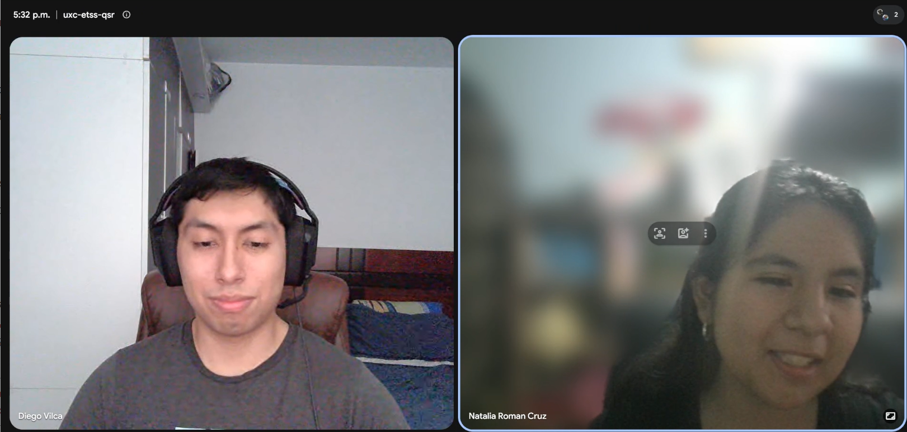

- **URL del video (Microsoft Stream):**

[Pendiente]

**Resumen:**

Diego Vilca, estudiante de Ingeniería de Software de 19 años, evaluó la versión To-Be de uTime centrándose en las mejoras orientadas a la experiencia del cliente. Al explorar el **catálogo de negocios**, describió la búsqueda y el filtrado por tipo de servicio como intuitivos y sin obstáculos. Durante la **reserva en la aplicación**, resaltó que definir fecha y hora resultó más directo que negociar disponibilidad por chat o llamada, donde suele haber contrapropuestas del barbero y es más difícil llegar a un acuerdo. Frente a su método habitual por **mensajería**, valoró que uTime elimina la espera de respuesta, puesto que al estar automatizado el proceso, agenda y confirma en un solo recorrido. En cuanto al **cobro en línea**, manifestó comodidad al usar una pasarela conocida, lo que le transmitió la mayor sensación de respaldo durante el flujo. Además, entiende que **confirmar la asistencia** no solo fija su propio compromiso, sino que permite al negocio anticipar una inasistencia. Al analizar el **perfil del establecimiento**, las imágenes de un local limpio y ordenado fueron decisivas para generarle confianza. Por otro lado, propuso complementar la ficha con testimonios de clientes y la trayectoria del profesional. Planea **recurrir a uTime** en su próximo servicio, sobre todo si se traslada a una zona donde no tenga referencias ya que podría conocer barberías, estilos de corte y condiciones del local sin depender de recomendaciones previas. Para él, el **valor más alto** al adoptar la plataforma de forma continua es agendar con rapidez y consultar de antemano qué días tienen cupo, evitando llegar a un local saturado sin haber verificado disponibilidad.


## 8.4. Experiment Aftermath & Analysis

### 8.4.1. Analysis and Interpretation of Results

Tras ejecutar las entrevistas de validación To-Be del **Segmento Objetivo 2 (Clientes de servicios de belleza)**, el equipo consolidó la evidencia cualitativa de los participantes, quienes probaron la versión de uTime con las mejoras implementadas. El análisis siguiente sigue contrasta los hallazgos con las Experiment Cards **EXP02–EXP05** que cubren las funcionalidades evaluadas desde el lado del cliente.

**Análisis del Segmento Objetivo 02 — Validación To-Be**

- **Características objetivas de la muestra:**
  - Edades entre 19 y 21 años; residentes en distritos de Lima Metropolitana.
  - Perfil digital alto: los tres se identifican como usuarios cómodos con aplicaciones y plataformas en línea.
  - Métodos previos de agendamiento: WhatsApp, llamadas y/o mensajería.
  - Los tres completaron el flujo de reserva en la aplicación y manifestaron intención de usar uTime en su próxima cita.

- **Hallazgos por funcionalidad validada:**

  - **Listado de salones y filtros.** Los tres entrevistados describieron la búsqueda y el filtrado por servicio como sencillos e intuitivos. Emily sugirió ampliar los criterios de filtrado, mientras que los demás no reportaron fricción en esta etapa.
  - **Flujo directo de reserva.** Los tres compararon favorablemente uTime frente a WhatsApp, llamadas o chat, destacando la eliminación de la espera de respuesta, la visibilidad inmediata de horarios y la posibilidad de cerrar la reserva en un solo recorrido. Diego resaltó que elegir fecha y hora evita el ida y vuelta con el barbero. Por otro lado, Anedyib valoró reservar desde cualquier lugar con internet frente a acordar por teléfono y olvidar la cita.
  - **Recordatorios automáticos.** Emily y Anedyib evaluaron positivamente los recordatorios, pues les ayudan a organizarse, recordar la cita con anticipación y reprogramar si surge un imprevisto. Anedyib identificó el recordatorio como el factor que más influiría en su decisión de uso futuro.
  - **Confirmación y pago digital.** Los tres asociaron la confirmación o el pago en línea con mayor compromiso y seguridad respecto a un acuerdo verbal por mensajería o llamada. Emily y Diego expresaron comodidad con el paso de pago. Anedyib, desde su formación en marketing digital, confía en operaciones en línea pero advirtió que otros públicos podrían percibir fricción o desconfianza.
  - **Perfil enriquecido del negocio.** Los tres indicaron que el contenido del perfil influye en su confianza antes de reservar. Emily priorizó reseñas, calificaciones, fotografías, horarios y precios. Anedyib y Diego enfatizaron las imágenes de un local cuidado y ordenado. Como mejoras, se mencionaron opiniones recientes, descripción del estilista, duración estimada del servicio, paquetes especiales, testimonios de clientes y años de experiencia del profesional.

- **Características subjetivas recurrentes:**
  - **Valor percibido principal:** Ahorro de tiempo y mayor organización del proceso de reserva.
  - **Barrera histórica:** Demora o dependencia de la respuesta del negocio por canales manuales.
  - **Disposición de adopción:** Los tres declararon que usarían uTime para su próxima cita de belleza o barbería en lugar de contactar por WhatsApp.
  - **Oportunidad de descubrimiento:** Diego destacó el valor de la plataforma al mudarse a una zona sin referencias locales, pudiendo evaluar barberías, estilos y disponibilidad sin depender del boca a boca.

**Síntesis general**

Las entrevistas To-Be del segmento cliente aportan evidencia cualitativa **consistente y favorable** hacia las mejoras implementadas en uTime. El flujo directo de reserva y la visibilidad del catálogo de negocios (EXP04) obtuvieron la señal más uniforme el que los tres participantes preferirían uTime frente a aplicaciones de mensajería para su próxima cita. Los recordatorios (EXP02), la confirmación o pago digital (EXP03) y los perfiles enriquecidos (EXP05) también recibieron valoración positiva de parte de los entevistados, indicando que mejorarían su experiencia y se sentirían más dispuestos a usarla en el día a día.

### 8.4.2. Re-scored and Re-prioritized Question Backlog

| # Orden | Question ID | Pregunta |
|---------|-------------|----------|
| 1 | Q04 | ¿Qué canal genera mayor intención de reserva inicial: flujo directo en la app o contacto por WhatsApp? |
| 2 | Q02 | ¿Reducirán los recordatorios automáticos los olvidos, cancelaciones tardías o reprogramaciones de citas? |
| 3 | Q03 | ¿Incrementará la confirmación o pago digital de una reserva el compromiso del cliente con la cita? |
| 4 | Q01 | ¿Ayudará una agenda digital centralizada a aumentar la disposición de los salones y barberías para gestionar reservas desde uTime? |
| 5 | Q05 | ¿Qué elementos del perfil generan mayor confianza antes de reservar: reseñas, calificaciones, precios visibles o portafolio visual? |

## 8.5. Continuous Learning

### 8.5.1. Shareback Session Artifacts: Learning Workflow

[Contenido pendiente — relato del workflow de aprendizaje compartido al equipo / stakeholders.]

<div style="text-align: center; margin-top: 1rem; margin-bottom: 1rem;">

Artefactos de la sesión de shareback.


</div>

## 8.6. To-Be Software Platform Pre-launch

### 8.6.1. About-the-Product Intro Video

[URL del video intro del producto To-Be]([URL-VIDEO-INTRO])

<div class="page"></div>

# Conclusiones

## Conclusiones y recomendaciones

A continuación se presentan las conclusiones y recomendaciones derivadas del trabajo realizado a lo largo de las entregas evaluadas: el **AV1**, que abarcó los Capítulos I (Startup y Solution Profile), II (Requirements Elicitation & Analysis), III (Requirements Specification) y IV (Product Design); el **TB1**, que abarcó los Capítulos V (Product Implementation), VI (Product Verification & Validation) y VII (DevOps Practices); y el **AV2**, que abarcó el Capítulo VIII (Experiment-Driven Development), con el cual el equipo cierra el ciclo trasladando el producto desde la implementación y validación hacia un enfoque de experimentación con usuarios reales.

### Conclusiones

El AV1 permitió consolidar la base estratégica, de producto y de diseño de uTime, estableciendo un descubrimiento de producto sólido sobre el cual construir las fases de implementación y validación.

- Se identificó con éxito el **Startup Business Model** de PaxTech mediante el Startup Profile (misión, visión y perfiles del equipo) y el Solution Profile de uTime, alineando la propuesta de valor con las necesidades del sector de la belleza.
- La aplicación del framework **5W+2H** permitió enmarcar la problemática del agendamiento manual de citas con datos cuantitativos del sector, evitando supuestos no sustentados.
- El proceso **Lean UX** completo (Problem Statements, Assumptions, Hypothesis Statements y Lean UX Canvas) entregó un marco coherente para guiar las decisiones de producto desde el descubrimiento hasta el diseño.
- La definición de dos segmentos objetivo claramente diferenciados (salones/barberías y clientes finales) permitió perfilar requisitos y experiencias específicas para cada lado del marketplace.
- El **análisis competitivo** del Capítulo II evidenció oportunidades de diferenciación en gestión de citas en tiempo real, perfiles profesionales detallados y reseñas verificadas frente a soluciones genéricas como Google Calendar o redes sociales.
- Las **entrevistas** y la fase de **Needfinding** (User Personas, Empathy Map, As-Is/To-Be Scenario Maps, Journey Maps y User Task Matrix) confirmaron las hipótesis Lean UX y aportaron evidencia cualitativa de los puntos de dolor de profesionales y clientes.
- La definición del **Ubiquitous Language** estableció un vocabulario compartido entre negocio, producto e ingeniería que reducirá ambigüedades en la implementación posterior.
- El **Product Backlog** priorizado, las User Stories con criterios de aceptación, el Impact Mapping y el To-Be Scenario Mapping del Capítulo III entregaron una especificación trazable desde objetivos de negocio hasta entregables técnicos.
- El diseño UX/UI del Capítulo IV (Style Guidelines, Information Architecture, wireframes, mockups y prototipos) cubrió de forma consistente las **dos plataformas objetivo**, aplicación móvil y aplicación web, garantizando una experiencia coherente entre dispositivos.
- La arquitectura **Domain-Driven Design**, junto con el diseño orientado a objetos y el modelo de base de datos, sentaron las bases técnicas necesarias para soportar la solución multiplataforma con escalabilidad y separación clara de bounded contexts.
- En el **Capítulo V (Product Implementation)** el equipo configuró un entorno multi-stack coherente (Angular para web, Flutter para la app del cliente, Kotlin nativo para la app del negocio y Spring Boot con PostgreSQL en Neon para el backend), aplicó **GitFlow + Conventional Commits + Semantic Versioning** sobre los siete repositorios de la organización `paxtech-2026-10` y entregó el Sprint #1 con la landing page desplegada en GitHub Pages junto con el Acuerdo de Servicio SaaS (uptime objetivo 99.5%, soporte, seguridad TLS + Ley 29733, planes Free/Pro/Business).
- En el **Capítulo VI (Product Verification & Validation)** se ejecutaron pruebas unitarias y de integración por bounded context (IAM, Profiles, Workers, Services, Reservations, Reviews) sobre los cuatro codebases del producto (Spring Boot, Flutter, Kotlin nativo, Angular), se automatizaron seis escenarios BDD con Cucumber + Playwright y se consolidó la suite de nueve **system tests** Playwright (SYS-01 a SYS-09) pasando contra la app web; además, las **entrevistas de validación** y las evaluaciones según **heurísticas de Nielsen** confirmaron empíricamente las hipótesis Lean UX definidas en el Capítulo II.
- En el **Capítulo VII (DevOps Practices)** se formalizó la cadena de Continuous Integration con los workflows `main_paxtech.yml` y `frontend-ci.yml`, el Continuous Delivery hacia el slot de staging en Azure, el Continuous Deployment a producción con cada push a `main` y un esquema inicial de Continuous Monitoring con alertas y notificaciones, cerrando el ciclo de feedback entre código, despliegue y operación.
- En el **Capítulo VIII (Experiment-Driven Development)** el equipo dejó de proponer funcionalidades por intuición y partió del material bruto disponible (entrevistas, As-Is Scenario Maps, hipótesis Lean UX y estado del MVP) para reunir suposiciones, brechas de conocimiento, ideas y afirmaciones, y transformarlas en **Experiment-Ready Questions** priorizadas mediante un puntaje de Confidence, Risk, Impact e Interest, consolidado en un **Question Backlog**.
- Las cinco **Experiment Cards** (EXP01–EXP05: agenda digital centralizada, recordatorios automáticos, confirmación/pago digital, flujo directo vs. WhatsApp y perfiles con reseñas y portafolio) tradujeron las preguntas más críticas en **hipótesis falsables** con su Simplest Useful Thing, medidas, condiciones experimentales y escalas de decisión, evitando presentar como validado aquello que aún debe comprobarse empíricamente.
- El **Experiment Design** (hipótesis con su hipótesis nula, Domain Business Metrics, measures, conditions y scale calculations) junto con las **To-Be User Stories** y el To-Be Product Backlog priorizado por Story Points conectaron cada experimento con una métrica de negocio y un entregable de software trazable, garantizando que la experimentación sirva para decidir qué escalar y no solo para construir.

### Recomendaciones

Para mantener la calidad alcanzada en el AV1 y minimizar riesgos en las entregas posteriores, el equipo recomienda las siguientes acciones para las próximas fases del proyecto.

- Validar empíricamente las **Hypothesis Statements** de Lean UX mediante experimentos cortos durante la implementación, en lugar de asumirlas resueltas con el diseño.
- Ampliar la muestra de **entrevistas** con segmentos adicionales (estilistas independientes sin local, clientes ocasionales) para reducir sesgo y reforzar las personas existentes.
- Mantener la **trazabilidad** Impact Map → User Story → criterio de aceptación → tarea de backlog en una herramienta única para evitar divergencias entre el informe y el desarrollo real.
- Iterar los **prototipos móvil y web** con pruebas de usabilidad reales antes de pasar a implementación, priorizando los flujos críticos de reserva y gestión de agenda.
- Tratar el **Ubiquitous Language** como un glosario vivo: versionarlo en el repositorio y actualizarlo cada vez que aparezca un término nuevo en entrevistas, historias de usuario o código.
- Refinar las **User Stories** con criterios de aceptación en formato Given/When/Then antes de iniciar el sprint de implementación, para habilitar pruebas BDD desde el inicio.
- Consolidar las **Style Guidelines** en un sistema de design tokens compartido entre la app móvil y la app web, evitando divergencias visuales entre ambas plataformas.
- Configurar tempranamente la **integración continua** con linters, pruebas unitarias y validación de convenciones (Conventional Commits y GitFlow definidos en CLAUDE.md) para evitar deuda técnica acumulada.
- Cuidar el **rendimiento en móvil** desde el diseño: limitar el peso de imágenes, planificar carga diferida y considerar conectividad intermitente, dado que muchos profesionales operan en zonas con red inestable.
- Mantener sincronización del equipo mediante revisiones de pares, PRs pequeños y comunicación constante en los hitos del proyecto, asegurando que cada integrante avance según los criterios del Student Outcome (7.c1 y 7.c2).
- Adoptar la **suite BDD (Cucumber + Playwright)** como criterio de aceptación obligatorio antes del merge a `develop`, ampliando la cobertura actual de seis bounded contexts a los escenarios faltantes en Reservations end-to-end y Payments con el sandbox de Stripe.
- Consolidar los cuatro codebases (backend Spring Boot, app Flutter cliente, app Kotlin negocio y web Angular) bajo un único workflow de CI con *dependency caching* y ejecución paralela por proyecto, reduciendo el tiempo total de build y unificando el reporte de tests.
- Establecer un **entorno de staging persistente en Azure App Service** apuntado a una base de datos Neon dedicada, de modo que los acceptance tests y los system tests Playwright ataquen siempre un backend estable y no dependan del entorno local de cada integrante.
- Documentar **runbooks operativos** para la rotación de secretos JWT, claves de Stripe y restauración de backups de PostgreSQL en Neon, evitando que la respuesta a incidentes dependa de una sola persona del equipo.
- Endurecer el **Continuous Monitoring** con alertas accionables sobre latencia P95 del API, tasa de errores 5xx y disponibilidad del Azure App Service, conectadas al canal de Discord del equipo para reducir el tiempo medio de detección.
- Avanzar la integración de **Stripe** desde la modalidad sandbox a producción tras cerrar la Spike Story 1 del backlog, asegurando la firma del webhook `checkout.session.completed` que ya está implementado en el backend y reforzando las pruebas de idempotencia para reintentos del proveedor de pagos.
- Ejecutar los cinco experimentos priorizados (**EXP01–EXP05**) con usuarios reales de ambos segmentos, completando las secciones pendientes de **To-Be Validation Interviews** y **Experiment Aftermath & Analysis**, de modo que las preguntas del Question Backlog pasen de estado *Pendiente* a confirmadas o refutadas con evidencia.
- Instrumentar las **Domain Business Metrics** en Firebase Analytics y en los logs del backend desde el arranque de cada experimento (intención de reserva, tasa de cancelaciones, confianza percibida), para no depender únicamente de encuestas y poder comparar condición experimental contra condición de control.
- Respetar las **escalas de decisión** definidas en cada Experiment Card (umbrales del 40%, 20%, 15%, etc.) como criterio objetivo para escalar, iterar o descartar una funcionalidad, manteniendo el principio de ser *data informed, not data driven* y evitando dejarse llevar por métricas de vanidad.
- Mantener el **entendimiento compartido** durante la fase experimental mediante kick-offs por experimento, asegurando que todo el equipo (no solo quien diseña la Experiment Card) acuerde qué se quiere aprender, por qué y cómo se medirá antes de lanzar cada prueba.

<div class="page"></div>

# Video App Validation

[URL del video de validación de la aplicación]([URL-VIDEO-VALIDATION])

<div class="page"></div>

# Video About-the-Team

[URL del video About-the-Team]([URL-VIDEO-TEAM])

<div class="page"></div>

# Bibliografía

<div style="text-indent: 30px;">
Araya, F., Balestrini, M., Blandón, C., Henriquez P. & Torrico, B. (2025). El poder de los datos: Impulsando la transformación digital de las pymes de América Latina. https://blogs.iadb.org/innovacion/es/el-poder-de-los-datos-impulsando-la-transformacion-digital-de-las-pymes-de-america-latina/

Expo Belleza Fest. (2016). Más del 60% de los estilistas en México trabajan de manera independiente. https://bellezafest.blogspot.com/2016/12/mas-del-60-de-los-estilistas-en-mexico.html

Telefónica. (2022). La digitalización de las empresas repercute hasta un 25% en su productividad. https://www.telefonica.com/es/sala-comunicacion/blog/la-digitalizacion-de-las-empresas-repercute-hasta-un-25-en-su-productividad/

What is Figma? (2019). Figma Learn - Help Center. https://help.figma.com/hc/en-us/articles/14563969806359-What-is-Figma

Structurizr. (2025). https://structurizr.com/ 

Lucidchart | Diagramas creados con inteligencia. (2025). Lucidchart. https://www.lucidchart.com/pages/es/landing?utm_source=google&utm_medium=cpc&utm_campaign=_chart_es_tier2_mixed_search_brand_phrase_&km_CPC_CampaignId=1501207844&km_CPC_AdGroupID=63362152012&km_CPC_Keyword=%2Blucidchart%20%2Bsoftware&km_CPC_MatchType=b&km_CPC_ExtensionID=&km_CPC_Network=g&km_CPC_AdPosition=&km_CPC_Creative=286846989106&km_CPC_TargetID=kwd-375017978385&km_CPC_Country=9186211&km_CPC_Device=c&km_CPC_placement=&km_CPC_target=&gad_source=1&gbraid=0AAAAADLdSjCGPJBFHw9InHN-Qfss5OfWy&gclid=Cj0KCQjwoNzABhDbARIsALfY8VPCJ6QSDWkzARgPQcf7VUOTXMJ-PZWXoYd1OdiqYtYOFsopUiaeMW8aAifbEALw_wcB

Videoconferencia, reuniones, llamadas | MicrosoftTeams. (2025). https://www.microsoft.com/es-es/microsoft-teams/group-chat-software

Build software better, together. (2025). GitHub. https://github.com/about

Gothelf, J., Seiden, J., & Ries, E. (2014). Lean UX: cómo aplicar los principios Lean a la mejora de la experiencia de usuario. https://reunir.unir.net/handle/123456789/4506 


Hunter-Zinck, H., De Siqueira, A. F., Vásquez, V. N., Barnes, R., & Martinez, C. C. (2021). Ten simple rules on writing clean and reliable open-source scientific software. PLoS Computational Biology, 17(11), e1009481. https://doi.org/10.1371/journal.pcbi.1009481

Domain-Driven Design for Microservices: An Evidence-Based Investigation. (2024). IEEE Journals & Magazine | IEEE Xplore. https://ieeexplore.ieee.org/abstract/document/10495888 

</div>

<div class="page"></div>

# Anexos

**Repositorios**

- Informe del proyecto: <https://github.com/paxtech-2026-10/utime-project-report>
- Landing Page (repositorio): <https://github.com/paxtech-2026-10/Landing-Page>
- Landing Page (desplegada): <https://paxtech-2026-10.github.io/Landing-Page/>
- Backend Web Services: <https://github.com/paxtech-2026-10/Web-Services>
- Fake API: <https://github.com/paxtech-2026-10/fake-api>
- Mobile App — Cliente (Flutter): <https://github.com/paxtech-2026-10/Mobile-App>
- Mobile App — Negocio (Kotlin nativo): <https://github.com/paxtech-2026-10/Ios-Mobile-App>
- Acceptance Tests (Cucumber + Gherkin): <https://github.com/paxtech-2026-10/Acceptance-Tests>

**Deployments**
- Backend Web Services (Azure Web App): <https://paxtech-ashgghgnf7fpfxe9.canadacentral-01.azurewebsites.net/swagger-ui/index.html#/>

**Herramientas de diseño y gestión**

- Figma (UI design): <https://www.figma.com/design/2RXg2e7OWrAbqYfNcw2EVP/UTIME>
- Figma (prototipo interactivo): <https://www.figma.com/proto/2RXg2e7OWrAbqYfNcw2EVP/UTIME>
- Trello (Sprint Backlog): <https://trello.com/b/RdzY7vOJ>

**Multimedia**

- Video *About-the-Product*: <https://youtu.be/7odg_s3aRbs>
- Video de la entrega (Microsoft SharePoint): <https://upcedupe-my.sharepoint.com/:v:/g/personal/u202210838_upc_edu_pe/IQCf_9RqgPZqT6tgUNt9jBhDAbTk8TlPAJZuQAQFchZ2Y-Q?e=Xr7bMm>
